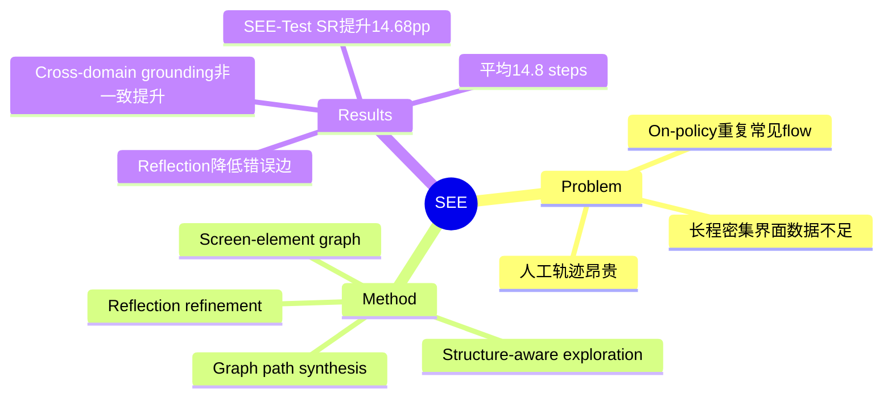

## Summary
SEE 将 GUI trajectory synthesis 拆成一次性的 structure-aware exploration 与可复用的 graph-based composition，以 screen–element transition graph 生成更长、界面元素更密集的 mobile trajectories。它证明结构复用能提高 step-level action generalization，但尚未证明图上拼接的长路径等价于包含失败恢复的真实 end-to-end long-horizon task。

## Problem & Motivation
已有 GUI 数据主要来自人类 demonstration、on-policy exploration 或逐步 LLM synthesis：前者昂贵，后两者容易重复常见 flow、遗漏 rare transition，并且每合成一条 trajectory 都要重新解析 screenshot 与规划。现代 mobile app 又具有密集相似元素、弹窗、前置状态和多级流程，短轨迹数据无法覆盖。SEE 的核心判断是把 **structure acquisition** 与 **trajectory construction** 分离：先付出交互成本建立可验证 transition graph，之后从同一结构组合多种 subgoals 和路径。

## Method
探索阶段首先用 UI parser 提取 candidate elements，并由 VLM 生成 icon / element semantics。Action ranking 同时考虑 app-category semantic alignment、top/bottom bar 等 layout prior、history-based repetition penalty，并保留小概率随机探索。Screen observations 通过稳定区域的 visual embeddings 与 bounding-box matching 映射为离散 state，形成包含 screen nodes、element nodes、transition edges 和 containment edges 的二部 graph。

每次交互后，reflection 模块判断 transition 是否真实发生、是否到达有意义的新 state，并修订 interacted element 与 edge 的语义；只有 verified edge 进入可用于 synthesis 的 graph。合成阶段先从 graph nodes 生成 ordered subgoals，再用 BFS 等 graph search 连接目标 states；trajectory length 可由 subgoal 数和 graph distance 控制。High-level task、median-level subgoal sequence 与 step-level instruction 均复用 node/edge semantics 生成，不必逐 trajectory 重读原始 screenshot。

SEE-Train 含 3,237 trajectories / 47K action steps，平均 14.8 steps；SEE-Test 含 419 trajectories / 5K steps，train/test apps 不重叠但属于相同 app categories。界面平均有 24.63 个 interactive elements，高于论文比较的 AndroidControl、AMEX、AndroidLab、UI-Genie 与 OS-Genesis。

## Key Results
- 在 disjoint-app SEE-Test 上，Qwen3-VL-4B 的 step success rate 从 62.61% 提升到 77.29%，grounding 从 60.79% 到 69.91%，action type 从 93.04% 到 97.87%；再加 retrieved context 后 SR 为 77.96%。
- Cross-benchmark 到 AndroidControl 时，Qwen3-VL-4B 的 Low/High SR 从 77.7/60.1 提升到 79.2/67.8；但 Low grounding 从 85.5 降到 84.2。UI-Genie 两个规模也出现部分 grounding 小幅下降，说明 procedural/action transfer 不保证 visual-domain grounding 同步提升。
- Reflection 把 sampled transition graph 的 incorrect-edge rate 从 27.1% 降到 9.1%（small）和从 29.6% 降到 11.1%（medium）。不过该 edge validity 由 independent multimodal LLM auditor 判断，不是 programmatic state verifier。
- Screen-node classifier 在 large graph（463 screenshots）达到 96.9% accuracy，超过 OCR matching 58.1%、pixel detection 65.2% 和 icon-feature baseline 75.4%；此项 ground truth 由 humans 标注。
- 在 DingTalk functional coverage study 中，SEE 平均 397 steps 达到 80% core-function coverage；random 与 LLM-only baseline 在预算内无法稳定达到 80%。

## Strengths & Weaknesses
**已知—亮点。** SEE 把 transition graph 变成可复用数据资产，使新增 trajectory 的边际成本从重复执行/感知转为 graph path 与轻量文本生成。多层 instruction 对齐让同一 episode 同时支持 task decomposition、step policy 与 grounding；train/test app 隔离及 AndroidControl transfer 比只在自建数据上回测更可信。论文还报告 cross-domain grounding 下降，而非只挑选正迁移指标。

**已知—边界与负结果。** 论文的 SR 是逐 step 的 action execution success，不是完整 live task outcome；平均 14.8-step graph path 因而不能直接解释为 agent 能完成 14.8-step real workflow。BFS 组合 verified local edges 会主动避免 spurious cycle，却也系统性缺少真实执行中的 interruption、失败、recovery 和不可逆副作用。Graph reflection 依赖 LLM auditor，screen-state abstraction 仍可能在动态内容、账号状态或相似页面上 alias/split。代码与数据在 v1 中仅承诺公开，未给出可访问链接。

**推测。** SEE 的真正价值可能不是生成更多 happy-path demonstrations，而是为 counterfactual data 提供基础：同一 state graph 可以系统采样 alternative path、dead end、rollback 与 first-failure fork。如果继续只取无环最短可行路径，其长程数据仍会低估 recovery 能力的重要性。

**不知道。** 尚不知道 graph construction 的总交互/LLM 成本、在 app 更新后的增量维护成本，以及用 programmatic state predicates 替代 LLM edge audit 后的数据质量变化；也没有结果证明 SEE 训练能提高 AndroidWorld 等 online task-level success。

## Mind Map

## Notes
- 可接在 [[Papers/2506-GoBrowse]] 的 structured exploration 之后：GoBrowse 强调 coverage，SEE 进一步把 graph 作为多 trajectory composition substrate。
- 与 [[Papers/2601-EvoCUA]] 的 task/state/validator co-generation 对比时，SEE 强在 transition structure reuse，弱在 outcome validator；两条路线适合结合。
- 与 [[Papers/2606-GUICrafter]] 一起说明 GUI 数据的免费监督来自环境结构，但两者分别学习 interactability prior 与 long-horizon transition graph。
