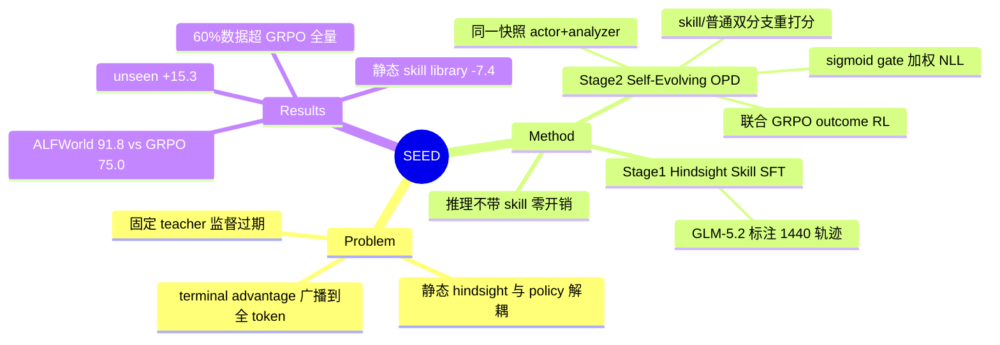

## Summary

SEED 把 on-policy 轨迹交给同一 policy 快照充当的 analyzer 提炼成自然语言 hindsight skill，再把动作 token 在"带 skill 上下文"与"普通上下文"下的 log-prob 差（confidence gate 加权）转成 token 级蒸馏信号，与 GRPO 式 outcome RL 联合优化；skill 只在训练时使用，部署零开销。Qwen2.5-3B 上 ALFWorld 91.8%（GRPO 75.0%）、WebShop 88.5（GRPO 79.8）、七个 search-QA 平均 45.7%（GRPO 36.4%），60% 数据即超 GRPO 全量。

## Problem & Motivation

Outcome-based agentic RL 的监督是稀疏、延迟、轨迹级的：GRPO/PPO 把单个 terminal advantage 广播到全部 token，无法区分哪些中间动作/工具调用真正导致成败。已有补救各有缺口：hindsight 方法把完成轨迹当静态经验或 inference-time context，与 policy 改进解耦；skill/memory library 依赖外部检索且带来部署开销；一次性 distillation 的固定 teacher 无法跟上 policy 新出现的 failure mode，监督会过期。SEED 的核心主张：完成轨迹中蕴含决策时不可得的 hindsight，且这份 hindsight 必须**随 policy 演化**而非静态存放。

## Method

**Stage 1：Hindsight Skill SFT（冷启动）**
- base policy 在 180 个训练任务上各 rollout 8 条，共 1,440 条轨迹；外部 analyzer（GLM-5.2）为每条轨迹生成自然语言 skill——成功轨迹提炼可复用 workflow，失败轨迹编码纠错/规避指引，仅保留格式合法的 skill。
- 标准 NLL 目标训练模型从轨迹输入预测 skill token，得到的 checkpoint 同时初始化 actor 和 analyzer。

**Stage 2：Self-Evolving On-Policy Distillation**
- **同一快照双角色**：冻结当前 policy 为 π_old，既做 rollout actor（每 query 采 N=8 条轨迹），又实例化为 analyzer 为每条轨迹现场生成 skill。刷新 π_old 时经验分布和 hindsight 提炼能力同步演化——这是"self-evolving"的含义。
- **OPD 信号构造**：每个采样动作 token 在两个上下文下重打分——skill 拼进 history 的 teacher 分支 vs 普通 history 的 student 分支；detach 的 log-prob 差 Δ = sg[ℓ^skill − ℓ^θ] 度量 hindsight 是否支持该 token；confidence gate g = σ(β_opd·Δ) 加权后得 OPD loss，梯度等价于 gate-weighted NLL——提升 teacher 分支背书的 token 概率。
- **联合目标**：ℒ_SEED = ℒ_rl（group-relative advantage 的 clipped PPO + KL）+ λ_opd·ℒ_opd。重打分只需对已记录轨迹做 forward pass，不需环境重交互。
- **推理时**：只用普通 history，skill 不进入部署上下文——hindsight 被内化进参数而非外挂检索。

## Key Results

- **主结果（Qwen2.5-3B）**：ALFWorld macro-avg **91.8%**（Vanilla 21.9 / GRPO 75.0 / 最强 self-distillation 基线 SDAR 84.4）；WebShop score **88.5**（GRPO 79.8 / SDAR 85.0）；7 个 search-QA（NQ/TriviaQA/PopQA/HotpotQA/2Wiki/MuSiQue/Bamboogle）平均 **45.7%**（GRPO 36.4 / SDAR 43.4）。三个规模（Qwen2.5-3B/7B、Qwen3-1.7B）12 组对比中 10 组最优或持平。
- **样本效率**：60% 训练数据（80.7）超过 GRPO 100% 数据（75.0）；40% 数据（58.9）≈ GRPO 80% 数据（58.6）。
- **泛化**：ALFWorld unseen 86.2% vs GRPO 70.9%（+15.3），Heat 子任务 +35.0。
- **Ablation（ALFWorld, 3B）**：去 Hindsight SFT −5.8；去 self-evolving OPD −4.8；**换静态 skill library −7.4（最大降幅）**——on-policy 现场生成的 skill 是最关键组件，静态 skill bank 会随 policy 演化失效。
- **训练动态**：step 40 时 SEED ~57% vs GRPO ~35%；平均 episode 长度收敛到 13 turns vs GRPO ~16。
- Baseline 覆盖 Skill-Prompt / Skill-GRPO / OPSD / Skill-SD / RLSD / SDAR 等 prompting、skill-conditioned RL 和 self-distillation 三族。

> 注：abstract 宣称 "textual and visual agentic tasks"，但主表全部为文本环境；multimodal extension（Qwen2.5-VL）在附录 C.3，本次未获取到具体数字。

## Strengths & Weaknesses

**Strengths**
- **监督信号构造干净且不需外部资源**：teacher 和 student 是同一模型，差别只在是否看到自己轨迹的 hindsight 总结——privileged-context self-distillation。不需外部强 teacher（Stage 2）、不需 reward model、不需环境重交互（纯 forward 重打分），也不需部署时检索——相比 skill library 路线（[[2606-ReSkill]] 等）省掉整套 inference-time 基础设施。
- **"hindsight 必须 on-policy"有直接证据**：静态 skill library ablation 掉 7.4 分是全文最有信息量的数字，支撑了核心 claim，也与 ReSkill 的 skill-policy conflict 诊断互证。
- 样本效率结果（60% 数据超 GRPO 全量）表明同一批轨迹里确实有 outcome-only RL 浪费掉的监督。

**Weaknesses / 边界**
- **信号是模型自评而非环境接地**：Δ 度量的是"token 与 hindsight 建议的一致性"，不是对成功的 counterfactual 贡献。skill 若错误/幻觉（尤其失败轨迹的归因），gate 只会在 skill 不抬高概率时降权，无法识别有害 skill——格式合法性是唯一过滤。自蒸馏放大自身确信错误模式的风险（self-consistency collapse）全文无分析，这与 [[2607-EvoCUA15]] 指出的 PRM 被 hack（model-judged 信号不可靠、credit 应锚定环境状态变化）是同一类隐患。
- **"self-evolving"被外部模型污染**：Stage 1 的 skill 标注来自 GLM-5.2，冷启动实质是从更强外部模型蒸馏 hindsight 能力；"w/o Hindsight SFT −5.8"无法解耦"外部知识注入"和"self-evolving 机制"各自的贡献。
- **实验规模是上一代的**：ALFWorld/WebShop/search-QA 是 3B 级模型的标准小场地，GRPO 在 3B ALFWorld 上是弱基线（75.0），+16.8 的 headline 有水分；对最强基线 SDAR 的净增益只有 3-7 分。无 OSWorld/WebArena 级有状态长程环境，≤7B 规模，方法在真实 agent 训练栈的表现未知。
- 重打分（每 token 两次 forward）+ analyzer 现场生成 skill 的开销无任何量化；无 limitation 章节；abstract 的 "visual agentic tasks" 与正文文本-only 的主表不符，轻度 overclaim。

## Mind Map

## Notes

- 与 [[2509-TreeGRPO]] 是稠密化稀疏 outcome 监督的两条正交路线：TreeGRPO 靠结构（兄弟子树回报差）造过程信号、需要环境可分支；SEED 靠 privileged-context 自蒸馏、只需对 logged 轨迹 forward——后者对有状态环境（GUI/browser）反而更友好，因为不要求 fork/restore 原语。两者原则上可叠加。
- 与 [[2607-EvoCUA15]] 的 STEPO 对照：STEPO 修 advantage 在 step 间的分配偏差但仍是均匀分摊；SEED 给出 token 级差异化信号但来源是模型自评。GUI agent 场景下"hindsight skill 蒸馏"能否替代/补充 milestone-anchored credit assignment 值得验证——但 EvoCUA-1.5 的 PRM-hacking 教训警告：model-judged 信号在难任务上可能与 outcome 脱钩。
- 与 [[2606-ReSkill]] 同一动机（skill 必须与 evolving policy 对齐）不同机制：ReSkill 把 skill 版本放进 GRPO group 在线检验，skill 仍是 inference-time 外挂；SEED 直接蒸进参数。"内化 vs 外挂"是 skill 路线的一个真分岔——内化省部署开销但丢失可解释性和可编辑性。
