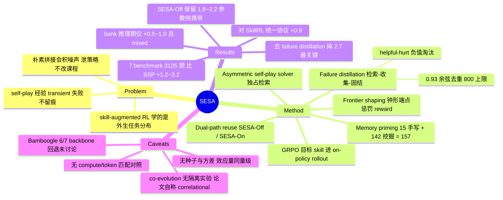

## Summary

SESA 把可检索的 procedural skill memory 放进 tool-augmented search self-play：challenger 出题、单独参数化的 solver 独占 skill 检索权解题，失败 rollout 被蒸馏成新 skill 写回一个有上限的 non-parametric bank，使技能库随自生成课程一起更新。在 7 个开放域/多跳 QA benchmark 的 3,125 道保留题上，SESA 平均准确率比 SSP 高 1.2–3.2 分。关掉 bank 的 SESA-Off 仍保留 1.8–2.2 分优势，说明大部分增益已进入策略参数，而非只是推理期 prompt 增强。

## Problem & Motivation

作者把两条自改进路线的缺陷刻画成互为镜像：zero-data self-play（SSP、Agent0、Tool-R0 等）能让 agent 自己决定练什么，但一条 trajectory 只贡献一次 policy gradient，"失败影响梯度却不显式塑造未来练习"，经验是 transient 的；skill-augmented RL（SkillRL、Skill1、SkillGraph、ARISE 等）能把经验固化成可检索的 procedural memory，但技能是从固定数据集或人工设计的课程里学的，agent 记住了自己没选择的任务的教训。

作者主张缺失的设定是二者兼有的 agent，并强调简单拼接不够：全存会积累噪声和冗余；把同一份 memory 暴露给 challenger 会泄露解题策略；只在训练后接检索则不会改变 self-play 课程。因此闭环必须决定哪些失败是可学的、谁能访问蒸馏出的教训、这些教训如何回到 on-policy 训练。

## Method

SESA 在 SSP 式 proposer–solver 自博弈骨架上维护一个 non-parametric skill bank $\mathcal{B}$，每条 skill 存为 $s=(u,c,a,z,m)$——描述、触发条件、avoidance cue（anti-pattern）、可复用 query template，以及 retrieval/helpful/hurt 计数。训练循环分四个阶段：

- **Memory priming**：用 15 条手写 skill + 142 条早期 self-play bootstrap 挖掘并去重的 skill 初始化，共 157 条，作为初始检索底座并锚定后续蒸馏与去重的粒度。
- **Asymmetric self-play**：proposer 与 solver 参数分离（沿用 Agent0 的非对称设定），只有 solver 能看到检索到的 skill。proposer 只通过 reward 反馈适应，不直接观察解题导向的 memory，避免技能泄漏进出的题目里。
- **Agentic RL objective**：两个角色都用 critic-free 的 GRPO 优化。solver 对每道题采 $G$ 条搜索 rollout，reward 是可验证的答案匹配（先归一化 exact match，否则用模型语义匹配），赋在终止 token 上。关键论证是检索上下文 $R(q;\mathcal{B}_t)$ 进入 **on-policy** rollout，因此 skill 改变的是计算 policy gradient 的轨迹分布，而不只是单次推理的条件。
- **Frontier shaping**：用 solver group 的经验成功率 $\hat{p}_s(x)$ 作为难度信号，但不硬过滤 batch，而是塑形 proposer 的 reward——钟形、端点惩罚：$\hat{p}_s\in\{0,1\}$ 时给 $-\lambda$，否则给 $4(\ell+\hat{p}_s)(h-\hat{p}_s)$（$\ell=0,h=1$）。这样同时惩罚必对与必错的题，把 challenger 持续推向 solver 能力边界。
- **Failure distillation**：三段生命周期。*Retrieval*——用 dense encoder 取 top-$k$ 最相似 skill 前置到 solver prompt，只读且对当前 bank 确定性。*Failure collection*——失败 rollout 压成含问题、target、检索证据、预测和 skill id 的记录，进入 300 条 pending 队列；每 10 步、累计 ≥20 条时启动 consolidation，最多选 30 条，优先重复失败以及"给了检索指引仍未解出"的样本。*Consolidation*——judge 把失败抽象成触发条件、区分性证据、avoidance cue 和 query template，针对既有指引遗漏的部分；候选须与 bank 及本次已入库候选的 E5-base-v2 余弦相似度 ≤0.93 才准入。seed skill 永久保留；非 seed skill 在被检索 ≥3 次后若 helpful−hurt 为负则淘汰；超过 800 条时按分数移除最低的非 seed 项。utility 由同一批 solver rollout 赋予（答对给检索到的每条 skill 加 helpful，实质性答错加 hurt，malformed 忽略），consolidation 异步执行且只在 step 边界提交，避免 bank 在产生证据的那个 batch 内变化。

**Dual-path skill reuse**：由于 skill 参与训练期 rollout，经验可同时沉淀进参数和外部 bank。SESA-Off 用训练后权重、不开 bank；SESA-On 用同一权重、开启最终 bank。SSP→SESA-Off 测的是 parametric carryover，SESA-Off→SESA-On 测的是推理期检索收益。作者明确说明 SESA 没有显式的 skill 蒸馏损失，carryover 是经验结果而非架构保证。

## Key Results

**主表（Table 1，7 个 backbone × 7 benchmark，报的是 SESA-On）**：Qwen3 系列上 SESA 比 SSP 平均高 2.3（Qwen3-4B，53.9→56.2）、2.7（Qwen3-4B-Instruct，55.2→57.9）、3.2 分（Qwen3-8B，56.3→59.5），对未训练 base 的增益分别为 10.9 / 11.8 / 7.0 分。Qwen2.5-7B-Base 与 -Instruct 上比 SSP 高 2.1 和 1.5 分。跨家族的 LLaMA-3.1-8B 达 47.5（比 SSP +1.2，比 base +10.8）。在已经过搜索专项训练的 Search-R1-7B 上从 55.7 提到 57.5。

**Dual-path 分解（Table 2）**：SESA-Off 在不检索任何 skill 的情况下，比 SSP 高 1.8（Qwen3-4B）和 2.2 分（Qwen3-8B）；重新开启同一 final bank 再加 0.5 和 1.0 分。SESA-Off 与 SESA-On 权重完全相同，差异只来自推理期检索。作者据此把结论定位为：多数平均增益驻留在训练后的策略里，bank 是"可选的、依模型与任务而变"的增强，且 dataset 级效果 mixed（相关指引有帮助，无关上下文也会干扰）。

**Component ablation（Table 3，Qwen3-4B leave-one-out）**：full 56.2；去 memory priming 降到 54.7（−1.5），去 frontier shaping 降到 54.0（−2.2），去 failure distillation 降到 53.5（−2.7，最大）。

**与 skill-augmented RL 对照（Table 4）**：在统一的搜索后端、解码与语义判分协议下，released SkillRL-Search-7B checkpoint 平均 50.1（比 Qwen2.5-7B-Instruct 的 SSP 基线高 0.6 分），SESA 达 51.0，高出 0.9 分。

**评测设定**：3,125 道保留题 = NQ / TriviaQA / PopQA / HotpotQA / 2Wiki / MuSiQue 各 500 + Bamboogle 全部 125。训练用 SSP 释出的 50,000 条 target answer 池（16,547/16,729/16,724 条一/二/三跳种子），不消费任何评测 benchmark 的问题。主指标为七个数据集分数的等权平均，先归一化 EM，未命中则由 Qwen2.5-32B-Instruct 判语义等价；greedy 解码、每题 1 条 rollout、最多 10 轮 assistant/search。实现上用 GRPO、每题 5 条 solver rollout、top-3 E5-base-v2 检索、DeepSeek-v4-pro 做 skill 蒸馏，8×A100-80GB。

> 关于"双向 co-evolution"与"增益来自 skill memory 本身"两条机制断言：独立核查判定原文未提供隔离性实验（见 Evidence Ledger C10 / C11），这两点在本笔记中按假说而非结论处理。

## Evidence Ledger

| Claim ID | Claim | Type | Source locator | Evidence excerpt | Status |
|:--|:--|:--|:--|:--|:--|
| C1 | Qwen3 三个 backbone 上 SESA 比 SSP 平均高 2.3 / 2.7 / 3.2 分，比 base 高 10.9 / 11.8 / 7.0 分 | number | Sec. Main Results "Persistent skills…"；Table 1 Avg 列 | "SESA improves average accuracy over SSP by 2.3 points on Qwen3-4B, 2.7 points on Qwen3-4B-Instruct, and 3.2 points on Qwen3-8B." | source-verified |
| C2 | LLaMA-3.1-8B 上 SESA 达 47.5，比 SSP +1.2、比 base +10.8 | number | Sec. "The gain transfers across model families."；Table 1 | "On LLaMA-3.1-8B, SESA reaches 47.5 average accuracy, improving over SSP by 1.2 points and over the base model by 10.8 points." | source-verified |
| C3 | Search-R1-7B 上 SESA 57.5 vs SSP 55.7 vs base 53.9 | number | Table 1 最后一个 block；正文同节 | "On the search-specialized Search-R1-7B initialization, it reaches 57.5 and remains above SSP" | source-verified |
| C4 | SESA-Off 比 SSP 高 1.8 / 2.2 分；开启 final bank 再加 0.5 / 1.0 分；Off 与 On 权重相同 | number | Sec. "Where Do Skill Gains Reside?"；Table 2 | "Relative to SSP, SESA-Off gains 1.8 points on Qwen3-4B and 2.2 points on Qwen3-8B… Re-enabling the same final bank adds another 0.5 and 1.0" | source-verified |
| C5 | 统一协议下 SkillRL-Search-7B 50.1、SESA 51.0，高 0.9 分 | comparison | Sec. "Comparison with Skill-Augmented RL"；Table 4 | "SkillRL reaches 50.1 average accuracy… SESA reaches 51.0 under the same protocol and outperforms SkillRL by 0.9 points." | source-verified |
| C6 | leave-one-out：56.2 → 54.7（去 priming）/ 54.0（去 frontier shaping）/ 53.5（去 failure distillation，降幅最大） | number | Table 3；Sec. Component Ablations | "Removing frontier shaping produces a larger 2.2-point drop… The largest decrease, 2.7 points, occurs without failure distillation" | source-verified |
| C7 | 评测 3,125 题 = 前六个数据集各 500 + Bamboogle 全部 125 | benchmark-setting | Sec. "Evaluation datasets." | "We evaluate on 3,125 held-out questions from seven benchmarks… We use 500 examples from each of the first six datasets and all 125 Bamboogle examples." | source-verified |
| C8 | 训练不消费任何评测 benchmark 的问题，用 SSP 释出的 50,000 target answer 池（16,547/16,729/16,724） | benchmark-setting | Sec. "Training data." | "training does not consume questions from any evaluation benchmark. We use the released SSP pool of 50,000 target answers… (16,547/16,729/16,724 seeds)." | source-verified |
| C9 | 主指标为七数据集等权平均，归一化 EM + Qwen2.5-32B-Instruct 语义判分，greedy、每题 1 rollout、≤10 轮；主表报 SESA-On | benchmark-setting | Sec. "Metrics and evaluation protocol." | "greedy decoding with one rollout per question and at most 10 assistant/search turns… Unless stated otherwise, the main table reports SESA-On." | source-verified |
| C10 | 论文用受控实验隔离了 memory→challenger 方向，从而证实双向 co-evolution 闭环 | causal-mechanism | Sec. "Evidence for Coupled Evolution"；Fig. 3 caption | "The dynamics alone are correlational, but together with the controlled ablations they support the intended mechanism" | unsupported |
| C11 | 论文用 compute-matched 或 token-matched 对照隔离了"增益来自 skill 内容"而非额外训练/采样/更长上下文 | causal-mechanism | Sec. "Models and baselines."；Table 3 | "SSP and SESA are trained from the same corresponding initialization; SESA differs only in the skill path" | unsupported |
| C12 | bank 初始 157 条（15 手写 + 142 挖掘）；pending 队列 300；每 10 步、≥20 条触发、每次至多 30；准入阈值 E5 余弦 ≤0.93；≥3 次检索后 helpful−hurt<0 淘汰；上限 800 | number | Sec. Memory Priming / Failure collection / Consolidation | "Only informative frontier failures enter a 300-record pending queue. Every 10 steps, once at least 20 have accumulated, consolidation selects at most 30" | source-verified |
| C13 | GRPO、每题 5 条 solver rollout、top-3 E5-base-v2 检索、DeepSeek-v4-pro 蒸馏、8×A100-80GB | number | Sec. "Implementation details." | "We train with GRPO using five solver rollouts per generated problem. Retrieval returns the top three E5-base-v2 records, and DeepSeek-v4-pro performs skill distillation." | source-verified |
| C14 | 正文承认 dataset 级增益不一致，但只点名两处例外（Qwen3-4B/2Wiki、Qwen3-8B/Bamboogle）；Table 1 实际有 11 个 cell 低于 SSP | comparison | Sec. "The gain transfers across model families."；Table 1 全表 | "Improvements are not uniform at the dataset level: Qwen3-4B is slightly below SSP on 2Wiki, and Qwen3-8B is lower on Bamboogle." | source-verified |
| C15 | 论文对 SkillRL 的差异化主张：SkillRL 在外生任务分布上演化 skill，SESA 把演化 memory 耦合到内生 frontier | sota-novelty | Sec. Related Work "Skill Memory and Experience Consolidation" | "SkillRL evolves skills under an exogenous task distribution, whereas SESA lets the solver's evolving memory change its behavior on an endogenous frontier" | source-verified |
| C16 | 论文为准确率报告了随机种子数 / 方差 / 误差棒 / 显著性检验 | number | Introduction；全文检索 seed / std / significance | "In the completed runs, SESA-On improves average accuracy over SSP by 2.3 points on Qwen3-4B, 3.2 points on Qwen3-8B" | unsupported |
| C17 | 代码开源于 GitHub，arXiv HTML 采用 CC BY 4.0 | license-code | Abstract 末句；License 行 | "Our code is available at https://github.com/Zenghuang-Fu/SESA-Self-Evolving-Search-Agents" | source-verified |

**降级说明（Step 4.5 裁决后处理）**：

- **C10（unsupported）**：核查确认论文给出的"coupled evolution"证据是三条间接观察——(i) SESA-Off > SSP、(ii) 去 failure distillation 掉 2.7 分、(iii) Fig. 3 的训练动态曲线（validation judge score / challenger 问题抽取成功率 / active skill 数）。没有任何实验固定 challenger 只变 bank，也没有把生成题目的分布作为 skill memory 的函数来测量；problem-extraction success rate 未按 memory 状态拆分。论文自己写明动态证据是 correlational。因此"双向 co-evolution 闭环"在本笔记中只作为架构描述与假说记录，不作为已验证结论。
- **C11（unsupported）**：论文声明 SSP 与 SESA 同初始化、同搜索后端、同答案格式、"SESA differs only in the skill path"，SESA-Off/On 共享权重。但**没有**声明匹配训练步数、匹配 rollout 数（5 条 rollout 只作为 SESA 实现细节给出）、匹配 token/算力预算或匹配 prompt 长度；也没有注入等长无关文本的 placebo 对照。唯一的"静态 vs 演化 bank"对比是 `-failure distillation` 那一行，但它同时移除了蒸馏调用，不构成算力/token 匹配。
- **C15（source-verified，但注意 claim 的范围）**：verified 的只是"原文确有此表述"——它是作者的自我定位。支撑它的实证只有 Table 4：单一 family（Qwen2.5-7B）、单一 released checkpoint、单次运行下的 0.9 分差距，不足以支撑"内生 frontier 优于外生任务分布"的机制性结论。引用时须标为 **作者主张**，不得转述为已确立的领域结论。
- **C16（unsupported）**：全文无种子数、标准差、误差棒或显著性检验；每个表格数字都是 greedy 解码、每题 1 rollout 的单点估计（"seed" 仅出现在训练池 seed 与 seed skill 语境，"std" 仅出现在 GRPO 优势归一化公式中）。Introduction 呈现 Qwen3/LLaMA 增益时使用了 "In the completed runs" 这一措辞。

## Strengths & Weaknesses

**Strengths**

1. **Off/On 分解是这篇最有方法论价值的部分**。SESA-Off 与 SESA-On 共享同一份权重、只差是否开 bank，这个对照干净地把"skill 的收益落在参数里还是外部库里"变成可测量的问题，而不是停留在争论。结论也反直觉且诚实：多数增益在参数里（1.8–2.2），bank 的推理期残值只有 0.5–1.0 且 dataset 级 mixed。这条证据对整个 skill-memory 文献都有校准作用——它暗示许多"skill library 有效"的结果可能主要是训练期塑形效应，而非部署期检索效应。
2. **skill 维护规则写得足够具体到可复现**：0.93 余弦准入阈、helpful−hurt 淘汰、≥3 次检索的资格门槛、800 条上限、step 边界异步提交（防止 bank 在产生证据的 batch 内变化）。这类工程细节在同类工作里常被省略。
3. **不把 SSP 当唯一基线**。作者明确说"因为 SESA 桥接两条线，SSP 单独不是充分基线"，并在统一协议下跑了 SkillRL released checkpoint。这个自觉在自演化方向里不常见。
4. **失败作为一等公民的设计动机清晰**：frontier shaping 不只是课程学习技巧，它同时决定了哪些失败有资格进入蒸馏队列——把"必错题产生的失败会污染 skill 库"这一点显式处理了。

**Weaknesses**

1. **标题和摘要的核心卖点（bidirectional co-evolution）没有对应实验**。摘要写"updated memory changes solver behavior and success, which changes the challenger's reward and the distribution of future problems"——这是一条四段因果链，但论文只测了链条两端的聚合结果。缺的实验其实并不难做：固定 challenger、只变 bank，看生成题目的难度分布/主题分布是否移动；或把 Fig. 3(b) 的 challenger 抽取成功率按 memory 开关拆开。论文自己承认动态是 correlational，但摘要与 contribution 列表没有对应降级。
2. **增益归因没有排除"更多计算"这个平凡解释**。SESA 相对 SSP 多了：检索上下文（更长 prompt）、DeepSeek-v4-pro 的蒸馏调用、异步 consolidation 作业。原文只保证同初始化/同后端/同答案格式，未声明训练步数或 token 预算匹配。最需要的 placebo 对照——注入等长但无关的 skill 文本——不存在。因此"1.2–3.2 分来自 skill 内容"目前只是最自然的解释，不是被隔离出来的结论。
3. **无方差报告，而效应量与常见噪声同量级**。每题 1 条 greedy rollout、500 题/数据集，跨 7 个数据集平均后 1.2–3.2 分的差距在没有多种子重复的情况下解读力有限。LLaMA-3.1-8B 的 +1.2 和 Qwen2.5-7B-Instruct 的 +1.5、以及 SkillRL 对比的 +0.9，都落在这个可疑区间内。Introduction 的 "In the completed runs" 措辞进一步暗示实验矩阵可能未跑满。
4. **dataset 级回退的披露不完整**。正文只点名 2 处例外，但 Table 1 实际有 11 个 cell 的 SESA 低于 SSP：Qwen3-4B/2Wiki（51.8 vs 52.8）、Qwen3-4B-Instruct/Bamboogle（63.2 vs 64.0）、Qwen3-8B/Bamboogle（63.2 vs 67.2）、Qwen2.5-7B-Base/TriviaQA（72.2 vs 73.6）与 /Bamboogle（45.6 vs 47.2）、Qwen2.5-7B-Instruct/TriviaQA（72.2 vs 73.4）与 /Bamboogle（51.2 vs 54.4）、LLaMA-3.1-8B/PopQA（55.2 vs 55.4）、/MuSiQue（15.2 vs 16.2）与 /Bamboogle（39.2 vs 40.0）、Search-R1-7B/Bamboogle（57.6 vs 59.2）。更值得追问的是 **Bamboogle 在 7 个 backbone block 中有 6 个回退**——Bamboogle 恰恰是最需要显式分解、最"非模板化"的集合，这个系统性 pattern 提示检索到的 query template 可能诱导了模板化的分解方式，在真正需要新颖分解的题上反而有害。论文没有讨论。
5. **与主张的张力**：论文最终把 bank 定位为"optional, model- and task-dependent augmentation"，这与标题、摘要强调的"co-evolve / evolving state"叙事口径不一致。如果 bank 在部署期只值 0.5–1.0 分且效果 mixed，那么真正的贡献命题应当是"用 skill 检索塑形 on-policy 训练分布"（一种课程/数据塑形方法），而不是"演化的外部记忆"。
6. **skill 语义黑箱**：全文没有展示任何一条实际蒸馏出的 skill，也没有分析 157 条初始 skill 与最终 bank 的重叠度。"human-readable / inspectable"是这类外部记忆相对参数化方法的主要卖点，却未被兑现。

**对领域的潜在影响**：这篇的持久价值大概率不在 SESA 这个具体系统，而在它无意中提供的负面校准——把 skill memory 的收益拆成参数侧与检索侧之后，检索侧几乎不剩什么。后续做 skill library / procedural memory 的工作应当默认报告 Off/On 分解，否则无法排除"skill 只是训练期的数据塑形手段"这一更简洁的解释。

## Mind Map

## Notes

- **给 SelfEvolvingAgents-Survey 的用法**：这篇最该被引用的不是"self-play + skill memory 首次耦合"这个定位，而是 Table 2 的 Off/On 分解结果。它可以作为survey 中"外部技能记忆的收益归属"一节的关键证据点：在这个设定下，skill 的价值主要通过改变训练期轨迹分布实现，部署期检索的残值很小且不稳定。建议在 survey 中把它与 SkillRL、Skill1、CoEvoSkills 并置时，明确标注 SESA 是唯一做了 memory-off 对照的一篇。
- **不要在 survey 中复述"bidirectional co-evolution"**：本轮独立核查判定该断言无隔离性实验支撑（C10 unsupported），论文自身也承认动态证据是 correlational。若 survey 需要描述这类闭环，应写成"架构上构成闭环，但耦合方向的独立证据尚缺"。
- **开放问题（值得追）**：(1) Bamboogle 的系统性回退是不是"检索到的 query template 诱导模板化分解"的表现？如果是，那说明 procedural skill 对需要新颖分解的任务存在负迁移，这比论文的正面结论更有信息量。(2) 如果 bank 的主要作用是塑形训练分布，那么把 skill 换成任何等效的 prompt 增广（甚至随机但结构化的提示）能否复现大部分增益？这正是论文缺失的 placebo 对照，也是一个低成本可做的独立验证。(3) 157 条初始 skill 与最终 bank 的重叠度未知——如果最终 bank 仍以 seed 为主，"演化"的实际幅度就要打折。
- **代码库**：https://github.com/Zenghuang-Fu/SESA-Self-Evolving-Search-Agents 。这是一个训练基建 + 记忆生命周期管理的系统性工作（consolidation 调度、bank 版本化、淘汰策略都在实现里），若要核实 skill 维护规则与 SSP 训练步数是否真的匹配，值得另起一轮 `repo-digest`。
- 作者机构信息在 arXiv HTML 与 abs 页均无对应展开（正文只有 1–7 的角标，无机构名列表），故 `institute` 留空。
