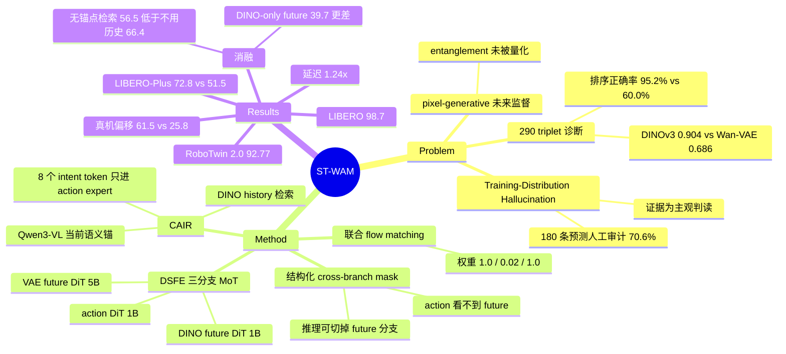

## Summary

video-generative World Action Model (WAM) 把未来监督放在 VAE latent 空间，作者观察到它在视觉分布偏移下会把预测未来"拉回"训练域外观（称为 Training-Distribution Hallucination），于是不去修正预测未来，而是把冻结的 DINOv3 特征同时用在两个时间方向上：Dual-Space Future Experts (DSFE) 让 VAE future、DINO future、action 三个 DiT 组成 Mixture-of-Transformers 联合 flow matching，Current-Anchored Intent Retrieval (CAIR) 用 Qwen3-VL 抽出的当前视觉-语言上下文作 query，从近 4 帧 DINO history 检索意图 token 注入 action expert。推理时两条 future 分支被 attention mask 完全切掉，退化成 action-only policy。结果为 LIBERO 98.7%、RoboTwin 2.0 92.77%、零样本 LIBERO-Plus 72.8%（对照 Fast-WAM 51.5%），真机视觉偏移下 61.5% 对 Fast-WAM 25.8%。

## Problem & Motivation

WAM 借视频预训练拿到 world-dynamics 先验，把未来视觉状态（通常是 VAE latent）与 action 联合建模，在标准 manipulation benchmark 上表现很强，但作者要问的是：这类 pixel-generative 未来监督在视觉分布偏移下还成不成立。

作者给出两条诊断：

- **Training-Distribution Hallucination**：只在 LIBERO 上训练的 LingBot-VA 和 Fast-WAM-Joint 零样本跑 LIBERO-Plus 时，预测视频会逐步漂回 LIBERO 风格的背景与光照。规模化证据是一次**人工审计**：两个模型 × 三类偏移（background / illumination / camera viewpoint）× 各 30 个随机样本 = 180 条预测，70.6% "明显" 呈现该现象（C7）。原文没有给评审人数、评分细则或一致性统计，这是主观判读而非可复算的度量。配套的量化落点是 Fast-WAM / Fast-WAM-Joint 从 LIBERO 的 97.6% / 98.5% 掉到 LIBERO-Plus 的 51.5% / 59.0%——但这组数字引自第三方 robustness study（Zhang et al. 2026d），不是本文重跑（C16）。
- **表示层面的对照诊断**：290 个 frame triplet（取自 LIBERO 与 LIBERO-Plus），每个 triplet = 同任务同机器人/物体状态但视觉条件不同的两张 initial frame + 同一条 demonstration 的 final frame（作为 different-state 参照）。度量是 cosine similarity：DINOv3 在 same-state 两帧间平均 0.904，Wan-VAE latent 只有 0.686；把 shifted initial frame 与另两帧比较时，DINOv3 在 95.2% 的 triplet 里更接近 state-matched clean frame（Wan-VAE 60.0%）（C8）。这是本文自建 setting，triplet 构造与更多细节被推给 supplementary，正文不足以复现。

注意本文用来定义问题的核心机制断言——"pixel-generative 未来监督把 action-relevant transition 与 task-irrelevant 视觉内容纠缠在一起"——在原文里始终是 hedged 措辞（"can entangle" / "potentially entangling"），**没有任何直接测量 entanglement 的指标**（C19）。支撑它的是上述人工审计、表示相似度诊断、attention 热图和下游成功率差异，都是间接证据。把这句当成已验证的因果机制会 overclaim。

## Method

**Problem formulation.** 给定当前多视角观测 $o_t$、本体状态 $s_t$、语言指令 $\ell$，预测 action chunk $a_{t:t+H-1}$；另用长度 $M$ 的历史 $\mathcal{H}_t$ 与未来观测 $o_{t+1:t+K}$。冻结的 Wan2.2 VAE 与 DINOv3 分别把观测编码到 $z^v$ / $z^s$，各自切成 current conditioning token 与 future prediction target。训练时建模联合分布 $p_\theta(a, z^v_{\mathrm{fut}}, z^s_{\mathrm{fut}} \mid o_t, s_t, \ell, \mathcal{H}_t)$，推理时退化为 $\pi_\theta(a \mid o_t, s_t, \ell, \mathcal{H}_t)$。

**Dual-Space Future Experts (DSFE).** 三分支 Mixture-of-Transformers：visual future DiT（用 Wan2.2 预训练的 Video DiT，保留视频预训练继承来的细粒度动力学）建模未来 VAE latent，semantic future DiT 建模未来 DINO 特征，action DiT 建模 action token。三支各有自己的参数与 prediction head，靠逐层 mixed attention 互相细化。

**Structured cross-branch attention mask.** 这是让"训练时多任务、推理时零开销"成立的关键设计：clean current VAE / DINO token 可以互相看但看不到 future 与 action，充当 leakage-free anchor；两条 noisy future 流可以看 current anchor 和彼此（跨空间互相细化），但与 action token 隔离；action token 只看两条 current 流和自己，**不能读任何 future 流**。因此推理时直接把两条 future 分支省掉不影响 action 生成。

**Current-Anchored Intent Retrieval (CAIR).** 冻结的 Qwen3-VL 抽当前观测+指令的末层多模态 hidden state $H^q_t$；$N_I$ 个可学习 query 通过 MHA 从 $H^q_t$ 得到 current semantic token $U^0_t$（当前场景与指令的语义锚）。历史侧，冻结 DINOv3 抽 $M$ 帧 dense patch 特征，线性投影 + 可学习 temporal embedding 拼成 history token $R_t$。CAIR 用 $U^0_t$ 作 query、$R_t$ 作 key/value 跑 $L$ 层 cross-attention，得到 short-horizon intent token $I_t$——作者明确说这是 label-free 的隐式摘要，不是被显式监督的变量。$I_t$ 只注入 action expert 的 context（$C_a=[C_\ell; P_p(s_t); I_t]$），DSFE 两支的 context 保持 $[C_\ell; P_p(s_t)]$ 不变，因此 intent token 完全由 action flow matching 端到端优化。

**Joint flow matching.** 三支共用线性插值加噪与速度目标，两条 future 支共享同一 timestep $\tau_f$（因为它们通过 mixed attention 交换信息，需要同步去噪阶段），action 的 $\tau_a$ 独立采样，三支噪声互相独立；总损失 $\mathcal{L}=\lambda_v\mathcal{L}_v+\lambda_s\mathcal{L}_s+\lambda_a\mathcal{L}_a$，权重取 (1.0, 0.02, 1.0)——semantic 支权重比另两支低 50 倍。

**配置.** visual future expert = Wan2.2-TI2V-5B 的 5B Video DiT，semantic 与 action expert = 从 Wan2.2 权重初始化的 1B DiT；Wan2.2 VAE 与 T5、DINOv3 ViT-S/16、Qwen3-VL-4B-Instruct 全程冻结。$H=32$，$K=8$（未来观测每 4 个控制步采一帧），$M=4$（历史帧取 $\{t-24,t-16,t-8,t-1\}$），$L=2$、$N_I=8$。LIBERO 训 10 epoch（global batch 128），RoboTwin 2.0 训 5 epoch（global batch 1024），AdamW lr 1e-4、BF16、shifted flow schedule shift 5.0；推理 10 步 flow integration、执行 10 步后 replan。原文**没有给出 ST-WAM 的总参数量或可训练参数量，也没有给任何 baseline 的参数量**（C14）。

## Key Results

**LIBERO（Table 1）**：四个 suite 平均 98.7%（Spatial 99.0 / Object 100.0 / Goal 99.0 / Long 96.8），表内最高；对照 LingBot-VA 98.5、LaWAM 98.6、GeoSem-WAM 98.6、Fast-WAM 97.6、[[2512-Motus|Motus]] 97.7（C1）。这一档差距只有零点几个百分点，LIBERO 已近饱和。

**RoboTwin 2.0（Table 2）**：clean 93.06 / randomized 92.48 / avg 92.77，表内最高；对照 GeoSem-WAM 92.54、LingBot-VA 92.20、Fast-WAM 91.83、LaWAM 91.22（C2）。同样是零点几个点的量级。

**零样本 LIBERO-Plus（Table 3）**：overall 72.8%，Fast-WAM 51.5%、Fast-WAM-Joint 59.0%，差距 21.3 个百分点；提升覆盖全部七个扰动维度，camera 与 sensor-noise 上分别 +39.0 / +41.8 个百分点，且在六个非语言扰动上都超过 Fast-WAM-Joint（C3、C4）。这是本文最大的效果落点。**可比性边界**：Table 3 的 baseline 数字明确注明引自 Zhang et al. 2026d 与 Chen et al. 2026b，不是本文统一重跑；Table 1 / Table 2 则完全没有交代 baseline 数字的来源（既没说引用也没说复现），因此跨表的"同 backbone / 同数据量"无法从原文确认（C15）。ST-WAM 的确不用 embodied pretraining，而 Table 3 里被它超过的 OpenVLA-OFT (69.6)、RIPT-VLA (68.4)、X-VLA (71.4) 都用了——这一项是原文明确标注的（Emb. PT. 列）。

**真机（Agilex Piper 6-DoF 单臂，5 个任务，每任务 50 条示教，每任务每条件 30 trial，三方法用同一批示教各自 post-train）**：nominal 平均 79.3%，比 Fast-WAM 高 14.6、比 [[2410-Pi0|π0]] 高 32.0 个百分点；四类视觉偏移平均 61.5%，比 Fast-WAM (25.8) 高 35.7、比 π0 (32.8) 高 28.7；compound 偏移下 48.0 对 15.3。Fast-WAM 从 nominal 到 shifted 掉 38.9 点，ST-WAM 只掉 17.8 点（C5、C6、C18）。真机这组是本文唯一能确认"同示教、同流程"的对照。

**推理开销**：RoboTwin 2.0 上单张 A100-80GB、BF16、10 步 flow integration，20 次同步测量平均，ST-WAM 生成 32 步 action chunk 耗时 756.17 ms，Fast-WAM 609.30 ms，即 1.24×（C9）。

**消融（Table 5，LIBERO-Plus）**——这组比主表更有信息量：

| 变体 | future 表示 | intent 条件 | LIBERO | LIBERO-Plus |
|:--|:--|:--|--:|--:|
| Fast-WAM | VAE | 无 | 97.6 | 51.5 |
| DINO Future Only | DINO | 无 | 96.3 | 39.7 |
| Dual-Space w/o CAIR | VAE+DINO | 无 | 97.8 | 66.4 |
| w/o Semantic Future Expert | VAE | CAIR (DINO history) | 97.3 | 63.5 |
| Semantic Expert w/o Future Obj. | VAE | CAIR (DINO history) | 95.8 | 62.9 |
| Naive History Retrieval | VAE+DINO | 无锚点 DINO history | 96.3 | 56.5 |
| Qwen Current Only | VAE+DINO | 仅 Qwen 当前帧 | 96.5 | 62.3 |
| CAIR with VAE History | VAE+DINO | CAIR (VAE history) | 96.3 | 64.7 |
| ST-WAM | VAE+DINO | CAIR (DINO history) | 98.7 | 72.8 |

三个结论：(1) DINO **不能替代** VAE——只用 DINO 未来反而掉到 39.7%，低于纯 VAE 的 Fast-WAM，两者是互补而非可换（C10）；(2) 语义未来必须被**显式预测**——去掉 semantic 支 63.5%，保留 semantic DiT 与 mixed attention、只砍掉未来目标与 loss 的"参数对齐"变体 62.9%，都远低于 72.8%，说明增益不来自额外容量或 current DINO 条件（C11，但原文没给参数量，"parameter-matched" 无法核算）；(3) 历史必须被**当前语义锚定**地检索——无锚点压缩 56.5%、只用 Qwen 当前帧 62.3%、把历史换成 VAE latent 64.7%，三者都低于不用 CAIR 的 66.4%，即"错误表示或错误检索的上下文反而有害"（C12）。真机侧的对应消融是 shifted 平均从 61.5% 降到 41.0%（去 semantic future expert）和 43.7%（去 CAIR）（C13）。

**定性证据**：action query 对 current DINO token 的 attention 更集中在被操作物体与交互区域，对 VAE token 则弥散在整个场景（Fig. 5）。原文自己标注这是 qualitative pattern，未给任何量化指标（C20）。

## Evidence Ledger

| Claim ID | Claim | Type | Source locator | Evidence excerpt | Status |
|:--|:--|:--|:--|:--|:--|
| C1 | LIBERO 四 suite 平均 98.7%，表内最高，且无 embodied pretraining | number+comparison | Table 1 / "Performance on LIBERO" | "ST-WAM achieves an average success rate of 98.7%, the highest among the compared methods" | source-verified |
| C2 | RoboTwin 2.0 clean 93.06 / random 92.48 / avg 92.77，表内最高 | number+comparison | Table 2 | "yielding the highest average success rate of 92.77% among the compared methods" | source-verified |
| C3 | 零样本 LIBERO-Plus 72.8% 对 Fast-WAM 51.5%，+21.3 个百分点 | number+comparison | Table 3 | "improves the closely matched Fast-WAM baseline from 51.5% to 72.8%, a gain of 21.3 percentage points" | source-verified |
| C4 | 提升覆盖全部七个扰动维度；camera +39.0、sensor-noise +41.8 个百分点 | number+comparison | "Zero-Shot Generalization on LIBERO-Plus" | "consistent across all seven perturbation categories, with particularly large gains of 39.0 and 41.8 percentage points" | source-verified |
| C5 | 真机 nominal 平均 79.3%，超 Fast-WAM 14.6、超 π0 32.0 个百分点 | number+comparison | Table 4 / "Real-World Generalization" | "79.3% average success under the nominal condition, outperforming Fast-WAM and π0 by 14.6 and 32.0 percentage points" | source-verified |
| C6 | 真机视觉偏移平均 61.5% 对 25.8% / 32.8%；compound 48.0 对 15.3；掉点 17.8 对 38.9 | number+comparison | Table 4 | "Fast-WAM drops by 38.9 points from the nominal to shifted conditions, compared with only 17.8 points for ST-WAM" | source-verified |
| C7 | Hallucination 普遍性来自 180 条预测的**人工**审计，70.6% 明显呈现；无评审人数/一致性统计 | number+causal-mechanism | Introduction / Fig. 1(a) | "we manually audit the predicted futures of both models on 30 randomly sampled cases under each of three visual shifts" | source-verified（原文未描述评分细则或 inter-rater agreement，证据强度为主观判读） |
| C8 | frame-triplet 诊断：290 triplet，DINOv3 same-state cosine 0.904 对 Wan-VAE 0.686；state-matched 排序正确率 95.2% 对 60.0% | number+benchmark-setting | Introduction / Fig. 1(b) | "290 frame triplets from LIBERO and LIBERO-Plus ... 0.904 ... compared with 0.686 for Wan-VAE latents" | source-verified（度量与构造在正文，细节 "provided in the supplementary material"，正文不足以复现） |
| C9 | 32 步 action chunk 756.17 ms 对 Fast-WAM 609.30 ms（1.24×），A100-80GB / BF16 / 10 步、20 次同步测量均值 | number | "Inference Efficiency" | "ST-WAM generates a 32-step action chunk in 756.17 ms, compared with 609.30 ms for Fast-WAM" | source-verified |
| C10 | 只用 DINO 未来在 LIBERO-Plus 只有 39.7%，低于纯 VAE 的 51.5%；VAE+DINO 无 CAIR 为 66.4% | number | Table 5 / Q1 | "The DINO Future Only variant achieves 39.7% on LIBERO-Plus, below the 51.5% of the VAE-based Fast-WAM" | source-verified |
| C11 | 去 semantic 支 63.5%；保留 DiT 但去未来目标与 loss 的参数对齐变体 62.9%；完整模型 72.8% | number | Table 5 / Q2 | "removes its future target and loss, yielding 62.9%" | source-verified（"parameter-matched" 无参数量佐证） |
| C12 | 无锚点检索 56.5%、仅 Qwen 当前帧 62.3%、VAE history 64.7%，均低于无 CAIR 的 66.4% | number | Table 5 / Q3 | "underperform the Dual-Space w/o CAIR baseline (66.4%)" | source-verified |
| C13 | 真机消融：去 semantic future expert / 去 CAIR，shifted 平均降到 41.0% / 43.7% | number | Table 4 / "Real-World Generalization" | "Removing the semantic future expert or CAIR reduces shifted-condition performance to 41.0% and 43.7%" | source-verified |
| C14 | 配置：5B Wan2.2 Video DiT + 两个 1B DiT，VAE/T5/DINOv3 ViT-S/16/Qwen3-VL-4B 全冻结；全文无总参数量、无 baseline 参数量 | benchmark-setting | "Implementation Details" | "the semantic and action experts use 1B DiTs initialized from the pretrained Wan2.2 weights" | source-verified（参数量缺失系原文未报告） |
| C15 | Table 3 的 baseline 数字引自 Zhang et al. 2026d 与 Chen et al. 2026b；Table 1/2 未交代 baseline 数字来源 | benchmark-setting | Table 3 caption；Table 1/2 caption | "Baseline results from (Zhang et al. 2026d; Chen et al. 2026b)." | source-verified |
| C16 | Fast-WAM / Fast-WAM-Joint 从 LIBERO 97.6 / 98.5 掉到 LIBERO-Plus 51.5 / 59.0，数字引自他人研究 | number | Introduction | "drop from success rates of 97.6% and 98.5% on LIBERO to 51.5% and 59.0% ... (Zhang et al. 2026d)" | source-verified |
| C17 | 协议：LIBERO 40 任务 × 50 rollout；LIBERO-Plus 10,030 例 / 七维扰动 / 零样本；RoboTwin 2,500 clean + 25,000 randomized 示教、每任务 100 trial | benchmark-setting | "Benchmarks and Protocols" | "10,030 test cases spanning seven perturbation dimensions ... 2,500 clean and 25,000 heavily randomized demonstrations" | source-verified |
| C18 | 真机协议：Agilex Piper 6-DoF、每任务 50 示教、每任务每条件 30 trial、三方法用同一批示教各自 post-train | benchmark-setting | "Real-World Evaluation" | "Agilex Piper 6-DoF single-arm robot using 50 demonstrations per task ... 30 trials per task and condition" | source-verified |
| C19 | "pixel-generative 未来监督把 action-relevant transition 与 task-irrelevant 视觉内容纠缠" 这一机制断言有直接量化测量 | causal-mechanism | Abstract / Introduction / Related Work | "can entangle action-relevant transitions with task-irrelevant or hallucinated visual content" | **unsupported**——原文措辞为 "can entangle" / "potentially entangling"，未定义或报告任何 entanglement 指标；支撑仅为人工审计、表示相似度诊断、attention 热图与下游成功率 |
| C20 | DINO attention 聚焦被操作物体、VAE attention 弥散，属定性热图，无量化指标 | causal-mechanism | Fig. 5 | "This qualitative pattern suggests that DINO provides task-focused semantic cues" | source-verified |
| C21 | 论文仅给出 project page（https://thu-wangmx.github.io/st-wam/），全文未声明开源代码或权重 | license-code | Abstract / 全文 | "The project page is available at https://thu-wangmx.github.io/st-wam/ ." | source-verified（无 code/weights release 声明，故 frontmatter `code` 留空） |
| C22 | LDA-1B 与 LaWAM 已在 DINO 特征空间建模未来，本文以"不需 embodied pretraining / 单阶段端到端"作区分 | sota-novelty | "WAMs with Alternative Future Representations" | "LDA-1B and LaWAM model future states directly in DINO feature space, but rely on large-scale embodied pretraining and multi-stage training" | source-verified（原文的区分点还包括保留 VAE 细粒度动力学与加入 DINO history retrieval） |

## Strengths & Weaknesses

**值得学的地方**

- **问题选得对，且诊断先于方法**。大部分 WAM 论文在 LIBERO 上卷 0.x 个点，本文把注意力挪到"分布偏移下未来预测漂回训练域"这个真实故障模式，并且先做诊断再提方法。LIBERO 98.7 vs 98.5 没有意义，LIBERO-Plus 72.8 vs 51.5 和真机 61.5 vs 25.8 才是这篇的信息量所在。
- **消融把"为什么 work"拆到了机制层**。三组消融分别否掉了三个替代解释：DINO 不能替代 VAE（39.7% 反而更差）、增益不来自额外容量或 current DINO 条件（62.9%）、增益不来自"多喂点历史"（无锚点检索 56.5% 甚至低于不用历史的 66.4%）。最后这条尤其有价值——它说明"检索历史"本身是有害的，只有当 query 被当前视觉-语言上下文锚定、且历史用视觉稳定的表示时才转正。这比 main result 更能说明设计的必要性。
- **attention mask 的工程处理干净**。把 future 流对 action 的可见性彻底切断，换来"训练多目标、推理零开销"，代价只是 1.24× 延迟（且这 1.24× 来自 CAIR 侧的 Qwen3-VL/DINOv3 前向，不是 future 分支）。这是 simple 且可迁移的设计。

**该打折扣的地方**

- **核心机制断言没有被测量**。全文的问题定义建立在"pixel-generative 监督造成 entanglement"上，但 entanglement 从未被定义成可测量的量（C19）。实际被证明的是更弱的命题："在 290 个自建 triplet 上 DINOv3 比 Wan-VAE latent 对视觉扰动更稳定、对状态更可分" + "换了表示后下游 OOD 成功率更高"。这两者与"纠缠"之间隔着未验证的推理链。
- **两条诊断都建在自建 setting 上，且细节推给 supplementary**。290 triplet 的构造方式、cosine similarity 在哪一层特征上算、DINOv3 ViT-S/16 与 Wan-VAE 的特征维度/归一化是否可比，正文都没说清（C8）。cosine similarity 在不同表示空间之间做绝对值比较（0.904 vs 0.686）本身就不是尺度无关的量，更稳的读法是看 95.2% vs 60.0% 这个排序指标——它至少是 scale-free 的。180 条预测的 hallucination 审计则是单次人工判读，无评分细则、无一致性统计（C7）。
- **主表可比性无法从原文确认**。LIBERO-Plus 的 baseline 数字是从第三方论文抄来的，LIBERO / RoboTwin 表则连数字来源都没交代（C15）；全文没有任何参数量（C14）。ST-WAM 用了 5B + 1B + 1B 三分支加上冻结的 Qwen3-VL-4B 和 DINOv3——即使 Fast-WAM 是"closely matched"，读者也无法核验 21.3 个百分点里有多少来自表示设计、多少来自更多参数与更多冻结 encoder 的先验。Q2 里那个"parameter-matched"变体同理，没有数字支撑这个形容词。唯一干净的对照是真机那组（同示教、同 post-train 流程）。
- **偏移类型局限于外观**。评测的 shift 全是 background / lighting / object appearance / camera viewpoint / sensor noise 这类**外观级**扰动，DINOv3 恰好是对这类扰动不变的表示——某种意义上是拿一个已知对该扰动不变的 encoder 去解一个该扰动定义的问题，泛化到物理动力学或 embodiment 变化时没有理由期待同样效果。作者在 Conclusion 里自己承认这一点。
- **未开源**。只有 project page，全文没有代码或权重的 release 声明（C21）。

**对领域的影响判断**：方法层面这是一次"把 self-supervised 视觉表示接进 WAM 双端（future target + history retrieval）"的组合，novelty 有限（LDA-1B / LaWAM 已在 DINO 空间建模未来）。真正可能被后续引用的是两个负结果：DINO-only future 显著劣于 VAE-only future（说明语义表示丢掉了动作需要的细粒度动力学），以及无锚点历史检索比不用历史更差（说明"给 policy 更多上下文"不是免费的）。这两条对做 VLA/WAM 表示设计的人比 main result 更有用。

## Mind Map

## Notes

- 最有转化价值的一条是 Q3 的负结果：**上下文不是越多越好**。无锚点 DINO history (56.5)、VAE history (64.7)、纯 Qwen 当前帧 (62.3) 三者都低于完全不用 intent 条件的 66.4。这与 GUI agent / long-horizon agent 里反复出现的"多喂历史反而掉点"是同一现象的不同实例——值得在跨域 pattern 里记一笔：检索式上下文的收益取决于 (a) query 是否被当前状态锚定、(b) 被检索表示是否对无关扰动不变，两个条件缺一即为负收益。
- 一个可追的开放问题：DINOv3 在这里承担的是"对外观扰动不变、对任务状态可分"的角色，而评测的 shift 恰好全是外观级。如果换成物理动力学或 embodiment 偏移（作者自己列的 future work），什么表示能同时满足这两个性质？现有 self-supervised 视觉 encoder 大概率不行——这可能是比继续换 encoder 更值得做的问题。
- 与 [[2410-Pi0|π0]] / [[2504-Pi05|π0.5]] 这类直接 obs→action 的 VLA 相比，本文的真机结果里 π0 在 nominal 只有 47.3%，明显低于 Fast-WAM 的 64.7% 和 ST-WAM 的 79.3%；但在偏移条件下 π0 (32.8) 反而超过 Fast-WAM (25.8)。即：pixel-generative 未来监督在 in-distribution 有正收益、在 OOD 有负收益，这个符号翻转比 ST-WAM 自身的绝对数字更值得注意。
- 与 [[2602-DreamZero|DreamZero]]（World Action Models are Zero-shot Policies）的对照关系没有在实验里展开——两篇都在讨论 WAM 的零样本能力但结论方向不同，值得后续比对。
