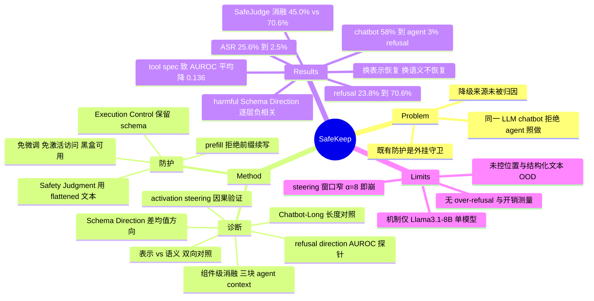

## Summary

本文把 LLM 从 chatbot 变成 agent 后的安全性下降定位到 tool specification 的 **schema 表示形式**（而非工具语义），并给出白盒表征证据：schema 格式诱导的隐状态方向在所有层上与 refusal direction 负相关，且逐层减弱首个生成 token 上的 harmful–benign 分离。据此提出 inference-time 防护 SafeKeep——安全判断阶段把 tool spec 转成 flattened 文本，执行阶段保留原 schema，不改 agent pipeline、不需参数更新或激活访问。在 AgentHarm / InjecAgent 与四个 LLM 上，平均 refusal rate 从 23.8% 升至 70.6%，整体 ASR 从 25.6% 降至 2.5%。

## Problem & Motivation

同一个 LLM 在 chatbot 场景会拒绝的有害请求，包装成 agent 后往往照做——这个现象已被 AgentHarm、Aligned LLMs are not Aligned Browser Agents、AgentAlign 等多项工作观察到，但**归因**始终没做清楚。既有防护走的是外挂路线（分类器、规则过滤、runtime monitor），本质是在模型之外再加一层，并没有回答"模型自身已经对齐过的 refusal 能力为什么在 agent 输入下失效"。

作者的切入点是：agent 输入相对 chatbot 输入多出三块内容——agent role description、tool-use instructions、tool specifications——把降级归因到具体组件，再进一步区分组件的"语义内容"与"表示形式"，就能把问题从"外挂更强的守卫"转成"恢复模型本来就有的拒绝能力"。这是个比堆 guardrail 更有意思的 problem formulation。

## Method

### 诊断部分：三级消融

**探针工具**沿用 Arditi et al. (2024) 的 refusal direction——用 harmful / benign 请求的平均激活之差得到方向向量，把输入的最终 token 隐状态投影上去得到 refusal score，再对 harmful/benign 标签算 AUROC 衡量可分性。**注意这是 difference-in-means 方向，不是训练出来的分类器/probe**。

**配对数据集**基于 ToolSafety 构造：保留其 400 条 harmful 请求，用 Claude Sonnet 4.6 做最小改写生成 benign 对照（只改用户请求，保持场景、任务结构与可用工具不变），人工逐条检查，7:3 划分方向提取集与评估集。

**Level 1（组件定位，§3.2）**：从 chatbot 输入开始逐步加入三个 agent 组件，全程**固定使用同一条从 chatbot 格式提取的 refusal direction** 作为共享探针（避免每种配置重新提取方向把格式漂移吸收掉）。同时构造 Chatbot-Long 长度对照组——往 chatbot 输入追加 benign role description 直到长度与完整 agent 输入相当——用来排除"上下文变长本身改变隐状态"这个竞争解释。

**Level 2（表示 vs 语义，§3.3）**：两个方向各做一组对照。改表示保语义：把 schema 转成 flattened 文本，去掉 JSON 语法、保留字段、嵌套、类型声明与 required 标记，保留工具名、函数签名、功能与参数含义。改语义保表示：把工具名/描述/参数名/参数描述换成长度近似的可发音伪词（jabberwocky probing），保留结构组织。

**Level 3（机制，§4）**：定义 **Schema Direction** $R_c^{(\ell)} = \mathbb{E}_{x \sim \mathcal{D}_c}[h_{\mathrm{schema}}^{(\ell)}(x) - h_{\mathrm{text}}^{(\ell)}(x)]$，即同一输入在 schema 与 flattened 两种呈现下、最后一个 prefill token 处的逐层隐状态平均差，harmful / benign 分开估计。三项分析：(a) 逐层计算 Schema Direction 与 refusal direction 的余弦相似度，并用随机方向作 baseline；(b) 把首个生成 token 的隐状态投影到 refusal direction，看 decoding 开始后效应是否还在；(c) 因果验证——在 peak refusal layer $\ell^*$（chatbot refusal direction AUROC 最高的层）每个 decoding step 减去单位化的 harmful Schema Direction，$\tilde{h} = h - \alpha \hat{R}_{\mathrm{harmful}}$，扫 $\alpha \in [0, 12]$。**输入保持不变**，只干预激活。

### 防护部分：SafeKeep

两阶段，与机制一一对应：

1. **Safety Judgment**：构造安全评估上下文（safety-assessor 角色 + 原 agent role 与 instructions + **flattened 文本形式**的 tool spec + 待评估请求），让同一个底座模型输出 YES（执行不安全）/ NO。不微调、不访问内部激活。
2. **Execution Control**：NO 则原样转发给未修改的 agent pipeline（schema 形式的 tool spec 照常用于工具选择与执行）；YES 则阻断工具调用，prefill 一段简短拒绝前缀（如 "I'm sorry, but I can't help with that."）后让模型自回归续写，生成请求相关的拒绝而非固定模板。

关键设计是**判断与执行用不同的 tool spec 表示**——只在判断路径上规避 schema 表示，执行接口完全不动，因此对黑盒模型也适用。

## Key Results

**降级确实发生在表征层（Llama3.1-8B-Instruct）**：请求与模型固定，harmful 请求的 refusal rate 从 chatbot 的 58% 掉到 agent 的 3%。同一批请求上，chatbot 格式内 AUROC 0.927，agent 格式内降到 0.834，把 chatbot 方向套到 agent 输入上只剩 0.740——行为降级伴随表征可分性降级。

**tool specification 是主因（Table 1）**：加入 tool spec 带来的 AUROC 下降在三个模型上都是最大的（Llama 0.927→0.740，Qwen 0.901→0.786，Mistral 0.921→0.815），平均降 0.136；role description 与 tool-use instructions 的影响小得多。长度对照 Chatbot-Long 保持在 0.916 / 0.867 / 0.904，明显高于含 tool spec 的输入——**上下文变长解释不了这个效应**。

**是表示形式而非语义（Table 2）**：只换表示（schema→flattened 文本，语义不变）AUROC 恢复到 0.885 / 0.845 / 0.898；只换语义（伪词替换，schema 结构保留）只到 0.776 / 0.770 / 0.827，几乎没恢复。这组正反对照是全文最有说服力的证据。

**机制**：harmful 请求的 Schema Direction 与 refusal direction 在**每一层**都负相关；benign 请求的 Schema Direction 早期层为负、后期层转正，不呈现稳定对立——说明这不是"换表示"的普遍效应，而是 harmful 请求特有的。effect 在 decoding 开始后仍在：flattened 表示下首个生成 token 在 refusal direction 上的 harmful/benign 投影分离明显（尤其后期层），schema 表示下 harmful 的投影向 benign 靠拢，分离被压缩。

**因果验证（Table 3）**：在 $\ell^*$ 减去 harmful Schema Direction，$\alpha=4$ 时 refusal 从 5.0% 升到 47.5%，harmful execution 从 95.0% 降到 45.0%，invalid output 仅 7.5%。但窗口很窄：$\alpha=8$ 时 harmful execution 进一步降到 2.5%，refusal 却只有 20.0%，invalid output 飙到 77.5%；$\alpha=12$ 时 refusal 0.0%、invalid 100%，生成完全崩坏。

**SafeKeep 评测（Table 4，AgentHarm 176 harmful + 176 matched benign；InjecAgent 1,054 attack cases）**：四个 backend（Llama3.1-8B-Instruct、Qwen3-8B、Gemini3.1-Flash、GPT5.4-mini）平均 refusal rate 23.8%→70.6%；InjecAgent 整体 ASR 25.6%→2.5%（ASR-B 26.5%→2.3%，ASR-E 24.7%→2.7%）。任务能力侧同时上升：AgentHarm Acc 60.9%→79.6%，Valid-B 78.7%→93.0%，Valid-E 78.8%→94.8%。在 4 LLM × 3 安全指标 = 12 个组合中，SafeKeep 取得 11 个最佳或并列最佳。

**关键消融（SafeJudge）**：同样的两阶段流水线，但判断阶段保留 schema 形式的 tool spec——平均 refusal 只有 45.0%（SafeKeep 70.6%），ASR-B/ASR-E 19.1%/22.2%（SafeKeep 2.3%/2.7%）。增益不是"多加一次自审"带来的，flattened 表示本身是必要的。

## Evidence Ledger

| Claim ID | Claim | Type | Source locator | Evidence excerpt | Status |
|:--|:--|:--|:--|:--|:--|
| C1 | Llama3.1-8B-Instruct 上 harmful 请求 refusal rate 从 chatbot 的 58% 降到 agent 的 3% | number | §3.1 Results | "the refusal rate on harmful requests decreases from 58% under chatbot inputs to 3% under agent inputs" | source-verified |
| C2 | AUROC：chatbot 内 0.927、agent 内 0.834、chatbot 方向套 agent 输入 0.740 | number | §3.1 Results | "chatbot format achieves an AUROC of 0.927... under the agent format... decreases to 0.834... agent inputs yields an AUROC of 0.740" | source-verified |
| C3 | 三个模型上 tool spec 的加入都造成最大 AUROC 下降，平均降 0.136 | comparison | §3.2 / Table 1 | "Their addition produces the largest AUROC decrease for every model... The average decrease is 0.136" | source-verified |
| C4 | 长度对照 Chatbot-Long AUROC 0.916/0.867/0.904，高于含 tool spec 的输入 | benchmark-setting | Table 1 | "Chatbot-Long consistently achieves higher AUROC than the corresponding inputs containing tool specifications" | source-verified |
| C5 | 换表示（保语义）AUROC 升至 0.885/0.845/0.898；换语义（保 schema）仅 0.776/0.770/0.827 | causal-mechanism | §3.3 / Table 2 | "from 0.740 to 0.885 on Llama3.1-8B-Instruct, from 0.786 to 0.845 on Qwen3-8B, and from 0.815 to 0.898 on Mistral" | source-verified |
| C6 | Schema Direction 是 difference-in-means（最后 prefill token 逐层隐状态均差），非训练 probe | causal-mechanism | §4.1 / Eq. 2 | "the average hidden-state change induced by presenting the same tool specification in schema-formatted rather than flattened textual form" | source-verified |
| C7 | harmful Schema Direction 与 refusal direction 每层都负相关；benign 早期负、后期转正 | causal-mechanism | §4.2 / Figure 3 | "negative cosine similarity with the refusal direction at every layer... negative in earlier layers but becomes positive in later layers" | source-verified |
| C8 | schema 表示显著压缩首个生成 token 在 refusal direction 上的 harmful–benign 分离 | causal-mechanism | §4.3 / Figure 4 | "this separation is markedly reduced because the projections of harmful requests decrease toward those of benign requests" | source-verified |
| C9 | α=4 steering：refusal 5.0%→47.5%，harmful exec 95.0%→45.0%，invalid 7.5% | number | §4.4 / Table 3 | "At α=4... increases the refusal rate from 5.0% to 47.5% and reduces harmful execution from 95.0% to 45.0%" | source-verified |
| C10 | α=8：refusal 20.0%、harmful exec 2.5%、invalid 77.5%；α=12：refusal 0.0%、invalid 100% | number | §4.4 / Table 3 | "8 20.0 2.5 77.5"; "12 0.0 0.0 100.0" | source-verified |
| C11 | SafeKeep 把四个 LLM 平均 AgentHarm refusal rate 从 23.8% 提到 70.6% | number | Abstract / §6.4 | "increasing the average refusal rate on AgentHarm from 23.8% to 70.6%" | source-verified |
| C12 | AgentHarm 评测集为 176 harmful + 176 matched benign；Refusal 分母是 harmful 请求 | benchmark-setting | §6.1 | "176 harmful requests and 176 matched benign requests... the proportion of harmful requests refused by the agent" | source-verified |
| C13 | InjecAgent 1,054 attack cases；ASR 在 valid 输出内计算；整体 ASR 25.6%→2.5% | number | §6.1 / §6.4 | "1,054 attack cases"; "the proportion of successful attacks among valid outputs"; "decreases from 25.6% to 2.5%" | source-verified |
| C14 | 任务能力指标上升：Acc 60.9%→79.6%，Valid-B 78.7%→93.0%，Valid-E 78.8%→94.8% | number | §6.4 | "increasing the average accuracy from 60.9%... to 79.6%... Valid-B from 78.7% to 93.0% and Valid-E from 78.8% to 94.8%" | source-verified |
| C15 | 全文未报告独立的 over-refusal / benign 误拒率或 Safety Judgment 假阳性率 | benchmark-setting | §6.1 / Table 4（全文检索） | "Refusal, ASR-B, and ASR-E measure safety... Acc, Valid-B, and Valid-E measure overall task-handling capability" | source-verified |
| C16 | SafeJudge 消融：refusal 45.0% vs SafeKeep 70.6%；ASR-B/E 19.1%/22.2% → 2.3%/2.7% | comparison | §6.4 | "increases the average refusal rate from 45.0% to 70.6% relative to SafeJudge and reduces ASR-B/ASR-E from 19.1%/22.2% to 2.3%/2.7%" | source-verified |
| C17 | SafeKeep 在 12 个 LLM–安全指标组合中取得 11 个最佳或并列最佳 | comparison | §6.4 | "obtaining the best or tied-best result in 11 of the 12 LLM–safety-metric combinations" | source-verified |
| C18 | 配对数据集：ToolSafety 400 条 harmful，Claude Sonnet 4.6 改写 benign，人工检查，7:3 划分 | benchmark-setting | §3.1 Paired dataset | "We retain its 400 harmful requests and use Claude Sonnet 4.6 to minimally rewrite each into a benign counterpart" | source-verified |
| C19 | 代码与数据开源于 github.com/snowcatsmoking/SafeKeep | license-code | §1 | "We publicly release our code and data at github.com/snowcatsmoking/SafeKeep to facilitate future research." | source-verified |
| C20 | 竞争解释仅控制了上下文长度（Chatbot-Long）与语义（伪词替换）；未控制 tool spec 在 prompt 中的位置，也无"非工具结构化文本"对照 | causal-mechanism | §3.2 / §3.3（全文检索） | "Chatbot-Long appends benign role descriptions to the chatbot input until its length approximately matches" | source-verified |
| C21 | GPT5.4-mini 上 SafeJudge 的 refusal（66.4）高于 SafeKeep（57.4），是 12 个组合中唯一未夺最佳的一格 | comparison | Table 4 | "SafeJudge 61.6 66.4 98.0 0.0 100.0 0.0"; "SafeKeep 72.2 57.4 100.0 0.0 100.0 0.0" | source-verified |
| C22 | 全文未报告 SafeKeep 的推理开销（延迟、token 成本、额外 LLM 调用代价均未量化） | benchmark-setting | 全文检索；最接近的只有定性表述 | "propose to recover this ability as a lightweight and general defense" | source-verified |

## Strengths & Weaknesses

**亮点**

拆解干净是这篇最大的价值。多数 agent safety 论文停在"现象 + 更强的外挂守卫"，本文做了三级消融：组件级定位（哪块 agent context 有害）→ 表示/语义正反双向对照（是形式还是内容）→ activation steering 因果验证（干预激活、输入不变）。尤其是 §3.3 的双向对照——"改表示保语义"恢复大半、"改语义保表示"几乎不恢复——这一正一反把归因钉得很实，比单侧证据强得多。Chatbot-Long 长度对照也主动堵掉了最廉价的替代解释。

防护设计与机制严格对应，且 SafeJudge 消融把"多加一个判断阶段"和"判断时用 flattened 表示"分离开（45.0% vs 70.6%），排除了"增益只是多一次自审"的解释。这种"机制 → 干预 → 消融验证干预中真正起作用的那一项"的闭环，在安全防护类工作里并不常见。方法本身不改 agent 接口、不需参数或激活访问，黑盒可用，落地门槛低。

**局限**

*竞争解释未穷尽（C20）*。只控了长度和语义，没控 tool spec 在 prompt 中的**位置**，也没有"与工具无关的结构化 JSON/标记文本"作对照。因此无法区分两种可能：(a) schema 特有的"执行线索"效应；(b) 任何高度结构化、离自然语言分布较远的文本块都会稀释 refusal 信号。作者对机制的解释——tool-use 训练反复把 schema 与"采取行动"绑定——文中自己标为 "one possible explanation"，属推测，未做训练侧验证（如比较是否经过 tool-use post-training 的同族模型）。

*机制证据集中在单一模型*。Schema Direction、逐层 cosine、first-token projection、steering 全部只在 Llama3.1-8B-Instruct 上做；跨模型证据只有 Table 1/2 的 AUROC 数字，机制层面没有跨模型复现。"schema 削弱 refusal signal" 这个断言的泛化性，目前靠的是 AUROC 趋势一致，而非机制一致。

*steering 的窗口窄到反过来削弱了机制解释*（C10）。α=4 时确实是"refusal 上升、harmful exec 下降"；但 α=8 时 harmful exec 掉到 2.5% 的同时 refusal 只有 20%、invalid output 冲到 77.5%，α=12 则 100% invalid。如果减去 Schema Direction 真是在"恢复 refusal 开关"，加大强度应当趋向更多有效拒绝，而不是趋向语无伦次。更保守的读法是：中等强度把生成推离了"直接执行"的模式，大强度则把它推离了正常流形——因果证据成立，但"精准反转 refusal"的解释被这条 α 曲线削弱了。

*安全收益的隐藏成本没有单独测量（C15）*。论文没有报告 benign 请求上的误拒率，也没报 Safety Judgment 阶段的假阳性率。良性侧代价只能从 AgentHarm Acc（60.9%→79.6%）间接推断——但 Acc 同时奖励"正确拒绝 harmful"和"正确处理 benign"，两者混在一个数里，无法判断 benign 子集上是否有回退。考虑到 SafeKeep 的机制正是"让模型更容易拒绝"，over-refusal 恰恰是最该单独报的指标，缺失是明显的评测短板。InjecAgent 的 Valid 率只衡量输出可解析性，不能替代 utility。

*绝对水位仍不够*。70.6% 平均 refusal 意味着约 29% 的 harmful 请求依然通过；GPT5.4-mini 上 SafeKeep 只有 57.4%，反而低于 SafeJudge 的 66.4%（C21）——这是"flattened 表示是必要的"这一核心论断的一个反例，且论文未讨论。合理猜测是闭源模型的 schema 处理管线与开源模型不同（也可能其 tool-use 训练配方不同），但这需要作者解释。

*开销未量化（C22）*。每个请求要多一次 LLM 调用，论文只用 "lightweight" 定性描述，没有任何延迟或 token 成本数据。

**对领域的意义**

如果"结构化工具接口本身会稀释安全信号"这个结论能在更多模型上复现，影响面比一个 guardrail 大得多：它意味着 function-calling / MCP 这类接口设计选择带有隐含的安全代价，而目前的 safety alignment 几乎全部在纯文本对话分布上做。一个自然的推论是——对齐训练应当把 schema 格式的输入纳入分布，而不是靠推理时把 schema 翻译回自然语言绕开。本文的 SafeKeep 是绕开方案，训练侧的正面解法还是空白。

## Mind Map

## Notes

- 值得追的问题：schema 的哪一部分在起作用？JSON 语法本身、类型声明、required 标记、嵌套结构——本文的 flattening 是一次性把它们全去掉的，没有做逐项拆解。如果能定位到"是 required/type 这类执行承诺语义"而非"JSON 括号"，机制解释会强很多，也直接指向可落地的接口设计建议（例如把 tool schema 的表述改成低承诺性措辞）。
- 与 `Papers/2606-OverPrivilegedTools.md`、`Papers/2607-VeraSafetyTesting.md`、`Papers/2606-PolicyGuard.md` 是同一问题簇但切面不同：那几篇在权限/策略层做约束，本文在表征层做归因。交叉点在于——如果 refusal 信号在 schema 输入下本就衰减，那么依赖模型自我判断的 policy 型守卫（包括让 agent 自己读 policy 再执行）都会受同一效应影响。这个推论论文没提，但可以直接检验。
- 反向用法：Schema Direction 是一个**可加的越狱方向**。论文用它做防御（减去），但同一个方向加上去理论上能压制拒绝——本文没讨论这个攻击面，而 Schema Direction 的提取只需要配对数据和白盒访问，成本很低。
- GPT5.4-mini 上 SafeJudge > SafeKeep 的反例（C21）值得单独想：如果闭源模型的 schema 处理与开源模型不同，那"flattening 是必要的"就不是普适结论，而是与 tool-use 训练配方相关的条件性结论。这会显著改变论文的 claim 强度。
