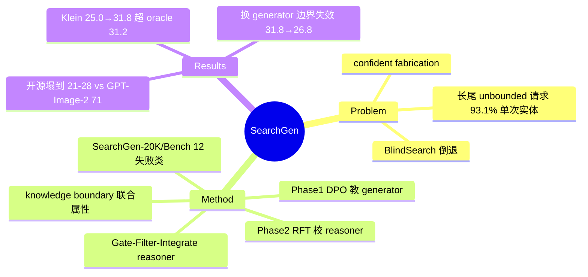

## Summary
针对图像生成模型对不认识的实体/事件"自信地捏造"的 world-knowledge bottleneck，构建 SearchGen-20K/Bench（20,839 条 prompt、12 类失败模式）量化该问题，并提出 teach-then-search co-training：用 DPO 让 generator 内化可学知识、用 RFT 重校准 8B search reasoner，使其发现该 generator 特有的 knowledge boundary，最终 4B generator + 8B reasoner 达到 Gemini-3-Flash oracle reasoner 的水平（31.8 vs 31.2）。

## Problem & Motivation
图像生成器的渲染能力已很强，但知识封闭在训练语料里：面对新实体（2025 大阪世博会吉祥物）、时事（FIFA 积分榜）、文化细节（Oaxacan alebrije）、史实（Spartan 方阵盔甲）时不会说"不知道"，而是生成精致但错误的图。用户请求是 unbounded 且极度长尾的——作者统计生产环境 prompt 中 31,537 个 unique entity 里 93.1% 只出现一次，靠扩训练集永远追不上。直觉方案是给 generator 接搜索，但论文用 BlindSearch 实验证明：无差别搜索会在模型本来会做的 prompt 上**倒退**（Qwen-Image-2 从 70.7 掉到 60.4），失败模式是 concept corruption（搜索结果覆盖了本来正确的参数化知识）和 copy effect（把 reference 当模板抄）。所以真正的问题是：**哪些知识该内化、哪些该搜**——即 knowledge boundary 的发现。

## Method
**Benchmark（SearchGen-20K / SearchGen-Bench）**
- 来源：AIGC 平台 20,840 条生产 prompt + 模板/LLM 改写合成；answer-first 策略（先让 frontier model 判定知识缺口再造 prompt）。
- 规模：20,188 训练 / 128 验证 / 751 测试；22 个 domain；双语（58% 英文 / 42% 中文）；12 类失败模式（Temporal-Recent/Current、Entity & IP、Concept & Symbol、Factual & Historical、Cultural、UI/UX、Data Viz、Typography、Composite、Vague、Implicit Reasoning）。
- 评测：9 个分量分两组——knowledge-sensitive（per-prompt 自适应 checklist 3-10 个二值问题、加权 rubric、faithfulness、visual/textual reference fidelity）和 knowledge-invariant（image quality、text rendering、naturalness、composition、physical plausibility）；judge 为 Gemini-3-Flash，0-100 分。
- 附带 SearchGen-Corpus-1M：145,642 个冻结 search session、370,733 个缓存下载、90,452 条 reasoning trace，支持完全离线 replay（不需要 live API）。

**Knowledge Boundary（Definition 1）**：把知识空间划分为 internalizable（搜索带来的增益 <ε）和 contextual（必须外部检索）两部分；关键性质是这个边界 **generator-specific 且随训练漂移**——不是 prompt 的固有属性，而是 (prompt, generator) 的联合属性。

**三阶段 agentic reasoner（Gate–Filter–Integrate）**，基座 Qwen3-VL-8B：
1. **Gate**：判定知识缺口类型/严重度，只有 critical/important 才触发搜索（最多 3 个 query，标注 image vs web-text 模态），工具为 Google Image/Web Search（SERP API）。
2. **Filter**：从结果中选出针对缺口的 reference，剔除无关内容以抑制 copy effect。
3. **Integrate**：视觉参考通过自然语言路由给 generator——生成 "grounded citations"（如"参照 Image I，人物穿 teal-and-gold 长袍"），保留知识、压掉像素级噪声。

**Teach-then-search co-training**：
- **Phase 0**：~10K 专家标注 trajectory 上 SFT warm-start reasoner（此时 generator-agnostic）。
- **Phase 1（教 generator）**：online iterative DPO——每个 prompt 在 search-augmented 输入下采 M 张图，用 SearchGen-Bench 协议打分，top vs worst 构造偏好对；DPO loss 适配 flow-matching velocity field（β=100，EMA reference 0.99）。效果双重：内化稳定知识 + 对不完美 reference 建立 noise-robustness。
- **Phase 2（校 reasoner）**：用 Phase 0 reasoner + 强化后的 generator roll out 轨迹，按 group-relative advantage A_n=(s_n−s̄)/(σ_s+δ) 筛出正 advantage 轨迹做 rejection-sampling finetuning，让 reasoner 重新发现**新** generator 的边界。计算量仅 4×8 GPU hours。
- Generator 试了 Flux.2-Klein-4B（flow-matching）和 Bagel-7B（unified VLM）。

## Key Results
- **Finding 1（40 分塌方）**：NoSearch 层所有 generator 63-75 分；Search-Intensive 层开源 generator 塌到 21-28（Flux.2-Klein-9B 24.2、Qwen-Image 24.8）。商用系统好得多：GPT-Image-2 71.2（几乎不掉）、Nano Banana Pro 65.3、SeedDream-4.0 44.2。knowledge-invariant 分量（画质、物理合理性）保持稳定 → 是知识缺失而非渲染失败。
- **Finding 2（盲搜有害）**：BlindSearch 让所有 generator 在 NoSearch prompt 上掉分（Qwen-Image-2 70.7→60.4，相对损失 14.6%）。
- **Finding 3（co-training 主结果）**：Klein-4B overall 25.0（NoSearch baseline）→ 26.4（Phase 0 blind search）→ 29.2（+DPO）→ **31.8**（+RFT），超过 Gemini-3-Flash oracle reasoner 的 31.2；Bagel 22.4→23.4→24.7→**26.8**（oracle 26.1）。最难的 Set III 提升最大（21.2→27.4，+6.2）。
- **选择性恢复**：Phase 2 后 NoSearch prompt 恢复到 56.9（对照 no-search DPO 的 49.9），说明 reasoner 学会了"何时不搜"。
- **边界是联合属性的直接证据**：把校准后的 reasoner 配回 base Klein-4B，分数从 31.8 掉到 26.8——reasoner 校准的是特定 generator 的边界，换 generator 即失效；RFT 单独作用于 base generator 也无增益。
- **模态 ablation**：VisualSearch 子集靠图搜（Qwen-2: 37.2→49.1），TextualSearch 子集必须 web-text 搜索（22.9→34.1）。

## Strengths & Weaknesses
**亮点**
- 问题形式化好：把 "generation + search" 从工程 trick 提升为 knowledge boundary 发现问题，且用两个干净实验（BlindSearch 倒退、reasoner 换 generator 失效）证明边界是 generator-specific 的联合属性——这是全文最有信息量的部分。
- Benchmark 和基础设施扎实：12 类失败模式来自生产数据，93.1% 单次实体的长尾统计有说服力；冻结 search corpus 支持离线复现，解决了 search-based 研究最大的复现痛点。
- Phase 2 只要 4×8 GPU hours，方法便宜。

**局限（论文自己承认或我推测）**
- **裁判与奖励同源**（已知）：DPO 偏好对由 SearchGen-Bench 协议打分构造，最终又用同一 judge（Gemini-3-Flash）评测——本质是对着评测指标做优化，+6.8 分里有多少是真知识、多少是 judge preference fitting，缺独立评测（如人评主结果或第三方 benchmark）交叉验证。附录只做了 judge-reasoner 独立性检查。
- **"recursive self-improvement" 是 overclaim**（已知）：abstract 提 recursive，正文只跑了单轮 co-training，多轮是否持续增益/是否崩溃未验证（limitation 里自己承认）。
- **绝对水平仍低**（已知）：co-train 后 31.8，GPT-Image-2 在 Search-Intensive 上是 71.2——方法论上"匹配 oracle reasoner"成立，但离商用系统的实际能力差一倍还多；claim 的措辞容易让人误读成追平 frontier。
- 只在 4B/7B generator 上验证，规模化行为未知（已知）；边界不可先验预测、必须跑完整个 co-training 才能发现（已知）。

## Mind Map

## Notes
- Reasoner 通过自然语言 "grounded citations" 给 generator 传递视觉知识而非直接 image conditioning，这个设计对抑制 copy effect 的贡献值得单独 ablation（正文似乎没有拆开验证）。
- 与 GUI/web agent 的 "何时调工具" 问题同构：Gate 阶段本质是 tool-use 的 calibration 问题，group-relative advantage 筛轨迹的做法可以迁移。
