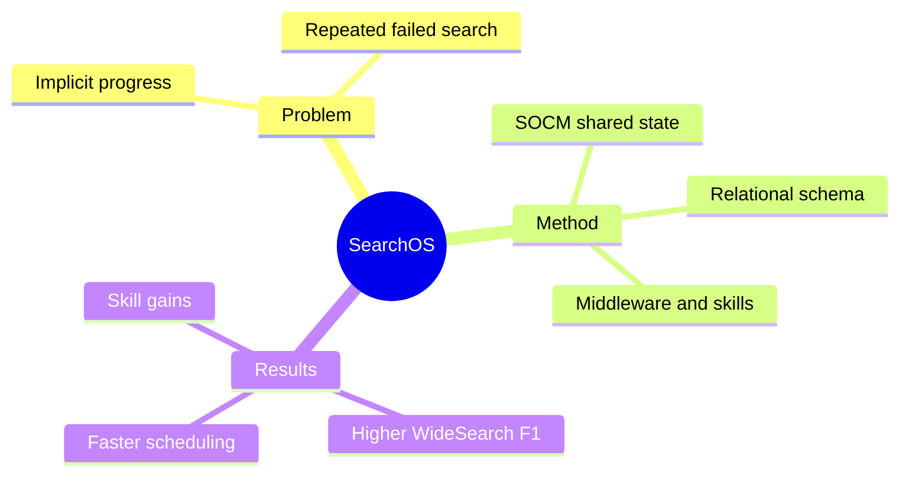

## Summary
SearchOS 将 long-horizon open-domain search 外化为带 citation 的 relational schema completion，并以共享状态、continuous multi-agent scheduling、middleware governance 与 hierarchical skills 减少重复搜索和 context drift。

## Problem & Motivation
Information-seeking agent 在长任务中需要持续发现 entity、补齐 attribute、跨 source 对齐 evidence，但这些进展往往只隐含在不断膨胀的 conversation history 中。当某条搜索路径失败时，single-agent 与 multi-agent system 都容易遗忘已尝试动作、重复查询，或在没有足够 coverage 时提前写答案。核心问题因此不是再增加一个 search agent，而是把未解决问题、证据、冲突、coverage 和 failure 变成可持久、共享、可调度的 system state。

## Method
SearchOS 首先把请求表示为 relational schema completion：每个 table 定义 attribute、primary key 与 foreign-key relation，每个填入的 cell 都必须对应 citation matrix 中的 source URL 和 anchored excerpt。Search-Oriented Context Management（SOCM）维护四类状态：Frontier Task 记录 dependency、priority、target cell 与 attempt；Evidence Graph 存 atomic finding、support span、confidence 与 provenance；Coverage Map 标记 missing/filled/uncertain/unreachable 与 conflict；Failure Memory 保存重复 query、inaccessible source、failed skill 和 rejected claim。

Orchestrator 采用 pipeline-parallel continuous dispatch：agent 完成后立即更新 SOCM、重新计算 ready set 并填补空闲 slot，而非等待整批结束。Search Tool Middleware Harness 在 model 与 tool boundary 拦截执行，通过 Context Middleware 生成 role-specific state projection，通过 Evidence Extraction 把观察绑定到 schema，通过 sensor 检测 loop、stall 与 budget exhaustion。系统还包含 280 个 orchestrator、strategy 与 access skills；strategy 提供 query reformulation、entity enumeration、multi-hop reasoning 等方法，access skill 则封装 source-specific retrieval 或 typed executor。

## Key Results
- WideSearch 上 SearchOS 的 Item F1 为 80.3，强于最优 baseline 的 76.0；Row F1 为 56.5，强于最优 baseline 的 54.5。GISA 上 Table Item/Row F1 分别为 76.9/59.7，Set F1 为 76.5，较最优 baseline 提升 13.4 个百分点。
- 在 40 个 schema 案例中，动态 schema planning 的 Item F1/Row F1 为 70.6/48.9；即便 oracle 为每题选择更好的 fixed single-table 或 multi-table，也只有 62.4/41.2。
- Continuous scheduling 相比 batch 将平均时间从 629.13 秒降到 476.34 秒，slot utilization 从 34.6% 提升到 41.7%，LLM call 从 341.4 降到 296.6，同时 Item F1 从 79.66 提升到 86.75。
- 启用 hierarchical skills 后，Item F1 从 78.3 提升到 80.3，Row F1 从 53.1 提升到 56.5；middleware 的 representative trajectory 显示 loop sensor 介入后 coverage 与 entity discovery 能恢复增长。

## Strengths & Weaknesses
最强的贡献是把 search progress 从 prompt 内部搬到可审计的 data structure：Evidence Graph 保留 provenance，Coverage Map 不会用新值静默覆盖 conflict，Failure Memory 让不同 agent 共享负面经验。SOCM、scheduling 与 middleware 形成 closed loop，因而结果不仅展示 final score，也用 ablation 支持运行机制。

需要谨慎看待结果：主实验使用每个 case 三次运行中的 Max@3，可能高估单次部署表现；agent backbone 固定为 GLM-5，evidence extraction 固定为 Qwen3.5-35B-A3B，泛化到其他 model 仍待验证。评估集中于 WideSearch 与 GISA 的结构化答案，尚未证明对 multimodal、主观 synthesis 或开放式 exhaustive enumeration 同样有效；skill ablation 一次关闭全部 layer，无法区分 orchestrator、strategy 与 access skill 的独立贡献。

## Mind Map

## Notes
SearchOS 的关键不是“multi-agent 数量”，而是把 coordination object 做成 transaction-like shared state；这与 agent training infra 中 environment state、evidence provenance 和 failure replay 的需求高度一致。下一步应测试 Failure Memory 是否真的能跨 run 迁移，以及 state-writing error 会否成为新的 single point of failure。
