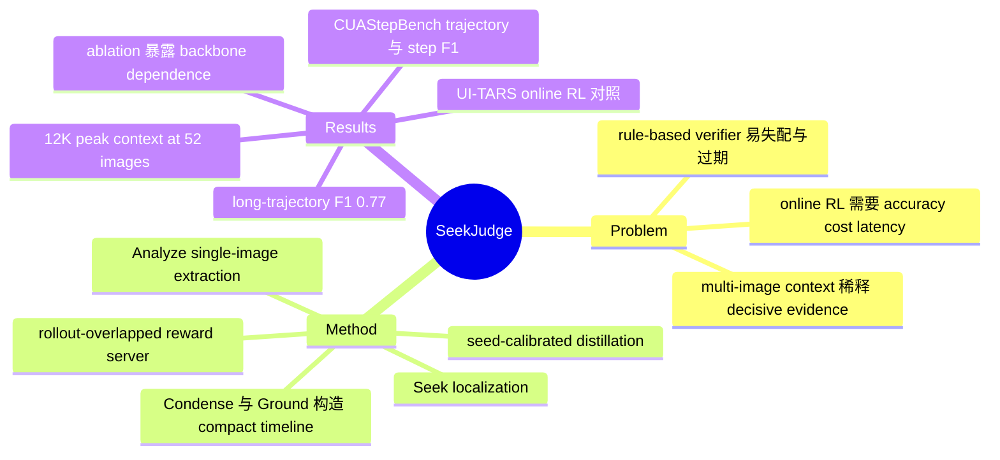

## Summary
SeekJudge 将长轨迹 reward judging 拆为 localization 与 extraction，由共享 SeekJudge-9B backbone 的 Condense、Ground、Seek、Analyze 四个角色输出 trajectory-level score 与 nine-way step labels。 在 UI-TARS 1.5 7B 的 Chrome、Impress、OS 三个 domain 上，其 RL test success 分别为 16.23%、36.81%、28.89%，均高于 rule-based reward 的 12.75%、30.43%、25.56%；作者据此称它是首个在 online RL 中 match or surpass native rule-based supervision 的 practical model-based reward。 这项工作把 reward accuracy、step-level signal、long-trajectory context 与 serving latency 放进同一系统，但最终 specialist 的组件因果性、跨 backbone 稳定性和 cost claim 仍受 ablation 范围、Qwen3VL-8B OS run pending 与 token-pricing assumptions 限制。

## Problem & Motivation
Computer-use agent 的训练与评测都依赖一个基础判断：整条 GUI trajectory 是否真正完成了用户 instruction。主流 rule-based verifier 会遇到三类结构性问题：难以覆盖同一目标的多种正确结果；依赖 app 内部状态、专用 parser 或固定版本；在线内容变化后，预设答案与 evaluator 容易失效。现有 model-based judge 虽然减少了手写规则依赖，却通常把大量 screenshots 和 observations 塞进一次 multi-image forward pass，使少量 decisive evidence 被相似但无关的轨迹内容稀释。

论文把长轨迹判断重新表述为两个子问题：localization 负责找到含有决定性证据的 step/image，extraction 负责从该 image 中准确读出细节。这个 formulation 的关键不只是提升 offline judge agreement，而是让 reward 同时满足 online RL 所需的 fine-grained scoring、cost、latency 与 long-context scalability。

## Method
1. **Condense–Ground–Seek–Analyze framework**
   - **Condense agent** 逐 step 读取 action 前后的两张 screenshots，将 state transition 压缩为短文本 timeline entry。
   - **Ground agent** 结合 post-action screenshot 与 raw action，把坐标动作映射到实际命中的 GUI element。
   - **Seek agent** 是唯一跨轮保留状态的 controller；它在 compact timeline 上判断证据是否充分，若不足则选择一个 step/image 并生成 focused question。
   - **Analyze agent** 每次只读取一张指定 screenshot，stateless 地回答 focused question，再把文本证据返回 Seek agent。四个角色共享同一个 SeekJudge-9B backbone。

2. **Seed-calibrated distillation 与 dense reward**
   - trajectory level 使用 7 个 0–100 dimension scores；step level 使用 9 类标签，并在 benchmark 中把 3 个 harmful classes 视为 error、其余 6 类视为 correct。
   - Seed Stage 先以少量完整 human labels 搜索 criteria prompt，再用 Codex with GPT-5.5 生成较大规模的 trajectory progress descriptions 来搜索 seek prompt；两个 prompt search 都由 Claude Code 根据 failure revisions 迭代。
   - Train Stage 以 DeepSeek V3.2 承担 text roles、Gemini 3.0 Flash Preview 承担 vision calls，记录完整 pipeline 的 agent calls，再 distill 为统一的 9B model。
   - 7 个 dimension scores 经 gradient-boosted regressor 映射为 trajectory score，并用 threshold 得到 binary verdict；9 类 step labels 映射为预设常数。在 GRPO 中，最终 reward 是 outcome score 加权 step-score mean，但所有 decision steps 共享同一个 trajectory scalar，论文没有构造独立的 per-step advantage。

3. **Rollout-overlapped, zero-client-state reward server**
   - Condense/Ground 等不依赖未来 action 的 preprocessing 在 environment 执行动作时异步运行，只把较短的 final judging stage 留在 rollout critical path。
   - RL client 只需乱序流式发送 screenshot/action；server 负责重排、保存状态和 scheduling，从而把 reward orchestration 从 actor side 移走。

4. **Benchmark construction**
   - CUAStepBench 含 278 个 human-annotated tasks、覆盖 177 个 applications，并同时提供 trajectory verdict 与 dense post-hoc step labels；hard cases 由 data-generation judge 的 borderline score 筛出后再人工标注。
   - CUAStepBench-Long 含 18 条 trajectory，平均长度 272 steps，用于测试 long-horizon localization 与 image-budget scaling。

## Key Results
- **Online RL（Table 2）**：在 UI-TARS 1.5 7B 上，SeekJudge reward 的 held-out test success 为 Chrome 16.23%、Impress 36.81%、OS 28.89%，对应 rule-based reward 为 12.75%、30.43%、25.56%。在 Qwen3VL-8B 上，SeekJudge 在 Chrome 为 15.36%（rule-based 14.49%），在 Impress 为 48.41%（rule-based 49.28%），OS run 尚未完成；UI-TARS repeated runs 的 test success run-to-run standard deviation 约为 2.0%。
- **Offline reward benchmarks（Tables 3–4）**：在 CUAStepBench 上，SeekJudge-9B 的 trajectory/step F1 为 74.5%/38.1%，Qwen3VL-8B base 为 70.8%/27.3%。SeekJudge-9B 在 AgentRewardBench 与 OmniGUIRewardBench 的 trajectory F1 分别为 74.7% 与 84.5%；相应 CUAJudge GPT-5-mini 为 62.6% 与 83.8%。
- **Multi-image information noise（Figure 6）**：在 decisive screenshot 始终存在的 123/278 cases 上，加入同一 trajectory 的其他 screenshots 后 F1 从 0.68 单调降到 0.61，precision 从 0.56 降到 0.45；等 token 的 mosaic noise 没有产生同样下降，支持“competing content 而非 context length 本身造成 dilution”的解释。
- **Long-context behavior（Sections 4.7–4.8）**：52 images 时 SeekJudge 的 peak per-call context 约 12K tokens，而 OSThemis 与 CUAJudge 约为 48K、80K。CUAStepBench-Long 上，CUAJudge 的 cap 从 16 提升到 96 images 时 F1 从 0.65 升至 0.72，但仍低于无 cap SeekJudge 的 0.77。
- **Reward-granularity ablation（Table 5）**：UI-TARS 1.5 7B Impress 上，continuous + step-level reward 的 test success 为 36.81%，高于 SeekJudge Boolean reward 的 35.94% 和 rule-based Boolean reward 的 30.43%；这项 ablation 同时改变 continuous score 与 step term，不能单独识别二者各自贡献。
- **Framework ablation（Table 6）**：对 Qwen3VL-8B 移除 Condense 使 trajectory F1 从 70.8% 降至 66.7%，移除 action information 使 step F1 从 27.3% 降至 20.8%。Seek–Analyze loop 对 closed-source pair 有增益，但在较弱的 Qwen3VL-8B 上并不稳定：移除后 trajectory F1 反而由 70.8% 升至 72.0%，step F1 则由 27.3% 降至 25.5%。
- **Fine-grained label agreement（Appendix C）**：254 个人工标注 steps 中，130 个命中完全相同的 9-way label，159 个落在相同的 progress/neutral/harmful block，说明 coarse polarity 比细粒度类别更可靠。

## Evidence Ledger
| Claim ID | Claim | Type | Source locator | Evidence excerpt | Status |
|:--|:--|:--|:--|:--|:--|
| C1 | 四个角色共享一个经 seed-calibrated distillation 得到的 SeekJudge-9B backbone。 | causal-mechanism | Abstract; Section 3.1; Figure 3 | “A seed-calibrated distillation pipeline trains one specialized 9B model to serve as the shared backbone for all four agents.” | source-verified |
| C2 | UI-TARS 1.5 7B 上，SeekJudge 在 Chrome/Impress/OS 的 test success 为 16.23/36.81/28.89%，高于 rule-based 的 12.75/30.43/25.56%。 | comparison | Section 4.3; Table 2 | “The results show that (1) \methodmatches or exceeds native rule-based supervision on test success” | source-verified |
| C3 | 作者称 SeekJudge 是首个在 online RL 中 match or surpass native rule-based supervision 的 practical model-based reward。 | sota-novelty | Abstract; Section 1; Section 5 | “the first practical model-based reward to match or surpass native rule-based supervision in online RL” | source-verified |
| C4 | Qwen3VL-8B 上，SeekJudge 的 Chrome/Impress test success 为 15.36/48.41%，rule-based 为 14.49/49.28%。 | comparison | Section 4.2; Table 2 | “Qwen3VL-8B Rule-based 54.89 14.49 43.84 49.28 69.09 32.22” | source-verified |
| C5 | CUAStepBench 上，specialist 相比 Qwen3VL-8B base 的 trajectory F1 提升 3.7 points，step F1 从 27.3% 升至 38.1%。 | comparison | Section 4.4; Table 3 | “lifting trajectory F1 over the Qwen3VL-8B base by 3.7 to 12.2 points and step-level F1 from 27.3 to 38.1” | source-verified |
| C6 | SeekJudge-9B 在 AgentRewardBench 与 OmniGUIRewardBench 的 trajectory F1 为 74.7% 与 84.5%。 | number | Section 4.4; Table 4 | “SeekJudge-9B 87.7 82.4 68.4 74.7 85.3 88.8 80.7 84.5” | source-verified |
| C7 | decisive screenshot 始终存在时，增加同轨迹 screenshots 使 F1 从 0.68 降至 0.61。 | causal-mechanism | Section 4.5; Figure 6 | “Blue F1 falls monotonically from 0.68 to 0.61 as images accumulate, even though the decisive image is always present” | source-verified |
| C8 | 同一实验中 precision 从 0.56 降至 0.45。 | number | Section 4.5; Figure 6 | “precision collapses from 0.56 to 0.45” | source-verified |
| C9 | 52 images 时，SeekJudge/OSThemis/CUAJudge 的 peak context 约为 12K/48K/80K tokens。 | comparison | Section 4.7; Figure 8 | “rising to about 12K tokens at 52 images while OSThemis reaches roughly 48K and CUAJudge roughly 80K” | source-verified |
| C10 | CUAStepBench-Long 上，96-image CUAJudge 的 F1 为 0.72，低于 SeekJudge 的 0.77。 | comparison | Section 4.8; Figure 9 | “even 96 images reach only 0.72, below the 0.77 of \method” | source-verified |
| C11 | Impress ablation 中 continuous + step-level、SeekJudge Boolean、rule-based 的 test success 分别为 36.81%、35.94%、30.43%。 | comparison | Section 4.10; Table 5 | “A continuous score augmented with the per-step scores gives the best test success” | source-verified |
| C12 | 移除 Condense 造成 4.1-point trajectory F1 损失；移除 action information 造成 6.5-point step F1 损失。 | causal-mechanism | Section 4.11; Table 6 | “Condense and Ground are both indispensable, costing 4.1 points of trajectory F1 and 6.5 points of step F1 when removed.” | source-verified |
| C13 | Seek–Analyze loop 对 strong closed-source pair 有增益，但对较弱 8B base 没有稳定增益。 | causal-mechanism | Section 4.11; Table 6 | “It lifts the strong closed-source pair on both levels but not the weaker 8B base” | source-verified |
| C14 | CUAStepBench 含 278 个 human-annotated tasks，覆盖 177 个 applications。 | benchmark-setting | Section 4.1 | “a human-annotated benchmark of 278 tasks over 177 applications.” | source-verified |
| C15 | 作者称 CUAStepBench 是首个在同一 executed trajectories 上同时提供 human trajectory verdicts 与 dense step labels 的 CUA reward benchmark。 | sota-novelty | Section 1; Section 2.3 | “the first CUA reward benchmark to pair human trajectory verdicts with dense step-level labels on the same executed trajectories” | source-verified |
| C16 | 254 个 steps 中，130 个 exact-label agreement，159 个落在相同 coarse block。 | number | Appendix C; Table 8 | “130 of 254 steps land on the exact diagonal, and 159 of 254 fall within the correct block.” | source-verified |
| C17 | 论文没有在 trained SeekJudge-9B 上执行组件移除 ablation。 | benchmark-setting | Section 4.11 | “We do not sweep the trained SeekJudge-9B, whose distillation data follows the full Condense–Ground–Seek–Analyze pipeline” | source-verified |
| C18 | inference-cost study 只在四种 judger 共享的 43 cases 上用统一 token-cost model 比较。 | benchmark-setting | Section 4.6; Appendix E | “We price every judger on the same 43 cases under one cost model” | source-verified |
| C19 | Qwen3VL-8B 的 OS SeekJudge RL run 尚未完成。 | benchmark-setting | Table 2 caption | “the Qwen-OS \methodrun is pending.” | source-verified |
| C20 | offline calibration 的 reported setting jointly fit 在全部三个 evaluation benchmarks 上。 | benchmark-setting | Appendix B; Table 7 | “Our reported setting fits jointly on all three.” | source-verified |
| C21 | RL 实验为每个 application 单独训练 policy，而非跨 domain 的 shared model。 | benchmark-setting | Section 4.2; Appendix D | “We train a separate policy for every application rather than a single model shared across domains” | source-verified |
| C22 | reward server 将可提前执行的 preprocessing 与 environment action execution 重叠。 | causal-mechanism | Section 3.3; Figure 5 | “We schedule these operations in the idle GPU window while the environment executes the action” | source-verified |

## Strengths & Weaknesses
**Strengths**

- 将 judging 明确拆成 localization/extraction，是一个简洁且可检验的 problem formulation；Figure 6 的 same-token mosaic control 为 multi-image dilution 提供了比单纯 scaling curve 更有区分度的证据。
- 不只报告 offline agreement，而是在 UI-TARS 1.5 7B 上把 model-based reward 与 environment-native rule reward 做 online RL 对照，并同时覆盖 trajectory score、step labels、context scaling 和 reward-server execution。
- CUAStepBench 把 human trajectory verdict 与 dense step labels 放在同一 executed trajectory 上，且覆盖 278 tasks/177 applications；这比只提供 outcome label 或 isolated pre-action judgment 的 benchmark 更适合研究 reward granularity。
- 工程设计具有可复用性：stateless RL client、server-side reordering 与 rollout overlap 不绑定某个具体 actor；12K vs 48K/80K 的 peak-context 结果也直接对应 long-horizon serving 与 training memory。

**Weaknesses**

- 最终 SeekJudge-9B 没有做 framework component ablation；作者的 OOD 理由合理，但这意味着 Condense、Ground、Seek–Analyze 对最终 specialist 的独立因果贡献仍未被直接测量。
- Seek–Analyze loop 对 Qwen3VL-8B 不呈一致增益，且 Qwen3VL-8B 的 OS run pending。RL 还采用每 application 单独训练的 policy，因此“drop-in practical reward”能否稳定扩展到 shared policy、更长 horizon 与更多真实应用仍不知道。
- offline score calibration 的 reported setting jointly fit 在三个 evaluation benchmark 上。Appendix B 提供 single-benchmark/off-diagonal transfer probe，但它仍弱于完全独立的 held-out calibration benchmark。
- fine-grained step supervision 的 exact 9-way agreement 仅为 130/254；159/254 的 same-block agreement 说明 progress/neutral/harmful 更稳定，但细分类别作为 reward shaping signal 的噪声影响没有被单独隔离。
- cost comparison 只覆盖 43 cases，并以 token billing 与 prefix-cache accounting 代替 GPU wall-clock；因此它更像 serving-cost estimate，不能单独证明端到端训练 latency 或不同 implementation 下的实际硬件成本。
- Table 5 同时从 Boolean 改为 continuous score 并加入 step-level term，缺少只改变其中一个因素的 factorial ablation，无法判断 36.81% 的增益主要来自哪一部分。

## Mind Map

## Notes
- staged arXiv HTML v1 未显示 authors 或 affiliations，因此 `authors` 与 `institute` 按 source boundary 留空。
- 论文正文没有明确给出 SeekJudge 的 GitHub repository；`code` 留空。页面显示 arXiv license 为 CC BY 4.0，但本笔记不把它等同于 code/data release。
- 论文没有独立的 Limitations section；上面的 weaknesses 来自 Section 4 的 pending run、ablation behavior、Appendix B/C/E 的 evaluation setup，以及据此作出的边界判断。
- 值得后续验证的研究问题：对最终 specialist 做 in-distribution modular training/ablation，能否区分“better backbone”与“Seek–Analyze decomposition”各自贡献；以及把 nine-way labels 变成真正的 per-step advantage，是否优于当前 trajectory-scalar shaping。
