## Summary

SeerGuard 用一个 safety-augmented world model（SAWM，Qwen3-VL-8B SFT）在动作执行前预测其语义后果并判定风险，配合指令级预筛形成两级 pre-execution 防护。在 MobileSafetyBench 上把 Qwen3-VL agent 的 risk-cost score（α=0.8）从 0.347 降到 0.130、safety-utility score（ω=0.8）从 0.191 升到 0.596，对 GPT-5.1 / Gemini-3.1 也有约 50% 的 RCS 下降。

## Problem & Motivation

现有 mobile GUI agent 安全方案要么是纯指令级筛查（LlamaGuard、WildGuard 等 guard model，无法推理界面状态演化），要么是 post-execution 检测（OS-Sentinel 等，但很多 unsafe action——付款、发送、删除——一旦状态转移就无法回滚）。作者对 MobileSafetyBench 150 个 high-risk 任务人工重标注发现：只有 14 个是指令本身有明显恶意，136 个（91%）是"良性指令 + 特定上下文中的危险执行"，即风险主要出现在 action 级而非 instruction 级。因此核心问题不是"指令是否恶意"，而是"这个具体动作会不会诱发不安全的未来状态"——这需要在执行前预测动作后果。

## Method

**两级架构**：

1. **Instruction-level screening（G_inst）**：GUI 交互开始前对原始指令做一次判定，输出 {safe, unsafe} + rationale。设计原则是对显式恶意高 recall、低误报，上下文依赖的风险刻意放行、留给第二级。
2. **Action-level risk assessment（G_WM）**：运行时对 agent 提出的每个候选动作，先用 world model 预测执行后的下一状态语义描述 ŝ_{t+1}，再基于预测后果判定 {safe, unsafe}；unsafe 则拦截，safe 才真正执行。

**Safety-Augmented World Model（SAWM）**：Qwen3-VL-8B-Instruct 上做 multi-task SFT，联合训练"语义 next-state prediction"和"风险判定"两个目标。刻意选文本级语义预测而非 pixel-level 生成——安全判断依赖功能性状态变化而非视觉保真度，且语义预测才能满足在线验证的延迟要求。

**训练数据（约 148K，safe:unsafe 总体 2:1）**：
- **D_gen**（59K）：通用文本安全数据，1:1 正负比，提供价值观对齐基线；
- **D_gui**（33K）：MobileWorld 轨迹用 Qwen3-VL-30B-A3B 重标注 + 人工采集的危险操作（未授权支付、prompt injection、恶意评论），按 OS-Sentinel 的十类安全 taxonomy 标注，格式为 (o_t, a_t) → (ŝ_{t+1}, label, rationale)；
- **D_text**（8K）：GPT-4o 合成的"桥接"数据，覆盖 100 个常用 app × 各 20 种动作（10 safe / 10 unsafe），把通用安全知识接到 mobile 场景；
- 另含 next-state QA 数据（D_qa，见数据配比消融）。

训练超参：lr 1e-6，1 epoch（防灾难性遗忘），batch 128。

## Key Results

- **MobileSafetyBench**（250 任务，150 high-risk + 100 low-risk）：RCS_α = α·HC + (1−α)·LR（越低越好），SUS_ω = ω·HR + (1−ω)·LC（越高越好）。α=ω=0.8 时：Qwen3-VL RCS 0.347→0.130、SUS 0.191→0.596；GPT-5.1 RCS 0.301→0.145、SUS 0.573→0.679；Gemini-3.1 RCS 0.368→0.180、SUS 0.581→0.773。
- **消融**：full（0.130/0.596）> act-only（0.141/0.503）> 用未训练 Qwen3-VL 当 guard（0.170/0.554）> inst-only（0.310/0.248），两级都需要但 action 级贡献占大头。作为风险判别器，SAWM F1 0.800 vs 基座 Qwen3-VL 0.545（后者 precision 仅 0.400，过度保守）。
- **指令级筛查**：Prompt Injection 上 F1 0.922 为最佳；但 Agent-SafetyBench 上 F1 0.567 低于 PolyGuard（0.578），且 recall 只有 0.396。
- **MobileRisk**（102 unsafe + 102 safe，动作级风险判定）：SAWM F1 0.723 / Step Score 0.361，高于 OS-Sentinel（0.695/0.269）、GPT-5.1（0.645/0.341）、基座 Qwen3-VL（0.667/0.312）。
- **Next-State-QA**：SAWM（8B）0.762，超过 Qwen3-VL-235B-A22B（0.651）与 GPT-5.1（0.727），距人类 0.832 还有 7 pt。
- **延迟**：带 SeerGuard 平均 3.35 min/任务 vs 不带 3.49 min——因为风险早期拦截提前终止任务，净耗时反而降 4%。
- **数据配比消融**：去掉 D_gen 后 MobileRisk F1 0.667 / Step Score 0.333（显著掉点）；去 D_text 掉 Step Score 至 0.390；uniform 配比或 6.8:1 正负比都不如 2:1。

## Strengths & Weaknesses

**Strengths**：
- 91% high-risk 任务是"良性指令 + 危险执行"这一重标注统计，是全文最有价值的 motivating evidence——它直接说明纯指令级 guard 的天花板很低，安全评估必须下沉到 action 级。
- "预测语义后果再判风险"的 formulation 干净，避开 pixel-level 生成的算力与延迟，8B 模型 Next-State-QA 0.762 超 235B 基座，说明领域 SFT 对状态转移预测的收益远大于堆参数。
- 数据配比消融做得实在：D_gen（通用安全）拿掉掉点最狠，说明 mobile 安全判断建立在通用价值对齐之上，光有 GUI 轨迹标注不够。

**Weaknesses**：
- **核心 claim 缺关键消融**：全文没有"直接对 (o_t, a_t) 做风险分类（不训练 next-state prediction 目标）"的对照。现有消融只能证明 SFT 数据有用，不能证明"world model 预测"这个机制本身贡献了多少——而这正是标题里的卖点。
- MobileRisk 上相对基座 Qwen3-VL 的提升很薄（accuracy 0.681→0.696，precision 反而 0.699→0.664），主要赢在 recall；且 MobileRisk、Next-State-QA 疑似自建 benchmark，D_gui 又源自 MobileWorld 轨迹，训练-评测分布重叠风险未讨论。
- 对强 agent 收益有限甚至有代价：GPT-5.1 在 ω=0.5 时 SUS 0.703→0.668（牺牲 utility 换 safety），Finance 类别不升反降；SUS 0.191→0.596 的最大涨幅来自最弱的基线。
- "延迟降 4%"是拦截导致任务提前终止的统计 artifact，不是系统效率优势，不宜作为卖点。
- 指令级模块在 Agent-SafetyBench 上 recall 0.396，六成恶意指令漏过——虽然设计上"defer 给第二级"，但这让两级架构中第一级的实际价值存疑。

## Mind Map

```mermaid
mindmap
  root((SeerGuard))
    Problem
      unsafe action 不可回滚
      91% 风险是 action 级而非 instruction 级
      现有 guard 只看指令不看状态演化
    Method
      两级 pre-execution 防护
        指令级筛查 G_inst
        动作级风险评估 G_WM
      SAWM: Qwen3-VL-8B multi-task SFT
        语义 next-state 预测
        风险判定 + rationale
      148K 训练数据 D_gen/D_gui/D_text
    Results
      MobileSafetyBench RCS 0.347→0.130
      SUS 0.191→0.596
      Next-State-QA 8B 超 235B
      MobileRisk F1 0.723
```

## Notes

- 与 [[2605-MobileWorldModelGUI]] 的结论形成有意思的张力：那篇发现 world model 作 test-time verifier（post-hoc self-reflection）效果有限、更适合 prior perception；SeerGuard 则把 world model 用作 pre-execution safety verifier 并报告正收益。可能的调和：安全判定（识别少数危险转移）比任务成功验证（判断进展）对预测精度要求更低，二分类容错更大。
- 与 [[2606-BraveGuard]] 互补：BraveGuard 是 trajectory-level post-hoc 检测 + 威胁自进化，SeerGuard 是 step-level pre-execution 拦截；前者管"发现新威胁"，后者管"执行前止损"。
- 与 [[2500-VerisafeAgentSafeguardingMobile]] 的逻辑验证路线相比，SeerGuard 用学习式后果预测替代形式化规则，覆盖面更广但无正确性保证。
- 待验证问题：如果把 next-state prediction 目标从 SFT 中拿掉、只留风险分类，MobileSafetyBench 端到端指标会掉多少？这是判断 "world model 是否必要" 的决定性实验。
