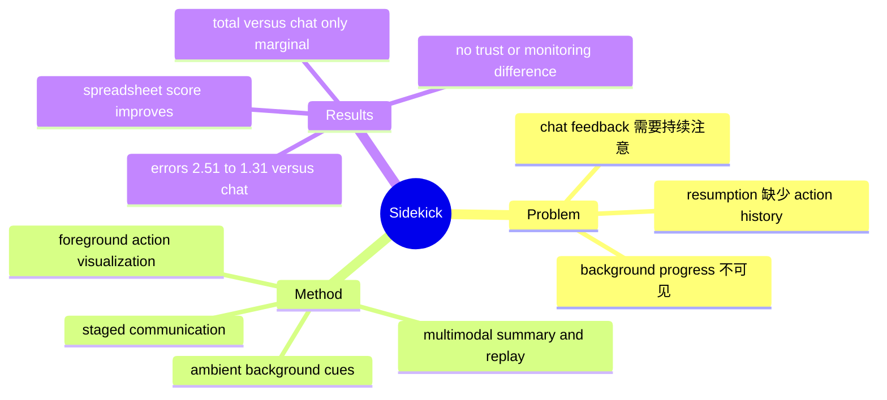

## Summary

Sidekick 把 CUA communication 按 background awareness、resumption、foreground transparency 三个 interaction stage 组织，用 ambient color/thumbnail、multimodal action summary/replay 和实时 reasoning/action visualization 帮助用户在主任务与代理任务间切换。30 人受控实验中 Sidekick 显著提高 spreadsheet collaboration 并减少错误，但总分相对 chat baseline 仅边缘显著，task switching、monitoring time、trust、confidence 与 usability 均无显著变化，因此证据支持的是特定重复任务中的 communication design，而非 agent capability 或广泛 human-agent trust 的提升。

## Problem & Motivation

CUA 能在 GUI 中执行多步任务，使用户理论上可以把 agent 放到后台、同时完成别的工作；现有 chat-centric feedback 却迫使用户持续读文本日志，既难知道 agent 是 running、stuck 还是 done，也难在返回后重建 GUI state 如何变化。论文先访谈 **15 名 GenAI users 与 3 名 CUA experts**，识别出两种工作模式和相应断点：background mode 缺少低干扰的 progress/error awareness，foreground mode 缺少过程 transparency，而从别的任务返回时缺少可快速扫描的 action history。核心问题不是再提高 CUA success rate，而是设计跨 attention state 的 communication protocol，让人能在不过度监控的情况下及时介入。

## Method

Sidekick 根据 interaction stage 提供三组反馈：

1. **Background awareness**：peripheral display 用 ambient color 表示正常、warning/error 等 execution state，并显示高层 summary、thumbnail 与 recent activity，使用户无需切回 CUA window 也能感知进度。
2. **Context resumption**：用户返回时获得 completed actions 的结构化 multimodal summary，并可 replay agent 的 GUI interaction，从最终 artifact 追溯到改变它的步骤。
3. **Foreground transparency**：Agent 活跃时同步 verbalize reasoning，并在 UI 上可视化当前 action/target，帮助用户理解下一步并在高风险或错误积累时介入。

系统把 Sidekick 作为 monitoring proxy，不是每次检测到小误差都打断用户，而在累计 error 超过 threshold 时发出 intervention signal。评测设置有四个 condition：MN（全部手工）、BL（常规 chat feedback）、PT（peripheral text/static color）、SK（完整 Sidekick）。30 名参与者完成八个 8-minute sessions：主任务为 arithmetic，次任务为让 CUA 填 spreadsheet；同一参与者经历 counterbalanced conditions，分析使用 mixed-effects models，并以 manual performance 控制个体能力差异。

## Key Results

- 四条件 estimated marginal total score：MN **115.22**、BL **148.37**、PT **138.62**、SK **162.42**；BL 相比 MN `p=.007`，SK 相比 MN `p<.001`，PT 相比 MN `p=.075`。
- 只比较 CUA-assisted conditions 并控制 manual ability 后，SK **162.6** 显著高于 PT **138.9**（`p=.001`），但相对 BL **148.32** 只有 marginal trend（`p=.079`）。因此“显著优于 text baseline”的广义说法需要收窄：总分层面对 standard chat baseline 未过 0.05。
- 增益来自 spreadsheet：SK **98.39**，高于 PT **68.90**（`p<.001`）和 BL **78.87**（`p=.006`）；arithmetic primary task 无显著差异（`p=.222`），说明辅助反馈没有检测到对主任务的干扰，但也没有提升主任务能力。
- Spreadsheet errors：SK **1.31**，低于 BL **2.51**（`p<.001`）和 PT **2.32**（`p=.004`）。然而 task switching（`p=.080`）与 monitoring time（`p=.278`）均无显著差异；“更少持续监控”主要由相当的监控时间下更有效介入来支持，而不是监控行为显著下降。
- Subjective measures 中，SK 对 feedback helpfulness 与 timely intervention 的评分更高，但 BL/PT/SK 之间的 trust、confidence 和 ease of use 没有显著差异；部分参与者反而认为丰富 multimodal cues 分散注意力，偏好简单、on-demand signal。

## Strengths & Weaknesses

**Strengths**

- 把 CUA feedback 从单一 chat stream 发展成 **stage-aware communication architecture**：background、resumption、foreground 的注意力需求不同，不能靠“显示更多 chain-of-thought”统一解决。
- 先 formative study、再 prototype、最后 within-subject mixed-method evaluation，定量结果能与参与者对 thumbnail、color cue、replay 和 distraction 的反馈互相解释。
- 负结果报告充分：对 chat baseline 的总体提升只是 marginal，monitoring、switching、trust、confidence、usability 无显著差异，避免把 productivity gain 误写成人因各维度全面改善。

**Weaknesses / 证据边界**

- 由于当时 CUA reliability 有限，实验采用受控、重复的 spreadsheet filling 和 arithmetic；它们适合测 error intervention，却不能代表开放式 creative work、跨应用长程任务、高风险交易或隐私决策。
- 当前只研究 **single CUA、single task、single window**。多 agent、多 workspace、并发依赖与冲突会改变 notification density 和 resumption burden，论文的三阶段设计尚未在这些场景验证。
- Reward/penalty scheme 虽经 pilot calibration，仍可能改变参与者策略和心智模型；每个 session 仅 8 分钟，长期 notification fatigue、overreliance 与 trust calibration 未被观测。
- Multimodal feedback 不是单调更好：有人认为 color/thumbnail/reasoning 同时出现会切碎注意力。未来需要 context-aware modality selection 与 information-density control，而不是固定展示全部信号。
- 论文评测的是 communication layer，不是更强的 CUA model。Spreadsheet 得分和错误下降不能外推为 agent 本身 grounding、planning 或 execution accuracy 提高。

## Mind Map

## Notes

- 这篇论文提示 GUI agent deployment 的评价不应止于 task success：同一个 agent outcome，可以因 communication layer 不同而产生不同的人机总产出。更完整的 benchmark 应联合衡量 agent utility、human primary-task cost、intervention timing、error recovery 与 trust calibration。
- Sidekick 未来最值得做的不是继续加 modality，而是学习一个 **attention-aware disclosure policy**：根据 error severity、action reversibility、user workload 和 resumption distance，决定何时用 ambient cue、何时展开 trace、何时必须阻断执行等待确认。
