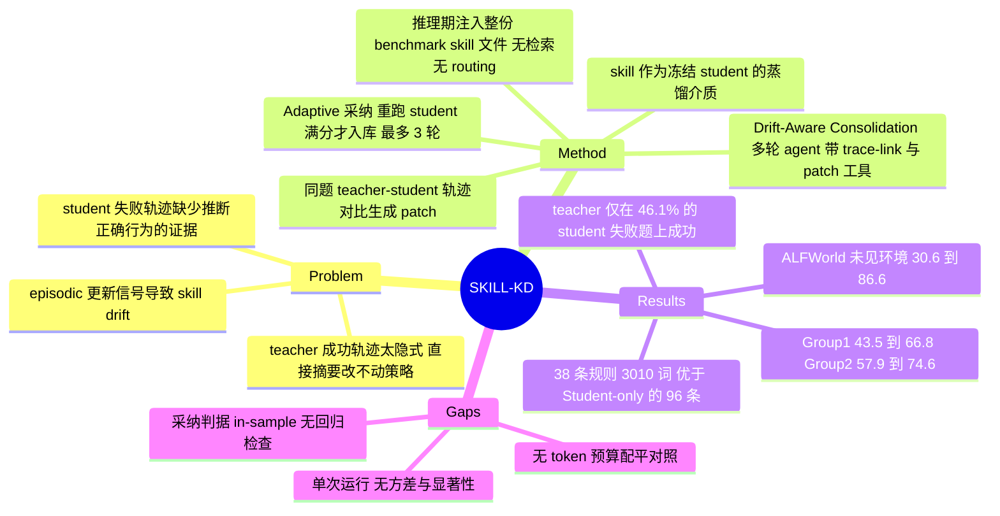

## Summary

SKILL-KD 把 teacher 与 student 在同一道题上的轨迹差异蒸馏成文本 skill patch，采纳判据是"带上该 patch 让 student 重跑这道题，evaluator 给满分"，并用 trace-linked edit history 让 consolidation agent 决定 add / modify / delete / skip。五个 benchmark 上，Group 1 宏平均 43.5 → 66.8、Group 2 57.9 → 74.6，均高于最强 baseline SkillOpt 的 63.5 / 68.6。但所谓 distillation 只发生在 prompt 侧：student 权重全程冻结，推理期仍要把整份 benchmark 专属 skill 文件注入 context，全文没有任何 token 预算配平对照。

## Problem & Motivation

现有 skill 获取方法把 skill 当作经验摘要、memory 条目或成功轨迹的总结，作者认为这对能力较弱的 student agent 是错配的：student 失败的轨迹里往往不含推断出正确行为所需的证据，而 teacher 的成功轨迹又太隐式，直接摘要成规则不足以改变 student 的策略。

作者的重新表述是把 skill 当作**不同能力 agent 之间的蒸馏介质**。经典知识蒸馏通过 label、logits、中间表示、rationale 或轨迹传递强模型行为，student 靠参数或策略更新吸收；在这里 student 冻结，蒸馏载体变成挂在 prompt 侧 skill library 上的外部文本产物。核心瓶颈随之从"拿到行为证据"变成"把 teacher-student 之间的行为差距翻译成 frozen student 真能照做的文本"。

第二个动机在 repository 层：skill 本应是描述"如何解一类任务"的过程性产物，但更新信号来自 episodic 证据（轨迹、反思、执行反馈）。这个错配会造成 skill drift——修当前失败的 patch 过拟合窄 case、堆冗余规则、或覆写早先 skill 编码的知识。

## Method

**skill 表示**。skill library $\mathcal{K}$ 是 student 与 teacher 共享的一份结构化 Markdown。每条 skill 内部记为 $p=(\mathrm{title},\mathrm{content},\mathrm{why},\mathrm{trace})$：`title` 是短名词短语，`content` 是形如 "When \<trigger\>, do \<action\>" 的一句可执行指令且 trigger 必须是 type-level（prompt 模板明确禁止绑定文件名、单元格地址、房间名或具体物体名词），`why` 记录该次更新的理由，`trace` 指回源轨迹。只有 `title` 与 `content` 渲染进 student/teacher 看到的 skill 文件，`why` 与 `trace` 留在只有 consolidation agent 能访问的内部 edit history。

**Contrastive Skill Distillation**。对每个训练实例 $x$，student 先带当前 library 跑一遍；若 evaluator $r(x,\tau)=1$ 则跳过。student 失败时才在同一实例上跑 teacher，由 consolidation agent 结合两条轨迹与各自的评分生成候选 patch。teacher 不必满分——作者论证即使 teacher 也失败，两条轨迹的中间决策分歧仍是可用的行为证据。

**Adaptive Skill Distillation**。这是采纳机制。候选 patch $p^1$ 应用到 library 后 student 重跑同一实例；$r(x,\tau_S^1)=1$ 则 patch 入库，否则 consolidation agent 看着新的 student 轨迹提出修订版 $p^{i+1}$，每一版都是针对原始 $\mathcal{K}$ 提出并取代此前所有 patch。最多 $n$ 轮（默认 $n=3$）；$n$ 轮内没有一次成功则该实例不产出任何 skill 更新。中间失败的 patch 不写进 $\mathcal{K}$ 也不写进持久 edit history，只留在实例级 refinement record 里。

**Drift-Aware Skill Consolidation**。consolidation agent 不是单次前向，而是带工具的多轮 agent，用的模型就是各组的 teacher（Group 1 用 Qwen3.7-plus，Group 2 用 ChatGPT-5.5）。edit history $\mathcal{H}$ 逐条记录 $(op_j, p_j)$，$op\in\{add,modify,delete,skip\}$；轨迹本身不默认进 context，而是外部存储、按需取回。两个工具：`get_original_trajectories` 按 `edit_index` 取回某条历史编辑背后的完整 student/teacher 轨迹；`submit_ops` 提交最多 3 个 add/update/delete 操作（空数组表示不改）。实践中 agent 会先跨多轮调 trace-link 取回相关条目的轨迹，识别跨实例模式、检测与既有 skill 的冲突，再决定合并还是新增。

**推理期形态**。student 权重全程冻结。训练重跑与 held-out 评测时，agent 拿到的是该 benchmark 当前 skill 文件的**全文**；作者明说选这个 full-skill-file 设定是因为本文聚焦获取、验证与合并而非学习式检索或 routing。每个 benchmark 单独训练与评测一份 skill library。

## Key Results

**主表（Table 1，held-out test split，单次运行）**

| Method | SearchQA | Spreadsheet | DocVQA | LiveMath | ALFWorld | Avg |
|:--|--:|--:|--:|--:|--:|--:|
| *Group 1：student Qwen3.5-4B / teacher Qwen3.7-plus* | | | | | | |
| No Skill | 68.1 | 9.3 | 86.9 | 22.4 | 30.6 | 43.5 |
| EvoSkill | 68.6 | 17.9 | 79.7 | 23.4 | 67.9 | 51.5 |
| Trace2Skill | 68.5 | 19.3 | 88.0 | 27.2 | 64.9 | 53.6 |
| SkillGen | 69.2 | 13.2 | 88.8 | 21.0 | 70.1 | 52.5 |
| SkillOpt | 71.2 | 23.9 | 89.0 | 52.0 | 81.3 | 63.5 |
| SKILL-KD | 79.2 | 24.3 | 89.3 | 54.8 | 86.6 | **66.8** |
| *Group 2：student Qwen3.6-35B-A3B / teacher ChatGPT-5.5* | | | | | | |
| No Skill | 72.7 | 38.2 | 87.6 | 31.2 | 59.7 | 57.9 |
| EvoSkill | 75.6 | 32.9 | 89.8 | 32.3 | 79.1 | 61.9 |
| Trace2Skill | 75.4 | 33.2 | 90.4 | 29.6 | 70.9 | 59.9 |
| SkillGen | 75.2 | 40.0 | 90.1 | 36.3 | 63.4 | 61.0 |
| SkillOpt | 80.3 | 47.5 | 91.4 | 41.6 | 82.1 | 68.6 |
| SKILL-KD | 80.6 | 49.3 | 92.2 | 54.8 | 96.3 | **74.6** |

净增益 Group 1 为 +23.3、Group 2 为 +16.7。ALFWorld 的 test split 由 skill 构建时未见过的环境组成，SKILL-KD 在其上把 Qwen3.5-4B 从 30.6 推到 86.6（+56.0）、把 Qwen3.6-35B-A3B 从 59.7 推到 96.3（+36.6）。所有 baseline 与 SKILL-KD 共用同一冻结 student、同一 harness、同一 held-out split 与同一 scorer。

**信号来源消融（Table 2，Group 1）**：同时报分数与 library 规模。

| Variant | Avg. Score | Avg. Gain | Rules | Words |
|:--|--:|--:|--:|--:|
| No Skill | 43.5 | +0.0 | 0 | 0 |
| Teacher-only | 58.3 | +14.8 | 80 | 5,683 |
| Pairwise（单次对比，无自适应） | 59.0 | +15.5 | 85 | 6,966 |
| Batch（4 条轨迹一次聚合） | 59.4 | +15.9 | 46 | 3,849 |
| Student-only（自反思） | 60.1 | +16.6 | 96 | 6,821 |
| SKILL-KD | 66.8 | +23.4 | 38 | 3,010 |

Teacher-only 是最弱的学习变体，说明拿到更强轨迹并不自动产出 student 对齐的指导；Student-only 分数尚可但堆到 96 条规则、6,821 词。SKILL-KD 用不到一半的规则数拿到最高分。

**Drift-Aware Consolidation 消融（Table 3，Group 1）**：消融臂保留 patch 工具（仍可增删改跳），只移除 edit log 与 trace-link 访问。

| Variant | SearchQA | Spreadsheet | DocVQA | LiveMath | ALFWorld |
|:--|--:|--:|--:|--:|--:|
| No Skill | 68.1 | 9.3 | 86.9 | 22.4 | 30.6 |
| w/o Consol. | 79.2 | 14.6 | 87.4 | 27.4 | 85.1 |
| w/ Consol. | 79.2 | 24.3 | 89.3 | 54.8 | 86.6 |

SearchQA 打平、ALFWorld 接近，差距集中在 SpreadsheetBench（+9.7）、LiveMath（+27.4）与 DocVQA（+1.9）。

**teacher 不是 oracle（Table 4，Group 1）**：在 student 首轮失败的训练实例上，teacher 平均只成功 46.1%。teacher 成功时 patch 采纳率 45.3%，teacher 失败时 23.2%，且平均 38.5% 的已采纳 patch 来自 teacher 失败的 rollout。

**自适应轮数（Table 6）**：训练集累计成功率 $n{=}0$ 58.9% → $n{=}1$ 67.7% → $n{=}2$ 70.8% → $n{=}3$ 72.7%。首轮贡献最大（+8.8pp），后续递减。

**设定细节**：split 为 ALFWorld 39/18/134、SpreadsheetBench 80/40/280、SearchQA 400/200/1400、LiveMath 35/18/124、DocVQA 107/53/374；无官方划分的 benchmark 用 seed 42 按 2:1:7 确定性切分。SKILL-KD 只用 train 分区，validation 分区专供需要验证集的 baseline，SKILL-KD 自己不用。SpreadsheetBench 最多 12 轮 openpyxl/pandas 执行，ALFWorld 每 episode 最多 50 步，其余三个为单轮 QA/选择题。student 本地部署在 4×A100 80GB，teacher 与 consolidation 走官方 API，reasoning effort 默认 medium。**每个报告分数来自 test split 上的单次完整评测运行**。

## Evidence Ledger

| Claim ID | Claim | Type | Source locator | Evidence excerpt | Status |
|:--|:--|:--|:--|:--|:--|
| C1 | Group 1 宏平均：SKILL-KD 66.8 / SkillOpt 63.5 / No Skill 43.5 | number | Table 1 Group 1 block | "SkillOpt 71.2 23.9 89.0 52.0 81.3 63.5 SKILL-KD 79.2 24.3 89.3 54.8 86.6 66.8" | source-verified |
| C2 | Group 2 宏平均：SKILL-KD 74.6 / SkillOpt 68.6 / No Skill 57.9 | number | Table 1 Group 2 block | "SkillOpt 80.3 47.5 91.4 41.6 82.1 68.6 SKILL-KD 80.6 49.3 92.2 54.8 96.3 74.6" | source-verified |
| C3 | ALFWorld 30.6→86.6（+56.0）与 59.7→96.3（+36.6）；test split 为未见过的环境 | number | §Generalization of Distilled Skills | "improves Qwen3.5-4B from 30.6 to 86.6 (+56.0)"；"test split consists of unseen environments that are not used for skill construction" | source-verified |
| C4 | Table 2：SKILL-KD 66.8 / 38 rules / 3,010 words；Student-only 60.1 / 96 / 6,821；Teacher-only 58.3 / 80 / 5,683 | number | Table 2 | "Student-only 60.1 … 96 6,821 … Teacher-only 58.3 … 80 5,683" | source-verified |
| C5 | 合并消融差值集中在 SS(14.6→24.3)、LM(27.4→54.8)、Doc(87.4→89.3)；SQA 打平 | number | Table 3 | "w/o Consol. 79.2 14.6 87.4 27.4 85.1 / w/ Consol. 79.2 24.3 89.3 54.8 86.6" | source-verified |
| C6 | 采纳判据 = 同一训练实例重跑 evaluator 满分；n=3 上限；无成功则该实例不更新 skill | causal-mechanism | §Adaptive Skill Distillation + Appendix A | "If no adaptive round produces a successful trajectory within n rounds, the instance produces no skill update" | source-verified |
| C7 | 推理期仍把整份 benchmark skill 文件注入 prompt，明确不做检索/routing；每 benchmark 一个库；student 冻结 | benchmark-setting | Appendix A §Benchmark protocol | "the agent receives the entire current skill file … rather than learned skill retrieval or routing" | source-verified |
| C8 | 全文无 token/算力配平对照臂，也不报告任何方法的推理 token 或 prompt 长度成本 | benchmark-setting | 全文含附录（否定性检索） | verifier 全文检索 token/budget/cost/latency/overhead 无命中，仅相关工作标题含 "token efficiency" | source-verified |
| C9 | SKILL-KD 只用 train 分区；validation 分区专供需验证集的 baseline；无官方划分者 seed 42、2:1:7 | benchmark-setting | §Setting + Appendix A | "the validation portion is reserved for baselines whose original protocols require validation or selection" | source-verified |
| C10 | 每个分数来自单次完整评测运行；全文无多 seed 方差、置信区间或显著性检验 | benchmark-setting | Appendix A §Implementation and compute | "Each reported score was computed from a single complete evaluation run on the fixed test split" | source-verified |
| C11 | split 规模 ALF 39/18/134、SS 80/40/280、SQA 400/200/1400、LM 35/18/124、Doc 107/53/374 | number | Table 5 | "ALFWorld 39 18 134 … SearchQA 400 200 1400 … LiveMath 35 18 124" | source-verified |
| C12 | teacher 在 student 失败题上仅成功 46.1%；采纳率 45.3%(T成功) vs 23.2%(T失败)；38.5% 已采纳 patch 源自 T 失败 | number | Table 4 | "Teacher success … 46.1 / Accept T success … 45.3 / Accept T failure … 23.2 / Accepted from T failures … 38.5" | source-verified |
| C13 | 训练集累计成功率 58.9 → 67.7 → 70.8 → 72.7（n=0..3） | number | Table 6 | "n=0 … 58.9 / n=1 … 67.7 / n=2 … 70.8 / n=3 … 72.7" | source-verified |
| C14 | consolidation agent 用各组 teacher 模型，是带 trace-link 与 patch 两个工具的多轮 agent，操作集 add/modify/delete/skip | benchmark-setting | §Setting + §Drift-Aware Skill Consolidation | "a patch tool that commits an operation op∈{add,modify,delete,skip}" | source-verified |
| C15 | 论文未给出任何公开代码或数据链接 | license-code | 全文含脚注与附录（否定性检索） | verifier 全文检索 GitHub/HuggingFace/available at 无命中 | source-verified |
| C16 | 论文未测量已采纳 patch 是否在其他此前成功的实例上造成回归；无 held-out probe、无回归率 | causal-mechanism | 全文（否定性检索） | 检索 regression/forgetting/probe 无命中；"held-out" 仅指 test split 或 baseline SkillOpt 的验证协议 | source-verified |
| C17 | 所有 baseline 与 SKILL-KD 共用冻结 student、harness、held-out split 与 scorer | benchmark-setting | §Baselines | "All baselines use the same frozen student, harness, held-out split, and scorer" | source-verified |
| C18 | Appendix C 的 LiveMath Rule 002 是选择题元选项启发式 | quote | Appendix C, LiveMath Rule 002 | "When a multiple-choice question asks for the 'strongest statement' … select the meta-option" | source-verified |
| C19 | 作者上标 1–4 对应的机构名在 HTML 与 PDF 中均无法解析 | metadata | 标题页 | verifier 检索 affiliation/university/institute 全文无命中；`\corresponding` 宏在 HTML 中渲染失败 | source-verified |
| C20 | SS 最多 12 轮 openpyxl/pandas 执行、ALF 每 episode 最多 50 步、其余单轮无工具调用上限；4×A100 80GB | benchmark-setting | Appendix A | "SpreadsheetBench uses multi-round spreadsheet-code execution … at most 12 turns. ALFWorld allows at most 50 environment steps" | source-verified |

## Strengths & Weaknesses

**采纳判据是可执行的 evaluator，不是 LLM 自评**。这是本文相对多数 skill 生成工作的实质区别：一条 patch 要进库，必须让 student 在真实 harness 里重跑一遍并通过 benchmark 原生 scorer（C6）。按 [[Topics/Harness-Component-Attribution]] 的独立性剂量阶梯，这属于"确定性 / 执行式判据"一栏，而不是同 backbone 换 context 的低剂量自审。Table 4 也没有掩饰 teacher 只在 46.1% 的 student 失败题上成功。

**把 library 规模作为一等指标**。Table 2 每一行都同时报分数、规则数与词数，让"分数换膨胀"这件事可见：Student-only 拿 60.1 要花 96 条规则，SKILL-KD 拿 66.8 只用 38 条。这个报告习惯值得推广。

**"蒸馏"这个词与实际机制不符**。经典 KD 把 teacher 行为搬进 student 参数，推理期不再需要 teacher 侧产物；SKILL-KD 的载体是 prompt 文本，推理期要把整份 benchmark skill 文件注入 context，且明确放弃检索与 routing，每个 benchmark 还各训一份库（C7）。这更接近"为每个 benchmark 生成一份经过执行验证的 cheat sheet"，而不是能力迁移。与 [[Papers/2606-LatentSkill]] 把 textual skill 编译成 LoRA（推理期零 skill token）相比，两者方向相反。

**没有 token 预算配平对照**（C8）。No Skill 臂每次推理零额外 token，SKILL-KD 臂每次推理多吃一份 3,010 词的 skill 文件（Group 1），二者之间的差值同时包含"内容有用"与"上下文更长"两个来源，论文既不做配平臂也不报推理 token。这正是 [[Papers/2606-SkillMemoryBudget]] 已给出否定结论的那个对照：三模型 × 三 WebArena 域上，把模块开销折成 actor 的额外步数后，vanilla 全面追平或反超。SKILL-KD 的设定与之不完全同构（它的 skill 是离线摊销的，不在每任务在线归纳），但"注入内容后不报 context 成本"这一点是同一个缺口。

**采纳判据是 in-sample 的，且没有回归检查**。patch 只在生成它的那一道训练题上被验证（C6），既没有留出探针，也没有回过头去测它是否弄坏了此前已成功的实例（C16）。这与论文自己主张要解决的 drift 问题直接冲突——drift 的证据全部来自 case study（DocVQA 的单位保留规则被逐案改写、SpreadsheetBench 的 50 条规则 2,930 词含 `P6:Q6` 这类坐标级修补、tiered-bonus 规则被后续 patch 覆写），没有任何量化的回归指标。作为对照，[[Papers/2605-GRASP]] 的闸门用留出平衡探针加硬回归预算（净修好 > 新弄坏，且绝对弄坏数不增加），[[Papers/2606-SkillNb]] 直接报回归率（去 gate 后 3.3% → 18.6%），而本文的 baseline [[Papers/2605-SkillOpt]] 本身就是"仅在 held-out validation 严格提升时接受编辑"。SKILL-KD 把 validation 分区划给 baseline 而自己不用（C9），等于主动放弃了这条最便宜的对照。

**Table 3 的消融混淆了两个变量**。w/o Consol. 臂同时移除 edit log 与 trace-link 访问，无法区分"看到历史编辑的 rationale"与"取回原始轨迹"哪一个在起作用。LiveMath 上 27.4 → 54.8 这么大的差距值得拆开。

**增益来源部分是 benchmark 标注惯例的拟合**。Appendix C 列出了 Group 1 的全部最终规则：SearchQA 的 15 条几乎都是答案格式约定（保留人名 middle initial、原名优先于译名、复数形式跟随上下文、Jeopardy "CATEGORY - Clue" 格式解析），LiveMath Rule 002 直接是"题目若提供声称存在更强结论的元选项就选它"（C18）。这些不是过程性知识，是对该数据集出题与判分习惯的编码。论文说跨五类任务的普遍增益"suggests reusable procedural guidance rather than benchmark-specific prompt tuning"，但每个 benchmark 单独训一份库这个设定本身就削弱了该论断——没有任何跨 benchmark 迁移实验。

**ALFWorld 的 +56.0 需要放回上下文**。所有 skill baseline 都把 30.6 抬到 63.4–70.1，说明大头是"给了 ALFWorld 的四类任务动作模板"这一格式性修复，而非 SKILL-KD 特有。其 train split 只有 39 题，最终产出 4 条规则。

**统计强度弱**。单次运行、无方差、无显著性（C10），而 LiveMath test 只有 124 题、ALFWorld 134 题。Table 4 的部分格子分母极小到不可解读：LiveMath 的 "Accept | T success" 是 0.0% 而 "Accepted from T failures" 是 100.0%，ALFWorld 恰好相反（57.1% / 0.0%）——用这两行支撑"teacher 失败也能产出有用 patch"是过度解读。另有一处巧合值得作者确认：LiveMath 上 Group 1 与 Group 2 的 SKILL-KD 得分都是 54.8（124 题中的 68 题），两条完全不同的 student/teacher 管线落在同一个整数上。

## Mind Map

## Notes

**与 vault 既有否定性证据的三点对账。**

*(a) 蒸馏之后推理期还需不需要 skill library？* 需要，而且是全量注入。student 权重全程冻结，held-out 评测时 agent 拿到的是该 benchmark skill 文件的全文，论文明确说不做学习式检索或 routing，且每个 benchmark 各训一份库（C7）。这条把它与两个方向都区分开：[[Papers/2606-LatentSkill]] 把 textual skill 通过 hypernetwork 编译成 LoRA，目标恰恰是消除推理期 skill token；[[Papers/2607-SESA]] 的 dual-path 分解有 SESA-Off 这条关掉 bank 的臂，用来证明多数增益已沉淀进策略参数（比 SSP 高 1.8–2.2 分）。SKILL-KD 没有也不可能有等价的臂——关掉 skill 文件它就退化成 No Skill。因此"skill 全部进了权重"在这里为否，全部增益都寄存在推理期 context 里。

*(b) 有没有 token-matched / 预算配平对照臂？* 没有（C8）。论文报了 library 的词数（Group 1 为 3,010 词），但那是资产规模统计，不是把同等预算还给 vanilla 臂的对照。[[Papers/2606-SkillMemoryBudget]] 的核心结论正是配平后增益被追平：Vanilla-IB 用同等 token 换 15 步交互上限，在三模型 × 三 WebArena 域上聚合成功率全面追平或反超 AWM/ASI/ReasoningBank，且多数配置 token 更省。[[Papers/2608-ContinualSkillBench]] 从另一侧给出同族信号：pure-ICL 0.605 对 Sequential 0.602，显式 skill 维护相对"只保留上下文与反馈"的净贡献在总量上不可分辨。SKILL-KD 的设定并非与二者同构——它的 skill 是离线摊销的，不在每个任务上付在线归纳成本，所以 SkillMemoryBudget 的结论不能直接搬过来。但最便宜的对照仍然缺席：给 No Skill 臂注入等长的通用/无关文本，或者干脆报出每方法的推理 token 与 prompt 长度。在补上之前，Group 1 的 +23.3 里有多少来自内容、多少来自 context 变长，无法分离。

*(c) skill 采纳有没有 held-out 验收判据？* 判据是执行式的但不是 held-out 的。patch 采纳等价于"带上它让 student 重跑生成它的那一道训练题并通过 evaluator"（C6）——好消息是判官是 benchmark 原生 scorer 而非 LLM 自评，按 [[Topics/Harness-Component-Attribution]] §3.2 的剂量阶梯属高剂量；坏消息是这个门只在单个 in-sample 实例上开合，没有留出探针，也从不检查已采纳 patch 是否弄坏此前成功的实例（C16）。对照组很清楚：[[Papers/2605-GRASP]] 用 36 条平衡留出探针加"绝对弄坏数不增加"的硬回归预算，[[Papers/2606-SkillNb]] 报出去 gate 后回归率 3.3% → 18.6%，本文自己的 baseline [[Papers/2605-SkillOpt]] 要求 held-out validation 严格提升才接受编辑。SKILL-KD 把 validation 分区明确留给需要它的 baseline 而自己不用（C9），所以 Table 3 里 consolidation 带来的那些提升到底是"避免了回归"还是"多写对了规则"，无法从现有数据判断——drift 的三种形态只有 case study，没有一个数字。

**对 Harness-Component-Attribution 的增量。** 该 Topic 的收敛结论是"组件收益与基线轨迹质量负相关"。本文在 benchmark 层面同形：DocVQA 基线已 86.9/87.6，增益只 +2.4/+4.6；ALFWorld 基线最低（30.6/59.7），增益最大（+56.0/+36.6）。但在 group 层面部分不成立——Group 2 的 No Skill 基线明显更强（57.9 对 43.5），净增益 +16.7 虽小于 Group 1 的 +23.3，量级并未坍缩，且 Group 2 在 SpreadsheetBench 上仍拿到 +11.1。可以据此把该 Topic 的表格补一行：本文的被隔离组件是 edit-history 与 trace-link 访问（Table 3），对照口径为同 student、同 harness、同 held-out split，净效应宏平均 +8.1（SQA 0 / SS +9.7 / Doc +1.9 / LM +27.4 / ALF +1.5，差异几乎全部集中在 SpreadsheetBench 与 LiveMath），证据强度中——消融同时移除了两个变量，且单次运行无方差。

**可做的最小实验（按代价排序）**：(1) 报出每个方法在 test split 上的平均 prompt token 与总推理 token，这是从现有 log 里直接可提取的；(2) 加一条 length-matched 的 No Skill 臂（注入等词数的通用 agent 指导或打乱后的 skill 文件），用来分离内容与长度；(3) 每采纳一条 patch 就在此前已成功的训练实例上重测，报回归率——这是把 GRASP 的硬回归预算搬过来的最小版本；(4) 拆开 Table 3 的消融，让"有 edit log 无 trace-link"单独成一臂。

**一个反直觉数据点值得记住**：Table 4 显示 38.5% 的已采纳 patch 来自 teacher 也失败的 rollout。如果这个数字在更大样本上稳住，它对"必须有更强 teacher"这个前提是个削弱信号——真正在起作用的可能是"同题两条轨迹的分歧位置"这个定位信息本身，而不是 teacher 的正确性。当前证据不足以支撑该推断（Table 4 的多个格子分母只有个位数），列为待检验假说。
