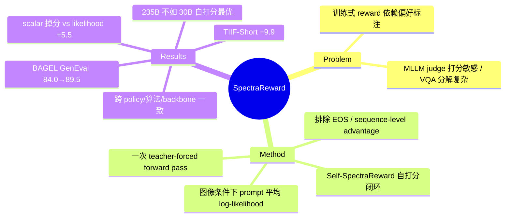

## Summary
提出 SpectraReward：不训练任何 reward model，直接用 frozen 预训练 MLLM 对"生成图像条件下原 prompt 的平均 log-likelihood"（一次 teacher-forced forward pass）作为 T2I 图像生成 RL 的 reward；变体 Self-SpectraReward 让 unified model（BAGEL）用自己的 understanding 分支给 generation 分支打分。在 BAGEL/SD3.5-M × 3 种 RL 算法 × 9 个 reward backbone 上一致提升（BAGEL GenEval 84.0→89.5，TIIF-Short +9.9），并发现 reward-policy 分布对齐比 reward model 规模更重要——自打分能追平 30B、超过 235B 外部 reward。

## Problem & Motivation
- T2I 图像生成 RL 需要 reward model，现有路线两条都有代价：(1) 训练式 reward（ImageReward / PickScore / HPSv2）依赖昂贵的人类偏好标注，且分布固化后易被 hack；(2) MLLM-as-judge 路线要么直接打 scalar 分（对 judge calibration 敏感），要么走 VQA question-decomposition（TIFA/DSG/AlphaGRPO 一类，pipeline 工程复杂度高）。
- 作者的出发点：MLLM 预训练时已经学到了 image-text alignment，与其让它"当裁判"，不如直接调用它最本征的能力——图像条件下的语言建模。若图像忠实呈现了 prompt 语义，"把 prompt 读回来"（read it back）的 likelihood 就应该高。

## Method
**SpectraReward（核心公式）**：
- Reward 定义为图像条件下 prompt 的 token 平均 log-likelihood：`R_M(x,y) = 1/(T-1) · Σ_t log p_M(x_{t+1} | x_{≤t}, y)`，其中 x 为 prompt、y 为生成图像、M 为 frozen MLLM。
- 计算上只需**一次 teacher-forced forward pass**（无自回归解码、无 QA pipeline），token-wise likelihood 序列被称为 "semantic spectrum"，取均值得 scalar reward。
- 无需 preference label、无需 reward fine-tuning、无需 question decomposition——与 scalar scoring 和 VQAScore 的区别就在于直接复用预训练的 image-conditioned LM 能力。

**Self-SpectraReward**：
- 对 unified multimodal model（如 BAGEL），用 policy 自己的 understanding 分支给 generation 分支打 reward，形成无外部模型的自我提升闭环。
- BAGEL 的 understanding 分支同时吃 ViT 语义特征和 generation encoder 的 VAE 特征；ablation 显示带 VAE 特征更好（GenEval 87.8→89.5，TIIF-Long +0.8）。

**RL 设置**：
- Policy：BAGEL（主）、SD3.5-M；RL 算法：AWM（默认、最优）、FlowGRPO、DiffusionNFT。
- Reward backbone 覆盖 4 个家族 9 个模型（Gemma3 4B/12B、InternVL3.5 8B/14B、Qwen3-VL 8B/30B-A3B/235B-A22B、BAGEL 自身）。
- 训练：每步 32 prompts × group size 16，380 步，32 张 A100。
- 细节 ablation：排除 EOS token 的 likelihood 更好（+1.0 GenEval）；sequence-level advantage 优于 token-level。

## Key Results
**主结果（BAGEL, 512px, Self-SpectraReward vs baseline）**：

| Benchmark | BAGEL | +Self-SpectraReward | Δ |
|:---|:---|:---|:---|
| GenEval | 84.0 | 89.5 | +5.5 |
| TIIF-Short | 75.2 | 85.1 | +9.9 |
| TIIF-Long | 78.6 | 84.3 | +5.7 |
| DPG-Bench | 85.07 | 87.73 | +2.66 |
| WISE (1024px, w/ CoT) | 0.70 | 0.76 | +0.06 |

- 对比 MLLM-based RL baseline AlphaGRPO：SpectraReward 在 TIIF-Short 上 +6.3、GenEval +3.3。
- **Reward 形式 ablation**（同一 MLLM）：scalar scoring (1-5) 反而比 baseline 掉 6.3 GenEval；VQA-Score 几乎无增益；prompt likelihood +5.5——直接支撑核心 claim。
- **Scaling 反直觉发现**：reward MLLM 变大不单调变好——Qwen3-VL 8B→30B 有提升，235B 反而下降；BAGEL 自打分（~14B 级）追平 30B 外部模型、超过 235B。作者归因于 reward-policy 分布对齐比绝对能力更重要。
- 泛化性：跨 2 个 policy、3 种 RL 算法、9 个 reward backbone 一致为正；512px 训练迁移到 1024px 仍有效（GenEval 89.8）。
- Token-level 敏感性分析（Fig. 3）：数量画错时数量词的 likelihood 下降、物体画错时对应名词 likelihood 骤降——semantic spectrum 确实对局部错误有定位能力。

## Strengths & Weaknesses
**Strengths**：
- 方法极简且第一性：把 reward 定义还原到 MLLM 预训练目标本身（image-conditioned LM），一次 forward pass 即得 reward，对比 VQA-decomposition 是数量级的工程简化。Reward 形式 ablation（scalar 掉分、VQA-Score 无效、likelihood +5.5）是全文最有说服力的证据。
- "Reward-policy alignment > reward scale"（235B 不如 30B、自打分最优）是有信息量的经验发现，对整个 RLHF/RLAIF 领域都有参考价值——reward model 与 policy 的分布匹配可能比 reward model 的绝对能力更关键。
- Self-SpectraReward 给 unified model 提供了一条干净的 self-improvement 路径：understanding 分支免费监督 generation 分支。
- 验证矩阵宽（2 policy × 3 RL 算法 × 9 backbone × 5 个 OOD benchmark），不是单点结果。

**Weaknesses**：
- **零人类评估**（已知）：全部 5 个 benchmark 都是自动指标（rule-based 或 model-judged），没有任何 human preference 对照，也没报告 reward 与人类判断的 Spearman/Pearson 相关性——对一篇 reward model 论文这是显眼的缺口。
- **Reward hacking 只字未提**（已知，论文无 KL/anti-hacking 讨论）：prompt-likelihood reward 有一个众所周知的退化解——把 prompt 文字直接渲染进图像即可推高 likelihood（推测，属于 caption-likelihood reward 的经典失效模式），论文未讨论也未验证是否发生。
- 只优化 alignment，不覆盖 aesthetics / fidelity：likelihood reward 天然不度量画质，长期 RL 是否牺牲视觉质量未评估（论文仅在 Appendix 承认 reward 上界受 backbone 理解能力限制，如 "hot coffee" 的蒸汽这类隐含语义捕捉不到）。
- Likelihood-as-alignment 并非全新：VQAScore 已用生成式 likelihood 做 alignment metric，image-conditioned caption likelihood 作为度量也有先例（推测）；本文的增量主要在"作为 RL reward 的系统验证 + self-reward + alignment>scale 发现"，而非度量本身。
- 无计算成本分析：虽然单次 forward 直觉上便宜，但 235B reward model 的 RL 开销、与 ImageReward 类小模型的 wall-clock 对比都缺失。

**影响**：给 T2I RL 提供了一个近乎零成本的 reward 起点，且 self-reward 路线对 unified model（BAGEL/Janus 系）后训练可能成为标配组件；"reward-policy alignment"假设值得在 LLM RLHF 侧复验。

## Mind Map

## Notes
- 与 [[2607-GRPONullWebAgent]] 呼应的问题意识：RL 增益从哪来。本文的 headroom 明确（BAGEL 在 TIIF 上距离饱和很远），增益可信度比 GenEval（接近饱和区）上的 +5.5 更高。
- 值得追问：Self-SpectraReward 是"policy 优化自己 understanding 分支的 likelihood"——这本质上是 self-distillation 式闭环，为什么没有 collapse？可能因为 understanding 分支 frozen、且 RL 只更新 generation 分支。若两分支联合训练，闭环稳定性存疑。
- "Reward-policy alignment" 的机制解释论文停留在假设层面：235B 掉分究竟是分布失配、还是大模型 likelihood 更平（entropy 校准差异）导致 group 内 advantage 信号变弱？未拆解。
