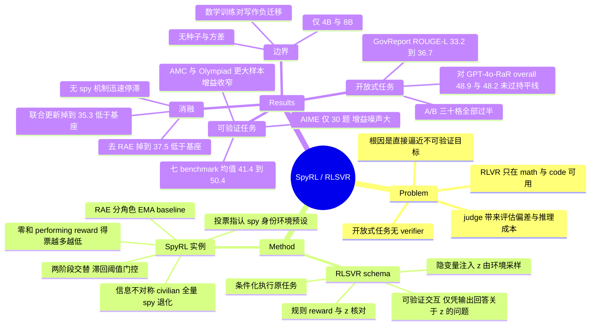

## Summary

RLSVR 提出把 open-ended 任务改写成一个自带 ground truth 的 proxy environment——环境注入一个隐变量并按规则核对交互结果，从而为没有 verifier 的任务造出可验证 reward。其实例 SpyRL 把"生成质量评估"转成"谁是卧底"式的身份识别：多数 civilian 拿完整输入、一个 spy 拿被掩蔽的输入，各自完成同一任务后互相投票，环境预设的 spy 身份让投票正确性完全可验，而得票数反过来充当生成阶段的 reward。在 summarization、creative writing 与数学推理上 SpyRL 优于 R-Zero / Absolute Zero，但对 GPT-4o-RaR 的整体胜率仍低于 50% 的持平线。

## Problem & Motivation

RLVR 之所以能规模化，是因为 verifier 提供无偏、无限、近乎零成本的监督；代价是它只在 math / code 这类答案可判定的领域成立。开放式任务（摘要、创意写作）的真实目标是一个隐式质量函数 $q$，现有做法是拿一个近似评估器去逼近它——RLHF/DPO 的偏好模型、LLM-as-a-Judge、rubric 打分——但这会重新引入评估偏差、把 policy 的上限锁在评估器的能力上，并给每次 rollout 增加推理开销。

作者的诊断是：这些方法的共同错误在于**直接逼近那个不可验证的目标**。参照 self-supervised learning 的做法（不去补缺失标签，而是构造一个标签由数据自动生成的 pretext task），本文主张把"可验证性"从任务的固有属性变成一个可以被设计出来的属性。

## Method

**RLSVR（范式层）**：一个 task transformation $T$ 把原任务映射到 proxy environment，四步组成——

1. **Latent-variable injection**：环境采样输入 $x$ 与隐变量 $z$，并把 $z$ 记为该 episode 的 ground truth（$z$ 可以是"哪个输入被扰动""哪部分信息被扣掉""每个输出在什么条件下生成"），$z$ 永不直接暴露给 policy。
2. **Conditioned task execution**：环境由 $(x, z)$ 构造观测，policy 在每个观测上执行**原任务**——这一步保证被训练的能力仍是目标任务的能力。
3. **Verifiable interaction**：环境规则提出一个关于 $z$ 的问题，且必须仅凭任务输出来回答；transformation 的设计要让"答对这个问题"依赖于步骤 2 输出的质量。
4. **Rule-based reward**：把交互结果与记录的 $z$ 逐条核对算 reward。

核心性质是 **ground truth exists by construction**：$z$ 由环境自己采样，任何关于 $z$ 的预测都能像数学 verifier 核对最终答案一样被精确核验，标准 GRPO 机器可以直接套用。

**SpyRL（实例层）**：把开放式生成转成两阶段闭环博弈。

- **Performing stage（信息不对称）**：采样实例后均匀采一个 spy index，spy 观测为 $g(x)$、civilian 观测为 $x$；$g$ 是信息退化算子（连续 span masking / 部分上下文移除），只遮住完成任务所需的关键信息，保留风格、长度与主题一致性，以防 detector 走表面捷径。所有玩家在各自观测上做同一任务（写摘要、写故事、或自拟并求解数学题）。
- **Detection stage（可验证 reward）**：所有输出公开，每个玩家投票指认 spy；因为身份由环境指定，$r^{\text{det}} = \mathbb{1}[\hat{s}_i = s]$ 直接可算。detector 侧用 GRPO 式 group-relative advantage（组内均值/标准差归一化），无需 critic，且集体投票让单个 detector 的误判不主导优化方向。
- **Zero-sum performing reward**：得票越多 reward 越低；spy 与全体 civilian 的 reward 之和恒为零，civilian 内部还有一项组内一致性惩罚——学习信号因此是**相对的**（"比同组其他人写得好"），而非直接优化一个不可验证的质量分。
- **Role-Advantage Estimation (RAE)**：spy 与 civilian 的原始 reward 分布结构性失衡，用两个 role-specific EMA baseline 分别去中心化，避免把"信息劣势"误算成"策略差"。
- **交替优化**：每个 epoch 只更新一个阶段、另一个冻结，由带滞回的阈值门控切换（detection 准确率 $T_{\text{acc}}=0.9$ 触发转向 performing，错误率 $T_{\text{err}}=0.4$ 或 N/A 率触发转回 detection，最小驻留 5 步）。detection prompt 允许输出 `\boxed{N/A}` 表达不确定，避免强行猜测。

实现基于 verl + GRPO，backbone 为 Qwen/Qwen3-4B-Instruct-2507，单节点 8 GPU，128 prompt × 8 rollout = 有效 batch 1024，100 轮迭代，5 名玩家 1 轮博弈。

## Key Results

**开放式任务**。summarization 五个 benchmark 上 SpyRL 的 ROUGE-L 全面最高：GovReport 相对 Absolute Zero 由 33.2→36.7（Qwen3-4B）、32.5→34.1（Qwen3-8B）；Table 1 的 30 个 A/B 格子全部过半。creative writing 上 SpyRL 在全部细粒度维度胜出，novelty 与 emotion 的优势最大。

**关键对照组（比主表更有信息量）**。附录 D.1 把每个方法对**自己的** untrained backbone 做 A/B：untrained 自比是 51.7% / 51.8%（说明换序聚合确实抹掉了大部分 position bias）；R-Zero 在 summarization 上是 51.9% / 51.5%——等于没训练；在 creative writing 上 R-Zero 对 Qwen3-4B 只有 48.8% / 46.5%，**训练反而让写作变差**。也就是说主表所"显著超越"的两个 self-play baseline，在开放式任务上本就处在持平线附近。

**真正的对手是 rubric-as-reward**。Table 5 中 SpyRL 全面胜过 Qwen3.5-27B-RaR（overall 59.3% / 56.2%），但对 GPT-4o-RaR 的 overall 只有 **48.9% / 48.2%**，coherence（45.8% / 45.0%）与 consistency（44.5% / 43.7%）明显落后——按 50% 持平线读，SpyRL 整体上**输给了** GPT-4o-RaR。论文只说"remains competitive"。其价值主张因此应读作成本-性能权衡：论文称两个 RaR 基线分别产生约 \$200 与 \$900 的额外 verifier 开销，SpyRL 无外部 verifier。

**可验证任务**。Table 3 七个 benchmark 上 SpyRL 均最优；论文正文的 "8.97% / 6.16%" 是七 benchmark **平均分的绝对点数差**（Table 9 的 Avg 列给出 Qwen3-4B 41.4→50.4），不是相对增益。但增益的构成需要警惕：AIME 25 由 6.7→20.0、AIME 24 由 10.3→13.3，而论文自己在 D.2 承认 AIME 24/25 各只有 30 题——6.7→20.0 即 2 题→6 题；GPQA-D 26.3→41.3 是一个纯数学域训练的模型在博士级科学问答上涨 15 个点。更大样本的 D.2（AMC / Olympiad-Bench / SuperGPQA）三项平均 35.9→42.6（+6.7），量级明显收窄，且 SpyRL 是唯一三项全涨的方法。

**Ablation 才是这篇最该读的部分**。Math500 上（epoch 100）：完整 SpyRL 79.5、Only Performing 72.3、Only Detection 69.2、Without spy 71.6（起点均 68.2）——去掉信息不对称后仍有微弱增益但迅速停滞。更尖锐的是两个**净负**结果：去掉 RAE 后七 benchmark 均值 50.4→37.5，**低于 41.4 的未训练 backbone**，且 GSM8K / Math500 / Minerva / MMLU-Pro / GPQA-D 全部劣于基座；两阶段联合更新（而非交替）把五 benchmark 均值从 42.4 压到 35.3（Math500 68.2→53.1）。

**泛化边界**。换 PubMed 语料重训 summarization，在 arXiv / PubMed / BillSum 上 ROUGE-L 28.1→32.5、30.3→35.1、41.3→46.8（均值 +4.9），说明不依赖政府报告这一特定文档分布。但跨任务迁移是单向的：summarization 与 creative writing 互相正迁移，**数学训练出的 checkpoint 在两类写作上全线跌破 50% 持平线**（summarization 41.7%–45.6%，writing 38.5%–42.5%）。玩家数 3→5 平均增益 5.5→9.3，6 与 8 边际递减。masking ratio 20% vs 40% 在 summarization 上几乎无差别。

**评测稳健性**。D.4 换 Gemini-3.5-Flash 复跑 A/B，结论一致；D.5 以人评为 label 报告 GPT-4o 的 precision 85.7%–91.0%、recall 79.4%–93.8%。人评为 10 名博士生对 400 条 prompt 做四路匿名排序，每人 40 条。

## Evidence Ledger

| Claim ID | Claim | Type | Source locator | Evidence excerpt | Status |
|:--|:--|:--|:--|:--|:--|
| C1 | GovReport ROUGE-L 相对 Absolute Zero 由 33.2→36.7（4B）、32.5→34.1（8B） | number | Sec 4.2 / Table 1 | "improving over Absolute Zero on GovReport from 33.2 to 36.7 with Qwen3-4B and from 32.5 to 34.1 with Qwen3-8B" | source-verified |
| C2 | Intro 声称 8B 上 75.4% / 77.3% 胜率，数学推理七 benchmark 提升 8.97% / 6.16% | number | Sec 1 | "SpyRL achieves 75.4% and 77.3% win rates... improving Qwen3-4B and 8B by 8.97% and 6.16%" | source-verified |
| C3 | Qwen3-4B + SpyRL 在 AIME 25 为 20.0（基座 6.7）、AIME 24 为 13.3（基座 10.3） | number | Table 3 | "Qwen3-4B 84.5 68.2 10.3 6.7 ... + SpyRL 93.4 79.5 13.3 20.0" | source-verified |
| C4 | 论文自承 AIME 2024 / 2025 各仅 30 题 | number | Appendix D.2 | "the hardest of them (AIME 2024 and AIME 2025) contain only 30 problems each" | source-verified |
| C5 | 对 GPT-4o-RaR 的 overall 胜率 48.9% / 48.2%，coherence 与 consistency 亦低于 50% | comparison | Table 5 | "GPT-4o-RaR 50.9% 54.2% 45.8% 44.5% 48.9% / 51.8% 52.2% 45.0% 43.7% 48.2%" | source-verified |
| C6 | 两个 RaR 基线分别约 \$200 与 \$900 额外 verifier 成本，SpyRL 无外部 verifier | number | Table 5 caption / Sec 4.2 | "Qwen3.5-27B-RaR and GPT-4o-RaR incur approximately \$200 and \$900 in additional verifier costs, respectively" | source-verified |
| C7 | Algorithm 1 自标 performing reward 为 "non-verifiable rewards made by detectors" | causal-mechanism | Algorithm 1 | "non-verifiable rewards made by detectors" / "verifiable rewards from environment-assigned identity" | source-verified |
| C8 | 票数-质量对齐仅由 100 局 GPT-4o 排序相关性支撑，正文未给相关系数或显著性 | causal-mechanism | Fig 4 / Sec 4.2 | "measured over 100 games on WritingPrompts (left) and GovReport (right)" | source-verified（verifier 全文检索 Pearson/Spearman/p-value 均无命中；Fig 4 为位图无可读数值） |
| C9 | 去掉 RAE 使七 benchmark 均值 50.4→37.5，低于未训练基座 41.4 | number | Table 9 / Sec 4.4 | "removing RAE lowers the seven-benchmark average from 50.4 to 37.5, and degrades GSM8K, Math500, Minerva, MMLU-Pro, and GPQA-Diamond" | source-verified |
| C10 | 联合更新两阶段使五 benchmark 均值 42.4→35.3（Math500 68.2→53.1） | number | Appendix D.3 / Table 16 | "accuracy decreases from 84.5 to 76.8 on GSM8K, from 68.2 to 53.1 on Math500, and from 42.3 to 33.1 on Minerva" | source-verified |
| C11 | 数学训练 checkpoint 在 summarization 与 writing 上全线低于 50%（负迁移） | comparison | Table 7 | "Mathematical Reasoning 45.6% 43.8% 44.1% 41.7% 42.5% ... 38.5% 40.7% 42.5% 42.1% 40.9%" | source-verified |
| C12 | 人评为 10 名博士生 / 400 条 prompt / 每人 40 条，未报告标注者间一致性 | benchmark-setting | Sec 4.2 / Appendix D.5 | "Ten Ph.D. students evaluate 400 randomly sampled prompts... each evaluator assesses 40 instances" | source-verified（verifier 检索 kappa/Fleiss/Krippendorff/inter-annotator 无命中；D.5 只报 GPT-4o 对人评的 precision/recall） |
| C13 | 生成长度三处冲突：正文 2048、Table 12 的 4096、附录启动脚本 3762 | benchmark-setting | Sec 4.1 / Appendix C.3 | "set the maximum generation length to 2048 tokens" / "Max Response Length 4,096" / "data.max_response_length=3762" | source-verified |
| C14 | 主表未报告任何误差棒、标准差、随机种子数或显著性检验 | benchmark-setting | Tables 1–3 | （表中与正文均无 ± / std / seed / significance 标记） | source-verified（verifier 检索 \pm、std、error bar、confidence interval、seed 均无命中） |
| C15 | 模型与代码发布于 GitHub，arXiv HTML 标 CC BY 4.0 | license-code | Abstract / HTML header | "Models and code have been released at https://github.com/wangqinsi1/RLSVR/tree/SpyRL"; "License: CC BY 4.0" | source-verified |
| C16 | Absolute Zero 基线为同 backbone 数学域重实现，非原论文发布的 code-oriented checkpoint | benchmark-setting | Appendix D.2 | "we reimplement and train Absolute Zero with the same Qwen3-4B backbone under our math-domain setting" | source-verified |
| C17 | Math500 epoch 100：SpyRL 79.5 / Only Performing 72.3 / Only Detection 69.2 / Without spy 71.6 | number | Table 8 | "Only Performing 68.2 ... 72.3 \| Only Detection 68.2 ... 69.2 \| Without spy 68.2 ... 71.6 \| SpyRL 68.2 ... 79.5" | source-verified |
| C18 | PubMed 重训后 arXiv/PubMed/BillSum ROUGE-L 28.1→32.5、30.3→35.1、41.3→46.8（均值 +4.9） | number | Sec 4.3 / Table 6 | "SpyRL raises ROUGE-L from 28.1 to 32.5, from 30.3 to 35.1, and from 41.3 to 46.8, an average gain of 4.9 points" | source-verified |
| C19 | 仅训练 Qwen3-4B / 8B，基座 Qwen3-4B-Instruct-2507，单节点 8 GPU；无 8B 以上规模 | benchmark-setting | Appendix C.3 | "The base model for our actor and reference policies is Qwen/Qwen3-4B-Instruct-2507. Training was conducted on a single node equipped with 8 GPUs" | source-verified（Qwen3.5-27B / GPT-4o / Gemini-3.5-Flash 仅作 rubric executor 或 judge） |
| C20 | 玩家数 3→5 平均增益 5.5→9.3，6 与 8 边际递减 | number | Fig 5 / Sec 4.4 | "Increasing the number of players from 3 to 5 yields the largest marginal improvement (mean gain: 5.5→9.3)" | source-verified |
| C21 | 主表 self-improvement 基线仅 R-Zero 与 Absolute Zero，无 RLHF/DPO/reward-model 实测对比 | sota-novelty | Tables 1–3 / Appendix C.4 | "We compare our approach with two state-of-the-art proposer-solver self-play frameworks, R-Zero and Absolute Zero" | source-verified（RLHF/DPO/reward model 仅出现在 Intro 与 Related Work） |
| C22 | 掩蔽比例：摘要/写作 20%、数学 40%；20% vs 40% 消融"几乎无差别" | number | Sec 4.1 / Table 10 | "We mask 20% of the input... 40% of the source text is masked"; "the two settings are nearly indistinguishable" | source-verified |
| C23 | 论文称 summarization A/B 的 30 个格子 SpyRL 全部过半，表中确实全部 >50% | comparison | Sec 4.2 / Table 1 | "The ABTest result show that SpyRL wins the majority of comparisons in all thirty cells." | source-verified |
| C25 | 产生 performing reward 的 detector 就是被训练的同一 policy 扮演 detector 角色，非外部或冻结 judge | causal-mechanism | Sec 3.1 / 3.3 / Appendix C.5.2 / C.3 | "The Detection Stage prompt transforms the LLM into a critical evaluator" | source-verified |
| C26 | 交替优化每 epoch 只更新一个阶段，滞回阈值 $T_{acc}=0.9$、$T_{err}=0.4$、N/A 阈值 0.5 与 0.1、最小驻留 5 | benchmark-setting | Sec 4.1 / Appendix C.2 / Table 11 | "T_acc 0.9 \| T_err 0.4 \| T_na 0.5 \| T_na 0.1 \| K_min 5" | source-verified |

## Strengths & Weaknesses

**值得记住的是 framing，不是 SpyRL**。"verifiability need not be an intrinsic property of a task, but can be engineered through task transformation" 是一句 reframing 而非增量方法。它把 RLVR 的适用边界问题从"怎么造一个更好的评估器"改成"怎么造一个自带答案的环境"，并给出了一个足够具体的四步 schema（隐变量注入 → 条件化执行 → 可验证交互 → 规则 reward）。这个 schema 简洁、和 GRPO 正交、原则上可迁移，符合 simple/generalizable 的取向。SpyRL 只是其中一种隐变量选择（"谁的输入被退化"）。

**但"self-verifiable"这个标签在最关键的地方失真**。真正塑造生成质量的是 performing-stage reward，而它等于得票数——由被训练的同一个 LLM 扮演 detector 投出来（C7、C25）。论文自己的 Algorithm 1 就把这一项标注为 "non-verifiable rewards made by detectors"，只有 detection-stage reward 是规则可验的。因此这套设计并没有消除 LLM-as-a-Judge，而是把 judge **内化**进 policy 自身：论文批评外部 judge "caps the policy at the evaluator's competence"，在这里这个 cap 变成自指的。交替优化 + group voting 是对该问题的缓解手段，不是消解。诚实的表述应该是"用自博弈把 judge 的成本降到零、并让 judge 与 policy 共同演进"，而不是"reward 可验证"。

**方法的稳定域比论文的叙述窄**。论文强调 $g(\cdot)$ 是唯一需要按任务指定的组件、且"requires little task-specific engineering"（20% vs 40% 掩蔽率确实几乎无差别）。但同一节的另外两个消融是**净负**：去掉 RAE 掉到 37.5、低于未训练基座 41.4（C9）；两阶段联合更新掉到 35.3、同样低于 42.4 的基座（C10）。也就是说该方法的两个优化侧设计不是"有帮助"，而是"不做就有害"。工程负担从 reward 设计转移到了优化器设计——这削弱了"简洁"的主张，也提示复现门槛不低。

**证据强度与增益归因**。全篇没有种子数、方差、误差棒或显著性检验（C14），所有数字都是单次运行的点估计。数学侧最亮眼的两个数（AIME 25 6.7→20.0、GPQA-D 26.3→41.3）分别落在 30 题的 benchmark 上（4 题之差）和一个与训练域不相关的科学问答上；D.2 用更大样本的 AMC / Olympiad-Bench / SuperGPQA 复测时增益收窄到 +6.7 且 R-Zero 出现回退——附录反而比主表更可信。summarization 侧的 ROUGE-L 提升需要一个论文未做的对照：训练压力是"不要显得像信息缺失"，这与"覆盖更多源文内容"高度同向，而 ROUGE-L 恰恰奖励召回；论文既未报告输出长度统计，也未做长度控制的对照，所以 ROUGE-L 增益里有多少是质量、多少是长度/覆盖，无法从文中分离（此为我的推断，非论文断言）。

**baseline 选择暴露了真实位置**。附录 D.1 显示 R-Zero 在开放式任务上等于没训练、在创意写作上甚至是负增益——主表"显著超越"的两个对手本就在持平线附近，这个比较的信息量有限。真正有信息量的是 Table 5：对 Qwen3.5-27B-RaR 明确胜出，对 GPT-4o-RaR **整体输**（48.9% / 48.2%），且输在 coherence 与 consistency 这两个"是否说得通"的维度上，只在 novelty / emotion 上占优（C5）。这个模式与自博弈的激励结构是自洽的——为了不被投出去，模型有动机让输出显得独特、有信息量，而这未必等于更连贯。论文用"remains competitive"一笔带过，是我认为全文最该被 reviewer 追问的地方。此外全文没有任何 RLHF / DPO / 训练好的 reward model 的实测对比（C21）。

**被诚实报告的边界（这部分做得好）**。数学域训练的 checkpoint 在两类写作上全线负迁移（C11），论文明确给出并解释为能力重叠不足——这恰好反证了 RLSVR 不是通用能力放大器，其收益严格受限于 performing stage 与目标任务的能力重合度。换 Gemini-3.5-Flash 复跑 A/B、报告 GPT-4o 与人评的 precision/recall，也都是加分项。人评的弱点在于每条实例只有一位标注者、且未报告标注者间一致性（C12），Table 4 的人评数字（80.0/78.5/74.0）与 Table 2 的 GPT-4o 数字（81.3/78.9/75.6）几乎重合——这既可以读作评估可靠，也可以读作两者共享同一套判断偏好。

**未被回答的核心机制问题**：detection 准确率随训练如何演化？整个设计押在"输出质量 ↔ 被怀疑程度"这一耦合上，但当 performer 学会掩饰信息缺口后，票数必然趋于噪声；论文的滞回门控（$T_{acc}=0.9$ 触发切换）说明作者意识到了饱和，却没有给出训练全程的 detection accuracy 曲线，也没讨论博弈终局。这与 self-improvement 领域已知的 collapse / reversal 风险直接相关（此为我的推断）。规模上限也未探（仅 4B/8B、单节点 8 GPU，C19）：detector 分辨"完整输入 vs 退化输入"的能力大概率随规模上升，因此该增益在更大模型上是放大还是消失，无从判断。

**综合判断**：概念贡献值得跟踪并可能被复用到其他 RLVR-hard 领域（含 GUI / agent 场景的"轨迹质量无 verifier"问题）；具体实验结论应按"单次运行、小模型、开放式任务上与强 judge 基线打平"来读，不要按摘要口径记忆。

## Mind Map

## Notes

- **框架层与实例层要分开评价**。RLSVR 的 schema 值得单独记住并尝试迁移；SpyRL 只是"隐变量 = 谁的输入被退化"这一种选择。schema 里还有大量未探索的 $z$：哪个输出被换了模型、哪一步推理被删掉、哪个观测来自不同时刻的环境状态。论文只做了 masking ratio 的敏感性分析，transformation 设计空间本身完全没扫过——这是它自己留下的最大开口。
- **对 GUI / agent 方向的潜在迁移**：agent 轨迹质量同样缺 verifier。可以设想的对应 transformation 是"某个 agent 观测到的是被裁剪的 screenshot / 被删掉的中间状态，其余 agent 观测完整，之后互相判断谁的轨迹像是在信息缺失下产生的"。但本文的负迁移结果（C11）提示：只有当 performing stage 真的在练目标能力时才有收益，套用前需要先确认能力重合度。
- 与 vault 已有笔记的张力值得追：[[2607-SESA]] 的 Off/On 分解显示 skill library 的部署期收益极小，本文同样把"自演化"的收益压在训练期分布塑形上；两者可做横向对照。self-evolving / self-play 训练一旦让模型评估自己的产出，就存在退化风险，而本文的 performing reward 恰恰由 policy 自己扮演 detector 产生（C25）——本文没有报告 detection accuracy 的训练曲线，因此无法判断它是否只是把崩塌推迟到了 100 轮之后。
- arXiv abs 页 Comments 字段写有 "COLM 2026"，但页面未声明录用状态；frontmatter 因此保守填 `arXiv`。预取全文为 v2（2026-07-31 修订），`date_publish` 用 v1 提交日 2026-07-26。
- 复现注意：附录 C.3 直接贴了启动脚本，但正文/表格/脚本三处的最大生成长度互相矛盾（2048 / 4096 / 3762，C13）；另外正文说 "group size $n=5$，五个候选回复"，而附录的 GRPO rollouts per prompt 是 8、players 是 5——"group size" 一词在两处指的不是同一个量。
