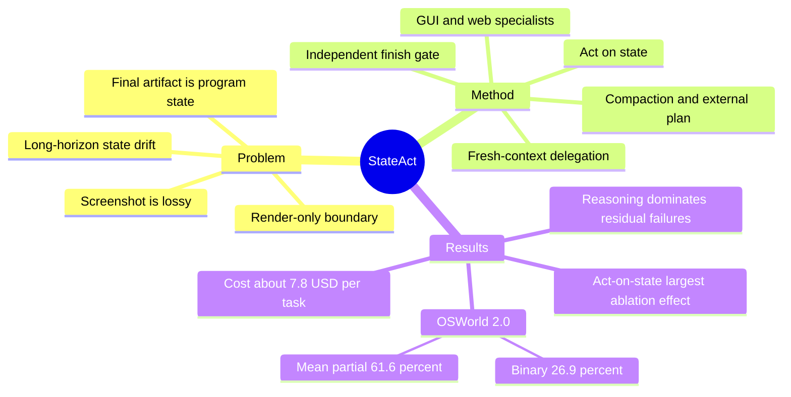

## Summary
StateAct 将 program state 而非 screenshot 设为 main agent 的主要接口，以 code-first action、独立 finish gate、fresh-context delegation 和 context management 组成 long-horizon computer-use harness，并把不可约的视觉交互交给 GUI/web specialists。以 Claude Opus 4.8 为 backbone 时，它在 OSWorld 2.0 上将 binary success 从 20.6% 提升到 26.9%、mean partial 从 54.8% 提升到 61.6%，同时把单任务成本从约 \$72 降至约 \$7.8。Ablation 表明 act-on-state 是最大单项贡献，但 bash-only 仍低于 screenshot baseline；failure audit 又显示剩余错误以 reasoning 为主，finish gate 对 value correctness 的覆盖很弱。

## Problem & Motivation
现有 computer-use agents 通常把 screenshot 当作主要 observation，再优化屏幕理解与 click grounding；但 rendering 是 lossy、non-injective 的，同一画面可能对应不同 formula、hidden row、off-screen data 或 backend state。Long-horizon 任务不仅要求执行许多相互依赖的操作，还要求最终 deliverable 被正确保存，而逐步依赖 pixels 可能累积 state drift，最终 screenshot 也未必能证明 artifact 的结构与持久化状态正确。论文因此把成功条件写成 program state 上的 predicate，主张 action、verification 与 memory 都应优先 ground 到真实 artifact。该原则有明确边界：image editing、layout、chart appearance、WYSIWYG output、canvas dragging、不可 script 的 modal，以及仅存在于屏幕上的信息仍属于 render-only subgoals。

## Method
StateAct 把任务分为 `state-addressable`、`hybrid` 与 `render-only` 三类，并围绕三个核心组件组织 agent loop；其中 act-on-state 又包含独立的视觉与网页 delegation：

1. **Act on state**：main agent 通过 persistent `bash`、Python、file editor、`view_image`、externalized `plan`、`finish` 与 delegation tool 读取和修改 files、application backends、DOM、tables 等 program state，不直接获得 live mouse/keyboard actuation。它先利用对常见应用存储方式的 prior，再通过 `find`、`ls`、`grep`、`sqlite3` 等 probing 定位 state；state discovery 只寻找 state 在哪里，不提供目标值。
2. **视觉与网页 delegation**：当找不到 file/backend/DOM path，或 subgoal 只能由 rendered interaction 表达时，main agent 调用 `cua` GUI subagent；browser 工作则交给能导航、执行 JavaScript、把 DOM serialize 为 markdown 并按 CSS selector click 的 `web` subagent。
3. **Verify on state**：main agent 调用 `finish` 后，独立 finish gate 只看到原始 task instruction 与 machine access，看不到 trajectory、plan、finish rationale 或 expected values，并禁止 editor mutation。它重新定位并读取真正 deliverable，拒绝仅存在于 side file 的证据；若发现 structural defect，可把具体缺口退回 main agent，最多 correction 三轮。
4. **Sustain state**：每次 delegation 使用独立 context 并返回简短报告；接近 context limit 时自动 compact 旧 history、移除 images；持久化 checklist 每轮重新注入，从而让 task facts 与 plan 跨 compaction 保留。

## Key Results
- **OSWorld 2.0（108 tasks）**：StateAct + Claude Opus 4.8 达到 26.9% binary success / 61.6% mean partial；相同 backbone 的 reference CUA harness 为 20.6% / 54.8%，分别提高 6.3 与 6.8 个百分点。
- **效率**：相对相同 backbone 的 reference，平均 output tokens 从 224K 降至 100K，单任务成本从约 \$72 降至约 \$7.8，论文报告约 9× cost reduction。论文还称其 binary success 超过公开的 Opus-4.7（18.2%）与 GPT-5.5（13.0%）结果。
- **GUI 使用率**：GUI subagent 只出现在 28/108 个 tasks，占 main-agent steps 的 1.1%；把 subagent interior turns 算入后，GUI 相关调用约占 total model turns 的 11%。
- **Component ablation（OSWorld 2.0）**：full StateAct 的 mean partial 为 61.6%；移除 act-on-state 后降至 51.3%，移除 finish gate 后为 57.5%，移除 compaction 与 plan 后为 58.7%。
- **Code-only 与 horizon 边界**：bash-only configuration 的 mean partial 仅为 45.9%，低于 reference 的 54.8%；在 short-horizon OSWorld-Verified 上，StateAct 与 reference 的 binary success 接近，为 78.4% 对 77.3%。
- **Failure cases**：79 个 non-perfect tasks 中，38 个被人工归因为 wrong value 或 misread instruction 等 reasoning errors；audio、video、real-time interaction、ambiguous instruction 与 undecomposed task 也是 residual。76 个 non-perfect tasks 到达 finish gate 时，gate 只正确拒绝 8 个，却错误放过 68 个，说明它主要能抓 missing file、wrong path、format mismatch 等 structural defects，无法可靠判断 value correctness。

## Evidence Ledger

| Claim ID | Claim | Type | Source locator | Evidence excerpt | Status |
|:--|:--|:--|:--|:--|:--|
| C1 | StateAct 的核心 harness 包含 act-on-state main agent 与独立 finish gate。 | causal-mechanism | Section 4, Figure 2 | “i) a main agent that acts through code on program state, ii) an independent finish gate that verifies completion by re-reading the real artifacts” | source-verified |
| C2 | 在 OSWorld 2.0 上，Claude Opus 4.8 的 binary success 从 20.6% 升至 26.9%，mean partial 从 54.8% 升至 61.6%。 | number | Section 5.2, Table 1 | “Claude Opus 4.8 rises from 20.6% to 26.9% binary success (54.8% to 61.6% partial)” | source-verified |
| C3 | StateAct 把平均 output tokens 从 224K 降至 100K。 | number | Section 5.2 | “while cutting output tokens (224K→100K)” | source-verified |
| C4 | 论文称 StateAct 的 OSWorld 2.0 binary success 超过公开的 Opus-4.7 与 GPT-5.5 entries。 | sota-novelty | Section 5.2, Figure 6 | “it exceeds the best public entry (Opus-4.7, 18.2%) by 8.7 binary points and GPT-5.5 (13.0%) by 13.9” | source-verified |
| C5 | GUI subagent 被用于 28/108 个 tasks，只占 main-agent steps 的 1.1%。 | number | Abstract; Section 4.1 | “just 28 of 108 tasks and 1.1% of main-agent steps” | source-verified |
| C6 | Component ablation 中，移除 act-on-state 造成最大幅度的 mean-partial 下降，从 61.6% 降到 51.3%。 | causal-mechanism | Section 5.3, Table 3a | “Removing act-on-state produces the largest drop (partial 61.6%→51.3%, below even the reference’s 54.8%)” | source-verified |
| C7 | Bash-only configuration 在 OSWorld 2.0 上仅达 45.9% mean partial，低于 reference 的 54.8%。 | comparison | Section 5.4, Table 4a | “A bash-only configuration (no GUI, subagents, or finish gate) reaches 45.9% partial, below even the reference (54.8%)” | source-verified |
| C8 | 在 short-horizon OSWorld-Verified 上，StateAct 与 reference 的 binary success 接近，为 78.4% 对 77.3%。 | comparison | Section 5.4, Table 4c | “StateAct and the reference perform similarly (78.4% vs. 77.3% binary” | source-verified |
| C9 | 对 79 个 non-perfect tasks 的人工 audit 将 38 个归为 reasoning errors，是最大 failure class。 | number | Section 6.1, Figure 8 | “Per-task dominant-cause audit of the 79 non-perfect tasks. Reasoning errors (38) dominate” | source-verified |
| C10 | 在到达 finish gate 的 76 个 non-perfect tasks 中，gate 正确拒绝 8 个、错误放过 68 个。 | number | Section 6.1, Table 5 | “it correctly rejected only 8 and wrongly passed 68, an error rate of 68/76 (≈90%).” | source-verified |
| C11 | OSWorld 2.0 主比较保持 Claude Opus 4.8 backbone 相同，但比较的是 StateAct state-grounding harness 与 reference CUA harness。 | benchmark-setting | Table 1 caption | “StateAct (bold) is our state-grounding harness on Claude Opus 4.8; Opus 4.8 (ref.) is the same backbone under the computer-use-agent (CUA) harness.” | source-verified |
| C12 | 在 Claude Sonnet 4.6 上，同一 harness 将 OSWorld 2.0 binary success 从 8.3% 提升到 11.1%。 | comparison | Section 5.4, Table 4b | “On Claude Sonnet 4.6, the same harness lifts binary success from 8.3% to 11.1%” | source-verified |
| C13 | 计入 GUI subagent 的 interior turns 后，GUI 相关调用约占 total model turns 的 11%。 | number | Section 4.1 | “rising to ∼11% of total model turns once the subagent’s interior turns are included.” | source-verified |
| C14 | 移除 finish gate 或 context management 后，OSWorld 2.0 mean partial 分别为 57.5% 与 58.7%，降幅小于移除 act-on-state。 | causal-mechanism | Section 5.3, Table 3a | “Disabling the gate (57.5%) or context management (58.7%) each produces a smaller drop.” | source-verified |
| C15 | 在 OSWorld 2.0 上把 GUI subagent 换成 SFR-CUA 后，StateAct 降至 43.2% mean partial / 18.5% binary。 | comparison | Section 6.2, Table 6 | “only 43.2% partial and 18.5% binary, below StateAct (Claude Opus 4.8) at 61.6%/26.9%” | source-verified |
| C16 | StateAct 的平均单任务成本约 \$7.8，reference CUA harness 约 \$72，论文报告约 9× reduction。 | comparison | Figure 1; Section 5.2 | “at ∼9× lower cost than the same backbone’s reference computer-use-agent harness (∼\$7.8 vs. ∼\$72 per task).” | source-verified |
| C17 | StateAct 使用 context management 来维持 hundreds-of-steps 的 long-horizon execution。 | causal-mechanism | Section 4, Figure 2 | “iii) context management that sustains the run over hundreds of steps.” | source-verified |

## Strengths & Weaknesses
**Strengths**

- 核心 insight 很简洁：task deliverable 本来就是 program state 的变化，因此让 agent 直接对真实 artifact action 与 verification，比继续堆叠 pixel perception 更贴近 long-horizon 任务的成功条件；同时保留 GUI fallback，避免把方法误写成 code-only agent。
- 实验不仅比较 headline score 与 cost，还保持 Claude Opus 4.8 backbone 不变来比较两种 harness，并提供 component ablation、delegation-depth study、short-horizon control 与逐任务 failure audit。尤其是 act-on-state ablation 的下降，以及 bash-only 反而低于 reference，使“state access + scaffold”而非单纯“给模型 shell”成为更可信的解释。
- 论文主动量化 finish gate 的 ceiling，没有把 verifier 写成万能机制；structural catch 与 value correctness 的区分对 GUI-agent verification 很有研究价值。

**Weaknesses**

- Headline comparison 虽保持 backbone 相同，却改变了 agent 的 observation/action interface：StateAct 能直接访问 files、application backends 与 DOM，而 reference CUA harness 主要依赖 screenshots。因而 26.9% 对 20.6% 更适合解释为 system/harness design 的优势，不能直接等同于 GUI grounding policy 本身变强。
- 主要增益集中在 OSWorld 2.0 + Claude Opus 4.8；在 Claude Sonnet 4.6 上 binary success 仅从 8.3% 到 11.1%，而 short-horizon OSWorld-Verified 与 reference 几乎持平，跨 backbone 与 horizon 的普适性仍有限。
- Finish gate 对 structural defect 高价值但覆盖面窄：它对到达 gate 的 non-perfect tasks 错误放过 68/76；只要错误来自共同 source interpretation 或 reasoning，独立 context 也会复现同一错值。
- 方法对 render-only 与 human-in-the-loop tasks 没有结构性优势；当任务要求外观判断、实时交互或长视觉链时，性能仍依赖 GUI subagent，OSWorld 2.0 上换成较弱 SFR-CUA 也出现明显下降。

## Mind Map

## Notes
- 最值得继续追问的不是“是否完全抛弃 pixels”，而是如何按 `state-addressable` / `hybrid` / `render-only` 与 task horizon 两个维度选择 interface。
- 一个关键 follow-up 是在固定 state-access contract 的条件下，分别测量无损 observation、direct mutation、independent verification 与 context management 的净贡献。
- 对真实部署，更有意义的研究对象可能是“允许哪些语义等价的 state edits、如何审计与回滚”，而不只是追求更强的 GUI click policy。
