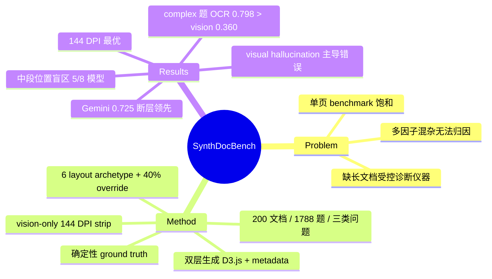

## Summary

提出全合成的长文档视觉理解 benchmark SynthDocBench（200 份 24–91 页合成报告、1,788 题），用组合式设计独立控制文档长度、页深、layout、模态组成与问题难度，从而把 VLM 在长文档上的失败归因到具体因子；对 8 个 frontier VLM 的评测揭示了长度衰减、中段位置盲区（lost-in-the-middle 的视觉版）和长文档下 chart 理解崩溃三种失败模式。

## Problem & Motivation

- 现有单页 benchmark（DocVQA 95%+、ChartQA 89%+）已近饱和，而真实文档同时混杂长度、layout 复杂度、模态组成、问题难度多个因子，模型失败**无法归因**到具体原因。
- MMLongBench-Doc 等长文档 benchmark 重覆盖广度、轻控制诊断，且不构造「跨远距页面的 chart + 文本联合推理」题。
- NLP/vision 里 CLEVR、bAbI、SCAN 证明了合成数据能隔离 reasoning primitive，但长文档视觉理解缺乏对应的「受控仪器」——本文补这个空位。

## Method

**双层生成设计**是核心：每个 chart 同时生成 (1) D3.js 渲染的可见层（嵌入 HTML/PDF）和 (2) 机器可读的结构化 metadata 层（chart 语义、坐标轴、数据点）。参考答案**从 metadata 确定性推导**（"Reference answers are derived deterministically from the same structured artifacts used to generate the documents"），不依赖人工标注或 LLM 判断，answer 正确性 by construction。

生成 pipeline（4 步）：
1. **Topic-grounded content generation**：从 geopolitics / economics / environmental science / technology 等 topic seed 构造语义骨架；
2. **Visual grammar**：6 种 layout archetype 控制页面布局与 chart 摆放，**40% 随机 override** 打破 topic-layout 的 spurious correlation；
3. **Visualization synthesis**：24 种 chart 类型（含 dumbbell、lollipop、sparkline 等冷门形态）；
4. **Validation & assembly**：数值重算校正，metadata 聚合为 manifest。

**数据规模**：200 份文档，均值 51.1 页 / 20,568 词 / 16.7 个 chart，页数范围 24–91。三类问题各约 600 题：Chart Reading（597，单元素读取）、Complex Multi-hop（597，2–4 个 evidence unit 组合，难度 L1–L5）、Cross-Modal（594，非相邻 section 的文本 + chart 联合推理），细分 9 个子类。

**评测协议**：vision-only——模型只拿 144 DPI 渲染的页面图（5 页拼一条竖向 strip，7,900 px / 4 MB 上限），不给 HTML 源码或 metadata；temperature 0。打分用 GPT-5 judge（0–10 分 rubric），ACC = judge 分 ≥6 的比例；换 Gemini-3.1-Pro judge 复核，两 judge ACC 差 ≤3.5 pp（r≥0.94）。

## Key Results

评测 8 个模型（正文 Table 2；abstract 却写 "seven frontier VLMs"，前后不一致）：

| Model | Overall ACC | Chart | Complex | Cross-Modal |
|---|---|---|---|---|
| Gemini-3.1-Pro | 0.725 | 0.759 | 0.789 | 0.628 |
| Qwen3.5-VL-122B | 0.655 | 0.713 | 0.690 | 0.561 |
| Qwen3-VL-235B | 0.586 | 0.642 | 0.611 | 0.503 |
| GPT-5.4 | 0.423 | 0.425 | 0.457 | 0.387 |
| GPT-4o | 0.386 | 0.457 | 0.360 | 0.342 |
| InternVL3-78B | 0.383 | 0.456 | 0.397 | 0.296 |
| Claude-Sonnet-4.5 | 0.314 | 0.353 | 0.337 | 0.250 |
| Qwen2.5-VL-7B | 0.081 | 0.162 | 0.012 | 0.067 |

三个失败模式：
1. **难度衰减**：除 Gemini 外所有模型 L1→L5 单调下降（Claude −23 pp：0.382→0.154；Qwen3.5-VL −17.9 pp）；Gemini 全程持平（0.670–0.784）。
2. **位置敏感**：按 chart 相对位置分三段，"middle third is hardest for 5 of 8 models, dropping 5–18 pp below Early"——lost-in-the-middle 在视觉长文档上复现；Claude 呈最陡的 Early→Late 单调下滑（−11.7 pp），Gemini 是 U 形（Δ 仅 −0.004）。
3. **长文档 chart 理解崩溃**：错误以 visual hallucination 为主——模型返回图里根本不存在的"貌似合理"数值，集中在 dense value-reading chart、dumbbell、多系列比较图。

Ablation（Gemini）：
- **Pages-per-strip**：1 页 0.369 → 5 页 0.725 → 10 页 0.792，Cross-Modal 受益最大（0.339→0.707）——多页上下文是必需的；但 GPT-4o 在 2 页处峰值、Claude 在 5 页峰值，最优 context density 因模型而异。
- **分辨率**：144 DPI（0.725）优于 72 DPI（0.686）和 216 DPI（0.683）——更高分辨率反而因 4 MB API cap 下的 JPEG 压缩劣化。
- **OCR text-only baseline（GPT-4o + PyMuPDF）**：chart-reading 0.297 vs vision 0.457（chart 题确实需要像素级解码）；但 complex multi-hop **OCR 0.798 vs vision 0.360**——复杂推理题大部分可从文本恢复，且 text-only 远好于看图。
- **外部效度**：与 MMLongBench-Doc 排名 Spearman ρ=0.657，中等相关。
- 109 道全模型 ≤3 分的题里 cross-modal 失败占主导，瓶颈是「精确的量化视觉-文本对齐」。

## Strengths & Weaknesses

**Strengths**：
- 双层生成使 ground truth deterministic by construction，规避了长文档 benchmark 最贵的人工标注瓶颈，也天然免标注噪声；40% layout override 防 shortcut 的设计是认真的。
- 位置分桶、难度分级、strip 大小 / DPI ablation 做得系统，「中段最难」「144 DPI 最优、216 DPI 反降」这类可操作结论对工程有直接价值。
- OCR baseline 的对照非常诚实：暴露了自家 benchmark 的 complex multi-hop 子集大部分是 text-recoverable 的，真正 vision-hard 的只有 chart 子集。

**Weaknesses**：
- **渲染分布混淆**（作者自认）：全部 chart 用 D3.js/HTML 渲染，与 Gemini 训练分布的风格一致性无法排除——Gemini 0.725 vs GPT-5.4 0.423 这种反常排名（GPT-5.4 在其他 benchmark 上通常不弱于 Gemini 30 pp）很可能部分是 rendering familiarity 而非能力差距；未做替代渲染后端验证，模型排名的外推可信度存疑。
- Complex multi-hop 题 OCR 0.798 >> vision 0.360，说明该子集测的更多是「长图像序列中的文本检索」而非视觉推理；benchmark 名义上三个子集，真正非平凡的只有 cross-modal 一类。
- 全合成文档分布 unimodal、tightly concentrated，与真实文档 heavy-tail 分布差异大；ρ=0.657 的外部相关只是中等。
- 细节粗糙：abstract 写 "seven frontier VLMs" 但表格 8 个模型、abstract 说 "five of six models" 而正文说 "5 of 8"，camera-ready 前后不一致。
- LLM-as-judge（GPT-5）打分引入被评模型家族与 judge 家族的潜在亲和偏差，虽有双 judge 复核但未做人工校准。

**影响**：为长文档 VLM 评测提供了第一个 CLEVR 式受控仪器，diagnostic 价值大于 leaderboard 价值；模型绝对排名不宜直接引用。

## Mind Map

## Notes

- 「complex multi-hop 子集 text-recoverable」这一点值得记住：以后看长文档 VLM benchmark，先问 OCR baseline 多少分，否则测的可能是检索不是视觉。
- rendering-familiarity confound 是所有合成视觉 benchmark 的通病，可与 GUI agent 的合成 screenshot 训练数据问题类比。
