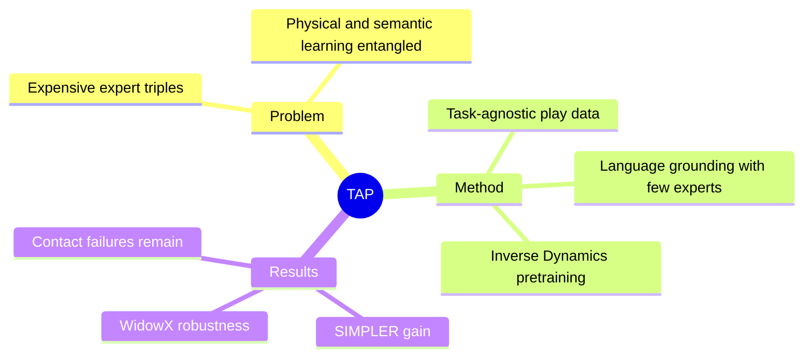

## Summary
TAP 把 VLA 学习拆为先从无语言的 off-task trajectory / autonomous random play 中学习“how to move”，再用少量 expert demonstrations 对齐“what to do”，以 self-supervised Inverse Dynamics 降低 task-labeled robot data 需求。

## Problem & Motivation
主流 VLA 把 observation、instruction、action 三元组都当成 expert data，导致物理运动能力与语义任务对齐被同一昂贵监督绑定。作者的 Decomposition Hypothesis 是：grasping dynamics、collision response、end-effector control 等 physical competence 可从与目标任务无关、甚至原本会被丢弃的 trajectory 中学到，只有选择目标和执行意图需要语言与 expert label。若假设成立，Open X-Embodiment 里 task-irrelevant trajectory 与机器人自主 play 就不再是废数据，而是可规模化的 motor prior 来源。

## Method
TAP 是两阶段框架。Stage 1 把 future observation 当作 implicit visual goal，给模型连续两帧并要求用 Inverse Dynamics 预测造成状态转移的 delta-pose action；该 visual-only MSE objective 迫使 encoder 关注 end-effector 与物体发生了什么变化，而非背景纹理。训练数据既可以是 BridgeData 等已有数据中与 downstream task 无关的 trajectory，也可以来自 autonomous random play。

真实机器人 play pipeline 先由操作者无任务 teleoperate 覆盖安全 workspace，经过 filtering 与 Voxel Grid Downsampling 构造 safe pose library；再随机采样 waypoint、限制高位悬空、注入 boundary-aware noise，并用下降 heuristic 增加 contact-rich interaction。Stage 2 用少量语言标注 expert data 做 Behavior Cloning，把已学的 affordance / dynamics prior 压缩到指定任务。实例使用 Qwen2.5-VL 3B 与 SigLIP，action space 为相对 end-effector position、axis-angle orientation 和 gripper command。

## Key Results
SIMPLER 中 Stage 1 使用 20k task-agnostic episodes、Stage 2 使用 5k expert trajectories；TAP-20k 的 Avg-All 为 33.32%，比相同架构的 Standard BC 23.15% 高约 10.2 个百分点，并接近或超过若干以 800k–1M expert trajectories 预训练的 reference。四个任务差异明显，例如 Spoon on cloth entire success 为 58.3%，但 Carrot on plate entire 为 0%，说明 motor prior 并非均匀转化为 semantic task success。

真实 WidowX 250 每任务只有 200 expert demonstrations，Stage 1 额外使用 30 小时 autonomous play。面对 viewpoint variation，TAP 在 carrot/pumpkin 两任务分别保留 15%/25% success，而 Standard BC 与 NORA 都为 0%；在 background texture shift 下 TAP 为 25%/65%，也高于两类 baseline。超过 600 次 physical trials 的平均结果中，TAP 在 pumpkin task 为 61%，高于 NORA 的 56%，但 carrot task 为 28%，低于 NORA 的 36%。错误分析把失败分为 execution/dynamics 与 semantic 两类，其中约 25% failure 属于接触、深度和毫米级 pre-grasp 对齐问题。

## Strengths & Weaknesses
**Strengths.** 核心拆分简单且可扩展，把廉价 play data 的价值定位为 physical representation，而不是假装它包含语言语义。与 Standard BC 使用相同 Stage 2 data 的对照较干净，真实机器人还同时测试 distractor、texture、viewpoint 和 initial-state shift。论文也报告负结果：某些任务整段 success 仍很低，attention visualization 不能代替行为证据。

**Weaknesses.** “how to move / what to do”并非严格正交；Inverse Dynamics 仍需要 action label，只是不需要语言或 task label，且 autonomous play 需要先由人建立安全 pose library、定期重置物体。30 小时 play 与 200 demonstrations 虽比百万级数据小，但并非零成本。实验主要集中在 WidowX、四个 SIMPLER tasks 和两个真实任务，尚不能证明 motor prior 跨 embodiment；极端 3D spatial reasoning 与 fine contact failure 仍存在。部分与百万 trajectory model 的数字来自原 benchmark 而非同一训练管线，也应谨慎解读“匹配 1M+ data”的表述。

## Mind Map

## Notes
该工作与 video-based latent action 的共同点是都尝试从“状态变化”学习 action-relevant representation，但 TAP 仍使用真实 action label。一个自然延伸是比较 Inverse Dynamics、latent action discovery 与 world-model prediction 在同一 unlabeled/off-task data budget 下各自保留了什么物理信息。
