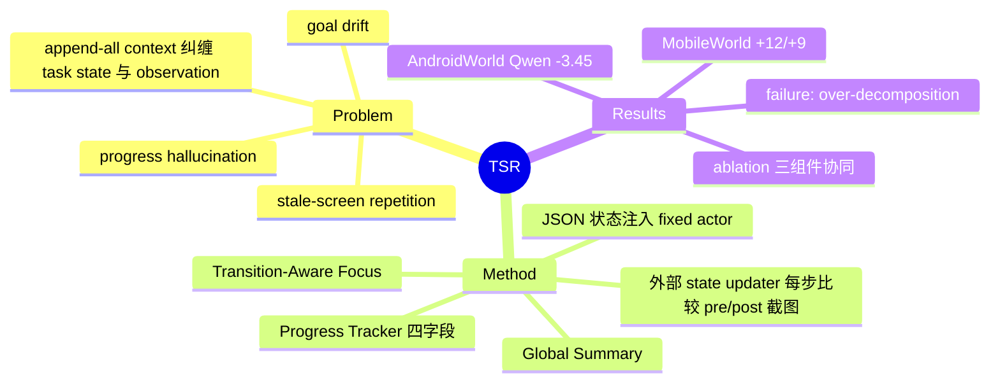

## Summary

提出 TSR（Task-State Representation）：一个 training-free 的外部 wrapper，用一个额外的 prompted LLM（state updater）在每步比较 pre/post-action 截图，维护结构化任务状态（global summary + progress tracker + transition-aware focus）并注入 fixed actor 的 prompt，在 MobileWorld 等长程 mobile GUI benchmark 上把 SR 最多提升 12 个绝对点。

## Problem & Motivation

主流长程 mobile GUI agent 用 thought-action-observation（ReAct 式）循环，把 task instruction、最近 m 张截图和全部历史 reasoning/action 拼进 prompt（append-all）。作者指出这一设计把两类本质不同的信息混在一起：**persistent task state**（用户要求、已完成子目标、剩余步骤）和 **transient observation**（当前屏幕内容），actor 每步都要从 raw history 重新推导任务进度，负担随轨迹线性增长。由此产生三种反复出现的 failure mode：(1) goal drift（忘掉原始任务）；(2) progress hallucination（早期截图被截断后编造过去状态）；(3) stale-screen repetition（把 UI 延迟更新误判为动作失败，陷入局部循环）。

## Method

核心是把任务状态从 actor 内部推理中剥离出来，由外部维护、每步更新、以文本块注入。三个 view 不是独立模块，而是**同一个 JSON state object 里的字段，每步联合更新**：

- **Global Task-State Summary**：保存原始 instruction 语义 + 累积进度，对抗 intent decay。
- **Progress Tracker**：把任务分解为 atomic requirements，维护四个字段：task decomposition / completed progress / current subgoal / remaining requirements，对抗 progress hallucination 和过早终止。
- **Transition-Aware Focus**：比较 o_{t-1} 与 o_t 评估上一动作是否生效（`action_effective: true|false|null`），若结果 uncertain 则生成 `next_action_focus`（如"先验证状态/刷新列表"）阻止盲目重试。

**更新机制（纯 prompt，无训练）**：S_0 仅由 instruction 导出；之后每步 state updater 𝒰_φ（一个 prompted LLM，与 actor 同一个底座模型，单次 function call，max 1024 output tokens）接收 (I, S_{t-1}, r_{t-1}, o_{t-1}, o_t)——即指令、上一状态、actor 上一步的 reasoning+action 原文、动作前后两张截图——输出更新后的完整 JSON。updater prompt 明确要求"把 previous state 当作 persistent working memory"、"只依据可见 UI 判断，不发明隐藏信息"。

**Actor 侧注入（关键细节）**：actor 输入是 a_t = π_θ(I, O_t, H_{t-1}, ℐ(S_t))——TSR 是**附加**在标准 context 之上，而非替代：仍保留最近 m=3 张截图窗口 O_t 和**全部**历史 reasoning/action 文本 H_{t-1}。π_θ 全程 fixed。

## Key Results

Backbone：Qwen3.5-plus 与 Kimi-k2.5（actor 和 updater 同模型，Bailian API，temperature 0）。四个 online benchmark：

| Benchmark | Qwen3.5-plus ΔSR | Kimi-k2.5 ΔSR |
|:--|:--|:--|
| MobileWorld (100 任务, 最长轨迹/跨 app) | 43.00→55.00 (+12.00) | 49.00→58.00 (+9.00) |
| AndroidWorld | 61.21→57.76 (**-3.45**) | 51.72→55.17 (+3.45) |
| MemGUI-Bench | +2.35 | +0.78 |
| MemGUI-Memory 子集 | +5.22 | +3.48 |
| VenusBench-Mobile (118 任务) | +5.09 | +4.24 |

- **Ablation（Qwen3.5-plus）**：MobileWorld 上 full TSR (55) 比任一单项移除 (48–50) 高 5–7 点，三组件有协同性；移除 transition focus 掉得最多 (55→48)。但 AndroidWorld 上模式反转：移除 transition 反而超过 baseline (63.79 vs 61.21)，full TSR 反而伤害——短程单 app 任务上 transition verification 引入决策噪声。
- **Case study**：Fig 2 展示 stale-screen 恢复（baseline 对延迟 UI 反复执行删除；TSR 检测到 uncertain transition，引导 actor 先验证再重试）。Fig 3 展示失败模式：**over-decomposition**——updater 把任务分解过细，actor 逐项检查而不用全局视觉推断，超出 step budget。
- **Limitations（作者自述）**：updater 错标 completed subgoal 会污染后续所有决策（error propagation）；每步多一次 LLM call 的延迟/成本；仅在 Android benchmark 验证；三 view 每步联合更新，简单任务上是噪声源。

## Strengths & Weaknesses

**亮点**：(1) problem formulation 干净——把 "persistent task state vs transient observation" 的纠缠指为结构性缺陷而非模型能力问题，三种 failure mode（goal drift / progress hallucination / stale-screen repetition）的分类有诊断价值；(2) 完全 training-free、模型无关的 wrapper，两个 backbone 上方向一致；(3) 诚实报告了负结果（AndroidWorld 上 Qwen 退化）并给出条件性结论："TSR 是 conditionally beneficial，任务越长、状态跟踪需求越强越有用"。

**局限**：(1) **TSR 是加法不是减法**——full history H_{t-1} 和 last-3 截图全保留，论文没有测试 TSR 能否*替代*历史（没有 "只给 TSR + 当前截图" 的条件），所以它证明的是"外部状态表示有帮助"，而非"状态表示是充分的"；(2) 没有 context-reset / 中途恢复类实验，也没有 updater 状态质量的直接评测（只有端到端 SR）；(3) transition verifier 只输出 effective/uncertain，不区分异常原因（动作失败 vs UI 延迟 vs 环境干扰），恢复策略也只是软引导（next_action_focus 文本提示），actor 可忽略；(4) baseline 单一（标准 MobileWorld actor），没有与 HiAgent 等 trajectory compression 方法直接对比。

**对我们 idea 的意义**：这篇论文与 "amnesia/resumability 测试" 高度互补——它构造了结构化状态笔记但从未检验其充分性（sufficiency），恰好留下了我们想测的空白；其 JSON schema（decomposition/completed/current/remaining + transition）可直接作为被测状态表示的候选格式。

## Mind Map

## Notes

- 与 [[Papers/2607-LongHorizonTerminalBench]] 等长程 agent 工作的共同主题：显式状态 vs 隐式历史。
- 待验证问题（我们的 idea 切入点）：把 H_{t-1} 和 O_t 砍掉、只留 ℐ(S_t)+o_t，SR 掉多少？这是论文未做的 sufficiency 测试。
