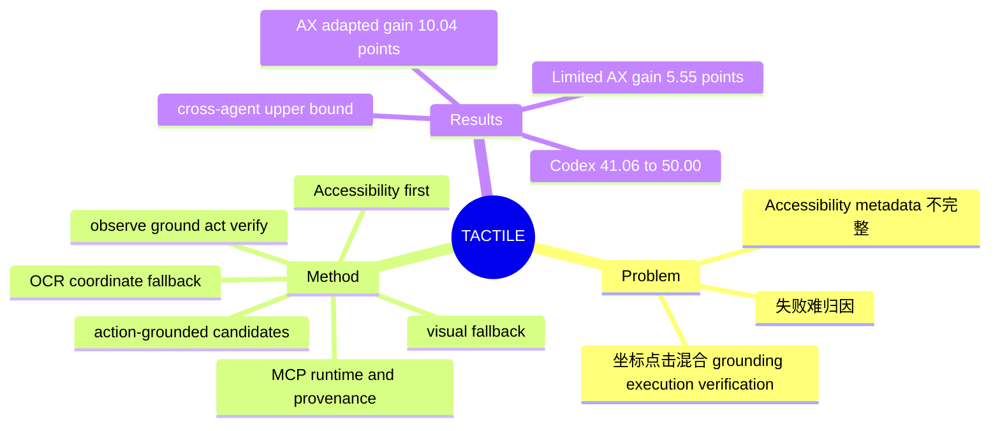

## Summary

TACTILE 不改 agent policy，而是在模型与桌面之间加入一个 MCP-compatible execution substrate，把 Accessibility、OCR 与视觉区域统一成带 affordance、坐标、provenance 和 verification cue 的 action-grounded candidates。macOSWorld-style 评测中 Codex 的 Success@100 从 41.06% 升至 50.00%，但增益主要来自 AX-adapted tasks，跨 agent 结果还是按任务择优的 skill-optional upper bound，尚不能证明 learned routing 或跨平台泛化。

## Problem & Motivation

Screenshot-first computer-use 把四件性质不同的事压进一次坐标点击：识别目标、判断控件是否可操作、执行动作、确认状态是否真的改变。只看到像素时，失败可能来自 stale observation、坐标系转换、焦点错误、控件未响应或弱 verification，trace 很难归因；只依赖 Accessibility tree 又会被缺失、陈旧或噪声 metadata 卡住。论文因此把瓶颈从“模型是否更聪明”重述为“模型是否拥有一个公开、可执行、可验证的 software interface”，目标不是用 AX 替代视觉，而是为不同证据源建立明确的优先级和 fallback contract。

## Method

TACTILE 把桌面 observation 编译成紧凑的 action-grounded state。每个 candidate 包含稳定短 ID、来源标签、role/text/state、screen geometry、可执行 action、verification cue 与 provenance；完整 UI state 不塞进模型上下文，而是保留在 runtime 侧供 replay、debugging 和 failure attribution。

执行采用 **observe-ground-act-verify** loop，并按证据强度形成三层 operating ladder：

1. **Native semantic action**：优先读取 OS Accessibility semantics，以 stable target identity、enabled state 和原生 action 执行；这是契约最强的一层。
2. **OCR-grounded coordinate**：当可见文字比 AX metadata 更可靠时，以 OCR text、frame 与统一的 screen-coordinate contract 定位并点击或输入。
3. **Visual fallback**：canvas、timeline、drag-heavy 或 remote UI 无可用结构时退回 screenshot/model-native visual control，同时记录为何 structured evidence 不足。

macOS runtime 负责 Accessibility traversal/action、ScreenCapture、Vision OCR 与输入注入，对上暴露统一 MCP tools。执行后系统保留 observation、target、action plan、action result、verification level 和 failure category，使不同 agent client 能在相同 substrate 上比较，而不是各自维护不可审计的坐标脚本。

## Key Results

- 在当前 scored macOSWorld-style sample 上，Codex 的 overall Success@100 从 **41.06% 提升到 50.00%**（+8.94 个百分点）；AX-adapted split 从 **45.22% 到 55.26%**（+10.04），Limited-AX split 仅从 **27.78% 到 33.33%**（+5.55）。这项负结果很关键：OCR/visual fallback 虽有帮助，但并未抹平 semantic accessibility 的质量差距。
- 在 96-task horizontal subset 上，skill-optional 条件下 Codex **38.54%→50.00%**、Claude Code **33.33%→43.75%**、OpenCode **33.33%→40.62%**、Goose **41.67%→43.75%**；Goose 在 Limited-AX tasks 上没有改善。
- 上述 cross-agent “With Tactile”不是固定 policy 的端到端结果，而是对 no-skill、tactile-implicit、tactile-explicit 三种设置逐任务取最好结果。它估计“让 TACTILE 可用”的上限价值，不能当作 agent 已经学会何时调用 TACTILE 的证据。
- Trace case 显示真实应用可暴露数百个节点（Zoom 状态中最高记录到 468 个 elements），candidate filtering 能压缩上下文，但也可能漏掉后续相关的低排名控件。

## Strengths & Weaknesses

**Strengths**

- 把 GUI reliability 从又一个 grounding model 问题推进成 **execution interface design**：semantic target、coordinate contract、verification 和 provenance 被放进同一对象，因而可以逐步定位失败来源。
- Accessibility-first 但不是 AX-only，避免“纯 DOM/UIA”与“纯 screenshot”二选一；方法简单、agent-agnostic，并通过 MCP 接口和开源实现具备复用价值。
- 按 AX quality 分层报告结果很诚实。Limited-AX 增益更小、Goose 某 split 无增益，直接揭示 runtime 的收益依赖 application semantics，而不是普适加成。

**Weaknesses / 证据边界**

- 当前实现和评测最强于 **macOS**；不同 OS、framework、webview、permission model 的 Accessibility API 差异很大，尚无 Windows/Linux 跨平台结果。
- Accessibility metadata 会缺失、错误、陈旧或过大；candidate compaction 可能删掉真正相关节点。OCR 对低对比文字、icon-only control、动画、重叠窗口和非支持语言仍脆弱，visual fallback 又重新引入坐标歧义。
- Verification 仍是未解决核心：若应用在 action 后不给可靠 semantic/textual/visual feedback，TACTILE 只能记录低置信度，不能判断成功、失败还是 pending。
- 主评测是 preliminary macOSWorld-style samples；cross-agent 数字含逐任务 oracle selection，缺少 learned invocation policy、置信区间和更强 visual-only baseline，不能据此宣称普遍提高所有 desktop agents。

## Mind Map

## Notes

- 这篇工作的研究价值不只是“AX tree 比截图好用”，而是把 environment interface 变成可审计的 typed evidence contract。后续更有意义的问题是学习 **evidence routing policy**：何时相信 AX、何时触发 OCR/vision、何时因 verification 不足而停止或请求用户确认。
- Runtime benchmark 应把 success 之外的 failure attribution fidelity、fallback rate、verification calibration、token/context cost 一并作为指标，否则 substrate 的真正作用会被最终任务成功率掩盖。
