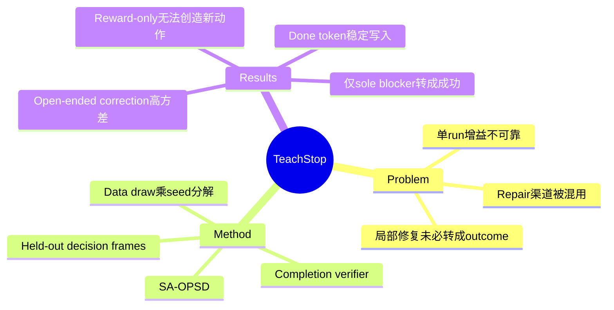

## Summary
论文以 35B computer-use policy 的 verifier-guided repair 为实验台，证明 agentic CUA-RL 的单次训练数字会被 data draw 与 run-to-run nondeterminism 主导。修复能否写入权重取决于 corrective action 的约束程度，而 frame-level 修复只有在该动作是任务唯一 blocker 时才转化为真实 task success。

## Problem & Motivation
GUI Agent 失败后，可以在 prompt 中追加说明、注入 verifier hint、做 SFT、做 reward-based update，或在 inference harness 中直接 gate / override；这些渠道常被混为“agent 得到修复”。更严重的是，许多 Agentic RL 结果只报告一次 training run，无法区分算法增益与 data draw、seed、runtime nondeterminism。论文询问三个更窄但可证伪的问题：什么类型的 corrective action 能被稳定安装进 policy；哪个 loss term 真正起作用；局部 action emission 是否会转化为 DB-oracle 认可的 end-to-end success。

## Method
实验 policy 是 Holo3-35B-A3B，运行在 LinkedIn、Indeed、Fiverr、Mercor、Shopify 五个 snapshot-resettable web mirrors。每个环境有 fixed seed、frozen clock、database oracle 与 mutation log；policy 只看当前 screenshot 和 windowed textual history。一个独立 Claude Sonnet 4.6 completion verifier 同时扮演四种角色：in-context hint、distillation teacher、reward source 和 deployment gate。

核心更新 **SA-OPSD（Segment-Aggregated On-Policy Self-Distillation）** 把 verifier 对同一 failure segment 的评价聚合成 group-relative advantage；loss 由 clipped GRPO 与 advantage-gated behavior cloning 组成。前者降低坏 action 概率，后者把当前 policy 从不采样的 teacher correction 写入 support。Headline 指标只在独立 held-out trajectories 的 decision frames 上测 corrective-action emission，报告五个 training seeds 的 mean、standard deviation 与 bootstrap CI；另用 3 个独立 data draws × 8 seeds 做 crossed variance decomposition，并以 DB oracle 评估 end-to-end transfer。

## Key Results
- Corrective action 呈清晰 difficulty gradient：固定 `done()` token 的 held-out emission 为 0.97±0.06；field-targeting click 为 0.71±0.26；spatial grounding 为 0.53±0.35；需要定位并生成内容的 form progression 仅 0.14±0.04。
- `done()` term ablation 中，GRPO reward-only 为 0.00±0.00，distillation-only 为 1.00±0.00，full SA-OPSD 为 0.97±0.06。Base policy 从不采样 `done()` 时，reward 无法强化一个不存在的动作；teacher signal 才是有效成分。
- Frame-level repair 只在 corrective action 是 sole remaining blocker 时转成 task success：LinkedIn repaired policy 8/20，base 0/15，Fisher p=0.006；Fiverr 与 Shopify 均无 end-to-end 提升，因为目标 failure 在测试 rollout 中不是 blocker，或只是多个必要步骤之一。
- Variance decomposition 显示 evaluation noise 近 0、传统 training-seed label 的贡献各 cell 均不超过 10%，方差主要来自 data draw 与 run-to-run nondeterminism；最难 cell 中 data draw 占 48%，单一 cell 的 run distribution 呈 bimodal（Hartigan dip p=0.07，k=10）。
- 在论文测得的高方差 regime 中，领域常见的 +7.7 percentage points 单次增益有 33%–44% 概率报告错误方向；即使真实增益为 +0.2，也有 25%–34% 概率翻转。多 seed 还推翻了作者早期的 monotonic sample-efficiency curve 和“grounding cannot be bought”硬边界。

## Strengths & Weaknesses
**已知—亮点。** 论文把 replication 当作主要贡献，而非附录检查；paired held-out evaluation、data-draw × seed decomposition、DB-level oracle 与 term attribution 让“哪里有效”比单纯报平均 success 更可信。作者公开撤回两个未能复现的强 claim，这类阴性证据对当前 GUI RL 尤其重要。`reward-only=0 / distillation-only=1` 还给出一个简洁判据：若 corrective action 不在 policy support 中，应先注入行为，而不是期待 sparse reward 自行发现。

**已知—边界。** Frame-level metric 由同一个 verifier 选择 decision frame、提供 teacher action，并判断 emission 是否匹配，存在 circularity；真正打破循环的只有 DB-oracle end-to-end 结果，而其中仅 LinkedIn 显著提升。五个环境都是确定性的 web mirrors，base 在七个可测 app families 中六个为 0/6，结论不一定适用于已有较强成功率的 policy。35B backend 与 oracle environments 不开源，公开的是 repair / reliability apparatus；外部复现仍受限。

**推测。** 论文说明“RL 是否有效”之前应先诊断 correction 的 entropy 与 support：固定 token、已有 coordinate mode、开放式生成是三个不同 regime。GUI RL 的方法选择可能应从 failure taxonomy 出发，而不是默认按 benchmark 统一训练。

**不知道。** 尚不清楚同样的方差结构是否存在于 AndroidWorld、OSWorld 或非确定性 live web，也不知道更强 independent verifier、更多 rollout data 或 milestone state reward 能否显著收窄 coordinate / generative repair 的 seed variance。

## Mind Map

## Notes
- 应与 [[Papers/2607-GRPONullWebAgent]] 并列：前者用 sampling headroom 解释 GRPO null，本文用 action support 和 variance budget 解释 repair 成败。
- 与 [[Papers/2607-EvoCUA15]] 的 PRM-hacking 负结果互补；两者都要求把训练改进锚定到 executable outcome，而不是只看 process score 或单次曲线。
- Survey 中可把 multi-seed、multi-data-draw、held-out trajectory 和 DB/state oracle 写成 GUI RL 的最低证据协议。
