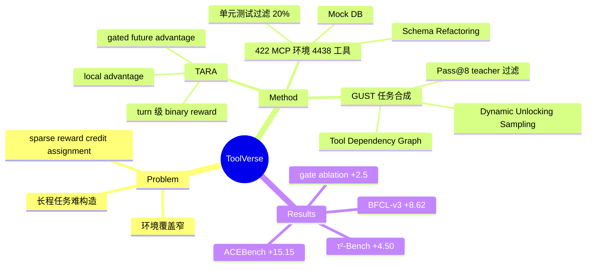

## Summary

ToolVerse（Meituan LongCat）从 Toucan 数据集的 system prompt 中抽取约 400 个真实 MCP / 4438 个工具的 schema，自动改写为带 mock database 的可执行训练环境，再用 Tool Dependency Graph + Dynamic Unlocking Sampling 合成长程 tool-use 任务（GUST 数据集，2,987 条），配合 turn 级 TARA advantage 做 GRPO 训练；Qwen3-8B 在 BFCL-v3 multi-turn +8.62、τ²-Bench +4.50、ACEBench-Agent +15.15。

## Problem & Motivation

Agentic RL 训练 tool-use LLM 面临三个瓶颈：(1) 现有工作环境覆盖窄——多数只围绕 search / code interpreter 等单一或少量工具，缺乏真实世界的工具多样性；(2) 跨工具的多轮长程任务难以自动构造；(3) 长轨迹下 sparse terminal reward 的 credit assignment 粒度不够。ToolVerse 想同时在环境规模、任务时长、训练信号粒度三个维度上做 scaling。

## Method

### 1. 从真实 MCP 批量构建可执行环境

从 Toucan 数据集 multi-turn 子集的 system prompt 中抽取真实 MCP 工具规范，经四步流水线转为可执行环境：**Schema Refactoring**（归一化函数签名、去噪）→ **Mock Database Construction**（用 Python dict 建模 inventory / user records 等状态变量）→ **Executable Function Generation**（生成读写 mock DB 的 MCP 兼容 Python 函数）→ **Validation**（语法检查 + 单元测试）。约 20% 的 toolset 因依赖外部服务或复杂实时状态被过滤，最终得到 422 个环境、约 4,438 个工具，每环境保留 5-20 个工具（平均 12.2）。

### 2. Tool Dependency Graph + Dynamic Unlocking Sampling（GUST 数据集）

- **TDG 构建**：LLM 推断环境内工具间的有向依赖边，含参数依赖（输出→输入）与语义依赖（逻辑先后）。
- **DUS 采样**：维护零入度工具的 ready queue，每步采样 k = min(|queue|, N) 个执行，执行后对后继节点减入度、解锁入队——按拓扑序生成 golden tool-call trace，任务复杂度自然递增。
- **Inverse Context Reconstruction**：用运行时参数（前序输出 + mock DB）实例化 trace，再 prompt LLM 把 Golden Trace 反向改写成自然语言用户任务；用 LangGraph 在有状态 mock 环境中执行验证，最后用 Qwen3-32B teacher agent 做 Pass@8 过滤。
- **GUST 统计**：2,987 个 data item，平均每 item 3.8 个多轮对话任务，每任务 3-7 次工具调用。

### 3. Turn-Aware Relative Advantage（TARA）

把 trajectory 级 reward 分解为 turn 级：
- **Binary turn reward**：r_{i,t} = 1 当且仅当该 turn 的 golden tool JSON objects 被 dictionary-level matching 覆盖，无 LLM judge；
- **Local advantage**：turn reward 在 group 内做 z-score 归一化；
- **Gated future advantage**：折扣未来 reward 之和（γ=0.5），乘 consistency gate δ_{i,t} = r_{i,t}——当前 turn 错则未来 credit 清零；
- **合成**：A_total = A_local + λ·A_future（λ=0.5），套在 GRPO 上训练。

**训练设置**：Qwen3-8B/4B (Thinking)、Qwen2.5-14B-Instruct，GRPO，32 张 A100，lr 1e-6，DeepSeek-V3.2 做交互评测的 user simulator。

## Key Results

- **主结果（外部 benchmark，非自建环境）**：Qwen3-8B base → +ToolVerse(TARA)：BFCL-v3 multi-turn 28.88% → 37.50%（+8.62），τ²-Bench 27.87% → 32.37%（+4.50），ACEBench-Agent 46.51% → 61.66%（+15.15）。Qwen2.5-14B：BFCL 17.88% → 24.12%，τ² 24.38% → 32.40%，ACEBench 47.78% → 61.66%。数据与算法贡献可分离：同数据下 GRPO vs TARA 在 Qwen3-8B BFCL 上为 35.25% vs 37.50%。
- **对公开 baseline（Qwen2.5-7B）**：baseline 12.88%(BFCL)/16.00%(τ²)，ToolRL 15.25%/16.37%，AgentFlow 11.25%/17.03%，SimpleTIR 11.75%/13.53%，TARA 20.00%/29.87%。
- **Ablation**：仅 turn-local advantage 33.75%(BFCL)，加 future 但去掉 consistency gate 35.00%，完整 TARA 37.50%；λ、γ 最优均为 0.5，过大过小（<0.1 或 >0.9）都退化。
- **环境规模 scaling**：100 环境 → 422 环境，BFCL 35.00% → 37.50%，τ² 27.33% → 32.37%，支持环境多样性有效的 claim。
- 作者承认因 SALT / FTRL 工件不可得，无法做 head-to-head 对比。

## Strengths & Weaknesses

**Strengths**
- 环境构建路线务实：不追求 live API 的真实性，而是"schema 真实 + 状态 mock"，用单元测试过滤保证可执行性，20% 过滤率诚实披露。这条路线与 [[2605-EnvFactory]] 的 EnvGen 高度同构，但把规模从 85 环境推到 422 环境，且工具 schema 来自真实 MCP（Toucan）而非检索文档重建。
- DUS 的拓扑解锁采样保证 golden trace 中每个工具的依赖都已满足，是比随机游走更干净的任务合成方式（同样与 EnvFactory 的 topology-aware sampling 思路相近）。
- TARA 是全文最有辨识度的贡献：turn 级 binary reward + consistency gate 的 gated future advantage，ablation 完整（gate 单独贡献 +2.5 BFCL），λ/γ 敏感性也扫了。
- 评测全部在外部 benchmark（BFCL-v3 / τ²-Bench / ACEBench-Agent）而非自建环境上做，泛化证据比"自建环境自测"可信。

**Weaknesses**
- **Reward 建立在唯一 golden trace 上**：turn 级 dictionary matching 要求覆盖 golden tool JSON，等价于把 process supervision 锚死在合成的单一参考轨迹上；多解任务中合法的替代工具序列会被判 0 分。作者自己承认该方法"依赖 turn-level reward 信号，在 highly sparse or ambiguous reward settings 下会挣扎"。
- **任务难度天花板**：Pass@8（Qwen3-32B teacher）过滤意味着保留的任务都是 32B 模型 8 次内能解的，难度上限被 teacher 封顶；"long-horizon" 实为每任务 3-7 次工具调用，与 computer-use 领域动辄百步的 horizon（如 [[2607-EvoCUA15]] 的 100 步 OSWorld）不在一个量级。
- **与 EnvFactory 零对比**：整条 pipeline（可执行环境合成 + 工具依赖图 + 拓扑采样 + BFCL/τ² 评测）与两个月前的 EnvFactory 高度重合，但全文未引用，novelty 边界不清晰（推测：撰写周期重叠，但这不改变读者需要自行判断增量的事实）。
- Mock DB 由 LLM 生成 Python dict，状态转移的真实性无验证机制（单元测试只保证可执行，不保证语义正确）——环境保真度是推测中的薄弱点。
- 环境 scaling 只报了 100 vs 422 两个点，不足以支撑"massive environments"带来持续增益的强 claim。

**影响**：与 EnvFactory 共同确认了"mock 可执行环境 + 依赖图任务合成"是 tool-use agentic RL 环境规模化的可行配方；TARA 的 turn 级 gated advantage 对多轮 agent RL 的 credit assignment 是一个可移植的组件（与同门 EvoCUA-1.5 的 STEPO 从不同角度处理同一问题：STEPO 修 step 分解后的长度偏差，TARA 做 turn 级信用分配）。

## Mind Map

## Notes

- 与 [[2605-EnvFactory]] 几乎同配方（可执行环境合成 + 依赖图采样），可作为该路线的第二个独立数据点；两者互不引用，值得在 survey 中并置对比。
- 与 [[2607-EvoCUA15]] 同为 Meituan LongCat 团队：一条线做 computer-use（真实 OS 环境 + step 级 RL），一条线做 tool-use（mock MCP 环境 + turn 级 RL），credit assignment 方案（STEPO vs TARA）可对照。
