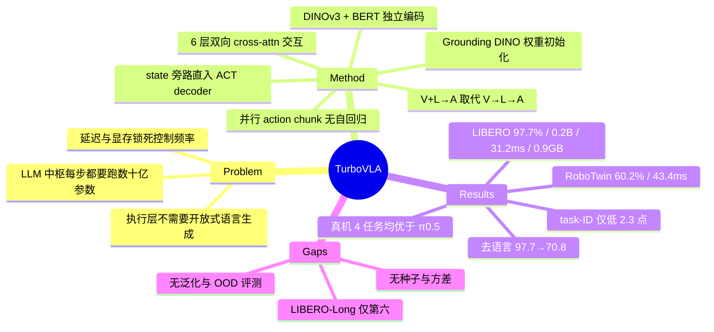

## Summary

把 VLA 的 V→L→A 通路改成 V+L→A：视觉与指令分别用 DINOv3 和 BERT 独立编码，经 6 层双向 cross-attention 直接交互，再由 ACT 式 decoder 一次前向输出连续 action chunk，执行层完全不经过 LLM。0.2B 参数在 LIBERO 上取得 97.7% 平均成功率，RTX 4090 上 31.2 ms / 0.9 GB。

## Problem & Motivation

主流 VLA 把 LLM 放在感知与动作之间做中枢：视觉特征投影进语言模型 token 空间，与指令 token 拼接后由 LLM 处理，再解码成动作。即使用 action expert 绕开了 autoregressive 逐 token 解码（π0、π0.5、OpenVLA-OFT），每一次 policy 调用仍要跑一遍数十亿参数的语言主干，延迟与显存都被这一步锁死。

作者的核心观察是：**指令已经指定了要做什么，执行层就不需要开放式语言生成或任务分解**，它只需要用指令决定"当前视觉证据该如何引导动作"。这项功能被通用 LLM 表征承担是能力过剩。于是问题变成——能不能让 vision 和 language 直接交互，构造一个专为连续动作预测服务的表征，把 LLM 整个移出执行通路。

这个动机在部署侧同样成立：LLM-centric VLA 常需远程服务器推理，依赖网络、延迟高、成本高。

## Method

**整体结构**（Fig. 3）：模态独立编码 → 双向 V-L 交互 → action chunk 解码。

**1. 模态编码**
- 视觉：DINOv3（LIBERO 用 ViT-B，RoboTwin 用 ViT-L），多相机各自加 positional embedding 与 view embedding 后拼接
- 语言：BERT，**保留完整 token 序列而非 pooled embedding**，让物体、属性、空间关系都能参与细粒度视觉条件化
- 机器人状态：单独的轻量投影网络编码，**不进 V-L 交互，直接送 action decoder**——交互模块只负责"任务条件化的场景理解"
- 三路特征统一投影到 d=256

**2. Vision-Language Interaction Module**——本文唯一的"新"组件，设计上刻意做到最简：N=6 层，每层为 LayerNorm + 双向 cross-attention + 各模态独立 FFN + 残差。视觉→指令方向把场景上下文注入指令流，指令→视觉方向用任务语义调制视觉特征，最后两条流拼接。这一模块的权重**从 Grounding DINO 的 grounding-pretrained feature-enhancement 权重初始化**——方法灵感与权重都来自 open-vocabulary detection，不是从零训练。

**3. Action Chunk Decoder**：ACT 式 transformer decoder，H 个可学习 action query 与 [V-L 特征; state 特征] 交互，**并行**解出 H 步连续动作，无 action tokenization、无自回归。

**训练**：纯 behavior cloning，ℓ1 loss，无任何辅助语言建模目标；lr 5e-5，4×RTX 4090。

## Key Results

**LIBERO（Table 1，50 rollouts/task，2000 trials，单个混合 suite 联合训练模型，VLA-Adapter rollout 协议）**

| | Params | VRAM | Latency | Spa. | Obj. | Goal | Long | Avg. |
|:--|--:|--:|--:|--:|--:|--:|--:|--:|
| π0.5 | 3.4B | 12.8 GB | 93.6 ms | 98.8 | 98.2 | 98.0 | 92.4 | 96.9 |
| CogVLA | 8.3B | 16.1 GB | 115.5 ms | 98.6 | 98.8 | 96.6 | 95.4 | 97.4 |
| VLA-JEPA | 2.8B | 5.3 GB | 108.7 ms | 96.2 | 99.6 | 97.2 | 95.8 | 97.2 |
| OpenVLA-OFT | 7.7B | 15.7 GB | 112.2 ms | 97.6 | 98.4 | 97.9 | 94.5 | 97.1 |
| VLA-Adapter | 1.5B | 4.3 GB | 87.3 ms | 97.8 | 99.2 | 97.2 | 95.0 | 97.3 |
| Evo-1 | 0.8B | 1.7 GB | 137.2 ms | 92.7 | 97.7 | 96.3 | 92.3 | 94.8 |
| **TurboVLA** | **0.2B** | **0.9 GB** | **31.2 ms** | 99.2 | 99.8 | 97.4 | 94.2 | **97.7** |

关键口径（Sec. 5.2）：论文声明所有**可运行（runnable）**方法的效率数字都是在**同一台 RTX 4090、batch size 1**上按官方架构/实现/checkpoint 测得（原文为被动语态，未显式写明由作者本人测量；Table 2 中 FlowPolicy 的 latency 为"–"，说明"runnable"限定是实际生效的）；latency 定义为"从多模态输入到产出一个 action chunk **或等量的自回归 action token**"，31.2 ms 对应每秒 >30 次 chunk 预测即 32 Hz；VRAM 为完整在线 policy 的峰值显存。统一实测口径避免了跨论文数字拼盘的常见问题，是本文比较有纪律的地方。

**RoboTwin 2.0（Table 2，50 个双臂任务，多任务单模型，仅 clean setting，100 rollouts/task）**：TurboVLA 0.4B / 43.4 ms / 60.2%，高于 π0.5（3.4B / 95.6 ms / 57.0%）与 StarVLA-α（3.8B / 74.9 ms / 50.3%）。注意此配置延迟是 43.4 ms（≈23 Hz），不是标题的 32 Hz；同表中 ACT 以 0.1B / 20.4 ms 更快，但成功率只有 29.7%。

**Real-world（AgileX Piper，4 任务，各 40 trials）**：从 LIBERO checkpoint 初始化，4×65 条遥操作演示微调 12.5k steps；grab roller 92.5%、move playing card 80%、press stapler 90%、stack bowls 87.5%。论文称在同平台同数据同协议下"consistently outperforming π0.5"，但 π0.5 的逐任务数值只以柱状图出现在 Fig. 4 且 y 轴从 70 起截断，无法读出具体值，因此差距大小不可核。

**Ablation（全部在 LIBERO 上）**
- **去语言**：97.7% → 70.8%，其中 LIBERO-Goal 97.4% → 11.6%（Goal suite 同场景多目标，视觉先验无法区分）
- **语义指令 → 可学习 task-ID embedding**：95.4%，仅比完整模型低 2.3 个百分点（论文原文写作 "2.3% below the full model"）
- **交互设计**：无交互（直接拼接）95.2 < 单向 language-queries-visual 96.1 < 单向 visual-queries-language 96.5 < 双向 97.7
- **文本编码器**：BERT 97.7 / T5-Small 97.1 / SigLIP-Base 95.5——架构不绑定特定文本主干
- **超参**：N=2/4/6/8 → 93.5/95.7/97.7/96.6；H=8/10/12/15 → 96.4/96.9/97.7/95.6

## Evidence Ledger

| Claim ID | Claim | Type | Source locator | Evidence excerpt | Status |
|:--|:--|:--|:--|:--|:--|
| C1 | LIBERO 平均 97.7%（Spa. 99.2 / Obj. 99.8 / Goal 97.4 / Long 94.2） | number | p.9 Table 1 | "TurboVLA (Ours) ✗ 0.2 0.9 31.2 99.2 99.8 97.4 94.2 97.7" | source-verified |
| C2 | 31.2 ms 延迟在单卡 RTX 4090、batch size 1 上实测，定义为从收到多模态观测到产出 action chunk | number / setting | p.1 Sec 1；p.8 Sec 5.2 | "31.2 ms of end-to-end policy latency, measured from receiving the current multimodal observation to producing an action chunk" | source-verified |
| C3 | 31.2 ms 对应每秒 >30 次 action chunk 预测（32 Hz） | number | p.3 Sec 1 | "corresponding to more than 30 action chunk predictions per second (32 Hz)" | source-verified |
| C4 | 0.9 GB inference VRAM，定义为完整在线 policy 的峰值显存 | number / setting | p.9 Table 1；p.8 Sec 5.2 | "inference VRAM denotes the peak GPU memory usage of the complete online policy" | source-verified |
| C5 | LIBERO 配置 0.2B（DINOv3 ViT-B）；RoboTwin 配置 0.4B（ViT-L） | number | p.9 Table 1/Table 2 captions | "For TurboVLA, the reported parameter count corresponds to the DINOv3 ViT-B configuration" | source-verified |
| C6 | 论文声明所有"runnable"对比方法的效率指标均按官方架构/实现/checkpoint 在同一 RTX 4090、batch size 1 上测得 | benchmark-setting | p.8 Sec 5.2 | "For all other runnable methods included in the comparison, these efficiency metrics are measured using official architectures, implementations, and checkpoints" | source-verified（原文为被动语态，"由作者本人测量"属上下文推断而非明写；Table 2 的 FlowPolicy latency 为"–"，"runnable"限定确实生效） |
| C7 | π0.5：96.9% / 3.4B / 12.8 GB / 93.6 ms；TurboVLA 约为其 6% 参数量 | comparison | p.9 Table 1；p.8 Sec 5.3 | "97.7% average success, compared with 96.9% for π0.5 ... using only about 6% of its parameters" | source-verified |
| C8 | LIBERO 用 OpenVLA no_noops RLDS 数据、单个混合 suite 联合训练模型、VLA-Adapter rollout 协议、50 rollouts/task、2000 trials、12 步 7-DoF chunk | benchmark-setting | p.7-8 Sec 5.2 | "we conduct 50 rollouts per task and report suite-level and average success rates over 2,000 trials" | source-verified |
| C9 | RoboTwin 2.0：60.2% / 43.4 ms，优于 π0.5 57.0% / 95.6 ms 与 StarVLA-α 50.3% / 74.9 ms | number / comparison | p.8 Sec 5.3；p.9 Table 2 | "60.2% average success across 50 bimanual tasks with 43.4 ms inference latency" | source-verified |
| C10 | RoboTwin 训练受算力预算限制只用官方 clean demonstrations，不含 randomized-scene 数据；全表方法均只在 clean setting 训练评测，100 rollouts/task | benchmark-setting | p.8 Sec 5.2；p.9 Table 2 caption | "Given our available compute budget, we restrict training to the official clean demonstrations" | source-verified |
| C11 | 真机实验从 LIBERO 预训练 checkpoint 初始化，4×65 条遥操作演示微调 12.5k steps，每任务 40 trials | benchmark-setting | p.8 Sec 5.2 | "fine-tune it on 4×65 teleoperated real-world demonstrations for 12.5k steps. Each task is evaluated over 40 trials" | source-verified |
| C12 | TurboVLA 真机四任务成功率为 92.5% / 80% / 90% / 87.5% | number | p.9-10 Sec 5.3 | "achieves 92.5%, 80%, 90%, and 87.5% success on four real-world AgileX Piper tasks" | source-verified |
| C12b | TurboVLA 在四项真机任务上均优于 π0.5，且优势幅度可量化 | comparison | p.10 Fig 4 | "consistently outperforming π0.5"（π0.5 逐任务数值仅以柱状图呈现） | not-checkable — Fig. 4 y 轴自 70 起截断且未标数值，π0.5 的逐任务成功率无法读出；只能确认论文的定性表述，差距大小不可核 |
| C13 | 去掉语言条件：平均 97.7% → 70.8%，LIBERO-Goal 97.4% → 11.6% | number | p.10 Sec 5.4；p.11 Table 3 | "removing language reduces the average success rate from 97.7% to 70.8%, with the largest drop on LIBERO-Goal (97.4% → 11.6%)" | source-verified |
| C14 | 语义指令换成可学习 task-ID embedding 得 95.4%，比完整模型低 2.3 个百分点 | number | p.10 Sec 5.4；p.11 Table 3 | "recovers part of the performance, but still remains 2.3% below the full model" | source-verified（论文写 "2.3%"，对应表中 97.7 − 95.4 = 2.3 个百分点） |
| C15 | 全文未做任何 unseen object / 改写指令 / 新任务组合 / OOD 场景的泛化评测，所有 ablation 均为 in-distribution | benchmark-setting (negative) | 全文 p.1-11 | 未检索到相关实验节 | source-verified |
| C16 | 交互设计消融：无交互 95.2 / language-queries-visual 96.1 / visual-queries-language 96.5 / 双向 97.7 | number | p.10 Sec 5.4；p.11 Table 5 | "direct concatenation achieves 95.2% ... improve it to 96.1% and 96.5%. Bidirectional interaction performs best at 97.7%" | source-verified |
| C17 | 论文未报告 latency/VRAM 测量所用的输入图像分辨率、数值精度（fp16/bf16/fp32）与推理引擎优化（TensorRT / torch.compile / 量化） | benchmark-setting (negative) | 全文 p.1-11 | 未在 Sec 5.1 Implementation Details 或 Sec 5.2 中出现 | source-verified |
| C18 | 文本编码器消融：BERT 97.7 / T5-Small 97.1 / SigLIP-Base 95.5 | number | p.11 Table 4 | "SigLIP-Base 216.9 ... 95.5 / T5-Small 141.9 ... 97.1 / BERT 216.1 ... 97.7" | source-verified |
| C19 | 深度 N=2/4/6/8 → 93.5/95.7/97.7/96.6；horizon H=8/10/12/15 → 96.4/96.9/97.7/95.6 | number | p.11 Table 6；p.10 Fig 6 | "increasing the number of interaction layers from N=2 to N=6 steadily improves ... from 93.5% to 97.7%" | source-verified |
| C20 | Table 1 中 TurboVLA 标记为不使用 LIBERO 之外的额外 embodied pretraining，而 π0.5 / OpenVLA / π0 / VLA-JEPA 标记为使用 | benchmark-setting | p.9 Table 1 | "\"Emb. PT.\" denotes additional embodied pretraining on robot data beyond LIBERO" | source-verified |
| C21 | 全文未给出任何 error bar、标准差、置信区间或多随机种子结果 | benchmark-setting (negative) | 全文 p.1-11 | 所有表格与图仅报告单点成功率 | source-verified |
| C22 | 架构：DINOv3 + BERT，d=256，N=6 双向 cross-attention 层由 grounding-pretrained feature-enhancement 权重初始化，state 直接进 ACT 式 decoder，ℓ1 behavior cloning 无辅助语言建模目标 | causal-mechanism | p.7 Sec 5.1；p.6-7 Sec 4.1-4.3 | "N=6 bidirectional vision-language interaction layers initialized from grounding-pretrained feature-enhancement weights" | source-verified |
| C23 | 作者自述局限：TurboVLA 面向具体的执行级指令，可能不具备高层任务规划所需的复杂语义理解与推理 | causal-mechanism | p.11 Sec 6 | "may not provide the complex semantic understanding and reasoning required for high-level task planning" | source-verified |
| C24 | Fig. 1 断言 LLM-centric 推理把 action update 限制在 11 Hz，TurboVLA 达 32 Hz | number | p.1 Fig 1 | "TurboVLA enables action updates at 32 Hz on RTX 4090 / LLM-centric inference limits action updates to 11 Hz" | source-verified |
| C25 | 代码 https://github.com/H-EmbodVis/TurboVLA ，项目页 https://H-EmbodVis.github.io/TurboVLA | license-code | p.1 footer | "https://github.com/H-EmbodVis/TurboVLA" | source-verified |
| C26 | 机构为 Huazhong University of Science and Technology 与 Huawei Technologies Co. Ltd, China | number | p.1 author block | "1Huazhong University of Science and Technology, 2Huawei Technologies Co. Ltd, China" | source-verified |
| C27 | 训练在所有 benchmark 上用 lr 5e-5、4 张 RTX 4090 | benchmark-setting | p.7 Sec 5.1 | "using a learning rate of 5×10−5 on four RTX 4090 GPUs" | source-verified |

## Strengths & Weaknesses

**Strengths**

- **问题提得干净，方法也干净**。"执行层是否必须以 LLM 为中枢"是个值得问的 first-principles 问题，而回答方式是删东西不是加东西：整篇没有新 loss、新 tokenizer、新蒸馏流程，就是把 LLM 换成 BERT + 6 层双向 cross-attention。方法简单到几乎无法归因错误，这本身是优点。
- **效率测量口径罕见地诚实**。所有 baseline 的 params / VRAM / latency 都是作者在同一张 4090、batch=1 上用官方 checkpoint 实测的（C6），而不是把各论文自报数字拼在一张表里；latency 与 VRAM 的定义都写清楚了。VLA 效率论文最容易滑的地方恰恰在这里，本文没滑。
- **数量级是真的**。0.2B / 0.9 GB / 31.2 ms 相对 π0.5 的 3.4B / 12.8 GB / 93.6 ms 不是 +0.3% 式的改进，而是把部署门槛从"服务器级 GPU"降到"单张消费卡且显存占用小于 1 GB"，这个差距大到不太可能被测量误差解释。
- **Table 3 的语言消融是全文最有信息量的实验**：去掉语言后 LIBERO-Goal 崩到 11.6%，干净地证明了 policy 确实在用指令而非视觉先验作弊。

**Weaknesses**

- **最关键的代价没有被测量**。移除 LLM 最可能损失的是语言与任务泛化，而论文没有任何 unseen object / 改写指令 / 新任务组合 / OOD 场景实验（C15），也没有 failure case 分析。作者只在 Conclusion 用一句话把"复杂语义理解与高层规划"划到范围外（C23），但"改写一句同义指令还能不能执行"属于执行层能力，不属于高层规划，这一层被跳过了。
- **本文自己的 Table 3 就削弱了主张的普适性**：把语义指令换成 closed-set task-ID embedding 只掉 2.3 个点（95.4 vs 97.7，C14）。这说明在 LIBERO 上，语言的作用基本等价于"告诉 policy 这是 40 个任务里的哪一个"。那么"轻量文本编码器足以替代 LLM"这一结论，在一个几乎不需要语言理解的 benchmark 上是无法与"这里语言本来就不重要"区分开的。要支撑标题的 paradigm 级主张，需要的恰恰是 benchmark 之外的语言泛化证据。
- **平均分掩盖了分项排名**。97.7% 的第一来自 Spatial 99.2 / Object 99.8 这两个已经饱和的 suite；Goal 97.4 低于 π0.5 的 98.0 与 OpenVLA-OFT 的 97.9，而在最难的 LIBERO-Long 上 94.2% 排在 VLA-JEPA 95.8、CogVLA 95.4、VEGA-3D 95.2、VLA-Adapter 95.0、OpenVLA-OFT 94.5 之后。也就是说长时序任务上它并不领先，只是不落后太多——而长时序恰是"需要更强表征"的假设最该被检验的地方。
- **"32 Hz"是标题量级最优的那一个配置**。它对应 LIBERO 的 ViT-B 单臂配置；双臂 RoboTwin 配置是 43.4 ms ≈ 23 Hz（C9）。同时 latency 只覆盖"收到观测→产出 chunk"，不含相机采集、图像预处理、通信与执行器往返；且 32 Hz 是 chunk 预测频率，chunk 内 12 步动作如何执行（全执行还是只执行首步再重规划）论文未说明，因此"32 Hz 的闭环控制"这一读法并没有被论文直接支持。
- **测量条件缺项**（C17）：输入分辨率、数值精度、是否用 torch.compile / TensorRT 都没写。这些因素在 30 ms 量级足以造成 2 倍差异，虽然不影响与 baseline 的相对结论（同机同口径），但影响可复现性。另外所有成功率都是单点，无种子/方差（C21），而 LIBERO 上 97.4 与 97.7 的差别本就在噪声量级内。Fig. 1 内部还有小口径不一致：inset 写 "32ms Latency"、时间轴块写 "31ms"、正文与 caption 写 31.2 ms。
- **自回归 baseline 的延迟口径未闭合**。Table 1 caption 把 latency 定义为"到产出一个 action chunk **或等量的自回归 action token**"，但"等量"如何换算（多少 token 对应一个 12 步 chunk）论文未说明。OpenVLA / OpenVLA-OFT 这类方法的延迟数字因此存在一个未公开的换算自由度。
- **真机对比只能定性读**（C12b）。π0.5 的逐任务成功率仅以 Fig. 4 柱状图给出且 y 轴自 70 起截断，没有数值标注，"consistently outperforming"之外的任何幅度判断都无法从论文核实。
- **"Emb. PT. ✗"的读法需要小心**。它只表示没有在 LIBERO 之外的机器人数据上预训练，但 DINOv3、BERT 都是大规模预训练权重，交互模块更是直接从 Grounding DINO 的 grounding 预训练权重初始化（C22）。方法的语言-视觉对齐能力有相当一部分是继承来的，把它读成"从零训练也能达到 97.7%"是错的。
- **真机对比的设定对 π0.5 不利**。4×65 = 260 条演示、4 个已见任务、40 trials——这正是小模型专精化最占便宜、大模型泛化预训练完全用不上的区间。这个实验能说明"在窄任务上小模型够用"，不能说明 TurboVLA 在真机上整体优于 π0.5。
- 相关工作里提到但未进对比表的轻量 baseline（TinyVLA、RoboMamba）恰好是延迟量级最接近的一类，缺席使"最快"的位置缺少最直接的对照。

**影响推测（speculation）**：这类工作的真正价值可能不在于它本身成为新 SOTA，而在于它把一个此前默认成立的架构假设变成了可证伪的问题。如果后续有人在真正考验语言泛化的 benchmark（如 CALVIN zero-shot、SimplerEnv 的指令变体、开放词表物体）上重做这组对照，无论结论是"LLM 果然必要"还是"仍然不必要"，信息量都比本文当前的 LIBERO 结果大得多。论文自己指出的方向——LLM 做高层规划 + 轻量通路做执行的分层系统——大概率是这条线的落点，而这也意味着 TurboVLA 更适合被理解为一个高效的执行层组件，而非 VLA 的替代范式。

## Mind Map

## Notes

- 与 [[2409-TinyVLA]] 形成直接对照：TinyVLA 走"缩小 VLM + diffusion head"，仍保留 LLM 在通路上；TurboVLA 把 LLM 整个删掉。两者延迟量级接近（TinyVLA ~14 ms @ A6000，非同口径），但 TurboVLA 未把 TinyVLA 纳入对比表。
- 与 [[2506-SmolVLA]] 的取舍不同：SmolVLA 保留 SmolVLM-2 主干、靠跳层 + 限制 visual token + async inference stack 提速；TurboVLA 靠架构替换。SmolVLA 的 async 执行栈与 TurboVLA 的低延迟是正交的，叠加后理论上还能再降有效延迟。
- 可并入 [[2510-EfficientVLASurvey]] 的 Efficient Model Design 支柱，但它不属于 survey 已有的压缩/剪枝/蒸馏任一子类——是"重新设计多模态执行通路"，survey 的三支柱 taxonomy 没有为这一类留位置。这是 survey 分类学的一个真实盲点。
- **值得追踪的开放问题**：Table 3 中 task-ID embedding 只低 2.3 个点，意味着 LIBERO 对语言理解的要求接近于 closed-set 分类。如果在 vault 里横向统计各 VLA 论文的"去语言/换 task-ID"消融，可能会发现现有 manipulation benchmark 普遍无法区分"语言条件化"与"任务索引"——这会是一个跨论文的 pattern，而不只是本文的局限。
- 交互模块从 Grounding DINO 权重初始化这一点值得单独实验：如果随机初始化后性能明显下降，那么本文的结论就更接近"open-vocabulary detection 的 grounding 先验可以替代 LLM"，而不是"轻量交互结构本身足够"。论文没有做这个消融。
- 代码已开源（H-EmbodVis/TurboVLA），架构简单，属于容易独立复现延迟数字的类型。
