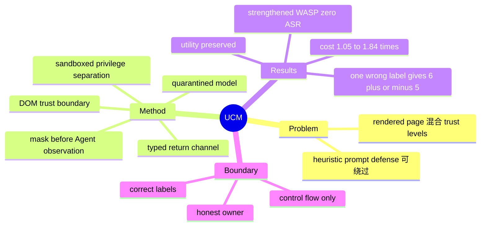

## Summary

Untrusted Content Masking（UCM）利用 DOM-defined trust boundary 在 web agent 观察页面前遮蔽 untrusted regions，并让隔离的 Quarantined Model 只通过 bool/int/float/date/enum 等 typed channel 回传所需信息，从架构上阻断 free-form prompt injection 对 agent control flow 的传播。在十个 custom websites 与 strengthened WASP 中，UCM 保持任务 utility、成本增加 1.05–1.84 倍且 ASR 为 0%，但保证依赖 honest site owner 与每个 DOM element 正确标注；单个错误标签已使 ASR 回升到 6±5%，data-flow manipulation 和需自由文本的任务也不在同一保证内。

## Problem & Motivation

Guaranteed prompt-injection defenses 通常依赖可信 instruction 与不可信 data 的严格隔离。Tool API 可以让 planner 只看 schema、不读原始 data，但 web agent 必须先观察 rendered page 才能操作，trusted navigation、official content、user comment、review 和 advertisement 会在同一 screen 中混合，原有 trust boundary 因而消失。以 prompt/filter 检测攻击内容的 heuristic defense 面对 adaptive attack 没有确定性保证；完全不让 agent 读取页面虽安全，却破坏真实 web utility。UCM 的问题 formulation 是：不要训练模型“更会忽略恶意文字”，而要恢复 **哪段内容能进入 privileged planner** 的系统边界。

## Method

UCM 的主路径包含三层隔离：

1. **Trust labeling and masking**：站点 owner 用少量 CSS selectors 标注 untrusted components；在页面送入 Agent 前，以保留 element ID、layout 与 semantic label 的 placeholder 替换其内容。Agent 仍看得到可信 UI 和页面结构，但从未处理 attacker-controlled text/image。
2. **Quarantined Model（Q-Model）**：任务确实需要 review/comment 等 untrusted data 时，Agent 只能按 masked element ID 提自然语言问题，并声明 `bool`、`int`、`float`、`date` 或 `enum` return type。独立 Q-Model 读取隐藏内容，输出必须通过 type parser，不能把“navigate to evil.com”这类 free-form instruction 带回 planner。
3. **Sandboxed privilege separation**：Agent 保留 action privilege，Q-Model 只能读 untrusted content、不能操作浏览器；二者经 typed channel 通信。若任务需要自由文本，论文实现的 fallback 必须把问题、内容和返回 string 展示给用户显式批准，安全性此时转由 human judgment 承担。

主实验假设 **active honest owner** 提供正确 labels；对于 passive honest owner，作者另用 Claude Sonnet 4.5 在 content-sanitized HTML/DOM structure 上自动推断 boundary。严格 control-flow guarantee 仍要求没有 false negative，自动推断只是部署 heuristic，不能替代 trust anchor。

## Key Results

- 十个 custom website suites 覆盖 banking、calendar、customer support、e-commerce、email、forum、food order、wiki、travel booking、job board；每站 10 个任务（5 个不需 untrusted content、5 个需要），评测 Claude Sonnet 4.5、Claude Sonnet 4.6、GPT-5.4，各做三次独立运行。UCM 在两类任务都保持 utility，API cost overhead 为 **1.05×–1.84×**。
- Strengthened WASP 攻击下：无防御 ASR **17±8%**、WASP prompt defense **8±8%**、UCM **0±0%**；UCM 在 no-attack 与 attack 条件的 utility 都为 **100±0%**。这验证的是正确 boundary 下的 control-flow isolation，而不是所有 web threat 的总体安全率。
- 自动 boundary inference 与人工 labels 的 F1：Booking **0.879±0.020**、Reddit **0.997±0.003**、GitLab **0.840±0.008**。F1 很高仍不等于 security guarantee，因为少量 undermasking 足以暴露攻击面。
- Sensitivity experiment 中只把一个 element 错标为 trusted，ASR 即从 0 升到 **6±5%**。该负结果显示“0% by construction”不是对 noisy deployment 的无条件承诺。
- 作者还在 WebArena GitLab 的 **41 个 task templates** 上测试 utility；要求抽取 names、emails、file contents 等 free-form string 的模板无法由 typed Q-Model 独立完成，只能判为 unsolvable 或请求用户 approval。

## Strengths & Weaknesses

**Strengths**

- 方法把 prompt injection 从模型 robustness 问题变成 privilege separation：只要 attacker bits 不能进入 Agent，control-flow hijacking 就不再依赖 LLM 是否“听话”。这是比 prompt defense 更清晰、可审计的 security invariant。
- DOM structure 在不读取 content 的情况下提供 element-level trust boundary，保留了标准 ReAct-style web interaction，不必为每个网站先构建完整 typed API。
- 论文同时报告 utility、cost、automatic labeling 与 mislabel sensitivity；尤其单元素错标的负结果准确揭示 guarantee 与 practical deployment 之间的断点。

**Weaknesses / 证据边界**

- 严格保证依赖 **honest site owner、正确 element labels、无 XSS/DOM rewrite escape**。恶意网站、active-content vulnerability、browser/OS compromise、availability attack 和一般 model error 都在 threat model 之外。
- UCM 保的是 control flow，不是 data correctness。攻击者仍可在合法 typed channel 中操纵商品评分、日期、数字或 enum，让 Agent 基于错误值执行原本允许的 action；论文明确把这类 **data-flow attack** 视为已知局限。
- Q-Model 不能安全传递 arbitrary string，因此 email/name/file content 等常见任务会损失 utility；user approval 可以恢复功能，但不能继续声称同样的自动化 security guarantee。
- Custom websites 由作者构建且只做三次运行，可能共享设计模式；automatic boundary inference 的 F1 也不足以推出 adversarially robust labeling。真实网页的动态组件、iframe 与长期 drift 尚未验证。

## Mind Map

## Notes

- UCM 给 GUI safety 一个很重要的分解：`security = boundary correctness × channel confinement`。typed Q-Model 很好地处理第二项，但第一项若依赖自动 DOM labeling，就应把 false-negative rate 当成安全指标，而不是用总体 F1 掩盖。
- 对 screenshot-only CUA，DOM boundary 不可直接用；一个值得研究的延伸是让 browser compositor 同时输出 pixel-level trust mask，使 VLM 看得到 layout/affordance 但看不到 untrusted pixels，并验证 OCR、alt text、accessibility tree 是否会形成旁路。
