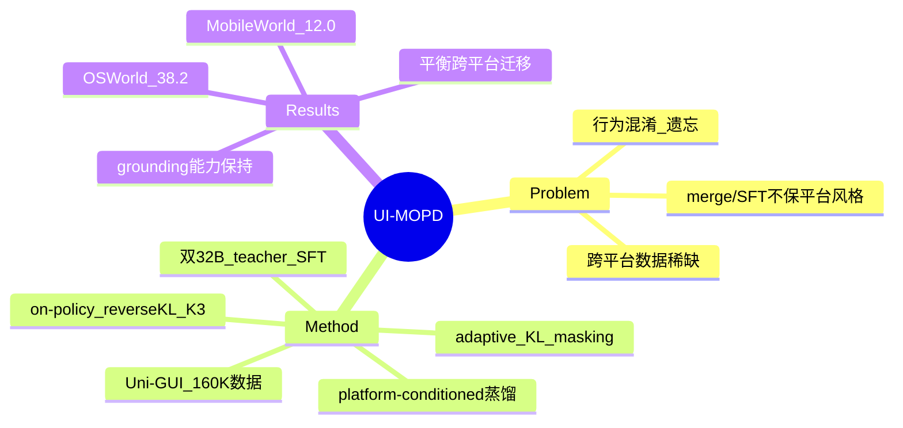

## Summary
针对跨平台（desktop + mobile）GUI agent 联合训练时的行为混淆与灾难性遗忘问题，提出 UI-MOPD：先各自 SFT 出 desktop/mobile 两个 32B expert teacher，再用 platform-conditioned 的 on-policy distillation 把知识蒸馏进一个共享 8B student，在 OSWorld / MobileWorld 上分别达 38.2% / 12.0%。

## Problem & Motivation
构建能跨异构平台（桌面 OS、移动端）操作的统一 GUI agent 面临两难：
- **数据稀缺**：高质量、可执行的跨平台交互 trajectory 稀少，平台覆盖有限。
- **行为冲突**：不同平台的交互 convention 差异大（桌面 `computer_use` 用鼠标键盘，移动端 `mobile_use` 用点击/滑动/system button）。naive 的混合训练会导致 **behavioral pattern mixing、platform-specific capability degradation、catastrophic forgetting**。
- 现有做法（mixed SFT、model merging）把跨平台学习当作单纯的数据聚合，未能保留各平台独立的交互风格。

## Method
**数据侧 — Uni-GUI**：约 160K steps / 11.5K trajectories。Desktop 约 95K 自采 + 13K OpenCUA；Mobile 约 17K 自采 + 35K OpenMobile。通过统一 harness、标准化 action format 采集。

**两阶段训练**：
1. **Stage 1（teacher SFT）**：在平台专属数据上分别 SFT Qwen3-VL-32B-Thinking，得到 desktop teacher π_ref^d 与 mobile teacher π_ref^m。
2. **Stage 2（multi-teacher on-policy distillation）**：训练共享的 8B student（Qwen3-VL-8B-Thinking）。

**核心 — On-Policy Distillation**：
- Student 在 RL 过程中从当前策略采 rollout，teacher 监督以 **platform-conditioned** 方式施加：desktop rollout 对齐 π_ref^d，mobile rollout 对齐 π_ref^m。
- 相比 offline distillation，蒸馏信号集中在 student 当前策略真正做决策的 state distribution 上。
- **Platform-conditioned routing** 按 environment 选 teacher，避免不同平台的行为信号被无差别混合。

**技术组件**：
- Student→teacher 的 **reverse KL**，用 K3 estimator 做 token-level 近似。
- **Adaptive KL masking**：对高 reward 的 rollout 降低 teacher penalty，把引导集中到挣扎的 case 上。
- **Reward**：structured outcome reward（invalid -1.0 / partial -0.5 / correct 1.0）。
- **目标函数**：ℒ(θ) = ℒ_PG(θ) + β·ℒ_MOPD(θ)，β=0.01。
- 训练/推理规模：64× H100；rollout 用 SGLang，inference 用 vLLM；batch 128、每 prompt 8 rollout、lr 1e-6、bf16、各 1 epoch。训练只喂当前 screenshot，推理喂 4 张历史 + 当前。

## Key Results
主结果（task success rate）：

| Benchmark | UI-MOPD 8B | Base | Mixed-SFT | Merge(Avg) | Merge(TIES) | GUI-Owl-7B |
|:--|:--|:--|:--|:--|:--|:--|
| OSWorld (361 tasks) | **38.2%** | 33.9% | 35.0% | 36.5% | 36.8% | 34.9% |
| MobileWorld (117 tasks) | **12.0%** | 7.7% | 6.4% | 6.8% | 0% | 4.5% |

- 跨平台迁移（Table 2）：8B 只在 OSWorld SFT → 35.8% / 0%（mobile 灾难性遗忘）；只在 MobileWorld SFT → 35.8% / 12.8%；UI-MOPD → 38.2% / 12.0%，两端平衡。
- 通用能力保持：AndroidControl★ 80.05%（vs 78.73%），ScreenSpot-Pro 43.14%（vs 43.71%），ScreenSpotV2 90.88%（vs 91.27%），退化极小。
- 核心 takeaway：相比 model merging（尤其 TIES 在 MobileWorld 直接崩到 0%），platform-conditioned 蒸馏在实现跨平台平衡的同时保住了各平台能力。

## Strengths & Weaknesses
**Strengths**：
- 问题 formulation 干净——把"跨平台联合训练"从数据聚合重新框定为"如何在共享 student 上保留平台特异行为并避免遗忘"，platform-conditioned routing 是对症的简洁设计。
- On-policy（蒸馏信号落在 student 自身 state distribution）+ adaptive KL masking（把 teacher 引导集中到低 reward case）在直觉上比 offline distillation / 静态 KL 更合理。
- 用 8B student 逼近甚至超过平台专属 SFT，并保住 grounding / static understanding，性价比说服力较强。

**Weaknesses**：
- **关键 ablation 缺失**：没有去掉 platform-conditioned routing 的对照，无法把增益归因到"routing"还是"on-policy distillation"本身；adaptive KL masking、reverse-KL 也没单独 ablate。
- **绝对数字偏低**：MobileWorld 12.0% 仍然很弱，桌面/移动 gap（38.2 vs 12.0）巨大，说明方法远未"解决"移动端。
- 无 failure mode / error case 分析；TIES merge 在 MobileWorld 得 0% 这种异常也没解释。
- 只覆盖 desktop + mobile 两个平台，对 web / 其他界面的泛化性未验证——"multi-platform"名头下实际只有两平台。

## Mind Map

## Notes
- 与 model merging 路线的本质区别：merging 在参数空间做静态融合（信息互相覆盖，TIES 甚至归零），UI-MOPD 在 rollout 分布上做条件蒸馏，把"选哪个 teacher"变成运行时按 platform 路由。可类比 MoE 的路由思路，但路由信号是外部 environment 而非学得的 gating。
- 待追问：platform label 在真实部署里是否总可得？若环境标签缺失，routing 就失效——这可能是方法的隐含强假设。
