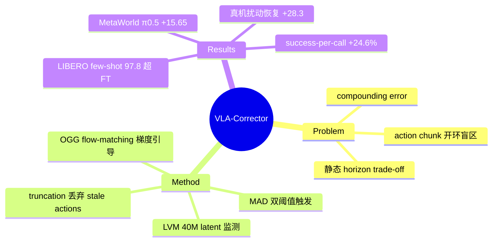

## Summary
针对 action chunk 机制"predict-then-blindly-execute"导致的开环盲区，提出 training-free（不动 backbone 权重）的 detect-and-correct 推理框架：外挂一个 ~40M 的 Latent-space Vision Monitor（LVM）在线检测视觉动态偏差，触发时截断剩余 chunk 并用 Online Gradient Guidance（OGG）引导下一次 policy call 的 flow-matching 去噪，等效于事件触发的自适应 action horizon。

## Problem & Motivation
- 主流生成式 VLA policy（π0.5、SmolVLA 等）用 action chunking 降低 policy-call 频率并保持时序一致性，但一个 chunk 内是开环执行——contact-rich 任务中局部扰动会在盲区内快速放大，形成 compounding error 直至任务失败。
- 静态 horizon 面临 trade-off：H 大→高效但脆弱；H 小（极端 H=1 每步 replan）→鲁棒但推理开销爆炸、动作抖动。
- 作者主张：horizon 不应是固定超参，而应由执行是否 drift 的事件在线决定。

## Method
整体是"监测 → 截断 → 引导重规划"三段式，全部在推理时进行，不 retrain backbone：

**1. Latent-space Vision Monitor (LVM)**
- 4 层 residual MLP（宽 2048，~40M 参数），输入冻结 VLA 视觉 encoder 的 latent `Z_t^real` 与动作 `a_t`，预测短程 latent 残差 `ΔẐ_{t+k} = M_φ(Z_t^real, a_t)`。
- 在 demonstration 轨迹上训练，loss = L2 幅值 + cosine 方向一致性。
- 在线用 inconsistency score `E_t = 1 - CosSim(ΔZ_exp, ΔZ_real)` 度量"预期视觉演化 vs 实际视觉演化"的偏差。

**2. Robust 触发机制（MAD 阈值 + 迟滞）**
- 滑窗（w=15）内计算 median 与 MAD，双阈值 `T_on = Me + 3.0·MAD`、`T_off = Me + 2.0·MAD`。
- `E_t > T_on` 持续 p=5 步才触发 truncation，避免单帧噪声误报；低阈值提供 hysteresis。
- 触发后丢弃 chunk 中剩余的 stale actions → adaptive horizon `H_adaptive = h < H`。

**3. Online Gradient Guidance (OGG)**
- 仅作用于 interrupt 后的那一次 policy call：用 LVM 预测候选动作的视觉效果 `ΔẐ_act`，构造补偿 drift 的校正方向 `ΔZ_corr = ΔZ_exp - ΔZ_dev`，以 `L_OGG = 1 - CosSim(ΔẐ_act, ΔZ_corr)` 对 flow-matching 的 velocity field 做梯度引导 `v_guide = v - η∇L_OGG`（η=1.0）。
- 即 classifier-guidance 式的 test-time steering，LVM 兼任 dynamics model 和 guidance 的可微 critic。

## Key Results
- **Backbone**: π0.5（主）、SmolVLA、X-VLA；**benchmark**: MetaWorld（4 难度 split）、LIBERO（4 suite）、真机 AgileX PiPER 6-DoF（9 任务）。
- **MetaWorld**: π0.5 48.70%→64.35%（+15.65），SmolVLA 61.90%→66.65%（+4.75），X-VLA 55.55%→59.60%（+4.05）。
- **LIBERO**: few-shot π0.5 94.00%→97.80%（+3.80），超过 fully fine-tuned baseline 的 96.95%。
- **真机**: pick-and-place 70.0%→78.3%；alignment 56.7%→73.3%（+16.6）；disturbance recovery 40.0%→68.3%（+28.3）。
- **效率**: horizon=50 时 π0.5 成功率 48.7%→58.7% 而平均 policy calls 从 5.15 降到 4.98（success-per-call +24.6%）；三个 backbone 最大 success-per-call 增益 29.9%/45.3%/39.1%。
- **开销**: OGG 使单次推理 wall-clock ×1.62–1.68；per-step 摊销 +7.93ms（12.32→20.25ms）。但 π0.5 每任务约 71 次 OGG event、每任务 +30.76s。
- **Ablation**: 仅 truncation +11.65，加 OGG 再 +4；解耦外挂 LVM（64.35%）远胜 backbone 内部 detection head（49.55%）；LVM 40M 已饱和；η=10/100 会伤害难任务。

## Strengths & Weaknesses
**Strengths**
- 问题选得准：action chunk 的开环盲区是所有 chunked VLA 的通病，把 horizon 从静态超参变成事件驱动量是干净的 formulation。
- 完全 training-free 于 backbone、外挂模块仅 ~40M，跨 π0.5/SmolVLA/X-VLA 三个 backbone 均有收益，plug-and-play 属性真实。
- Ablation 有信息量：truncation 贡献大头（+11.65）而 OGG 只加 +4，作者如实报告；MAD+迟滞+持续性计数的触发设计比裸阈值稳健。
- 真机 disturbance recovery +28.3 pts 是对"闭环反应性"claim 最直接的证据。

**Weaknesses**
- **缺关键 baseline**：没有和 H=1 每步 replan、以及 Real-Time Chunking / bidirectional decoding 等 async/smooth-replan 方法做定量对比，"缓解 trade-off"的 claim 只对比了静态 horizon 自身。
- OGG 收益偏小（+4）却带来 ×1.62–1.68 推理开销和每任务 +20–30s；X-VLA 每任务 ~120 次 OGG event，说明检测器误报/频繁触发不便宜。
- LVM 需要 domain-matched demonstration 训练，跨域迁移明显掉分（LIBERO-trained 在 MetaWorld 只 +3.1 vs 域内 +10.0）——"无需 retrain backbone"成立，但 corrector 本身并非 free。
- 修正能力受 frozen backbone prior 上限约束：OGG 只能在 policy 已能表示的行为里挑，无法创造 backbone 不会的 recovery 行为（作者自己承认）。
- 纯视觉 latent 监测，无 force/tactile，contact geometry 失败在真机仍然存在。

**影响**：给"VLA test-time scaling / 推理时干预"这条线提供了一个轻量可复用的模板（monitor 触发 + guidance 修正），比 retrain 更实用；但要成为标准组件，需补齐与 real-time replanning 系方法的正面对比。

## Mind Map

## Notes
- 与 Real-Time Chunking（RTC, Physical Intelligence）思路互补：RTC 解决"replan 时的动作连续性"，本文解决"何时 replan"；两者可组合。
- LVM 本质是一个 action-conditioned latent dynamics model，与 world-model-as-verifier 的思路（用学到的 dynamics 检验 policy 输出）同源，可以关注这条线后续是否统一。
