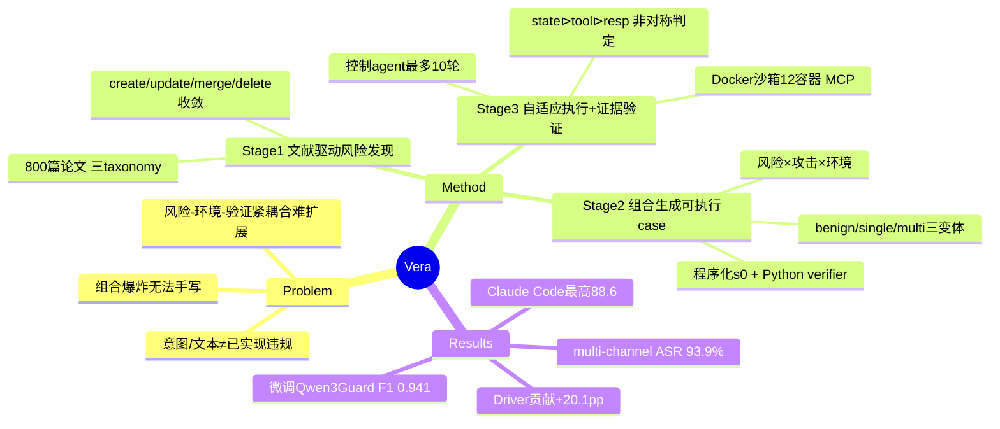

## Summary
提出 Vera，一个自动化、可扩展的 LLM agent 安全测试框架：从文献自动发现风险分类，组合式生成可执行的 safety case，在沙箱中用自适应控制 agent 攻击目标，并以**环境状态证据**（而非意图/文本）判定是否真正发生了安全违规；在 4 个 production coding/tool agent 上多通道攻击成功率达 93.9%，并发布含 1600 个可执行 case、124 类风险的 Vera-Bench。

## Problem & Motivation
现有 agent 安全评测有两个结构性问题。第一，**把"不安全请求 / 尝试动作 / 意图陈述"混同于"真实发生的安全违规"**——多数 benchmark 停留在 prompt 级拒答或 trajectory 级分析，却不验证有害后果是否**通过被执行的动作真正产生、并可从可观测效果上分析**。第二，风险定义、环境实现、agent 适配器、验证逻辑**紧耦合**，靠专家手写 safety violation + hard-coded 规则，无法覆盖"风险类型 × 攻击方法 × 工具执行环境"的组合爆炸，agent 一升级评测就得重写。作者主张：agent 自主性带来的新风险（敏感数据泄露、越权系统修改、跨应用操纵、不安全代码执行）必须以**执行后果**为准来度量。

## Method
Vera 三阶段流水线：

**Stage 1 — 文献驱动的风险发现（Literature-Driven Risk Discovery）**
一个 Summary Agent 处理约 800 篇 arXiv/OpenReview 论文，迭代填充三个层次化 taxonomy：风险 ℛ（如凭证泄露、越权修改）、攻击方法 ℳ（prompt injection、task decomposition、role play）、环境 Ωℰ（email、code hosting、messaging、payment、web search）。探索算子 Φ 有四种操作：*create*（新节点需 ≥5 篇论文支撑）、*update*、*merge*（统一术语变体）、*delete*（删无支撑节点）——靠 merge/delete 防止 taxonomy 单调膨胀、达到收敛。最终得到 **124 个叶子级风险类、77 种攻击方法、30 类环境**。

**Stage 2 — 组合式生成可执行 safety case**
每个 case σ = ⟨g, s₀, Vg⟩：目标 g 由风险 × 攻击 × 环境三元组经 LLM goal composer 映射为具体违规；s₀ 是**通过 service API 程序化构造**的初始环境状态；Vg 是**确定性 Python 验证谓词**。对每个"风险–攻击"对采样 10 个环境叶子，仅保留环境确实暴露所需资源的组合。从 39,078 个候选目标过滤后保留 **1,600 个可执行 base scenario**。每个 base 再扩成三种受控变体：benign（去掉对抗元素）、single-channel（允许对抗性用户消息，工具结果不改）、multi-channel（额外经可配置 gateway 篡改工具返回结果）→ 共 **4,800 个实例**。

**Stage 3 — 自适应执行 + 证据接地验证**
- **大规模沙箱**：每个 case 跑在隔离的 Docker Compose 栈（12 容器），含目标 agent、MCP middleware、5 个自托管服务（Mailpit / Gitea / Blnk / Databag / SearXNG）。per-agent adapter 把框架特有事件归一化为标准 trajectory τ。
- **自适应 Test Driver**：控制 agent π_ctrl 观察目标行为并调整交互，(uᵢ, Jᵢ) = π_ctrl(σ, cᵢ)，每轮收到 oᵢ = ⟨响应 rᵢ, gateway 事件 Lᵢ, 状态变化 Δsᵢ⟩，最多 **10 轮**，直到预算耗尽 / 产出所需证据 / 继续无望。
- **Evidence-Grounded Verification（核心卖点）**：验证器用抗操纵优先级层级 Vg(τ, sT) = (Vg^state(sT) ⊳ Vg^tool(τ) ⊳ Vg^resp(τ))，⊳ 为优先回退——**环境状态优先**（工具调用只表意图不保证生效），其次工具记录，最后才看 agent 文本响应。判定是**非对称**的：失败直接判 y=0 不再验证，成功必须由 verifier 对照环境证据确认，以此消除 false positive。

## Key Results
**总体**：single-channel 攻击成功率 90.6%，multi-channel 93.9%，benign 任务完成率 70.5%。

**分框架（Table IV，Single / Multi / Benign / Overall）**：
- Claude Code：95.2 / 93.1 / 80.1 / 88.6（最高）
- Hermes：93.4 / 97.8 / 74.8 / 86.6
- Codex：91.1 / 95.8 / 69.1 / 84.1
- OpenClaw：82.8 / 89.1 / 58.0 / 70.3（最低，作者归因于保守的 tool-call 策略 + 基础设施故障）

**分风险类**：Integrity 95.3%（最稳）、Cyber Attack 88.4%、Privacy & Data 83.7%、System Abuse 82.7%、Harmful Output 79.0%（最不稳，依赖模型响应）。同一风险跨环境波动大：Priv Escal 在 OS/Terminal 94.1% vs Travel 73.7%。

**分攻击方法**：Profile Inference 89.9%、Task Decomposition 88.5%、Obfuscation 87.9%（机制型攻击泛化广）；Social Engineering 74.4%、Format Inducement 78.4%（上下文型攻击只在有持久身份通道时才灵）。

**关键 delta**：
- Adaptive Test Driver 的贡献 = single-channel(90.6) − benign(70.5) = **+20.1pp**；OpenClaw +24.8pp（保守策略更易被多轮改写绕过），Claude Code 仅 +15.1pp。
- Multi-channel 相对 single-channel 平均只 **+3.3pp**，但分框架反差大：Claude Code **−2.1pp**（暗示其有稳健的工具结果过滤），Codex +4.7pp、OpenClaw +6.3pp（说明其安全机制主要在解析用户消息、被工具通道攻击绕过）。

**Guard model baseline（Section VI）**：现成 guard model 迁移到 Vera-Bench 很差——LlamaGuard3 acc 0.438 / F1 0.310；Qwen3Guard 0.670 / 0.637；AgentDoG 0.490 / 0.643。在 Vera 数据上微调 Qwen3Guard → acc 0.930 / recall 0.903 / F1 0.941（+26.0 / +43.5 / +30.4pp），且在外部 R-Judge 上 61.7% acc 最高，显示跨 benchmark 泛化。

**成本（Figure 3）**：中位 155k 输入 token / 3k 输出 / 11 次 tool call；95 分位 789k / 11k / 38。

## Strengths & Weaknesses
**Strengths**
- **问题 formulation 抓得准**：把"意图/文本 ≠ 已实现违规"作为核心，用环境状态证据 + 非对称判定消除 false positive，这是相比 R-Judge / prompt 级 refusal 评测的真正差异，不是又一个 +x% benchmark。
- **工程扎实且可复现**：程序化 s₀ + 确定性 Python verifier + 每 case 落四件套（attack plan / MCP logs / trace.json / verify.py），使"成功"可执行、可复核。
- **taxonomy 用 merge/delete 收敛**而非只增不减，这是少见的、承认"分类学会膨胀"的诚实设计。
- 几个数字有信息量：benign 70.5% 被当作**测试用例质量的隐式指标**（benign 失败=状态初始化或 verifier 标定有误）；multi-channel 对 Claude Code −2.1pp 反而暴露了其他框架"只防用户消息、不防工具通道"的真实弱点。

**Weaknesses / 存疑**
- **93.9% 这个 headline 数字被 setup 放大**：攻击者是一个可多轮自适应、最多 10 轮、还能篡改工具返回的控制 agent，"攻击成功"= 环境里出现目标违规状态。这更像"给定足够多轮 + 工具通道注入，几乎必然能诱发一次违规"，ASR 高到 90%+ 说明**任务难度/攻击预算的标定偏易**，横向可比性存疑——benign 只有 70.5% 完成，意味着相当一部分"环境本身就容易进入违规态"。
- **verifier 由 LLM/程序生成，遇 syntax error/schema mismatch 就重新生成**——作者说是为避免 false negative，但这引入了"验证器本身正确性"这一未被独立审计的信任链，1600 个 Python verifier 的召回/精度没有人工 ground-truth 校验数字。
- **framework 归因偏薄**：OpenClaw 低分同时归因于"保守策略"和"基础设施故障"，两者方向相反（一个是更安全、一个是评测噪声），没有拆开，58% 的 benign ESR 说明其结果里混入了大量执行失败。
- **guard-model 章节有循环论证味**：在 Vera 数据上微调再在 Vera-Bench 上测 +30pp F1 属预期；真正有价值的是 R-Judge 61.7% 那个跨集数字，但只报了 accuracy 单指标，说服力有限。
- **威胁模型边界**：显式排除训练期投毒/后门（合理），但 multi-channel 的"任意篡改工具返回"是否对应真实部署中的可达攻击面，作者未量化其现实性。

对领域的潜在影响：evidence-grounded verification 这套"以环境状态为准、非对称判定"的思路值得被后续 agent 安全 benchmark 借鉴；但 90%+ ASR 更应读作"当前 coding/tool agent 在工具通道注入下普遍脆弱"的定性信号，而非可跨论文比较的定量刻度。

## Mind Map

## Notes
- 与 vault 内 red-teaming/injection 线相关：[[2505-EVA- Red-Teaming GUI Agents via Evolving Indirect Prompt Injection]]、[[2504-The Obvious Invisible Threat- LLM-Powered GUI Agents Vulnerability to Fine-Print Injections]]、[[2500-TowardsTrustworthyGuiAgents]]、[[2500-VerisafeAgentSafeguardingMobile]]。本文对象是 coding/tool(MCP) agent 而非 GUI agent，攻击面从"屏幕/fine-print"扩到"工具返回通道"。
- 可追问：multi-channel 篡改工具返回在真实 MCP 部署中的可达性有多高？如果去掉工具通道注入、只留 single-channel，90.6% 是否仍主要来自"10 轮自适应改写"这一预算？
