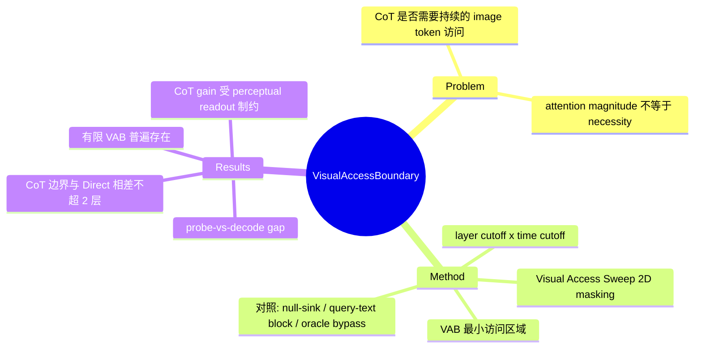

## Summary
提出 Visual Access Sweep（VAS）因果干预方法，沿 layer 深度与 generation 时间两个维度屏蔽生成 token 对 image token 的注意力，测出维持精度所需的最小访问区域（Visual Access Boundary, VAB）；发现 CoT 虽然把生成长度拉长约 50 倍，其所需的视觉访问边界与 Direct answering 相差不超过 2 层——CoT 的增益来自对已写入 hidden states 的视觉信息做更长的语言计算，而非持续"回看"图像。

## Problem & Motivation
VLM 的 CoT reasoning 为什么有效？一个直觉假设是：更长的推理链让模型有更多机会反复 attend 到 image token、迭代地"看图"。已有观察性研究记录了生成过程中对 image token 的 attention 会衰减，但作者指出关键缺口：**attention magnitude 不能建立 necessity**——注意力小不代表不需要，注意力大也不代表在起作用。需要因果干预来回答：持续的 image-token 直接访问在功能上是否必要？这个问题关系到我们如何理解（和改进）multimodal reasoning：如果 CoT 根本不依赖持续视觉访问，那么"让模型推理时多看图"类的方法设计动机就要重新审视。

## Method
**Visual Access Sweep (VAS)**：对 attention 矩阵做硬屏蔽——对被屏蔽区域内每个 (generated-query position i, image-token key position j) 对设 M_ij = −∞，使 post-softmax 权重严格为 0。沿两个维度做 2D 扫描：
- **Layer cutoff (ℓ_cutoff)**：只允许前 ℓ 层的直接视觉访问
- **Time cutoff (t_cutoff)**：只允许前 t 个生成步的直接视觉访问

**Visual Access Boundary (VAB)**：定义为在容差 ε = 0.05 内保持任务精度的最小访问矩形 (ℓ*, τ*)。三种变体：
- ℓ_D*：Direct prompting 自身的边界
- ℓ_CoT*：CoT 保持自身 full-access 性能的边界
- ℓ_DA*（Direct-anchored）：CoT 达到 Direct full-access 目标所需的边界

**对照实验设计**：
- Late-layer query-text block：从 cutoff 层起同时屏蔽 query 文本→image 的 attention，排除"query 中介的晚期重读"通道
- Null-sink control：把被屏蔽的 attention 重定向到 dummy sink，排除 attention 重分配 artifact
- Oracle bypass：把 ground-truth 属性以纯文本喂给模型（无图像），检验 CoT 在语言侧的推理能力上限

**任务设计**：程序化生成的 attribute-counting 合成任务（5 种属性：color/shape/location/angle/size，各 4 类；150 张图，每图 6-7 个物体，5 个计数 query），外加 GQA balanced yes/no 子集（1,000 条）验证真实图像。评估 Qwen2.5-VL（3B/7B/32B）与 InternVL3（8B/14B/38B）共 6 个配置，另有 Llama-3.2-11B-Vision 的 cross-attention pilot。

## Key Results
- **有限 VAB 普遍存在**：所有 model-task 组合下，Direct 与 CoT 都表现出有限边界——上层大片区域屏蔽掉不掉点，切到早期层才骤降。即：早期层完成视觉信息提取后，晚期层的直接图像访问基本冗余。
- **核心发现——CoT 不按比例扩张视觉访问**：Qwen2.5-VL-32B 和 InternVL3-14B/38B 上，以 Direct full-access 为目标时 |Δℓ_DA*| ≤ 2 层；CoT 生成长度约为 Direct 的 50 倍，但所需视觉访问区域几乎不变。对 tolerance ε ∈ {0.03, 0.05, 0.07, 0.10} 稳定（|Δℓ_DA*| ≤ 1）。
- **Perceptual readout 决定 CoT 增益上限**：跨 Qwen2.5-VL 三个 scale，per-attribute CoT gain 与 multi-object perceptual readout accuracy 正相关。难属性（angle/size/location）readout 低、CoT gain 弱甚至为负；把 ground-truth 属性以文本形式给模型（oracle bypass）后，所有属性的 CoT gain 变得一致——瓶颈在感知提取，不在推理。
- **Probe-vs-decode gap**：Qwen2.5-VL-32B 上，angle/location/size 等难属性的 hidden states 里线性 probe 能高精度恢复的信息，模型自身 decode 却显著更差——信息在但读不出来。
- **泛化性**：GQA 真实图像 yes/no 任务呈现相同定性 VAB 结构；Llama-3.2-11B cross-attention 架构（屏蔽 cross-attention 而非 self-attention）同样出现有限 VAB。
- **失效边界**：angle counting 的 perceptual readout 在 chance level，VAB 定义失效——方法对任务难度敏感。

## Strengths & Weaknesses
**Strengths**：
- 从观察（attention 衰减）到因果（masking 干预）的方法学升级是实打实的贡献，"attention magnitude does not establish necessity" 的问题意识准确
- 对照实验做得干净：query-text block、null-sink、oracle bypass、tolerance 敏感性分析，逐一排除了主要 confounder
- "CoT 增益受 perceptual readout 制约" + probe-vs-decode gap 这条线有实际指导意义：VLM reasoning 的瓶颈可能在于 decode 视觉属性的能力，而非推理长度

**Weaknesses**：
- 任务局限于 attribute counting 和 GQA yes/no——都是"一眼看完再算"型任务。作者自己承认"deliberately designed to require iterative visual inspection" 的任务不在评估范围内，而这恰恰是结论最可能翻车的地方（如 visual search、多步 grounding、"think with images" 类任务）
- 干预只切断了 generated-token→image-token 的 direct attention 这一条通道，residual stream 中的信息传播未被控制；边界产生的机制未被识别（early binding / residual propagation / front-loading 等解释均未排除）
- 结论主要建立在 prefix-fusion decoder-only 架构上，cross-attention 只有 pilot
- 未开源代码（截至笔记撰写时）

**潜在影响**：对 "multimodal CoT = 迭代看图" 的流行叙事是一次有据的反驳，间接支持了另一条路线——与其拉长推理链，不如提升视觉属性的可解码性（或用工具显式重新提取视觉信息）。对 GUI agent 等依赖 screenshot 推理的场景，提示了 "推理时回看截图是否真的必要" 这一可检验的问题。

## Mind Map

## Notes
- 与 vault 中 GUI agent / VLA 方向的关联：如果 CoT 期间的视觉访问大多冗余，则 agent 推理时反复 attend 截图的计算可以被激进裁剪（image token KV 在晚期层/晚期步可丢弃），对 inference 效率有直接含义——但前提是任务不属于 "iterative visual inspection" 类，GUI grounding 恰恰可能属于后者，需要小心外推。
- 待跟进：是否有后续工作在 visual search / multi-hop grounding 任务上重复该干预（预期 VAB 会显著扩张）。
