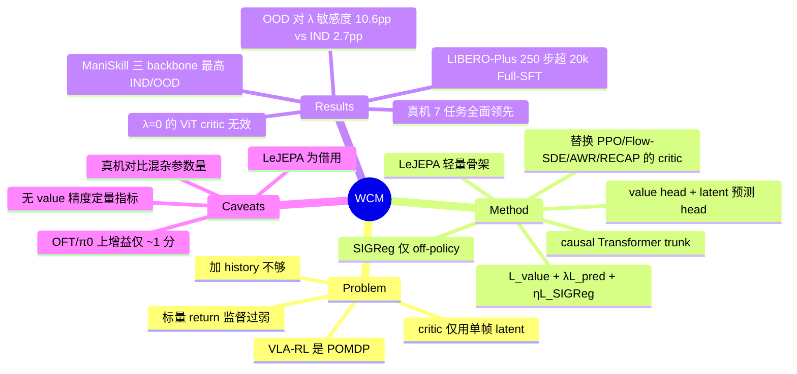

## Summary

针对 critic-based VLA-RL 中 critic 只吃单帧观测、在 POMDP 下无法恢复时序状态的问题，本文提出 World Critic Model（WCM）：一个基于 LeJEPA 的轻量 critic，用共享 trunk 同时预测下一帧 latent 与回归 return，把 world modeling 当作 value 回归的稠密辅助监督而非解耦的辅助任务。WCM 可直接替换 PPO / Flow-SDE / AWR / RECAP 里的 critic，在 149 个仿真任务（ManiSkill、MetaWorld、CALVIN、LIBERO-Plus）与 7 个 WidowX-250S 真机任务上相对各自 baseline 一致提升，且 OOD 增益普遍大于 IND。

## Problem & Motivation

机器人操作本质是 POMDP：单帧图像能给出物体外观与场景布局，但看不到运动、接触进程等对 value 估计至关重要的动态信息。而现有 VLA-RL 的 critic 几乎都从单帧观测或单帧 VLM backbone latent 回归 value（RLinf 的 critic 是 3 层 MLP），隐含假设"一帧足以重建系统状态"。

作者的第二个观察更关键：**把 history 塞进 critic 并不够**。frame stacking 在大观测空间中已知失效，而作者自己实验发现，即使把 critic 换成带位置编码的 ViT（有时序建模能力），性能仍然提不上去——因为标量 return 回归对"学跨帧动态"是极弱的监督信号，critic 完全可以把历史输入当成一个更大的静态特征向量。由此作者把根因归结为 state approximation problem：缺少显式的 world modeling 目标，critic 的表征就抓不到 value 估计所需的时序结构。

## Method

**架构（Sec 3.2）**。四个组件：observation encoder、world predictor、value head、latent 预测 head。

- 过去 $K$ 帧观测各自独立过 observation encoder 得到 per-frame latent $z_{t-k}$。encoder 视实现而定：仿真 on-policy 里直接复用 VLA policy 的 VLM backbone（保持轻量并利用预训练表征），其他情形用 ViT。
- 语言指令经 CLIP 编码后过一个 adapter 映射进 WCM latent 空间；视觉历史先 cross-attend 到指令 token。
- 语言条件化后的序列过 causal Transformer trunk（即 world predictor）得到 $h_t$，再分叉成两个 head：value head 输出 $\hat V_t$；latent dynamics head 以 action 为条件做残差更新 $\hat z_{t+1} = \mathcal{D}_{\text{world}}(h_t, a_t, z_t)$，实现为 action encoder + gated FiLM 残差块。

**训练目标（Eq. 6–10）**。三项加权：
- $\mathcal{L}_{\text{pred}}$：teacher-forcing 的下一帧 latent L2 预测误差；
- $\mathcal{L}_{\text{SIGReg}}$：LeJEPA 的 Sketched-Isotropic Gaussian Regularization，强制 latent 的任意一维随机投影匹配标准正态特征函数，防止表征塌缩；
- $\mathcal{L}_{\text{value}}$：预测值与 return $G_t$ 的 L2。reward 设计沿用 RECAP：成功终止 0、失败终止 $-C_{\text{fail}}$、其余每步 $-1$，return 再 min-max 归一到 $[-1,1]$。

总损失 $\mathcal{L} = \mathcal{L}_{\text{value}} + \lambda\mathcal{L}_{\text{pred}} + \eta\mathcal{L}_{\text{SIGReg}}$，端到端联合训练。注意 **SIGReg 只在 off-policy pipeline 启用**，on-policy 里因为约束 VLM latent 开销过大而关掉（Appendix D.1），所以仿真主结果里真正额外生效的只有 $\mathcal{L}_{\text{pred}}$。

**两条 pipeline（Sec 3.3 / Appendix D.1）**。on-policy：AR 模型（OpenVLA-OFT）用 PPO，flow-matching 模型（$\pi_0$/$\pi_{0.5}$）用 Flow-SDE，WCM 出 value 供 GAE 算 advantage。off-policy：AR 用 AWR、flow-matching 用 RECAP，buffer 混合 teleop SFT 数据与失败 rollout，advantage 用 $N$ 步 TD 形式且 value 输入是 $o_{t-K+1:t}$ 整段历史窗口。

## Key Results

**ManiSkill（Table 1，25 个 pick-and-place 任务，IND/OOD 两类）**。三个 backbone 上 WCM 都拿到最高 IND 与 OOD：$\pi_0$ 84.4±1.2 / 51.5±1.5，$\pi_{0.5}$ 91.9±0.4 / 64.4±1.4，OpenVLA-OFT 99.0±0.4 / 77.9±0.8。增益幅度分布很不均匀：$\pi_{0.5}$ 上 OOD 比最强 baseline $\pi$-stepNFT 高 4.9；但 OpenVLA-OFT 上 OOD 只比 PPO 高 0.8，$\pi_0$ 上只比 $\pi$-stepNFT 高 1.1（且 vision 维度 69.1 打平）。另外从一个完全没见过 ManiSkill 数据的 checkpoint（0.78% 成功率）出发，WCM 能训到 98.7±0.3——论文把这写成 "12,551% 提升"，实质信息是"零起点也能稳定训起来"。

**LIBERO-Plus（Table 2）**。从 one-shot SFT 出发训约 250 步 RL，total 就超过用 20k 轨迹训的 Full-SFT（$\pi_0$ 72.8 vs 71.2、$\pi_{0.5}$ 73.7 vs 72.9、OpenVLA-OFT 74.0 vs 71.7）。这是全文最有说服力的样本效率结果，但优势只有 0.8–2.3 分，且分维度不均：$\pi_{0.5}$ 的 language 维度 65.0 明显低于 Full-SFT 的 73.8，OpenVLA-OFT 的 layout 63.6 低于 70.3（C17）。

**真机（Table 3）**。WidowX-250S 上 7 个任务（3 个 pick-and-place、2 个形变物体、1 个长程、1 个传送带动态抓取），每任务 100 条 teleop 轨迹起步、8 轮 RL 更新、每轮每任务 50 条 rollout。WCM（107.2M 可学习参数）在全部 7 个任务上都优于 AWR / RECAP baseline，增益最大的是长程 stovetop cleaning（OpenVLA-OFT 1/50 → 15/50；$\pi_{0.5}$ 4/50 → 33/50）与形变物体折叠。作者给的行为层面解释是：单帧 critic 分不清"末端到达桌面 z 坐标"是抓取将成还是撞桌，因而会把 policy 训成往桌面里压导致堵转；WCM 的 value 曲线在碰撞帧有明显下跌。

**消融（Sec 5.1–5.2、Appendix A）**。
- 核心对照：把 critic 从单帧 MLP 换成 2–5 帧的历史 ViT（论文明确定义为 WCM 的 $\lambda=0$ 特例，有时序建模但无 world prediction）仍然无效；加上预测目标才提升。这是支撑"缺的是目标而非历史"的直接证据。⚠️ Figure 5 的具体数值只存在于图像中，本地全文渲染读不到，本笔记只记录论文文字结论。
- $\lambda$ 扫描：IND 与 OOD 的最优都落在 $[0.3,0.5]$；$\lambda=0.9$（预测主导）的 OOD 好于 $\lambda=0.1$（value 回归主导）；$\lambda$ 变化在 OOD 上造成 10.6 个百分点波动，IND 只有 2.7 个百分点——即预测目标买到的主要是泛化。
- history length 1–5 中 3 最好，作者给的"3 帧隐含二阶动力学（加速度）"只是自称的 plausible intuitive explanation，未验证。
- Appendix C：Flow-SDE 的 OOD 存在先升后降的 dropping phenomenon；把 value 固定为 0 反而在相当 IND 水平下拿到更好的 OOD，指向 critic 过拟合是 OOD 退化的来源之一。WCM 在前 500 步未观察到过拟合，但作者明确不宣称免疫。

## Evidence Ledger

| Claim ID | Claim | Type | Source locator | Evidence excerpt | Status |
|:--|:--|:--|:--|:--|:--|
| C1 | 实验覆盖 149 个任务 / 4 个仿真 benchmark（ManiSkill、MetaWorld、CALVIN、LIBERO-Plus）+ WidowX-250S 上 7 个真机任务 | benchmark-setting | Sec 4.1 | "We evaluate our method on 149 tasks across four simulation benchmarks" | source-verified |
| C2 | ManiSkill / $\pi_{0.5}$：WCM IND 91.9±0.4、OOD 64.4±1.4，对比 Flow-SDE 90.9/49.3、$\pi$-stepNFT 85.4/59.5 | number | Table 1 | "+ WCM (Ours) 91.9±0.4 … 64.4±1.4"；"+ FlowSDE … 90.9 … 49.3" | source-verified |
| C3 | ManiSkill / OpenVLA-OFT：WCM 99.0±0.4 / 77.9±0.8，PPO baseline 97.7 / 77.1，即 OOD 领先仅 +0.8 | number | Table 1 | "+ WCM (Ours) 99.0±0.4 … 77.9±0.8"；"+ PPO … 97.7 … 77.1" | source-verified |
| C4 | 从 0.78% 成功率的无 ManiSkill 曝光 checkpoint 出发训到 98.7±0.3，论文表述为 12,551% 提升 | number | Sec 4.2 (2) | "no exposure to ManiSkill data (0.78%), our method improves performance by 12,551%" | source-verified |
| C5 | 论文称 OpenVLA-OFT 上相对 SFT 有 252% 提升 | number | Sec 4.2 (1) | "especially for OpenVLA-OFT with a 252% improvement" | source-verified |
| C6 | LIBERO-Plus：one-shot SFT 起步约 250 步 RL 后 total 超过 20k 轨迹的 Full-SFT（72.8/71.2、73.7/72.9、74.0/71.7） | comparison | Sec 4.3 (2) + Table 2 | "after about 250 RL training steps, our method outperforms full-shot SFT trained on 20k trajectories" | source-verified |
| C7 | 消融把历史 ViT critic 明确定义为 WCM 的 $\lambda=0$ 特例（有时序建模、无 world prediction）且报告其仍无效，加上预测目标才提升 | causal-mechanism | Sec 5.1 + Fig 5 caption | "Leveraging a history-based ViT (a special case of WCM with λ=0) still proves ineffective" | source-verified |
| C8 | 全文未报告任何 value 估计精度的定量指标（value 回归误差 / TD error / explained variance）来对比 WCM 与单帧或 $\lambda=0$ critic；"value 更准"只由下游成功率 + 定性 value 曲线与 heatmap 支撑 | causal-mechanism | Sec 4.4 / 5.1 / App E / App F | "attributed to its better state reconstruction and consequently more accurate value estimation"（未见任何误差指标） | source-verified |
| C9 | $\lambda$ 消融：IND 与 OOD 最优均在 $[0.3,0.5]$；$\lambda=0.9$ 的 OOD 优于 $\lambda=0.1$；OOD 波动 10.6 pp、IND 仅 2.7 pp | number | Appendix A | "fluctuation of 10.6 percentage points in OOD, compared to only 2.7 percentage points in IND" | source-verified |
| C10 | observation history 长度 1–5 的消融中，长度 3 平均表现最好 | number | Sec 5.2 | "In our experiments, length 3 performed best on average" | source-verified |
| C11 | LeJEPA 架构与 SIGReg 损失均来自已有工作（balestriero2025lejepa），非本文提出 | sota-novelty | Sec 3.2 | "we adopt the lightweight LeJEPA [balestriero2025lejepa] architecture" | source-verified |
| C12 | 仿真 baseline 同条件对比：沿用 RL4VLA/RLinf 官方超参不额外调参，batch 64，统一训满 1,000 步（≈64,000 轨迹），同一 16,800 条规划器轨迹的 SFT 起点 | benchmark-setting | Appendix D.2 | "hyperparameters officially provided by RLinf without any additional tuning… training for a full 1,000 steps" | source-verified |
| C13 | 真机 7 任务上 WCM（107.2M 可学习参数）全面优于 AWR / RECAP baseline；baseline critic 为 SigLip 400M encoder + Gemma 270M backbone | comparison | Sec 4.4 + Table 3 + App D.2 | "WCM with 107.2M learnable parameters) outperforms baselines across all tasks"；"SigLip 400M Encoder and a Gemma 270M Backbone" | source-verified |
| C14 | SIGReg 未用于 on-policy pipeline（仅 off-policy），理由是约束 VLM latent 会带来额外计算开销 | benchmark-setting | Appendix D.1 | "SIGReg is not adopted in the on-policy pipeline, as constraining the VLM latent would introduce unnecessary computational overhead" | source-verified |
| C15 | 代码、主页与 Hugging Face collection 均已公开（github.com/sylvestf/WCM），论文 CC BY 4.0 | license-code | header（Abstract 与 Sec 1 之间） | "[GitHub Repo] https://github.com/sylvestf/WCM"；"License: CC BY 4.0" | source-verified |
| C16 | Appendix C：zero-value 消融在相当 IND 水平下 OOD 优于 Flow-SDE；WCM 前 500 步未观察到过拟合，作者明确不宣称免疫 | causal-mechanism | Appendix C + Fig 7 | "No overfitting is observed in WCM during the first 500 steps, though we do not claim it is entirely immune" | source-verified |
| C17 | LIBERO-Plus 上 +WCM 的 total 对 Full-SFT 优势仅 0.8–2.3 分，且部分单维度低于 Full-SFT（$\pi_{0.5}$ language 65.0 vs 73.8；OpenVLA-OFT layout 63.6 vs 70.3） | number | Table 2 | π0.5 language: Full-SFT 73.8±1.0 vs +WCM 65.0±1.1；OFT layout: 70.3±1.0 vs 63.6±1.4 | source-verified |
| C18 | Table 1 中 baseline 行（SFT/FlowSDE/FlowNoise/$\pi$-stepNFT/GRPO/PPO/Zero-Shot）均为单点数值无 error bar，仅 "+ WCM (Ours)" 行报告 mean±std | benchmark-setting | Table 1 | 基线行如 "79.2 +40.8 69.1 49.1 33.1 50.4 +32.3"；WCM 行为 "84.4 $\pm$ 1.2" | source-verified |
| C19 | 全文未给出 WCM 相对 MLP / 单帧 critic 的训练开销对比（wall-clock、GPU-hours 或 step time）；效率数字只有 Appendix D.3 的推理 throughput 与 D.2 的硬件描述 | benchmark-setting | Appendix D.2–D.3（全文扫描） | D.2 仅 "8×H100 machine, including training and evaluation"；D.3 仅 "successful rollouts per hour" | source-verified |

## Strengths & Weaknesses

**Strengths**

问题拆解干净。"history 不够，还需要预测性目标"这句话被拆成了可证伪的两步，并且真的做了 $\lambda=0$ 的历史 ViT 对照（C7）——这是全文信息量最高的实验，也是把本文和一堆"加个 world model 辅助 loss 就涨点"的工作区分开的地方。

可比性交代得比同类论文充分。仿真直接沿用 RL4VLA / RLinf 的官方超参不做额外调优、所有方法统一训满 1,000 步、从同一个 SFT checkpoint 起步（C12），这三条堵住了 VLA-RL 论文最常见的"我多训了几倍步数"质疑。

$\lambda$ 消融给出了机制侧的旁证：OOD 对 $\lambda$ 的敏感度是 IND 的近 4 倍，且预测主导（0.9）的 OOD 好于回归主导（0.1）（C9）。加上 Appendix C 的 zero-value 对照（C16），"critic 过拟合是 OOD 退化来源、预测目标缓解了它"这条读法有了两个独立方向的证据。

真机部分不是走过场：7 个任务、形变物体与传送带动态抓取都在里面，且给了可证伪的失败机制描述（单帧 critic 把"到达桌面 z 坐标"误判为抓取进展）。代码、主页、HF 全开（C15）。

**Weaknesses**

因果链的中间环节没有被直接测量。论文的核心主张是"表征缺 world modeling 目标 → 抓不到时序结构 → value 估计不准"，但全文没有任何 value 估计精度的定量对比（C8）。$\lambda=0$ 消融能证明"预测目标有用"，不能证明它是**通过更准的 value** 起作用的——同样兼容的解释包括：预测 loss 起了正则化/防表征塌缩的作用，或者只是让 critic 梯度更稳。Appendix E/F 的 value 曲线与 heatmap 是定性的，一个 explained-variance 或 TD-error 对比就能把这条链补上，成本也不高。

部分主结果的增量被 SOTA 叙事盖过。OpenVLA-OFT 上 WCM 的 OOD 只比 PPO 高 0.8、IND 从 97.7 到 99.0（已接近饱和），$\pi_0$ 上 OOD 只比 $\pi$-stepNFT 高 1.1 且 vision 维度打平（C2/C3）。而 Table 1 的 baseline 行只给单点数值、没有 error bar，只有 WCM 行报 mean±std（C18），WCM 自己的 ±0.8~±1.5 与这些差距同量级。真正显著的增益集中在 $\pi_{0.5}$ 与 LIBERO-Plus 低数据设定——这其实是更诚实也更有意思的故事（WCM 主要在"监督稀缺 + 分布偏移"时起作用），但被"consistently SOTA across 149 tasks"的表述稀释了。

架构不是本文贡献。LeJEPA 与 SIGReg 都是借来的（C11），本文的贡献是"把 JEPA 式预测目标接进 critic 并与 value head 联合优化"。更微妙的是 SIGReg 在 on-policy pipeline 里被关掉（C14），意味着所有仿真主结果里真正额外生效的只有 $\mathcal{L}_{\text{pred}}$ 一项——这削弱了"LeJEPA 架构"这个卖点，也意味着 on-policy 下没有防塌缩机制却没出问题这件事本身没被讨论。

"12,551%" / "252%" 这类相对提升是低基线放大。0.78% → 98.7% 的分母极小，信息量等同于"零起点也能训起来"，写成五位数百分比是修辞而非证据。

真机对比混杂了三个变量。baseline critic 是 SigLip 400M + Gemma 270M（预训练 VLM），WCM 是 107.2M 从头训（C13）——参数量、预训练来源、训练目标同时不同，所以真机上的优势不能干净地归因到 world prediction 目标。

其他：history 长度只扫到 5，"3 帧隐含二阶动力学"是作者自称的 plausible 事后解释；正文与附录只给了推理 throughput（Appendix D.3），未见 WCM 相对 MLP critic 的训练开销对比（C19），而多帧编码 + 预测头的额外代价是采用这个方法时的第一个实际问题。

**对领域的影响**（推测）。如果"critic 需要 predictive representation 而不只是 history"这个结论在更多 setting 下站得住，它对 VLA-RL 的启示是：critic 侧的表征学习一直被当作附属品，实际可能是 sample efficiency 的主要瓶颈之一。这条线和 World Action Model（把预测目标放在 actor 侧）是对偶的，值得比较——两者是否可以共享同一个 latent dynamics 模块，本文没有讨论。

## Mind Map

## Notes

- 最值得追的一个问题：predictive critic 的收益到底来自"更准的 value"，还是来自"更难塌缩的表征"？本文的 $\lambda$ 消融间接指向后者（OOD 敏感度远高于 IND，且 zero-value 消融本身就能改善 OOD），但没有做区分实验。设计一个能分开这两条路径的实验——比如固定 critic 表征只训 value head、或者用一个纯正则化 baseline（对比 SIGReg-only 与 pred-only）——是个低成本高信息量的后续。
- Appendix B 的 sim-to-real 结果值得单独记：16,800 条仿真 SFT 样本训出的 policy 在真机上一次都抓不起来，而 50 条真机数据 SFT 的 policy 在仿真里能到 6.9%，且再经 1,000 步仿真 RL 涨到 73.5% 并在真机 carrot 上保持 11/25、在未训练的 banana/pepper 上从 2/25、4/25 涨到 8/25、9/25。"仿真 RL 反而改善了没训过的物体、略微损害了训过的物体"这个现象作者只给了猜测。
- 与 World Action Model 系列（`Papers/2607-FlowWAM.md`、`Papers/2607-DSWAM.md`、`Papers/2606-AdaWAM.md`、`Papers/2607-BadWAM.md`）构成 actor-side vs critic-side 的对偶；后续 survey-refresh 时应把这条对比补进 WorldModel / VLA 的脉络里。
