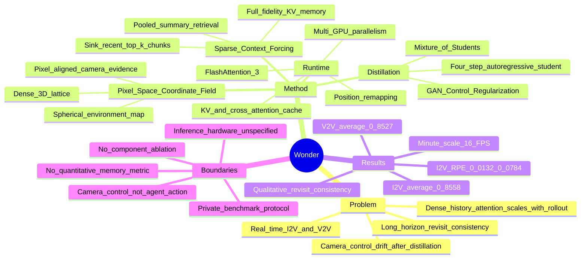

## Summary

Wonder 在 Wan2.1-I2V-14B 上联合改造 camera conditioning、sparse memory、autoregressive distillation 与 streaming runtime，把 image-conditioned exploration 和 video re-shotting 纳入同一个 camera-controllable video world model。作者报告 minute-scale generation 达到 16 FPS，并在自建 I2V/V2V benchmarks 上取得最高 average visual score 与最低 camera RPE。这里的 “general-purpose” 仅覆盖多种视觉域中的 image/video-conditioned camera exploration；当前 v1 没有 component-level quantitative ablation、公开 benchmark release URL 或定量 long-term memory metric，不能据此外推到通用 action-conditioned simulation、物理一致性或 decision support。

## Problem & Motivation

Interactive video world model 需要同时满足三个彼此冲突的条件：准确响应 camera trajectory、在长期探索和 revisit 中保持空间与外观一致、以足够低的延迟持续生成。固定长度的 bidirectional video diffusion model 通常控制准确但计算昂贵；causal distillation 可以提高速度，却容易损失控制精度、生成多样性与长期记忆；对全部历史 KV states 做 dense attention 又会让每步成本随 rollout 增长。

Wonder 的核心问题因而不是单独优化视频质量，而是进行 system-level co-design：让 camera signal 在 distillation 后仍可辨识，让有限 active attention 找回远端历史，并让 few-step student 在长期自回归生成中维持 teacher 的能力。

需要注意其任务定义。模型的输入是单张图像或已有视频，交互信号是 camera trajectory；它没有显式 world state、规则、agent action、reward 或任务成功判定。因此，“playable world”更接近可实时导航或 re-shot 的视觉环境，而不是能够验证行动后果的通用 simulator。

## Method

### 1. Training data

I2V 数据以 DL3DV 等真实导航视频为基础，并加入 Unreal Engine 渲染数据以覆盖 sharp turn、横移、后退和复合 camera actions。V2V 需要同一动态场景在不同 camera trajectory 下的 paired videos，论文除使用 MultiCamVideo、CamXTime 外，还用 Blender 渲染 standard paired trajectories、speed-varied sequences 与 bullet-time videos。

数据处理包含 5/10/20 秒多时长切分、collision 与质量过滤、VLM hierarchical captions、Depth Anything 3 camera pose estimation、Gaussian pose smoothing、reverse playback 和 speed resampling。论文没有报告最终训练集的样本总量，限制了 data scale 与方法贡献的拆分判断。

### 2. Pixel-Space Coordinate Field

Wonder 不只把 camera extrinsics 或 Plücker rays 投影成抽象 embedding，也不依赖从输入重建的 point cloud。它在一个 synthetic camera space 中放置 dense 3D lattice scaffold 与 spherical environment map，再沿目标 camera trajectory 渲染 pixel-aligned conditioning video：

- lattice deformation 和 parallax 表示 metric translation；
- environment map 的外观变化表示 camera rotation；
- synthetic scaffold 不依赖输入中已观察到的几何，因此 camera 移出原视野后仍可提供条件；
- OpenGL renderer 被报告可在 150 FPS 生成 conditioning frames。

这些 frames 经 VAE 编码后，与 noisy target latents 在 channel 维拼接。该表示的动机很直接：把抽象 camera geometry 转成视频模型容易消费的 visual evidence，但论文没有用独立 ablation 定量隔离 lattice、environment map 或 pixel alignment 各自的贡献。

### 3. Unified teacher 与 multi-horizon training

基础模型是 Wan2.1-I2V-14B。Wonder 将输入统一为 optional clean source segment 加 target segment：V2V 使用 source video latents，I2V 则把 target 的首帧作为 clean anchor；camera-condition latents 只施加于 target trajectory。

训练从 5 秒 I2V+V2V 开始，逐步扩展到 10 秒和 20 秒，并用 YaRN 外推 RoPE positions。由于长时 V2V 同时包含 source 与 target、成本更高，后续大多数 iteration 让 I2V 使用当前长 horizon，而 V2V 仍保持 5 秒，仅在部分 iteration 中使用 full-horizon multi-task samples。

### 4. Sparse Context Forcing

Wonder 把 memory storage 与 active attention 分开。历史 chunks 保留 full-resolution KV states，同时各自保存 pooled key summary；当前 query summary 与历史 summaries 比较后，active set 由 initial sink chunk、最近 `r=2` chunks 和 top-k middle-history chunks 组成。被选中的 chunks 仍使用 full-resolution keys/values，因而 active attention size 在固定 top-k 下不随 rollout length 增长。

Sparse retrieval 不能直接在 DMD 阶段稳定学成，因此作者在 ODE initialization 中加入 Sparse Context Forcing：保留 self-attention、first-frame anchors 和 recent context 等 required edges，并随机丢弃 non-local optional edges，使 student 在训练时经历与 inference 相似的不完整历史条件。

这里的 “sparse” 主要约束 active attention compute，不等于全部 memory footprint 恒定。论文一方面称 full historical KV cache 被保留，另一方面在 runtime 中使用 `[sink chunks, top-k chunks, recent context chunks]` 的 rolling/sliding-window cache；完整历史的存储、迁移或淘汰策略尚未被清楚量化。

### 5. Few-step autoregressive distillation

Teacher 先通过四个 denoising timesteps 的 ODE trajectories 初始化 causal student，再在 student 自己的 autoregressive rollouts 上进行 DMD，以缩小 train–inference gap。

Wonder 对 self-forcing pipeline 增加两个组件：

- **Mixture of Students**：四步 sampler 使用三个 14B generators，`G1` 负责 coarse structure、`G2` 负责 structure refinement、`G3` 负责最后两步 detail refinement；三者复用 `G3` 产生的 streaming KV cache。
- **GAN Control Regularization**：把 ground-truth latent 与 student rollout latent 加入高噪声后送入 frozen camera-conditioned teacher，以中间层相对第一层的 low-frequency feature differences 训练 control discriminator，监督长期 camera fidelity。

论文声称两者分别缓解 mode shrinkage 与 camera drift，但没有报告移除任一组件后的 quantitative result，因此机制归因仍主要来自方法设计与 qualitative observation。

### 6. Runtime

Runtime 使用 compiled GPU kernels、CUDA graph replay、self-attention KV cache、text cross-attention cache、FlashAttention-3、fused QKV、BF16 RMSNorm、cached RoPE 与 multi-GPU sequence/tensor parallelism。为把 20 秒训练 horizon 外推到分钟级，active KV cache 组织成 `[sink chunks, top-k chunks, recent context chunks]`，并按相对距离把 frame indices remap 回训练 positional range。

训练一个 bidirectional teacher 和三个 14B students 使用 32 NVIDIA H200 GPUs、global batch size 64。论文没有给出 16 FPS 对应的 inference GPU 数、分辨率、端到端 latency breakdown 或与 baseline 的 matched-hardware throughput comparison。

## Key Results

### I2V benchmark

作者构建了包含 1,000 张 open-source images 的 benchmark，覆盖真实照片、AI-generated images、cartoons、artistic images 与 gaming scenes。每张图像配五条不同 translation scale 和 rotation speed 的 camera trajectories。

Visual quality 使用五项 VBench metrics：imaging、aesthetic、dynamic、motion smoothness 与 flickering；camera following 使用 Depth Anything 3 和 ViPE 估计 pose，经过 Umeyama alignment 后计算 translational/rotational RPE。

Table 1 中：

- Wonder average visual score 为 **0.8558**，高于五个 streaming baselines；
- translational RPE 为 **0.0132**，最低 baseline 值为 **0.0174**；
- rotational RPE 为 **0.0784**，最低 baseline 值为 **0.1155**；
- Wonder 并非每个视觉维度都最好：aesthetic、motion smoothness 和 flickering 均有 baseline 更高。

因此最稳妥的结论是 Wonder 在作者自建 protocol 下取得最佳 overall quality/control trade-off，而不是所有视觉属性全面领先。

### V2V benchmark

V2V benchmark 包含 500 个带 human、animal 或 vehicle 等动态主体的视频，每个视频配六条 camera trajectories，分为 retreat、follow 与 free 三类。Table 1 只比较 Inspatio-World；作者称它是报告发布时唯一支持 long-horizon V2V world modeling 的 open-source baseline。

- Average visual score：Wonder **0.8527**，Inspatio-World **0.8374**；
- Translational RPE：Wonder **0.0187**，Inspatio-World **0.0436**；
- Rotational RPE：Wonder **0.1119**，Inspatio-World **0.2470**。

结果支持 Wonder 在这一自建 benchmark 上优于所选 baseline，但单 baseline、未公开 benchmark release URL、排除 short-horizon re-shotting models，使结论的外部可比性有限。

### Speed 与 long-horizon consistency

作者多处报告 Wonder 以 **16 FPS** 生成 minute-scale rollouts，并称 sparse active attention 使 latency 不随历史增长。该数字在正文中没有配套 throughput table、inference GPU count、分辨率或 baseline speed comparison，因此只能记录为作者报告的 system-level result，不能视作硬件无关的模型速度。

Long-term revisit 的主要证据来自 Figure 9：camera 先观察目标区域、离开，再回到同一位置，对比两帧是否保持结构与外观。论文没有 dedicated quantitative memory metric，也没有 dense/sliding-window/sparse-memory ablation；因此 “coherent long-term memory” 目前主要由 qualitative cases 支持。

### Ablation 边界

当前 21-page arXiv v1 只有 Table 1 的 benchmark comparison，没有 isolating Pixel-Space Coordinate Field、Sparse Context Forcing、Mixture of Students 或 GAN Control Regularization 的 quantitative ablation。由此无法判断性能提升来自单一组件、训练数据、base model post-training、distillation recipe 还是 runtime stack，也不能量化 full-fidelity sparse memory 相对压缩或 sliding-window memory 的收益。

## Evidence Ledger

| Claim ID | Claim | Type | Source locator | Evidence excerpt | Status |
|:--|:--|:--|:--|:--|:--|
| C1 | 论文把 Wonder 称为面向 image/video-conditioned、real-time camera exploration 的 “general-purpose video world model” | sota-novelty | Abstract，PDF p.1 | “a general-purpose video world model for real-time, camera-controllable world exploration” | source-verified |
| C2 | 作者报告 minute-scale generation 达到 16 FPS，且 latency 不随 history 增长 | number | §1，PDF p.2；§4.3，PDF p.12 | “minute-scale rollouts at 16 FPS with stable latency as the history grows” | source-verified |
| C3 | Camera condition 使用 dense lattice 与 spherical environment map 构成的 Pixel-Space Coordinate Field，renderer 为 150 FPS | causal-mechanism | §4.1.1、Fig.4，PDF pp.6–7 | “a colored spherical environment map at infinity and a dense 3D lattice scaffold” | source-verified |
| C4 | Sparse memory 保留 full-fidelity historical KV，并用 pooled summaries 选择 constant-size active set；`r=2` | causal-mechanism | §4.2.1、Eq.2，PDF pp.8–9 | “retains the growing historical KV cache in full fidelity” | source-verified |
| C5 | I2V benchmark 包含 1,000 张图像、每张五条 trajectory，并用 VBench 与 DA3/ViPE RPE 评测 | benchmark-setting | §5.1，PDF pp.12,15 | “1,000 diverse open-source images”; “paired with five camera trajectories” | source-verified |
| C6 | I2V 中 Wonder 的 average score 为 0.8558，translation/rotation RPE 为 0.0132/0.0784，均为表中最佳 overall 结果 | comparison | Table 1、§5.1，PDF p.15 | “Wonder 0.8558 ... 0.0132 0.0784” | source-verified |
| C7 | V2V benchmark 包含 500 个动态视频、每个六条 retreat/follow/free trajectories；只纳入 Inspatio-World baseline | benchmark-setting | §5.2，PDF p.16 | “we construct a video-to-video benchmark with 500 videos” | source-verified |
| C8 | V2V 中 Wonder 为 0.8527 与 0.0187/0.1119，Inspatio-World 为 0.8374 与 0.0436/0.2470 | comparison | Table 1、§5.2，PDF pp.15–16 | “Wonder 0.8527 ... 0.0187 0.1119” | source-verified |
| C9 | 训练包含三个 14B students、20 秒 horizon，在 32 H200 上使用 global batch size 64 | number | §4.4，PDF p.12 | “global batch size of 64 on 32 NVIDIA H200 GPUs” | source-verified |
| C10 | 当前 21-page v1 没有 component-level quantitative ablation，唯一 numbered table 是 Table 1 | benchmark-setting | 全文结构检查；Table 1，PDF p.15 | “Table 1 Comparison on visual quality and action accuracy.” | source-verified |
| C11 | Long-term revisit memory 只有 Figure 9 qualitative comparison，没有 dedicated quantitative metric 或 ablation | benchmark-setting | §5.1、Fig.9，PDF pp.15–16；全文 metric 检查 | “We evaluate the memory capability of each model with a revisit trajectory.” | source-verified |
| C12 | I2V/V2V 结果来自作者自建 benchmarks，论文没有陈述 benchmark release URL | benchmark-setting | §5.1–5.2，PDF pp.12,15–16；全文 URL 检查 | “We construct a general image-to-video world-modeling benchmark” | source-verified |
| C13 | Minute-scale inference 使用 sink/top-k/recent cache，并把 frame indices remap 回 training horizon | causal-mechanism | §4.3，PDF p.12 | “organized as a concatenation of [sink chunks, top-k chunks, recent context chunks]” | source-verified |

## Strengths & Weaknesses

### Strengths

1. **把控制、记忆与 distillation 当作耦合系统处理。** Camera condition 如果在 teacher 阶段有效但无法穿过 few-step distillation，就没有 streaming 价值；Wonder 从条件表示开始处理这个接口问题，system formulation 比单点模块更完整。
2. **Pixel-Space Coordinate Field 简单且任务对齐。** 用 synthetic rendering 把 translation、rotation 与 parallax 变成 frame-aligned visual cues，绕开 abstract pose embedding 的学习负担，也不受 input point cloud 视野覆盖限制。
3. **Sparse memory 的 compute/storage 分解有价值。** 既不压缩被选中的 full-resolution KV，也不让 active attention 随 history 线性增长，适合 revisit-driven interactive generation。
4. **I2V/V2V 统一。** 同一模型既能从 image 探索 unseen regions，也能保留 source-video dynamics 做 camera re-shotting，后者比静态 world navigation 更接近 4D content creation。
5. **Benchmark 同时报告视觉质量和 camera RPE。** 这避免只靠 FVD/VBench 评价“看起来好看”却不响应 control 的 world model。

### Weaknesses

1. **没有 quantitative ablation。** 四个核心贡献与 data recipe、Wan2.1 post-training、runtime optimization 全部耦合，无法确认哪个设计真正必要，也无法验证 “substantially improves” 等 mechanism attribution。
2. **16 FPS 缺少可比条件。** Inference GPU count、输出分辨率、batching、latency distribution 与 matched-hardware baseline 均未报告；训练则需要 32 H200 和三个 14B students，成本很高。
3. **Long-term memory 证据过弱。** Figure 9 只展示少量 revisit cases，没有 dedicated benchmark、不同间隔长度曲线、动态主体 exit–reentry metric 或 sparse-vs-dense/sliding-window comparison。
4. **Sparse attention 不代表 bounded total memory。** Full historical KV storage 会随 rollout 增长；论文没有量化 storage footprint、host/device transfer 或超长 rollout 下的 memory ceiling。
5. **Benchmark 为作者自建且未给 release URL。** I2V 有五个 baselines，但 V2V 只有 Inspatio-World；RPE 又依赖 DA3/ViPE pose estimation 与 alignment，可能继承 estimator bias。
6. **“General-purpose” 边界较窄。** Wonder 控制 camera，而非 agent action；没有显式 state、规则、物理约束、reward 或 downstream decision evaluation。它证明的是 broad visual-domain camera exploration，不是通用 world simulation。
7. **超训练 horizon 依赖位置 remapping。** 从 20 秒训练扩展到分钟级依赖 rolling cache 与 positional remapping；正文没有随时长增长的 quality/control/memory curves，难以判断何时开始 drift。
8. **复现资产不完整。** 论文给出 project page，但没有在正文中声明 code、weights、training data 或 benchmark 的公开地址。

总体判断：rating=4。Wonder 的价值在于把 camera evidence、retrieval memory 与 few-step streaming distillation 组合成一个清晰的实时 video-world-model stack，并在 I2V/V2V 上给出一致的控制指标；但缺少 ablation、公开 benchmark 与硬件归一化 speed evidence，使它目前更像强力 frontier system report，而不是已被充分拆解和验证的通用范式。

## Mind Map

## Notes

- **与 [[2603-HybridMemory]] 的关系**：两者都用 retrieval 处理 video world model 的远端历史，但 HybridMemory 专门测动态主体 exit–reentry；Wonder 的 memory evidence 主要是静态区域 revisit。将 Wonder 的 full-fidelity sparse KV 用 HM-World protocol 测试，会比 Figure 9 更能说明动态长期一致性。
- **与 [[2408-GameNGen]] 的关系**：GameNGen 证明 action-conditioned diffusion 可达到实时 game simulation；Wonder 把控制接口改为 camera trajectory，并把关注点从短 context 的 autoregressive stability 扩到 sparse long-term visual memory。
- **与 [[2607-PixelsToStates]] 的张力**：PixelsToStates 认为 interactive world model 的关键是 explicit state、rule-driven transition、persistent consequences 与正确 outcome timing；Wonder 仍把这些全部隐含在 pixels 中，因此更接近 navigable renderer，而非 game engine。
- **对 WorldModel Survey 的增量**：值得并入 `Pixel-space Video Diffusion WM` 路线的不是笼统的 16 FPS headline，而是 `rendered camera evidence + full-fidelity sparse KV retrieval + sparse-context-aware distillation` 这一 co-design pattern。
- **最关键的后续实验**：在相同 data、base checkpoint、denoising steps 与 runtime 下，分别移除 lattice/environment map、Sparse Context Forcing、Mixture of Students 与 GAN Control Regularization；同时报告 VBench、camera RPE、revisit consistency、latency 和 total KV memory 随 rollout length 的曲线。
- **General-purpose gate**：只有在增加 agent action/intervention、显式或可验证 state transition、physics/causal outcome evaluation，并证明 rollout 对 downstream decision 有用后，才应把结论从 “general visual camera exploration” 提升为 general-purpose world model。
- **验证边界**：本笔记的 `source-checked` 表示 13 条高风险 claims 已由独立 verifier 在 primary source 中定位，不表示实验被独立复现。
