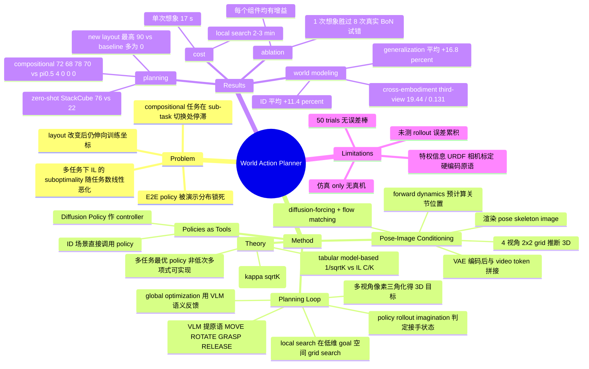

## Summary

World Action Planner (WAP) 把 VLM agent 与一个 pose-image conditioned 的 action-conditioned world model 组合成 propose → optimize → search 的规划回路，并把 imitation learning policy 降级为可被调用的工具而非端到端决策者。在 LIBERO / Robosuite 的 compositional task、new layout、zero-shot 三类泛化设定共 12 个任务上，WAP 大幅超过 π0.5、cosmos-policy 等端到端 baseline（后者在多数任务上成功率为 0）。全部评测在仿真中完成，论文明确说明无真机实验。

## Problem & Motivation

端到端 imitation learning policy（VLA / WAM）的能力边界被 demonstration 分布锁死，作者指出两个具体失效模式：(1) 只在单个 pick-and-place atomic trajectory 上训练的 policy，在需要连续执行两个 sub-task 的 compositional 任务中，完成第一段后会停在近 no-op 动作上，因为"从 sub-task 1 终态导航到 sub-task 2 初态"这段轨迹在演示里根本不存在；(2) policy 会过拟合演示中的 spurious motion pattern，物体位置改变后仍然伸向训练集里的坐标。

作者由此拒绝 E2E 范式，转向经典机器人学的 program/abstraction 思路：foundation model 会生成高层 plan 但缺乏物理因果理解，因此需要一个 action-conditioned world model 把高层推理和物理执行之间的鸿沟补上。论文进一步在理论上论证：多任务设定下 model-based planning 的 suboptimality 优于 imitation learning。

## Method

### Pose-Image Conditioning

先前 robot world model 用 AdaLN-Zero modulation（WPE、IRASim）或 cross-attention（Ctrl-World）注入低维 action 向量，作者认为这类 conditioning 对新动作泛化差。WAP 改为：

1. 用机器人 forward dynamics（MuJoCo / PyBullet / Pinocchio + URDF/MJCF）**预计算**未来关节位置；
2. 把关节位置从对应相机视角渲染成 **pose skeleton image**；
3. 用 video model 的 VAE 编码 pose image，与 video token 拼成统一序列（共享 position embedding，只对 frame token 算 flow-matching loss）；
4. 多视角：4 路相机拼成 2×2 grid（每路 224px），使模型能从多视角推断关节的 3D 位置；
5. 训练用 diffusion-forcing + flow matching，history token 加独立随机噪声（0.5 概率保留 clean history）、future token 加均匀噪声、pose-image token 保持无噪。

backbone 为 Wan-T2V-1.3B，21 帧 history（7 FPS 稀疏采样）预测 20 帧 future（20 FPS），推理 20 步去噪。作者在 Appendix C.1.1 **主动承认** forward dynamics 算出的 pose 是不准的：夹爪闭合指令下如果物体卡在爪间，pose image 仍画成闭合；抓持物体或碰撞时的反作用力也无法模拟。他们的立场是 pose image 不是精确物理预测，而是 action → visual prompt 的映射。

### World Action Planner（Alg. 1）

循环四步：

- **Agent Action Proposal**：VLM（默认 Gemini 3.0 Flash）产出 `MOVE` / `ROTATE` / `GRASP` / `RELEASE` 原语；`MOVE` 的目标位置由 VLM 在多视角图像上指出 2D 像素，再三角化成 3D，从而不需要深度。低层 controller 是一个 UNet backbone 的 Diffusion Policy，输入当前与目标 7 维 end-effector pose，输出 action chunk（长度 40 / 20 两个变体）。
- **Global Optimization Guided by Agent Feedback**：用 world model 想象该轨迹，让 VLM 判断是否安全/对齐目标，返回**方向性**修正（不要求精确坐标），修正尺度 0.06。
- **Local Search with Agent Ranking**：在**低维 goal 空间**（而非逐步 action 空间）做 grid search，候选集 {(x,y), (x±δ,y), (x,y±δ)}，δ=0.02（StackCube）/ 0.05（其他，约为物体尺寸一半）；需要改姿态时搜 yaw ∈ {ψ, ψ±45°}。对每个候选做 world model 想象，VLM 排序选优。可选地再把 diffusion policy 的 rollout 也在 world model 里想象一遍（`WM(ŝ_i, π(ŝ_i))`），用来判断哪个状态是 policy 能接手完成抓取的 in-distribution 起点。
- **Execute**：执行选中的 action（若使用 policy，则接着 rollout policy）。

### Policies as Tools

框架把已有 imitation policy（Diffusion Policy / VLA / WAM）当作模块化工具：in-distribution 且有演示的场景直接调用生成式 policy，OOD 场景才走完整 model-based planning。

### 理论

在 contextual MDP 框架下（共享 dynamics ℙ、任务相关 reward r_c）：

- **Theorem 1**（tabular，reward 已知）：存在 model-based 算法，K 个 episode 后对任意任务给出 Õ(1/√K) suboptimality gap；同时存在 contextual MDP 实例，使 imitation learning agent 跨任务平均 gap 至少 Ω(|𝒞|/K)。
- **Theorem 2**（linear MDP + 已知任务表示 ψ(c)）：model-based 达到 Õ(1/(κ√K))。
- **Theorem 3**：单任务下最优 policy 有线性结构，IL 可达 Õ(1/K)；但多任务下存在实例，使最优 policy 无法被任何关于 ψ(c) 的 n ≤ |𝒜| 次多项式 f 实现。

## Key Results

### 1. Action-conditioned world modeling（PSNR↑ / LPIPS↓）

Table 1（single-embodiment，全部 baseline 用同一 Wan-T2V-1.3B backbone、同相机配置与帧调度，但训练 20K steps，是 WAP 的 10K steps 的两倍）：

| 数据集 | 第二名 baseline（wrist / third） | Ours（wrist / third） |
|:--|:--|:--|
| LIBERO-90（ID） | Ctrl-World pos. 15.56 / 0.317；20.13 / 0.108 | 17.02 / 0.286；23.13 / 0.085 |
| DexMimicGen（ID） | Ctrl-World vel. 15.56 / 0.276；19.19 / 0.135 | 16.33 / 0.266；21.18 / 0.112 |
| LIBERO-Long（zero-shot） | Ctrl-World vel. 14.63 / 0.345；18.26 / 0.139 | 15.98 / 0.320；22.14 / 0.093 |
| LIBERO-Spatial（zero-shot） | Ctrl-World vel. 15.50 / 0.361；19.76 / 0.137 | 16.75 / 0.322；22.79 / 0.097 |
| MimicGen-Robot（few-shot 新本体） | Ctrl-World pos. 16.82 / 0.169；17.44 / 0.126 | 18.02 / 0.144；21.40 / 0.095 |

论文汇总为 in-distribution 平均相对提升 11.4%、generalization 设定 16.8%。

Table 2（cross-embodiment，RoboCasa + MimicGen + DexMimicGen 混合，动作维度 7/12/14/24）：Ours 15.11 / 0.308（wrist）、19.44 / 0.131（third），优于 unified action space（14.60 / 0.323；17.80 / 0.164）、embodiment-aware encoder（14.68 / 0.321；17.52 / 0.168）、soft prompt（14.66 / 0.323；17.83 / 0.162）。

Table 6：history 用 7 FPS 稀疏采样优于 20 FPS 稠密采样（LIBERO-Long 15.98 / 0.320 vs 15.68 / 0.326）。

### 2. Compositional task generalization（LIBERO-Long 4 任务，每任务 50 trials，成功率 %）

| 方法 | soup+tomato | white mug+y&w mug | white mug+pudding | soup+cream cheese |
|:--|:--|:--|:--|:--|
| π0.5 | 4 | 0 | 0 | 0 |
| cosmos-policy | 0 | 0 | 0 | 0 |
| SAILOR | 18 | 0 | 8 | 2 |
| GPC-RANK | 10 | 0 | 0 | 0 |
| Vision-language planner | 56 | 28 | 46 | 32 |
| **World Action Planner** | **72** | **68** | **78** | **70** |

baseline 并非训练不足：π0.5 在 LIBERO-90 上 in-domain 成功率 95.8%（40k steps，官方 JAX 实现），cosmos-policy 93%（30k steps，action L1 = 0.025）。Table 8 显示 π0.5 在 LIBERO-Long 上唯一高分（90%）的任务恰好在 LIBERO-90 里有近乎相同的对应任务。

### 3. New layout generalization（LIBERO-Object 6 任务，测试时移动 target 与 distractor）

| 方法 | soup | cream cheese | salad dressing | ketchup | milk | pudding |
|:--|:--|:--|:--|:--|:--|:--|
| π0.5 | 0 | 0 | 0 | 0 | 0 | 10 |
| cosmos-policy | 0 | 0 | 0 | 0 | 0 | 0 |
| SAILOR | 0 | 0 | 0 | 0 | 0 | 22 |
| GPC-RANK | 0 | 0 | 0 | 0 | 0 | 16 |
| Vision-language planner | 30 | 50 | 32 | 16 | 34 | 64 |
| **World Action Planner** | **88** | **86** | **90** | **66** | **84** | **78** |

数据设定不对称但方向对 WAP 不利：WAP 的 diffusion policy 每任务只用 **5 条**演示微调（world model 额外加 10 条噪声扰动轨迹），baseline 用官方 checkpoint / 全量 >40 条演示。

### 4. Zero-shot generalization（Robosuite，无专用 policy、无专家演示）

| 方法 | PickPlaceCan | StackCube |
|:--|:--|:--|
| Vision-language planner | 58 | 22 |
| **World Action Planner** | **80** | **76** |

设定细节：world model 从 LIBERO-90 模型出发、在 VLM 提出动作产生的 **50 条 exploratory trajectory** 上微调 10 epoch；`GRASP` / `RELEASE` 动作序列硬编码。

### 5. Ablation

Table 9（compositional 四任务）：Vision-language planner 56/28/46/32 → +global optimization 64/40/70/48 → +local search 64/54/72/66 → +policy rollout imagination 72/68/78/70。

Table 10（PnP ketchup，与 Best-of-N VLM sampling 对比；BoN 用**环境真实 reward**作为上界）：BoN-1/2/4/8 = 16/24/36/42（imagination 数 0/2/4/8），global optimization = 60（imagination 数 1）。

Table 11（StackCube）：BoN-1/2/4/8/10 = 22/28/32/50/62（imagination 数 0/2/4/8/10），local search = 70（imagination 数 6）。

### 6. 推理开销（Appendix E）

H100 训练单步约 4.8 s（bs=2）；A100 推理单次 forward 0.85 s，20 步去噪预测 20 帧约 17 s；global optimization 含 VLM 推理约 30 s；local search 2–3 min。作者强调系统并非每个控制步都重规划：compositional 设定下仅在 sub-task 切换时调用一次，其他任务在抓取与放置两个时刻各调用一次。

## Evidence Ledger

| Claim ID | Claim | Type | Source locator | Evidence excerpt | Status |
|:--|:--|:--|:--|:--|:--|
| C1 | LIBERO-90 上 Ours 达 17.02 PSNR / 0.286 LPIPS（wrist）、23.13 / 0.085（third） | number | Table 1 | "Ours 17.02 / 0.286 … 23.13 / 0.085" | source-verified |
| C2 | 平均相对提升 in-distribution 11.4%、generalization 16.8% | number | Table 1 caption / §5.1 | "an average of 11.4% improvement for in-distribution data and 16.8% improvement in generalization settings" | source-verified |
| C3 | 所有 world-model baseline 用同一 Wan-T2V-1.3B backbone、相机配置与帧调度，但训练 20K steps（WAP 为 10K） | benchmark-setting | §5.1 Baselines | "trained for 20K steps (twice our method's duration) to ensure a competitive comparison" | source-verified |
| C4 | cross-embodiment 混合数据上 Ours third-view 19.44 / 0.131，优于最好 baseline soft prompt 17.83 / 0.162 | comparison | Table 2 | "Ours 15.11 / 0.308  19.44 / 0.131" | source-verified |
| C5 | compositional 四任务 WAP 成功率 72 / 68 / 78 / 70 | number | Table 3 | "World action planner 72 68 78 70" | source-verified |
| C6 | 同四任务 π0.5 为 4/0/0/0、cosmos-policy 全为 0 | number | Table 3 | "π0.5 4 0 0 0；cosmos-policy 0 0 0 0" | source-verified |
| C7 | new layout 六任务 WAP 88/86/90/66/84/78，vision-language planner 30/50/32/16/34/64 | comparison | Table 4 | "World action planner 88 86 90 66 84 78" | source-verified |
| C8 | π0.5 在 LIBERO-90 in-domain 成功率 95.8%，cosmos-policy 93% | number | Appendix D.2.1 | "achieving an average in-domain success rate of 95.8% on the LIBERO-90 tasks" | source-verified |
| C9 | zero-shot 设定 PickPlaceCan 80 vs 58、StackCube 76 vs 22 | number | Table 5 | "World action planner 80 76" | source-verified |
| C10 | layout 实验中 WAP policy 仅用 5 条演示/任务，baseline 用全量 >40 条 | benchmark-setting | §5.2.2 | "we train our policy using only 5 expert demonstrations per task, whereas baselines utilize the full dataset of over 40 demonstrations" | source-verified |
| C11 | 组件消融阶梯 56/28/46/32 → 64/40/70/48 → 64/54/72/66 → 72/68/78/70 | number | Table 9 | "+ Global action optimization 64 40 70 48" | source-verified |
| C12 | PnP ketchup 上 global optimization 用 1 次 imagination 达 60%，BoN-8 用 8 次仅 42%；且 BoN 使用环境真实 reward | comparison | Table 10 + §D.2.4 | "for best-of-N sampling we use ground-truth rewards by executing the actions in the environment" | source-verified |
| C13 | StackCube 上 local search 用 6 次 imagination 达 70%，BoN-10 用 10 次为 62% | number | Table 11 | "Success % 22 28 32 50 62 70" | source-verified |
| C14 | A100 单次 forward 0.85 s，20 帧想象约 17 s，global optimization 约 30 s，local search 2–3 min | number | Appendix E | "one single forward takes 0.85 seconds … the local search can take 2 to 3 minutes" | source-verified |
| C15 | Theorem 1：model-based 达 Õ(1/√K)；存在实例使 IL 跨任务平均 gap ≥ Ω(\|𝒞\|/K) | causal-mechanism | Theorem 1, §4.1 | "outputs a policy with Õ(1/√K) suboptimality gap for any task c … at least Ω(\|𝒞\|/K)" | source-verified |
| C16 | Theorem 3：多任务下最优 policy 无法被任何关于 ψ(c) 的 n ≤ \|𝒜\| 次多项式实现 | causal-mechanism | Theorem 3, §4.2 | "cannot be realized by any function f that is an n-degree polynomial in the feature ψ(c) with n ≤ \|𝒜\|" | source-verified |
| C17 | 论文自承 forward dynamics 渲染的 pose image 在接触情形下不准（夹爪被物体阻挡时仍画成闭合） | causal-mechanism | Appendix C.1.1, Fig. 6 | "a physical object may prevent a gripper from fully closing … but the computed pose image will depict the gripper as closed" | source-verified |
| C18 | 全部评测在仿真中进行，共 12 个任务、每任务 50 trials，VLM 为 Gemini 3.0 Flash；无真机实验 | benchmark-setting | §5.2 Setup + §6 | "A primary limitation is that our evaluations are conducted in simulation, while real robot experiments are left to future work" | source-verified |
| C19 | zero-shot 设定下 world model 在 50 条 exploratory trajectory 上微调，且 GRASP/RELEASE 序列硬编码 | benchmark-setting | §5.2.3 + Appendix D.2.3 | "We finetune the world model from Sec. 5.2.1 on 50 exploratory trajectories"；"we hard code the GRASP and RELEASE action sequence" | source-verified |
| C20 | world model 配置：Wan-T2V-1.3B，21 帧 7 FPS history → 20 帧 20 FPS future，4 视角 2×2 grid 每路 224px，推理 20 步去噪 | benchmark-setting | §5.1 Setup | "Models process 21 history frames at 7 FPS to predict 20 future frames at 20 FPS" | source-verified |
| C21 | 论文未做 imagination horizon 扫描，也未测误差累积：全部 11 张表与 17 张图中无随想象帧数变化的质量/成功率曲线，horizon 全程固定为 20 预测帧 | benchmark-setting | 全文负性核查（Tables 1-11, Figures 1-17） | Table 1 caption "metrics averaged across the predicted frames"；唯一的 world-model 消融是 history FPS 20 vs 7（Table 6） | source-verified |
| C22 | cross-embodiment 只报 world modeling 的 PSNR/LPIPS，未报任何 cross-embodiment 的规划成功率；全部成功率表（3/4/5/8/9/10/11）都是 Franka-Panda 的 LIBERO/Robosuite 任务 | benchmark-setting | Table 2 + §5.2 Setup（负性核查） | Table 2 header: "Results for cross-embodiment modeling (PSNR↑ / LPIPS↓)"；§5.2 只评 "12 tasks in the LIBERO ... and Robosuite" | source-verified |
| C23 | 论文未声明代码开源；仅在 abstract 末尾给出项目主页 worldactionplanner.github.io | license-code | Abstract；全文负性核查 §1-§6 + Appendix A-E | "Project website at worldactionplanner.github.io"；全文无 GitHub 链接、无 "code will be released" 承诺 | source-verified |
## Strengths & Weaknesses

### 亮点

**把"world model 该放在哪一层"这个问题问对了。** 当前主流是把 video model 当 policy backbone（WAM 路线），本文反过来把 policy 当工具、把 world model 放在 planning 回路里做 verifier/simulator。Table 3、Table 4 里 cosmos-policy 全零而 vision-language planner 已经拿到 28–64 分，这个对比本身就说明：在 layout / composition shift 下，瓶颈不是"能不能预测未来视频"，而是"有没有一个不被演示轨迹锁死的决策结构"。

**Pose-image conditioning 是一个 simple 且有清晰机制解释的设计。** 把 action 从低维向量改写成骨架图像，相当于用 forward kinematics 这个已知的、精确的部分承担"action → 机器人构型"的映射，只把不确定的物体交互留给 video model。这也顺带解决了 cross-embodiment 的接口问题——不同动作维度（7/12/14/24）被统一成同一种视觉表示，Table 2 的 third-view 从 17.83 提到 19.44 是这条路线目前最直接的证据。

**成本对比做得比多数同类工作诚实。** Table 10/11 不只报成功率，还报 imagination 次数，并且给 BoN baseline 用环境**真实** reward（等于让 baseline 真的去环境里试）。在这种对自己不利的设定下 global optimization 仍以 1 次想象胜过 8 次真实试错，说明失效模式是**系统性**的（VLM 反复犯同一个物理错误），而不是采样不够——这是比成功率数字更有信息量的发现。

**Table 9 的消融把"收益来自哪里"分离得比较干净。** 同一个 VLM、同一套 triangulation、同一个 diffusion policy controller，唯一变量是加不加 world model 想象，收益为 +16 / +40 / +32 / +38 分。

### 局限与隐含假设

**（a）"Generalizable" 覆盖面比标题窄。** 三类泛化分别是：已见 atomic task 的**重新组合**（物体、场景均已见）、已见物体的**位置扰动**、Robosuite 上无专家演示但 **world model 仍在该环境内用 50 条轨迹微调过**的任务。三者都没有涉及新物体类别、新场景语义、新指令表述、新本体。cross-embodiment 只在 world modeling 层面用 PSNR/LPIPS 测（Table 2），**没有任何 cross-embodiment 的 planning 成功率**——即"pose image 是 embodiment-agnostic 接口"这个论断，在决策层是未经验证的推测。第三类命名为 "zero-shot" 也偏宽松：无专家演示 ≠ 无环境内数据。

**（b）收益来源没有完全隔离：特权信息不对称。** WAP 相对 π0.5 / cosmos-policy 额外拥有三样东西：机器人 URDF/MJCF 与 forward dynamics（用于渲染 pose image）、多相机标定（用于把 2D 像素三角化成 3D，从而绕开深度）、以及人工设计的原语词表 + 硬编码 GRASP/RELEASE。论文只在 Appendix C.1.1 一笔带过 "privileged information not widely used in previous world model implementations"。因此 Table 3/4 里 "72 vs 0" 的落差不能读作"world model 带来的收益"，而是"带特权信息的模块化系统 vs 端到端 policy"的落差。真正被本文干净隔离的只有 Table 9 的那一部分（vision-language planner → 全系统），即在 compositional 任务上世界模型贡献约 +16~+40 分，而系统分解本身贡献了从 4 到 56 分的更大一段。摘要里 "significantly outperforming SOTA policy models" 的措辞掩盖了这个拆分。

**（c）baseline 大面积为 0 使比较退化。** Table 4 中 5 个 baseline 在 6 个任务上几乎全零。当对照组落在地板上时，得到的是"E2E policy 在此设定下不工作"这一失效模式证据，而不是分级的性能优势证据。SAILOR / GPC-RANK 近零的原因论文也解释清楚了——它们从 policy 采样动作，而 policy 在 sub-task 1 结束后输出近零幅度动作，噪声采样也救不回来。这说明这两个 baseline 在此设定下**结构上不适用**，把它们并列进表格更像是覆盖面展示而非有效对照。

**（d）预算不匹配，且没有 compute-matched 对照。** WAP 单次 global optimization ≈ 30 s、local search 2–3 min，而 π0.5 是近实时闭环。论文的辩护是"只在关键决策点调用 1–2 次"，这是合理的工程论证，但**没有任何一个 baseline 被给予同等的 test-time compute**（例如让 π0.5 多次重采样 + 用同一个 VLM 做 verifier）。Table 10/11 的 BoN 对照只覆盖 VLM 采样这一维，且计数单位是 imagination 次数，未计入 VLM 调用次数与 wall clock。

**（e）rollout 误差累积基本未测。** 想象 horizon 只有 20 帧 @ 20 FPS ≈ **1 秒**，系统靠"只在关键点规划 + 在低维 goal 空间搜索"来回避长程 rollout。论文没有做 horizon 扫描，没有报告想象帧数增加时 PSNR/LPIPS 或规划成功率的衰减曲线。更关键的是：Table 1 的 PSNR/LPIPS 是在**接近演示分布**的留出轨迹上测的，而 planner 实际要评估的是 grid search 产生的 OOD 候选；两者之间没有建立联系。"policy rollout imagination"这一步是 `WM(WM(s, a_i), π(·))` 的两级链式想象，恰恰是误差最容易复合的地方，却只有定性图（Fig. 13）支撑。另外 Appendix C.1.1 自承的接触失真（夹爪闭合、持物、碰撞）正好发生在抓取判定这个最关键的时刻——这与依赖想象来判断"policy 能否从该状态接手抓取"的设计存在直接张力，论文未量化这个矛盾的影响。

**（f）统计强度不足。** 每任务 50 trials，p≈0.5 时二项标准误约 7pp，论文未报种子数与误差棒。Table 9 中 64 → 64（global → +local search，任务 1）、以及 66 vs 70 这类差异都在噪声范围内。

**（g）汇总指标的口径值得商榷。** 11.4% / 16.8% 是把 PSNR 的相对提升与 LPIPS 的相对提升混在一起取算术平均（in-distribution 是 8 个数、generalization 是 12 个数的均值）。PSNR 本身是对数尺度量，报其百分比相对提升不是标准做法，且 LPIPS 的相对提升普遍更大，会把汇总值抬高。

**（h）理论与系统的耦合是松的。** Theorem 1–3 对比的是"能自由探索 K 个 episode 并学 dynamics + reward 的 model-based agent"与"查询专家的 imitation learner"。实际系统既不做 RL 探索，也不学 reward（reward 由 VLM 隐式提供，论文仅以一句"a VLM can be utilized to evaluate the terminal state"衔接）。Theorem 1(ii) 是构造性下界（存在某个实例），不能直接读成"VLA 在实践中必然吃 |𝒞|/K 的亏"。这组定理更像是对设计选择的动机说明，而非对实验结果的解释。

### 对领域的潜在影响

如果 "policies as tools" 这个框架能扩展到真机与新物体，它提供了一条与 scaling demonstration data 正交的泛化路径：不再要求单个 policy 覆盖所有 task composition，而是把组合性交给 planner。反过来，本文最值得警惕的地方也在这里——整套系统依赖 URDF、相机标定、手工原语与仿真器 forward dynamics，这些在真实场景中恰恰是最难获得或最容易失准的部分。论文把真机实验列为 future work，因此目前的证据只支持"在仿真中，模块化 + world model 想象能打穿 E2E policy 的组合泛化失效"这一较窄结论。

## Mind Map

## Notes

**项目主页**：worldactionplanner.github.io（论文摘要末尾给出）。全文（§1–§6 与 Appendix A–E）经独立负性核查确认无 GitHub 链接、无代码开源声明，故 `code` 字段留空——这是核查结果而非待办。License 为 CC BY 4.0。

**核验记录**：23 条高风险 claim 由独立 verifier 逐条定位原文。22 条 source-verified；1 条初稿表述为"代码开源"被判 unsupported，已按原文改写为"仅有项目主页、未声明开源"（见 C23）。局限 (a) 的"无 cross-embodiment 规划成功率"与 (e) 的"未测误差累积"两项均为独立负性核查确认（C21/C22），非推测。

### 与库内笔记的关系

- [[Papers/2602-DreamZero]]（World Action Models are Zero-shot Policies）—— **同一问题的相反解法，且是本文的直接对手方**。DreamZero 主张把 video prediction 与 action generation 耦合进单个 14B WAM，认为"提升机器人能力约等于提升视频生成"；本文的 Related Works 正是把这类工作（Ye et al. 2026）归入 WAM 类别，并在实验中用同门的 cosmos-policy 作为 WAM 代表——后者在 Table 4 的 6 个 layout 任务上全为 0，且 Appendix D.2.2 明确指出其**预测图像视觉上很真实、却仍反复在原坐标处抓空**。两篇合读构成一个清晰的争论：video prior 到底该被 amortize 进 policy 权重，还是保留为可在测试时被搜索/验证的显式模型。注意证据强度不对称——DreamZero 有真机与 OOD 协议，本文只有仿真。
- [[Papers/2607-BadWAM]] —— **独立路径给出同向证据**。BadWAM 的结论是 WAM 可以"梦得合理却执行失败"（imagination 与 action 可解耦），而本文 Fig. 11 从泛化角度观察到几乎同一现象：cosmos-policy 的预测帧真实但不导向成功。两者共同削弱了"检查 imagined future 即可信任 WAM"这一直觉。本文的应对方式（把 imagination 交给外部 VLM 排序，而非让同一模型自己解码 action）恰好可以读作对 BadWAM 所揭示耦合风险的一种结构性规避，但本文并未从安全角度论证这一点，这是我的推断而非论文主张。
- [[Papers/2406-IRASim]] —— **被本文直接用作 baseline**（Table 1 中的 "IRA-Sim"），代表 AdaLN-Zero 注入低维 action 的 conditioning 路线。本文的核心方法论断正是"这类 conditioning 对新动作泛化差"，两篇构成 conditioning 接口上的直接对照。
- [[Papers/2504-Pi05]] —— **被本文用作 VLA baseline**。π0.5 的卖点是 open-world 泛化，但本文 Table 8 显示：它在 LIBERO-90 in-domain 有 95.8%，迁移到 LIBERO-Long 的组合任务后除一个有近似对应任务的场景（90%）外几乎全零。这不是对 π0.5 主张的直接反驳（评测环境、数据规模均不同），但提示"open-world 泛化"在**任务组合**这一维度上可能并未覆盖。
- [[Topics/WorldModel-Survey]] / [[Topics/VLA-Survey]] —— 本文属于 world-model-as-planner 分支，可作为 survey 中"world model 用于 test-time planning 而非 policy backbone"一节的新数据点；其 pose-image conditioning 也可补进 action conditioning 接口的对比。

### 待追问

1. Table 1 的 PSNR/LPIPS 提升与 Table 3–5 的规划成功率之间没有建立定量联系。若把 world model 换成一个更差（但仍可用）的版本，成功率会掉多少？这决定了"pose-image conditioning"与"planning 结构"两项贡献各占多少权重。
2. VLM 在**想象帧**上的排序准确率 vs 在**真实 rollout** 上的排序准确率，差距有多大？这是分离"世界模型保真度"与"VLM 判别力"的关键实验，论文未做。
3. Table 10 中 BoN 拥有环境真实 reward 却只有 42%（N=8）——意味着 8 次真实尝试里成功次数极少。这与 VLM 系统性重复同一物理错误的解释一致，但也暗示 BoN 的采样多样性可能被 temperature 等实现细节限制，论文未给出采样配置。
4. 若把 pose image 换成本文提到的 concurrent work（Jia et al. 2026）的完整渲染机械臂图像，效率/鲁棒性的取舍是多少？论文只做了定性断言（"more computationally efficient and robust"），无实验。
