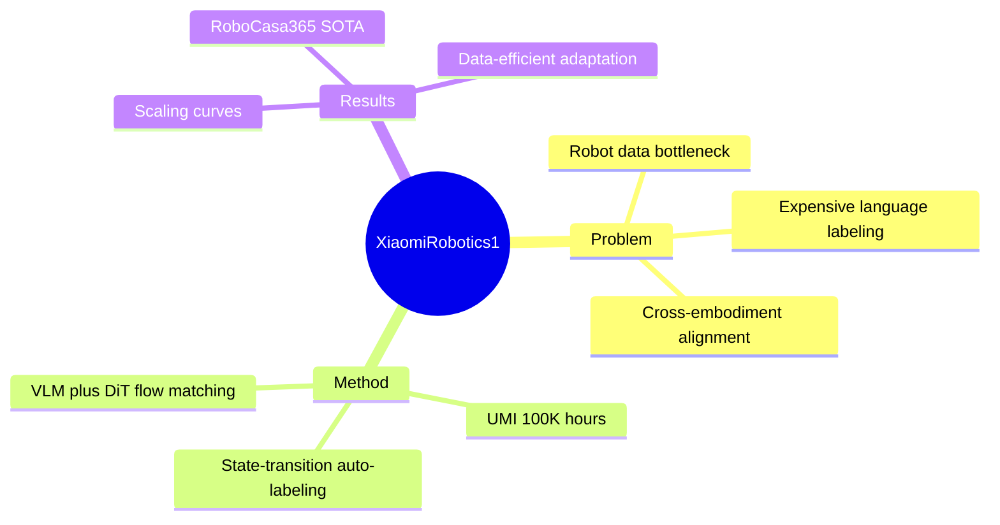

## Summary
Xiaomi-Robotics-1 以 100K+ 小时 UMI real-world trajectories 做 state-transition language pretraining，再用约 10K 小时 cross-embodiment robot data 把能力对齐到 imperative instructions，系统展示 data/model scaling 可转化为 unseen-environment 的 VLA 成功率。

## Problem & Motivation
Robot foundation model 想复用 LLM 的 scaling 路径，却受制于 real-robot teleoperation 慢、昂贵、硬件绑定且任务分布重复。仅扩大 model size 无法补足 interaction data 的规模与多样性，而传统 trajectory segmentation 和语言标注在十万小时级别也不可行。论文因此把 UMI handheld gripper 视为可大规模收集 human manipulation 的接口，并把 pretraining prompt 定义为“当前 scene 到目标 scene 的 state transition description”；之后再解决 UMI-to-robot embodiment gap 与 descriptive-to-imperative language gap。

## Method
模型使用 Mixture-of-Transformers：Qwen3-VL 编码 images 与 language，较窄的 DiT 接收 robot state 和 VLM KV cache，以 flow matching 和 5-step Euler integration 生成 action chunk。VLM 本身还通过 Choice Policies 预测多组 candidate actions 与 scores，用 winner-takes-all auxiliary loss 加速 convergence；这些 action tokens 被排除在 DiT attention 之外，以避免 DiT 直接复制 VLM action shortcut。

Pretraining 数据为 100K+ 小时 UMI egocentric trajectories，覆盖家庭、商业、工业、办公室与户外场景。pipeline 等长切分 clip，用 Qwen3.5-27B 标注 gripper/object 的 state transition，并通过 producer-consumer 并发在约两周内完成 captioning；训练同时 co-train vision-language data 以保留 VLM 能力。Post-training 混合 1K+ 小时人工 instruction-labeled UMI、Bridge V2、RT-1、DROID 与内部 robot data，总量约 10K 小时；不同 embodiment 的 arm action 被统一为当前 end-effector frame 下的 relative delta pose，缺失维度在 loss 中 mask。模型提供 2.6B、5.1B、10.5B 三种规模。

## Key Results
Pretraining data scaling 在相同 5B 模型上把 unseen-environment real-robot overall success 从无 action pretraining 的 26% 提升到完整 20K-hour subset 的 75%；仅 12.5% 数据已达到 53%，50% 到 100% 仍增加 6 个百分点。固定 20K 小时数据时，2B/5B/10B post-trained variants 的 overall success 为 61%/75%/79%，说明 data scale 的边际影响比 billion-scale model size 更明显。

Simulation 中 RoboCasa 平均成功率 74.5%；RoboCasa365 为 57.4%，比 previous best 46.6% 高 10.8 个百分点，Composite-Unseen 为 32.1%。VLABench 平均 SR/PS/IS 为 59.1/70.3/69.9，SR 与 PS 最佳但 intention score 略低于 ERVLA；RoboDojo average score 20.07，对比 prior best 13.07。真实 downstream fine-tuning 涵盖 phone packing、laundry loading、printer refilling、box packing，在低数据设置共 36 小时、每任务不足 10 小时；正文报告 foundation checkpoint 在这些复杂任务上具备更高 data efficiency。

## Strengths & Weaknesses
**Strengths.** 数据规模、自动标注 infrastructure、cross-embodiment action normalization 与系统 benchmark 覆盖形成了少见的完整 scaling evidence。论文不仅比较最终 SOTA，还固定模型或数据分别做 scaling curve，并发现 data 可能是当前更强 bottleneck。state-transition caption 也比粗 task label 提供更局部、与 action dynamics 对齐的条件。

**Weaknesses.** 100K 小时数据、内部 robot data 与自动 caption quality 均无法从论文外独立审计，且模型与 checkpoints 只承诺未来发布；这限制 reproducibility。正式 scaling curve 实际主要使用约 20K 小时 subset，而不是完整 100K+，因此对全规模 compute/data law 的结论仍有限。自动等长 segmentation 可能跨越无关动作或遗漏语义边界，Qwen caption error 也会成为系统性 label noise。RoboDojo 不使用 history，memory dimension 落后；VLABench intention score 并非最佳，说明 action success 与语言意图理解仍未完全对齐。

## Mind Map

## Notes
这篇工作最重要的可验证命题是“data scaling 的收益能跨过 post-training 转化到 unseen real robot”，而不只是 pretraining loss 下降。后续应等待 dataset/model release，重点检查自动 caption 的噪声分布、100K 小时去重与有效 contact ratio，以及 20K 到 100K 的真实 scaling curve。
