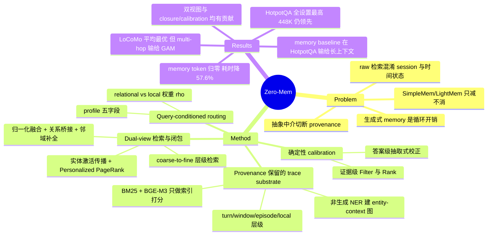

## Summary

Zero-Mem 把 LLM agent memory 的全部操作——构建、组织、路由、检索、证据闭包、以及 reader 前后的两次 calibration——都改成不调用 LLM、不消耗 LLM token 的确定性流程，只在最后一步 QA 调用一次 reader。它不用生成的 abstraction 替换原始 interaction trace，而是在 trace 之上建 entity–context 图与时间层级两个非生成式视图，按 query 决定二者权重后融合检索。在 LoCoMo 与 HotpotQA 上取得最高平均 F1，同时 memory-operation token 降为 0、耗时相对最快 baseline 降低 57.6%。

## Problem & Motivation

现有 agent memory 系统普遍用额外的 LLM 调用来"运营"记忆：summarize/reflect 经验、构造层级抽象与图索引、生成或演化 memory record。这把 memory management 变成一份随交互反复付费的 generative workload。作者指出成本只是表层问题，更关键的是可追溯性——当生成的 abstraction 成为后续检索的中介，被遗漏的细节、被合并的主体、被模糊的时间更新都会削弱证据到原始 interaction 的追溯链。

反方向的策略是保留完整历史、直接从 raw trace 检索。这保住了 source evidence，但 flat lexical 或 dense 检索会混淆来自不同 user、session、时间状态的语义相似 trace，且当支持证据分散在多次交互中时会失效。

近期工作只是削减而非消除这种依赖：SimpleMem 靠语义结构化压缩、在线语义合成与意图感知的检索规划提升 token 效率；LightMem 把若干 memory 操作从大模型移到专用小语言模型，并把在线检索与离线整合解耦。二者都没有把 final QA 变成唯一依赖 LLM 的阶段。于是论文提出问题：能否在保留超越 flat similarity 的结构化访问的前提下，把 final QA 之外的所有 LLM 调用全部删掉？作者把这个操作区间命名为 zero-token memory operations，并明确把 encoder 计算与 final-QA 推理单独计账。

## Method

**1）Provenance-preserving Token-Free Memory Substrate。** 每个派生单元保留原文，外加 source identifier、session time、boundary identifier 等可得元数据，因此检索出的证据始终可回溯到观测到的交互而非模型生成的陈述。

- *Relational trace graph*：用非生成式 NER 模型（论文举例 spaCy）对每个 context unit 抽实体，构 G = (V_d ∪ V_e, E_de ∪ E_dd)。E_de 是实体–context 共现边，权重 w(d_i, e) = c(e, d_i) / Σ_{e′∈ℰ(d_i)} c(e′, d_i)，即实体在该单元内出现频次的归一化；E_dd 是相邻 context unit 之间的邻接边，保留局部连续性。图只记录观测到的共现与 trace 邻接，不生成语义三元组或推断关系。
- *Hierarchical trace units*：𝒯(ℋ) = U_turn ∪ U_window ∪ U_episode ∪ U_local。turn 保原子话语，window 保短程上下文，episode 按语义连续性与可得的时间/session 边界把相邻 window 聚成事件区域，local span 保候选 turn 的直接邻域。
- *访问信号*：BM25 lexical 统计 + BGE-M3 dense embedding。二者只用于索引、seeding 与打分，不生成也不改写 memory 内容。

**2）Query-Conditioned Evidence Routing。** 对每个 query 构造轻量 profile φ(q) = {subject, keywords, answer-type, temporal-cues, boundary}，仅从 query 与可得元数据得到，不使用 gold answer。路由输出 Route(q) ∈ {relational, local}，前者图优先、后者层级优先，判据是确定性的 query 结构信号（问题形式、时间或聚合需求、subject anchor 是否可得）。完整模型中两个 view 都会执行，路由只控制融合时的相对权重：全局共享的 primary-view 权重 ρ 给主视图，1−ρ 给次视图。

**3）Dual-View Evidence Retrieval and Closure。**

- *图侧*：把 query 抽出的实体 ê 与图中最相似的观测实体 e 对齐，初始激活 η₀(e|q) = cos(**e**, **ê**)；沿相关共现句传播 η_{t+1}(e′) = Σ_{e∈ℰ_t} η_t(e) Σ_{z∈Z(e)∩Z(e′)} sim(q, z)，即某实体与已激活实体在与 query 相关的句子中共现越多得分越高。传播后的实体激活与 dense context prior 合成 query-specific reset 向量 **r**_q，做 Personalized PageRank **π**_q = (1−γ)**r**_q + γP^⊤**π**_q，context 节点的 PageRank 值构成图侧排序；最后用精确 lexical 与 phrase 匹配对姓名、日期、数值、标题、引语做 refine。
- *层级侧*：episode → window → turn → local 的 coarse-to-fine 检索。每个单元同时按语义相关性和与 profile 的结构兼容性（subject consistency、temporal validity、boundary consistency、expected answer type、lexical/phrase support）打分，这些信号只用于修正语义排序，不当作独立生成的证据。
- *Closure*：两侧分数先做 query-wise min-max 归一化（缺席某 view 记 0），再按 S_fuse(d) = ρ·Ŝ_primary(d) + (1−ρ)·Ŝ_secondary(d) 融合。融合后保留的主证据 M(q) 再补上图侧的关系/桥接支持 𝒩_g 与层级侧的邻近 turn 或 local span 𝒩_h，去重后得候选集 C(q)；任一支持集可以为空。

**4）Deterministic Evidence Calibration。** 证据级先 Filter 掉违反 provenance 或 query boundary 约束的候选，再按 subject、时间与 answer-type 兼容性 Rank，得到紧凑证据集 R(q)——Rank 只排序不改内容。答案级则在 reader 产出 a₀ 之后，对可做确定性检查的答案形式从 R(q) 抽 evidence-local 候选集 A(q) 再 Calibrate：a₀ 若被支持且格式良好就保留，否则做保持证据的规范化、抽取式缩短或逐项列表剪枝；标量答案只在 A(q) 中存在唯一类型兼容候选时才被替换，无确定性修正则保留 a₀。整个过程不调用第二个模型。

## Key Results

**设置。** backbone 为 GPT-4o-mini 与 Qwen2.5-14B-Instruct，Zero-Mem 与全部 baseline 共用；每个设置内所有方法使用相同的 final-QA reader 与等价的 context budget，因此差异被隔离在 memory pipeline 上。检索条数上限统一设为 5，γ 与 ρ 均取 0.6，硬件为 NVIDIA RTX 4090。

**LoCoMo（Table 1）。** GPT-4o-mini 下 Zero-Mem 平均 F1 59.15 / BLEU-1 52.96，比最强 baseline GAM（53.75 / 47.51）高 5.40 / 5.45 点。按问题类型拆开更有信息量：single-hop 66.65 vs GAM 57.75、temporal 61.97 vs 59.45、open-domain 35.52 vs 33.30 均领先，但 **multi-hop 41.61 低于 GAM 的 42.29**（BLEU-1 32.92 vs 34.44 同样落后），是唯一不占优的类型。Qwen2.5-14B 下 Zero-Mem 平均 57.57 / 51.41，比 GAM（52.70 / 46.55）高 4.87 / 4.86，且在每个问题类型与每个指标上都排第一。

**HotpotQA（Table 3，F1）。** GPT-4o-mini 下 56K/224K/448K 分别为 72.07 / 66.43 / 65.04，Qwen2.5-14B 下为 68.58 / 65.47 / 61.02，在所有 reader × 所有上下文长度上都最高，相对最强 baseline 平均提升 5.52 点。这张表里还有一个论文没有展开的反差：A-Mem、Mem0、MemoryOS、LightMem 四个 memory-based baseline 在全部六个设置上都低于 memory-free 的 LONG-LLM 与 RAG（LightMem 最高 40.93，而 LONG-LLM / RAG 的列内最低值为 43.17 / 46.72）。也就是说在 Wikipedia 多跳 + distractor 场景下，"有结构化记忆"本身并不自动优于长上下文或朴素 chunk 检索。

**效率（Table 2，GPT-4o-mini、4 并发线程、同硬件）。** Zero-Mem memory-operation token 为 0，总耗时 334.77 s、每 query 0.22 s；对照组 LightMem 877,086 token / 788.76 s / 0.51 s，SimpleMem 14,096,246 / 8,365.38 s / 5.43 s，GAM 28,570,674 / 9,237.25 s / 6.00 s。相对最快的 LightMem 时间降低 57.6%，相对两项质量指标第二的 GAM，F1 提升 10.0%、BLEU-1 提升 11.5%。论文明确写出 "Zero-token operation does not imply zero computation"——encoder 推理、memory 组织、检索与确定性 calibration 仍有计算开销。

**Ablation（Figure 3，HotpotQA 56K + GPT-4o-mini）。** full model 72.07 F1 / 69.66 BLEU-1；仅保留图视图降到 62.50 / 59.90，仅保留层级视图降到 54.88 / 51.40；去掉 evidence closure 为 67.90 / 65.43，去掉 evidence calibration 为 70.13 / 66.45。图视图单独明显强于层级视图，与 HotpotQA 偏关系型跨文档推理的性质一致，但两个单视图都显著低于全模型。

**检索预算（Figure 4，LoCoMo + GPT-4o-mini）。** Top-K 从 1 增到 5，平均 F1 从 52.59 升到 59.15、BLEU-1 从 46.79 升到 52.96；Top-10 达到整体最佳，更大预算只有小幅波动。主实验用 Top-5 以对齐所有 baseline 的检索设置，代价是比 Top-10 只差 0.65 F1 / 0.83 BLEU-1。

## Evidence Ledger

| Claim ID | Claim | Type | Source locator | Evidence excerpt | Status |
|:--|:--|:--|:--|:--|:--|
| C1 | LoCoMo + GPT-4o-mini：Zero-Mem 平均 F1 59.15 / BLEU-1 52.96，GAM 53.75 / 47.51，论文称提升 5.40 / 5.45 点 | number | Table 1（PDF p.5）；Main Results / LoCoMo（p.6） | "Zero-Mem 66.65 60.53 41.61 32.92 61.97 57.45 35.52 30.47 59.15 52.96" | source-verified |
| C2 | LoCoMo + Qwen2.5-14B：Zero-Mem 平均 57.57 / 51.41，在每种问题类型与指标上均第一，较 GAM 提升 4.87 / 4.86 点 | number | Table 1（p.5）；Main Results / LoCoMo（p.6） | "With Qwen2.5-14B, it ranks first across every question type and metric" | source-verified |
| C3 | GPT-4o-mini 下 multi-hop 是唯一不领先的类型：Zero-Mem 41.61 低于 GAM 42.29 | comparison | Table 1，GPT-4o-mini 区块 Multi Hop 列（p.5） | 正文措辞 "remaining competitive with GAM on multi-hop questions" | source-verified |
| C4 | Table 2：Zero-Mem memory-operation token = 0，总耗时 334.77 s / 每 query 0.22 s；相对 LightMem（论文称最快 baseline）降 57.6% | number | Table 2（p.6）；Efficiency Comparison（p.7） | "reducing memory-operation latency by 57.6% relative to LightMem, the fastest baseline" | source-verified |
| C5 | Table 2 token 总量：LightMem 877,086、SimpleMem 14,096,246、GAM 28,570,674 | number | Table 2，Tokens 列（p.6） | "SimpleMem ... 14,096,246"; "LightMem ... 877,086"; "GAM ... 28,570,674" | source-verified |
| C6 | HotpotQA：Zero-Mem 在所有 reader 与上下文长度上 F1 最高（72.07 / 66.43 / 65.04；68.58 / 65.47 / 61.02），论文称平均提升 5.52 点 | number | Table 3（p.6）；Main Results / HotpotQA | "highest F1 across all readers and context lengths ... average improvement of 5.52 points" | source-verified |
| C7 | Ablation：full 72.07 / 69.66；graph-only 62.50 / 59.90；hierarchy-only 54.88 / 51.40；无 closure 67.90 / 65.43；无 calibration 70.13 / 66.45 | number | Figure 3（p.7）；Ablation Study | "full model achieves 72.07 F1 and 69.66 BLEU-1 ... graph view reduces the scores to 62.50 and 59.90" | source-verified |
| C8 | 检索预算：Top-1→Top-5 平均 F1 52.59→59.15、BLEU-1 46.79→52.96；Top-10 最佳；Top-5 仅差 0.65 F1 / 0.83 BLEU-1 | number | Figure 4（p.7）；Effect of the Retrieval Budget | "from 52.59 and 46.79 to 59.15 and 52.96"; "trails Top-10 by only 0.65 F1 and 0.83 BLEU-1" | source-verified |
| C9 | 方法栈：非生成式 NER（举例 spaCy）建 entity–context 图；BM25 + BGE-M3 做 lexical/dense 索引；图上用 Personalized PageRank | causal-mechanism | Method / Relational trace graph（p.3）、Lexical and dense access signals（p.3）、Graph evidence propagation（p.4） | "non-generative Named Entity Recognition (NER) model (e.g., spaCy)"; "lexical statistics (BM25) and dense embeddings (BGE-M3)" | source-verified |
| C10 | 超参与硬件：γ = ρ = 0.6；NVIDIA RTX 4090；所有方法检索条数上限统一为 5；Table 2 用 4 并发线程 | benchmark-setting | Implementation Details（p.6）；Table 2 caption | "Damping factor γ and dual-view routing coefficient ρ are both set to 0.6"; "cap the number of retrieved items at five" | source-verified |
| C11 | backbone 为 GPT-4o-mini 与 Qwen2.5-14B-Instruct，Zero-Mem 与所有 baseline 共用；同设置内 final-QA reader 相同、context budget 等价 | benchmark-setting | Implementation Details（p.6） | "identical final-QA reader and equivalent context budget, so the comparison isolates differences in their memory pipelines" | source-verified |
| C12 | zero-token 的定义：final QA 之外任何步骤都不调用 LLM、不消耗 LLM token；encoder 计算与 final-QA 推理单独计账 | causal-mechanism | Introduction 定义段（p.2） | "Encoder computation and final-QA inference are accounted for separately" | source-verified |
| C13 | 评测集为 LoCoMo（四类问题）与 HotpotQA（按 MemAgent 的 memory-evaluation 变体，靠 distractor 得到 56K/224K/448K 三档） | benchmark-setting | Datasets（p.5） | "Following MemAgent (Yu et al. 2026) ... produces three context-length settings of 56K, 224K, and 448K tokens" | source-verified |
| C14 | Baseline 段落列出 LONG-LLM、RAG（2,048-token chunk、top-5）、A-Mem、Mem0、MemoryOS、LightMem、SimpleMem、CompassMem、GAM | benchmark-setting | Baselines（p.5） | "RAG divides the history into 2,048-token chunks and retrieves the top five chunks by semantic similarity" | source-verified |
| C15 | 代码需等同行评审之后才公开，地址 https://github.com/TheMoon0815/Zero-mem（当前未发布） | license-code | Abstract 末句（p.1） | "After peer review, the code and implementation details will be available at https://github.com/TheMoon0815/Zero-mem." | source-verified |
| C16 | Table 2 的 Relative Gain 行：F1 +10.0%、BLEU-1 +11.5%，对照对象是两项指标上第二的 GAM | number | Table 2 末行 + caption（p.6）；Efficiency Comparison | "Relative Gain/Reduction 10.0%↑ 11.5%↑ 100.0%↓ 100.0%↓ 57.6%↓ 57.6%↓" | source-verified |
| C17 | 机构：♠ The Hong Kong Polytechnic University；♣ School of Computing and AI, Southwestern University of Finance and Economics；♢ School of AI, Jilin University。2026-07-31 提交，cs.CL | benchmark-setting | PDF p.1 题头 + arXiv 侧栏戳 | "arXiv:2607.29377v1 [cs.CL] 31 Jul 2026" | source-verified |
| C18 | HotpotQA 表中 A-Mem / Mem0 / MemoryOS / LightMem 在全部六个设置上都低于 memory-free 的 LONG-LLM 与 RAG | comparison | Table 3（p.6） | LightMem 最高 40.93；LONG-LLM / RAG 列内最低为 43.17 / 46.72 | source-verified |
| C19 | 论文自陈 zero-token ≠ 零计算，encoder 推理、memory 组织、检索与确定性 calibration 仍有开销 | causal-mechanism | Efficiency Comparison（p.7） | "Zero-token operation does not imply zero computation, since encoder inference, memory organization, retrieval, and deterministic calibration still incur processing costs." | source-verified |
| C20 | Table 2 的 overhead 范围被界定为 "memory operations outside the shared final-QA stage"，但正文与表注均未说明一次性索引/建图耗时是否计入 334.77 s | benchmark-setting | Efficiency Comparison（p.7）；Table 2 caption（p.6） | "the total and per-query overhead incurred by memory operations outside the shared final-QA stage" | source-verified |
| C21 | Table 1 报了 HippoRAG，但 Baselines 段落从未介绍它，Table 3 也未包含它 | benchmark-setting | Table 1（p.5）vs Baselines（p.5）vs Table 3（p.6） | Table 1 含 "HippoRAG 54.84 48.84 ..." 行；Baselines 段落无对应描述 | source-verified |
| C22 | 正文称 "Additional baseline descriptions are provided in the Appendix"，但 v1 全文 8 页在 References 结束，无 Appendix | benchmark-setting | Baselines（p.5）；PDF 全文 8 页 | "Additional baseline descriptions are provided in the Appendix." | source-verified |

## Strengths & Weaknesses

**问题被提成了可判定的定义，而不是模糊的省钱叙事。** 论文没有说"我们更省 token"，而是给出一个可证伪的 operating regime：final QA 之外零 LLM 调用、零 LLM token，并把 encoder 计算与 reader 推理明确排除在这个承诺之外。C19 这句自陈尤其难得——很多效率论文会让"zero"顺势读成"零成本"，这里作者主动把边界划清。定义写清楚之后，"生成式 memory 到底是不是必需"才第一次成为可以直接实验回答的问题。

**最有信息量的结果是删掉生成环节后质量没掉。** 领域里"必须先让 LLM 把经验总结成 memory 才能用"是一条被广泛默认的 convention，Zero-Mem 在两个 benchmark 上同时给出了反证：不仅没掉，还都拿到最高平均 F1。C18 是同方向的第二个信号——四个 memory-based baseline 在 HotpotQA 上全面输给长上下文和朴素 RAG。合起来的判断是：在 QA 型 memory 任务上，生成式 memory 目前提供的多半是负价值，成本之外还引入了信息损失。provenance 论证也比 token 成本更值得注意：生成式 memory 的真正代价是证据链断掉后无法归因，这在需要审计的部署里是硬约束而非优化项。效率对比的控制也比较严——同 reader、同 context budget、同并发、同硬件、检索条数统一上限 5。

**但适用面比结论段的措辞窄。** 评测只覆盖两个 QA benchmark，本质都是"给定问题、从历史中定位证据并作答"。Zero-Mem 的每一个非生成式组件——NER、BM25、PageRank、结构兼容性过滤——都天然适配这种以实体和显式指称为主的任务。当记忆的价值在于跨轮抽象（用户偏好随时间的漂移、某类任务的正确做法、失败模式的归纳）而非定位原句时，"不需要中间表示"是否还成立完全没有测。论文正文把 claim 限定在 structured memory access 上是恰当的，但结论段 "effective agent memory does not require generated intermediate representations" 的覆盖面明显宽于证据。C3 是这个边界的一个具体信号：GPT-4o-mini 下唯一不领先的正是 multi-hop——最需要跨 trace 组合而非定位的那一类。

**query profile 是全文最薄的一环。** φ(q) 的五个字段与"确定性 query-structure signals"的路由判据都只有名称，没有规则集、模板或抽取器细节，也没有跨 benchmark 的可迁移性测试。如果这些规则是按 LoCoMo 与 HotpotQA 的问题格式手工调出来的，那"零 token"的成本其实被转移到了人工规则设计上，换 domain 需要重做——而这部分成本不会出现在 Table 2 里。这是判断该方法能否推广的关键未知量。

**其余边界。** C20：Table 2 的 overhead 范围未明确一次性索引/建图是否计入 334.77 s，而 Zero-Mem 恰恰需要对全部 trace 跑 NER 与 BGE-M3 编码，这直接影响 57.6% 的可比性。只用了两个 backbone 且都不是强推理模型，生成式 memory 的相对优势理论上会随 reader 能力变化，单点验证不足以判断趋势。C21/C22 反映 v1 的实验报告尚不完整——Table 1 出现了 Baselines 段落从未介绍、Table 3 也不含的 HippoRAG，且被引用的 Appendix 在 v1 中并不存在。代码需等 peer review 之后发布，当前无法复现。

## Mind Map

## Notes

这篇与 [[2606-SkillMemoryBudget]] 是同一类质疑的两个侧面：后者证明 online skill/memory 模块的收益很大程度是预算不对称的产物（给 vanilla actor 同等 token 就能追平），本文证明 memory 操作里的生成环节可以整个删掉而质量不降。合起来的 pattern 是——agent memory 领域大量"模块有效"的结论没有控制成本轴，一旦把 token 或预算拉平，增益就大幅缩水甚至反号。读这类论文的默认追问应该是"模块的开销记在谁头上"。

[[2606-AgentMemorySystem]] 的结论（没有架构通吃，有效性取决于 workload 与结构匹配度）恰好预测了 Zero-Mem 的适用边界：它的结构假设是实体密集、指称明确、证据可定位，这正是 LoCoMo 与 HotpotQA 的形态。要检验其一般性，应该找 workload 特性相反的场景——记忆的价值在于归纳而非检索的任务。[[2608-AgentStream]] 里 retrieval-based 方法在 Interleaved 流下反而优于 context-integrated 方法，与本文"保留原始 trace + 结构化检索优于把经验折进生成表示"的方向一致，是一个跨论文的弱共振信号，但两者的实验设置差异大，暂不宜当作互证。

值得展开的问题：zero-token 的边界在写入侧。Zero-Mem 的策略是全存不筛，避开了"什么值得记"这个决策——而这恰是 [[2510-MemAct]] 把 memory 操作当 action 来学的那一类工作的核心。当 trace 规模持续增长时，图与索引的膨胀、PageRank 的延迟是否还能维持 0.22 s/query，论文没有测；若届时必须引入筛选，非生成式方法能否胜任仍是开放问题。
