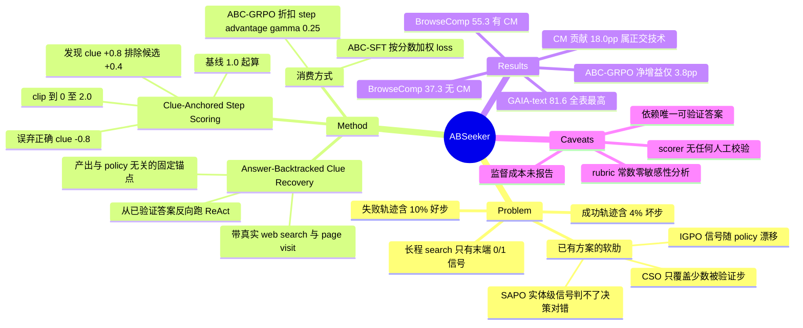

## Summary

用已知的 ground-truth answer 反向重建证据链，把 search agent 的 trajectory-level 0/1 outcome 拆成 step-level dense reward。ABC 分两步：Answer-Backtracked Clue Recovery 从已验证答案出发跑一个反向 ReAct loop（带真实 web search）回溯出一组可验证 clue，Clue-Anchored Step Scoring 再按固定 rubric 逐步打分（发现/验证正确 clue +0.8、排除错误候选 +0.4、误弃正确 clue −0.8），所得分数同时用于 SFT 的 loss 加权（ABC-SFT）与 GRPO 的 step reward（ABC-GRPO）。Qwen3.5-4B + 8.5K 轨迹训出的 ABSeeker 在 BrowseComp 上取得 37.3（无 context management）/ 55.3（有），但两者之差的 +18.0pp 来自与 ABC 正交的 context management，ABC-GRPO 相对 standard GRPO 的净增益是 +3.8pp。

## Problem & Motivation

Long-horizon search agent 的一条 trajectory 可以有上百步，但训练信号只有末端的答案对错。SFT 把成功轨迹的每一步同等当正样本，RL 把 trajectory-level advantage 均摊到所有 token——两者都默认「轨迹的标签 = 轨迹内每一步的标签」。

作者直接测了这个假设成不成立：在 8.5K 条训练轨迹上，成功轨迹里约 4% 的步骤得分低于 1.0（基线分），失败轨迹里近 10% 的步骤得分高于 1.0（Sec 4.2, Fig 4）。也就是说 outcome-only 监督在强化成功轨迹里的错误动作，同时惩罚失败轨迹里真正找到关键证据的动作。这个测量是全文最有价值的部分——它把「dense credit 有用」从直觉变成了可量化的信号量。

已有的细粒度 credit assignment 各有软肋，论文在 Related Work 里点得很清楚：IGPO 用模型自己对 ground-truth answer 的 likelihood 增量做 step reward，信号随 policy 更新漂移；CSO 靠反事实 rollout 验证 critical step，只给被验证的少数步骤打分，其余步骤仍无监督；SAPO / MindDR 用中间实体的图邻近度或覆盖率，实体级信号无法判断某一步的检索或推理决策本身对不对。

作者的切入点是 search 任务的一个结构性质：**答案一旦已知，任务就是可回溯的**。BrowseComp 这类 benchmark 的问题由多个约束构成，约束加上唯一答案隐含地定义了一条有效证据路径，因此可以从答案出发反推出「本该被发现的中间实体、事实、关系」，用它们做与 policy 无关的固定评分锚点。

## Method

**Stage 1 — Answer-Backtracked Clue Recovery**。给定 query `q` 和已验证答案 `a*`，用 LLM 反推出 clue 集合 `C = {c_1, ..., c_K}`，每个 clue 是连接 query 与答案的可验证中间证据（实体、事实、属性、关系）。关键设计：这个回溯本身是一个 active ReAct loop——recovery 模型用和前向 agent 完全相同的 tool-call 协议做真实 web search 与 page visit，从答案往 query 方向追证据，每条 clue 都锚定在实际网页内容上；活下来的 clue 才进入评分锚点集（Sec 3.2）。论文给的例子里，四约束 query + 答案 CeraVe 回溯出六条 clue，包括 Ceramides 作为临床支持成分、L'Oréal 作为收购方、Eugène Schueller 1904 年毕业。

**Stage 2 — Clue-Anchored Step Scoring**。scorer 拿到（当前 step 的 reasoning + tool call + tool response、原始 query、完整 clue 集），输出该步的标量分与简短理由。每步从基线 1.0 起算，按 Table 1 的固定 delta 累加后 clip 到 [0, 2.0]：

| 行为 | Δ |
|:--|:--|
| 发现或验证一条正确 clue | +0.8 |
| 正确排除一个错误候选 | +0.4 |
| 错误地否定一条正确 clue | −0.8 |
| 提交正确的最终答案 | +1.0 |
| 提交错误的最终答案 | −1.0 |

基线 1.0 的作用是「没有明显错误的合理探索不被惩罚」。一步内可以同时触发多条准则、同一条准则也可重复触发。这样，失败轨迹里发现正确 clue 的那一步照拿正分，成功轨迹里误弃正确 clue 的那一步照吃罚分。

**Stage 3 — 两种消费方式**。
- **ABC-SFT**：按 step reward 给该步所有 policy token 的 loss 加权，`w(r_t) = σ(α(r_t − β))`；实现中取 `w(r_t) = 2σ(2(r_t − 1))`，即中性分 1.0 映射到权重 1.0，权重实际跨度约 [0.24, 1.76]（Appendix A）。tool response 不计入 loss。
- **ABC-GRPO**：把 `R_{i,t} = r_{i,t}` 在 rollout group 内归一化得 `R̂`，再算折扣 step-level advantage `A_{i,t} = Σ_{k≥t} γ^{k−t} R̂_{i,k}`，γ = 0.25；该 advantage 赋给这一步的全部 policy token，tool response 被 mask。其余沿用标准 clipped GRPO 目标，只是把 trajectory-level advantage 换成 step-specific 的。

**训练配置**：backbone Qwen3.5-4B；SFT 用从 OpenSeeker 随机抽的 8.5K 条轨迹（5.5K 正确 + 3.0K 错误），3 epoch，batch 64，lr 5e-5，Slime 实现；RL 用 veRL，从 SFT checkpoint 起，1000 条按交互轮数筛过的问题（200 条 <100 轮、800 条 ≥100 轮），每题 8 rollout，单 rollout 上限 200 轮，16 个异步 agent-loop worker。clue recovery、step scoring 与最终答案判分**三者都用 DeepSeek-V4-Flash**。

## Key Results

**主表（Table 2，五个 benchmark）**。注意 caption 规定：BrowseComp / BrowseComp-ZH 列上带 `*` 的数字表示**未启用 context management**。ABSeeker 4B 报 37.3\*/55.3（BrowseComp）、39.1\*/52.9（BrowseComp-ZH）、77.0（xbench-2505）、46.0（xbench-2510）、81.6（GAIA-text）。

- **同规模 4B**：DR-Venus 29.1\*、AgentCPM-Explore 24.1\*，ABSeeker 无 context management 的 37.3\* 明显更高。但 QUEST-4B 的 BrowseComp 40.0 **不带星号**（即已启用 context management），高于 ABSeeker 的 37.3\*；两者不同 setting，可比的一组是 55.3 vs 40.0。
- **~30B 对比**：ABSeeker 的 55.3 高于 Tongyi-DeepResearch 43.4\*、OpenSeeker 29.5\*、DeepMiner 33.5，但**低于 MiroThinker-1.7-mini 67.9 与 RedSearcher 57.4**。摘要里「matching the performance of larger ones (~30B)」的说法比正文的「surpassing several 30B systems」宽松，后者才是表里的实情。
- **跨 benchmark 泛化**：训练只用 BrowseComp 风格问题，xbench-2505 77.0 与 GAIA-text 81.6 均高于表中所有 ~30B search agent；GAIA-text 的 81.6 还高于表内全部 foundation model（Gemini-3.1-Pro 80.6、GPT-5 High 76.4）。需注意 xbench-2505 上 GAIA 最强的两个 30B（MiroThinker 80.3、RedSearcher 80.1）都记为 "–" 未报，所以「outperforms all reported 30B agents on xbench-2505」的比较基数只有 DeepMiner 62.0 / Tongyi 75.0 / OpenSeeker 74.0 三家。

**消融（Table 3，全部无 context management）**：

| 配置 | BrowseComp | BC-ZH | xbench-2505 | xbench-2510 | GAIA-text |
|:--|:--|:--|:--|:--|:--|
| Qwen3.5-4B + Standard SFT | 28.5 | 30.4 | 73.0 | 27.0 | 66.0 |
| Qwen3.5-4B + ABC-SFT | 30.8 | 31.8 | **72.0** | 35.0 | 72.8 |
| ABSeeker-4B-SFT + Standard GRPO | 33.5 | 36.3 | 75.0 | 41.0 | 77.7 |
| ABSeeker-4B-SFT + ABC-GRPO | 37.3 | 39.1 | 77.0 | 46.0 | 81.6 |

ABC-SFT 相对 standard SFT 在 BrowseComp +2.3、xbench-2510 +8.0、GAIA-text +6.8，但 **xbench-2505 反而掉 1.0**（73.0 → 72.0），论文只以 "remaining comparable" 一笔带过。ABC-GRPO 相对 standard GRPO 五项全涨，BrowseComp +3.8。两行 GRPO 消融**都从同一个 ABC-SFT checkpoint 起跑**，因此 standard-SFT × ABC-GRPO 这一格缺失，两个组件没有完全交叉。

**Reward 分布（Fig 4）**：成功轨迹约 4% 的步骤 `r_t < 1.0`，失败轨迹近 10% 的步骤 `r_t > 1.0`。这是全文对「为什么 outcome-only 不够」最直接的证据。

**Context management（Fig 6）**：沿用 MiroThinker 与 LongSeeker 的做法，上下文上限 256K token、discard-all 策略最多五轮，BrowseComp 37.3 → 55.3（+18.0pp）、BrowseComp-ZH 39.1 → 52.9（+13.8pp）。

**RL 训练动态（Fig 5）**：在 200 题 BrowseComp 验证集上，ABC-GRPO 全程优于 trajectory-level GRPO，且平均交互轮数更长——step-level credit 没有把 agent 训得更保守。

## Evidence Ledger

| Claim ID | Claim | Type | Source locator | Evidence excerpt | Status |
|:--|:--|:--|:--|:--|:--|
| C1 | ABSeeker = Qwen3.5-4B，SFT 用 OpenSeeker 随机抽的 8.5K 轨迹（5.5K 正确 + 3.0K 错误），3 epoch | benchmark-setting | Appendix A | "We randomly select 8.5K trajectories from OpenSeeker, consisting of 5.5K correct and 3.0K incorrect trajectories" | source-verified |
| C2 | BrowseComp 37.3 / BrowseComp-ZH 39.1（无 context management）；加 context management 后 55.3 / 52.9 | number | Abstract; Sec 4.2 | "achieves 37.3% on BrowseComp and 39.1% on BrowseComp-ZH. With context management ... 55.3% and 52.9%" | source-verified |
| C3 | Table 2 中 `*` = 未启用 context management；QUEST-4B 的 40.0 不带星号，高于 ABSeeker 带星号的 37.3，二者非同一 setting | comparison | Table 2 caption; Table 2 | "For BrowseComp and BrowseComp-ZH, * denotes results obtained without context management." | source-verified |
| C4 | BrowseComp 上 ABSeeker 最好成绩 55.3 低于 MiroThinker-1.7-mini 67.9 与 RedSearcher 57.4 两个 ~30B agent | comparison | Table 2 | "MiroThinker-1.7-mini 30B 67.9 ... RedSearcher 30B 57.4 ... ABSeeker 4B 37.3* / 55.3" | source-verified |
| C5 | 消融：Standard SFT 28.5 / xbench-2505 73.0 → ABC-SFT 30.8 / 72.0（xbench-2505 下降）；Standard GRPO 33.5 → ABC-GRPO 37.3 | number | Table 3 | "+Standard SFT 28.5 ... 73.0 ... +ABC-SFT 30.8 ... 72.0 ... +Standard GRPO 33.5 ... +ABC-GRPO 37.3" | source-verified |
| C6 | 两行 GRPO 消融同从 ABC-SFT checkpoint 起跑，论文未报 Standard SFT × ABC-GRPO 组合 | benchmark-setting | Table 3; Sec 4.3 | "ABSeeker-4B-SFT +Standard GRPO 33.5 ... +ABC-GRPO 37.3" | source-verified |
| C7 | 成功轨迹约 4% 步骤得分 <1.0，失败轨迹近 10% 步骤得分 >1.0 | causal-mechanism | Sec 4.2 (Reward Distribution) | "successful trajectories contain approximately 4% low-quality steps ... nearly 10% of the steps in failed trajectories receive rewards above 1.0" | source-verified |
| C8 | 评分 rubric 为手工固定 delta（+0.8 / +0.4 / −0.8 / +1.0 / −1.0），基线 1.0，clip 到 [0, 2.0] | benchmark-setting | Table 1; Eq. 4; Sec 3.3 | "Each step starts with a base score of 1.0 ... accumulated on top of the base score and clipped to [0,2.0]" | source-verified |
| C9 | DeepSeek-V4-Flash 同时担任 clue recovery / step scoring 的 backbone 与 benchmark 最终答案的判分模型 | benchmark-setting | Sec 4.1; Appendix B | "we use DeepSeek-V4-Flash as the backbone LLM"; "use DeepSeek-V4-Flash as the evaluation model" | source-verified |
| C10 | ABC-GRPO 在 rollout group 内归一化 reward，用 γ = 0.25 算折扣 step-level advantage，tool response 被 mask | causal-mechanism | Sec 3.4.2; Appendix A | "Rewards are normalized within each rollout group, and discounted step-level advantages are computed with γ=0.25" | source-verified |
| C11 | Context management = 256K 上下文上限 + discard-all 最多五轮，沿用 MiroThinker / LongSeeker | benchmark-setting | Sec 4.2 (Effect of Context Management) | "we set the maximum context length to 256K tokens and apply the discard-all strategy for up to five rounds" | source-verified |
| C12 | GAIA-text 81.6 为 Table 2 全表最高，超过 Gemini-3.1-Pro 80.6、MiroThinker 80.3、GPT-5 High 76.4 | comparison | Table 2 | "Gemini-3.1-Pro ... 80.6 ... MiroThinker-1.7-mini ... 80.3 ... ABSeeker 4B ... 81.6" | source-verified |
| C13 | 代码 github.com/PolarSeeker/ABSeeker，模型 huggingface.co/PolarSeeker/ABSeeker-4B-RL | license-code | 首页 front matter | "Code https://github.com/PolarSeeker/ABSeeker Model https://huggingface.co/PolarSeeker/ABSeeker-4B-RL" | source-verified |
| C14 | 全文（含附录）未报告对 LLM 回溯 clue 集或 step 分数的人工校验、一致性或 precision/recall 分析 | causal-mechanism | 全文; Appendix A–C | "Appendix A Training Details ... Appendix B Evaluation Details ... Appendix C Prompt Templates" | source-verified |
| C15 | RL 用 1000 题（200 题 <100 轮、800 题 ≥100 轮），每题 8 rollout | benchmark-setting | Appendix A | "1,000 questions filtered by the number of interaction turns, of which 200 have fewer than 100 turns and the remaining 800" | source-verified |
| C16 | 「outperforms all reported 30B agents on xbench-2505」成立，但比较基数只有 DeepMiner / Tongyi / OpenSeeker——MiroThinker 与 RedSearcher 在该列记为 "–" | comparison | Sec 4.2; Table 2 | "It outperforms all reported 30B agents on xbench-2505 and GAIA-text" | source-verified |
| C17 | 全文未报告对 rubric delta 常数、γ 或 SFT 加权函数参数的敏感性分析 | causal-mechanism | Sec 4.3; Table 3; Appendix A | "Table 3 evaluates ABC-SFT and ABC-GRPO across all five benchmarks, with all methods tested without context management." | source-verified |
| C18 | Clue Recovery 本身是带真实 web search / page visit 的 active ReAct loop，非纯离线文本调用 | causal-mechanism | Sec 3.2; Appendix C.1 | "this backtracking is itself an active ReAct loop: the recovery model conducts web searches and visits pages" | source-verified |

## Strengths & Weaknesses

**先测量再动手。** 论文没有从「dense reward 直觉上更好」出发，而是先量出成功轨迹 4% 坏步、失败轨迹 10% 好步（C7），把 outcome-only 监督的错配变成一个具体数字，再据此设计干预。这是正确的 problem formulation 顺序，也让后面的增益有可归因的对象。

**锚点与 policy 解耦，是这篇相对同类工作最实的一点。** IGPO 的信号来自模型自身 likelihood，会随 policy 更新漂移；CSO 靠反事实 rollout，昂贵且只覆盖少数步。ABC 的 clue 集是 per-question 离线算一次、训练全程固定的外部锚点——这意味着 RL 过程中 reward 函数不动，避免了 reward model 与 policy 共同漂移的经典失效模式。而且同一套分数能同时喂 SFT 的 loss 权重和 GRPO 的 advantage，覆盖了两个训练阶段，这在 credit assignment 工作里不常见（多数只改 RL 一侧）。

**数据效率的证据是硬的。** 8.5K 轨迹训出的 4B 模型，在同为无 context management 的口径下（37.3\* vs 29.5\*）超过了它训练数据的来源 OpenSeeker-30B（C4/Table 2）。这不是「更多数据更大模型」的结果，确实是监督信号密度带来的。

---

**头条数字的主要来源不是本文的贡献。** 摘要以 55.3 领衔并归因于 ABC，但 37.3 → 55.3 的 +18.0pp 来自 context management（C11），一个与 credit assignment 完全正交的 inference-time 技术，且直接沿用同组的 LongSeeker（Lu 是本文一作）。ABC-GRPO 相对 standard GRPO 的净增益是 +3.8pp（C5）。两个数字分开看都诚实，合在摘要里读者会把 18pp 记到 ABC 头上。

**Table 2 是混 setting 的表。** ABSeeker 的 55.3 带 context management，而 Tongyi 43.4\*、OpenSeeker 29.5\*、DR-Venus 29.1\*、AgentCPM 24.1\* 都是无 context management；QUEST-4B 的 40.0 不带星号，反而高于 ABSeeker 无 context management 的 37.3（C3）。星号规则在 caption 里写清楚了，不算隐瞒，但「4B 全面最好」这个结论需要读者自己完成 setting 对齐才能确认。

**整条 reward 链条压在一个未经校验的 LLM scorer 上，这是最大的洞。** DeepSeek-V4-Flash 同时做 clue recovery、step scoring 和 benchmark 判分（C9），三个角色互相耦合；而全文没有任何人工抽检、标注一致性或 clue precision 分析（C14）。这不是吹毛求疵——[[2607-OSReward]] 已经量出 CUA 领域的 LLM judge 在困难子集上均值只有 52% 且系统性偏宽松，没有理由假设 search 场景下的 step judge 更可靠。scorer 若有系统性偏差，ABC 优化的就是这个偏差而非真实搜索质量，而用同一模型判分会让这种偏差在评测里也看不出来。

**回溯出的 clue 是一条事后合理化的路径，不是所有有效路径的集合。** "误弃正确 clue −0.8" 这条准则默认回溯链就是「本该被发现的东西」的 ground truth。但换一条同样能到达正确答案的证据路径的 agent，会因为没有追那些 clue 而被扣分——这可能压制解法多样性。论文没有测这一点。唯一的反向证据是 Fig 5 显示 ABC-GRPO 反而产生更长的轨迹（探索没被压缩），但轨迹长度不等于路径多样性。

**关键路径上有五个手调常数，零敏感性分析。** rubric 的 +0.8 / +0.4 / −0.8、γ = 0.25、SFT 的 `2σ(2(r−1))`，没有一个做过消融（C17）。值得注意的是 [[2606-TRIAGE]] 也是「LLM judge 给 step 打角色标签 + 固定常数（1, 0.5, −0.1, −0.5）加到 outcome advantage 上」，同样没有常数敏感性分析——这类方法正在形成一个共同的方法论漏洞：把可学习的东西写死成超参，然后不检验它。

**监督成本没有任何交代，「only 8.5k examples」的说法有误导性。** clue recovery 是每道训练题跑一整个 ReAct web-search 循环（C18），step scoring 是每步一次 LLM 调用而轨迹上限 200 步，RL 阶段还要在线给 1000 × 8 条 rollout 逐步打分（C15）。全文没有 token 数、成本或 wall-clock 的记录。真实的监督预算很可能远超「8.5K 条轨迹」暗示的量级，与 CSO 那类「昂贵」方法的对比也就无从判断。

**适用边界比论文承认的更窄。** ABC 成立的前提是「唯一可验证答案 + 约束隐式定义单条有效证据路径」，这恰好是 BrowseComp 的构造方式（Sec 3.2 明说）。开放式 research、SWE、GUI 操作这些没有单一实体答案的任务，回溯出什么、怎么验证都还是开放问题。future work 把这写成了推广方向，实际上它是一个前置条件。

**与 TRIAGE 的框架重叠值得注意。** 「奖励失败轨迹中的有用动作、抑制成功轨迹中的冗余动作」这个 motivation 与固定常数 rubric 的形式，[[2606-TRIAGE]] 两个月前已经做过。ABC 真正的 delta 是把 judge 的判断锚定在 answer-backtracked 的具体 clue 上，而非抽象角色标签——这确实更可验证、更不容易漂移，但论文没有引用也没有对比 TRIAGE，读者难以判断这个 delta 值多少。

## Mind Map

## Notes

**可迁移的问题：GUI / embodied 任务能不能被 answer-backtracked？** ABC 的前提是「终局可回溯成中间证据」。search 任务里终局是一个实体，回溯物是证据链。GUI 任务的终局往往是一个 environment state，理论上可以回溯成「必须被满足的中间 state predicate 序列」——例如「订单已提交」可回溯为「商品已加购物车 → 地址已填 → 支付方式已选」。这个类比是否成立，取决于 GUI 任务的中间状态是否也像 BrowseComp 的约束那样隐式定义单条有效路径；直觉上 GUI 的有效路径分支比 search 多得多（同一目标可有多条 UI 操作序列），所以「误弃正确 clue −0.8」那类惩罚会更危险。这是一个值得独立验证的 idea 方向，但先要回答的是「多路径场景下如何把回溯锚点从单链放宽成偏序或集合覆盖」。

**与 vault 的连接**：
- [[2606-TRIAGE]] — 最直接的对照工作。同一 motivation、同为 LLM judge + 固定常数 rubric，差别在锚点是抽象角色标签还是具体 backtracked clue。两篇合看能定位这条技术线的真实进展在哪。
- [[2606-ECPO]] — 对 dense credit 的统计可靠性批评（"denser is not always better"，有限 rollout 下罕见动作拿到过大 advantage）。ABC 的 clue 锚点是外部固定的，理论上不受 ECPO 指出的 divergent anchor bias 影响，但 ABC 从未在这个框架下自检过，值得交叉验证。
- [[2607-OSReward]] — LLM-as-judge 可靠性的量化基准。ABC 全部信号依赖未校验的 judge，OSReward 的结论是这类 judge 在困难子集上不可靠且系统性偏宽松。这是评估 ABC 时最该带着的先验。
- [[2509-TreeGRPO]] — 另一条获得 step 级过程信号的路线：不引入外部 judge，而是靠树采样的兄弟子树回报差自然构造。与 ABC 形成「外部锚点 vs 结构化采样」的方法论对照，且 TreeGRPO 不需要可回溯的 ground truth。
- [[2510-ContextFolding]] / [[2606-SearchSwarm]] — context management 路线。本文 +18pp 的增益来自这条线而非 ABC，说明长程 search 的瓶颈里，上下文管理目前的边际收益仍大于 credit assignment。
- [[2504-BrowseComp]] — 评测基准本身。ABC 的可行性直接建立在 BrowseComp「答案唯一且可验证、约束隐式定义证据路径」的构造上，读该篇能理解 ABC 适用边界的来源。

**待查**：repo 是否公开了 clue recovery 与 step scoring 的完整 pipeline 及调用量统计。若公开，可用一轮 `repo-digest` 结算「监督成本」这个论文完全没交代的问题——这是判断 ABC 相对 CSO 等「昂贵」方法是否真的更经济的关键，也是本篇最实际的未决点。
