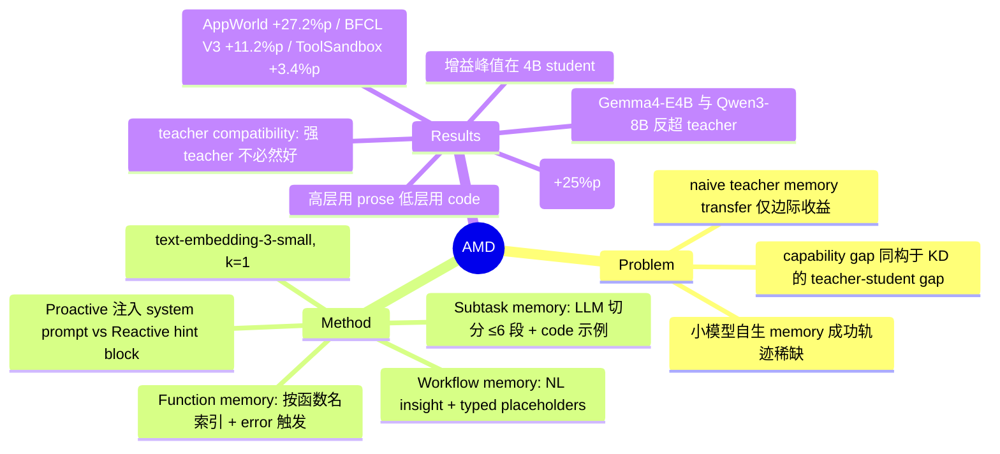

## Summary

AMD(Agent Memory Distillation)是一个 training-free 框架:让大 teacher agent(GPT-5-mini)先在任务集上跑出成功轨迹,再把这些轨迹蒸馏成 Workflow / Subtask / Function 三层 hierarchical memory 供 4B-8B 小 student agent 检索使用,绕开小模型自生成 memory 时成功轨迹稀缺的根本瓶颈。在 AppWorld / BFCL V3 / ToolSandbox 上,四个 student 平均相对 zero-shot 提升 +27.2 / +11.2 / +3.4 个百分点,多个 student 甚至反超 teacher 本身。

## Problem & Motivation

Agent memory 的有效性此前主要在大型闭源模型上验证;小模型 agent 任务成功率低,自生成的 memory 库被失败轨迹主导,可复用的成功经验稀缺,memory 机制因此失效。直接把 teacher 的 memory 原样转给 student 也只有边际收益:teacher 的高层策略(如"先登录再操作 playlist")假设了 student 不具备的前置执行能力,且小模型 in-context learning 与 instruction-following 更弱,读不懂、用不动 teacher 经验——这与传统 knowledge distillation 中的 teacher-student capability gap 同构。作者的判断是:memory distillation 需要按任务粒度分层组织、并为每层选对表示,才能被小模型消化。

## Method

**问题设定**:多轮 tool-use 任务。teacher πT 先在任务集 S 上收集轨迹,只取其中**成功轨迹子集**构造 memory store M = M^wf ∪ M^st ∪ M^fn,转移给 student πS;πS 推理时按需检索。全程不更新任何模型参数。

**三种 memory 的构造**(均由 teacher LLM 从成功轨迹生成):

| Memory | 粒度 | 构造 | 表示 | 索引方式 |
|:--|:--|:--|:--|:--|
| Workflow | task 级 | 每条成功轨迹提炼一条 insight:涉及的 apps/tools、precondition、decision rules、validation cues、常见失败模式;ID/credential/路径等动态值替换为 typed placeholders(如 `<ID>`、`<EMAIL>`) | 自然语言 | dense embedding(query 为任务特征描述) |
| Subtask | subtask 级 | teacher LLM 把轨迹切分为语义连贯 segment(每条轨迹至多约 6 段,rule-based breakpoint hints 辅助),每段存 label + 一句话描述 + 具体执行示例(tool calls / 代码 + observations) | 描述为文本、示例为 code | 描述的 dense embedding |
| Function | function-call 级 | 每个成功调用存 function name + 带上下文的调用示例;AppWorld 额外附 API documentation(参数/返回 schema),BFCL V3 / ToolSandbox 无丰富文档、只用示例 | code 示例 | 按 function name 精确索引 |

**注入机制**(proactive vs reactive 是关键设计):
- **Proactive**:任务开始时一次性注入 system prompt。Workflow 以任务指令为 query 检索 top-1;Subtask 则先让 student 自己把任务分解为至多 6 个 subtask labels,逐 label 独立检索 top-1 segment 并跨 subtask 去重。
- **Reactive**:Function memory 只在 tool call 返回 error 时触发——按失败函数名查表,同名多条记录按与当前任务的 cosine 相似度排序,取 top 示例格式化为 hint block 追加到 error message 后。成功执行时不注入,避免 context 膨胀。

检索统一用 OpenAI text-embedding-3-small + cosine 相似度 + 最低相似度阈值;主实验三种 memory 均 k=1。student 每任务最多 40 步,Qwen3 关闭 thinking mode。

## Key Results

- **主结果**(Table 1;teacher = GPT-5-mini;每实验重复 2 次取平均):AppWorld test_normal 168 题、BFCL V3 multi-turn base 200 题、ToolSandbox base 129 场景(GPT-5-mini 模拟用户)。AMD 对四个 student(Qwen3-4B / Gemma4-E4B / Qwen3-8B / Llama3.1-8B)平均相对 zero-shot 增益 **+27.2%p / +11.2%p / +3.4%p**。
- **对比 baseline**:ReasoningBank / MemP / SASM 三个 memory 方法(改造为用同一批 teacher 轨迹建库)增益不稳定甚至倒退——ReasoningBank 让 Qwen3-4B 在 AppWorld 上从 14.88% 掉到 10.71%。注意:Table 1 只对 Qwen3-4B 与 Gemma4-E4B 列出 baseline 数字(该 6 组 AMD 均最高),Qwen3-8B / Llama3.1-8B 的"全面优于"仅有正文断言。
- **student 反超 teacher**:AppWorld 上 Gemma4-E4B(54.17%)、Qwen3-8B(51.79%)超过 GPT-5-mini(50.00%);三 benchmark 平均上 Gemma4-E4B 40.63%、Qwen3-8B 40.96% 也超过 teacher 的 38.39%。作者解读为蒸馏的是可迁移决策模式而非轨迹模仿。
- **Ablation(Table 2,AppWorld + BFCL V3)**:**Subtask memory 贡献最大增量**——Qwen3-4B AppWorld 从 WF 22.02% 升到 WF+ST 47.02%(+25.0%p);Function memory 增益较小,且对 Llama3.1-8B 反而有害(WF+ST 30.36% → WF+ST+FN 27.38%,作者归因于其 instruction-following 更弱)。用 student 自生成 memory 替换 teacher memory 后接近 zero-shot(Qwen3-4B AppWorld 16.07% vs 14.88%)。
- **Teacher-student compatibility(Table 3,AppWorld)**:对 Qwen3-8B,teacher accuracy 是可靠预测子——GPT-5.5(teacher 91.08%)→ student 58.93%,依次递减到 Qwen3-32B(34.42%)→ 39.29%;但对更弱的 Qwen3-4B 该排序破裂:GPT-5-mini teacher(student 49.40%)反超 DeepSeek V4 Pro teacher(38.10%),尽管后者 teacher accuracy 高 31.55%p。强 teacher 不必然是好 teacher。
- **Student 规模效应**(Qwen3 家族 1.7B-14B):AMD 绝对精度随规模上升(21.43 / 49.40 / 51.79 / 52.68%),但相对增益在 **4B 处峰值**(+34.52%p)——1.7B 消化不了 memory,8B/14B 已逼近 teacher 上限。
- **检索数 k**:k=1 已近最优;k 增到 5 时 Subtask memory 从 49.40% 单调掉到 33.34%——小模型经不起低相关 memory 的干扰,精准注入优于广撒网。
- **表示消融(Table 4)**:Workflow 用自然语言优于 code(49.40 vs 44.05),Subtask 用 code 远优于纯文本(49.40 vs 23.21),全文本表示掉到 26.19——高层规划知识宜 prose、低层执行知识宜可执行代码。
- **效率**:AppWorld 上 zero-shot Qwen3-4B 平均 23.8 turns vs teacher 10.1,AMD 降到 14.9(Gemma4-E4B 到 7.2)。
- **稳健性**(Appendix B):cross-split(7:3)与 self-excluded retrieval 两种 disjoint 协议下增益保留(self-excluded WF+ST+FN AppWorld 46.43%,接近主结果 49.40%),排除"任务用了自己的 memory"的解释;Qwen3-4B 五次重复 std 全部 <1%p。

## Evidence Ledger

| Claim ID | Claim | Type | Source locator | Evidence excerpt | Status |
|:--|:--|:--|:--|:--|:--|
| C1 | 四 student 平均相对 zero-shot:AppWorld +27.2%p、BFCL V3 +11.2%p、ToolSandbox +3.4%p | number | Abstract; §4.2; Table 1 Δ rows | "average accuracy gains of 27.2%p, 11.2%p, and 3.4%p over zero-shot across the four student models" | source-verified(verifier 由 Table 1 重算一致) |
| C2 | teacher 为 GPT-5-mini;AppWorld test_normal 168 / BFCL V3 multi-turn base 200 / ToolSandbox base 129(GPT-5-mini 模拟用户);主实验重复 2 次取平均 | benchmark-setting | §4.1; Appendix C | "test_normal subset consisting of 168 tasks… 200 tasks… 129 scenarios, using GPT-5-mini as the user simulator… repeated twice" | source-verified |
| C3 | 三种 memory 均由 teacher 从成功轨迹构造:Workflow 为带 typed placeholders 的 NL insight;Subtask 为 LLM 切分的 ≤6 段带示例 segment;Function 按函数名索引、AppWorld 附 doc | causal-mechanism | §3.2; Appendix C | "replaced with typed placeholders… rule-based breakpoint hints… at most six… BFCL V3 and ToolSandbox, each memory uses only the concrete example" | source-verified |
| C4 | Workflow+Subtask 任务开始时 proactive 注入 system prompt;Function 仅在 tool-call error 时 reactive 检索、以 hint block 追加;text-embedding-3-small、k=1、相似度阈值 | causal-mechanism | §3.3; §4.1; Appendix C | "injected once at the beginning… formatted as a hint block and appended to the error message… text-embedding-3-small… k=1" | source-verified |
| C5 | AMD 优于 ReasoningBank / MemP / SASM;ReasoningBank 使 Qwen3-4B AppWorld 14.88%→10.71% | comparison | §4.1 Baselines; §4.2; Table 1 | "AMD consistently outperforms all baselines in every model and benchmark… reduces Qwen3-4B accuracy on AppWorld from 14.88% to 10.71%" | source-verified(表格数字仅覆盖 Qwen3-4B 与 Gemma4-E4B 两个 student) |
| C6 | AppWorld 上 Gemma4-E4B 54.17%、Qwen3-8B 51.79% 超过 teacher 50.00%;平均上 40.63% / 40.96% 超过 teacher 38.39% | number | §4.2; Table 1 | "Gemma4-E4B (54.17%) and Qwen3-8B (51.79%) surpass GPT-5-mini (50.00%)… exceed the teacher's average accuracy (38.39%)" | source-verified(平均值经重算) |
| C7 | Subtask memory 增量最大(Qwen3-4B AppWorld WF 22.02%→WF+ST 47.02%);FN 增益小且对 Llama3.1-8B 为负(30.36%→27.38%) | number | §5.1; Table 2; B.1 | "Adding Subtask memory produces the largest incremental improvement… +25.0%p for Qwen3-4B over WF alone… decreases accuracy from 30.36% to 27.38%" | source-verified |
| C8 | Student 自生成 memory 变体接近 zero-shot(Qwen3-4B AppWorld 16.07% vs 14.88%),远低于 AMD | number | §5.1; Table 2 | "Student Memory… yields results close to zero-shot performance on AppWorld and substantially below AMD" | source-verified(ablation 仅覆盖 AppWorld/BFCL V3) |
| C9 | Qwen3-8B 上 teacher accuracy 可靠预测增益(91.08→58.93 递减至 34.42→39.29);Qwen3-4B 上排序破裂:GPT-5-mini(49.40)> DeepSeek V4 Pro(38.10) | causal-mechanism | §5.2; Table 3 | "GPT-5.5 (91.08%) yields the highest student accuracy (58.93%)… this ordering breaks down: GPT-5-mini achieves the best (49.40%)" | source-verified(论文措辞为 reliable predictor) |
| C10 | Qwen3 1.7B/4B/8B/14B 的 AMD AppWorld 精度 21.43/49.40/51.79/52.68%,增益在 4B 峰值(+34.52%p) | number | §5.3; Figure 4(数值见正文) | "21.43%, 49.40%, 51.79%, and 52.68% for 1.7B, 4B, 8B, and 14B… gain peaks at 4B (+34.52%p)" | source-verified |
| C11 | k=1 近优;k 增至 5 时 Subtask 精度从 49.40% 单调降至 33.34% | number | §5.4; Figure 5(端点数值见正文) | "k=1 is already optimal or near-optimal… accuracy drops monotonically from 49.40% to 33.34%" | source-verified |
| C12 | Workflow 用 NL 优于 code(49.40 vs 44.05);Subtask 用 code 优于 NL(49.40 vs 23.21);全 NL 降至 26.19 | comparison | §5.5; Table 4 | "natural language insight outperforms a code-centric format (49.40% vs. 44.05%)… (49.40% vs. 23.21%)… large drop (26.19%)" | source-verified(§5.5 未显式点名 Qwen3-4B,依上下文推断) |
| C13 | AppWorld zero-shot Qwen3-4B 23.8 turns vs teacher 10.1;AMD 降至 14.9 | number | §4.2; Figure 3(数值见正文) | "23.8 vs. 10.1 for Qwen3-4B… 14.9 for Qwen3-4B, 7.2 for Gemma4-E4B" | source-verified |
| C14 | disjoint 评测(cross-split 7:3 / self-excluded)下增益保留,self-excluded 全配置 AppWorld 46.43%;五次重复 std <1%p | benchmark-setting | Appendix B.3 Table 6; B.4 Table 5 | "split… at a 7:3 ratio… WF + ST + FN 46.43… standard deviations remain below one percentage point" | source-verified |
| C15 | 作者声称 AMD 是首个系统研究 teacher-to-student agent memory distillation 的工作;training-free | sota-novelty | §1; §2.2; §6 | "the first systematic investigation into effective teacher-to-student memory transfer for small agents… training-free framework" | source-verified(仅确认作者声称,首创性未独立证实) |

## Strengths & Weaknesses

**亮点**
- **问题设定干净且切中要害**:把 memory 当作 knowledge distillation 的介质,training-free 地绕过小模型"成功轨迹稀缺→memory 失效"的死循环。先证明 naive transfer 不行(capability gap),再给出分层解法,论证结构完整。
- **两个设计发现有独立价值**:(1) 表示随粒度变化——高层规划用 prose、低层执行用可执行代码,Table 4 的 49.40 vs 23.21 对比幅度足够大;(2) proactive/reactive 分流注入——Function memory 只在报错时进 context,是对"memory 注入 = context 膨胀"这一普遍代价的直接回应。
- **审稿人视角的稳健性检查做得足**:disjoint 评测(cross-split + self-excluded)排除了"检索到自己任务的 memory"这一最大混淆项;5 次重复 std <1%p。
- **teacher compatibility 的负结果诚实**:强 teacher(DeepSeek V4 Pro, 81.55%)对弱 student 反而不如中等 teacher(GPT-5-mini, 50.00%),作者没有掩盖这与"teacher 越强越好"直觉的冲突,并把 adaptive teacher selection 列为 open problem。

**局限**
- **(作者自认)** 仅验证于结构化 tool-use benchmark(Python API / 结构化函数调用),多模态、开放式 coding 场景未测;memory 离线构建后冻结,不吸收 student 运行时经验、不适应分布偏移。
- **(我方审视)teacher 前置成本未被正面讨论**:teacher 需要先在整个目标任务集上跑一遍(N = 任务数)才能建库。同分布任务重复出现时这是一次性摊销,但论文的主实验里 memory 构建集与评测集就是同一 benchmark——disjoint 协议(46.43% vs 49.40%)缓解了任务级泄漏,却没有回答 cross-benchmark / cross-domain 迁移这一更有实际意义的问题(同组 Kim et al. 2026 的 Memory Transfer Learning 恰好在做跨域,两者尚未接起来)。
- **baseline 公平性存疑**:MemP / SASM 本是为 same-model self-evolution 设计,强行改造到 transfer setting 后表现差,不能完全归因于方法本身弱;且 Table 1 的 baseline 数字只覆盖两个 student。
- **ToolSandbox 上 +3.4%p 的小增益未被解剖**:对话式、LLM 模拟用户驱动的场景下方法收益骤降,ablation 也未覆盖 ToolSandbox——三层 memory 对 milestone/minefield 式评测为何失灵,是留白。
- **compatibility 现象无机制解释**:GPT-5-mini 对 4B student 是最好 teacher 这一发现只有现象描述(推测与 teacher 轨迹的风格/复杂度有关),没有可操作的匹配判据。

**对领域的意义**:给 "小模型 agent 部署" 提供了一条比 SFT/RL 便宜得多的路径,且 4B 处增益峰值的发现对边缘部署有直接指导意义。方法本身是已有组件(workflow memory、subtask 检索、error-triggered hint)的组合,真正的贡献在于系统性地回答了"teacher memory 怎样才能被小模型消化"——粒度分层 + 表示匹配 + 注入时机三个自由度的 ablation 都齐了。

## Mind Map

## Connections

- [[2607-SkillKD]] — 最近邻:同为 teacher→student 的文本化蒸馏,但 SKILL-KD 用同题轨迹差异 + 重跑满分判据生成 skill patch;AMD 只用 teacher 成功轨迹、不做逐题对照,靠粒度分层解决消化问题。两者对"小模型消化 teacher 知识"的机制假设可以互相检验。
- [[2409-AgentWorkflowMemory]] — AMD 的 Workflow memory 直接承自 AWM(被引),差别在 AWM 是 self-generated、AMD 是 distilled from teacher。
- [[2601-MemRL]] — 对照组:MemRL 在 runtime 用环境 reward 更新 memory 检索打分,恰好补 AMD 的"离线冻结、不吸收 student 自身经验"这条 limitation。
- [[2606-AgentMemorySystem]] — 其"没有一种 memory 架构通吃、有效性取决于 workload 结构匹配"的结论与 AMD 的"表示随粒度变化"发现一致。
- [[2606-ProceduralMemoryAFTER]] — procedural memory 的 control/adaptation/evaluation 框架可用来审视 AMD 冻结 memory 的维护缺位。
- [[2606-SkillMemoryBudget]] — token 预算视角:AMD 的 reactive injection 与 k=1 发现(多注入反而有害)为"memory 注入不是越多越好"提供了小模型侧证据。
- [[Topics/SelfEvolvingAgents-Survey]] — 归属 memory evolution 主题;AMD 是"经验来源外包给 teacher"的分支,与 self-evolution 主线互补。

## Notes

- 项目页:https://agent-memory-distillation.github.io/ (正文未给 GitHub 代码链接,code 字段留空)
- k=1 即最优 + 多检索单调掉分,与 vault 中多篇 memory/skill 论文的"检索噪声毒害小模型"观察相互印证,可作为跨论文 pattern 记入 DomainMap。
- 悬而未决:teacher-student compatibility 的匹配判据。GPT-5-mini(teacher acc 50%)对 Qwen3-4B 优于 DeepSeek V4 Pro(81.55%),一个可检验的假设是 teacher 轨迹的步长/复杂度分布与 student 能力的匹配度比 teacher 绝对成功率更重要——论文未测轨迹复杂度统计。
