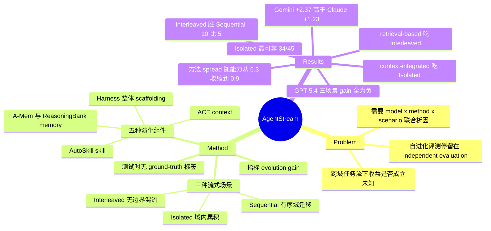

## Summary

AgentStream 把六个 agentic benchmark 编排成可配置的 task stream，用 Isolated / Sequential / Interleaved 三种测试时流式场景，对 5 个 self-evolving 方法 × 3 个 frontier 模型做组合评测，检验"自进化"离开单任务孤立评测后还剩多少收益。结论是收益既不普遍也不稳定：Isolated 最可靠、Interleaved 反而优于 Sequential，收益被 base model 能力 gate 住且对模型强度非单调，且没有任何方法在所有模型与场景上占优。

## Problem & Motivation

现有 self-evolving agent 研究几乎全部采用 independent evaluation：每个任务独立求解、跨任务不保留状态，最后聚合分数。少数走向 streaming 的工作也只在单个 benchmark 内部 stream，且只演化一种组件，因此"不同演化组件如何跨域迁移经验"从未被系统检验。这留下一个关键空白——真实部署里任务跨域、无明确边界、无 ground-truth 监督，那些在孤立评测中报出的自进化增益是否还成立，无人知道。作者的判断是：回答这个问题必须把 foundation model、self-evolving method、task stream 结构三个因子联合起来做受控析因，而 independent evaluation 在结构上就提供不了这个。

## Method

**问题设定。** 任务流 Q = {q1,…,qN} 逐个到达，前一个完成后才揭示下一个。Agent 由 foundation model M 与维护 evolution state S 的自进化方法参数化，S0 = ∅。每个任务下 agent 在当前 state 条件下做多步交互产生轨迹 h_t 与解 y_t，随后 S_t = Evolve(S_{t-1}, τ_t)，其中 τ_t 包含任务、轨迹、解与**自生成**反馈 r_t。测试时没有 ground-truth label，演化完全依赖交互内在信号（执行结果、反思式自评）。收益用 evolution gain Δ = Perf(M, Q, S) − Perf(M, Q, ∅) 度量，对照是同一模型在 state 恒为空时的表现。

**三种 streaming scenario。** 作者强调这三者不是难度排序，而是解耦三种不同压力：

- **Isolated**：每个 benchmark 一个独立 agent 实例与独立 state，测纯域内经验累积。
- **Sequential**：单 agent 按固定顺序走完所有 benchmark，state 跨 benchmark 边界保留，测有序域迁移下的 forward transfer。
- **Interleaved**：所有 benchmark 的任务 shuffle 成一条流、共享单一 state，测在无域边界时检索相关经验并抑制无关干扰的能力。

**覆盖的演化组件。** ACE（演化 prompt context，模块化生成 / 反思 / 整理）、A-Mem（Zettelkasten 式记忆索引与链接）、ReasoningBank（从成功与失败轨迹蒸馏可泛化推理策略）、AutoSkill（抽取—结构化—迭代精化—版本维护的技能生命周期）、Harness（作者按 Lin et al. 两篇工作复现的整体 scaffolding 演化，联合更新 system prompt、skill 与 memory）。分析时作者把五个方法重划为两族——**context-integrated**（ACE、Harness，把经验直接折进 agent prompt）与 **retrieval-based**（ReasoningBank、AutoSkill、A-Mem，经验存外部库、只注入当前任务检索到的条目）。这个二分是解释后续全部场景交互的核心轴，也是本文最可复用的抽象。

**实现。** 评测基建建在 Exgentic 之上以统一异构 agent 接口与 benchmark；每 benchmark 采样 N=50 任务（AppWorld 用 test-challenge split、BFCL 用 multi-turn base、Tau2 用 telecom domain）；judge 与 user simulator 模型统一为 GPT-5.4；文本 embedding 统一 all-MiniLM-L6-v2；跑 3 个 random seed，只改任务到达顺序、任务集固定；Sequential 顺序固定为 AppWorld → BFCL → BrowseComp+ → HLE → SWE → Tau2。

## Key Results

**场景轴：Isolated 最可靠，Interleaved 反而优于 Sequential。** Table 2 的汇总计数里，Isolated 有 34/45 跑赢 vanilla、平均 gain +1.37±0.80、Top-1 率 38%；Sequential 28/45、+0.75±0.48、29%；Interleaved 28/45、+0.90±0.34、33%。逐对比较中 Interleaved 在 15 个 model-method 配置里 10 个胜过 Sequential。作者的解释是：Interleaved 的多样性带来的跨域巩固，抵消掉的干扰比 Sequential 的有序域切换更多。

**模型轴：收益被能力 gate 住，且对模型强度非单调。** GPT-5.4 在三种场景下平均 gain 全为负（−0.35 / −0.78 / −0.62），15 个配置只有 4 个超过自身 vanilla；Gemini 3.1 Pro 14/15 超过（+2.71 / +1.98 / +2.41）；Claude Opus 4.7 13/15（+1.75 / +1.05 / +0.90）。更反直觉的是，vanilla 更弱的 Gemini（56.6）平均 gain +2.37% 高于更强的 Claude（63.9）的 +1.23%，且这个差距在 Interleaved 下从约 0.95% 扩大到 1.51%。

**方法轴：无方法占优，且最优方法不可跨模型迁移。** 方法间 spread 随模型能力单调收缩：GPT-5.4 上 5.3%（只有 1/5 超 vanilla，最差方法 −2.3%），Gemini 2.0%（5/5 超），Claude 0.9%（5/5 超）。A-Mem 在 GPT-5.4 上最好（48.8）却在 Gemini 上垫底；ACE 在 Gemini 领先却在另两个模型上只排第三；只有 ReasoningBank 三个模型都保持竞争力。按方法平均，自进化把 GPT-5.4 与 Claude 的差距从 18.1% 拉大到 20.0%；但每个模型各配最优方法可收窄到 16.8%。

**方法 × 场景交互：context-integrated 吃 Isolated，retrieval-based 吃 Interleaved。** ACE 的平均 gain 从 Isolated 的 +2.28% 掉到 Interleaved 的 −1.26%，Harness 从 +1.91% 降到 +1.01%；而 ReasoningBank、AutoSkill、A-Mem 均在 Interleaved 达到峰值（+1.79% / +0.72% / +2.22%）。作者归因于耦合方式：紧耦合进 prompt 的经验在跨域流里无法被门控，检索式则天然只激活任务相关条目。

**成本与演化行为（附录，基于单次评测而非三 seed 平均）。** 自进化不必然更贵，但成本-收益关系由模型决定：Gemini 上有四个方法比 vanilla 更便宜（ReasoningBank 64%、Harness 71%、AutoSkill 82%、A-Mem 84%），而 GPT-5.4 上多数方法更贵——A-Mem 是唯一取得正收益（+3.2%）的方法，却要 577% 的 baseline 成本。附录 B 还显示三个模型的演化风格差异显著：Claude 在 Harness 下 96% 的任务都会修订、编辑 460 次 skill；GPT-5.4 近乎 append-only（300 个任务只编辑 5 次 skill、从不改 system prompt）；Gemini 则把 29K 字符预算放在 prompt + memory 而非 skill 库。

## Evidence Ledger

| Claim ID | Claim | Type | Source locator | Evidence excerpt | Status |
|:--|:--|:--|:--|:--|:--|
| C1 | 5 方法（ACE / A-Mem / ReasoningBank / AutoSkill / Harness）× 3 frontier 模型 × 3 场景，跨 6 个 benchmark（AppWorld、BFCL、BrowseComp-Plus、HLE、SWE-bench Verified、Tau2） | benchmark-setting | Abstract；§1；§4 | "we combinatorially evaluate five representative self-evolving methods across three frontier foundation models" | source-verified |
| C2 | 模型档位为 GPT-5.4-medium、Gemini 3.1 Pro-medium、Claude Opus 4.7-high | benchmark-setting | §4 "Models." | "GPT-5.4-medium, Gemini 3.1 Pro-medium, and Claude Opus 4.7-high" | source-verified |
| C3 | 每 benchmark 采样 N=50；AppWorld 用 test-challenge、BFCL 用 multi-turn base、Tau2 用 telecom domain | benchmark-setting | §4 "Implementation Details." | "We sample N=50 tasks from each benchmark, where AppWorld uses the test-challenge split" | source-verified |
| C4 | 测试时无 ground-truth label，演化只用交互内在反馈；gain 定义 Δ = Perf(M,Q,S) − Perf(M,Q,∅) | benchmark-setting | §3.1 Problem Setup | "no ground-truth labels are accessible at test time, and the evolution relies entirely on feedback intrinsic to the interaction" | source-verified |
| C5 | Table 2：Isolated 34/45、+1.37±0.80、Top-1 38%；Sequential 28/45、+0.75±0.48、29%；Interleaved 28/45、+0.90±0.34、33% | number | Table 2 | "Isolated 34/45 11/45 +1.37±0.80 38% Sequential 28/45 16/45 +0.75±0.48 29%" | source-verified |
| C6 | 正文把上述比例写作 Isolated 75.7%、Sequential 与 Interleaved 均 62.3%，与 Table 2 的 34/45=75.6%、28/45=62.2% 各差 0.1 | number | §5.1 vs Table 2 | "Isolated achieves the highest positive rate of 75.7% ... Sequential at 62.3% positive rate" | source-verified |
| C7 | vanilla 平均：GPT-5.4 45.8、Gemini 3.1 Pro 56.6、Claude Opus 4.7 63.9 | number | Table 1 Vanilla 行 | "GPT-5.4 Vanilla 44.6 66.0 50.0 2.0 62.0 50.0 45.8" | source-verified |
| C8 | GPT-5.4 在 HLE 的 vanilla 分为 2.0，同列 Gemini 52.0、Claude 38.0 | number | Table 1 HLE 列 | "Gemini 3.1 Pro Vanilla 41.8 58.0 34.0 52.0 64.0 90.0"；GPT-5.4 同列为 2.0 | source-verified |
| C9 | Table 3：GPT-5.4 三场景 gain 全负（−0.35 / −0.78 / −0.62），仅 4/15 超 vanilla；Gemini 14/15（+2.71 / +1.98 / +2.41）；Claude 13/15（+1.75 / +1.05 / +0.90） | number | Table 3；§5.2 | "GPT-5.4 2/5 −0.35 1/5 −0.78 1/5 −0.62 Gemini 3.1 Pro 5/5 +2.71 4/5 +1.98 5/5 +2.41" | source-verified |
| C10 | Gemini 平均 gain +2.37% 高于 vanilla 更强的 Claude 的 +1.23%；差距 Isolated 0.96%、Sequential 0.93%、Interleaved 1.51% | comparison | §5.2 | "Gemini 3.1 Pro obtains a larger average evolution gain of +2.37% than Claude Opus 4.7 at +1.23%" | source-verified |
| C11 | 方法间 spread 随模型能力收缩：GPT-5.4 5.3%（1/5 超 vanilla，最差 −2.3%）、Gemini 2.0%（5/5）、Claude 0.9%（5/5） | number | §5.3；Table 4 | "On GPT-5.4, the spread is 5.3% with only 1 of 5 methods exceeding the vanilla baseline" | source-verified |
| C12 | 按方法平均，GPT-5.4 与 Claude 差距从 18.1% 扩到 20.0%；各配最优方法则收窄到 16.8% | number | §5.3 | "widens from 18.1% at vanilla to 20.0% after evolution ... narrows the gap to 16.8%" | source-verified |
| C13 | 最优方法不可跨模型迁移：A-Mem 在 GPT-5.4 最优却在 Gemini 垫底；ACE 在 Gemini 领先、在另两模型排第三 | comparison | §5.3 末段 | "A-Mem is the best method on GPT-5.4 but ranks lowest on Gemini 3.1 Pro" | source-verified |
| C14 | Table 5：ACE 由 +2.28（Isolated）降到 −1.26（Interleaved），Harness +1.91 → +1.01；A-Mem / ReasoningBank / AutoSkill 均在 Interleaved 峰值 +2.22 / +1.79 / +0.72 | number | Table 5 | "ACE +2.28 +2.26 −1.26 ... ReasoningBank +0.78 +0.46 +1.79 AutoSkill −0.07 +0.19 +0.72" | source-verified |
| C15 | 15 个配置里 Interleaved 10 胜、Sequential 5 胜；且 Interleaved 标准差更小 | number | §5.1 | "Interleaved achieves higher average accuracy than Sequential in 10 cases while Sequential leads in only 5" | source-verified |
| C16 | Gemini 上四个方法比 vanilla 便宜（ReasoningBank 64%、Harness 71%、AutoSkill 82%、A-Mem 84%）；GPT-5.4 上 A-Mem 577%、ACE 266%，仅 ReasoningBank 92% | number | Appendix A ¶1–2 | "reducing it to 64% for ReasoningBank, 71% for Harness, 82% for AutoSkill, and 84% for A-Mem" | source-verified |
| C17 | GPT-5.4 上 A-Mem 是唯一正 gain（+3.2%）但成本 577%；vanilla 基线 GPT-5.4 $0.297/任务 9.5 步、Gemini $4.035/任务 21.1 步 | number | Appendix A；Table 7 / 8 caption | "only A-Mem achieves a positive evolution gain of +3.2%, but at 577% of the baseline cost" | source-verified |
| C18 | 附录 A 的成本 / 步数基于单次评测，未按三 seed 平均 | benchmark-setting | Table 7 / 8 / Fig. 4 caption | "for GPT-5.4 based on a single evaluation" | source-verified |
| C19 | Table 9 / 10：Claude 状态最大（1251 ACE bullets、463 Harness skills），Gemini 最紧凑（209 bullets、117 AutoSkill skills）；Harness revision rate 65 / 69 / 96%，skills edited 5 / 66 / 460 | number | Appendix B Table 9、Table 10 | "ACE playbook bullets 552 209 1251"；"Revision rate 65% 69% 96% ... Skills edited 5 66 460" | source-verified |
| C20 | GPT-5.4 在 Harness 下近乎 append-only：300 任务只编辑 5 次 skill，且不改 system prompt | number | Appendix B "Update Dynamics" | "with only 5 edits on average over 300 tasks and no modification to the system prompt" | source-verified |
| C21 | 论文自称 AgentStream 是 "the first framework" 把 agentic benchmark 统一为可配置流式评测（本条只核实论文确有此措辞，未独立核查先例） | sota-novelty | §1 贡献段 | "the first framework that unifies agentic benchmarks into a configurable streaming evaluation" | source-verified |
| C22 | 能力 gating 的机制解释是 bootstrap loop，论文仅作事后解读（措辞为 "These results suggest"）；全文无操纵经验质量的 ablation | causal-mechanism | §5.2 Table 3 后段；全文关键词检索 | "self-evolution relies on a bootstrap loop ... the experience stream is dominated by failed or partially correct trajectories" | source-verified |
| C23 | Limitations 明说 "model capability strength" 只在本 setup 内成立，换框架 / prompt / benchmark 可能改变排序 | benchmark-setting | §7 Limitations | "grounded in the empirical observations under our specific experimental setup rather than a universally valid ranking" | source-verified |
| C24 | 全文无显著性检验或置信区间（ablation / significan / p-value / confidence interval / t-test 检索零命中），只有 seed 间标准差；Table 1 中 GPT-5.4/A-Mem/Isolated 的 Tau2 为 50.0±36.2、GPT-5.4/ACE/Sequential 为 45.3±22.3 | number | Table 1；全文关键词检索 | "A-Mem Isolated ... 50.0±36.2"；"ACE ... Sequential ... 45.3±22.3" | source-verified |
| C25 | 论文正文印出的 code 链接为 `https://github.com/microsoft/Sico/labs/AgentStream` | license-code | 首页 footnote 行 | "Code: https://github.com/microsoft/Sico/labs/AgentStream" | source-verified |
| C26 | 作者 7 人（Dong Yan 等），单位为 UCAS 人工智能学院 / Microsoft / 中科院自动化所 / 南京大学；一作在 Microsoft 实习期间完成 | benchmark-setting | 首页 title block + footnote | "⋆ Work done during an internship at Microsoft." | source-verified |
| C27 | 三条头条结论（场景可靠性差异、能力 gating 且非单调、无方法占优）在 abstract 与 §1 一致陈述 | comparison | Abstract；§1 | "self-evolution reliability varies across streaming scenarios, the benefit of self-evolution is gated by model capability" | source-verified |
| C28 | 逐 seed 数据：GPT-5.4/A-Mem/Isolated 的 Tau2 三 seed 为 12.0 / 54.0 / 84.0；GPT-5.4/ACE/Sequential 为 20.0 / 54.0 / 62.0；Claude/Harness/Sequential 为 94.0 / 42.0 / 86.0 | number | Appendix C Tables 11–13，Tau2 列 | Tau2 列逐 seed 取值 12.0 / 54.0 / 84.0，复现 Table 1 的 50.0±36.2 | source-verified |
| C29 | 论文印出的 code URL 返回 404；canonical 路径 `github.com/microsoft/Sico/tree/main/labs/AgentStream` 现仅含一个 README.md（2215 B），无代码 | license-code | GitHub contents API，2026-08-05 实测 | "**[2026/07]** Code is under preparation. Stay tuned!" | source-verified |

## Strengths & Weaknesses

**Strengths**

- **问题 formulation 选得对。** 把"自进化到底有没有用"从各家各报一个数，变成 model × method × scenario 的受控析因，是这个方向真正缺的东西。统一在 Exgentic 下、统一 judge 与 embedding，使五个方法第一次在同一条件下可比——这个基建价值可能比任何单条结论都持久。
- **有一个真正 counterintuitive 的发现。** Interleaved 优于 Sequential 推翻了"混得越乱越难"的默认直觉，而且作者给出了可检验的机制解释（retrieval gate 抑制干扰 + 多样性促进跨域巩固），不是事后叙事。
- **context-integrated vs retrieval-based 的二分是好抽象。** 它比"哪个方法最强"有用得多：它预测的是"在什么 stream 结构下该用哪一族"，且这个划分独立于具体方法实现，后续新方法可以直接归位。Table 5 里两族在 Isolated / Interleaved 上的符号翻转是本文最干净的证据。
- **附录信息量超出主表。** 成本分析（A-Mem 在 GPT-5.4 上 +3.2% 收益要付 577% 成本）与演化行为统计（Claude 96% 修订率、GPT-5.4 近乎 append-only）把"方法差异"落到了可观察的行为差异上。
- **Limitations 诚实。** 明确承认 capability ranking 只在本 setup 内成立，没有把它包装成模型能力榜。

**Weaknesses**

1. **效应量与噪声严重不匹配，且全文无显著性检验。** 头条结论建立在 avg 差 0.6–1.6% 的量级上，而 Table 1 单元格的 seed 间标准差常在 3–6%，Tau2 上达到 ±36.2 / ±22.3 / ±28.0。附录 C 的逐 seed 数据显示，同一 model + method + scenario 仅因任务到达顺序不同，Tau2 就能从 12.0 跳到 84.0（GPT-5.4 / A-Mem / Isolated）。Table 2 自己给的 gain 是 +1.37±0.80 vs +0.90±0.34，区间重叠。"Isolated 最可靠"应读作趋势而非已确立结论。
2. **"model capability"这个自变量被单个 benchmark 绑架。** GPT-5.4 被定为最弱模型，主要因为 vanilla 平均 45.8；但它在 HLE 上只有 2.0，而 Gemini 52.0、Claude 38.0。*（以下为笔记作者据 Table 1 vanilla 行自行计算，非论文报告）* 剔除 HLE 后三个模型变为 54.5 / 57.6 / 69.0，GPT-5.4 与 Gemini 的差距从 10.8 点收缩到 3.1 点。也就是说，"capability gating"与"非单调"两条结论所依赖的能力刻度，高度依赖 HLE 这一列。2.0% 这种分数通常是 harness / 解析失败而非能力差距的信号，论文没有对它做任何诊断。
3. **bootstrap loop 只是事后解读。** "solve rate 低 → 经验流被失败轨迹主导 → 抽不出可迁移知识"是个好假设，但论文没有做任何直接干预（注入 oracle 成功轨迹、按 success/failure 过滤经验后重测、或人为压低强模型的 solve rate）。附录 B 只描述了 state 的大小与更新方式，没有把经验**质量**与 gain 连起来。这是本文最该补而没补的实验。
4. **只跑了一个 Sequential 顺序。** Sequential 声称测 forward transfer，但顺序固定为 AppWorld → BFCL → BrowseComp+ → HLE → SWE → Tau2。顺序效应与跨域干扰在这里是混杂的，"Interleaved > Sequential"也可能只说明这一个特定 curriculum 不好，而非有序流本身劣于混流。
5. **"per-model 选方法"的建议支撑偏弱。** Gemini 上五个方法 spread 只有 2.0%、Claude 上 0.9%，在这个量级上做排名基本由噪声决定；"A-Mem 在 GPT-5.4 最优、在 Gemini 垫底"很可能不稳定。建议本身合理（因为反面证据——"存在通用最优方法"——同样没被证明），但它是从排名而非从可靠差异推出来的。
6. **模型版本不可复现。** 三个都是闭源 frontier 模型的特定档位（-medium / -high），几个月后无法重跑。这与论文自己"统一 harness 让方法可比"的主张存在张力：方法之间可比了，但整套结论无法被时间外部化。
7. **代码尚未发布。** 论文印出的链接 404，canonical 路径下目前只有一个 README（"Code is under preparation"）。在一篇核心贡献是评测基建的论文里，这意味着当下无法复用。

**对领域的潜在影响。** 这篇的价值在 problem formulation 而非 method——它把 self-evolving agent 的评测协议从"单任务孤立"推到"任务流"，并留下三个可被直接复用的构件：三场景抽象、evolution gain 指标、context-integrated / retrieval-based 二分。它的经验结论目前更适合当 hypothesis generator：如果"能力 gating"和"两族方法的场景偏好"能在更大样本、更多顺序、开源可复现模型上站住，那对"什么时候该上自进化、上哪一种"就是有操作价值的判断；在那之前，它最扎实的贡献是给出了一个"自进化在 45 个计数单元里有 11–17 个跑输 vanilla"的量级感。

## Mind Map

## Notes

- **最该做而没做的实验（一句话）**：固定 model 与 method，人为控制注入 evolution state 的经验质量（例如只保留成功轨迹 / 只保留失败轨迹 / 按比例混合），看 evolution gain 如何随之变化。论文把 bootstrap loop 当作 capability gating 的机制核心，却没有任何直接对照证据；这个实验既能检验机制，也能把"能力 gate"改写成更可操作的"经验质量 gate"。
- **论文内部的数值不一致（核查中发现，均已核对原文）**：(a) Table 2 三行分母不齐——Isolated 34+11=45、Interleaved 28+17=45，但 Sequential 28+16=44，缺的一项论文未说明（很可能是恰好持平）；(b) 分母 45 全文未定义，Table 3 与 §5.1 都说是 15 个 model-method 配置，45 推测是 15×3 seed，但 caption 只写 "aggregated over all model-method configurations"；(c) Table 1 与 Table 6 有 4 个格子差 0.1（如 GPT-5.4/A-Mem/Isolated 47.7 vs 47.6）；(d) Table 9 的 Harness skills（181/137/463）与 Table 10 的 Skills added（181/147/492）不一致；(e) 正文称 Claude "generates the largest states across all methods"，但 Table 9 里 AutoSkill skills 是 GPT-5.4 的 176 > Claude 的 160，A-Mem evolutions 二者持平 261。这些都不推翻结论，但说明表格与正文没有做过一致性核对。
- **与库内工作的关系**：本文从性能维度给出的证据与 [[2509-Misevolution]] 互补——后者证明自进化会朝有害方向漂移，本文则显示即使不涉安全，自进化在相当比例的配置里就是纯亏损。[[2407-SelfImprovementReversal]] 在 post-training 层面已观察到自我改进的收益反转，本文相当于把同一现象搬到 test-time 无梯度的经验累积上。统计功效问题直接指向 [[2607-AgentBenchmarkBudget]]：在 N=50 × 3 seed 的预算下要分辨 1% 量级的差异，本身就超出该文给出的可判定范围。成本分析这条线接 [[2407-AgentsThatMatter]] 的 cost–accuracy Pareto 主张——A-Mem 在 GPT-5.4 上 +3.2% / 577% 成本正是该文警告的那类"看起来是进步的进步"。方法分类学可与 [[2507-SelfEvolvingAgentsSurvey]] 和 [[2508-SelfEvolvingAIAgentsSurvey]] 的 what/when/how/where 轴对照，本文的 context-integrated vs retrieval-based 是更细也更有预测力的一刀。单方法侧可对照 [[2601-MemRL]] 与 [[2602-MemSkill]]。
- **一个可以提炼成论断的观察**：本文的两族划分暗示自进化方法的关键设计变量不是"存什么"（context / memory / skill / harness），而是"经验与执行上下文的耦合强度"——紧耦合在同分布下收益最大、跨分布下变成负担，松耦合（检索门控）反过来。如果这条成立，那么"该演化哪个组件"这个当前主流的分类轴其实是次要的，值得在后续 survey 里把耦合强度作为一级轴重排。
- **code 边界**：frontmatter 的 `code` 填的是 canonical 路径（论文正文印出的 URL 形式有误、返回 404）。2026-08-05 实测该目录下只有一个 README，内容为标题 + 摘要 + "Code is under preparation"，尚无可复用代码。若后续发布，本文属于评测基建类工作，值得另起一轮 `repo-digest` 核查三种 streaming scenario 的 state 隔离与 Evolve 接口是怎么落地的。
