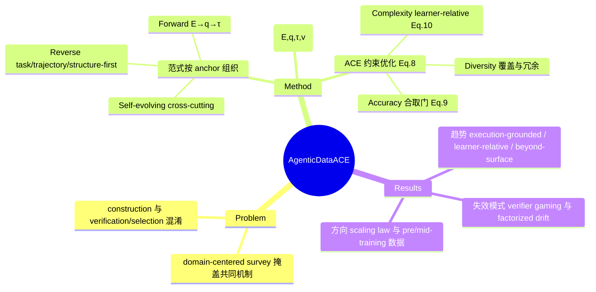

## Summary

跨域框架式 survey，回答"什么是好的 agentic 训练数据"：先把 agentic data 分解为公共对象 d=(E,q,τ,v)（environment specification、task signal、interaction realization、可选 verifier），再把数据生成形式化为 Accuracy 硬约束下最大化 learner-relative Complexity 与 Diversity 的 constrained distribution design（ACE lens）。生成范式按 primary anchor 与依赖结构而非应用域组织：forward（E→q→τ）、reverse（task-first / trajectory-first / structure-first）、adaptive & self-evolving 作 cross-cutting，并整理出 4 类 accuracy 验证、7 类 complexity 构造、6 类 diversity 扩展机制。核心论断：难点不是生成更多数据，而是随 agent 与环境演化持续分配 valid、informative、non-redundant 的经验。

## Problem & Motivation

LLM agent 训练日益依赖生成式交互数据（SFT 轨迹、RL 环境与任务），但现有工作按应用域组织（tool-use、web/GUI、SWE、embodied 各说各话），评测口径异质，导致两个问题：共同的生成机制被域标签掩盖；candidate construction（把数据造出来）与 verification/selection（判断数据是否有效、是否值得学）被混为一谈。作者要给这个分散的领域一套统一的分解词汇与质量目标，使不同域的 pipeline 可以在同一坐标系下比较。

## Method

框架分两层。

**第一层：数据对象分解（§2.4, Eq. 6）**。任何 agentic data 实例都是 d=(E,q,τ,v)：E 是可交互世界的规格（tool schema、状态、transition 规则、权限、终止条件），q 是任务信号（显式指令、目标状态、隐式意图或多轮渐进表达），τ 是交互实现（SFT 下通常是 demonstrated trajectory），v 是可选 verifier（schema checker、可执行测试、终态谓词、LLM judge 或混合）。生成范式按"先锚定哪个因子、其余因子如何依赖它"组织：

- **Forward（E→q→τ）**：先构造环境（真实 API/repo 爬取、LLM 合成如 ToolACE/ToolAlpaca、programmatic 构造），再从环境生成 grounded task（tool-graph、blueprint、stateful system），最后实现交互（teacher rollout、execution-guided、multi-agent simulation）。
- **Reverse**：task-first（q→E→τ，如 AgentInstruct 类能力定向合成）、trajectory-first（τ→q→E，如 OS-Genesis 的 GUI 轨迹反推任务、exploration-driven 收集）、structure-first（先 scaffold 后实现，如 tool-graph / blueprint realization）。
- **Adaptive & self-evolving**：cross-cutting，用积累的经验、验证反馈与模型行为闭环修订生成。

**第二层：ACE 约束优化（§3.4, Eq. 8）**。生成 = constrained distribution design：max_φ E[λ_C·mean g_z(C_z(d)) + λ_D·D(B_A)] s.t. Pr[A(d)=1] ≥ α。三个维度各有明确语义：

- **Accuracy（§4.1, Eq. 9）**：合取门 A(d) = V_E ∧ V_q|E ∧ V_τ|E,q ∧ V_v|E,q,τ，定义可行支撑集。合取意味着 correct-looking trajectory 不能补偿 infeasible task，correct terminal state 不能补偿接受 policy-violating shortcut 的 verifier——难度和多样性都不能补偿无效性。
- **Complexity（§5.1, Eq. 10）**：learner-relative，C_z(d) = 1 − Pr[v(d,τ)=1 | d,z]。同一实例对不同模型、tool access、budget 的 complexity 不同；有用数据位于 learner 能力边界附近的"moving band"。结构属性（horizon、依赖深度、分支、部分可观测）只是解释变量与生成控制旋钮，不是 universal difficulty score。
- **Diversity（§6.1）**：在合法支撑集内控制覆盖与冗余，按四个因子分别度量（环境 / 任务 / 交互行为 / generator provenance）。

在此坐标系下整理机制库：Accuracy 4 类（layered rule/model/human checking、constraint-grounded construction、execution/state-based verification、feedback-based repair & selective admission，§4.3）；Complexity 7 类（结构组合、信息渐进披露、环境与交互设计、completion/feedback 设计、演化式变换、failure-driven model-aware 校准、双向校准 scaffolding，§5.3）；Diversity 6 类（source 扩展、组合重组、exploration-first 发现、扰动/反事实变体、coverage-guided 平衡、域内实例化，§6.3）。覆盖域：tool-use/digital、web/GUI/computer-use、coding/SWE、embodied/social、scientific/formal agents（§6.3.6）。

## Key Results

Survey 无自有实验，产出是趋势判断与失效模式整理：

- **三个趋势转移**（Abstract，经全文机制整理支撑）：verification 从 plausibility 走向 execution-grounded；difficulty 从静态标签走向 learner-relative 校准；diversity 从 surface variation / 数据量走向行为覆盖与非冗余。
- **失效模式清单**：LLM judge 不一致且会继承 generator 的假设，meta-verification 只能减轻不能消除；对固定 verifier 反复优化会催生满足检查但不完成意图任务的解（verifier gaming）；因子分开生成时各自 plausible 却相互不一致（factorized generation drift）；LLM 模拟的环境响应可能编码错误的 state dynamics。
- **Discussion 方向（§7.1-7.4）**：ACE 目标下的 scaling law、real vs synthetic data 的取舍、agentic pre-training/mid-training 的数据生成、self-evolving agent 的持续数据分配。

## Evidence Ledger

| Claim ID | Claim | Type | Source locator | Evidence excerpt | Status |
|:--|:--|:--|:--|:--|:--|
| C1 | agentic data 定义为 factorized object d=(E,q,τ,v)，v 为可选 verifier | causal-mechanism | §2.3-2.4 / Eq. 6 | "we use the common data object d=(E,q,τ,v), where v is an optional verifier or reward interface" | source-verified |
| C2 | 生成形式化为 constrained distribution design：Accuracy 硬约束下最大化 Complexity 效用 + Diversity | causal-mechanism | §3.4 / Eq. 8 | "max_φ E[λ_C Σ g_z(C_z(d)) + λ_D D(B_A)] s.t. Pr[A(d)=1] ≥ α" | source-verified |
| C3 | Complexity 是 model-relative：C_z(d)=1−Pr[v(d,τ)=1\|d,z]，同一实例对不同模型/tool access/budget 难度不同 | causal-mechanism | §5.1 / Eq. 10 | "same instance can have different complexity for different models, tool access, or budgets" | source-verified |
| C4 | Accuracy 为合取门 V_E∧V_q∧V_τ∧V_v；轨迹正确不能补偿任务不可行 | causal-mechanism | §4.1 / Eq. 9 | "correct-looking trajectory does not compensate for an infeasible task" | source-verified |
| C5 | 范式按 anchor/依赖结构组织：forward（E→q→τ）、reverse（task/trajectory/structure-first）、self-evolving cross-cutting | benchmark-setting | §3.2-3.3 / Table 2 | "reverse generation for pipelines that do not follow the direct environment–task–trajectory order" | source-verified |
| C6 | 机制整理为 Accuracy 4 类、Complexity 7 类、Diversity 6 类 | benchmark-setting | §4.3.1-4.3.4 / §5.3.1-5.3.7 / §6.3.1-6.3.6 | 三组小节标题逐一匹配 | source-verified |
| C7 | 文献呈现三个趋势转移：execution-grounded accuracy、learner-relative complexity、diversity beyond surface variation | sota-novelty | Abstract | "a shift toward execution-grounded accuracy, learner-relative complexity, and diversity beyond surface variation or dataset size" | source-verified |
| C8 | 覆盖 tool-use、web/GUI/computer-use、coding/SWE、embodied/social、scientific/formal 五组域 | benchmark-setting | §6.3.6 | "Tool-use and Digital / Web, GUI, and Computer-use / Coding and Software-engineering / Embodied and Social / Scientific and Formal Agents" | source-verified |
| C9 | 对既有工作的定位批评：domain-centered 组织掩盖共同机制、混淆 construction 与 verification/selection | comparison | Abstract + Introduction | "domain-centered organization and heterogeneous evaluation often obscure common generation mechanisms and conflate candidate construction with verification and selection" | source-verified |
| C10 | ToolACE（2409.00920）已用 accuracy/complexity/diversity 作 function-calling 数据生成标准，与本文有共同作者（Xingshan Zeng、Weiwen Liu） | comparison | ToolACE abstract + 本文作者列表 | ToolACE: "generate accurate, complex, and diverse tool-learning data" | source-verified |
| C11 | Discussion 四方向：ACE 下 scaling law、real vs synthetic、pre/mid-training 数据生成、self-evolving agents | benchmark-setting | §7.1-7.4 | "Scaling Law under ACE Objective / Real and Synthetic Data under ACE / Agentic Pre-training and Mid-training / Self-Evolving Agents" | source-verified |
| C12 | 综述无配套 repo/paper-list 项目页（负向断言，基于 HTML 全文扫描） | license-code | 全文 | 无 "Code and data available at" 类声明；GitHub 链接均指向被引工作 | source-verified |

## Strengths & Weaknesses

**亮点**：这不是逐篇罗列式 survey，两个组织选择有真实洞察。其一，taxonomy 按"先锚定哪个因子"组织而非按应用域，使 OS-Genesis（GUI 轨迹反推）与 tool-graph realization（tool-use）落进同一个 trajectory-first / structure-first 格子——跨域机制的同构性被显式化了，这正是 domain-centered survey 给不出的。其二，complexity 的 learner-relative 定义（Eq. 10）把"难度"从数据的静态属性改为数据×学习者的关系属性，直接否定了用 horizon/步数当 universal difficulty score 的普遍做法；配合 accuracy 合取门"难度不能补偿无效性"的语义，给数据 pipeline 设计提供了可执行的优先级：先保支撑集合法，再谈难度与覆盖。失效模式整理（verifier gaming、factorized drift、LLM judge 继承 generator 假设）比机制罗列更有信息量。

**局限**：（已知，C10）ACE lens 直接承继自作者自家 ToolACE 的 accuracy/complexity/diversity 三标准，本文是把自家 pipeline 经验事后普适化为领域框架——lens 本身在自家数据上被验证过是优点，但也意味着文献被裁剪进这套坐标的风险（例如 reward shaping、off-policy 数据复用等不以"生成"为中心的数据问题着墨少）。（已知）Eq. 8 是概念形式化：λ_C、λ_D、g_z 均无估计方法，论文没有用该目标做任何重排或 meta-analysis 来演示 lens 的判别力，也未给出覆盖论文数等定量统计；D(B_A) 的度量停留在批评 surface metrics，未给出可操作替代。（已知，C12）无配套 repo/paper list，作为 survey 的工程可用性打折。（推测）该框架的检验标准应是能否预测"哪类数据对哪个 learner 有效"，这需要后续实证工作，正文未提供。

## Mind Map

## Notes

- 同组闭环值得留意：本文一作/末作（Xingshan Zeng、Weiwen Liu）与 [[2608-EnvACE]]（world rehearsal 内化环境）作者重合，ToolACE→EnvScaler→EnvACE→本 survey 构成华为诺亚在 agentic data 上的完整叙事线；survey 中 forward generation 的 LLM 合成环境一支基本是自家谱系。
- 与 [[2608-CoEvolutionSurvey]] 的 self-evolving 视角互补：那边以 agent-environment 共演化为主轴，这边把 self-evolving 降为 cross-cutting 生成范式并给了质量坐标系。
- [[2601-Learning with Challenges- Adaptive Difficulty-Aware Data Generation for Mobile GUI Agent Training]] 是 §5.3.6（failure-driven model-aware calibration）在 GUI 域的具体实例，可用 C_z 语言重述。
- 可检验的问题：learner-relative complexity band（§5.1 "moving band"）是否真能预测数据效用？拿两个能力不同的模型在同一批生成数据上做 per-instance solve-rate 分桶训练即可初步验证，成本不高。
