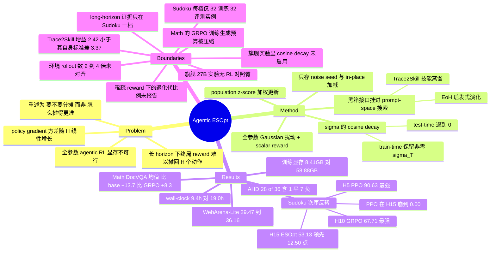

## Summary

Agentic ESOpt 用 evolution strategies 替代 backprop 训练 long-horizon LLM agent：采 G 个全参数 Gaussian 扰动、用 scalar 环境 reward 做 z-score 加权更新，训练侧显存等于推理显存（Qwen3.5-4B 8.41GB vs GRPO 58.88GB / PPO 89.40GB），并加一条 σ 的 cosine decay。最干净的结果是受控 Sudoku 上的**次序反转**——H\*=5 时 PPO 最强（90.63）、H\*=10 时 GRPO 最强（67.71）、H\*=15 时才轮到 ESOpt（53.13，比更强的 GRPO 高 12.50 点，PPO 崩到 0.00）——这比一个全局领先的数字更有信息量。但三个 headline 场景各有口径问题：WebArena-Lite 的 +6.69 点没有任何 RL 对照臂（作者称 27B 全参 RL 在 4×H100 上不可行），且该实验里 σ 是常数、论文自己提出的 cosine decay 并未启用；AHD 的 "28 of 36" 含 1 平 7 负且多数 ACO 侧差异在 0.1–0.4% 量级。

## Problem & Motivation

论文要回答的问题是可证伪的：**当 agent 的 horizon 变长、reward 只在终局出现时，action-space 的 policy gradient 是不是还应该是默认选择？**

作者给的机制诊断有两层。工程层：agentic RL 要存 activation、optimizer state 并沿整条轨迹反传，模型一大就做不动全参数微调。算法层更重要——终局 reward 要被摊回 H 个动作，而 policy gradient 的估计量形如 $\hat g_{\mathrm{PG}} = (R-b)\sum_{t=1}^{H}\nabla_\theta \log \pi_\theta(a_t|s_t)$，在"return 与任一单步弱相关、各步 score 项近似不相关"的假设下方差随 H 近似线性增长。ES 的估计量 $\hat g_{\mathrm{ES}} = (R-b)\bm\epsilon/\sigma$ 里，parameter-score 因子 $\bm\epsilon/\sigma$ **不含对 H 的求和**——一次扰动对应一条完整轨迹，终局 return 被直接归给"一次连贯的策略变化"，而不是被要求在 H 个动作之间做区分。

这个 formulation 值得单独记一笔：它把 long-horizon credit assignment 从"怎么把 reward 摊得更准"改成"要不要摊"。本 vault 的 [[Topics/StepCreditAssignment-Survey]] 整条线（PRM、prefix rollout、终局回溯、log-ratio 分解）都在解第一个问题；Agentic ESOpt 是第一篇明确主张**放弃分摊**并给出受控证据的工作。

作者对自己的理论主张做了少见的自我限定（C24）：明确声明该分析**不断言** ES 的总方差与 H 无关，也**不断言** ES 普遍优于 policy gradient——ES 自身也会因 return 分布变稀疏而变难，还受 d、σ、G 与局部几何影响。可比较的预测只是"当其他困难来源大致相当时，horizon 增长会给 policy gradient 额外加一项 action-score 累加，而不会给 ES 的 parameter score 加"。

作者还划了一条对照范围：Agentic SFT 与 OPD 需要 scalar reward 之外的标注（专家动作 / 更强模型的 token 分布），因此被排除在比较之外；对照只保留同样只需 scalar environment reward 的 Agentic PPO 与 Agentic GRPO。

## Method

**核心更新规则。** 采 $G$ 个扰动 $\bm\epsilon_1,\dots,\bm\epsilon_G \sim \mathcal N(0,I)$，评估被扰动的 agent 得到 $R_i$，population 内做 z-score 归一化，然后

$$\theta_{t+1} = \theta_t + \frac{\alpha}{G}\sum_{i=1}^{G}\hat R_i \bm\epsilon_i.$$

实现上只存 noise seed、用 in-place 加减构造每个扰动模型，因此训练显存等于推理显存。注意作者主动说明：实现的更新**省掉了标准 ES 估计量里的 $1/\sigma$ 因子**，由 $\alpha$ 充当有效步长——这不是笔误而是实现选择。

**σ 的 cosine decay（唯一的算法新增件）。** Lemma 1 给出 Gaussian smoothing 的偏差展开 $J_\sigma = J + \frac{\sigma^2}{2}\mathrm{Tr}(\nabla^2_\theta J) + O(\sigma^4)$：二阶项在最大化目标下惩罚尖锐局部最优、偏好平坦邻域，所以 σ 大 = 正则更强但偏差更大。于是按 $\sigma_t = \sigma_T + (\sigma_0-\sigma_T)\frac{1+\cos(\pi t/T)}{2}$ 从大到小退火。train-time 保留非零 $\sigma_T$ 换取正则化，test-time 退到 0 以消除对当前任务的目标偏差。

**prompt–parameter co-evolution。** 因为反馈接口是黑箱 scalar，ES 更新可以直接挂进已有的 prompt-space 搜索外循环，交替更新 $\theta_{t+1} = \mathcal U_{\mathrm{ES}}(\theta_t; c_t, \mathcal D_t)$ 与 $c_{t+1} = \mathcal U_c(c_t; \mathcal D_t)$。论文用两个外循环做了实例化：Trace2Skill（把轨迹蒸成 skill 文档，见 [[Papers/2605-SkillOpt]] 同族）与 EoH（heuristic 种群的 crossover/mutation）。

**方法的组件账很短**——去掉包装，Agentic ESOpt = 标准全参数 ES + population z-score + σ 的 cosine 退火 + "把更新塞进 prompt 搜索循环"这一工程接法。这既是优点（simple、可组合）也是评估上的负担：能被 ablate 的新组件本来就只有 σ schedule 一条。

## Key Results

### 受控 Sudoku：全文最有信息量的实验（Qwen3.5-4B，4×H100）

环境只给终局 reward，每个合法动作最多填一格，因此遮 5/10/15 格即 $H^*\in\{5,10,15\}$（最小成功 horizon）。训练/评测各 32 个实例，3 次评测取均值±标准差。

| Method | 训练显存 | H\*=5 | H\*=10 | H\*=15 |
|:--|:--|:--|:--|:--|
| Qwen3.5-27B（仅评测） | 51.75GB | 86.46±3.90 | 50.00±2.55 | 28.13±2.55 |
| Qwen3.5-4B（base） | 8.41GB | 63.54±7.80 | 31.25±4.42 | 10.42±1.47 |
| + Agentic PPO | 89.40GB | **90.63±0.00** | 56.25±0.00 | **0.00±0.00** |
| + Agentic GRPO（temp 0.7） | 58.88GB | 80.21±1.47 | 44.79±2.95 | 30.21±2.95 |
| + Agentic GRPO（temp 1.0） | 58.88GB | 85.42±1.47 | **67.71±1.47** | 40.63±2.55 |
| **+ Agentic ESOpt（G=32）** | **8.41GB** | 89.58±2.95 | 62.50±2.55 | **53.13±2.55** |
| w/o σ decay（Vanilla ES） | 8.41GB | 85.42±3.90 | 55.21±5.89 | 42.71±3.90 |
| w/o $\sigma_T$（即 $\sigma_t=0$） | 8.41GB | 85.42±3.90 | 54.17±3.90 | 28.13±2.55 |

**次序反转本身才是结果。** PPO → GRPO → ESOpt 随 $H^*$ 依次接管；作者在 Takeaway 1 里明确写 "Agentic ESOpt is not uniformly strongest at short horizons"。这种自曝式的呈现比一个全表最优更能支撑机制论断——如果 ESOpt 在所有 horizon 都赢，反而说明赢的原因可能是别的（更好的 decoder 匹配、更多 rollout）。

PPO 在 $H^*$=15 掉到 0.00：作者归因于稀疏终局 reward 下 critic 学不到可靠 value，advantage 估计失去信息。GRPO 变体则在训练早期就把轨迹拉长到 45 轮交互上限，而 ESOpt 收敛到 15.41 轮（接近 15 的理论下界）。**"realized horizon 是否向最短成功路径收敛"是本文提出的一个便宜且可复用的诊断量**，DocVQA 上观察到同向现象。

**计算与 wall-clock（Table 2，同样 4×H100，均跑满硬件）**

| Method | H\*=5 | H\*=10 | H\*=15 |
|:--|:--|:--|:--|
| Agentic GRPO | 3.2 EFLOPs / 5.4 h | 7.6 EFLOPs / 13.1 h | 10.9 EFLOPs / 19.0 h |
| Agentic ESOpt（G=32） | 3.1 EFLOPs / 3.1 h | 6.3 EFLOPs / 5.8 h | 9.4 EFLOPs / 9.4 h |

FLOPs 口径来自 Appendix C.5：ES 每条轨迹只有一次 policy forward（$2PL$），GRPO 是 policy forward + reference forward + backward（$8PL$），PPO 再加 critic 前后向（$14PL$）。所以 $\mathrm{FLOPs_{ES}}/\mathrm{FLOPs_{GRPO}} \approx (2\times32)/(8\times8) = 1$——**4 倍的 population 恰好被 4 倍更低的单轨迹成本抵消**。PPO 被限制在 500 步以维持可比预算。GRPO 实测 FLOPs 反而更高，作者归因于其长 horizon 下轨迹变长。

### ReAct-style Math / DocVQA（Qwen3.5-4B，4×A100）

Math 训 400 道 DAPO、评 100 道 held-out DAPO + 30 道 AIME 2026；DocVQA 训 50 题 validation 子集、评 100 题 held-out。两边 horizon 上限均 50 轮。

| Model | Method | DAPO Mean@4 | DAPO Pass@4 | AIME26 Mean@4 | AIME26 Pass@4 | DocVQA Acc Mean@4 | DocVQA Acc Pass@4 |
|:--|:--|:--|:--|:--|:--|:--|:--|
| Qwen3.5-27B | No Skill（仅评测） | 65.8 | 87.0 | 76.7 | 93.3 | 51.8 | 69.0 |
| Qwen3.5-4B | No Skill | 63.0 | 86.0 | 55.8 | 86.7 | 40.3 | 53.0 |
| Qwen3.5-4B | Agentic GRPO + No Skill | 68.8 | 83.0 | 58.3 | 76.7 | 48.0 | 56.0 |
| Qwen3.5-4B | **Agentic ESOpt + No Skill** | **76.8**（↑13.8） | 86.0（**±0.0**） | **70.8**（↑15.0） | 96.7 | **52.5**（↑12.3） | 61.0 |
| Qwen3.5-4B | Trace2Skill | 64.8 | 82.0 | 50.8 | 83.3 | 47.3 | **69.0** |
| Qwen3.5-4B | Agentic GRPO + Trace2Skill | 67.8 | 85.0 | 50.0 | 80.0 | 49.5 | 60.0 |
| Qwen3.5-4B | **Agentic ESOpt + Trace2Skill** | **77.3** | 86.0 | **71.7** | 96.7 | **52.8** | 61.0（**↓8.0**） |

三项指标平均：比 base 高 13.7 点、比 Agentic GRPO 高 8.3 点。Takeaway 3 的"在每个 Pass@4 指标上都超过 matched GRPO"经核查在全部 8 个对照格上成立（verifier 逐格核对）。

**但对非 GRPO 基线有两处回退**：DAPO Pass@4 与 base 持平（86.0 vs 86.0）；Trace2Skill 组合在 DocVQA ANLS Max@4 −0.0118、DocVQA 准确率 Pass@4 **−8.0**（69.0 → 61.0）。也就是说 "不牺牲 Pass@K 覆盖"这句话只在**相对 GRPO** 时成立；相对 skill-only 基线，DocVQA 的 best-of-4 覆盖被打掉了 8 点。

### WebArena-Lite（Qwen3.5-27B，4×H100，165 任务 × 3 次评测）

| Model | Method | Reddit(21) | GitLab(32) | CMS(35) | Map(28) | OSS(46) | Dataset Avg. |
|:--|:--|:--|:--|:--|:--|:--|:--|
| GPT-5.4 | No Skill（参考点） | 47.62 | 46.88 | 46.67 | 19.05 | 21.01 | 34.14±0.76 |
| GPT-5.4-mini | No Skill | 39.68 | 29.17 | 30.48 | 13.10 | 13.77 | 23.23±1.14 |
| Qwen3.5-27B | No Skill | 50.79 | 35.42 | 41.90 | 8.33 | 21.01 | 29.47±1.14 |
| Qwen3.5-27B | **Agentic ESOpt + No Skill** | 49.21（**↓1.58**） | 43.75 | 49.52 | 14.29 | 30.43 | **36.16±0.70**（↑6.69） |
| Qwen3.5-27B | Trace2Skill | 49.21 | 39.58 | 46.67 | 13.10 | 28.26 | 33.94±**3.37** |
| Qwen3.5-27B | **Agentic ESOpt + Trace2Skill** | 52.80 | 41.67 | 50.48 | 10.71（**↓2.39**） | 32.61 | **36.36±0.86**（↑2.42） |

数据划分是干净的（C21）：训练集取自 812 个原始 WebArena 任务中排除掉映射到 WebArena-Lite 的 165 题后剩下的 647 题，站点分层切成 582 训练 + 65 验证；论文明确写 WebArena-Lite 任务从不贡献参数更新 reward 或 skill 蒸馏输入。

预算也是对齐的（C14）：ESOpt 70 代 × G=8 × 每代 8 个任务 = 4,480 次评估；Trace2Skill 基线 70 轮 × 8 任务 × 8 rollout = 同样 4,480 次。**这是全文唯一一处 rollout 数严格 matched 的对照。**

### 测试时 AHD（LLaMA-3.1-8B-Instruct，8×3090 24GB）

把 ES 更新挂进 EoH / 独立 Sample 两个外搜索框架，proposal 预算不变。constructive 侧（TSP/KP/ASP，T∈{1000,2000}）21/24 改善；ACO 侧（TSP/CVRP/BPP）7/12；合计 **28/36，含 1 平 7 负**。20 次重复运行的显著性检验：TSP N=50 EoH 6.5517±0.0729 vs +ESOpt 6.5007±0.0868（p=0.0258）、KP N=100 40.1562±0.0024 vs 40.1578±0.0017（p=0.0100），单侧等方差 t-test 均在 0.05 显著。运行时开销 +9.7%–18.0%。

组件 ablation（Table 15，constructive TSP N=50, T=1000）：EoH 6.545 → +ESOpt **6.463**；w/o ES（只加噪不更新）6.484；w/o cosine schedule 6.480。两个消融件各自只挪动约 0.3%，且这是全文唯一一处把"ES 更新"与"σ 调度"分开测的实验。

### 群体规模与模型能力（Vanilla ES，15 轮 Sudoku）

| Backbone | G | Best test | Final test | Δ best | Δ final |
|:--|:--|:--|:--|:--|:--|
| Qwen3.5-4B | 8 | 5.10 | 2.95 | – | – |
| Qwen3.5-4B | 16 | 35.42 | 22.92 | +594.5% | **+677.0%** |
| Qwen3.5-9B | 8 | 30.21 | 30.21 | – | – |
| Qwen3.5-9B | 16 | 37.50 | 30.21 | +24.1% | **0.0%** |

作者自己标为 preliminary：**只有两个 backbone、一个设置、且用的是 Vanilla ES 而非完整 Agentic ESOpt**（verifier 确认该消融段落声明"cosine perturbation schedule not used"、σ 固定 5×10⁻⁴）。解释是"更强的 pretrained backbone 周围有用方向更密"，援引 Neural Thickets。这条被写进摘要与结论用来支撑"可以扩到 frontier LLM"，但证据强度是 n=2。

## Evidence Ledger

> 独立 verifier 逐条回原文核对；除 C16 外全部 `source-verified`。C16 是本笔记 finder 侧的表述错误，已按 verifier 提供的 locator 与原文数值在正文中更正。

| Claim ID | Claim | Type | Source locator | Evidence excerpt | Status |
|:--|:--|:--|:--|:--|:--|
| C1 | Sudoku H\*=15：ESOpt 53.13±2.55，比更强 GRPO 的 40.63±2.55 高 12.50 点；PPO 0.00±0.00 | number | Table 1；§4 正文 | "At H∗=15, Agentic ESOpt becomes strongest at 53.13%, 12.50 percentage points above GRPO at 40.63%" | source-verified |
| C2 | ESOpt 在短 horizon 并非最强：H\*=5 PPO 90.63 > ESOpt 89.58 > GRPO 85.42；H\*=10 GRPO 67.71 > ESOpt 62.50 > PPO 56.25 | comparison | §4 正文；Table 1 | "At H∗=10, GRPO leads with 67.71%, followed by Agentic ESOpt at 62.50% and PPO at 56.25%" | source-verified |
| C3 | 训练显存：ESOpt 8.41GB（= Qwen3.5-4B 推理显存）、GRPO 58.88GB、PPO 89.40GB；论文称低 85.7% | number | Table 1；§4 "Compute and wall-clock efficiency" | "requires only 8.41GB, equal to the inference memory of the Qwen3.5-4B backbone and 85.7% below GRPO's 58.88GB" | source-verified |
| C4 | Table 2 计算/时间：GRPO 3.2/7.6/10.9 EFLOPs、5.4/13.1/19.0 h；ESOpt 3.1/6.3/9.4 EFLOPs、3.1/5.8/9.4 h（H\*=5/10/15，同 4×H100） | number | Table 2 | "Agentic GRPO \| 3.2 EFLOPs \| 5.4 h \| 7.6 EFLOPs \| 13.1 h \| 10.9 EFLOPs \| 19.0 h" | source-verified |
| C5 | Sudoku 对照 matched 的是 model-side FLOPs 而非 rollout 数：ESOpt G=32 vs GRPO 8 rollout（4×），FLOPs 比 (2×32)/(8×8)≈1 | benchmark-setting | Appendix C.5 | "Agentic ESOpt evaluates G_ES=32 perturbation directions per prompt, whereas Agentic GRPO uses G_GRPO=8 rollouts" | source-verified |
| C6 | Math/DocVQA 上 ESOpt 只用约**一半** model-side FLOPs：(2×16)/(8×8)=1/2 | number | Appendix C.5 | "requires approximately half the model-side training FLOPs of the matched Agentic GRPO configuration on these two tasks" | source-verified |
| C7 | Math 的 GRPO 基线在训练时把 4096 token/turn 生成配置**压缩**了以满足 4×A100 显存约束；作者称只影响训练 rollout 不影响评测 | benchmark-setting | Appendix D.2.2 | "we appropriately compress the 4096-token per-turn generation configuration to satisfy the training-memory constraint on four A100 80GB GPUs" | source-verified |
| C8 | ESOpt+No Skill：DAPO Mean@4 76.8（+13.8）、AIME26 70.8（+15.0）、DocVQA Acc 52.5（+12.3）；三项均值比 base +13.7、比 GRPO +8.3 | number | Table 3；§5.1 | "improves the base model by 13.7 points and Agentic GRPO by 8.3 points" | source-verified |
| C9 | 对非 GRPO 基线存在回退：DAPO Pass@4 与 base 持平（Δ0.0）；ESOpt+Trace2Skill 在 DocVQA ANLS Max@4 −0.0118、Acc Pass@4 −8.0 | number | Table 3 Δ 行 | "Δ vs Trace2Skill \| ↑12.5 \| ↑4.0 \| ↑20.8 \| ↑13.3 \| ↑0.0474 \| ↓0.0118 \| ↑5.5 \| ↓8.0" | source-verified |
| C10 | Takeaway 3 "在每个 Pass@4 指标上超过 matched GRPO" 在全部 8 个对照格上成立（86.0>83.0、96.7>76.7、0.6507>0.5398、61.0>56.0；86.0>85.0、96.7>80.0、0.6654>0.5692、61.0>60.0） | comparison | Takeaway 3；Table 3 | "both Agentic ESOpt variants outperform their matched Agentic GRPO baselines on every reported Pass@4 metric" | source-verified |
| C11 | WebArena-Lite：No Skill 29.47±1.14 → 36.16±0.70（+6.69）；Trace2Skill 33.94±3.37 → 36.36±0.86（+2.42） | number | Table 4；§5.2 | "improves the Qwen3.5-27B No Skill baseline from 29.47% to 36.16%, a gain of 6.69 percentage points" | source-verified |
| C12 | Table 4 含分类回退：No Skill 对中 Reddit −1.58；Trace2Skill 对中 Map −2.39 | number | Table 4 Δ 行 | "Δ vs No Skill \| ↓1.58 … Δ vs Trace2Skill \| ↑3.59 \| ↑2.09 \| ↑3.81 \| ↓2.39" | source-verified |
| C13 | WebArena-Lite **没有任何 Agentic RL 对照臂**；作者称 27B 全参 RL 在 4×H100 上已不可行，故增益只对冻结基线成立 | benchmark-setting | §5.2；Table 4 | "At this model scale, full-parameter Agentic RL is no longer practical on four H100 80GB GPUs" | source-verified |
| C14 | WebArena-Lite 两臂 rollout 预算 matched：ESOpt 70 代 × G=8 × 8 任务（每代 64 次评估）；Trace2Skill 70 轮 × 8 任务 × 8 rollout | benchmark-setting | Table 12；Appendix D.4.3 | "performs 70 full-parameter ES updates with G=8 on eight training tasks per generation" | source-verified |
| C15 | WebArena-Lite 设置里 σ 为**常数** 1.5×10⁻³→1.5×10⁻³，即论文提出的 cosine decay 未在该旗舰 27B 实验中启用 | benchmark-setting | Appendix D.4.3；Table 19 | "σ0=1.5×10−3, σt=1.5×10−3" / "WebArena-Lite keeps σ=1.5×10−3" | source-verified |
| C16 | ~~σ schedule 的 Sudoku ablation 只在 H\*=15 报告~~ | benchmark-setting | Table 1 全部三列 | "w/o σ decay (Vanilla ES) \| 8.41GB \| 85.42±3.90 \| 55.21±5.89 \| 42.71±3.90" | **contradicted** — verifier 更正：ablation 在 H\*=5/10/15 三档均有（w/o σ decay 85.42/55.21/42.71；w/o σ_T 85.42/54.17/28.13）。原 claim 引用的三个 H\*=15 数值本身正确。正文已按更正版本表述 |
| C17 | AHD 组件 ablation（Table 15，constructive TSP N=50, T=1000）：+ESOpt 6.463、w/o ES 6.484、w/o cosine 6.480、EoH 基线 6.545 | number | Table 15 | "Agentic ESOpt + EoH \| 6.463 … w/o ES (noise-only) \| 6.484 … w/o cosine schedule \| 6.480" | source-verified |
| C18 | "28 of 36" = constructive 21/24 + ACO 7/12，整体含 1 平 7 负 | number | §6；Appendix D.5.2 | "improves 28 of 36 matched method–budget settings across 12 test sets and six scenarios, with one tie and seven regressions" | source-verified |
| C19 | 多个 ACO 侧 Δ 极小：T=1000 时 BPP 0.17%/0.15%（回退）、CVRP-50 0.68%；T=2000 时 TSP 0.08%/0.36%、BPP 0.13%/0.10% | number | Table 14 | "Δ vs EoH \| ↓2.53% \| ↓5.57% \| ↓0.68% \| ↑2.53% \| ↑0.17% \| ↑0.15%" | source-verified |
| C20 | 重复实验显著性（20 次/方法，单侧等方差 t-test）：TSP N=50 6.5517±0.0729 vs 6.5007±0.0868，p=0.0258；KP 40.1562±0.0024 vs 40.1578±0.0017，p=0.0100 | number | Table 17 | "TSP (N=50, ↓) \| 6.5517±0.0729 \| 6.5007±0.0868 \| 0.0258" | source-verified |
| C21 | WebArena-Lite 划分排除污染：训练取自排除 165 题后剩余的 647 题，站点分层为 582 训练 + 65 验证；WebArena-Lite 任务从不贡献 reward 或 skill 输入 | benchmark-setting | Appendix D.4.2 | "Site-stratified splitting of the remaining 647 tasks yields 582 training tasks and 65 validation tasks" | source-verified |
| C22 | 全量评测曲线从 29.50% 起、70 次更新后到 35.76%，中间 checkpoint 非单调——与 Table 4 的 36.16%（3 次均值）不是同一个数 | number | Figure 10 caption；Appendix D.4.4 | "the curve starts from the 29.50% base checkpoint and reaches 35.76% after 70 updates" | source-verified |
| C23 | 群体规模研究：4B G=8→16 final 2.95→22.92（+677.0%）、best 5.10→35.42；9B best 30.21→37.50（+24.1%）、final 30.21→30.21（0.0%）；且该研究用 **Vanilla ES**、仅两个 backbone、仅 15 轮 Sudoku | number | §7.1；Appendix D.1.3 | "doubling G changes final-test success by +677.0% for 4B but 0.0% for 9B" | source-verified |
| C24 | 理论主张自我限定：不断言 ES 总方差与 H 无关，也不断言 ES 普遍优于 policy gradient；依赖 weak-correlation 假设 | causal-mechanism | Appendix C.3 "Scope of the scaling comparison" | "the analysis does not assert that the total variance of ES is independent of H, nor that ES universally dominates policy gradients" | source-verified |
| C25 | 作者在 limitation 承认：ESOpt 用更多独立环境评估换 backprop 成本，当环境评估本身极贵时该 trade-off 会变得不利 | causal-mechanism | Appendix A.1 | "This trade-off may become less favorable when environment evaluation itself is extremely expensive" | source-verified |
| C26 | Sudoku 各臂解码配置不同：GRPO 报两套（0.7/0.8/20 与 1/1/−1），PPO 训练用 1/1/−1，ESOpt 训练与评测都用 0.7/0.8/20；PPO 被限制 500 步以维持可比预算 | benchmark-setting | Table 1 脚注；Appendix D.1.2；C.5 | "Agentic PPO is capped at 500 training steps to remain within a comparable compute budget" | source-verified |
| C27 | Sudoku 数据集很小：每个 H\* 仅 32 训练 + 32 评测实例，3 次评测取均值±标准差 | benchmark-setting | §4 Experimental Setup | "We create a 32-instance training dataset and a 32-instance evaluation dataset for each H∗" | source-verified |
| C28 | Math/DocVQA 的 rollout 数同样未 matched：DocVQA GRPO 5,760 条 vs ESOpt 40×256=10,240 条；Math GRPO 3,200 条 vs ESOpt 25×256=6,400 条 | benchmark-setting | Tables 8–11；D.2/D.3 | "Total trajectories \| 5,760" / "Each generation contains 16×16=256 direction–question trajectories" | source-verified |
| C29 | AHD 在线开销：constructive Sample 框架 T=1000 下增加 5.0–7.4 分钟，即 +9.7%–18.0% | number | Table 18；Appendix D.5.2 | "adds only 5.0–7.4 minutes, corresponding to a 9.7%–18.0% increase over the original Sample runtime" | source-verified |
| C30 | 代码以 MIT License 发布于 github.com/zz1358m/Agentic-ESOpt | license-code | Appendix F.1；首页脚注 | "The code introduced by this study is released under the MIT License" | source-verified |
| C31 | 更新幅度分布（Table 6，WebArena Qwen3.5-27B，σ=1.5×10⁻³）：96.26% 的最终参数更新在 σ 以内、99.42% 小于 2.0×10⁻³ | number | Table 6；Appendix A.1 | "96.26% of the final parameter updates remain within the perturbation scale σ, and 99.42% are smaller than 2.0×10−3" | source-verified |
| C32 | 元数据：2026-08-18 提交 cs.LG，arXiv:2608.17310v1；作者 Zhi Zheng 等 6 人；机构 NUS / SUSTech / Oxford | metadata | arXiv abs 页；正文首页 | "arXiv:2608.17310v1 [cs.LG] 18 Aug 2026" | source-verified |
| C33 | 标题不一致：arXiv 元数据为 "…with Minimal GPU Requirements"，正文/HTML 标题为 "…with Minimal GPU **Memory** Requirements" | metadata | abs 页 citation_title vs 正文标题块 | "Agentic ESOpt: Fine-Tuning Long-Horizon LLM Agents with Minimal GPU Memory Requirements" | source-verified |
| C34 | AHD 全部实验用 LLaMA-3.1-8B-Instruct，跑在 8×3090 24GB 集群上——与 train-time 实验的 Qwen3.5 系列不是同一 backbone | benchmark-setting | Appendix D.5.1；Table 5 caption | "Experiments of AHD are done on a cluster of eight 3090 24GB GPUs … All runs use LLaMA-3.1-8B-Instruct" | source-verified |
| C35 | Sudoku 只有终局 reward，H\* 由遮格数（5/10/15）控制；作者说明 realized horizon 可能远超 H\*，且增大 H\* 同时改变了其他难度维度，不是纯粹的 delay 效应 | benchmark-setting | §4；Appendix C.3 | "Increasing H∗ in this natural task family also changes aspects of task difficulty … instead of identifying a pure delay effect" | source-verified |

## Strengths & Weaknesses

**Strengths**

- **次序反转是本文真正的实验设计贡献。** 绝大多数方法论文报的是"我在所有档位都赢"，本文报的是"我在 H\*=5 输给 PPO、在 H\*=10 输给 GRPO、到 H\*=15 才赢"，并在 Takeaway 1 里把这个非一致性当成论点本身。这是一个**条件性主张**（advantage regime）而不是排名主张，可证伪性远高于前者，也让"赢是因为 decoder 匹配 / 更多 rollout"这类替代解释更难成立——若真是那样，ESOpt 应当在三档都赢。
- **它是本 vault 目前唯一在固定环境内扫 horizon 的工作，直接命中 [[Topics/StepCreditAssignment-Survey]] Open Problem #3。** 该 Open Problem 的原话是"步级粒度的净增益在数学域很小、在 agent 域被报告为大，但没有工作在同一环境内改变 horizon 来验证"。Sudoku 的 $H^*\in\{5,10,15\}$ 正是这个实验，且给出的答案指向一个此前没被记录的方向：**不是"horizon 越长越该做细粒度 credit assignment"，而是"horizon 越长越该放弃分摊"**。这对该 survey 的整条技术路线是一个反向数据点，值得单立一节。
- **理论主张的自我限定写得比结论更清楚（C24）。** 明确说不断言 ES 总方差与 H 无关、不断言 ES 普遍占优、依赖 weak-correlation 假设，并单独用一段区分 realized horizon $H$（理论量）与 minimum successful horizon $H^*$（实验控制量），还承认增大 $H^*$ 会同时改变其他难度维度而非纯粹 delay（C35）。这几段的存在让 §4 的实验读起来是在检验一个预测，而不是在事后编故事。
- **FLOPs 记账是显式的、可复核的、而且对自己不利的方向也算了（Appendix C.5）。** $2PL$ / $8PL$ / $14PL$ 的分解写明了每一项来自哪（policy forward / reference forward / backward / critic），并给出 $(2\times32)/(8\times8)\approx1$ 与 $(2\times16)/(8\times8)=1/2$ 两个具体比值。对照本 vault 的常见状况（[[Topics/StepCreditAssignment-Survey]] Open Problem #6 记录"每篇声称降低 X 倍标注成本的工作都在用自建口径，横向不可比"），这是少见的合规样本——尽管口径本身把环境执行排除在外（见下）。
- **WebArena-Lite 的数据卫生与预算对齐是全文最规范的一处（C21、C14）。** 训练集从原始 812 题中排掉 165 题映射后站点分层切分，明确声明评测任务从不贡献 reward 或 skill 输入；两臂 rollout 数严格相等（4,480 vs 4,480）。这是本文唯一一个既 matched 又无污染的对照，可惜它对的是 skill 基线而不是 RL。
- **realized-horizon 收敛度是一个便宜的可复用诊断量。** H\*=15 上 GRPO 在 step 60 就撞满 45 轮上限，ESOpt 收在 15.41 轮；DocVQA 训练中观察到同向分化。这个量不需要额外标注、不需要 verifier，只需记录轨迹长度，就能在训练早期区分"在学解题"和"在学拖长轨迹"。**对 GUI/web agent 训练这是可以直接搬走的监控项。**

**Weaknesses**

- **"long-horizon" 的证据只在一个设置上成立，而旗舰实验恰恰不在那个 regime 里。** 四个场景的 horizon 分布是：Sudoku $H^*$ 最大 15（交互上限 45）；ReAct Math/DocVQA "usual $H>10$"、上限 50 轮；WebArena-Lite 每任务上限 **30 个浏览器动作**，而 [[Topics/AgentHarness-Design]] 记录该 benchmark 平均 8–12 步；AHD 每个候选是**一次** ≤768 token 的代码生成，外面套演化搜索循环。也就是说，支撑核心机制论断（horizon 增长使 policy gradient 方差累加）的只有 Sudoku 一档，而**被放进摘要的两个 headline 数字（WebArena +6.69、AHD 28/36）来自 horizon 最短和几乎没有 horizon 的两个设置**。摘要句"On long-horizon Sudoku, Agentic ESOpt outperforms RL methods by 12.50%"还省略了 horizon 条件——正文 Takeaway 1 明说不一致占优，摘要读起来像全局占优。〔AHD 为单轮生成这一点是本笔记从 §6 与 Appendix D.5.1 的流程描述推出的，未列入独立核查清单。〕
- **旗舰模型-scaling 实验里没有 RL 对照臂，"ES 比 RL 好"在 27B 上完全没有被测（C13）。** 作者的理由（27B 全参 RL 在 4×H100 上不可行）恰恰是本文的卖点，逻辑上自洽，但结果是：+6.69 点这个数字只说明"ES 微调比不微调好"，不说明"ES 比 RL 好"。可以做而没做的对照至少有两个——LoRA-based agentic GRPO（内存可行）、或把 27B 换成能跑 RL 的规模再做同环境 A/B。verifier 另注意到一处内部不一致：Appendix D.4.2 提到 skill 蒸馏的三个种子模型里包含 "Agentic RL model"，但全文没有任何 WebArena RL 结果。
- **论文提出的唯一算法新增件（σ cosine decay）在旗舰实验里被关掉了（C15）。** WebArena-Lite 的 $\sigma_0=\sigma_T=1.5\times10^{-3}$ 常数。这意味着 27B 上跑的实际是 Vanilla ES + z-score，而不是 Agentic ESOpt 的完整形态。群体规模研究（C23）同样明说用 Vanilla ES。于是 σ schedule 的全部证据集中在 Sudoku（Table 1，三档均有，H\*=15 上 53.13 vs 42.71 vs 28.13）与 AHD 的一格（6.463 vs 6.480，差 0.26%）。**"novel component 在最大规模的实验里没被使用"是一个需要在引用时明说的限定。**
- **算力对齐只在 model FLOPs 一个轴上成立，环境 rollout 轴上系统性偏向处理臂。** Sudoku 4×（G=32 vs 8 rollout，C5）、Math 2×（6,400 vs 3,200）、DocVQA 约 1.78×（10,240 vs 5,760）（C28）。作者的辩护是"每条轨迹只需前向，所以同 FLOPs 下能跑更多轨迹"，且在 limitation 里诚实承认当环境评估昂贵时这个 trade 会翻转（C25）。这个辩护对 Sudoku 成立（环境是本地 Python 判定，近乎免费），**对 web agent 不成立**——那里 rollout 才是主成本。因此按 [[Topics/AgentHarness-Design]] §4 的预算审计口径，本文在"环境预算 matched"一栏应记 no，仅在"model-FLOPs matched"一栏记 yes。
- **Math 的 GRPO 对照臂被削弱过（C7）。** Appendix D.2.2 写明为满足 4×A100 显存约束"压缩了 4096 token/turn 的生成配置"，只作用于训练 rollout。这正是"省下来的算力有没有在别处补回来"的镜像问题：ESOpt 因为不反传所以能在训练时用满 4096，GRPO 不能。作者披露了但没有量化其贡献，也没有给出被压到多少。**Math 上的 +8.3 点（对 GRPO）因此不是纯算法差异**，而混入了一项方向明确、幅度未知的训练配置差。DocVQA 侧则明确写了两臂配置完全对齐（512 token/turn、50 轮、32,768 总上限），所以 DocVQA 的对照比 Math 干净。
- **每个 headline 的分母都很小。** Sudoku 每档 32 训练 + 32 评测实例（C27），一道题 = 3.13 点，53.13 vs 40.63 = 4 道题的差别；AIME 2026 只有 30 题，+15.0 点 ≈ 4.5 题；DocVQA 训练集是 50 题的 validation 子集（40 代 × 16 = 640 个 case-slot，约 12.8 遍过同一批 50 题）；WebArena-Lite 165 题、单题粒度 0.61 点，分类粒度更粗（Reddit 21 题 → 单题 4.76 点，所以 −1.58 这个回退实际不到"三次运行中的一次一题"）。更关键的一处：**+2.42 的 Trace2Skill 增益小于该基线自身的标准差 ±3.37**，这一栏不应被当作已确立的改善。相比之下 29.47±1.14 → 36.16±0.70 的 +6.69 在噪声之外，是可辩护的。
- **AHD 的 "28 of 36" 是未加权计数。** 拆开是 constructive 21/24 + ACO 7/12（C18），而 ACO 侧多数差异在 0.1–0.4% 量级（C19），且在 T=2000 上 TSP 两档变成小幅回退。这种统计方式让一个 0.10% 的胜和一个 22.96% 的胜等权。作者做了 20 次重复的显著性检验（C20），但只在 constructive TSP/KP 两个设置上做，且 KP 的效应量是 40.1562 → 40.1578（第四位小数）——p 值小主要来自标准差极小（±0.0024），不代表实用意义上的改善。**摘要引用 28/36 时应同时给出 1 平 7 负与效应量分布。**
- **ES 在稀疏 reward 下的退化模式没有被测量。** 更新完全依赖 population 内 reward 的 z-score；如果一代中 G 个扰动全部失败（WebArena 上 G=8、成功率约 30%，全零并非罕见事件），$s_R \to 0$，该代要么不产生更新要么产生噪声更新。AHD 侧作者明确处理了这一情形（"an all-invalid batch produces no update"），但 Sudoku / WebArena 侧从未报告退化代的比例。这恰恰是 long-horizon 稀疏 reward 场景最该报的诊断量，也是"ES 在长 horizon 更好"这个论断最可能的失效边界——Figure 6 已经显示随 $H^*$ 增大 reward contrast 在下降。
- **"minimal GPU requirements" 的标题口径与正文口径不同。** 正文测的是**单 worker 峰值显存**（8.41GB / 51.75GB = 推理显存），这个结论扎实且有实际意义（27B 全参适配得以在 4×H100 上进行）。但标题去掉了"Memory"（C33），读起来像总算力节省；而总算力的证据只有 Sudoku 一张表（wall-clock 9.4h vs 19.0h），WebArena 27B 与 Math/DocVQA 的 wall-clock 从未报告。引用本文时应当说"训练显存降到推理显存量级"，而不是"更省算力"。

**潜在影响。** 本文最可能留下来的不是 Agentic ESOpt 这个方法（它 = ES + z-score + σ 退火，组件很薄），而是两件事：一是**把 long-horizon credit assignment 的问题重述为"要不要分摊"**，并给出了本领域第一个受控的 horizon 扫描；二是**证明了 27B 全参数 agent 适配可以在 4 张 H100 上做**，这把"能不能微调"从算力门槛问题变成了环境吞吐问题。第二点对本 vault 的 agenda 尤其重要——它意味着 agent 训练的瓶颈从 GPU 侧移到了 environment runtime 侧。

## Mind Map

## Notes

- **对 Agent-Facing Environment Runtime 方向的直接含义：瓶颈被搬家了。** 本文最实质的结论不是"ES 比 RL 好"，而是**agent 训练的成本结构被重写**——ES 把成本从 GPU 显存与反传，换成"能不能并发跑 G×B 个独立、可隔离、可重置、可打分的环境实例"。WebArena-Lite 那一栏是 70 代 × 64 次评估 = 4,480 次完整浏览器 rollout，每次上限 30 个动作。这直接把 environment runtime 的设计要求提成一等约束：并发隔离度、重置延迟、状态污染率、打分确定性，都从"评测便利性"升级为"训练可行性"。[[Papers/2606-Dockerless]] 与 [[Papers/2605-EnvFactory]] 关心的正是这一层，本文给了它们一个此前没有的动机——不是为了评测更快，而是为了训练成为可能。
- **对 [[Topics/StepCreditAssignment-Survey]] 的两条更新。** 其一，**Open Problem #3 拿到了第一个直接证据**：该 Open Problem 明说"没有工作在同一环境内改变 horizon 来验证"，Sudoku 的 $H^*\in\{5,10,15\}$ 正是这个实验，且结论是反向的——horizon 增长时占优的不是更细的 credit 分解（PPO 的 turn-level critic 在 H\*=15 直接崩到 0.00），而是**完全放弃分解**。建议在该 survey 里新增一条对照轴"是否分摊"，把 ES 作为该轴的零点，与 PRM / prefix rollout / log-ratio 三族并列。其二，需要同时记录本文的边界条件：Sudoku 是 32+32 实例的合成环境、终局 reward 可自动判定、可完全重置，与该 survey 已指出的"数学域结论平移到 GUI 轨迹隔着至少三个未检验假设"是同一类隐患。
- **对 [[Topics/AgentHarness-Design]] §4 预算审计的记账建议：本文需要两栏而不是一栏。** model-FLOPs matched = yes（口径显式、可复核，Sudoku 比值 ≈1、Math/DocVQA ≈1/2，甚至对自己不利）；environment-rollout matched = **no**（Sudoku 4×、Math 2×、DocVQA 1.78×）；wall-clock matched = 仅 Sudoku 有测量。把这两栏合成一栏会掩盖本文最关键的性质——**它是一篇故意用环境预算换模型预算的论文**，而这个交换方向对 web/GUI agent 恰好是错的（作者自己在 limitation 里承认，C25）。
- **对 [[Topics/CUA-Survey]] / [[Topics/WebAgent-Survey]] 的可引用点与不可引用点。** 可引用：Qwen3.5-27B 在 WebArena-Lite 上 29.47 → 36.16，是目前 vault 内记录的**第一例 27B 规模全参数 web agent 适配且只用 4×H100**；训练/评测划分干净（582/65 训练验证，与 165 评测题不交叉）；两臂 rollout 严格 matched。不可引用：不能写成"ES 优于 RL 训练 web agent"（无 RL 臂）；不能写成"36.16 超过 GPT-5.4 的 34.14"（GPT 是零适配的冻结参考点，Qwen 在 582 道同分布任务上适配过，论文自己只称其为 reference point，这点克制值得保留）；+2.42 的 Trace2Skill 增益小于基线标准差，不应作为"ES 与 skill 优化互补"的定量证据——定性上互补是成立的（两者共享轨迹、不冲突），定量幅度不成立。
- **与库内工作的关系。** 最近邻是 [[Papers/2608-ZerothOrderSelfEvolve]]——同为 gradient-free、同用 Gaussian 扰动，但那篇扰动的是 instance-specific LoRA、优化的是 answer perplexity loss、目的是越过能力边界采出成功轨迹再 SFT；本文扰动全参数、直接用 scalar 环境 reward、目的是替代 RL 本身。**两者合起来说明 2026 年 ES/ZO 这条线已经分岔成"用扰动找数据"与"用扰动做优化"两支**，值得在 [[Topics/SelfEvolvingAgents-Survey]] 里区分。WebArena 侧的对照是 [[Papers/2411-WebRL]]（在线课程 RL，Llama-3.1-8B 4.8%→42.4%，但那是 8B + 完整 RL 栈）与 [[Papers/2511-DreamGym]]、[[Papers/2507-WebSynthesis]]（合成轨迹路线）；skill 侧对照是 [[Papers/2605-SkillOpt]]；连续学习与 LoRA 组合的对照是 [[Papers/2608-MacaronV1]]；预算口径的前车之鉴是 [[Papers/2602-CATTS]]（abstract 的 +9.1% 对标便宜 4–8× 的 arm）与 [[Papers/2605-Region4Web]]（唯一近似等长的对照藏在消融表里）。
- **最该做而没做的实验（一句话）**：在 Sudoku 上固定**环境 rollout 数**（而非 model FLOPs）重跑 ES vs GRPO——把 ESOpt 的 G 从 32 降到 8，或把 GRPO 的 rollout 从 8 升到 32，看 H\*=15 上那 12.50 点还剩多少。这是分离"ES 的估计量结构更适合长 horizon"与"ESOpt 只是采了 4 倍样本"的唯一干净方法，而本文的机制论断完全依赖前者。成本约等于重跑一次 Table 1 的一列。
- **第二个便宜实验**：报告每代 population reward 的退化比例（全零 / 全同）随 $H^*$ 与训练步的变化。Figure 6 已显示 reward contrast 随 $H^*$ 下降，但从未量化到"多少比例的更新是无效的"。这个数直接决定 ES 在稀疏 reward 长 horizon 上的实际失效点，而它是训练日志里免费就有的。
- **标题与元数据**：arXiv 元数据标题为 "…with Minimal GPU Requirements"，正文与 HTML 标题为 "…with Minimal GPU **Memory** Requirements"（C33）。frontmatter 采用 arXiv 元数据标题以与 BibTeX 一致；引用正文口径时应使用含 "Memory" 的版本，因为论文测的确实是显存而非总算力。
- **verification 口径说明**：35 条高风险 claim 中 34 条经独立 verifier 判为 `source-verified`，1 条（C16）被判 `contradicted` 并已按 verifier 给出的原文数值在正文与 Ledger 中更正——原表述称 σ ablation 只在 H\*=15 报告，实际 Table 1 三档均有。因未达"全部 source-verified"，`verification_status` 记为 `partial` 而非 `source-checked`。正文中标注为本笔记推断而未经独立核查的只有一处（AHD 为单轮生成）。
- **repo_candidate**: https://github.com/zz1358m/Agentic-ESOpt —— MIT License，属训练基建类工作，贡献有相当部分落在实现里，值得另起一轮 `repo-digest` 核查三点：(1) G 个扰动模型的并发评估是怎么调度的（决定"环境吞吐是否成为新瓶颈"这个判断能否落地）；(2) population reward 全零/全同时的实际处理逻辑（AHD 侧论文写了"all-invalid batch produces no update"，Sudoku/WebArena 侧未说明）；(3) WebArena 的 rollout 隔离与重置实现（4,480 次浏览器 rollout 的状态污染控制方式）。
