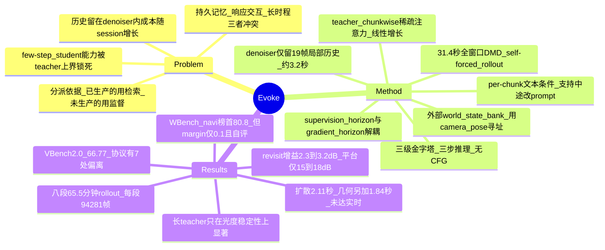

## Summary

Evoke 把 interactive world model 的三个互相冲突的需求拆开安置：空间持久性交给一个用 camera pose 直接寻址的外部 geometric world state bank，使 denoiser 的 context 与 positional range 与 session 长度无关；时间一致性交给一个专为长时程监督重新设计的 teacher（chunk-wise sparse attention 使注意力随长度线性增长、per-chunk 文本条件允许 rollout 中途换 prompt），再用 31.4 s 全窗口 DMD 把这两种能力蒸馏进一个三步、无 CFG 的 student。作者报告 WBench navigation split 公开榜第一（Average 80.8）与两小时不间断 rollout，但该榜领先幅度只有 0.1、系作者自评且非 step-matched，作者自己在附录里也说这个量级的差距不该读成胜负。单张 H200、384×640 下 1.5 s chunk 的 diffusion 耗时 2.11 s，几何路径另加 1.84 s，因此系统仍未达到实时。

## Problem & Motivation

作者把 interactive world model 的困难定位成一个系统层面而非 scaling 层面的问题：persistent memory、responsive interaction、long-horizon generation 三者对同一个 denoiser 提出冲突要求。

**第一重冲突在于历史放在哪里。** 把观测历史留在 denoiser 里（额外 context frames 或不断累积的 KV cache），每步去噪成本随会话时长增长；windowing 与 cache eviction 只能靠丢信息来把成本压住；retrieval 与 streaming conditioning 仍然受限于一个有限的 denoiser-side context budget。

**第二重冲突在于 few-step student 的能力上界。** 低延迟要求少步推理，少步推理靠从慢 teacher 蒸馏得到，于是 student 只能继承 teacher 监督里表达过的时间跨度与条件化能力。而 distillation 长期被当作纯加速手段：teacher 的注意力仍是双向二次的、训练片段仍很短、文本条件在整段序列里恒定不变。

Evoke 的中心主张是这两件事本来就不必由同一个部署时的 denoiser承担：**persistent spatial state 外置，teacher 本身升格为设计变量。**

论文里最值得单独记下的是 §3.2 那段"职责分派"论证，它不是模块罗列而是一个可证伪的划分依据：

- **temporal content drift**（场景 identity、物体外观、空间布局缓慢演化，而每个局部窗口单看都合理）——没有哪一个具体的过去观测唯一决定了正确的后续，因此只能靠拉长监督窗口，让远隔时刻被联合覆盖后暴露出来；
- **spatial revisit inconsistency**（相机转回先前看过的表面）——该状态已经被本次会话生产出来了，问题只是"把它重新取出来"，因此应该由显式存储 + 几何寻址解决。

作者据此明确写下两条边界：更长的监督窗口无法替代一个不可用的观测，而存储的几何也无法决定未观测内容该如何演化。

## Method

### 有界递归会话

第 $k$ 步生成一个 $F=9$ latent frames 的 chunk（36 像素帧、24 fps 下 1.5 s），条件是相机轨迹 $\mathcal{P}_k$ 与可逐步变化的文本条件 $c_k$。整个循环写作 $r_k=\mathrm{Read}(M_k,\mathcal{P}_k)$、$x_k\sim p_\theta(\cdot\mid r_k,h_k,c_k)$、$M_{k+1}=\mathrm{Write}(M_k,x_k,\mathcal{P}_k)$。局部历史 $h_k$ 与世界状态库 $M_k$ 都在固定预算下运行，因此延长会话只增加递归调用次数，不增加任何单次调用的 context 长度、位置编码跨度与算力占用。

一个容易被忽略但很重要的细节：每个生成 chunk **复用同一套局部位置布局**，持久状态改由 camera pose 而非时间位置寻址。这样 rollout 就不会像连续增长的位置轴那样最终越出训练时见过的位置范围。

### Geometric world state bank

student 在 denoiser 里只保留最近 **19 个 latent frames（约 3.2 s）**，分成 long/mid/short 三档，分别 16、2、1 帧。此外的一切走外部库：

- **写**：用单目深度模型（Depth Anything 3）对生成 chunk 的 12 帧在已知相机轨迹下估深度，反投影后追加进库。不同 chunk 的几何**各自独立插入，不做跨 chunk 融合**——作者明确说融合长序列深度会带来 scale drift 与渲染 artifact。
- **读**：当前 pose 直接决定哪些存储观测在几何上相关；候选源视角按与目标视图的 co-visibility 排序，最多选 8 个足够互异的源，做带 z-buffering 的批量投影，返回一张 view-aligned warp 图和一张 per-pixel visibility mask。
- **visibility 门控**：visibility < 0.5 的像素被赋 $\sigma=1$，即完全不提供视觉信息；有支撑的区域噪声很轻，$\sigma\in[0,0.135]$。同一 visibility 信号在各 history tier 的 patch 分辨率上池化，用来把无支撑的 history token 直接从序列里剔除。
- **retention**：小时级实验的配置保留 2160 像素帧 = **90 s 几何**；因为每三帧才入库，活跃源池最多 720 帧。

这里的关键取舍要说清楚：它给的保证是"在保留覆盖范围内的持久 recall"，不是"对曾经去过的每个位置的永久记忆"。

### Evoke Teacher

teacher 由 **14B Wan2.2 A14B** DiT 改造，保留其 high-noise / low-noise 双专家。teacher 与 critic **共用同一 backbone**：开 LoRA adapter 得到 critic，关掉得到 teacher，因此两个分数总是在同一专家内计算。

序列按 9 latent frames 分 chunk，每个 query chunk 只访问一个有界集合：首帧 global sink、带一帧重叠的局部上下文、空间压缩的邻近帧、少量被选中的远端帧、以及一条 linear attention 累积的 global state。注意力成本因此近似线性而非二次。同一套 chunk 划分顺带提供了**每个 chunk 独立的文本条件**——训练 caption 按 12 s 切段映射到对应 latent chunk，于是"中途换指令"这件事第一次出现在监督信号里。

### 长时程 DMD

训练从 1 个 ground-truth prefix chunk 出发，接 20 个 self-forced 生成 chunk，合计 $21\times9=189$ latent frames、753 像素帧、约 31.4 s；student 每 chunk 三次前向，构造一条 rollout 需要 60 次 student forward。teacher 与 critic **联合给全部 189 帧打分**，而不是从轨迹里采一个短窗口。

$$\Delta s=s_{\mathrm{fake}}-s_{\mathrm{real}},\quad \nu=\mathrm{mean}_\Omega\left[|\hat x_0-s_{\mathrm{real}}|\right],\quad \mathcal{L}_{\mathrm{gen}}=\tfrac12\big\|\hat x_0-(\hat x_0-\tfrac{\Delta s}{\nu})^{\mathrm{detach}}\big\|_2^2$$

mask $\Omega$ 排除 GT prefix 与第一个生成 chunk $x_1$：teacher 在首个 chunk 上按 image-model 的首帧分布处理，而 student 在做视频续写，直接匹配会引入边界闪烁。

**本文最实用的一招是 supervision horizon 与 gradient horizon 的解耦**：rollout chunk 之间 detach 历史，每个反向图只覆盖单个 chunk，激活显存因此有界；但 teacher/critic 仍联合评估完整 31.4 s 轨迹，所以每次局部更新消费的是定义在全 rollout 上的分布差异。长时程监督**不需要**穿越整条轨迹反传——这个观察简单、可迁移，值得记住。

纯分布匹配不保证相机轨迹被遵守，因此保留上一阶段的 supervised warp-conditioning 目标作为相机可控性的辅助正则。

### 三步推理

每 chunk 三次无 CFG 的去噪评估，走一个 coarse-to-fine latent pyramid（$12\times20\to24\times40\to48\times80$，每级一步）。**几何条件只在最粗一级注入**，先定大尺度空间结构，再由高分辨率级细化外观；visibility 剪枝进一步移除无支撑的几何 token，所以额外条件化成本取决于当前视野内被覆盖多少，而非会话跑了多久。

## Key Results

### WBench navigation split

Table 1 与 8 个 few-step 系统在同一批 158 个 case 上比较，Evoke 在 Video Quality（82.79）、Setting（83.76）、Physical（72.06）三个组均值上领先，Consistency 组均值 86.87 与最强的 HY-World 1.5 ar-distill 的 86.86 事实上打平（差 0.01）。领先幅度最大的两项是 Scene 74.68（次优 LingBot-World v2 fast 66.7）与 Causal Fidelity 82.44（次优 76.7）。

**但真正体现"交互"的那一列恰恰是弱项。** Navigation 78.63 在 9 个系统里排第 6（HY-World 1.5 ar-distill 87.5、Happy Oyster 85.1、LingBot-World v2 fast 82.8、Matrix-Game 2.0 80.6、LingBot-World fast 79.4 均在其上）；Perspective 69.74 排第 4（LingBot-World v2 fast 84.5、LingBot-World fast 82.8、Happy Oyster 75.0 在其上）。作者承认这两项偏弱，归因于"当前相机控制通路的限制"，但没有做诊断。

Table 7 把同一次运行放进 30 个系统的公开榜：Average 80.8 排第一，领先 HiDream-O1-World 的 80.7 **0.1 分**。作者自己加了脚注——这是作者对已发布 student 的自评而非榜单提交，且非 step-matched，并写下"这个量级的差距和 §4.1 拒绝当成胜利的那些是同一量级"。

### VBench

VBench-2.0 总分 66.77，在公开榜 top-10 里排第一，最近的 Veo 3 为 66.72（差 0.05）；VBench-Long 85.11 排第 7，榜首 IPOW 88.26。**这两个数不能按字面引用**：附录声明了 7 处协议偏离——VBench-2.0 每 prompt 只采 1 个样本而非官方要求的 5 个、clip 长 5.875 s、分辨率 640×384、使用 prompt augmentation；VBench-Long 单样本、clip 8.875 s 而非 10 s（作者自测约 +0.02 Total 对己有利）、同样的 prompt augmentation。作者明确写"单次采样抬高方差但不改变期望，而 Table 2 里报的 0.05 量级 margin 正是这个量级，因此两个排名都不该被过度解读"。

### 长会话稳定性

8 段连续 rollout，每段 2,619 个递归步、65.5 分钟、94,281 帧，world state bank 限定 90 s。结论被小心地限定为"没有失控式的长会话退化"，而不是"场景 identity 被永久保持"：光度统计在初始瞬态后基本不再漂移；内容描述子在开头变化快、随后显著变慢，但真实视频对照组也表现出相当的去相关。Fig 4 的单段小时级会话中 scene identity 平台在 cosine 0.523，作者标注这正是真实素材与自身相隔 60 s 时的水平，并在图注里直接写"这是稳定性断言，不是保真度断言（n=1）"。

### teacher horizon 的效果——以及它的边界

配方完全一致、只有 teacher 时间跨度不同的两个 student 对照：短 horizon 的 student 稳定在开局亮度的 **74%**，长 horizon 的稳定在 **101%**；8 段 clip 中 7 段改善，Wilcoxon $p=0.016$。

**这里必须把作者自己划的界一起记下**：所测的内容描述子**没有**显著区分两个 student，sharpness 也没有改善，最终 post-distill checkpoint 相对长 horizon 蒸馏 checkpoint 没有可测的抗漂移优势。也就是说，能被证据支撑的迁移收益局限在**光度稳定性**这一项。

作者还主动尝试推翻自己的解释：在 13 组受控扰动条件下扫描打分窗口，发现窗口超过 $W=2$ chunk 后 teacher-critic 可检测性变化很小、没有一致的陡峭阈值；对 5,749 个训练步的分析进一步显示单次 teacher-critic 评估的随机波动相对系统性漂移分量偏大。结论是长 teacher 的收益不能被简化成"打分窗口更长所以更容易看见漂移"，而应归给完整的长时程监督训练过程。

### 几何 recall 与定时文本控制

**pose-addressed recall**：在相同 pose 下测两个 12 s 窗口之间的 revisit PSNR。当保留几何短于离开时长时，recall 接近同 run 内测得的 far-pose 地板；一旦保留窗口覆盖了这次 revisit 就一致改善。21 组受控比较中 20 组符合这一预测转折，保留窗口不短于离开时长者高出 **2.3–3.2 dB**。**但 15.4–17.8 dB 的平台说明这是"可辨认"级别而非像素级忠实的重建**——这条边界是作者自己写下的。

**timed text control（evocation）**：中途引入的从句在指向此前未被锚定的内容时有 **67%** 被实现（该 checkpoint 的上限为 83%），而当实现它需要覆盖已被 world state bank 支撑的几何时只有 **4%**（上限 17%）。48 条 schedule、每组 n=24、单个 checkpoint。作者同时指出：4% 这个地板里很大一部分其实是"该 checkpoint 本来就渲染不出这类内容"，而非切换机制的射程；且匹配的长/短 teacher 对照在中途实现率上没有显著差异，因此 per-chunk 条件化只被解释为**表达定时控制的接口**，而不是这个能力的孤立因果来源。

### 成本

三步 student 在单张 H200、384×640 下每 1.5 s chunk 耗时 **2.11 s**——附录明确这是 **diffusion wall clock 而非端到端执行**。几何路径为 denoiser 的 38%、为跳过它的递归步的 93%，每 chunk 净增 **1.84 s**，且随 warp coverage 变化（未观测空间恰好在记忆提供得少的地方也花得少）。长蒸馏在 6×8 GPU 上跑 1981 步。

## Evidence Ledger

| Claim ID | Claim | Type | Source locator | Evidence excerpt | Status |
|:--|:--|:--|:--|:--|:--|
| C1 | 三步 student 在单张 H200、384×640 下生成 1.5 s chunk 耗 2.11 s，该数字只计 diffusion wall clock | number | Sec 4.2 / Appendix 8 | "The student denoises each 1.5 s chunk in 2.11 s on a single H200; this number measures diffusion wall clock" | source-verified |
| C2 | WBench navi split 公开榜 Average 80.8 第一，仅领先 HiDream-O1-World 0.1；作者自评、非榜单提交、非 step-matched | benchmark-setting | Table 7 / Appendix 11 | "Our row leads the board by 0.1 Average"; "Our own evaluation of the released student, not a leaderboard submission" | source-verified |
| C3 | VBench-2.0 总分 66.77（top-10 第 1，Veo 3 66.72）；VBench-Long 85.11（第 7，IPOW 88.26） | number | Table 2 / 3 / 4 | "VBench-2.0 66.77 1 of 10 — Veo 3, 66.72 / VBench-Long 85.11 7 of 10 IPOW, 88.26" | source-verified |
| C4 | 两个 VBench 均偏离官方协议（单样本、非标准 clip 长度与分辨率、prompt augmentation），作者称排名不应被过度解读 | benchmark-setting | Appendix 10 | "one sample per prompt rather than five... so neither ranking should be over-read" | source-verified |
| C5 | Teacher 由 14B Wan2.2 A14B 改造，student 基于 Helios；teacher 与 critic 共享 backbone，LoRA 开关切换 | benchmark-setting | Sec 3.3 / 4.1 | "Enabling a LoRA adapter yields the critic, while disabling it yields the teacher" | source-verified |
| C6 | 1 GT prefix + 20 self-forced chunk = 189 latent frames ≈ 31.4 s，需 60 次 student forward；梯度只加在 x2..x20；chunk 间 detach | causal-mechanism | Sec 3.3 | "yielding 21×9=189 latent frames, or 753 pixel frames corresponding to approximately 31.4 s" | source-verified |
| C7 | 长/短 teacher 对照：短 74% 开局亮度、长 101%，8 段中 7 段改善 (Wilcoxon p=0.016)；content descriptor 与 sharpness 均不显著 | comparison | Fig 6 / Sec 4.3 / Appendix 8 | "the short-horizon student settles at 74% of its opening brightness, the long-horizon one at 101%" | source-verified |
| C8 | 13 组扰动条件下 teacher-critic 可检测性在 W>2 chunk 后基本不变，作者据此否定"收益=窗口更长"的简单解释 | causal-mechanism | Appendix 8 | "detectability changes little once the window exceeds W=2 chunks, and no consistent sharp threshold emerges" | source-verified |
| C9 | world state bank 保留 2160 像素帧 = 90 s 几何；每三帧入库故源池 ≤720 帧；每次读取最多 8 个源视角；visibility<0.5 赋 σ=1 | number | Sec 3.4 | "retains 2160 pixel frames, corresponding to 90 s of geometry; because every third frame is ingested" | source-verified |
| C10 | revisit：retention ≥ 离开时长者高 2.3–3.2 dB，21 组中 20 组符合预测；15.4–17.8 dB 平台为"可辨认"而非像素级忠实 | number | Sec 4.4 | "20 of 21 comparisons follow this predicted transition... score 2.3–3.2 dB higher" | source-verified |
| C11 | 中途 prompt 切换：未锚定内容 67% 实现（上限 83%），需覆盖已锚定几何仅 4%（上限 17%）；单 checkpoint、48 schedule、组内 n=24 | number | Fig 8 / Sec 4.4 | "Unanchored clauses are realized in 67% of cases against an 83% ceiling, anchored ones in 4% against 17%" | source-verified |
| C12 | 长会话评测为 8 段 65.5 分钟 rollout，**每段** 2,619 chunk、94,281 帧；Fig 4 的 cosine 0.523 平台是 n=1 的稳定性断言而非保真度断言 | number | Appendix 8 / Fig 4 caption | "eight continuous rollouts, each spanning 2,619 recurrent steps, 65.5 minutes, and 94,281 generated frames" | source-verified |
| C13 | 几何路径为 denoiser 的 38%、为跳过它的递归步的 93%，每 chunk 净增 1.84 s，随 warp coverage 变化 | number | Fig 10 / Appendix 7 | "The geometric path costs 38% of the denoiser and 93% of a recurrent step that skips it" | source-verified |
| C14 | project page evoke-world.github.io/Evoke、代码 github.com/SII-YuanyangYin/Evoke，arXiv perpetual non-exclusive license | license-code | 首页 metadata | "License: arXiv.org perpetual non-exclusive license" | source-verified |
| C15 | Evoke Navigation 78.63、Perspective 69.74 均非最优（Navigation 最高为 HY-World 1.5 ar-distill 87.5；Perspective 最高为 LingBot-World v2 fast 84.5），作者承认两项偏弱 | comparison | Table 1 / Sec 4.1 | "Navigation and Perspective remain comparatively weaker, reflecting limitations of the current camera-control path" | source-verified |
| C17 | 训练用 Sekai 数据集 + 未披露规模的内部视频数据；caption 按 12 s 切段映射到 latent chunk | benchmark-setting | Sec 4.1 / Sec 3.3 | "Training uses the Sekai video dataset together with additional internal video data" | source-verified |
| C18 | student 在 denoiser 内只保留最近 19 个 latent frames（约 3.2 s），分 16/2/1 三档 | number | Sec 3.4 | "retains only the most recent 19 latent frames, corresponding to approximately 3.2 s" | source-verified |
| C19 | 长蒸馏在 6×8 GPU 上跑 1981 步；梯度范数在 48 GPU、8 次 scheduler 重启间保持有界 | number | Appendix 6 / Fig 9 | "Long-distill (Evoke Teacher, 6×8 GPUs, 1981 steps)"; "Gradient norms stay bounded across 48 GPUs" | source-verified |
| C20 | 端到端每 chunk 墙钟约 2.11 + 1.84 ≈ 3.9 s，即约为 1.5 s 视频实时速度的 2.6 倍慢 | number | 无（由 C1 与 C13 推算） | 原文只写 "diffusion wall clock rather than end-to-end execution" | unsupported |

**Verifier 修正记录**（独立 verifier 回原文定位，与本笔记起草分离）：

1. C12 初稿把 94,281 帧当成八段 rollout 的**总量**，原文为 "each spanning"，即**每段** 94,281 帧（八段合计约 754k）。已改正。
2. C15 初稿把 Perspective 最高分 84.5 误记在 LingBot-World fast 名下；重核 Table 1 列序（用各组均值与 Table 7 交叉验证）后确认属 **LingBot-World v2 fast**，LingBot-World fast 为 82.8。已改正。
3. C20 为本笔记的推算，**论文正文与附录均未给出任何合并 diffusion 与几何路径的端到端每 chunk 数字**（verifier 全文检索确认）。因此该数字不得当作论文报告值引用，Summary 与 Key Results 中只以"扩散 2.11 s + 几何另加 1.84 s"的分项形式陈述。
4. 训练数据总量（小时数/clip 数）在全文任何位置均未披露。

## Strengths & Weaknesses

### Strengths

**职责分派的论证本身是这篇文章最好的东西，胜过任何单个模块。** "持久状态与交互能力不必都由部署时的 denoiser 承担"这句话如果只停在口号上没什么价值；有价值的是 §3.2 给出的分派**依据**——按"正确答案是否已经被本次会话生产出来"来切：已经生产出来的（revisit）用显式存储 + 几何寻址取回，没有生产出来的（未来演化）用监督窗口约束。这个判据可证伪，也能迁移到别的记忆系统设计上。作者还诚实地写下它的两条失效边界。

**supervision horizon 与 gradient horizon 解耦是一个简单、可复用的训练技巧。** chunk 间 detach 历史使反向图只覆盖单 chunk（激活显存有界），而 teacher/critic 仍对完整 31.4 s 联合打分（长程信号保留）。"长时程监督不需要穿越整条轨迹反传"这个观察对任何做长视频/长序列蒸馏的人都直接可用。

**证据纪律罕见地好。** Fig 4 图注自己写 "A stability claim, not fidelity (n=1)"；Fig 7 写 "Coverage bounds recall from above; it is not a fidelity measure"；Fig 6 写 "Claim: exposure stability, not image quality"；Fig 11/12 写 "carries no measurement"；附录声明 7 处 VBench 协议偏离并说 0.05 量级 margin 不该被过度解读；WBench 榜单行加脚注说明是自评、非 step-matched，并主动指出 0.1 的领先幅度与正文拒绝当成胜利的那些是同一量级。**在 world model 这一类以 demo 取胜的文献里，这种自我限定几乎是异常值。**

**负面结果被写出来而不是被埋掉。** 长 teacher 的收益被明确限定在光度稳定性：content descriptor 不显著、sharpness 不改善、post-distill 无额外抗漂移优势。更难得的是作者主动构造了 13 组扰动的可检测性扫描去尝试**推翻**自己的解释，然后报告这个尝试失败了。

**代码与权重真实开源**（Apache-2.0，vendored 深度后端 ViGeo / Depth-Anything-3 为更严格的 CC-BY-NC-4.0），配 T2V/I2V/V2V/中途改 prompt 四种推理入口与训练脚本。相对同实验室三周前的 [[2607-AlayaWorld]]（零定量评估的 teaser），这是一次实打实的兑现。

### Weaknesses

**摘要与附录之间存在一道诚实度落差。** 摘要写 "achieves state-of-the-art performance on WBench"。实际情形是：Average 领先第二名 0.1 分、作者自评、非榜单提交、非 step-matched，而作者自己在 Appendix 11 说这个量级不该读成胜利。**诚实全部住在附录里，摘要一句也没带。** 任何只引摘要的下游工作都会继承一个作者本人已经否认过的 overclaim——VBench-2.0 的 66.77 vs Veo 3 的 66.72 同理，0.05 的差距建立在一套自己声明有偏离的协议上，不能写成"超过 Veo 3"。

**它不是实时系统，而 headline 数字恰好遮住了这一点。** 2.11 s 是 diffusion wall clock；几何路径每 chunk 另加 1.84 s（相当于一个不走几何的递归步的 93%，接近翻倍）。两项相加，一个 1.5 s 的 chunk 需要约 3.9 s（**本笔记推算，论文未给端到端数字**），在 H200、384×640 下约为实时速度的 2.6 倍慢。论文正文只在一处轻描淡写地说 2.11 s "measures diffusion wall clock"，把分解丢进附录的一张 bar chart，主文从头到尾没有一个端到端数字。对一个通篇以 "interactive" / "responsive interaction" / "low-latency" 立论的系统，这个缺口不算小。结论节承认"要真正实时仍需进一步加速"。

**最该被验证的机制恰恰是验证最弱的那个。** §3.2 整段论证是为 **content drift** 建立的——那种"每个局部窗口单看都合理、只有远隔时刻对照才暴露"的失效。但唯一显著的实验证据是**光度稳定性**（亮度 74%→101%，n=8 clip，Wilcoxon p=0.016），而论文自己的理论说光度这类 degradation drift **本来就能在较短窗口内被看见**。content descriptor 上两个 student 没有显著差异。于是：为难问题构造的机制，只在容易的问题上被证明有效。作者在正文里说清楚了这一点，摘要却仍写成 "improving resistance to long-term content drift"。

**有界记忆就是有限记忆，标题里的 "Endless World" 需要打个折扣。** 保留预算是 90 s / 2160 像素帧（每三帧入库，≤720 源帧）。两小时的 rollout 因此只有 90 秒的世界记忆——endless 的是**生成**，不是**世界状态**。而且即便在覆盖范围内，recall 也只有 15.4–17.8 dB PSNR，是"认得出"而不是"对得上"。更实际的问题是：**保留预算的 scaling 代价从未被刻画**——把记忆拉到 10 分钟要付出多少存储与每步检索开销，读者无从判断，而这恰恰决定了这套方案能否真的替代 KV cache 路线。

**只有静态几何。** 每个 chunk 的深度独立反投影、刻意不跨 chunk 融合（作者说融合会带来 scale drift），意味着库里是一叠彼此独立的静态快照，动态物体没有任何表示。这正是 [[2603-HybridMemory]] 定位的 "frozen statues, distorted phantoms, or vanishing subjects" 失效面，也是 [[DomainMaps/WorldModel]] Pattern 3 记录的老问题——Evoke 没有触碰它，结论节也承认。

**"锚定内容改不动"被写成特性，但它同时是一个硬功能限制。** 4% vs 67% 被解释为"文本管自由演化的内容、几何拒绝覆盖已锚定的观测"，听上去是良性分工。但反过来说就是：**你看过的东西就再也编辑不了**——城堡一旦进了库，就烧不掉。对一个交互式世界模型，这是能力边界而非设计优点。而且 17% 的上限说明该 checkpoint 本身渲染这类编辑的能力就很低，4% 里混杂了多少"机制不允许"与多少"模型画不出来"，论文没有分开（作者自己指出了这个混淆）。

**交互轴恰恰是弱轴，且未被诊断。** Navigation 在 9 个 few-step 系统中排第 6，Perspective 排第 4，而 Scene（+8.0）与 Causal Fidelity（+5.7）大幅领先。一个为持久性设计的系统在场景级与物理合理性上赢、在相机服从性上输，本身说得通，但论文只丢下一句"当前相机控制通路的限制"。**这里有一个未被测量的耦合值得指出**：camera pose 同时是控制信号**和**世界状态库的地址，pose 跟随越差，读出的几何就越对不上应有的视图——控制误差会直接污染记忆质量。全文没有任何实验探测这条链路。

**训练数据规模完全未披露**（Sekai + "additional internal video data"，无小时数、无 clip 数）。因此 recipe 的贡献与数据的贡献无法分离——这与库内已对 [[2607-Wonder]] 记下的问题是同一个。

**几处隐含假设值得单独标出**：(1) 假定 camera pose 是"我之前看到过什么"的充分地址——对静态场景成立，一旦世界在两次访问之间发生了变化（物体移动、门被打开），pose 寻址会取回一个**过期**的观测并主动对抗正确的演化，无实验探测；(2) 假定单目深度足够准到值得作为条件——而"跨 chunk 融合会漂移"这一让步本身就是对深度质量的不信任声明，深度错误将成为永久性的记忆错误；(3) 假定监督窗口会饱和（30 s 够用）——论文预测饱和并扫了 $W$，但扫的是 teacher-critic 的**可检测性**而不是端任务漂移随 $W$ 的变化，所以"30 s 够了"这个选择实际上仍未被论证。

## Mind Map

## Connections

- **[[2607-Wonder]] 是最直接的对照，两者在同一个 gap 上给出相反的解法。** Wonder 用固定 active set 检索 full-fidelity historical KV，把 active attention cost 与历史长度解耦，但**总 KV 存储仍随会话增长**，且 revisit 一致性只有 Figure 9 的定性 case。Evoke 把同一份历史挪出 denoiser 变成几何，**存储与算力两侧同时有界**（2160 帧 / 90 s，≤720 源帧，≤8 源视角），并给出了 revisit 的定量读数（保留窗口覆盖离开时长时 +2.3–3.2 dB，平台 15.4–17.8 dB）。这正好补上了 [[Topics/WorldModel-Survey]] Takeaway 21 点名的缺口的两条——storage 与 active compute；但第三条 **semantic faithfulness 依然没解决**：15.4–17.8 dB 说明取回的是"认得出的那个地方"，不是"同一帧"。
- **[[Topics/WorldModel-Survey]] Open Problem 3 要求的"必须同时报告 quality/control/revisit metric、latency 与 total memory 随 horizon 的曲线"，Evoke 是库内第一篇几乎补齐的工作——但差最后一项。** quality（WBench/VBench）、control（Navigation 78.63）、revisit（dB）、latency（2.11 s + 1.84 s）都有了；**唯独 memory 随 horizon 的曲线没有**——保留预算被固定在 90 s，把它拉长的代价从未被测。这是引用这篇文章时应当留的口子。
- **[[2607-AlayaWorld]] 是同实验室（Alaya Lab，四位作者重合：Yuanyang Yin / Chuanhao Li / Yifan Zhan / Kaipeng Zhang）三周前的前作，两者的技术取舍差异值得记。** AlayaWorld 用"3D cache 几何持久 + 压缩帧历史"的双记忆，外加 **error bank**（把 rollout 残差 artifact 当结构化扰动重新注入）来对付长时程漂移，零定量评估。Evoke 换了底座（LTX-2.3 → Helios），**放弃了 error bank 这条"训练时注入漂移"的路线，改用长 horizon teacher 监督**，并补上了 AlayaWorld 完全缺失的定量证据。两者对同一问题的方案是替代关系而非叠加关系，谁更有效在库内无对照数据。
- **[[2608-WorldExam]] 与本文在 WBench 的定位上存在一处需要注意的张力。** WorldExam 的 Table 1 把 WBench 归入"指令已写明期待交互结果"的一类（带 † 标注），即它评的是 explicit instruction fulfillment。Evoke 的 headline SOTA 正建立在 WBench 上。有意思的是 Evoke 的 **Causal Fidelity 82.44 大幅领先次优的 76.7**，而 WorldExam 与 [[2607-GigaWorld1]] 反复定位的失效面恰恰是"控制被执行但世界不回应"。**这不构成 Evoke 解决了该失效面的证据**——WBench 的 causal fidelity 与 WorldExam 的 inherent reactivity 不是同一个测量，且 Evoke 从未在把"须自行推断的后果"单独拆出来的协议下被测过。要判断外部几何记忆是否也改善了世界回应性，需要把 Evoke 放上 WorldExam 的 dynamic track。
- **[[2603-HybridMemory]] 定位的动态主体 exit–reentry 失效，Evoke 在设计上没有覆盖。** 库里每个 chunk 的几何独立插入、无跨 chunk 融合、无动态表示，本质是一叠静态快照。HybridMemory 要求的"追踪主体在出画期间的隐含轨迹"在 Evoke 的框架里没有对应机制，结论节承认 dynamic state 是 next step。**[[DomainMaps/WorldModel]] Pattern 3 因此不能因这篇文章而更新为已解决。**
- **[[Topics/WorldModel-Survey]] Open Problem 9（agent memory 与 world model 的边界）可以新增第四种接口。** 已有三种是 [[2603-Memoir]] 的"想象→检索"、[[2607-Wonder]] 的"生成→记忆（query-summary 选 KV）"、[[2607-ObjectCentricEnv]] 的"记忆→模型"。Evoke 是 **"pose→几何"：地址是相机位姿，检索是几何 co-visibility 排序，没有任何 learned retrieval**。作者的论证是 spatial revisit 的正确内容已经被观测过、不需要被推断，所以确定性几何寻址比学习式检索更合适——这和 [[Topics/WorldModel-Survey]] 里 SpatialEvo 的 DGE"确定性几何替代 model voting"是同一类主张的第二个实例，但适用场景同样受限于静态。
- **推理成本上，survey 记录的"典型 14B DiT naive 5.7 s/chunk，38× 工程栈加速后仍需 2×GB200 才能 7 Hz 闭环"可以更新参照点**：Evoke 在**单张 H200**、384×640 下每 1.5 s chunk 约 3.9 s（扩散 2.11 + 几何 1.84），硬件门槛显著降低，但仍未过实时线。三步无 CFG + 金字塔推理把扩散侧压得很低之后，**瓶颈已经转移到几何路径**（占一个无几何递归步的 93%）——这是这条路线下一步的优化对象，也是 Evoke 结论节列出的第三个 open direction。

## Notes

- 系统名在正文中一律为 **Evoke**，"Alaya-EVOKE" 只出现在标题；GitHub 链接 `SII-YuanyangYin/Evoke` 现 301 重定向到 `AlayaLab/Evoke`（HTTP 200，README 记录 `hf download AlayaLab/Evoke` 可取四个蒸馏阶段权重与 teacher）。仓库 Apache-2.0，但 vendored 的 ViGeo / Depth-Anything-3 深度后端为 CC-BY-NC-4.0，README 明确提示商用需另行合规——**下游若要商用复现，这条比主仓 license 更具约束力**。
- 标题里的 "Linear-Scaling Supervision" 指的是 **teacher 侧**注意力随序列长度线性增长，不是 student。student 每步是 O(1) 的定长调用。这一点容易被误读。
- 值得单独追的实验：**把 world state bank 的保留预算从 90 s 扫到 10 min，同时报告存储、每步几何耗时与 revisit PSNR。** 论文预测"覆盖住 revisit 即可"，但没有给出这条曲线，而它直接决定该方案相对 KV cache 路线的真实性价比。
- 另一个未被任何一方测过的耦合：**camera pose 同时是控制信号与记忆地址**。pose 跟随误差应当会传导为 recall 质量下降（读错视角→取回错几何→warp 条件误导生成）。Evoke 的 Navigation 在同类系统里排第 6，恰好提供了一个可以做这个测量的场景——把 pose following error 与 revisit PSNR 做散点，若相关性显著，就说明"外部几何记忆"的收益上界被相机控制精度锁住。这可能是比继续加大 teacher horizon 更有价值的下一步。
- 可迁移的方法论收获（与本文主题无关但值得记）：**"supervision horizon ≠ gradient horizon"**——用 detach 把反向图切碎以控住激活显存，同时让判别器/teacher 对完整长序列联合打分以保住长程信号。任何做长序列蒸馏或长时程对抗训练的场景都可以直接套用。
- 写作层面值得学的一点：这篇的**图注承担了限定 claim 的职责**（"A stability claim, not fidelity (n=1)"、"Coverage bounds recall from above; it is not a fidelity measure"、"carries no measurement"）。把边界写进图注而不是只写进正文，使得图被单独引用时限定条件不会掉队。反例也在同一篇里——**摘要没有继承附录的任何一条限定**。
