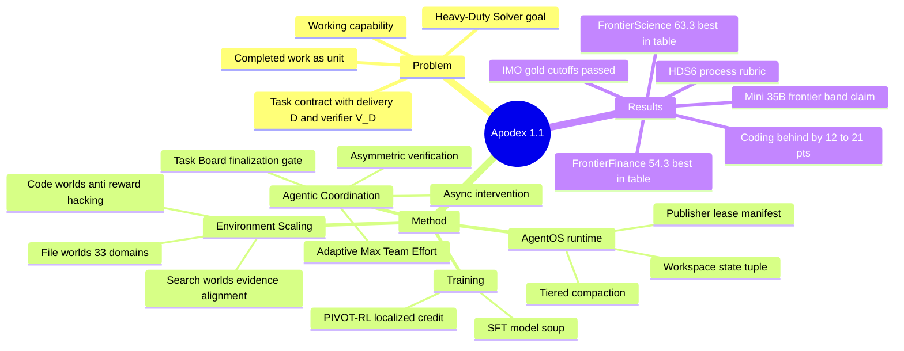

## Summary
Apodex Team 的 75 人 tech report，把目标定义为 working capability（长程、可验证的真实工作推进），沿两条轴 scaling：Environment Scaling（file / search / code 三类可执行环境的覆盖与可验证性）与 Agentic Coordination Scaling（Agent Team 的分解、委派、异步整合、重规划），由 AgentOS 持久 runtime 承接状态与 provenance，训练侧用 SFT + PIVOT-RL（在轨迹"pivot"决策点做局部化 RL）。397B 主模型加 Agent Team 在 FrontierFinance（54.3）与 FrontierScience-Research（63.3）取其对比表最高值，并在 MathArena 口径下越过 IMO 2025/2026 与 USAMO 2026 的参考线；但在 GDPVal、APEX-Agents、HLE、BioMysteryBench 及两个 coding benchmark 上仍明显落后于 Claude Opus 5 等最强 frontier 模型。

## Problem & Motivation
作者的出发点：高质量 reasoning 对复杂工作是必要非充分条件——很多任务模型"能说出正确答案"却做不完，因为工作在长 horizon 上展开：要定位并解读证据、操作异构文件、执行调试代码、跨多步维护并修订计划、失败后不丢弃有效进展地恢复、最终交付他人可检验的 artifact。报告把这种能力称为 working capability，其度量单位是 completed work 而非孤立 response，并用统一 task contract 形式化：ℰ=(𝒲, W₀, q, 𝒜, 𝒯, Ω, 𝐁, D, V_D)，其中 delivery contract D 规定交付物与判定方式，任务级 verifier V_D 评的是终态 workspace 与执行轨迹而非一段文本。长期目标是 "Heavy-Duty Solver"：能对日益雄心、长时间运行且可验证的工作负责的系统。

## Method
**两条 scaling 轴**（训练被明确定位为从这两轴的轨迹中学习，而非独立的第三轴）：

**1. Environment Scaling**——三类环境族共用构建、验证与 replay 纪律（Table 1）：
- **File worlds**（authority and transformation）：从业务状态、authority 关系、推导逻辑反向投影出 workspace；registry 覆盖 33 domains、318 occupations、1,208 deliverable clusters；被评分的量必须能由代码从权威源重新推导或经 provenance 连回真实文档。
- **Search worlds**（discovery and evidence alignment）：gold object 不只是答案，还包括 source set、claim-to-evidence 对齐与冲突处的显式不确定性；scaling 改变获取问题的结构（证据跨源分布、中间实体隔离、非权威干扰项），并用 ρ_acq =（候选数+证据跳数）/工具调用预算 作一阶难度坐标。
- **Code worlds**（executable transformation）：harvested（真实 PR，fail-to-pass + pass-to-pass 测试）与 synthesized（从 verified seed 组合/抽象/扰动扩展）两路；显式做 reward-hacking 红队——在 sandbox 里测试 solver 能否不完成任务就拿到 reward，评分与 solver 隔离。
- 覆盖分配靠失败驱动：每轮训练后把失败轨迹抽象为 capability-level deficiency，作为下一轮任务构建的 specification。

**2. Agentic Coordination Scaling（Agent Team 1.1）**：
- **Task Board**：条目带稳定 id、owner 集合、依赖引用与 {open, in_progress, resolved, cancelled} 状态，既是外部记忆也是 runtime finalization gate（有未 resolve 条目不接受 final answer）。
- **Asynchronous intervention**：执行中接受用户消息，runtime 将其作为 trace 中的事件注入；policy 被训练判断干预改变了什么、哪些已完成工作仍 causally valid。
- **Asymmetric verification**：verifier 拿到的是具体 claim + 证据 + 交付约束，任务是攻击该 claim（找反例、独立 source class 三角验证），刻意窄于生成。
- **Adaptive Max Team Effort**：只对 weak / contested / load-bearing claim 加派独立 scoped 调查，每次返回后重新分配——scaling 变量是"有用的协调工作"而非固定 agent 数。
- **Evidence-Grounded Synthesis**：团队执行后专设两遍合成（evidence-graph 构建 → agentic synthesis），消费终态 task board、子代理报告、证据与 verifier 发现，不把 lead agent 最后一条消息当报告；无法溯源到证据或计算的 claim 被 qualify 或删除。注意：该模块（Sec 3.2.5）只用于线上产品，离线评测不含它。

**3. AgentOS（持久执行 runtime）**：workspace 实例化为 W_t=(F_t 文件, Q_t 证据, C_t 可执行状态, I_t artifact 索引, G_t 依赖图, K_t 协调状态)；文件系统命名空间 /inputs（只读）、/workspace、/outputs、/shares；两级 context compaction（先廉价驱逐旧工具观察、再 LLM 摘要中段）；artifact 交付走 manifest + single-publisher lease + baseline reconciliation，防止过期同名文件冒充交付。

**4. 训练**：SFT 覆盖推理/工具/搜索/文件/代码/数学/科学金融/professional delivery/多智能体协调，按行为有效性过滤（无效工具交互、忽略观察、未完成交付的轨迹剔除），领域变体用 model-soup 合并。**PIVOT-RL**：终局 reward 对长轨迹的 credit assignment 太粗，故用 hindsight 回溯定位 pivots（模型开始走无效策略、依据不足证据、误用工具、拒不修订假设的决策点），保留有用 prefix、构造带 short corrective hint 的局部续写任务，与 unhinted 完整任务混合训练；异步优化吞掉不规则 rollout 流。

## Key Results
评测分 ReAct（低脚手架，测底层 policy）与 Agent Team（测协调带来的系统级增益）两种模式。

| Benchmark | Apodex 1.1 ReAct | + Agent Team | 最强对比模型 |
|:--|:--|:--|:--|
| APEX-Agents | 34.4 | 38.5 | Claude-Opus-5 42.3（内部复现） |
| GDPVal (win rate) | 69.5 | 78.8 | Claude-Opus-5 89.4（内部复现） |
| FrontierFinance | 48.7 | **54.3** | Claude-Fable-5 49.2 |
| FrontierScience-Research | 55.0 | **63.3** | DeepSeek-V4-Flash-0731 55.0 |
| BioMysteryBench (17-task) | 23.5 | 35.3 | Claude-Opus-5 49.4 |
| Humanity's Last Exam | 53.2 | 56.1 | Claude-Opus-5 64.7 |
| DeepSearchQA (F1) | 88.2 | 92.4 | Kimi-K3 / Opus-5 95.0 |
| Terminal-Bench 2.1 | — | 70.8 | Gemini 3.6 Flash 91.9 |
| SWE-bench Verified | — | 77.7 | Claude-Opus-5 92.2 |

- **数学**：MathArena 口径下 Agent Team 在 IMO 2025 / IMO 2026 / USAMO 2026 得 36.5 / 30.5 / 26.5，均超参考线 35 / 29 / 25（含 IMO gold cutoff）；IMO-ProofBench Basic 96.7%、Advanced 63.3%。相对 Apodex 1.0 是代际跳变（IMO 2025: 12.5→36.5）。
- **代际提升**：APEX-Agents 16.5→34.4（ReAct 已翻倍）、FrontierScience 28.3→55.0；Agent Team 在各表再加 4-9 点。
- **35B Mini**：Agent Team 下 FrontierFinance 50.2（领先所选对比表，次高 GPT-5.6-Sol 46.8）、FrontierScience 51.7、APEX-Agents 27.7（与 Kimi-K2.6 27.9 同 band）——"frontier-band 复杂工作能力可在 35B 达成"是报告的核心效率主张。
- **内部评测**：FrontierSearchBench（自建 41 任务，错误断言计负分）Agent Team 69.1，高于 GPT-5.6-Sol 67.4 与 Claude-Opus-5 64.4。
- **YC-Bench**：ReAct 终值 \$1,038,255，低于 Claude-Fable-5 的 \$1,977,573。
- **HDS6 过程评审**：6 能力 × 4 rubric 共 24 项、outcome-blind、agentic judge（mapping/judging/review/arbitration 四阶段）；1.0→1.1 最大单项 delta 是 Initial Decomposition +1.3 与 Final Verification +0.8。作者自己声明 Deep Discover panel 里 v1.0 是 8 次 run 聚合、v1.1 是单次 run，不能读作 matched ablation。

## Evidence Ledger

| Claim ID | Claim | Type | Source locator | Evidence excerpt | Status |
|:--|:--|:--|:--|:--|:--|
| C1 | 主模型 397B、Mini 35B；397B 仅在 Sec 4.5 披露，abstract 只提 35B Mini | number | Sec 4.5, Fig 6; abstract | "Deep Discover evaluates the 397B model with Agent Team" | source-verified |
| C2 | "leading performance band despite substantially smaller model" 是报告原话，且报告自认 proprietary 对比系统参数量不公开 | sota-novelty | Abstract; Sec 4.2 | "deliberately stated as a performance-band result: parameter counts for several proprietary reference systems are not public" | source-verified |
| C3 | APEX-Agents 34.4/38.5 vs 1.0 的 16.5；Opus-5 42.3 为内部复现 | number | Table 3(a) + caption | "The Claude Opus 5 APEX-Agents result is likewise reproduced internally" | source-verified |
| C4 | GDPVal win rate 69.5/78.8；所有外部模型 GDPVal 数字为 Apodex harness 内部复现；Opus-5 89.4 | benchmark-setting | Table 3 caption | "all external-model GDPVal results shown here are our reproductions under the Apodex harness" | source-verified |
| C5 | FrontierFinance（220 query、11,543 rubric）48.7/54.3，54.3 为表内最高 | number | Table 3(b); Sec 4.3.1 | "220 open-ended queries are graded against 11,543 expert-written, source-attributed rubric items" | source-verified |
| C6 | FrontierScience-Research（60 任务、≥7/10 过）55.0/63.3 vs 1.0 的 28.3，63.3 表内最高 | number | Table 4(a); Sec 4.3.2 | "55.0% with ReAct and 63.3% with Agent Team… 28.3% for Apodex 1.0" | source-verified |
| C7 | IMO 2025/2026、USAMO 2026 得 36.5/30.5/26.5，超参考线 35/29/25；ProofBench 96.7/63.3 | number | Sec 4.3.4; Table 6 | "The corresponding reference thresholds are 35, 29, and 25" | source-verified |
| C8 | Coding 落后：Terminal-Bench 2.1 70.8（最高 Gemini 3.6 Flash 91.9）；SWE-bench Verified 77.7（最高 Opus-5 92.2） | comparison | Table 7; Sec 4.3.5 | "Apodex 1.1 reaches 70.8 on Terminal-Bench 2.1 and 77.7 on SWE-bench Verified" | source-verified |
| C9 | HLE 56.1（Opus-5 64.7）；DeepSearchQA F1 92.4（Kimi-K3/Opus-5 95.0） | number | Table 4(b); Sec 4.3.3 | "Agent Team reaches 56.1 on HLE and 92.4 F1 on DeepSearchQA" | source-verified |
| C10 | FrontierSearchBench 为自建 41 任务、负分惩罚错误断言；Agent Team 69.1 高于全部外部行 | benchmark-setting | Sec 4.4.1; Table 8 | "internal benchmark of 41 verifiable deep-search tasks… incorrect assertions penalized below zero" | source-verified |
| C11 | PIVOT-RL：hindsight 定位 pivot、保留 prefix、corrective-hint 局部续写混合 unhinted 全任务、异步优化 | causal-mechanism | Sec 3.4.2 | "preserve the useful prefix and construct a localized continuation task with a short corrective hint" | source-verified |
| C12 | File-world registry：33 domains、318 occupations、1,208 deliverable clusters | number | Sec 3.1.1 | "registry spans 33 domains, 318 occupations, and 1,208 deliverable clusters" | source-verified |
| C13 | 报告列出权重（HF collection apodex-11）与代码（ApodexAI/FrontierAgent）链接；仅确认链接列出，未验证仓库/权重实际内容 | license-code | 首页链接区 | "GitHub Repository… Model Weights… huggingface.co/collections/apodex/apodex-11" | source-verified |
| C14 | HDS6：24 rubric 项 + integrity gate、outcome-blind；Deep Discover v1.0 八次聚合 vs v1.1 单次，非 matched ablation；最大 delta 分解 +1.3、终验 +0.8 | benchmark-setting | Sec 4.5; Figs 5-6 | "v1.0 result aggregates eight independent runs, whereas the Apodex 1.1 result is obtained from a single run" | source-verified |
| C15 | Mini Agent Team：FrontierFinance 50.2 领先所选对比（次高 GPT-5.6-Sol 46.8）、APEX-Agents 27.7 与 Kimi-K2.6 27.9 同 band；ReAct 相对 1.0 mini 33.2→40.0、15.4→24.2 | number | Table 5; Sec 4.2 | "Agent Team raises these scores to 50.2, 51.7, and 27.7" | source-verified |
| C16 | BioMysteryBench 修订版 17 任务集 23.5%(4/17)/35.3%(6/17)，Opus-5 49.4%；Claude 4.x 行用旧 23 任务集仅作历史参考 | benchmark-setting | Sec 4.3.2; Table 4(a) | "On the revised 17-task Human-difficult Set… while Claude Opus 5 reports 49.4%" | source-verified |
| C17 | Evidence-Grounded Synthesis（Sec 3.2.5）仅线上产品使用，离线评测不含 | benchmark-setting | Sec 4.1 | "Section 3.2.5 is only used for online products and is not included in offline evaluations" | source-verified |

## Strengths & Weaknesses
**亮点**
- **问题定义有含金量**：把"working capability"落成统一 task contract（W₀, q, 𝒜, 𝒯, Ω, 𝐁, D, V_D），delivery contract 与任务级 verifier 分离、terminal verifier 与 solver 可见 verifier 分离——这套形式化比多数 agent tech report 的叙事更可操作，且与 replay 的可复现要求（manifest 固定外生状态/工具版本/随机种子）绑定。
- **环境侧的验证纪律是真贡献**：file world 数值必须代码可重推导、code world 显式做 reward-hacking 攻击测试且评分与 solver 隔离、失败执行反过来诊断环境构建错误——"verification 既防 hacking 又修环境"的双向用法值得借鉴。
- **PIVOT-RL 方向正确**：终局 reward 对长轨迹 credit assignment 不足是当前 agentic RL 的核心痛点，pivot 定位 + prefix 保留 + 局部续写是干净的机制表述（与 vault 中 step-level credit assignment 一脉相承）。
- **诚实的地方**：明确标注哪些 baseline 是内部复现、HDS6 的 Deep Discover 不是 matched ablation、performance-band 表述因对手参数量不公开、runtime contract 不保证结论正确性——tech report 里少见的自我限定。

**局限 / evidence boundary**
- **"leading performance band" 是选择性框定**：Agent Team 取最高值的两个表（FrontierFinance、FrontierScience）之外，GDPVal（78.8 vs Opus-5 89.4）、APEX-Agents（38.5 vs 42.3）、HLE（56.1 vs 64.7）、BioMystery（35.3 vs 49.4）、两个 coding benchmark（差 12-21 点）全部落后；coding 是明显短板。"smaller model" 的效率主张建立在对手参数量不公开的前提上（报告自认），397B 本身也不算小。
- **唯一全面领先的搜索 benchmark（FrontierSearchBench）是自建的**：任务构建、ground truth、scorer 均出自同一团队，虽声明先于评测冻结，但选题分布对自家训练分布的偏置无从核查。
- **关键 baseline 为内部复现**：GDPVal 全部外部数字、Opus-5 的 APEX-Agents 数字都在 Apodex harness 下复现，harness 差异可能双向影响可比性。
- **无组件级 ablation**：Environment Scaling、协调训练、PIVOT-RL、AgentOS 各自贡献多少无从判断；ReAct vs Agent Team 是唯一系统级对照，HDS6 也只"定位改进显现处"而不隔离因果。作者对此直认不讳，但这使两条"scaling 轴"的因果叙事停留在设计论证层面。
- **无安全评测章节**：对一个宣称面向真实专业工作交付的系统，缺 adversarial robustness / misuse 评估是实质缺口；发布物（权重/代码）实际内容与 license 本笔记未验证。
- 线上产品与离线评测的系统不一致（Sec 3.2.5 只在线上启用），复现报告数字时需注意。

## Mind Map

## Notes
- PIVOT-RL 与 [[Topics/StepCreditAssignment-Survey]] 的主题直接相关：它是"trajectory-level reward 反推步级监督"的工业级实现（hindsight 定位 + 局部续写），可作为该 survey 的 anchor 案例。
- Agent Team / AgentOS 的设计（Task Board 作 finalization gate、asymmetric verification、manifest 交付）与 [[Topics/AgentHarness-Design]] 的三条设计轴高度可对话；"Section 3.2.5 线上专用"也是 harness 审计口径的好例子。
- 环境构建的失败驱动循环（失败轨迹 → capability deficiency → 下轮任务 specification）与 vault 中 environment scaling 系列笔记（如 [[2608-EnvHarness]]）可对照。
- 待验证：GitHub repo（ApodexAI/FrontierAgent）与 HF 权重的实际开放程度——若 harness 代码真实开放，是 repo-digest 的强候选。
