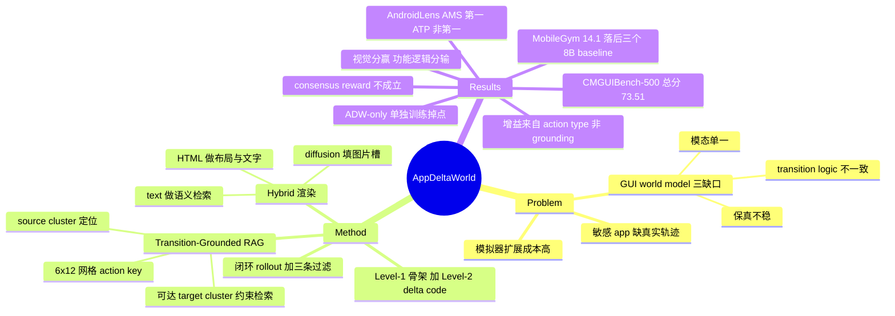

## Summary

把 mobile GUI world model 从"自由生成下一屏"改写成"在 action 可达性约束下检索 + 补 delta"：当前屏先转成结构化文本定位到 source cluster，再用 app 级 action-transition index（click/long-press 落点量化到 6×12 网格）圈定可达的 target cluster，从中检索 Level-1 HTML 骨架，生成 Level-2 delta code，diffusion 填充图片槽位，最后浏览器渲染成截图。CMGUIBench-500 上 Code2World 总分 73.51 居首（GPT-Image-2 72.34），但增益全部来自视觉侧 S_ele/S_lay（56.26/57.43 对 44.00/41.70），功能逻辑分 S_ad/S_id 反而低于 GPT-Image-2（79.69/77.00 对 91.73/83.40）。用它 rollout 出的 33,133 条轨迹配公开数据 SFT 出 AppDeltaAgent-8B，AndroidLens 全 split AMS 第一（Total-LL 90.28），但 MobileGym 14.1% SR 仍落后 AutoGLM-Phone-9B（20.0）等三个同量级开源 baseline。

## Problem & Motivation

Mobile GUI agent 的数据瓶颈在敏感 app 和隐私操作上没有真实轨迹。两条现有出路各有代价：搭可执行模拟环境要为每个 app 手写功能，随界面演进维护成本高；训 GUI world model 省掉工程量，但作者点名三个不达标之处——保真度不稳（复杂 action 下渲染页与真机偏离）、模态覆盖单一（纯文本模型给不出视觉训练数据，纯图像模型抓不住密集 UI 文本和细粒度布局）、以及 transition logic 不一致（面对非法 action 时模型不会拒绝，而是幻觉出一个新页面）。

这三条里第三条是本文真正的杠杆点：既有 code-level world model（Code2World、gWorld）已经解决了"渲染出来的东西像不像 GUI"，但没解决"这个 action 在真 app 里到底能不能到达这个页面"。

## Method

**Transition-Grounded Level-1 检索。** 离线建索引时，每个历史屏被逆向工程成可执行 HTML，存成 `(检索文本 r_i, Level-1 参考 HTML, 粗功能类别 c^(0), 细粒度簇 c^(1))`。粗类别由规则分类器从 page type / functional template / region layout / slot schema 映射得到；细粒度簇则对 layout(0.45) / DOM signature(0.25) / semantic text(0.20) / slot schema(0.10) 四路 hashed TF-IDF 的加权向量做 cosine 聚类，嵌套在粗类别之下。推理期只查细粒度簇。

关键约束在 target 侧：对每个 `(source cluster, action type, action target key)` 三元组，transition memory 存了候选 target cluster 集合；click/long-press 的落点量化成 6×12 网格，swipe 可同时用起止两格。检索 Level-1 参考时只在这个集合内做 argmax，找不到受支持的 target cluster 就把该 transition 判为 invalid / low-confidence。这条约束是"拒绝非法 action"能力的物理载体。

**Hybrid 三模态渲染。** 文本负责语义匹配与 transition grounding（先预测下一屏的语义描述 ŝ_{t+1}，用作 target 侧检索 query），code 负责精确布局与密集文字，diffusion 负责 code 表达不了的图片区域。生成器 G_θ 以 (当前截图, 结构化 action, 预测的下屏文本, 检索到的 Level-1 参考) 为条件输出 Level-2 HTML，其中图片槽位是文本描述；Qwen-Image 风格的 T2I 按描述填图，再交给浏览器渲染。作者的观察是商品页和视频类 app 里图片槽占页面主体，不填图会显著掉保真度。

**World-Model-in-the-Loop 数据构造。** 从 GUI-Owl 和 OpenMobile 采种子 `(初始截图, 指令, app 元数据)`，让 action policy 在 AppDeltaWorld 里闭环 rollout：policy 出 action → world model 生成并渲染下一屏 PNG → PNG 回喂 policy。三条过滤规则：action 描述与坐标必须一致、不接受连续重复动作、最后一步必须是主动终止而非撞上步数上限。

训练数据方面，world model 用 100,149 个 transition step，其中 CMGUI 一家占 95,614 步（95.47%），CAGUI/Magic-RICH/ChiM-Nav 合计不到 5%；所有 HTML 是用 Claude-4.8-Opus 和 Gemini-3.1-Pro 逆向工程出来的。Action model 侧 116,730 条样本 = GUI-Owl 56,237 + AppDelta 合成 33,133 + OpenMobile 27,360。

## Key Results

**World model 保真度（CMGUIBench-500 / Code2World）。** AppDeltaWorld 总分 73.51，压过 GPT-Image-2（72.34）和 Gemini-3.1-Pro-Image（71.57），相对 Qwen3-8B 基座（50.53）提升 22.98 分。但拆开看，胜负手完全在视觉细节：S_ele/S_lay 56.26/57.43 对 GPT-Image-2 的 44.00/41.70；功能逻辑分 S_ad/S_id 79.69/77.00 反而**低于** GPT-Image-2 的 91.73/83.40。作者自己补了一句：S_lay 只评相对位置和整体结构，评不了同分辨率下元素坐标是否一致，而人工评估中 GPT-Image-2 的元素对齐比 AppDeltaWorld 更好。代价一栏同样醒目——平均输出 8309.40 tokens，是最啰嗦的 code baseline（GPT-5.4，4960.50）的 1.7 倍。

**消融。** 去掉 diffusion 总分 73.51→70.91，掉的是 S_ele/S_lay（56.26/57.43→50.00/50.50）；去掉 RAG 掉到 67.46，掉的是功能逻辑（S_ad/S_id 79.69/77.00→65.16/69.40）；两个都去 65.68。两个组件各管一头，分工干净。

**下游 agent。** AndroidLens 上 AppDeltaAgent-8B 全部语言 × 指令粒度 split 的 AMS 都是最高（Total-LL 90.28、Total-HL 82.53，基座 Qwen3-VL-8B 为 80.33/78.08）。但 ATP 不成立同样的结论：Total-LL ATP 46.63 低于 UI-TARS-7B-DPO 的 52.45。MobileGym 上 SR 14.1%（基座 10.2%），落后 AutoGLM-Phone-9B（20.0）、UI-Venus-1.5-8B（15.4）、GUI-Owl-1.5-8B-Think（15.1）；且 Unexpected Side Effects 19.7% 是全部开源 GUI 专用模型里最高的。MobileWorld 上 GUI-only SR 14.9%（基座 9.4%），平均步数从 24.8 涨到 30.1，而 Overall SR 一栏直接留空未报。

**增益来自哪里。** 逐 action type 拆解显示提升不在 grounding：低层指令上 wait 从 14.19 涨到 72.97、type 从 77.66 到 89.37，而 click 只从 91.82 到 95.88；高层指令上是 swipe（41.31→58.37）和 stop（43.73→59.32）在涨。也就是说 world model 供的是"该做哪类动作、什么时候停"的经验，不是"点哪儿"。作者据此论证：即使渲染页的元素坐标和真 app 对不齐，高层交互经验依然有训练价值。

**数据规模与纯度。** 合成数据单独用会**掉点**：ADW-only 设置下 Total-LL/HL ATP 相对基座反而降 1.16/1.15，必须和公开数据混。混合下从 0K 加到 28K 单调提升但边际递减，12K 就拿到约 75% 的最终增益，20K 后饱和。构造侧只有 1/10 的数据通过质量校验，失败原因是任务进度判断失效导致打转、链式步数增加后页面质量崩塌、以及规定步数内没完成。

**World-model-based RL。** self-score RL（policy 采 8 个 action，world model 渲染下一屏，policy 自评一致性与进度作 reward）在四个 app 上 step-48 的 AMS 分别 +1.51 / +3.25 / +3.02 / +5.06（飞猪 / 美团 / 京东 / 淘宝），reward 在前 60 次更新里从 68 升到 76。consensus-reward RL（8 指令 × 8 rollout，按 0.60 视觉 + 0.40 文本相似度、阈值 0.82 聚类，只有落在唯一最大簇且簇内 ≥2 成员才给 reward 1）则是个负结果：平均 reward 0.412，获胜簇平均只有 3.295/8 个 rollout 支持，23.5% 的 group 根本没有唯一赢家。作者自己的判词是当前 dense visual-text state 表示不足以让语义等价的后继状态聚成可靠的簇。

## Evidence Ledger

| Claim ID | Claim | Type | Source locator | Evidence excerpt | Status |
|:--|:--|:--|:--|:--|:--|
| C1 | CMGUIBench-500 总分 73.51 居首，高于 GPT-Image-2 72.34、Gemini-3.1-Pro-Image 71.57 | number / sota-novelty | Table 2 | "AppDeltaWorld (Ours) Text+Code+Diffusion 79.69 77.00 56.26 57.43 91.84 78.82 8309.40 73.51" | source-verified |
| C2 | S_ele/S_lay 56.26/57.43 优于 GPT-Image-2 的 44.00/41.70，但 S_ad/S_id 79.69/77.00 低于其 91.73/83.40 | comparison | Table 2 | "GPT-Image-2 obtains 44.00/41.70 on S_ele/S_lay, compared with 56.26/57.43 for AppDeltaWorld" | source-verified |
| C3 | 论文自承人工评估下 GPT-Image-2 元素对齐优于 AppDeltaWorld | comparison | World-Model Fidelity Evaluation | "Based on manual evaluation, GPT-Image-2 shows better element alignment than AppDeltaWorld." | source-verified |
| C4 | 平均输出 8309.40 tokens，为表内最高（次高 GPT-5.4 4960.50） | number | Table 2, Avg. Tokens | "AppDeltaWorld (Ours) ... 8309.40"；"GPT-5.4 Code ... 4960.50" | source-verified |
| C5 | 消融：w/o Diffusion 70.91；w/o RAG 67.46（S_ad/S_id 79.69/77.00→65.16/69.40）；两者皆去 65.68 | number | Table 4 | "Removing RAG causes a larger decline to 67.46 and substantially reduces S_ad/S_id from 79.69/77.00 to 65.16/69.40" | source-verified |
| C6 | AndroidLens 全 split AMS 最高（Total-LL 90.28 / HL 82.53），但 Total-LL ATP 46.63 低于 UI-TARS-7B-DPO 的 52.45 | comparison | Table 3 | "AppDeltaAgent-8B (Ours) ... 90.28 46.63 82.53 33.05"；"UI-TARS-7B-DPO ... 81.30 52.45" | source-verified |
| C7 | MobileGym SR 14.1%，低于 AutoGLM-Phone-9B 20.0、UI-Venus-1.5-8B 15.4、GUI-Owl-1.5-8B-Think 15.1 | comparison | Table 5 | "AppDeltaAgent-8B (Ours) 14.1±1.4"；"AutoGLM-Phone-9B 20.0" | source-verified |
| C8 | MobileGym 上 USE 19.7%，为开源 GUI 专用模型中最高 | number | Table 5, USE 列 | AppDeltaAgent-8B "36.0 0.7 19.7"；其余为 12.6 / 7.7 / 14.1 / 11.0 / 7.6 | source-verified |
| C9 | MobileWorld GUI-only SR 14.9（基座 9.4），步数 24.8→30.1；Overall SR 未报 | number | Table 6 | "AppDeltaAgent-8B (Ours) – 14.9 30.1" | source-verified |
| C10 | 仅用 ADW 合成数据训练使 Total-LL/HL ATP 相对基座下降 1.16/1.15 | number / causal-mechanism | SFT Data Scaling / Fig 7(a) | "under the ADW-only setting, Total-LL/HL ATP instead decreases by 1.16/1.15 relative to the base" | source-verified |
| C11 | 仅 1/10 的构造数据通过质量校验 | number | Training Data Statistics | "only 1/10 of the data passed the quality verification" | source-verified |
| C12 | World model 训练数据 100,149 步，CMGUI 占 95,614 步（95.47%） | number | Table 1 / Introduction | "CMGUI (Xie et al. 2026) 95,614 95.47%" | source-verified |
| C13 | 增益来自 action type 而非坐标定位：wait 14.19→72.97、type 77.66→89.37、click 仅 91.82→95.88 | causal-mechanism | Action-Type Improvements / Fig 4 | "wait improves from 14.19 to 72.97, type from 77.66 to 89.37, but click only from 91.82 to 95.88" | source-verified |
| C14 | consensus reward 均值 0.412，获胜簇平均支持 3.295/8，23.5% 的 group 无唯一赢家；作者判定其尚不能独立作 reward | number / causal-mechanism | Clustering reward RL / Fig 6 | "consensus reward averages 0.412"；"23.5% of rollout groups have no unique supported winner" | source-verified |
| C15 | self-score RL step-48 在飞猪/美团/京东/淘宝上 AMS 分别 +1.51/+3.25/+3.02/+5.06，reward 前 60 步从 68 升到 76 | number | Self-score RL / Fig 5 | "improves AMS by 1.51, 3.25, 3.02, and 5.06 points on Feizhu, Meituan, JD, and Taobao" | source-verified |
| C16 | 合成数据 0K→28K 单调提升但边际递减，12K 达约 75% 增益，20K 后饱和 | number | SFT Data Scaling / Fig 7(b)(c) | "approximately 75% of the final gain is achieved by 12K, and performance saturates after 20K" | source-verified |
| C17 | 论文未提供任何公开代码库或 project page | license-code | 全文 + abs 页 | 全文与 abs 页均无 code/project URL，abs 页无 Comments 字段 | source-verified |
| C18 | 论文引用并沿用同一一作 Weikai Xu 的前作 arXiv:2605.10347 | benchmark-setting | References / RL 节 | "W. Xu, ... (2026a) How mobile world model guides gui agents?. arXiv:2605.10347" | source-verified |
| C19 | 作者机构 | benchmark-setting | 作者块 / abs 页 | 作者名带上标 1-5 与 ∗/†/‡，但 abs 页与 HTML 全文**均无** affiliation 图例 | source-verified（结论：机构不可解析，frontmatter `institute` 留空） |
| C20 | World model 不被部署后的 AppDeltaAgent 在下游 benchmark 推理时调用 | causal-mechanism | Settings / Agent Policy Evaluation | 论文只把 AppDeltaAgent-8B 描述为 SFT 后的 Qwen3-VL-8B policy，评测环节从未提及 world model | **unsupported**（属"沉默推断"：原文既未声明也未否认；已在 Notes 中降级为我的读法，不作事实陈述） |

## Strengths & Weaknesses

**站得住的部分。** 用 action-transition index 约束检索空间，是把"这个动作在真 app 里能不能到达那个页面"这一先验从生成模型的隐式知识里拿出来、变成显式可查表的结构。这比"让模型更会画"更接近问题本体：GUI world model 出错的代价不在像素糊，而在编出一个真机不存在的后继状态，后者会静默污染整条训练轨迹。消融也支持这个分工——RAG 掌功能逻辑（去掉后 S_ad/S_id 崩 14 分），diffusion 掌视觉完整度（去掉后 S_ele/S_lay 掉 6-7 分），两者不互相替代。

逐 action type 的归因分析是全文最有信息量的一段：把"合成环境到底教会了 agent 什么"从总分里解出来，答案是动作类型选择、文本输入和停止时机，不是坐标定位。这条结论比 SOTA 数字更可迁移——它意味着低保真渲染器对"决策层"经验仍然有效，坐标不准并不必然废掉这条数据管线。作者对负结果的处理也算坦率：ADW-only 掉点、consensus reward 不成立、人工评估里 GPT-Image-2 对齐更好，三条都写在正文而非附录。

**该打折的部分。** "SOTA on AndroidLens" 这个说法只在 AMS 口径下成立。ATP 口径下 UI-TARS-7B-DPO 的 Total-LL 52.45 高于 AppDeltaAgent 的 46.63，abstract 里的 "state-of-the-art performance" 没有限定指标。MobileGym 上的措辞 "surpasses several competitive 8B baselines" 更值得推敲——表里 14.1% 只赢了 UI-TARS-1.5-8B（13.8）和 Step-GUI-4B（12.9），输给三个同量级模型；且 USE 19.7% 是开源 GUI 专用模型中最高，意味着这套训练在提高完成率的同时也提高了副作用发生率，论文对此没有讨论。MobileWorld 表里自家 Overall SR 留白，在一个同时报了另外 11 个模型 Overall SR 的表里显得刻意。

CMGUIBench-500 上的"总分第一"同样是加权口径产物：功能逻辑输 12 分、视觉细节赢 12 分，最后靠 SigLIP/DINOv2 打平凑出 1.17 分优势。如果 Code2World 的加权稍有不同，排名会翻。作者自己承认 S_lay 评不了绝对坐标一致性且人工评估里 GPT-Image-2 更好——那么这个"第一"能否支撑"最高保真度"的表述是存疑的。

成本侧几乎没被讨论。平均 8309 tokens/步是最贵 code baseline 的 1.7 倍，而这是一个要闭环跑 rollout 的环境；叠加 1/10 的通过率，产出 33,133 条可用样本意味着生成侧规模在 30 万步量级（这是我按通过率的反推，论文未报总生成量、总 token 数或成本）。与之对照，作者批评模拟器 "costly to scale up" 的论据是人工维护成本——但没有把两条路线的边际成本放在同一张表上比。

最后是覆盖面。World model 训练数据 95.47% 来自 CMGUI 单一来源，另外三个数据集加起来不到 5%；数据规模实验也显示 12K 就吃掉 75% 的增益、20K 饱和，作者归因于"action model 监督的多样性受限于 world model 的经验，无法靠指令增广无限扩展"。这句诚实的话其实动摇了 abstract 的核心卖点：如果合成经验的多样性天花板由 world model 的训练分布决定，那"可扩展地替代真实交互环境"就只在 world model 见过的 app 分布内成立，而这恰恰不是"敏感 app 缺真实轨迹"那个原始问题所在的区域。

## Mind Map

## Notes

**它的 transition 给谁用？** 三个用途都在 agent 之外：离线保真度评测（evaluator 侧）、生成 SFT 轨迹（trainer 侧）、RL 训练期提供后继状态与 reward（trainer 侧）。部署后的 AppDeltaAgent-8B 就是一个 SFT 过的 Qwen3-VL-8B，在 AndroidLens / MobileGym / MobileWorld 上按当前截图直接出动作。需要说明的是，论文从未声明"推理时不查 world model"，这是我从评测章节的沉默中读出来的（Evidence Ledger C20 已标 unsupported）——但正文把 AppDeltaAgent 一律描述为 action model，且 self-score RL 那节明确是在做 GRPO 权重更新而非推理期查询，两处都指向同一读法。

对本 vault 的 Agent-Facing Environment Runtime 方向而言，这篇的位置很明确：**它造的是 trainer-facing 的经验发生器，不是 agent-facing 的 affordance。** 但它内部恰好造出了一个本该 agent-facing 的东西却没暴露——那个 action-transition index。这张表能回答"在当前 cluster 上做这个 action 是否有受支持的 target"，形式上就是一个 action validity oracle；论文只把它用在两个内部环节（约束检索空间、rollout 时的 QC 过滤 invalid transition），从没考虑把它作为 agent 可查询的接口。若把这个查询暴露给 agent，"这一步是否可行"就从"生成完再判"变成"生成前可问"，正是 state/verifier 作为 affordance 暴露的典型形态。这是我目前从这篇里读到的最有价值的一条延伸线索。

另一个与本方向直接相关的观察在 consensus reward 的负结果里：8 个 rollout 的后继状态聚不出可靠共识（平均只有 3.295/8 支持、23.5% 无唯一赢家），说明这套 world model 缺的是**状态等价判定**（两个渲染结果是不是"同一个状态"）。这正是 agent-facing runtime 里 fork / reset / 状态比对所依赖的底座能力。作者把它归为"需要更好的 state-consistency metric 或可学习的聚合机制"，方向判断是对的，但没做。

**与 vault 已有笔记的关系。**

- [[Papers/2605-MobileWorldModelGUI]] 是同一一作 Weikai Xu 的直系前作，本文在 Related Work 和 RL 两处显式引用（C18）。前作系统比较 delta text / full text / diffusion image / renderable code 四种模态，结论是 renderable code 分布内保真最高。本文等于取走那个赢家再补两件事：给 code 生成加可达性约束、给图片区补 diffusion。前作还有一条结论是"world model 更适合做 prior perception 而非 test-time verifier"——本文的 consensus reward 负结果算是从另一条路径复现了它，两次都指向同一个瓶颈：world model 判不准"到没到、对不对"。
- [[Papers/2608-WorldProxy]] 主张 world model 应按"让查询它的 agent 变好多少"验收而非按生成保真度。本文正好是两条都报了的实例，而且两条口径打架：Code2World 总分第一，但下游 MobileGym 落后三个同量级模型。这是对 WorldProxy 那个论点的一个经验支撑——保真度排名和下游收益排名确实不同构。按 WorldProxy 的 L1/L2/L3 分级，AppDeltaWorld 是纯 L2（训练期信号），没有 L1（推理期提示）也没有 L3。
- [[Papers/2600-MobiledreamerGenerativeSketchWorld]]（MobileDreamer）被本文在 Related Work 中列为 text-level 方法的代表（"通过任务相关的文本 sketch 保留粗粒度布局"）。可作为同赛道对照读。
- [[Papers/2605-MobileGym]] 和 [[Papers/2512-MobileWorld]] 就是本文用的两个下游评测环境，vault 里都有独立笔记；核对本文数字时可以直接比对这两篇里记录的环境设定与难度分层。
- [[Papers/2511-DreamGym]] 是同一模式在 web/general agent 上的先例（合成经验替代真实 rollout），可以和本文并读来看"合成经验必须混真实监督才不掉点"这条规律是否跨域成立——本文的 ADW-only 掉点（C10）是一个新的支持证据。
- [[Papers/2608-MobileWAM]] 与 [[Papers/2607-N0TWAM]] 是 embodied 侧的 world-action model，和本文没有方法上的交集，但共享同一个部署形态：world model 在训练期承重、推理期丢弃（MobileWAM 的 Chain-of-Foresight 和 video 分支在推理时全部丢掉）。三篇放在一起看，"world model 只在训练期存在"目前是跨 GUI 与 embodied 的默认工程选择，而这恰是本 vault 主方向要挑战的假设。
- [[Papers/2607-GUIStateBelief]] 诊断 GUI agent 的 state belief 更依赖像素还是结构。本文的管线是 HTML → 浏览器渲染 → PNG → 回喂 policy，中间把结构信息全丢了只留像素；结合前者的结论，值得追问：既然 world model 手上有完整 DOM，为什么只把渲染后的像素喂给 agent？这可能也解释了为什么增益集中在 action type 而非坐标定位（C13）。

**待查。** 作者机构在 abs 页和 HTML 全文里都查不到（C19），frontmatter `institute` 暂留空；从前作 [[Papers/2605-MobileWorldModelGUI]] 的记录看至少涉及 Tsinghua 与 NTU，但两篇作者列表不完全重合，不据此回填。若后续出正式版或 v2，补齐机构与可能的代码发布。
