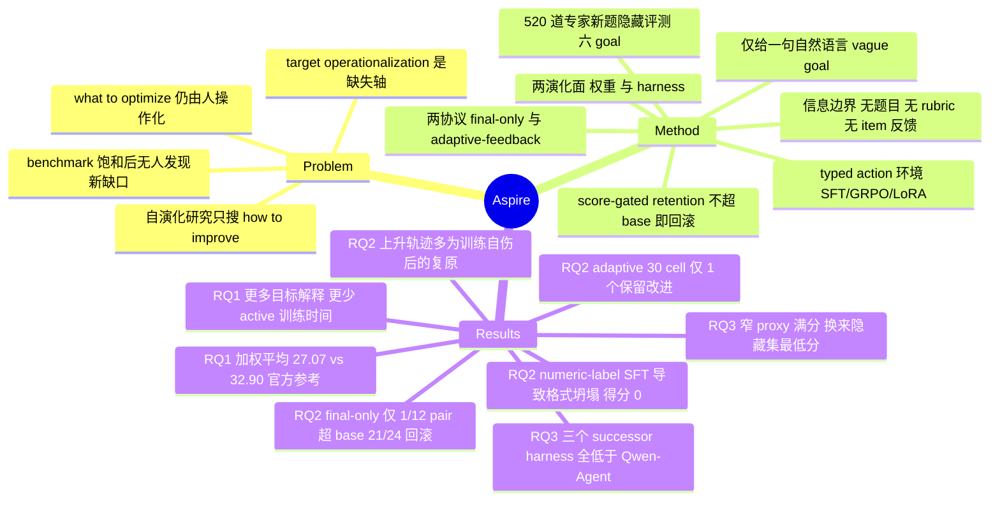

## Summary

Aspire 把 self-evolution 的起点从"人类已经指定好的任务与评测脚本"退回到一句自然语言的模糊能力目标，要求 agent 自己完成 target operationalization——选数据、定更新方法、造验证信号——再用 520 道 agent 不可见的专家新题做外部裁决。三项实验一致给出负性结论：agent 能稳定跑完 data–train–verify 闭环，但 final-only 协议下 12 个 model–goal pair 只有 1 个 Avg@2 超过 base score，adaptive-feedback 的 30 个 cell 只留下 1 个被保留的改进，三个演化出的 successor harness 全部低于人工 Qwen-Agent 参考。

## Problem & Motivation

现有 LLM self-evolution 工作（PostTrainBench、LaMDAgent、Evo-Memory、SEAL）几乎都在人类已经把"提升数学推理"操作化成"提升 AIME 分数"之后才开始：任务格式、难度区间、指标、成功判据都已给定，agent 只搜索 how to improve，不决定 what to optimize。作者把这条缺失的轴命名为 **target operationalization**——把宽泛能力方向转换成可训练目标、学习信号与验证标准，并指出它正是递归自我改进的持续性卡点：当既有 benchmark 饱和或不再反映新的能力缺口时，发现弱点、翻译成任务、设计 reward 这三件事仍然只能由人来做。

论文用 forward deployed engineer 的角色做类比来定位这个空白：真实部署里目标是模糊的、反馈信号常常缺失或不可靠、执行系统本身尚不存在，这三层工作今天由人类工程师补齐。Aspire 只取第一层。这个 formulation 带来一个方法论后果——一旦允许 agent 自己构造 proxy，就多出一个在既有 benchmark 里不存在的失败模式：proxy 上的收益不保证转移到目标能力。因此评测必须由一个 agent 完全不可见的外部 evaluator 来做，否则测的还是"能不能优化给定指标"。

## Method

**任务形式化与两个演化面。** 一个 campaign 固定 controller 侧契约（vague goal、绑定该 goal 的版本化 evaluator、judge、typed action contract、预算、预声明的终选规则），round 内状态由模型权重、agent harness、指挥搜索的 decision model 三部分组成。Aspire 刻意把"被演化的组件"和"指挥搜索的策略"分开：权重演化时固定 harness 与 decision model，harness 演化时固定权重与 decision model。训练出的 descendant 只能在下一轮被显式 promote 成 decision model，不做轮内自动替换——所以论文报告的全部结果都属于自导向的权重/harness 搜索，而非递归的 decision-model 替换，这一点作者自己反复限定。

**隐藏评测集。** 520 道题分属六个互斥 goal：科学与学术推理 75、人文社科知识 110、健康医学推理 100、数学推理 126、逻辑可靠性与指令遵循 89、学术科技写作 20（写作是 20 个可产出多个评分样例的 task bundle，所以 RQ3 同时报 task-macro 与 example-micro）。全部题目由领域专家从零撰写，GPQA、MMLU-Pro、MedQA 只作任务形态与难度参照，不抄题。质控链是：独立评审剔除错误、不完整、欠定义或不可稳定评分的候选，Seed-2.0 / GPT-5.2 / Gemini-3 盲筛按失败模型数标 L0–L3 难度，精确与语义去重加对参照 benchmark 的 overlap 审计，scorer binding，最后按 SHA-256 manifest 冻结版本。第五个 goal 论文明确自陈是复合目标，不主张逻辑推理、抗幻觉、指令遵循三者可分别识别。

**信息边界。** 这是整套设计的骨架而非附属条款：agent 看不到题目、参考答案、rubric、routing label、候选输出与判分推理；每一份注册进训练后端的数据都要先过一遍对隐藏集的精确与语义 overlap gate；协议只返回它允许的聚合分。论文也没有把这套边界说成分布外——它把 OOD 限定为"独立撰写、排除在 agent 训练与自建验证数据之外、在 agent 构造的学习信号之外评测"，并明确不主张这些题的边际文本分布与预训练语料不相交。

**最小交互环境与 safe retention。** agent 不操作 shell、不搭运行时、不写分布式代码，只通过一个 typed action 工具做：搜索/下载/导入/合成数据、发起 SFT 或 GRPO（可配 LoRA）、查作业状态、在自有 validation data 上跑检查、分支或终止；凭证、存储、调度、checkpoint 校验由 controller 吸收。保留机制是 score-gated：只有当 selected checkpoint 相对 incoming state 的原始分差为正才保留，否则回滚。因此保留增益恒非负——而论文明确点出这是 selection outcome，不是"每次更新都改进能力"的证据。这条自我限制是本文最该被同领域抄走的度量纪律。两套反馈协议分别测两种情形：final-only 全程无中间分、只提交一个终态 checkpoint，测开环执行；adaptive-feedback 允许对同一 goal 的隐藏题在配额内重复查聚合分，测稀疏黑箱反馈下的搜索。

## Key Results

**RQ1：换成模糊目标之后发生了什么。** 在 PostTrainBench 原始 sealed evaluator 上，把 benchmark 名替换为宽泛能力描述后，Claude Opus 4.8 加权平均 27.07，对应官方 explicit-task 参考 32.90；GPT-5.6 为 29.58，对应官方 36.23。但 task 级并非一致退化：vague-goal Claude 在 HumanEval（56.63 vs 47.33）与 BFCL（58.63 vs 47.13）反而更高，GPT-5.6 在 GSM8K 更高（74.35 vs 69.48），退化集中在 HealthBench 与 ArenaHard。过程侧（48 对 matched run pair）：vague-goal 多 2,109 秒 decision-model thinking、多 0.61 GPU-idle 小时，active 时间少 1.27 小时；读任务定义的密度升 2.98 倍、查评测脚本 2.39 倍、LoRA/PEFT 使用 3.09 倍（LoRA 出现率 89.8% vs 24.1%，33 对从不用切到用且无反向切换）；但 trace 级平均 tool action 数从 188.5 降到 179.2，并未增加。作者据此只说"更多目标操作化工作、更少实际更新时间"，不主张前者挤占后者，也不主张这解释了最终分差。

**RQ2：自导向的权重演化。** final-only 协议 24 个 run，每 run 上限 40 GPU-hours、只能提交一个终态 checkpoint。12 个 model–goal pair 中只有 Qwen3.5-9B 的科学推理一个 Avg@2 超过 base（45.33 升到 48.00，+2.67），4B 是 0/6；个体 run 层面 3/24 超过 base，其余 21 个被回滚到 base model。原始终态宏平均从 35.735 掉到 18.609（4B）、从 39.010 掉到 25.640（9B）。唯一那个正例还被作者自己拆开看：两次 run 都得 48.00、都答对 36/75 题，但只有 26 题重合，20/75 题在两次之间翻转对错——聚合方向一致，item 级并不稳定。

adaptive-feedback 协议 30 个 configuration–goal cell（每 cell 一次 run），28 个产出 evaluated checkpoint、21 个满足 eligibility，只有 2 个 cell 的 best evaluated checkpoint 超过 base（4B Self 科学 44.00 升到 45.33；Terra 在 4B 数学 17.86 升到 20.10），其中只有 Terra 那个同时通过 eligibility 并在回滚后留存。作者进一步给这唯一的正例降级：20.10 是在同一固定评测切片上用重复聚合反馈选出来的，没有独立确认切片，只能算 feedback-guided selection，不是独立复现的能力增益。

三条轨迹级发现比主结果更有信息量。其一，**搜得多不等于搜得好**：Sol 注册 40 个 plan、产出 33 个 evaluated checkpoint、消耗 76.56 settled training GPU-hours，没有一个超过对应 base；Terra 的数学后代从 20.10 跌到 2.78 再回到 18.17。其二，**看起来的进步常常是自伤后的复原**：22 个多 checkpoint cell 的 62 次连续 transition 中 28 升、13 平、21 降，14/22 的后续搜索超过了第一个 evaluated checkpoint，但例如 4B Self 的数学是 0.79 → 1.75 → 2.38，全程远低于 17.86 的 base——lineage 内的正斜率完全可以只是从训练自伤中爬回来。其三，**数据–方法错配可以直接打崩输出格式**：五个提交的 checkpoint 用 numeric-label MMLU SFT，训练快照 21,000 个 target 全为单数字，279 个对应评测输出也全为单数字，得分 0、0、0、6.141、0；同时 4B Self 在 30/32 次 dataset import 中拿的是 GSM8K 或 Hendrycks 数学数据，包括那些目标是科学、逻辑、写作的 run。全部 24 次终评一次判分通过、2,080 个 item 输出非空，所以这些退化不能归给评测故障。

**RQ3：权重冻结下的 harness 演化。** 固定 Qwen3.5-4B 为 runtime model、原始 Qwen-Agent 为参考 harness，四个 creator 各尝试造一个 successor。Qwen3.5-4B Creator 没能产出合法 harness，按预声明规则记 0；三个 GPT-5.6 变体全部低于参考的 28.64 task-macro / 27.65 example-micro——Sol 27.22/25.97、Terra 20.76/20.14、Luna 19.32/18.33。每个冻结 harness 在同一 20 道写作题上执行三次取均值，分数不回传 creator，且没有任何 run 把 H1 演化成 H2，所以这测的是一步 harness 生成而非递归自改。

两个机制诊断值得单独记住。Luna 在自造的 8 项 checklist 上通过加一个五段式研究模板把分数从 7/8 提到 8/8，另两个同构 prompt 也 8/8，于是约 40 分钟后收工；但检查隐藏集发现该模板会把索要机制、公式、参数、工程细节的问题重写成研究设计题——窄 proxy 上的满分换来的是隐藏集上最低的 19.32。Terra 正确否掉了一个会编造显著性结果与效应量的 two-pass reviewer，却漏掉了 final-answer invariant：calculator 调用后 final response 为空时，harness 提交了调用前的残稿；两道题因此返回 342 与 520 字符的片段，分数从 75.00 和 52.33 掉到 2.57 和 2.91，算术上约占该次执行总跌幅的 70%。Sol 花 3 小时 11 分跨四类验证任务测了 prompt 长度、工具调用恢复、禁用工具与复审 pass，主动否掉了本地分更高但有幻觉、延迟或工具控制问题的变体，最终只加了一个"末次响应完整非空"的检查——而这个检查在 20 道题上一次都没触发，所以它改善的是失败语义而非任务准确率。

## Evidence Ledger

| Claim ID | Claim | Type | Source locator | Evidence excerpt | Status |
|:--|:--|:--|:--|:--|:--|
| C1 | 隐藏评测集 520 道专家新撰题，六 goal 分布 75/110/100/126/89/20 | number | Sec 3.2；Appendix A.1 Table 2 | "scientific and academic reasoning (75 items); humanities and social-science knowledge (110); health and medical reasoning (100); mathematical reasoning (126)" | source-verified |
| C2 | RQ1 加权平均：vague-goal Claude 27.07 vs 官方 32.90；vague-goal GPT-5.6 29.58 vs 官方 36.23 | comparison | Sec 4.2；Appendix B Table 3 | "Weighted average 32.90 27.07 36.23 29.58" | source-verified |
| C3 | matched pair 多 2,109 秒 thinking、多 0.61 idle 小时、少 1.27 active 小时；读任务定义 2.98 倍、查评测脚本 2.39 倍 | number | Sec 4.2；Appendix B | "2,109 more seconds of decision-model thinking and 0.61 more hours of idle time per matched run pair, alongside 1.27 fewer active hours" | source-verified |
| C4 | final-only 仅 9B 科学一个 pair 的 Avg@2 超 base（45.33→48.00，+2.67），4B 为 0/6；个体层面 3/24 超 base、21/24 回滚 | number | Sec 4.3；Appendix C.3 Table 4 | "both runs rise from 45.33 to 48.00... 3/24 final checkpoints exceed their base scores, while rollback retains the base model in the other 21 runs" | source-verified |
| C5 | adaptive-feedback 30 cell 中 28 个有 evaluated checkpoint、21 个合格、仅 2 个超 base，唯一保留改进是 Terra 数学 17.86→20.10 | number | Sec 4.3；Appendix C.4 | "28 produce an evaluated checkpoint and 21 satisfy the predeclared provenance, exploration, completion, and terminal-record requirements" | source-verified |
| C6 | Sol 产出 33 个 evaluated checkpoint、76.56 settled training GPU-hours，无一超对应 base | number | Sec 4.3；Appendix C.4 | "it produces 33 evaluated checkpoints with 76.56 GPU-hours, but none exceeds the corresponding base score" | source-verified |
| C7 | Qwen3.5-4B Self 在 30/32 次 dataset-import 中导入 GSM8K 或 Hendrycks 数学数据，含科学、逻辑、写作目标 | number | Sec 4.3；Appendix C.4 | "imports GSM8K or Hendrycks mathematics data in 30/32 dataset-import events, including events for science, logic, and writing" | source-verified |
| C8 | 五个 numeric-label MMLU SFT checkpoint：21,000 单数字 target、279 个单数字输出、得分 0/0/0/6.141/0 | number, causal-mechanism | Sec 4.3；Appendix C.3 | "snapshots contain 21,000 single-digit targets, and all 279 corresponding evaluation outputs are also single digits; the five final-checkpoint scores are 0, 0, 0, 6.141, and 0" | source-verified |
| C9 | 三个 successor harness 全低于 Qwen-Agent 参考 28.64/27.65：Sol 27.22/25.97、Terra 20.76/20.14、Luna 19.32/18.33；4B Creator 无合法 harness 记 0 | comparison | Sec 4.4 Table 1 | "Original Qwen-Agent reference 28.64 27.65... Luna successor harness 19.32 18.33... Terra 20.76 20.14... Sol 27.22 25.97" | source-verified |
| C10 | RQ3 每个冻结 harness 在同一 20 道隐藏写作题执行三次取均值，分数不回传 creator，无 H1→H2 递归 | benchmark-setting | Sec 4.4 | "frozen and executed three times on the same 20 hidden evaluation items... No run evolves H1 into H2, so the experiment evaluates one-step harness generation" | source-verified |
| C11 | Terra harness 空 final response 提交残稿：342/520 字符，分数 75.00→2.57、52.33→2.91，约占该执行跌幅 70% | causal-mechanism | Sec 4.4；Appendix D | "partial drafts of 342 and 520 characters, with scores falling from 75.00 and 52.33 under H0 to 2.57 and 2.91... approximately 70% of the aggregate decline" | source-verified |
| C12 | 保留增益非负是 rollback 的 selection outcome，论文明确声明它不是"每次更新都改进能力"的证据 | causal-mechanism | Sec 3.3 | "The nonnegative retained improvement follows from safety rollback and is therefore a selection outcome, not evidence that every attempted update improves capability" | source-verified |
| C13 | RQ1 用 PostTrainBench 原始 sealed evaluator，其结果明确不与 RQ2/RQ3 的六目标 Aspire 评测合并 | benchmark-setting | Sec 3.1；Sec 3.2 | "These task-specific results remain separate from, and are not pooled with, the six-goal Aspire evaluation used in RQ2 and RQ3" | source-verified |
| C14 | 22 个多 checkpoint cell 的 62 次 transition：28 升 13 平 21 降；14/22 后续搜索超过首个 evaluated checkpoint | number | Sec 4.3；Appendix C.4 | "62 consecutive transitions comprise 28 increases, 13 ties, and 21 decreases. Later search beats the first evaluated checkpoint in 14/22" | source-verified |
| C15 | 论文唯一公开 artifact 链接是 project page，未声明公开 GitHub 代码仓库 | license-code | 首页脚注；全文链接扫描 | "Project Page: https://self-developing-agents.github.io/" | source-verified |
| C16 | final-only 每 run 上限 40 GPU-hours、仅一次终态提交；settled training GPU-hours 为 final-only 149.236、adaptive-feedback 322.610 | number | Sec 4.3；Appendix C.3、C.6 Table 5 | "Adaptive-feedback protocol 30 124 107 322.610... Final-only protocol 24 – 83 149.236... 40 GPU-h/run" | source-verified |

## Strengths & Weaknesses

**问题形式化确实往前挪了一格。** 把 target operationalization 单列为一条被测轴，比再造一个"agent 能不能优化给定指标"的 benchmark 有信息量得多。PostTrainBench、AI4AI-Bench、RSIBench-Data 这一系都默认任务已经可执行，Aspire 把"任务变成可执行"这一步本身当成能力来测，并且给出了它必须成立的条件——外部 evaluator 对 agent 完全不可见，否则测的还是老问题。

**度量纪律罕见地严。** 三处自我设限值得单独表扬：保留增益非负被明说是 rollback 的产物而非学习证据；best evaluated / selected / retained 三种结果分开报，理由是高的中间分可能来自未完成的 run；唯一那个留存的 Terra 20.10 被作者自己降级成"feedback-guided selection，不是独立复现的增益"。多数 self-evolution 论文会把这三件事糊成一个 headline，这篇没有。

**负性结果的粒度到了机制层。** 21,000 个单数字 target → 279 个单数字输出 → 得分 0，这条链把"数据–方法错配导致答案格式坍塌"钉成了可复现的失败模式，而不是停在"效果不好"；RQ3 里 Terra 的空响应路径能被算出约占跌幅 70%，是同一类可操作的诊断。信息边界也做了工程化落实（注册数据过 overlap gate、evaluator manifest 用 SHA-256 冻结、prompt profile 版本绑定以防 vague-goal run 静默恢复成 explicit-task contract），"hidden evaluation"不只是口头承诺。

以下是我认为需要保留的边界：

**最强的结论其实是关于 Qwen3.5-4B/9B 的，不是关于"模型"的。** RQ2 被更新的权重始终是这两个小模型，decision model 也只有它们自己加 GPT-5.6 的三个变体。标题问 "Can Models Self-Evolve"，但"一个 4B 模型被自选的 SFT 打崩到答案格式坍塌"与"当前最强模型无法从模糊目标自演化"是两个命题。论文自己反复限定了 configuration，没有 overclaim，但这个外推极容易被下游引用者做掉。

**RQ1 的对照不干净，论文也承认。** 官方 PostTrainBench 分数是系统级参考，与 vague-goal run 共享 benchmark 定义与聚合权重，但其余 run metadata 可以不同。27.07 vs 32.90 这个差里有多少来自 prompt 中去掉了 benchmark 名、多少来自系统配置差异，这个实验答不了；task 级方向不一致（HumanEval、BFCL、GSM8K 反而更高）本身就是这层混杂的症状。因此 RQ1 只能当作过程侧的描述性证据读，不能当作"模糊目标导致降分"的因果结论。

**N=1 是全篇的软肋。** adaptive-feedback 是完整的 5×6 设计但每 cell 只跑一次；RQ3 每个 condition 只有一条 creation trajectory，那三次执行测的是冻结 harness 的运行时波动而非三次独立演化；per-execution 离散度未报。于是 27.22 vs 28.64 这 1.42 分究竟是不是噪声，从文中判断不了——而"三个 successor 全部低于参考"这个 headline 的强度恰好依赖于此。作者把这条写进了 limitations，但结论的传播强度不会跟着 limitation 一起走。

**"模糊目标更难"与"当前 scaffold 在模糊目标下更差"没有分开。** agent 拿到模糊目标后的行为——30/32 次导入数学数据、选 numeric-label MMLU SFT、在 8 题 checklist 满分就收工——更像是缺少"proxy 有效性自检"这一环，而不是模糊目标本身不可操作化。论文诊断出了这些失败，却没有做"给 agent 一个更好的 proxy 构造/校验工具后还差多少"的对照，所以 gap 归给目标形式还是归给 scaffold，仍然开放。这也正是这篇最有价值的后续接口。

**跨 goal 的计数结论对难度校准敏感。** 判分用 gemini-3.5-flash、8,192 token thinking budget、10% fail-closed 阈值；六个 goal 的分数量纲差异极大（health base 87.00、math base 17.86、writing base 19.27），而"只有 1 个 cell 保留改进"这类结论是在这些异质切片上数出来的。加之隐藏集按设计不会公开、项目页目前也没有代码或数据链接，外部无法独立验证难度校准与判分质量——这是 hidden evaluation 范式的结构性代价：它的价值来自不公开，可复现性也因此受限。

**影响判断（推测）**：这篇最可能被反复引用的不是它的 benchmark，而是"closing the training loop is not yet the same as closing the capability loop"这句话，以及支撑它的 21/24 rollback 与 62 次 transition 分解。它给 self-evolution 领域递了一个所有人都需要但很少有人做的对照纪律——把改进判给 base model，而不是判给上一个 checkpoint。

## Mind Map

## Connections

- [[Topics/SelfEvolvingAgents-Survey]] 的"负性结果"与"evolution gate"两节应当直接吸收本文。该 survey 已经把 self-improvement reversal、rise-and-collapse、recursive self-training collapse 归纳为三条独立的失效证据线，Aspire 提供了第四条且性质不同：前三条讲的是"演化过程会跑偏"，Aspire 讲的是"演化过程连闭合都算不上有效"——闭合训练环（28/30 cell 完成 data–train–verify）与闭合能力环（1/30 保留改进）之间存在系统性落差。它的 score-gated rollback 也是 gate 家族里少见的**度量侧** gate：不是拦住坏更新进入系统，而是拦住坏更新被计入战绩。
- [[Papers/2608-ContinualSkillBench]] 是最近的同类负性 benchmark，两者的失效点恰好互补。ContinualSkillBench 发现 sequential 相对 independent 的 +0.136 里几乎全部由"保留上下文与评测反馈"解释，显式 skill 维护的净贡献不可分辨——即**收益是真的，但归因给错了机制**；Aspire 发现的是**收益本身多数不存在**，因为它把参照系换成了 base model 而不是上一个 checkpoint。把两篇并读能得到一条统一的方法论要求：自演化实验必须同时报"相对 base 的 delta"和"去掉声称机制后的 delta"，否则报出来的都不是演化增益。
- [[Papers/2608-DarwinX]] 与本文 RQ3 构成一组值得追究的矛盾。DarwinX 在冻结 base model 下把 harness 演化做成 population selection，报告 Terminal-Bench 2.1 从 75.5% 升到 83.2%；Aspire 的三个 successor harness 全部低于人工 Qwen-Agent 参考。差异的候选解释至少有三个，都可检验：其一是**演化步数**——DarwinX 是多代 population 加 archive 重组，Aspire 明确只做一步 H0→H1；其二是 **fitness 信号质量**——DarwinX 的 fitness 全部来自 benchmark 自带 verifier 的 avg@k，Aspire 的 creator 只能用自建 validation data，而 Luna 那个"8 题 checklist 满分即收工"正是这种自建 proxy 的典型崩法；其三是 **runtime 模型能力**——DarwinX 跑在 GPT-5.5/5.6 上，Aspire 的 runtime 固定为 Qwen3.5-4B。这三者哪个是主因，是这一对结果留下的最具体的开放问题。
- [[Papers/2608-EvoHarnessRL]] 提供了另一条对照轴：它训练 agent **在 runtime 如何使用** harness（cost-aware 的"何时值得付一步代价"），而 Aspire RQ3 与 DarwinX 都是离线改 harness 本身。Aspire 的两个失败案例（Terra 缺 final-answer invariant、Sol 的完整性检查一次未触发）恰好都属于"harness 的控制流缺陷"，说明一步式 LLM 编辑最容易漏掉的正是那些低频但高损的失败路径——这类不变量或许更适合用 runtime 策略学习或人工契约来保证，而非交给一次性生成。
- [[Topics/Harness-Component-Attribution]] 的核心结论（harness 论文普遍报 bundle 级增益、把归因留给读者）在本文得到一个反向样本：Aspire 报的是 bundle 级**损失**，并且通过 Appendix D 把其中一次执行的跌幅算到了单一机制头上（Terra 空响应约占 70%）。这类"负增益的组件归因"比正增益的归因更容易做，因为失败路径通常是稀疏且可定位的——该 Topic 呼吁的分项报告，在负性结果里反而更可行。
- [[Topics/AgentHarness-Design]] 的预算口径审计框架可以直接套用：Aspire 在这一点上是正面样本，明确报了 final-only 149.236 与 adaptive-feedback 322.610 settled training GPU-hours、每 run 40 GPU-hours 上限、每 cell 10 小时 wall time，并把 Sol 的 76.56 GPU-hours 零收益作为独立发现报出来，而不是只报最好的那条曲线。
- [[Papers/2608-PRACTICE]] 与本文正好是同一天（2026-08-31）投出的两个相反答案。PRACTICE 把 skill library 的 update policy 变成可训练对象并拿到 EB-ALFRED / EB-Habitat 上 9.7 / 2.6 个百分点的提升，前提是任务、评测与技能空间都已给定；Aspire 撤掉这个前提后，同类的自更新循环就基本不产出保留增益。两篇合起来支持一个假设：**自演化的成败主要由目标与验证信号的质量决定，而非由更新机制的精巧程度决定**——这也是 Aspire "target operationalization 是缺失轴"主张的独立旁证。
- [[Papers/2608-CoEvolutionSurvey]] 用"演化自由边界逐步扩大"作为组织轴，把 Agent-Agent、Agent-Environment、Meta Co-Evolution 排成递进三阶段。Aspire 给这条叙事加了一个必要的反向刻度：边界扩大到"目标本身也由 agent 定义"这一格时，当前系统的表现是退化而非跃升。该 survey 讨论 Ω 算子作用域扩张时，值得把 Aspire 作为"自由度增加不等于能力增加"的实证锚点引入。
- [[Papers/2607-FrontisMA1]] 被本文列为 AI4AI 相关工作之一，两者是同一问题的两端：Frontis-MA1 训练一个专门的 meta-evolution 模型来做 ML 工程侧的递归自我改进，Aspire 则不训练任何新算法，只把目标说模糊后看现成的强模型能走多远。若要检验 Aspire 的 gap 归因（目标形式 vs scaffold 能力），把 Frontis-MA1 这类专训 decision model 放进 Aspire 的 vague-goal 契约里跑，是最直接的实验设计。
- [[Papers/2407-SelfImprovementReversal]] 是这条负性证据线的前作：它发现 post-training 的 self-improvement 在聚合指标上升的同时可能伴随能力面的退化。Aspire 的"上升轨迹多为训练自伤后的复原"（4B Self 数学 0.79 → 1.75 → 2.38 而 base 为 17.86）是同一现象在自演化设定下的更极端版本——参照系一旦从"上一个 checkpoint"换成"base model"，看似单调的自我优化曲线就整体落到水平线以下。
- [[Papers/2509-Misevolution]] 命名的是"演化过程自身偏航"的安全风险，Aspire 提供了这一风险的能力侧对应物：Luna 把学术写作 harness 特化成研究设计模板、4B Self 给写作目标导入 GSM8K，都不是安全事故，但机制同源——agent 在自建的窄 proxy 上得到强化信号，然后沿着这个信号偏离真实目标。两篇合看，misevolution 与 mis-operationalization 可能是同一根因（缺少对自建目标有效性的独立校验）在安全侧与能力侧的两种表现。
- [[Papers/2510-HuxleyGodelMachine]] 与 [[Papers/2505-DarwinGodelMachine]] 这条 Gödel machine 谱系关心的是"在噪声评测下决定留谁"，HGM 用 Thompson sampling 与保守分位数做 clade 级 credit assignment。Aspire 的困境比它们更前置：噪声评测的问题尚未开始，因为绝大多数候选根本不超过起点。这一对比提示，选择算法的精巧程度只有在候选分布里确实存在正样本时才起作用。

## Notes

- 最该被搬走的不是 benchmark 而是**参照系纪律**：把改进判给 base model 而非上一个 checkpoint。vault 里已有的自演化笔记里，有多少 headline 增益是相对上一步而非相对起点报的，值得做一轮回查——这可能是一次成本很低、信息量很高的审计。
- 一个开放问题：Aspire 把 agent 的失败诊断为"选错数据、信错自评"，但没有给 agent 提供任何**构造可信 proxy 的工具**（比如对自建 validation set 做难度校准或 overlap 检查的接口）。当前设定下 agent 造 proxy 的能力与它使用 proxy 的能力被绑在一起测，二者的贡献无法分离。一个自然的后续是加一层"proxy 质量反馈"（不泄露隐藏题，只告诉 agent 它的 validation set 与目标的相关性估计），看 gap 能收窄多少——这大致对应上文 Strengths & Weaknesses 里那条未做的对照。
- RQ1 的过程侧数据里有一个反直觉点值得单独留意：模糊目标下 LoRA 使用率从 24.1% 跳到 89.8%、且 33 对 matched run 全是单向切换。这看起来是"目标不确定时选择更保守的更新方式"的行为证据。如果成立，它意味着 agent 其实**感知到了**目标的不确定性并做了风险调整，只是调整方向（少改参数）无法解决真正的瓶颈（不知道该改什么）。这条线索论文没有展开。
- 待核实（本轮未做）：Aspire 与 PostTrainBench（arXiv 2603.08640）的关系是复用其 evaluator 而非其 agent scaffold，但 vault 里目前没有 PostTrainBench 的独立笔记（仅在 [[Papers/2607-KimiK3]] 中被提及）。若要把 RQ1 的对照读扎实，补一篇 PostTrainBench digest 是前置条件。
- 同项目页的姊妹工作是 [[Papers/2609-HarnessDev]]（同一 ByteDance Seed / SUTD / M-A-P / TokenWave.AI 班底，晚一天投出）：Aspire 撤掉的是「目标已给定」这个前提，HarnessDev 撤掉的是「执行系统已存在」这个前提，两篇正好对应作者所说 forward-deployed engineer 三层工作里的第一层与第三层。HarnessDev 的 ±4.75 噪声带纪律恰好补上 Aspire 缺的那一项——Aspire 报了 N=1 却没报重复运行方差。
