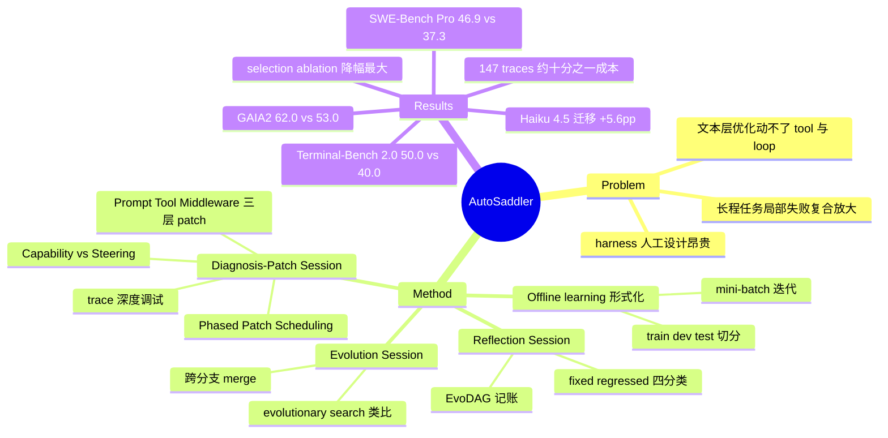

## Summary

AutoSaddler 把 LLM agent 外部 harness（prompt / tool / middleware 三层）的改进形式化为 offline learning 问题：在任务 train/dev/test 切分上以 mini-batch 迭代运行 Diagnosis-Patch、Reflection、Evolution 三个 agent session，从执行 trace 深挖失败根因、生成结构化 patch，并靠 dev-set 过滤与 EvoDAG 优化历史记账让更新"durable"（不 regress、可泛化）。在 GAIA2 / SWE-Bench Pro / Terminal-Bench 2.0 上分别较各自 base harness 提升 9.0 / 9.6 / 10.0 pp，并在 benchmark 平均层面超过 GEPA 与 Meta-Harness 两个自动化 baseline。

## Problem & Motivation

LLM agent 在长程任务上的可靠性问题源于局部小失败会在长交互中复合放大为整体任务失败。外部 harness（prompt 规则、工具配置、agent loop 控制逻辑）能提升鲁棒性，但其设计至今是人工且昂贵的过程——要在 prompt、tool configuration、control logic 构成的大空间里搜索，且每换一个 underlying LLM 或部署领域就要重调一遍。已有自动化方法主要停留在文本层（prompt 优化），论文的核心问题是：能否把整个 harness（含可执行代码与循环逻辑）的优化自动化，并保证自动生成的更新不是过拟合个别失败轨迹的补丁。

## Method

**问题形式化**：把 harness 优化视为 offline learning——任务集切分为 train/dev/test，每次迭代在 train mini-batch 上评估当前 harness、诊断失败、生成 patch、验证、反思，循环推进。三个 session 的 agent 均基于 Claude Agent SDK（CA-SDK）实现。

**Diagnosis-Patch Session**：给 agent 提供 harness codebase 访问权与渐进式 trace 检索的结构化引导，对比失败与成功 run 的执行 trace 定位根因，产出限定在三层的结构化 patch：
- **Prompt Patch**（规则增改，Steering 类）
- **Tool Patch**（新工具、参数修改、实现修复）
- **Middleware Patch**（hook 注入、infra 变更、agent loop 逻辑）

Patch 二分为 **Capability**（可执行代码/编排）与 **Steering**（文本编辑）两类；**Phased Patch Scheduling** 让优化先做 Capability 再过渡到 Steering。

**Reflection Session**：按 fixed / regressed / still-failing / still-passing 四类对比 patch 前后表现，产出针对有效性与泛化性的 reflection，连同指标一起写入 **EvoDAG**（Evolution DAG，记录整个优化历史的有向无环图）。

**Evolution Session**：Evolution Agent 查询 EvoDAG 合成下一个 harness candidate，可跨演化分支 merge 成功组件，作者将其类比 evolutionary search 的 recombination，用于逃离局部最优。

**Durability 三机制**（对应三个 RQ ablation）：(1) in-depth diagnosis——靠文件访问与长 trace 上下文管理做深度调试而非浅层 reflection；(2) structured intervention——把编辑限定在三层功能逻辑内；(3) generalization-aware selection——dev-set 评估 + reflection 过滤，只接受可泛化的 patch。

## Key Results

主表（pass@1，underlying LLM 默认 Claude Opus 4.6）：

| Benchmark | Base harness | Base | GEPA (Auto) | Meta-Harness (Auto) | AutoSaddler | Δ vs base |
|:--|:--|:--|:--|:--|:--|:--|
| GAIA2 | ReAct-based | 53.0 | 54.6 | 53.2 | **62.0** | +9.0 |
| SWE-Bench Pro | SWE-agent | 37.3 | 42.5 | 35.3 | **46.9** | +9.6 |
| Terminal-Bench 2.0 | Terminus 2 | 40.0 | 42.5 | 43.3 | **50.0** | +10.0 |

- TB2 上还超过了人工 expert-tuned 的 Terminus KIRA（47.5）+2.5 pp。
- **学习效率**：147 条 trace 即达最佳 dev-set 分数，约为 Meta-Harness（1,400 条）的 1/10。
- **Ablation（GAIA2）**：w/o generalization-aware selection 降至 50.6（-11.4 pp，降幅最大）；w/o structured intervention 56.9（-5.1）；w/o in-depth diagnosis 57.8（-4.2）。无结构约束时生成 patch 91.5% 塌缩为 Steering 型，完整版 capability 类关键 patch（New Tool / Loop Change / Infra Change）合计占比保持 25% 以上（ablation 下仅 4%）。
- **Robustness**：Opus 4.6 优化出的 harness 换 Haiku 4.5 运行仍保持 +5.6 pp 提升。
- **边界**：对 baseline 的胜出是 benchmark 平均层面——SWE-Bench Pro 的 Element-web 子集上 GEPA（45.2）高于 AutoSaddler（43.5）。

## Evidence Ledger

| Claim ID | Claim | Type | Source locator | Evidence excerpt | Status |
|:--|:--|:--|:--|:--|:--|
| C1 | GAIA2 上 AutoSaddler pass@1 62.0%，base 53.0%（+9.0 pp） | number | Table 2 | "Default Agent ... Average 53.0; AutoSaddler ... 62.0" | source-verified |
| C2 | SWE-Bench Pro 上 AutoSaddler 46.9%，SWE-agent base 37.3% | number | Table 3 | "SWE-agent (Manual) ... Avg 37.3; AutoSaddler ... 46.9" | source-verified |
| C3 | Terminal-Bench 2.0 上达 50.0%，超 base Terminus 2（40.0）与 expert-tuned Terminus KIRA（47.5） | comparison | Table 3 | "Terminus 2: 40.0; Terminus KIRA: 47.5; AutoSaddler: 50.0" | source-verified |
| C4 | 三个 benchmark 平均层面均超 GEPA 与 Meta-Harness（SBP 的 Element-web 子集上 GEPA 45.2 反超 43.5） | comparison | Tables 2-3 | "GEPA 54.6/42.5/42.5; Meta-Harness 53.2/35.3/43.3" | source-verified |
| C5 | 147 条 trace 达最佳 dev 分数，约为 Meta-Harness（1,400 条）的 1/10 | number | Fig. 1 / Sec. 5.2 | "reaches its best dev-set score after consuming 147 traces, ~10x fewer than Meta-Harness" | source-verified |
| C6 | Ablation：去 generalization-aware selection 降至 50.6（最大降幅），去 structured intervention 56.9，去 in-depth diagnosis 57.8 | number / causal-mechanism | Ablation 表（GAIA2） | "Full 62.0; w/o In-depth Diagnosis 57.8; w/o Structured Intervention 56.9; w/o Gen.-Aware Selection 50.6" | source-verified |
| C7 | 默认 LLM 为 Claude Opus 4.6；base harness 为 ReAct（GAIA2）/ SWE-agent（SBP）/ Terminus 2（TB2） | benchmark-setting | 实验 setup 节 | "Claude Opus 4.6; GAIA2: ReAct-based agent; SWE-Bench Pro: SWE-agent; TB2: Terminus 2" | source-verified |
| C8 | 无 structured intervention 时 patch 91.5% 为 Steering 型；完整版 capability 关键 patch 合计占比 >25%（ablation 下仅 4%） | number / causal-mechanism | Sec. 5.3 RQ2 / Fig. 3 | "heavily concentrated on Steering patches (91.5%) ... increases their share to over 25%" | source-verified |
| C9 | 代码与项目主页承诺开放于 aka.ms/AutoSaddler-website（原文为 "will be available"，URL 当前可用性未验证） | license-code | Abstract / Comments | "Project website and code will be available at https://aka.ms/AutoSaddler-website" | source-verified |
| C10 | Opus 4.6 优化的 harness 换 Haiku 4.5 运行仍 +5.6 pp | number | Sec. 5.2 / Appendix E | "switching from Opus 4.6 to Haiku 4.5 ... still improves over the base harness by +5.6 pp" | source-verified |
| C11 | Abstract 报三个 benchmark 提升为 9.0 / 9.6 / 10.0 pp | number | Abstract | "achieving gains of 9.0, 9.6, and 10.0 percentage points, respectively" | source-verified |

## Strengths & Weaknesses

**Strengths**

- Ablation 的信息量在于排序：generalization-aware selection 的贡献（-11.4 pp）远大于诊断深度与结构约束。这说明自动 harness 优化的瓶颈不在"能否生成 patch"，而在"能否阻止 patch 过拟合个别轨迹"——与 [[2607-HarnessEvolution]] 观察到的人工 harness 开发长期无效增长互为印证：缺少 dev-set 过滤与 regression 记账的 harness 更新（无论人写还是 LLM 写）默认漂移。
- RQ2 的 patch 分布分析给出一个机制层解释：无结构约束时 LLM 生成的 patch 91.5% 塌缩为文本（Steering）编辑，几乎不动代码。这解释了纯 prompt 优化器（GEPA）为什么天花板更低，也把"结构化干预"从工程选择上升为逼 LLM 编辑 capability 层的必要条件。
- 成本口径少见地清晰：以 trace 消耗计学习效率（147 vs 1,400），比只报最终分数的 harness 工作更可审计。

**Weaknesses**

- 同源性风险：优化 agent（CA-SDK + Claude）与被优化 agent（默认 Opus 4.6）同家族，cross-model 迁移也只验证了 Opus→Haiku 的同家族方向；作者在 Appendix R 自承 "We do not impose constraints on self-referentiality, leaving investigation of such dynamics to future work"。跨家族（如优化出的 harness 给 GPT/Qwen 用）是否成立未知。
- "durable" 的证据是 dev/test 泛化与 regression 率趋势，时间尺度限于优化过程内；没有持续部署下 harness 是否继续有效（任务分布漂移）的证据——这是对 "durable updates" 这一标题措辞该保留的怀疑。
- expert 人工基线只在 TB2 有（Terminus KIRA），GAIA2 / SBP 上无法回答"自动优化 vs 认真的人工调优"的对比，+9 pp 的对照物是未经专项调优的默认 harness。

## Mind Map

## Notes

**与 vault harness 族笔记的关系**（均为不同工作，无重复）：

- [[2607-HarnessEvolution]]：观测面——人工 harness 连续 release 只涨 token 不涨 resolve rate；AutoSaddler 是建设性回应，其 generalization-aware selection ablation（-11.4 pp）恰好给那篇的现象提供了一个候选解释：无过滤的更新默认无效甚至倒退。两篇合读构成"harness 更新为什么无效 / 怎么变有效"的正反面。
- [[2608-StrongToWeakHarness]]：同为 LLM 自动构建 harness，但那篇是 strong builder 为冻结弱 target 做 test-time capability transfer；本篇是同一 agent 系统的 harness 自我改进，patch 空间结构化程度更高（三层 taxonomy + phased scheduling）。
- [[2608-EnvHarness]]：镜像工作——EnvHarness 在 agent-environment loop 的环境侧插 plug-in 组件，AutoSaddler 改 agent 侧 harness 本体；两者共享"rollout 诊断 → 生成组件/patch → 新 rollout 验证接受"的闭环模式，可对读。
- [[2608-EvoHarnessRL]]：正交路径——那篇把 harness 访问变成可训练动作（动权重），本篇完全不动权重、只改 harness 代码与文本。
- [[2608-HarnessEvalW]]：仅标题相近，那篇是 world model 评测的 agentic harness，主题无关。

**落在 [[Topics/AgentHarness-Design]] 哪条轴**：不落在单轴上，而是给三条轴装了统一的外层优化器。该 survey 的三条设计轴与本篇的三层 patch 空间几乎一一对应——动作接口 ↔ Tool Patch、执行循环 ↔ Middleware Patch（hook / loop change）、上下文预算 ↔ Prompt/Steering Patch——AutoSaddler 把 survey 描述的人工设计空间变成了自动搜索空间。并入时两点注意：(1) survey scope 是 web-agent-only，本篇三个 benchmark（GAIA2 / SBP / TB2）均非 web，更适合作为"设计轴自动化"的横向参照而非新增设计点；(2) 它的 trace 消耗口径（147 vs 1,400）符合 survey 第 4 节预算对齐审计的要求，是该文献族里少数把优化成本摆上台面的工作。

**repo_candidate 备注**：code 为 aka.ms 短链且原文措辞是 "will be available"，仓库是否已实际开放未验证；若开放，EvoDAG 与 middleware patch 机制的实现值得单独一轮 repo-digest。
