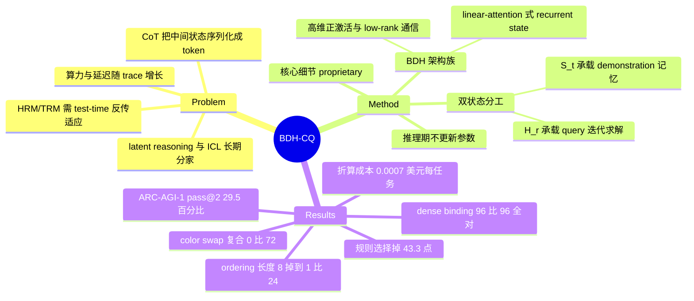

## Summary

BDH-CQ 把 in-context learning 与 latent reasoning 合进同一套计算：demonstration 顺序写入 recurrent memory，query 再在高维 latent workspace 里迭代求解，全程不 decode 中间 token、不做 test-time 参数更新。150M 参数在 public ARC-AGI-1 上取得 29.5% pass@2，按 0.85 H200 GPU-秒 × 3 美元/H200-小时折算为 0.00070 美元/task，据此宣称打破该 benchmark 的 cost–accuracy Pareto frontier。真正有信息量的不是这个 headline，而是模型冻结后做的 controlled ladder——conditional rule selection 掉 43.3 点、demonstration 未覆盖的参数值 0/120、color swap 与 relocation 的组合 0/72。

## Problem & Motivation

CoT 把每个中间状态都投影进离散 vocabulary、autoregressive 吐出来再吃回去，token 消耗、延迟与推理算力都随 trace 长度增长。latent reasoning 走的是另一条路：反复变换连续隐状态、只 decode 答案，一个状态可以同时携带多个候选假设而不必逐个序列化。

但 latent reasoning 与 in-context learning 基本是两条各自发展的线。CoT 语言模型能灵活地从 context 学新任务，却把额外算力都花在生成 token 上；紧凑的 recursive solver（HRM、TRM）在 latent space 里迭代，但它们的 ARC pipeline 是 transductive 的——evaluation task 的 demonstration pair 要参与优化，每个增广 puzzle 分配一个 learned identity embedding，预测再在增广上投票。这意味着遇到没见过的隐藏任务必须先跑一轮反向传播适应，ARC Prize 报告的成本是 HRM 1.48 美元/task、TRM 1.76 美元/task。

BDH-CQ 瞄准的正是这个交集：任务信息只通过 context 写进 recurrent memory，latent 计算直接调用它，不做 puzzle-specific 优化。选 ARC 作为载体的理由是它同时满足"规则由稀疏 demonstration 指定""输出精确可验证""同一任务多个 test input 可检验规则是否被一致应用"三条，适合做受控干预。

## Method

**架构谱系。** BDH-CQ 建在同组此前的 Dragon Hatchling（BDH，arXiv:2509.26507）之上：高维正激活、low-rank 通信、recurrent associative state，其 GPU 形式是 ReLU-low-rank 变换与大特征空间上的 linear attention 组合。论文用 "BDH" 指架构族、"BDH-CQ" 指本文这套完整系统（含输入变换、candidate 构造、ranking 与推理 pipeline）。同一架构此前被用在 Sudoku 的迭代约束求解上。

**两条状态的分工。** 论文没有把 demonstration 压成一个 task vector，而是逐元素处理，recurrent memory 演化为 `S_t = U_θ(S_{t-1}, D_t)`，`θ` 全程固定；不维护随长度增长的显式 KV cache。论文把它归到 attention / fast-weight memory / linear attention 这一类"对 `S` 的线性修正规则"视角下，`S_t = S_{t-1} + U_θ(D_t)` 是其中最简单的特例。

`K` 个 demonstration 吃完后进入 latent workspace 的迭代：`H_0 = E_θ(x*, S_K)`，`H_{r+1} = F_θ(H_r, S_K)`（`r = 0…R-1`），`ŷ = G_θ(H_R)`。`S_t` 随证据变化、承载 in-context learning；`H_r` 承载当前 query 的计算。这个二分是论文明确声明要研究的 system-level interface。

**留白很大。** 维度、精确更新规则、实现细节与完整训练配方全部声明为 proprietary。开源的只有 ARC 任务生成器（MIT），没有模型代码与权重；论文自己提到审计方是在无权重访问的条件下做黑盒评测。

**训练混合。** 150M 模型，私有 curated ARC-style 数据 + ARC-AGI-1 training set + RE-ARC + ConceptARC + ARC-Heavy + ARC-GEN100K + 额外增广。论文声明 evaluation task 的 identifier 与 demonstration pair 不参与训练。

**reasoning effort。** 训练时暴露不同的 latent reasoning 深度，推理时可选档位，构成一条 test-time compute 旋钮。

## Key Results

**ARC-AGI-1 public（400 任务）。** pass@1 97/400（24.25%），pass@2 118/400（29.50%，Wilson 95% CI 25.24–34.15）；按 419 个 test pair 算 pass@2 为 130（31.03%）。成本约 0.85 H200 GPU-秒/task，折算 0.00070 美元/task。按 ARC Prize 2026 年 7 月报价，比 GPT 5.6 Luna (Low) 便宜约 57x——但该对照系统得分 34.2%，高于 BDH-CQ 的 29.5%；论文自己补充说 OpenAI 7 月 30 日把 Luna 降价 80% 后差距只剩约 11x。Figure 2 的对照数据取自 2026-08-04 的 ARC Prize leaderboard，论文明示其他系统的成本"可能是硬件估算也可能是 API 报价"。

**ConceptARC（160 任务 / 480 test pair）。** semantic identifier 下 strict task pass@2 95/160（59.38%）、test pair 374/480（77.92%）。把 identifier 换成密码学不透明标签并打散 concept batch 后是 96/160 与同样的 374/480，配对结果里 semantic-only 与 opaque-only 各 6 次成功，无方向性差异。16 个 concept family 中 FilledNotFilled / TopBottom2D 9/10，Copy / Order 2/10；但每族仅 10 题，9/10 与 2/10 的 Wilson 区间大幅重叠，论文明确说这是 profile 而非可靠排名。

**within-task 一致性。** pass@2 下 13 个任务 0 个 test pair 正确、15 个 1 个、37 个 2 个、95 个 3 个全对——即 52/160 任务有部分正确输出但不算解出。pair 精度与 strict task 之间 18.5 点的差距不是度量严格性的副产品，而是推断出的变换没有跨 test input 一致应用。

**Controlled ladder（模型冻结后新生成，确定性 oracle 出答案）。**

- propagation 距离 2–8 全对 48/48，copying 目标位 1–4 全对 48/48，两条都未触天花板。
- ordering 到 5 个物体基本饱和，长度 6 掉到 29/36、7 是 8/24、8 是 1/24（pass@2）；nesting 到深度 4 基本饱和，深度 5 掉到 29/36。
- 两种下滑签名不同：length-8 ordering 只有 3/24 输出维度正确，整体构造崩了；depth-5 nesting 36 个输出维度全对、best-candidate cell 精度超过 99.9%，错的通常只是单个 containment 判断。
- 换 context 而保持 test pair 逐字节相同：depth-5 nesting 从 short context 的 19/24 升到 supported 的 24/24，length-8 ordering 从 0/24 升到 13/24。nesting 的悬崖主要是外推失败，ordering 还额外压着执行瓶颈。
- dense binding：demonstration 现场定义颜色置换，同时绑定 2–8 个，96/96 held-out 输出在 rank one 全对。
- composition（每条件 72 个输出）：relocation / reflection / rotation 单独都是 72/72；rotation ∘ relocation 72/72，reflection ∘ relocation 47/72，color swap 单独 26/72、组合 0/72。且 color swap 的 26/72 几乎全来自固定色布局的 original family，两个 shuffled family 各只有 1/24，所以它的组合失败不能单独归因于 composition。

**Appendix ladder（每条件 40 题，取自单一手写 puzzle family）。** conditional rule selection 从 100.0% 的控制条件（marker 变化但两值调用同一规则，40/40）掉到 56.7%（68/120，−43.3 点，Fisher p=9×10⁻⁹）；demonstration 中出现过的参数值解出 12/40（30.0%），未出现过的 0/120（内插与外推都是 0）；panel union 从两块对角 26/40 掉到三块 1/40，两块相邻更是只有 3/40；support chain 从 1 个物体 80.0% 单调降到 8 个物体 27.5%。反向对照里，四个 axis-aligned 操作串联 38/40、数 10–12 个物体 34/40、三个独立移动物体 40/40，都没有可检出代价。

**mechanic 分层（1,131 生成任务）。** solve rate 从 flood fill 68.6% 到 gravity and stacking 2.9%，跨度 65.7 点。但论文自己披露了 authoring confound：手写 gravity 任务 80–100%、手写 counting 85–95%，而生成版分别只有 2.9% 与 18.6%；公开集与生成集的 mechanic 排名相关只有 ρ=0.300。这张表刻画的是这个生成分布，不是操作本身的难度序。

**失败结构。** 错误预测中 89.2%（生成）/ 89.7%（公开）输出维度正确，72.9% / 78.0% 调色板正确，形状正确的失败中位 cell 错误率 4.0% / 8.3%。

**effort 与成本，两套互不吻合的账。** Table 5 给 HIGH 29.5% / 成本降 0%、MEDIUM 27% / 11%、LOW 21% / 22%。§6.6 另给一组：MIN effort 0.00088399 美元 vs standard 0.00265246 美元（三分之一成本），118/400 掉到 111/400（−1.75 点，两侧精确 McNemar p=0.167，统计上未分辨）。相同请求重复执行在两个档位都逐字节一致。

## Evidence Ledger

| Claim ID | Claim | Type | Source locator | Evidence excerpt | Status |
|:--|:--|:--|:--|:--|:--|
| C1 | 150M BDH-CQ 在 public ARC-AGI-1 取得 pass@2 118/400 (29.50%)、pass@1 97/400、test-pair pass@2 130/419 | number | Table 1；Abstract；§5 | "400 \| 97 (24.25%) \| 118 (29.50%) [25.24, 34.15]" | source-verified |
| C2 | 成本 0.00070 美元/task 是由 0.85 H200 GPU-秒按 3 美元/H200-小时**折算**，非计费价 | number | §5 | "0.85 H200 GPU-seconds per task. At \$3 per H200-hour this gives a computed cost of \$0.00070 per task" | source-verified |
| C3 | 宣称突破 ARC-AGI-1 cost–accuracy Pareto frontier、成为 cost efficiency SOTA；对照成本口径不统一 | sota-novelty | §5；Figure 2 caption；Abstract | "Other plotted systems use the costs reported by the leaderboard, which may represent hardware estimates or API prices." | source-verified |
| C4 | 比 GPT 5.6 Luna (Low) 便宜约 57x（该系统 34.2% @ 0.040 美元）；降价后约 11x；对照系统精度更高 | comparison | §5 | "approximately 57x cheaper than GPT 5.6 Luna (Low) which scores 34.2% at \$0.040" | source-verified |
| C5 | ConceptARC 同时出现在训练混合与评测集；论文承认无法排除训练/checkpoint 选择带来的暴露 | benchmark-setting | §4.2；Table 1；§6.5 | "does not make ConceptARC a fresh benchmark, rule out exposure through training or checkpoint selection" | source-verified |
| C6 | 复现 29.5% 的"independent black-box audit"由本文 co-authors 执行 | benchmark-setting | §5 "Independent evaluation."；作者栏 | "An independent black-box audit conducted by co-authors from Bielik and New York University reproduced the deployed system's 29.5% pass@2" | source-verified |
| C7 | 维度/更新规则/实现细节/训练配方均 proprietary；公开仓库只是任务生成器，无权重与模型代码 | license-code | §3.3；§4.1；§5；arXiv abs Comments | "Dimensions, exact update rules, and implementation details remain proprietary." | source-verified |
| C8 | conditional rule selection 由 100.0%（40/40）降至 56.7%（68/120），−43.3 点 | number | §A.3；Table 8 | "genuine selection between two rules is solved on 68/120 tasks, or 56.7%… a decrease of 43.3 points" | source-verified |
| C9 | propagation/copying 各 48/48；ordering 长度 8 降至 1/24、nesting 深度 5 降至 29/36；supported context 分别恢复到 13/24 与 24/24 | number | §6.2；Table 3；Figure 5 | "falls to 29/36 outputs at length six, 8/24 at seven, and 1/24 at eight at pass@2" | source-verified |
| C10 | 与 relocation 复合：rotation 72/72、reflection 47/72、color swap 0/72；color swap 单独 26/72 | number | §6.3；Table 4 | "never learns to compose it with relocation (0/72)" | source-verified |
| C11 | §9.2 断言 1B–600B 预训练已确认 Transformer-like scaling law，但全文无任何数据、表格、图或引用支撑 | causal-mechanism | §9.2 | "Early experiments confirm Transformer-like scaling laws apply during pretraining at scales from 1B to 600B parameters" | source-verified |
| C12 | §6.6 报告 standard effort 成本 0.00265246 美元/task，与 headline 0.00070 美元相差约 3.8x，全文未对账 | number | §6.6 vs §5 | "(\$0.00088399 versus \$0.00265246 per task) and scored 111/400 rather than 118/400 pass@2" | source-verified |
| C13 | mechanic 分层 solve rate 68.6%→2.9%，但手写 gravity 80–100% vs 生成版 2.9%，存在任务撰写 confound | number | §A.2；Table 7 | "hand-written gravity tasks score 80–100%, compared with 2.9% for generated gravity-and-stacking tasks" | source-verified |
| C14 | 声明 evaluation task identifier 与 demonstration pair 不参与训练、推理不更新参数；为裸断言，无实验证实 | causal-mechanism | §1 | "Neither task identifiers nor evaluation-task demonstration pairs participate in training, and no parameters are updated at inference time." | source-verified |
| C15 | Table 5 effort scaling：HIGH 29.5%/0%、MEDIUM 27%/11%、LOW 21%/22%；"Cost reduction" 的基准与单位全文未定义 | number | Table 5；§7；Figure 7 caption | "Comparing pass@2 and cost across reasoning efforts LOW, MEDIUM, HIGH" | source-verified |

> 说明：`source-verified` 仅表示 primary source 确实包含该表述，不表示结果已被独立复现。C6 与 C7 恰恰说明这篇工作的外部可复现性尚未建立。

## Strengths & Weaknesses

**值得记住的东西。** 论文最扎实的对照是对 HRM/TRM 这条 transductive 路线：那条路线要在评测任务的 demonstration 上跑优化、给增广 puzzle 分配 identity embedding，遇到新任务必须先反向传播一次，ARC Prize 报的成本是 1.48 / 1.76 美元每题；BDH-CQ 把任务信息写进 recurrent memory 后直接前向求解，同一 benchmark 上差三个数量级。这个对比的价值不在"更便宜"，而在它把 ARC 上"是不是在做 in-context learning"这个问题的答案从 pipeline 层面搬到了架构层面。

真正的科学贡献在 §6.2–6.3 和附录：模型冻结之后才生成受控任务、每次只动一个复杂度维度、把 context 换掉而保持 test pair 逐字节相同。这套设计能把"外推失败"和"执行失败"分开——depth-5 nesting 给一个匹配深度的 demonstration 就回到 24/24（是外推问题），length-8 ordering 给了支持也只回到 13/24（还有执行瓶颈）。这种"干预式评测"比任何 aggregate score 都更能说明模型学到了什么，也是可以直接借到 GUI/agent 评测上的方法。

结论也具体：latent workspace 学到的是 demonstration 条件下的 operator binding，不是可组合的规则归纳。证据链是齐的——dense color mapping 能绑 96/96，说明 binding 容量不缺；conditional rule selection 掉 43.3 点、未出现过的参数值 0/120、color swap ∘ relocation 0/72、52/160 任务规则不能跨 test input 一致应用，四条都指向同一件事：选规则、参数化规则、复合规则这三步比"记住一个规则"难得多。

**headline 是被精心构造出来的。** "cost-efficiency SOTA" 成立的条件极窄：29.5% 的绝对精度不高，Pareto 断言只说"没有系统在成本不高于我的前提下达到至少这个精度"。而且自家成本是 measured GPU time 乘一个自己设定的 3 美元/H200-小时，对手成本是 leaderboard 上"可能是硬件估算也可能是含利润的 API 报价"——论文自己在 §5 写明了这点，却仍把结论表述为 state of the art，Abstract、§1、§5、§9、§10 各出现一次。57x 那个数字更值得警惕：对照系统得分 34.2%，高于 BDH-CQ，且论文同一段就承认降价后只剩 11x。

**内部账目对不上。** §5 的 headline 是 0.00070 美元/task，§6.6 描述同一个 standard 运行（118/400）时给的是 0.00265246 美元/task，差 3.8x，全文没有一处对账。effort 叙事也是两套：Table 5 说 LOW 只省 22% 成本却掉 8.5 点，§6.6 说 MIN 只花三分之一成本、仅掉 1.75 点且统计上未分辨——两套档位命名（LOW/MEDIUM/HIGH 与 MIN/STANDARD）从未说明关系，Table 5 的 "Cost reduction" 连基准和单位都没定义。一篇把成本当核心卖点的论文，成本口径不自洽是结构性问题。

**ConceptARC 的位置有毛病。** 它在 §4.2 里是训练数据，在 §6.1 里是评测集，59.38% 被当成能力画像来解读。§6.5 的 opaque-identifier 复现只排除了 request 侧的 identifier 与 batch 线索，论文自己写明它"不能让 ConceptARC 变成一个新鲜 benchmark，也不能排除训练或 checkpoint 选择带来的暴露"。这句免责很诚实，但它同时抽掉了 §6.1 全部结论的泛化含义——ConceptARC profile 只能读作"训练分布内的能力分布"。

**独立性名不副实，可复现性为零。** 所谓 independent black-box audit 的执行者是本文署名作者（Bielik AI 与 NYU 两位）。同时维度、更新规则、实现细节与训练配方全部 proprietary，开源的只有任务生成器。结果是：一篇以"我在成本轴上是 SOTA"为核心主张的论文，外界既无法复现该数字，也无法审计其成本折算。这不是可以靠后续工作修补的疏漏，而是主张本身建立在不可检验的地基上。

**最露骨的一处 overclaim 在 §9.2。** "Early experiments confirm Transformer-like scaling laws apply during pretraining at scales from 1B to 600B parameters"——全文没有任何数据、表格、图或引用支持这句话，同一段还顺带断言架构"particularly easy to train at 1T scale"。用 150M 模型的实测结果做正文，用零证据的 600B 断言做展望，是典型的把营销语句放进 arXiv。HuggingFace paper page 上的社区评审也点了同一处。

**对我的方向的启发。** 与 vault 中的 [[2606-MIRAGE]] 构成同一命题的两个实例：latent reasoning 的确定收益在 deployment cost（MIRAGE 是 3–5x token 预算，这里是数量级成本），能力上限的提升则都没有被证明。更值得借的是方法论——BDH-CQ 的 "conditional rule selection 掉 43.3 点" 与 GUI agent 里"按当前屏幕状态在两条已演示的操作规则间选择"是同构问题，而后者恰恰是 few-shot trajectory prompting 最常失效的地方。把"冻结模型后生成受控 ladder + 保持输入逐字节相同只换 context"这套设计搬到 GUI 轨迹上，比再刷一次 benchmark 分数更有信息量。

## Mind Map

## Notes

- **成本口径值得单独存档。** 这篇是"用自定义计价维度宣告 SOTA"的标准样本：自家用 GPU-seconds × 自设电价，对手用 leaderboard 上的 API 报价，两者不可比却画在同一张 Pareto 图上。以后读到任何 cost-efficiency 声明，先问三件事——分子怎么算、分母怎么算、对照方的数字来自哪种口径。
- **可以追的两条线索。** (1) BDH 原始论文 arXiv:2509.26507（Dragon Hatchling）尚未进 vault，若要判断 BDH-CQ 的架构主张是否成立，那篇是前置。(2) HRM / TRM（arXiv:2510.04871）在 vault 中亦无笔记，而它们是本文唯一实质性的方法对照。
- **一个未解的问题。** 论文把 `S_t`（context memory）与 `H_r`（reasoning workspace）分开，但没有任何实验直接检验这个分工是否真实存在——比如冻结 `S_K` 后改变 `H_r` 的迭代步数、或者把 `S_K` 在任务间迁移。所有证据都是端到端行为，二分目前是设计意图而非被验证的机制。
- 外部背景（非论文内容，来自公开报道与 HuggingFace 讨论）：该工作以新闻稿形式同步发布，社区评审的两条主要批评（细节保留导致不满足可复现性标准、scaling 断言无多尺度实验）与本笔记独立得出的结论一致；另有报道称 Łukasz Kaiser 参与过评测，但论文正文只提到 co-author 审计，此说法未在 primary source 中得到支持，不应作为独立验证的依据。
