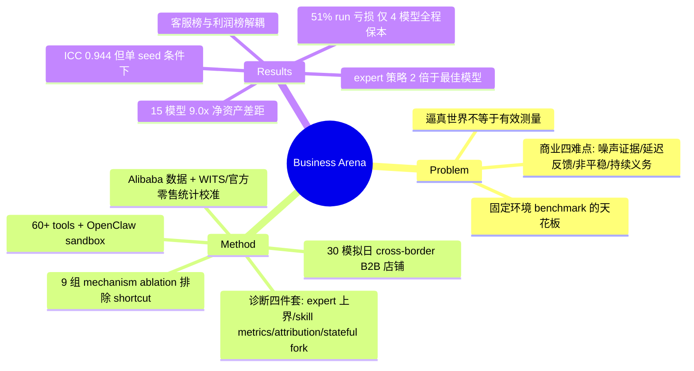

## Summary

Business Arena 让单个 LLM agent 在 30 个模拟经营日里自主运营一家 cross-border B2B 店铺：sourcing 侧取自真实 Alibaba.com listings（965 个 supplier offers / 831 个 masked suppliers / 135 个 SKU），tariff 与季节需求由 World Bank WITS 和美/欧/中官方零售统计校准。15 个 frontier 模型的 10-run 平均终局净资产从 \$20,856 到 \$188,488（9.0 倍），51% 的 run 相对 \$80,000 本金亏损，而最强 expert-designed strategy（\$436,195）超过最佳模型均值的两倍。相比榜单本身，更值得学的是它的评测方法学四件套：expert 策略库估计可得机会上界、skill-level metrics 拆解能力剖面、action-level attribution 把盈亏追溯到具体决策、9 组 mechanism ablation 排除 simulator shortcut 解释。

## Problem & Motivation

现有 agent benchmark（SWE-bench、WebArena、长程的 SWE-Marathon 等）的环境本质上是固定的：存在正确答案、成功是二值的、世界不随 agent 行动演化。作者认为下一个评测前沿是 noisy、non-stationary、无单一可验证解的环境，而 business 是其中经济上最重要的一类——证据不完整、资本承诺先于结果、反馈延迟且难归因、合规与客服义务持续存在。已有的商业向 benchmark（VendingBench、ShopBench、YC-Bench、CEO-Bench）各自只覆盖商业闭环的一部分，没有一个同时评测 sourcing、库存、landed cost、定价、需求、客服、物流、合规的耦合。

更关键的方法学动机：**逼真的世界不自动等于有效的测量**。agent 可能靠 simulator-specific shortcut 拿高分，也可能因与商业能力无关的原因拿低分；单一利润数字也解释不了成败原因。论文因此把"分数是否反映意图测量的能力"本身作为一个需要实验证明的命题。

## Method

**环境设计。** episode = pre-opening setup + 30 个模拟日（日历映射一个真实年份的节日/季节结构）。agent 起始资金 \$80,000，每天可以自由交错推理与行动（60+ 工具：typed MCP calls + 可脚本化 backend API + 持久 workspace），调用 end_round 后世界自主推进：买家决策、竞争者调价、物流推进、财务扣费、市场事件。四类机制刻意保留商业难点：(1) 不完整证据——需求信号分三档难度（节日日历显式、Google Trends 需数值分析、市场事件真假混杂需交叉验证）；(2) 延迟耦合后果——固定 overhead 惩罚闲置资本、持仓费与清仓折价惩罚鲁莽铺货、landed cost（运费+关税+佣金）决定表面利润是否真实；(3) 非平稳市场——60 个脚本化 NPC 卖家（10 个 archetype，5 个资本 tier）持续调价，供应商成本随世界状态漂移，含校准自真实 US-China 关税变化的政策冲击；(4) 持续义务——无证交易罚款 F_k = max(\$500, 0.15×order value)×min(k,5)，询盘需及时准确回复。agent 跑在隔离的 OpenClaw sandbox 里，文件系统权限保证拿不到 simulator 隐藏状态。

**数据 grounding（输入侧）。** 供应商 offer 保留真实 Alibaba 派生数据的国家/单价/MOQ/库存/lead time 属性（身份 mask）；tariff 来自 WITS（UNCTAD+WTO）；季节需求来自 U.S. Census MRTS（经 FRED）、Eurostat、中国 NBS 的月度零售序列。注意一个细节：agent 可见的 Google Trends 信号经过了"minor post-processing 使其与 oracle demand 相关"——公开信号的信息量部分是构造出来的。

**诊断评测四件套。** (1) *机会估计*：一组只用 agent 可见信息的确定性 expert strategies（层级决策系统：evidence/memory → belief → capital & portfolio plan → operating tree → feedback，领头策略维护 Bayesian 需求/route 估计），同时覆盖 Relationship-led wholesaler、Velocity market-maker、Event swing trader 等多种真实卖家 doctrine；(2) *skill-level metrics*：每个能力维度定义经济落地的 submetric（capital utilization、inventory turnover、order margin、sell-through、full-funnel ROAS/ROI、inquiry conversion、violations/fines）；(3) *action-level attribution*：把每笔已实现盈亏经记录的 economic transitions 追溯到产生它的 action，形成 evidence-action-outcome chain；(4) *stateful evaluation*：save-fork-load 联合恢复 model context + workspace + marketplace，支持同状态反事实比较与 trace search。

**Mechanism ablations。** 对 9 个机制（sourcing/pricing/tariffs/supplier discipline/advertising/demand inference/event verification/incident response/customer service）各构造 intended / neglect / shortcut 三类策略在匹配 seed 上对比。被排除的 shortcut 解释包括：只买最便宜 SKU（0 vs intended +\$63.6k）、追随所有谣言、极端 markup（68.1% margin 但只有 48 单）、tariff-blind 聚焦美国（-\$3.7k）、模板化客服回复、discount chasing、编造/反向使用需求证据（ρ=-0.039/-0.972）、trap chasing（十个 seed 全输）。

## Key Results

- **榜单**（10 runs × 同一 world seed，均值）：Gemini 3.1 Pro \$188,488（9/10 保本）> GPT-5.6 Sol \$168,867（10/10）> Fable 5 \$164,204（10/10）> Gemini 3.5 Flash \$125,952 > GPT-5.5 \$117,481 > Kimi K3 \$112,278 > … > DeepSeek V4 Pro \$40,804 > MiniMax M2.5 \$20,856（0/10）。9.0× 是**净资产终值比**；按利润算符号都不同（最好 +\$108k，最差 -\$59k）。51% 的 run 亏损，只有 4 个模型（GPT-5.6 Sol、Fable 5、Gemini 3.5 Flash、GPT-5.5）每次都保本——作者强调可部署性要求的是稳定保本而非期望收益。
- **Headroom**：最强 expert strategy \$436,195 > 2× 最佳模型均值；多个不同 doctrine 的 expert 策略都超过多数模型，说明环境不是只奖励单一窄策略。行为差异：expert 资本循环 2.06–3.10×（领先模型 1.67–1.99×）、采购 26–52 个 SKU（模型仅 7–8 个）、零合规罚款。
- **可靠性**：ICC(1,10)=0.944（单 run 仅 0.626，35.2% 方差在模型内）；split-half 五 run Spearman ρ=0.898，98.7% partition 恢复同一前三集团。均值可靠但**以共享 world seed 为条件**，跨市场实现的稳健性作者明言未测。
- **能力剖面与风格**：Gemini 3.1 Pro 是 Premium House（52.0% order margin、低 sell-through、客服仅 57% 转化）；GPT-5.6 Sol / Opus 4.6 是 Volume Wholesaler（sell-through >93%）；Opus 4.8 是客服专家（84% 询盘转化第一）但整体经济弱——客服榜与利润榜排名明显解耦。MiniMax M2.5 一条 trace 里跨市场统一定价致 98/142 订单低于 landed cost。
- **合规**：Fable 5 与 GPT-5.5 零违规；MiniMax M2.5 平均 22.7 次违规 / \$51,750 罚款，DeepSeek V4 Pro 17.4 次 / \$39,650（一条 trace 里模型在推理中承认缺证却始终不调合规工具，34 次违规 \$80,000 罚款——"认识到问题"与"可靠转化为行动"的分离）。
- **Attribution 案例**：同一 tariff shock 下 Gemini 3.5 Flash 刷新关税、按 route 重定价、暂停后有条件重开美线，关联订单 +\$2,136.48；MiniMax M2.5 统一定价且不刷新冲击，关联订单 -\$34.15。
- **Trace search**（stateful eval 的应用，Qwen 3.8 Max Preview，K=2/M=3，180 model-day 等预算）：5 天间隔 fork 终值 \$108,878，比逐日 fork 高 16.9%、比六次独立 run 最好者高 16.7%——逐日选择反而更差，是"反馈确实延迟"的直接证据。

## Evidence Ledger

| Claim ID | Claim | Type | Source locator | Evidence excerpt | Status |
|:--|:--|:--|:--|:--|:--|
| C1 | episode = pre-opening setup + 30 模拟日，30 天日历映射一个真实年份 | benchmark-setting | Sec 3.1 / App A / App C | "a pre-opening setup phase followed by 30 simulated operating days" | source-verified |
| C2 | 965 supplier offers / 831 masked suppliers / 135 SKUs 来自 Alibaba 派生数据；tariff 用 WITS、季节需求用 US Census/Eurostat/中国 NBS 校准 | benchmark-setting | Sec 1 / App B / App C | "965 tradable supplier offers from 831 masked suppliers across 135 SKUs" | source-verified |
| C3 | 15 模型（8 proprietary + 7 open-weight），同一 world seed 10 runs 取均值，全部最大 thinking effort | benchmark-setting | Sec 5 / App H.1 | "Leaderboard results are mean final net-worth across 10 runs" | source-verified |
| C4 | 均值从 \$20,856 (MiniMax M2.5) 到 \$188,488 (Gemini 3.1 Pro)=9.0×；51% run 亏损；仅 4 模型全程保本 | number | Sec 6.1 / Table 6 | "ranges from \$188,488 for Gemini 3.1 Pro to \$20,856 for MiniMax M2.5" | source-verified |
| C5 | 最强 expert strategy \$436,195，超最佳模型均值两倍；expert 策略只用 agent 可见信息 | comparison | Sec 6.1 / App J | "reaches \$436,195 in the same world, more than twice the best model mean" | source-verified |
| C6 | expert 库为层级耦合决策系统，领头策略维护 Bayesian demand/route 估计并持续更新；多种卖家 doctrine 策略均超过多数模型 | benchmark-setting | Sec 4.1 / App J | "maintains Bayesian estimates of demand and route contribution" | source-verified |
| C7 | 9 个机制的 ablation 中 intended policy 均同时优于 neglect 与 shortcut/misuse（主文 Table 1 列 5 个） | causal-mechanism | Sec 6.5 Table 1 / App G | "the intended policy outperforms both neglect and misuse" | source-verified |
| C8 | 公开信号恢复隐藏机会排序 pooled ρ=0.972、93.3% 命中每类目最强国家（无证据 13.3%）；reversed evidence ρ=-0.972 | number | Sec 6.5 / App G | "a pooled correlation of 0.972 … strongest country … in 93.3% of cases" | source-verified |
| C9 | ICC(1,10)=0.944、ICC(1,1)=0.626；split-half ρ=0.898、98.7% 恢复前三集团；模型身份解释 64.8% 方差 | number | Sec 6.1 / App H | "mean Spearman correlation of 0.898 … same leading three-model group in 98.7%" | source-verified |
| C10 | skill-level metrics 为各能力定义经济 submetric（广告用 full-funnel ROAS/ROI 等） | benchmark-setting | Sec 4.2 / App L | "full-funnel return on advertising spend (ROAS) and advertising return on investment (ROI)" | source-verified |
| C11 | attribution 把已实现盈亏追溯到 action；tariff shock 案例 +\$2,136.48 vs -\$34.15 | benchmark-setting | Sec 4.2 / Sec 6.4 | "the linked order contributes \$2,136.48" | source-verified |
| C12 | Gemini 3.1 Pro 52.0% margin；GPT-5.6 Sol/Opus 4.6 sell-through >93%；MiniMax M2.5 12.1% margin、<40% sell-through、98/142 订单低于 landed cost | number | Sec 6.2 / Fig 5 | "earning only a 12.1% average order margin while selling through less than 40%" | source-verified |
| C13 | 罚款公式 F_k=max(\$500, 0.15×order value)×min(k,5)；MiniMax M2.5 均 22.7 违/\$51,750，DeepSeek V4 Pro 17.4 违/\$39,650；Fable 5/GPT-5.5 零违规 | number | Sec 6.2 Fig 6a / App E | "MiniMax M2.5 averages 22.7 violations and \$51,750 in fines" | source-verified |
| C14 | 客服转化率：Opus 4.8 84% > Fable 5 81% > Qwen 3.8 74%；Gemini 3.1 Pro 仅 57% | number | Sec 6.2 / Fig 6b | "Opus 4.8 converts 84% of inquiries, Fable 5 converts 81%" | source-verified |
| C15 | expert 资本循环 2.06–3.10×（模型 1.67–1.99×）、26–52 SKU（模型 7–8）、零合规罚款 | comparison | App J / Fig 14 | "recycling capital by 2.06–3.10 times, compared with 1.67–1.99 times" | source-verified |
| C16 | save-fork-load 联合恢复 context/workspace/market；trace search：5 天 fork \$108,878，高于逐日 16.9%、高于最佳独立 run 16.7%（等 180 model-day 预算） | number | Sec 4.2 / App K.2 | "finishes 16.9% above daily trace search and 16.7% above the strongest independent run" | source-verified |
| C17 | 60+ tools（MCP+脚本化 backend+workspace）；60 个 NPC 卖家（10 baseline+50 population，5 资本 tier）；OpenClaw sandbox 文件系统隔离 | benchmark-setting | Sec 3.4 / App A / App D | "60 scripted sellers: 10 baselines … and 50 population NPCs" | source-verified |
| C18 | 作者自述局限：外部系统抽象为结构化工具（不测 live storefront/GUI 操作）；场景限于 cross-border B2B | benchmark-setting | Sec 7 | "not whether it can reliably update a live storefront … through a real inbox and GUI" | source-verified |

## Strengths & Weaknesses

**亮点。**
- 这篇的核心贡献不是"又一个商业模拟"，而是把 **benchmark validity 当作实验命题**：mechanism ablation 系统性地构造 neglect 与 shortcut 对照并证明二者都被惩罚，直接回应"高分可能是 simulator hacking"的质疑。这套做法对任何开放环境 benchmark 都可移植，比环境本身更有复利价值。
- 诊断分层设计完整：expert 策略给机会上界（且约束在 agent 可见信息内）、skill metrics 给能力剖面、attribution 给决策级信号、stateful fork 给反事实比较。attribution 明确指向未来 RL credit assignment 的训练数据来源——评测基建与训练基建在此汇合。
- 可靠性分析（ICC、split-half、方差分解）在 agent benchmark 中罕见地规范，且诚实报告单 run ICC 仅 0.626、结论以共享 seed 为条件。
- "保本率"与均值并列报告的口径有部署视角的洞察：Gemini 3.1 Pro 均值第一但 9/10 保本，客服榜与利润榜解耦——单一 leaderboard 数字确实会误导。

**局限。**
- **产出侧 grounding 缺失**（与 MerchantBench 同病）：校准全在输入侧（供应商数据、关税、季节形态），"agent 决策 → 利润"的映射（买家选择模型、价格弹性、NPC 竞争）是设计出来的，从未与真实商家结果对照。9× 差距和 \$436k headroom 的绝对值只在模拟内有意义。
- **demand inference ablation 的 ρ=0.972 部分是构造性质**：Google Trends 信号被后处理到与 oracle demand 相关，ablation 证明的是"环境里的信号确实可用"，不能外推为"真实公开信号有这么高的信息量"。
- **expert headroom 的软性信息泄漏**（推测）：策略设计者知道 arena 的机制结构（哪些节日重要、合规是硬门槛），虽然策略运行时只用 agent 可见信息，但设计时的机制知识是模型没有的先验，headroom 估计可能偏高。
- **单一 harness 的归因边界**：所有模型跑在同一 OpenClaw runtime 上，榜单差异是 model×harness 联合效应；不同模型对该 harness 的适配度不同（与 vault 中 harness attribution 线的核心关切一致）。
- 未报告任何 cost 口径（token/推理开销），全部模型开最大 thinking effort——按 AgentsThatMatter 的标准，cost-accuracy Pareto 缺位。
- 榜单只用一个 world seed；作者自己承认跨市场实现的稳健性未验证。

## Mind Map

## Connections

- [[2607-MerchantBench]]：同为 Alibaba 系卖家侧电商模拟（1688 数据、365 天）。互补点：MerchantBench 强在订单生命周期的 mixed-latency feedback 形式化，Business Arena 强在诊断层（机会上界 + attribution + mechanism ablation + 可靠性分析），后者恰好补上了前者"n=3 无显著性检验"的短板。共同未解：产出侧 grounding 都没有与真实商家结果对照。
- [[2407-AgentsThatMatter]]：Business Arena 的 10-run ICC/split-half 分析正面响应了其"报告方差、警惕单数字榜单"的主张；但 cost 控制维度缺位，模型全部开最大推理预算。
- [[2606-AgentsLastExam]]：同样主打"经济价值"评测的两条路线——ALE 用真实职业工作流（经济价值靠任务来源背书）、Business Arena 用模拟市场利润（经济价值在模拟内可直接度量但受 simulator 真实性约束）。
- [[Topics/AgentHarness-Design]] / [[Topics/Harness-Component-Attribution]]：单一 OpenClaw harness 下的模型比较、trace search 的 test-time compute allocation（fork 间隔 5 天优于逐日，等预算下优于独立重跑）与 harness 归因专题直接相关。

## Notes

- Project page: https://business-arena.site.accio.ai；未见 GitHub 代码链接，环境本身未开源（arena 源码对 agent 也是隐藏的）。若后续开源，值得 repo-digest 深挖 attribution 工具链与 save-fork-load harness 的实现。
- trace search 结果（逐日选择劣于 5 天间隔）是"延迟反馈"最干净的实验证据，也暗示对这类环境做 process reward / 短视 value estimation 会系统性选错分支——对 agentic RL 的 credit assignment 设计有直接含义。
- 模型命名细节：Qwen 3.7 Max 归 proprietary、Qwen-3.8-Max-Preview 归 open-weight；评测含 GPT 5.6 Sol（pro reasoning mode）、Fable 5、Opus 4.6/4.8 等 15 个模型家族。