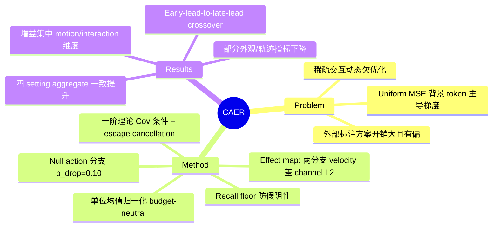

## Summary

针对 action-conditioned world model 训练中 space–time-uniform MSE 让背景 token 主导梯度、稀疏交互动态欠优化的问题，CAER 在线对比模型在真实 action 与 null action 条件下的预测差，定位 action 因果敏感的 token，并在保持总 coefficient mass 不变（budget-neutral）的前提下把监督权重重新分配过去。方法不需要任何外部标注或离线预处理，在 LIBERO、RoboTwin、camera control、PoseAnything 四个异构 setting 上（同一 Wan 2.2 5B backbone、匹配训练协议）aggregate 分数一致优于 uniform MSE baseline。

## Problem & Motivation

Action-conditioned 视频生成类 world model 目前默认用对所有时空 token 均匀平均的 MSE / flow-matching loss 训练。但视频中绝大多数 token 是静态背景或与当前交互无关的区域，决定性预测误差集中在接触事件、被操纵物体和 actor 运动上——uniform 平均让海量易拟合的背景 token 主导梯度，稀释了对稀疏物理交互的监督。后果是 rollout「平均看起来真实」，却可能接触时机错误、物体运动方向错误、或对指令 action 无响应——这不是视觉缺陷，而是模型没学会 action 如何因果地改变世界。

已有的补救思路是用 SAM / RAFT 等外部模型提供 segmentation / optical flow 权重（如 MotiF 用光流 heatmap reweight），但逐帧推理带来大量预处理开销、继承外部模型偏差，且「视觉显著 / 有运动」不等于「被 action 支配」——相机抖动和外生运动在前者下显著，却不承载 action-conditional risk。

## Method

核心思想：由 world model 自己在线提供缺失的监督信号——如果去掉 action 会改变某 token 的预测，该 token 就承载了必须学习的 action 后果。关键组件：

- **Null action 分支**：条件 c_A = {参考观测 o_0, 语言指令 p, action A}，null 条件 c_∅ 把注入的 action 特征置零/mask。为使 action-free 输入在分布内，以 p_drop = 0.10 概率独立丢弃 action 注入（类似 classifier-free guidance），训练出可用的 null 分支。
- **Action effect map（Eq. 2）**：在固定中间噪声水平 τ_S = 0.50、共享噪声 ε′ 下，S = ‖v_θ(z_{τ_S}; c_A) − v_θ(z_{τ_S}; c_∅)‖₂（沿 channel 维取 L2）。共享噪声消除采样方差，固定 τ_S 防止 map 的尺度随随机训练 timestep 漂移。在线性路径上 S 等价于两个 clean-state 预测之差的范数，即模型当前对 E[z_0|c_A] − E[z_0|c_∅] 的估计。
- **Budget-neutral 权重（Eq. 4）**：S 按 sample 归一化到单位均值得 ρ，总 coefficient mass 与 uniform 训练完全相同，只改变花在哪里；ρ 从反传图 detach（stop-gradient）。
- **Recall floor（Eq. 5）**：零权重 token 的假阴性永远无法被纠正（误差不对称），action dropout 顺带解决：dropped 样本以 ρ≡1 均匀监督 null 分支，期望意义上每 token 权重 ≥ p_drop > 0。
- **理论（Sec. 2.3）**：等 coefficient mass 下，focused 加权比 uniform 更快降低 interaction risk 的一阶条件恰是 Cov(ρ_i, a_i) > 0（Eq. 9，a_i 为 token 效用）；在 uniform 梯度停滞点（G_uni = 0 但交互区梯度 G_R ≠ 0，稀疏交互梯度被背景梯度抵消），只需假设 effect map 弱信息性（α > 1），CAER 更新 G_ρ = (α−β)G_R ≠ 0 给出 interaction risk 的严格一阶下降（Eq. 12）；population optimum 的偏移被 Cov_c(ρ̄, v_tgt)/E[ρ̄] 精确刻画且分母有 p_drop 下界（Eq. 13）。
- **开销**：非 dropped 样本在单次带梯度 forward 之外增加两次 no-gradient forward（τ_S 处），无额外 backward、无外部模型；权重归一化而非叠加，可从第一步启用、无需重调 loss scale。

论文明确声明这里的「causal」是 operational 意义：z_{τ_S} 本身是 action 下游的实现未来的加噪版本，Eq. 3 是 action-conditional predictive contrast 而非 do-calculus 的 interventional quantity——目标只需要按 residual action dependence 给 token 排序，不需要辨识因果图。

## Key Results

四个 setting 均为 Wan 2.2 5B backbone、8×NVIDIA H20，与 uniform MSE 共享初始化/数据顺序/优化器/步数，仅换 objective；LIBERO（44,166 clips）/RoboTwin 2.0（50,016）/camera control（RealEstate10K, 30,016×81 帧）评 5,000 步，PoseAnything（51,792）评 1,000 步。

| Setting | Benchmark | Uniform MSE | CAER |
|:--|:--|:--|:--|
| LIBERO | WorldArena EWMScore | 57.66 | **61.79** |
| RoboTwin | WorldArena EWMScore | 62.35 | **63.13** |
| Camera control | iWorld-Bench aggregate | 0.6412 | **0.6614** |
| PoseAnything | VBench aggregate | 0.7422 | **0.7746** |

- 最大增益集中在 motion / interaction 敏感维度：LIBERO Dynamic Degree 0.1383→0.1623、Flow Score 0.0388→0.0549、Subject/Background/Photometric Consistency 大幅提升（0.6050→0.7624 / 0.6280→0.7915 / 0.6829→0.8397）；RoboTwin Dynamic Degree 0.4667→0.5268、Flow Score 0.2738→0.3251；PoseAnything Dynamic Degree 0.74→0.86、Imaging Quality 0.5366→0.5971。
- **并非全面占优**（作者自述 "several strong appearance or trajectory metrics remain unchanged or slightly decrease"）：camera control 的 Trajectory Accuracy 0.6211→0.5474、Sharpness Retention 0.4752→0.4150；RoboTwin 的 Instruction Following 0.6929→0.6860、Semantic Alignment 0.8955→0.8825、Trajectory Accuracy 0.2781→0.2610。
- **Ablation（Table 5，RoboTwin/camera）**：p_drop ∈ {5,10,15,20}% 中 10% 最优（WorldArena 62.83/**63.13**/61.91/61.40）——太小则 null 分支训练不足，太大则 action 无关区域主导权重；τ_S ∈ {0.25,0.50,0.75} 中 0.50 最优（61.09/**63.13**/62.27）——过小或过大噪声要么抹平两分支差异、要么丢失场景定位。
- **训练动态（Fig. 4）**：early-lead-to-late-lead crossover——最早 checkpoint 上 uniform MSE 常常领先（快速压掉背景残差、讨好外观类指标），随 action-conditional dynamics 学好后 CAER 反超并保持 late-stage 正差，与「模型越好→effect map 越准→监督越聚焦」的自我改进闭环预测一致。

## Evidence Ledger

| Claim ID | Claim | Type | Source locator | Evidence excerpt | Status |
|:--|:--|:--|:--|:--|:--|
| C1 | LIBERO 上 EWMScore 57.66→61.79 | number | Table 3 | "LIBERO Uniform MSE 57.66 … CAER 61.79" | source-verified |
| C2 | RoboTwin 上 EWMScore 62.35→63.13 | number | Table 3 | "RoboTwin Uniform MSE 62.35 … CAER 63.13" | source-verified |
| C3 | Camera control iWorld-Bench aggregate 0.6412→0.6614 | number | Table 2 | "Camera Control Uniform MSE 0.6412 … CAER 0.6614" | source-verified |
| C4 | PoseAnything VBench aggregate 0.7422→0.7746 | number | Table 4 | "PoseAnything Uniform MSE 0.7422 … CAER 0.7746" | source-verified |
| C5 | 全部用 Wan 2.2 5B、8×H20；5,000 步评估（PoseAnything 1,000 步） | benchmark-setting | Sec. 3.1 / Table 1 | "All experiments use Wan 2.2 5B… eight NVIDIA H20 GPUs… evaluated after 5,000 optimization steps" | source-verified |
| C6 | Effect map = 真实/null action 两分支 velocity 差的 channel L2（τ_S=0.50、共享噪声），按 sample 归一化到单位均值、总 mass 不变 | causal-mechanism | Sec. 2.2 Eq. 2, Sec. 2.3 Eq. 4 | "reduce the two responses along the channel dimension… normalize it independently for each sample" | source-verified |
| C7 | 开销为两次额外 no-gradient forward，无 backward、无外部模型 | benchmark-setting | Sec. 3.1 | "plus two no-gradient forwards at τS… adding no backward pass and no external model" | source-verified |
| C8 | 部分指标下降：camera Trajectory Accuracy 0.6211→0.5474、Sharpness Retention 0.4752→0.4150；RoboTwin Instruction Following 0.6929→0.6860 | comparison | Table 2, Table 3 | "Several strong appearance or trajectory metrics remain unchanged or slightly decrease." | source-verified |
| C9 | p_drop=10% 最优（63.13 vs 62.83/61.91/61.40）；τ_S=0.50 最优（63.13 vs 61.09/62.27） | number | Table 5 | "10% 63.13 0.6614; 0.50 63.13 0.6614" | source-verified |
| C10 | 「causal」为 operational 意义的 predictive contrast，非 do-calculus interventional quantity | causal-mechanism | Sec. 2.2（Eq. 3 后） | "an action-conditional predictive contrast rather than an interventional quantity in the sense of do-calculus" | source-verified |
| C11 | 训练动态呈 early-lead-to-late-lead crossover，CAER 后期反超 | comparison | Sec. 3.4 / Fig. 4 | "uniform MSE often scores higher… CAER maintains a positive late-stage margin" | source-verified |
| C12 | 无需外部标注（segmentation/flow/contact）或离线预处理，权重在线自计算 | sota-novelty | Abstract / Sec. 2 | "requires no external annotations or offline preprocessing… without segmentation, tracking, optical flow, or contact labels" | source-verified |
| C13 | 等 mass 下一阶增益条件为 Cov(ρ,a)>0；uniform 停滞点上在 α>1 假设下严格一阶下降 | causal-mechanism | Sec. 2.3 Eq. 9 & 12 | "Positive covariance… exactly the condition… strict first-order decrease of the interaction risk under (A1) alone" | source-verified |

## Strengths & Weaknesses

**亮点**：
- 方法品味好：simple、budget-neutral、backbone/action-interface 无关——把「哪些 token 值得监督」从外部标注管道（SAM/RAFT/contact map）改成模型自身的 conditional response，一个 loss 改动横跨 robot action、camera trajectory、pose map 三类接口。权重归一化而非叠加，不需要重调 loss scale，工程侵入性极低。
- 理论部分诚实且切题：一阶分析给出的是「何时赢」的精确条件（Cov(ρ,a)>0）而非无条件保证；Eq. 13 主动量化了 reweighting 可能移动 population optimum 的偏差并给出 p_drop 下界的阻尼；明确声明 operational causality、不冒充 do-calculus。recall floor 对假阴性/假阳性误差不对称性的处理干净利落。
- 不掩饰 tradeoff：正文直接承认部分外观/轨迹指标下降，Fig. 4 的 crossover 曲线也如实呈现早期落后。

**局限**：
- **单 backbone、单 baseline**：全部实验只在 Wan 2.2 5B 上、只与 uniform MSE 对比，没有与 MotiF 等外部监督 reweighting 方法的实证对照——「在线自计算优于外部标注」目前只是效率论证，没有质量层面的 head-to-head 证据。
- **训练预算很短**（5,000/1,000 步），crossover 曲线在此窗口内成立；更长训练下权重集中带来的方差膨胀（χ² 项）是否成为问题未验证，作者也把 scaling 到更长 horizon/更大 backbone 列为 future work。
- **controllability 相关单项反而退步值得警惕**：camera control 的 Trajectory Accuracy 从 0.6211 降到 0.5474（相对降幅约 12%，超出 "slightly decrease" 的措辞），RoboTwin 的 Instruction Following / Trajectory Accuracy 也下降。对一个以「学会 action 如何改变世界」为卖点的方法，聚合分靠 consistency/dynamic 类指标拉动、而轨迹跟随类指标下降，这一张力论文未展开解释。
- **没有下游任务闭环**：RQ3 提出增益应体现在 task-level success 而非外观指标，但正文评估全部是生成质量 benchmark（WorldArena/iWorld-Bench/VBench），没有 policy learning 或 planning 成功率实验；「更好的 world model」到「更好的 agent」这一步缺失。
- 方法依赖可定义且可学好的 null-action 分支；对 action 与背景运动强耦合的场景（如整机移动导致全图皆「action 敏感」）效果如何未讨论（推测，论文未提及）。

## Mind Map

## Notes

- Project page: https://manifoldai-research.github.io/CAER/（论文未给独立代码仓库，frontmatter code 留空）。
- 作者团队与 Worldscape-MoE (arXiv 2607.03964)、WorldVLN (2605.15964)、WorldScape Policy 2.0 (2607.18840) 高度重叠（清华 + Manifold AI），CAER 可视为该团队在 world model 训练目标层的横向贡献。
- vault 中同样使用 WorldArena / iWorld-Bench 的笔记：[[2607-FlowWAM]]、[[2608-DreamXPhi]]、[[2608-WorldSimProbe]]、[[2608-WorldExam]]、[[2608-HarnessEvalW]]，可对照这些 benchmark 的口径。
- 与 classifier-free guidance 的关系值得想一层：CFG 在推理时用两分支差做引导，CAER 把同一对比移到训练时做 loss 分配——「conditional contrast 作为 relevance 信号」可能是比本文更通用的 pattern（推测）。
