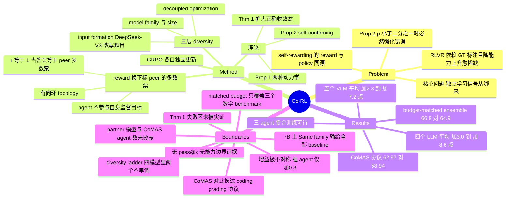

## Summary

Co-RL 把 label-free RL 的 reward 从"自己的 majority vote"换成"另一个 agent 的 majority vote"——N 个不共享参数的 policy 沿有向环互相打分，reward 是 `1[自己的答案 == peer 的多数票]`，各自用 GRPO 独立更新，训练不用任何 ground-truth label。七个文本 benchmark 上四个 LLM 平均提升 3.0–8.6 点、四个多模态 benchmark 上五个 VLM 提升 2.3–7.2 点，并在附录 D.4 的 budget-matched 对照里胜过"两个模型各自跑 TTRL 再 ensemble"。但同一张对照表显示增益极度不对称——强 agent +0.3、弱 agent +10.1——被测出来的主效应更接近"强模型隔着 majority vote 教弱模型"，而标题里的 "emerges" 全文没有任何 pass@k 或能力边界证据支撑。

## Problem & Motivation

论文的 problem formulation 很干净，也是它最值得记的部分：**如何在没有 ground-truth 的情况下拿到一个足够独立的学习信号？**

RLVR 的成功依赖 verifiable reward，而标注成本高、且随着推理能力逼近人类评判上限会越来越稀缺。现有 self-rewarding RL（TTRL 的 majority vote、Intuitor 的 token-level confidence、RENT 的 predictive entropy、Co-rewarding-II 的 paraphrase/momentum 一致性）把 reward 拉回模型自身的预测分布，于是 reward 的构造者与被优化的 policy 是同一个对象。作者把这个缺陷形式化为 Proposition 2：对奇数 K，self-rewarding 的期望 GRPO 更新方向恒等于 `sign(p − 1/2)`，因此 `p(0) < 1/2` 时训练会把正确答案进一步压向 0——**不是"可能强化偏见"，而是"在半数以下的题上必然强化错误"**。

作者的解法直接借自 co-training（Blum & Mitchell 1998）与 diverse co-training（Li et al. 2023）：既然两个独立训练的模型错得不一样，那就让 A 的监督目标完全由 B 生成。这个改动在公式层面只是把 `â_θ(x)` 的下标换成 `â_{-n}(x)`，属于典型的 simple-and-scalable 型设计。

## Method

**核心 reward（§4.1）。** 给定无标注题 `x`，每个 agent `n` 独立采 K 条 completion，抽取答案 `a_n^k = g(y_n^k)`。监督目标是**指定 peer** 的多数票：

```
â_{-n}(x) ∈ argmax_b Σ_j 1[a_{n-1}^j = b]        (Eq. 3)
r_n^k = 1[a_n^k = â_{-n}(x)]
```

索引按环状取，agent 1 由 agent N 监督。**每个 agent 不参与构造自己的监督目标**——这是与 TTRL 的唯一结构性差别。各 agent 的 reward 在自己的 rollout group 内做 group-relative 归一化后进 GRPO，参数与 optimizer state 完全独立，梯度不交换。

**三层 diversity（§4.2）。**

| 层级 | 具体做法 | 证据强度 |
|:--|:--|:--|
| decoupled optimization | 两个 policy 独立更新，只通过 reward 耦合 | 框架自带，无独立 ablation |
| model family & size | Qwen2.5 × Llama-3 / Qwen2.5-VL × InternVL3.5 × Gemma-3（不同 tokenizer、词表、预训练语料、视觉编码器） | Table 1/8 的 Same vs Different family 列 |
| input formation | 用 DeepSeek-V3 把每道 MATH 题改写成保答案但换场景的版本，一个 agent 训原题、另一个训改写题 | Different family+ 列 |

**理论（§5）。** Prop 1 给出两种监督下 `ṗ` 的形式；Prop 2 是上面的 self-confirming 结论；Theorem 1 给出两 agent 对称动力学：`(1,1)` 与 `(0,0)` 都是渐近稳定点，`(1/2,1/2)` 是鞍点，内部分界线是 `p_A + p_B = 1`。也就是说 **cohort 集体收敛到错误共识不是隐患而是一个被证明存在的吸引盆**，触发条件是两 agent 正确率之和低于 1。作者把这条写进正文而不是限制章节，是诚实的。

**"unsupervised" 的准确读法。** reward 里确实没有 GT label（C3 已核）。但监督并没有消失，它被搬到了三个地方，每一处都是环境属性而非算法属性：

1. **可抽取的 canonical answer**——方法依赖 `g(·)`，附录 A 明说是 rule-based extraction + equivalence checking（C4）。这是一个人写的、任务相关的等价判定器。
2. **cohort 的先验能力门槛**——Thm 1 的 `p_A + p_B > 1`。这个门槛由预训练提供，不由 Co-RL 产生。
3. **题目分布**——训练集是 MATH level 3–5 与 MMR1-Math / multimodal-open-r1（C5），即从已标注数据集剥掉标签，题目的良定义性、难度带、可解性都已被 curation 保证。

准确的表述是 **label-free**（作者在正文里多数时候也确实用这个词），而不是 unsupervised。

## Key Results

### 四个 LLM 的七 benchmark 平均（Table 1 / Table 8，单位为百分点）

| 模型 | Base | GT-Reward | 最强 self-rewarding baseline | Co-RL Same | Co-RL Diff | Co-RL Diff+ | Diff+ − Base |
|:--|--:|--:|:--|--:|--:|--:|--:|
| Qwen2.5-3B | 40.7 | 47.4 | TTRL 47.3 | 48.7 | 48.5 | **49.3** | **+8.6** |
| Llama-3.2-3B-Instruct | 38.7 | 43.0 | TTRL 43.1 | 42.7 | 43.7 | **43.9** | +5.2 |
| Qwen2.5-7B | 49.0 | **54.5** | RENT 52.8 | 51.4 | 53.1 | 53.6 | +4.6 |
| Llama-3.1-8B-Instruct | 44.7 | 47.1 | Co-rewarding-II 46.6 | 46.8 | 46.8 | **47.7** | **+3.0** |

摘要的 3.0–8.6 就是这一列的两端，分母是**最优变体（Different family+）对 base 的差**。三个读法上的约束：(a) diversity ladder 不单调——Qwen2.5-3B 上 Same family 48.7 **高于** Different family 48.5，Llama-3.1-8B 上两者并列 46.8（C10）；(b) Qwen2.5-7B 上 Same family 变体 51.4 输给全部四个 self-rewarding baseline（C11）；(c) GT-Reward 并非被普遍超越——Qwen2.5-7B 上 54.5 > 53.6（C12）。

### budget-matched 对照（Appendix D.4 / Table 10，GSM8K + MATH-500 + AMC 宏平均，maj@8, T=0.6）

这是全文信息量最大的一张表，也是最该被单独读的一张。

| 设置 | TTRL | Co-RL | Δ |
|:--|--:|--:|--:|
| Qwen2.5-3B 单模型（**较强**那个） | 65.6 | 65.9 | **+0.3** |
| Llama-3.2-3B 单模型（**较弱**那个） | 49.8 | 59.9 | **+10.1** |
| 两模型 ensemble（各出 4 条，maj@8） | 64.9 | 66.9 | +2.0 |

多模态版本（Table 11）在两个训练集上重复了完全相同的形状：

| 训练集 | 较弱 agent（Qwen2.5-VL-3B） | 较强 agent（InternVL3.5-2B） | ensemble |
|:--|:--|:--|:--|
| open-r1 | 44.73 → 47.92（**+3.19**） | 49.53 → 50.06（**+0.53**） | 48.80 → 50.88（+2.08） |
| MMR1 | 42.99 → 47.85（**+4.86**） | 49.71 → 51.14（**+1.43**） | 49.19 → 52.30（+3.11） |

**四组数据里增益方向完全一致：弱 agent 拿走大头，强 agent 接近噪声。** 论文的解读是"cross-agent supervision 让两个 agent 的预测更好地组合"，但没有报告这个不对称本身。另外注意 `TTRL(Qwen2.5-3B)` 单模型 65.6 已经**高于** `TTRL(ensemble)` 64.9——把两个能力差距大的模型平票，本身会拖累强者。

### CoMAS 协议下的多 agent 对照（Table 2）

Co-RL 62.97 vs CoMAS 58.94（+4.03），领先五个 benchmark，"只用一半 agent 且不需要额外 judge"（C16）。三处需要打折：先前方法的数字直接引自 Xue et al. 2026 而非重跑；作者在 coding benchmark 上**替换了** CoMAS 的聚合协议（原协议第六次调用会让引用多个候选解的回答被事实上按 pass@5 计分，价值 7.3%/2.4%，C17），因此 HumanEval/MBPP 两列的两组数来自不同 grading；Table 2 里 Co-RL 那一行的 partner 模型身份全文未给出（C22），CoMAS 到底用几个 agent 也全文未给（C23）。MATH-500 上 55.80 → 68.6 这个 +12.8 不受 coding loophole 影响，但 Co-RL 行的有效数字位数（89.5 / 68.6）与其余行（85.40 / 55.00）不同，提示两套 eval 流水线。

### 三 agent 与 VLM

三 agent（Qwen2.5-3B + Llama-3.2-3B + Qwen3-1.7B 单次联合训练）平均增益 7.8 / 6.0 / 8.2 点；对 Qwen3-1.7B 而言 Co-RL 47.3 与 TTRL 47.3 **持平**、与 GT-Reward 47.2 仅差 0.1（C19）。VLM 侧最大增益 7.2 点出现在 Qwen2.5-VL-7B（43.94 → 51.13），Gemma-3-12B 上 47.56 超过 GT-Reward 45.17，但 Qwen2.5-VL-7B 与 InternVL3.5-8B 上仍低于各自的 GT-Reward（C12）。

### error decoupling（Appendix A）

different-family pair 全部 κ ≤ 0.42、complementarity c ≥ 29.4；same-family 与 seed-only pair 全部 κ ≥ 0.51、c ≤ 24.6，两组无重叠；组均值跨家族把 κ 从 0.53 压到 0.38、c 从 23.2 抬到 30.8（C15）。作者主动声明：这些数全在 **RL 之前**的 base checkpoint 上测，且 κ 与 c "是同一次测量的两个读数而非独立证据"，12 个 pair 上 r = −0.98（C14）。

表里还有一个作者没展开、但对迁移性最关键的量：**wrong-agreement `w`**（两模型同时错且错成同一个答案的比例，即 majority vote 检测不到的情形）。在 MATH L3–5 上 w 只有 1.8%–5.2%。

## Evidence Ledger

全部 27 条高风险 claim 由独立 verifier 回原文逐条核对（HTML v2 全文 + abs 页），结果均为 `source-verified`；其中 C20 / C22 / C23 / C26 为 absence claim，verifier 已声明检索范围。

| Claim ID | Claim | Type | Source locator | Evidence excerpt | Status |
|:--|:--|:--|:--|:--|:--|
| C1 | 摘要称文本七 benchmark 上 LLM 平均增益 3.0–8.6%，多模态四 benchmark 上 VLM 2.3–7.2% | number | Abstract | "average gains of 3.0–8.6% across seven text-only benchmarks for LLMs and 2.3–7.2% across four multimodal benchmarks" | source-verified |
| C2 | 8.6 端点 = Qwen2.5-3B 40.7→49.3（Diff+）；3.0 端点 = Llama-3.1-8B-Instruct 44.7→47.7 | number | Table 1；Appendix D.1 | "Qwen2.5-7B from 49.0 to 53.6 and Llama-3.1-8B-Instruct from 44.7 to 47.7 on average" | source-verified |
| C3 | reward = 1[a_n^k = â_{-n}(x)]，â 为指定 peer 的多数票；agent 不参与构造自身监督目标；reward 不用 GT label | causal-mechanism | §4.1 Eq. (3) 及其后 | "each agent does not contribute to its own supervision target â_{-n}(x)" | source-verified |
| C4 | 方法依赖 answer-extraction function g(·)；附录 A 说明用 rule-based extraction and equivalence checking | benchmark-setting | §4.1；Appendix A "Setup and metrics" | "with rule-based extraction and equivalence checking" | source-verified |
| C5 | LLM 训练集为 MATH level 3–5；VLM 为 MMR1-Math 与 multimodal-open-r1 | benchmark-setting | §6.1 Datasets | "trained on the level 3 to 5 split of MATH ... We use MMR1-Math ... and additionally use multimodal-open-r1" | source-verified |
| C6 | D.4/§7 的 matched-budget 对照：TTRL 基线训**同两个** base model，推理时两法都各出 4 条 rollout 合并多数票 | benchmark-setting | §7；Appendix D.4 | "trains the same two base models independently with TTRL ... each model generates four responses ... pooled for majority voting" | source-verified |
| C7 | Table 10 Avg：TTRL(Qwen)65.6 / Co-RL(Qwen)65.9 / TTRL(Llama)49.8 / Co-RL(Llama)59.9 / TTRL(ens)64.9 / Co-RL(ens)66.9 | number | Table 10 | 表内数值同左 | source-verified |
| C8 | 文本 matched-budget 只覆盖 GSM8K / MATH-500 / AMC 三个 benchmark，非主表的七个 | benchmark-setting | Table 10 表头 | "GSM8K MATH-500 AMC Avg" | source-verified |
| C9 | Table 10/11 用 maj@8, T=0.6；主表除 AMC(avg@8) 外均单样本，两组数不可对读 | benchmark-setting | Table 10/11 caption；Appendix D.5 | "maj@8, T=0.6" vs "All other benchmarks use a single sample" | source-verified |
| C10 | diversity ladder 不单调：Qwen2.5-3B 上 Same 48.7 > Diff 48.5；Llama-3.1-8B 上两者均 46.8 | number | Table 1；Table 8 | 表内数值同左 | source-verified |
| C11 | Qwen2.5-7B 上 Co-RL(Same family) 51.4 低于 TTRL 51.7 / RENT 52.8 / Intuitor 52.6 / Co-rewarding-II 52.4 | comparison | Table 8 | 表内数值同左 | source-verified |
| C12 | Co-RL 未普遍超越 GT-Reward：Qwen2.5-7B 54.5>53.6；Qwen2.5-VL-7B 51.68>51.13；InternVL3.5-8B 55.85>54.40 | comparison | Table 8；Table 9 | 表内数值同左 | source-verified |
| C13 | Theorem 1：p_A(0)+p_B(0)>1 → (1,1)；<1 → (0,0)，即 cohort 存在错误共识吸引盆 | causal-mechanism | §5.2 Theorem 1 | "p_A(0)+p_B(0)>1 ⟹ (1,1)"；"p_A(0)+p_B(0)<1 ⟹ (0,0)" | source-verified |
| C14 | 附录 A 全部数据在 RL 前 base checkpoint 上测；作者称 κ 与 c 是同一测量的两个读数、12 pair 上 r=−0.98 | benchmark-setting | Appendix A | "All numbers are computed on base checkpoints before any RL"；"two readings of one measurement ... correlate at r=−0.98" | source-verified |
| C15 | different-family 全部 κ≤0.42 且 c≥29.4；same-family/seed-only 全部 κ≥0.51 且 c≤24.6；组均值 κ 0.53→0.38、c 23.2→30.8 | number | Appendix A；Table 6 | "Every different-family pair reaches κ≤0.42 and c≥29.4 ... lowers κ from 0.53 to 0.38 and raises c from 23.2 to 30.8" | source-verified |
| C16 | Table 2 中 Co-RL 62.97 vs CoMAS 58.94；先前方法数字引自 Xue et al. 2026 而非重跑 | comparison | Table 2 及 caption | "Results for prior methods are reported from Xue et al. 2026" | source-verified |
| C17 | 作者在 coding benchmark 上替换了 CoMAS 聚合协议（改为按执行行为聚类的多数票），因原协议有 pass@5 loophole，值 7.3%（untrained baseline）/ 2.4%（本文模型） | benchmark-setting | Appendix D.5 "CoMAS comparison" | "worth 7.3% to the untrained baseline and 2.4% to our model ... replace the aggregation with majority voting over candidates clustered by their execution behavior" | source-verified |
| C18 | 全部实验在单节点 8× H100 上跑，每 agent 4 卡 | number | §6.1 Training details | "All experiments use a single node of eight H100 GPUs, four per agent" | source-verified |
| C19 | 三 agent 平均增益 7.8 / 6.0 / 8.2；Qwen3-1.7B 上 Co-RL 47.3 = TTRL 47.3，GT-Reward 47.2 | number | Table 3；§6.2 | "average gains of 7.8%, 6.0%, and 8.2%" | source-verified |
| C20 | **全文无 pass@k / coverage / capability-boundary 分析**支撑标题的 "emerges"；证据仅为平均分变化与训练动力学曲线 | causal-mechanism（absence） | 全文含附录检索 "pass@" / "coverage" / "capability boundary" / "boundary" / "emerg" | "pass@" 唯一命中处为 CoMAS coding grader loophole，与能力边界无关 | source-verified |
| C21 | VLM 评分两阶段：rule-based 优先，格式合规但规则未匹配的回答交 Qwen2.5-32B-Instruct（T=0）判定，judge 只能挽回 false negative | benchmark-setting | Appendix D.5 Vision-language evaluation | "passed to an LLM judge, Qwen2.5-32B-Instruct at temperature 0 ... can only recover rule-grading false negatives" | source-verified |
| C22 | **Table 2 中 "Co-RL (Different family)" 的 partner 模型身份全文未指明** | benchmark-setting（absence） | §6.2；Table 2 caption；Appendix D.5 | caption 仅称 "All methods train Qwen2.5-3B-Instruct" | source-verified |
| C23 | **全文未说明 CoMAS 用几个 agent**，尽管声称 Co-RL "只用一半 agent" | comparison（absence） | 全文 8 处 CoMAS 提及 + 全部 "agent(s)" 检索 | "outperforming CoMAS by 4.0% while using only half as many agents" | source-verified |
| C24 | 代码开源于 github.com/DrStranded/Co-RL | license-code | Abstract | "Code is available at https://github.com/DrStranded/Co-RL" | source-verified |
| C25 | 机构含 Johns Hopkins University / UC San Diego / University of Exeter / Independent Researcher；通讯作者 Yijiang Li 与 Nuno Vasconcelos（均 ucsd.edu）；v1 2026-08-18、v2 2026-08-19 | metadata | 首页作者块；abs 页 submission history | "Corresponding to Yijiang Li: yijiangli@ucsd.edu, Nuno Vasconcelos: nuno@ucsd.edu" | source-verified |
| C26 | **全文无刻意构造弱 cohort 以实证 Theorem 1 失败区（收敛到错误共识）的实验**；所有 collapse 讨论指向 self-rewarding baseline 的退化 | causal-mechanism（absence） | 全文检索 collapse / consensus / weak cohort / low-capab | 命中处均为 TTRL/RENT/Intuitor 退化描述 | source-verified |
| C27 | VLM 训练中两 agent 的一致性 "remains well below full agreement"，交换的 pseudo-label 精度持续上升；Figure 5 为 Qwen2.5-VL-7B × InternVL3.5-8B on open-r1 单一配对 | causal-mechanism | Appendix D.3；Figure 5 caption | "the agreement between the two agents remains well below full agreement throughout training" | source-verified |

## Strengths & Weaknesses

**Strengths**

- **问题被降到一个变量上。** "reward 的构造者是不是正在被优化的那个 policy"——整篇论文围绕这一个二元变量组织，方法改动只有一个下标。这是 simple / scalable / generalizable 的教科书形态，也让结论比大多数 multi-agent RL 论文更容易证伪。
- **失败条件被写进定理而不是限制章节。** Prop 2 给出 self-rewarding 在 `p<1/2` 必然强化错误；Thm 1 给出 Co-RL 在 `p_A+p_B<1` 收敛到错误共识。作者没有把"cohort 不会集体走偏"当卖点卖，而是标出了门槛在哪。这是在这个赛道上少见的处理。
- **有真正的 budget-matched 对照。** 附录 D.4 训同两个 base model、推理时两法同样 maj@8——在 label-free RL 这条线上，肯提供这一层对照的论文是少数。
- **附录 A 主动降级自己的证据。** 明说 κ 与 c 是同一次测量的两个读数（r=−0.98），不当两条独立证据用；且全部在 pre-RL checkpoint 上测，不冒充训练产物。
- **CoMAS coding loophole 的披露方向对自己不利。** 作者发现原协议让引用多候选解的回答事实上按 pass@5 计分，量化为 baseline +7.3% / 自己 +2.4%，然后**把自己那 2.4% 也去掉**换成聚类多数票。这一段值得单拎出来当同行披露的样板。

**Weaknesses**

- **matched-budget 表把 headline 拆穿了一半，而论文没有报告这一点。** Table 10/11 里四组数据方向完全一致：强 agent +0.3 / +0.53 / +1.43，弱 agent +10.1 / +3.19 / +4.86。这说明被测出来的主效应是**弱 agent 从强 agent 的多数票里吸收能力**，而非双向 emergence。分离这两者的关键对照——**把 peer 换成一个冻结、不参与训练的强模型**——论文没有做。在做出这个对照之前，Co-RL 与"隔着 majority vote 的在线 distillation"在证据上无法区分。
- **"emerges" 没有能力边界证据。** verifier 全文检索确认无 pass@k / coverage / capability-boundary 分析（C20）。这在这条文献线上尤其不能省：论文自己引的 Yue et al. 2025 正是主张 RLVR 主要锐化已有分布而非扩展边界。majority-vote reward 在机制上就是把 policy 推向自己或 peer 已经能采到的多数答案，**先验上更像锐化**；标题选了更强的那个词，正文没有提供区分这两者的任何测量。
- **"diversity consistently improves" 在 per-model 层面被自己的表推翻。** 四个模型里只有两个 Same→Different 单调（C10）。真正在四个模型上都最优的是 Different family+，即 **data decoupling** 那一项——而它需要一个外部模型（DeepSeek-V3）改写全部训练题，这份算力与外部能力从未计入任何预算对照，且与 Co-rewarding-II 的 paraphrase 思路同源。也就是说最稳定的那个增量来源，恰好不是论文标题强调的 cohort diversity。
- **Qwen2.5-7B 上 Same family 输给全部四个 self-rewarding baseline**（51.4 vs 51.7/52.8/52.6/52.4，C11）。摘要的 "consistently outperforms prior label-free approaches" 只有在对每个模型取最佳变体后才成立。
- **κ 与下游增益之间没有连线。** 附录 A 测的是 pre-RL error overlap，且是纯 correlational；没有任何实验把 κ 当自变量去预测 Co-RL 的增益幅度。Table 7 的 anchor-fixed ladder 固定了一端，但 partner 的**能力**仍随 partner 变，decoupling 与 capability 没被分开。因此"error decoupling 导致增益"是假设加相关，不是因果证据。
- **Thm 1 的失败区从未被实证（C26）。** 论文证明了错误共识吸引盆存在，却没有跑一次故意构造的弱 cohort 把它演示出来。结果是"什么时候不该用 Co-RL"只有理论边界、没有经验刻度——而部署时最需要的恰是后者。这也是论文自己的理论最应该配的那个负结果。
- **compute 对照只回答了一半问题。** D.4 对齐的是"两个模型 × 各 4 条 rollout"的形态，回答的是"同样的 2× 算力，分给两个异构模型时 Co-RL 优于各自 TTRL"。它**没有**回答"把 2× 算力集中给最强的那一个会怎样"——即 K=24 的 TTRL 或 best-of-24 self-consistency 作为 compute-matched 上界。Table 10 里 `TTRL(Qwen2.5-3B)` 单模型 65.6 已经压过 `TTRL(ensemble)` 64.9，这个方向的对照是必要的而非可选的。
- **budget-matched 证据的有效范围窄于摘要。** 文本侧只覆盖 GSM8K / MATH-500 / AMC 三个数学 benchmark（C8），code 与 GPQA 不在内；且用 maj@8 T=0.6 评测，与主表口径不同（C9）。"增益不来自额外算力"这个结论目前只在数学子集上被验证过。
- **CoMAS 对比不是 like-for-like。** 先前方法数字引自原文、coding 列换了 grading 协议、partner 模型身份未给（C22）、CoMAS 的 agent 数未给（C23）——"只用一半 agent"这句话的分母在论文里找不到。

**潜在影响。** 对本 vault 的 agenda（Agent-Facing Environment Runtime / GUI-web agent）来说，这篇最有价值的地方不是方法，而是**它的适用条件被写得足够清楚，从而可以直接判断它迁不动**：

| 环境属性 | Co-RL 的要求 | 数学任务 | GUI / web agent |
|:--|:--|:--|:--|
| canonical extractable answer | 必须有可 argmax 的离散答案 b + equivalence checker | 有 | 无——"答案"是一条状态转移序列 |
| wrong-agreement `w`（两模型同时错且错成同一答案） | 必须低，否则多数票检测不到共同错误 | 1.8–5.2%（附录 A） | 每步动作空间小且共享 UI 先验，w 显著更高 |
| `p_A + p_B > 1` | Thm 1 的正确收敛门槛 | 满足 | OSWorld 类 benchmark 上普遍不满足 |

三条同时不满足，因此按论文自己的定理，直接把 peer-vote reward 搬到 GUI/web 上落在 `(0,0)` 吸引盆里的风险是结构性的、不是工程问题。唯一可能的补丁方向是：**不要在 final answer 上投票，而是在可被环境独立核验的中间事实上投票**——这把问题原样送回 verify affordance 与 environment-side checker，也就是本 vault 一直在追的那条线。

## Mind Map



## Notes

- **最该做而没做的实验（一句话）**：把 peer 换成一个**冻结的**强模型（不参与训练、不更新），其余全部不动，看弱 agent 的增益还剩多少。若基本不掉，Co-RL 的主效应就是隔着 majority vote 的在线 distillation；若显著掉，"双向 co-adaptation" 才立得住。这个对照几乎零额外成本，而它决定了论文标题里 "emerges" 与 "cohort" 两个词能不能留。
- **第二个便宜实验**：单 agent 拿满 2N 条 rollout（K=24 的 TTRL，或 best-of-24 self-consistency）作为 compute-matched 上界。D.4 目前只对齐了"两个模型"这一种花法。
- **第三个**：Thm 1 失败区的经验刻度——取一对已知 `p_A + p_B < 1` 的弱模型跑 Co-RL，把 `(0,0)` 收敛报出来。这是论文自己的理论最需要、也最缺的那一个负结果。
- **可提炼成论断的观察**：**peer-vote reward 的可用性由 `w`（两模型同时错且错成同一答案的比例）决定，而 `w` 由答案空间的大小与结构决定。** 论文只在 MATH L3–5 上给了 1.8–5.2%，没有把 `w` 提升为跨任务的适用性判据。这个判据比论文强调的 κ 更直接可操作——κ 描述"错得像不像"，`w` 直接描述"多数票能不能发现共同错误"，后者才是 Thm 1 失败区的可测代理。多选题、小离散动作空间（GUI click target）、二元判断这三类任务的 `w` 都会显著高于开放数值答案，值得在本 vault 的 label-free RL 讨论里单独记一笔。
- **与库内工作的关系**：最直接的对照是 [[2606-CodeSelfReviewCollapse]]——同一类风险的另一个 regime，其结论"稳定的递归自训练需要 model 偏好分布之外的 exogenous verification"正好可以用来追问 Co-RL 的 peer 算不算 exogenous（跨 pretrain 是，但仍在 model 偏好分布家族内，Thm 1 的 `(0,0)` 盆就是这一点的形式化）；[[2606-VisPlay]] 是 Co-RL 论证要打的靶子形态（questioner 与 reasoner 同源于一个 base VLM，majority-vote pseudo-label 作 verifiable reward）；[[2607-OSReward]] 提供 GUI 侧的最强反证——27 个 judge 在困难子集上均值掉到 52% 且**共享同一个错误方向**，正是 `w` 高的直接测量；[[2608-ZerothOrderSelfEvolve]] 处理的"能力边界外采不到正样本、学习信号归零"与 Thm 1 是同一件事的单 agent 版本；[[2607-RingZero]] 是"标题写 emergent reasoning、证据是观察而非因果验证"这个 pattern 的另一例；分类归属见 [[2608-CoEvolutionSurvey]] 的 Agent-Agent co-evolution 类目。
- **文件名说明**：用 `CoRLCohort` 而非 `CoRL`，避免与 Conference on Robot Learning 的通用缩写在本 vault 内混淆。
- **机构信息说明**：arXiv HTML 的 LaTeXML 渲染把 affiliation 脚注挂到了错误的作者上（Yunjie Tian / Di Fu 的脚注块携带 UCSD 邮箱），四个机构名与两位通讯作者邮箱是确凿的，但"哪位作者属于哪个机构"的映射不可靠，因此 frontmatter 的 `institute` 只列机构集合、不做逐人对应。
