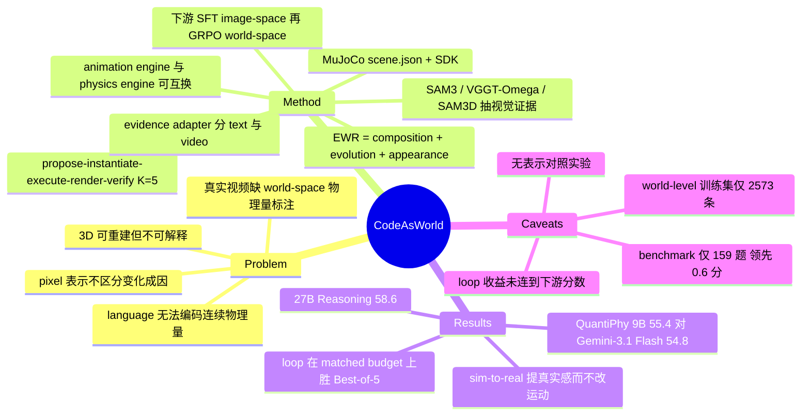

## Summary

Code-as-World 把物理世界写成一段可执行代码——由 physical composition / dynamic evolution / visual appearance 三部分构成、最终落到 MuJoCo 的场景规格——再用 propose–instantiate–execute–render–verify 的 agentic discovery loop（K=5）从文本描述或真实视频里反解出这段代码，验证通过的世界导出精确 world-space 物理量，作为 GRPO 监督训练 Code-as-World-VL。QuantiPhy-validation 上 9B 变体平均 MRA 55.4（Gemini-3.1 Flash 54.8），27B reasoning 变体 58.6。但全文没有任何实验比较 code / pixel / 3D / language 哪种表示更好，也没有把 discovery loop 的收益连到下游分数上——被真正验证的命题是"仿真器导出的精确 metric 标签能提升 VLM 的单目尺度标定"。

## Problem & Motivation

第 2 节是全文论证密度最高的部分，它把三条既有表示逐一证伪：**pixel**（video generative model）只优化未来像素，不需要区分场景变化来自相机运动还是物体运动、来自遮挡还是消失，多个互相矛盾的内部解释可以有同样的预测精度——"a visually plausible future is not necessarily a physically correct future"；**3D reconstruction** 保信息但不保可解释性，恢复几何不解释行为，"reconstructability does not necessarily imply interpretability"；**language** 紧凑、可组合、可迁移，但无法精确编码连续量（几何、轨迹、接触关系、物理参数）。作者要的表示是 "semantic like language, structured like reconstruction, capable of modeling temporal evolution like generative models"，答案给的是 code。

第二个动机是 inverse problem 视角：从不完整观测恢复这种表示本质上是 abduction（作者拿日心说与牛顿定律作类比），所以应该形式化为带验证的搜索，而不是一次性预测。

第三个动机才是真正驱动实验的那个：真实视频几乎不带 world-space 物理量标注，所以 quantitative physical reasoning（从单目视频估物体真实尺寸、位移、速度、加速度）缺监督来源。可执行世界能免费导出精确标签。

## Method

**Executable World Representation (EWR)。** 一个 EWR 由三部分组成：physical composition（场景中的物体、几何、metric 尺寸，以及质量、摩擦、重力等属性；地面/桌面/墙作为静态物理实体参与支撑与碰撞）、dynamic evolution（初始状态、时序变化、关键事件、仿真时长）、visual appearance（相机参数、背景、材质、光照、帧率、分辨率、渲染或视频生成配置）。三者可以被独立 inspect / modify / execute——改一个物体、一个物理参数、一个相机设置而不动其余结构。落地形态是一份结构化的 `scene.json` 加上一个 simulator SDK（Figure 12）。

**Agentic discovery loop（Algorithm 1）。** 给定证据，agent 提出或更新 EWR，实例化为 simulator-ready 参数，执行得到完整 state trajectory（显式记录接触、碰撞、事件结果），渲染成预测观测并对视频输入额外投影出 depth / mask / image-plane trajectory，在选定关键帧上与输入证据比对，把帧级 discrepancy 聚合成结构化反馈驱动下一轮的局部修正。解释充分且足够 parsimonious 就接受，预算耗尽仍不达标则**拒绝**该样本。K=5。

**Evidence adapter 分模态。** Text-driven：抽实体、空间关系、物理事件与预期结果，因为文本几乎不决定几何/物理参数/相机，agent 用物理先验加合理默认值初始化，再靠仿真与语义验证收敛；随后用一个视频生成模型做 sim-to-real，加丰富的物体、材质、背景、光照。Video-driven：SAM3 出 instance mask 与 image-plane track、VGGT-Omega 估深度与相机几何、SAM3D 出物体 mesh，再结合深度与跟踪反解物体的空间位置、尺度、动态状态。

**执行引擎。** 平台是 MuJoCo，下挂两个可互换引擎：animation engine 用时变 pose 与轨迹 kinematically 描述运动，physics engine 从力、接触、约束导出运动。**主文的 discovery 分析用的是 video evidence + animation engine**，physics engine 的结果放在附录 C.2。仿真渲染之后还要经过一道 realism re-rendering，用 Wan2.2-VACE 加一个未公开的 internal video generation model。

**下游两阶段 curriculum。** 阶段一在 image-space 做 SFT：把 RefCOCO / RefCOCO+ / RefCOCOg / RefCLEF 的框和 GOT-10K 的稠密轨迹转成像素单位的尺寸、位置、位移、速度、加速度问答（速度与加速度用中心差分），共 73,335 条。阶段二在 world-space 做 GRPO：从验证通过的 EWR 采样目标物体、时间戳、物理量与单位，答案直接读自场景几何与 state trajectory，reward = scale-normalized numerical accuracy + 单位正确性 + 格式。4B / 9B 为直答变体，27B 额外训练出 `<think>` 轨迹（medium-effort thinking、无 KL 惩罚、reward 只看最终标量、不监督 trace 内容）。所有变体统一每视频均匀采 16 帧，8 卡 H100。

作为 discovery agent 的 LLM 在 Algorithm 1 里只写作 "LLM A"，全文未指名；Code-as-World-VL 的 VLM backbone 同样未公开。

## Key Results

**QuantiPhy-validation（Table 1，MRA×100，四子集非加权 macro-average）**

| Model | Size | 2S | 2D | 3S | 3D | Avg |
|:--|:--|:--|:--|:--|:--|:--|
| Gemini-3.1 Flash | – | 49.4 | 47.5 | 61.4 | 61.1 | 54.8 |
| ChatGPT-5.1 | – | 56.9 | 34.6 | 45.6 | 56.4 | 48.4 |
| Qwen3-VL-32B-Instruct | 32B | 38.1 | 39.7 | 39.8 | 43.0 | 40.2 |
| InternVL-3.5-30B | 30B | 33.1 | 33.0 | 31.4 | 44.7 | 35.5 |
| **Code-as-World-VL-4B** | 4B | 45.4 | 55.4 | 45.8 | 56.0 | **50.6** |
| **Code-as-World-VL-9B** | 9B | 55.0 | 52.9 | 55.6 | 58.1 | **55.4** |
| **Code-as-World-VL-27B (Reasoning)** | 27B | 48.7 | 62.4 | 60.5 | 62.8 | **58.6** |

关键口径：QuantiPhy-validation 只有 **159 题**，overall 是四个子集的非加权 macro-average（约每子集 40 题）。9B 对最强专有基线的领先是 **0.6 分**。27B 论文自己声明不是 reasoning 效应的受控估计（规模与响应协议同时变），且报告的是 training step 60 的单次采样结果，无 self-consistency / majority voting / best-of-N / 工具调用。

**数据源消融（Table 4）**：4B 从 Image-Space Only 的 44.2 → +text 48.5 / +video 47.8 → 全量 50.6；9B 全量 55.4。两个 world-space 源互补（text-driven 标签精确、video-driven 分布真实）。

**Agentic loop（Figure 4 / C.2）**：animation engine 下五轮迭代在 matched five-evaluation budget 上胜过 Best-of-5，正文措辞是 "on most aspects"，Figure 4 caption 具体点名 Visual Alignment、Object IoU、Traj-ADE、Accuracy@2%D（未含 Velocity-ADE）；换成 physics engine（C.2）后在全部五项指标上都胜过 Best-of-5。用于筛选与修正的 verifier 信号与报告指标刻意不重叠。

**Sim-to-real 保真检查（Table 2）**：重渲染把 JEDi MMD 从 3.000 降到 1.484、TRAJAN Fréchet 从 406.872 降到 185.321，同时 Traj-ADE 1.682 → 1.677 基本不动，Velocity-ADE 0.404 → 0.472 略退，Accuracy@2%D 78.81 → 77.49。

**Image-space（Table 3）**：加了 world-space 训练之后，4B 与 9B 在全部五个像素级 benchmark 上都优于各自的 Image-Space 变体（如 9B 的 RefCLEF 47.2 → 61.9、GOT-10K 20.1 → 26.6）。

**规模口径**：world-level 训练集共 **2,573 条** VQA（1,585 text-driven + 988 video-driven），而 image-space 有 73,335 条。

## Evidence Ledger

| Claim ID | Claim | Type | Source locator | Evidence excerpt | Status |
|:--|:--|:--|:--|:--|:--|
| C1 | 9B 平均 MRA 55.4，对 Gemini-3.1 Flash（54.8）领先 0.6 分 | number/comparison | Table 1（§5.4.3） | "Code-as-World-VL-9B \| 9B \| 55.0 \| 52.9 \| 55.6 \| 58.1 \| 55.4"; "Gemini-3.1 Flash \| – \| ... \| 54.8" | source-verified |
| C2 | 27B (Reasoning) 平均 58.6，为表中最高 | number | Table 1（§5.4.3） | "Code-as-World-VL-27B (Reasoning) \| 27B \| 48.7 \| 62.4 \| 60.5 \| 62.8 \| 58.6" | source-verified |
| C3 | QuantiPhy-validation 仅 159 题；overall 为四子集非加权 macro-average | benchmark-setting | Appendix B.4 | "It contains 159 quantitative question–answer pairs"; "unweighted macro-average of these four subset scores" | source-verified |
| C4 | world-space 训练集共 1,585 text-driven + 988 video-driven VQA | number | Appendix A.2 | "It contains 1,585 text-driven and 988 video-driven VQA samples." | source-verified |
| C5 | image-space 训练集 73,335 条（GOT-10K 46,763 + refexp 26,572） | number | Appendix A.1 | "Image-Space training set contains 73,335 question–answer pairs" | source-verified |
| C6 | 平台为 MuJoCo，含 animation / physics 两个可互换引擎；当前实现主要限于 rigid-body | benchmark-setting | Appendix B.2 + §7.1 | "We use MuJoCo as the simulation platform... two interchangeable execution engines"; "focuses primarily on rigid-body dynamics" | source-verified |
| C7 | 主文 loop 仅称胜过 Best-of-5 "on most aspects"（Fig 4 点名四项，不含 Velocity-ADE）；physics engine 下（C.2）五项全胜 | comparison | §4.3.3 + Fig 4 caption；Appendix C.2 + Fig 10 | "outperforms Best-of-5 on most aspects"; C.2: "outperforms the matched-budget Best-of-5 baseline on all five metrics" | source-verified |
| C8 | 论文内部数字不一致：Table 4 中 9B Image-Space Only 行四子集 macro-average 为 51.9 却记作 50.9；正文称 full 9B "improves from 50.9 to 56.8"，而 Table 4 与 Table 1 均为 55.4 | number | Table 4（Appendix C.4）及其后正文 | 行值 "44.3 \| 51.9 \| 51.4 \| 60.0 \| 50.9"；正文 "the full 9B model improves from 50.9 to 56.8" | source-verified（不一致确实存在于原文） |
| C9 | 27B 结果非 reasoning 效应的受控估计；step-60 单次采样，无 self-consistency / 投票 / best-of-N / 工具 | benchmark-setting | §5.4.3 + Appendix B.5 | "rather than as a controlled estimate of the effect of reasoning alone"; "we evaluate the model at training step 60. We sample one response per QuantiPhy example" | source-verified |
| C10 | video-driven 世界取自 WISA-80K 经 motion-focused 过滤；工具为 SAM3 / VGGT-Omega / SAM3D | benchmark-setting | §4.3.1 | "selected from WISA-80K through a motion-focused filtering pipeline"; "SAM3 supplies instance masks... VGGT-Omega estimates scene depth... SAM3D provides object geometry" | source-verified |
| C11 | 代码开源于 github.com/mirros-lab/code-as-world，论文 CC BY-NC-SA 4.0 | license-code | 首页 metadata / arXiv v1 | "License: CC BY-NC-SA 4.0"; "Code: https://github.com/mirros-lab/code-as-world" | source-verified |
| C12 | sim-to-real 重渲染提升真实感（JEDi 3.000→1.484，TRAJAN 406.872→185.321）而运动基本不变（Traj-ADE 1.682→1.677，Velocity-ADE 0.404→0.472） | number | Table 2（Appendix C.1） | "Simulator Render \| 3.000 \| 406.872 \| 1.682 \| 0.404 \| 78.81"; "Sim-to-Real Video \| 1.484 \| 185.321 \| 1.677 \| 0.472 \| 77.49" | source-verified |
| C13 | abstract 声称 "achieves state-of-the-art performance on QuantiPhy and surpasses leading proprietary models" | sota-novelty | Abstract 末句 | "Code-as-World-VL achieves state-of-the-art performance on QuantiPhy and surpasses leading proprietary models" | source-verified |
| C14 | 除 QuantiPhy（world-space）与五个 image-space 测量数据集外，Code-as-World-VL 未在任何其他物理推理 benchmark 上评测 | benchmark-setting | Tables 1–4、Figures 4/8/9/10/11 全文扫描 | Table 3 = "RefCOCO† \| RefCOCOg† \| RefCOCO+† \| RefCLEF† \| GOT-10K*"；Tables 1/4 仅 QuantiPhy | source-verified |

## Strengths & Weaknesses

### 相对于 vault 里"学出来的 latent/video world model"这条线的定位

这是一个**不同的赌注**，值得和 [[2608-JEPAWAM]] / [[2608-SimWAM]] / [[2608-GameWAM]] / [[2608-DALeWM]] 并排看。

**它买到了什么**

1. **精确、无歧义、带单位的 state 标签。** JEPA-WAM 的预测目标是 frozen encoder 的 patch 特征、SimWAM 的是像素、GameWAM 的是未来帧加键鼠动作——这三者都回答不了"这个球此刻的速度是多少 m/s"。EWR 的 state trajectory 直接给 SI 单位的量。QuantiPhy 这类任务在 latent WM 路线上**根本没有监督来源**，这是本文选题最扎实的地方。
2. **可编辑性与 counterfactual 近乎免费。** 改保龄球初速度方向、把碰撞换到全局视角或任一车视角重渲染，都是改几行规格再跑一遍；video 路线要重新生成甚至重训。
3. **假设可检查。** [[2608-DALeWM]] 整篇的抱怨就是 latent WM 的 planning cost 不可审计、probe 与实际 planning 表现脱钩；[[2608-WorldSimProbe]] 发现 ACWM 会 hallucinate contact 却看起来 plausible。EWR 把假设写成人可读的代码加可执行 rollout，这两类失败在原理上可定位到具体参数。
4. **rollout 一致性由仿真器兜底。** [[2609-SparseResidualWM]] 的 horizon-20 rollout 反而输给 no-op 基线；EWR 不会这样累积误差，因为动力学不是学出来的。

**它交出了什么**

1. **覆盖面被 DSL 与仿真器锁死。** 当前只有 rigid body + MuJoCo。论文 §7.1 自己列的扩展清单（流体、布料与可形变体、燃烧、断裂、弹塑性、气体动力学）恰恰说明每一类新现象都要接一个新引擎、并教 coding agent 正确调用与组合。学出来的 video WM 至少能对任意视频吐出一个（也许错的）未来；EWR 在域外只能拒绝。
2. **物理不是被发现的，是被作者写好的。** agent 搜索的是固定 rigid-body 先验下的参数与初始条件——这更接近 system identification / inverse simulation，与 intro 里日心说和牛顿定律的 abduction 类比差一个量级。更要紧的是，**主文的 discovery 分析用的是 animation engine**，它用时变 pose 规定运动、根本不从力导出，这部分"executable world"实质上是 kinematic playback 而非 mechanism hypothesis；真正的 physics engine 结果被放在附录 C.2。
3. **进入代价高，且靠筛数据换成功率。** video-driven 侧要三个感知模型预处理加最多五轮 propose/simulate/render/verify。WISA-80K 被过滤掉相机平移旋转、运动不足、混合现象、剪辑严重的片段，最终只得到 988 条 video-driven VQA。**留存率全程未报告**，所以"离开被筛出来的那类场景还剩多少"这个最关键的量没有被测量——而这正是与 video WM 对比时最该给的数字。
4. **外观最终还是要还给 video model。** realism 由 Wan2.2-VACE 加内部视频生成模型提供。所以这条路线并没有替掉 video world model，而是把它降级成一个接在显式 state trajectory 之后的 conditional renderer。论文 §7.2 自己把这写成未来方向（"separating world dynamics from visual rendering"）——我认为**这才是本文真正站得住的架构主张**，比"code 是更好的表示"更有力。

### Strengths

- **Problem formulation 干净**：把 world representation 从 one-shot prediction 改成带 verifier 的搜索，并且明确说明用于筛选与修正的 verifier 信号与报告指标不重叠（"measured using independent metrics that are not included in the verification signal"）。这比多数 self-refine 论文诚实。
- **抓住了一个真实的数据缺口**：真实视频没有 world-space 物理量标注。用可执行世界反解补这个缺口是 simple 且方向正确的做法；C.4 也确实显示 text-driven（标签精确、分布不真实）与 video-driven（分布真实、标签靠反解）互补。
- **Table 2 做了 synthetic-data 论文常跳过的一步**：验证"提高真实感的重渲染有没有改变物理"。JEDi 与 TRAJAN 大幅下降而 Traj-ADE 几乎不动，是对"标签仍然有效"的直接证据。
- **局限写得诚实**：明说 loop 可能收敛到 locally plausible 但机制错误的 EWR；明说 27B 不是 reasoning 效应的受控估计。

### Weaknesses

1. **论文论证的命题与论文验证的命题不是同一个。** 第 2 节用整节论证 code 优于 pixel / 3D / language，但全文**没有任何表示对照实验**。Table 1 比的是 Code-as-World-VL 与一堆通用 VLM，测的是"仿真器导出的精确标签能否提升 VLM 的单目尺度标定"。related work 里 WorldCoder、VisPhyWorld（code-driven video reconstruction）、MPMWorlds、PhysCodeBench（physics-aware symbolic simulation + self-corrective multi-agent refinement）同属 code-as-world 路线，**一个都没进对比表**，novelty 边界只靠一句 "these approaches do not address the more fundamental problem" 在散文里划定。
2. **discovery loop 的收益没有连到下游。** Figure 4 / Figure 10 只证明五轮迭代比 one-shot 与 Best-of-5 的重建保真度好；C.4 消融换的是数据来源（pix / text / video），不是 loop。因此"agentic discovery 对最终 55.4 贡献了多少"零证据。把 loop 换成 one-shot 生成同样数量的世界，QuantiPhy 会掉多少？这是本文最该做而没做的实验。
3. **headline margin 相对 benchmark 规模太小。** 159 题、四子集 macro-average，9B 对 Gemini-3.1 Flash 领先 0.6 分，无 seed、无误差棒；27B 是 step-60 单次采样。abstract 的 "state-of-the-art... surpasses leading proprietary models" 措辞强于证据强度。
4. **基线表的低端主要在测格式合规。** MRA 对无法解析成有限数的回答判 0 分。MiniCPM-V 4.5 在 3S/3D 上是 0.0 / 0.0，ChatGPT-5 Pro（19.5）低于 ChatGPT-5（32.6）——这些不像能力差异，像解析失败。Table 1 下半部分不能读成物理理解排名。
5. **两处内部数字不一致（已核实存在于原文）**：Table 4 中 9B Image-Space Only 行的四子集 macro-average 是 51.9 而表里写 50.9；紧接的正文说 full 9B "improves from 50.9 to 56.8"，而 Table 4 与 Table 1 都写 55.4。
6. **可复现性缺口。** discovery agent 的 LLM 只写作 "LLM A" 全文未指名；Code-as-World-VL 的 VLM backbone 未公开（Table 3 里并排列出 Qwen3.5-4B/9B/27B 暗示是 Qwen3.5，但论文没说）；sim-to-real 用的是 "our internal video generation model"。代码仓库虽已给出，这三项不公开则 Table 1 无法复现。
7. **"scalable physical supervision" 与实际规模不匹配。** world-level 训练集 2,573 条，GRPO 跑在 2.5k prompt 上。scalability 是被断言的，不是被展示的——而且瓶颈恰好落在最贵的那一环（每个视频三个感知模型加至多五轮仿真渲染验证）。
8. **paradigm 主张与被评测的系统隔了一层。** 论文自己承认模型学的是 discovery 的产物而非 discovery 本身；测试时 Code-as-World-VL 就是一个 fine-tune 过的 VLM，"world" 完全存在于训练数据管线里，推理时不再有任何可执行物。

## Mind Map

## Notes

- **最该被质疑的一点**：如果 EWR 的下游价值就是"提供精确标签"，那 discovery loop 是不是可以整个绕过？直接程序化随机生成 MuJoCo 场景（domain randomization）同样给精确标签，而且能生成任意多。本文没有这个 baseline。而 text-driven 那一半其实**已经很接近**这个 baseline——它的"证据"只是 LLM 生成再人工 review 的文本描述，谈不上从观测反解。这样算下来，discovery loop 真正不可替代的只有 video-driven 那 988 条。
- **一个更有意思的实验方向**：把 EWR 当 test-time 工具而非训练数据来源——让模型在推理时写一段 EWR、执行它、读出答案。这才是"executable representation"相对"把标签蒸进权重"的独特价值，也正好对上 §7.2 说的 System-2 embodied interaction。目前的做法用完 EWR 就把可执行性丢掉了。
- **引用瑕疵**：Table 1 的 "Gemini-3.1 Flash" 引 [3]，而 [3] 的条目实际是 "Gemini 3.1 Flash-Lite" 的 model card。评的到底是 Flash 还是 Flash-Lite，直接影响 "surpasses leading proprietary models" 的分量。
- **与 [[2607-ObjectCentricEnv]] 同构、换了域**：OCM 用 Python 类编码文本交互环境的 object state / affordance / transition，并强制 procedure 对更新后的 object model 可执行才提交；Code-as-World 用 scene.json + MuJoCo SDK 编码物理场景，并强制渲染回投影与证据一致才接受。两者共享"可执行即可验证"的同一机制。[[WorldModel-Survey]] 目前的十条技术路线里没有 programmatic / executable world representation 这一支，这两篇加上论文引的 WorldCoder、SceneCode、VisPhyWorld、MPMWorlds 已经够开一条支线。
- **与 [[2606-Abstract3DPerception]] 的对照**：SandboxVLM 走的是 test-time 构造粗粒度 symbolic 3D abstraction 再喂回 VLM，不训练；Code-as-World 走的是 train-time 用精确仿真标签蒸馏。同一个"给 VLM 补结构化物理先验"的目标，两种成本结构，值得放一起比。
- 建议后续起一轮 `repo-digest` 深挖实现：`scene.json` 的 schema、simulator SDK 接口、verifier 的具体判据与接受阈值、以及 WISA-80K 的过滤留存率是否可从代码中还原——这几项决定了本文的可复现性与覆盖面结论。
- repo_candidate: https://github.com/mirros-lab/code-as-world
