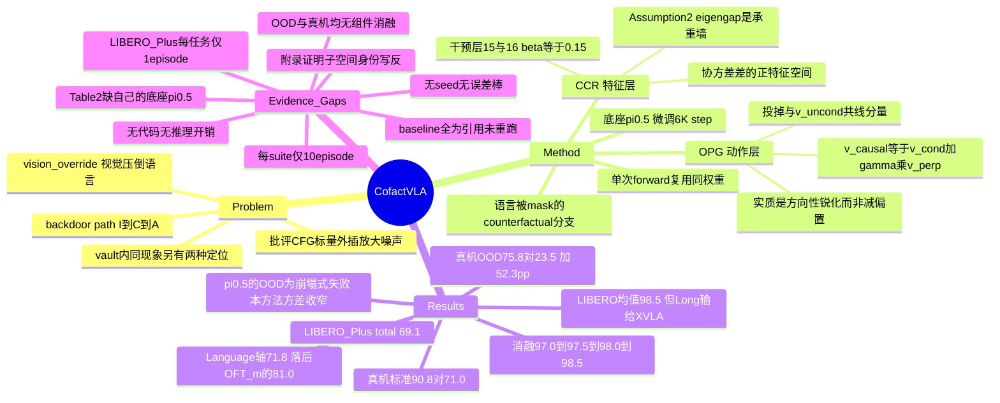

## Summary

把 VLA "看见什么就抓什么、无视指令" 的失效（作者称 vision-override）写成 backdoor path `I⇢C→A`，用一条把语言 mask 掉的 counterfactual 分支同时在两处做减法：动作层把 factual velocity field 中与 counterfactual 共线的分量投影掉再放大残差（OPG），特征层把两分支协方差差的正特征空间从 KV 特征里减掉（CCR）。以 π0.5 为底座微调 6K step 后，标准 LIBERO 平均 98.5%、零样本 LIBERO-Plus total 69.1%、AgileX PiPer 真机四任务标准环境 90.8% / 作者自设 OOD 环境 75.8%（π0.5 分别 71.0% / 23.5%）。但仿真侧的评测预算（标准 suite 每 suite 10 episode、LIBERO-Plus 每任务 1 episode、全文无 seed 无误差棒）撑不起 +0.4pp 量级的 SOTA 断言，而唯一有 100 trial 支撑的真机 OOD 结果恰恰没有任何组件消融。

## Problem & Motivation

VLA 训练数据里视觉流密集、语言指令稀疏。作者把由此产生的失效命名为 **vision-override**：模型不把 instruction 当因果驱动，而是习惯性地抓最显著的物体、复现最熟悉的布局。形式化上，图像 `I` 通过一个 latent visual confounder `C` 打开一条 backdoor path `I⇢C→A`，绕过语义意图 `T` 直接决定动作。

这个 framing 在 vault 里不新。[[2608-GSRParaVLA]] 用因果干预定位到同一现象的另一半——任务语义在语言主干里**保住了**（π0.5 Retrieval@1 0.941），坏在动作策略对 joint vision-language 编码引入的漂移过度敏感；[[2606-AffordanceFieldInterventio]] 把它叫 Memory Trap（VLA 在 OOD 下复现训练轨迹而不响应新空间线索）。CofactVLA 的差异在于它既不改数据也不加外部模块，而是直接在推理与特征路径上做减法。

作者对现有路线的批评有两条：(a) data-centric 做法（linguistic rephrasing、counterfactual 数据增强）在开放世界不 scale，且解不开已经纠缠的内部表示；(b) 动作层的 Classifier-Free Guidance 用 scalar 外插 `v_uncond + γ(v_cond − v_uncond)` 抑制视觉先验，但这隐含假设两个方向可正交分离，一旦不成立就会放大未对齐噪声、把连续轨迹推出分布、造成不安全执行。第二条是动机里最有价值的部分——它把 CFG 在图像生成里"质量下降"的代价，翻译成机器人控制里"执行不安全"的代价。

## Method

**Dual-path Deconfounding Graph (DDG) 与 counterfactual anchor。** 反事实问题是"如果指令完全不存在，模型在这个视觉场景下天然会做什么"。实现是在同一次 forward 里额外跑一条把语言 mask 掉、只吃图像的分支，其输出被当作纯视觉偏置的估计。这条分支不需要额外训练目标，只是复用同一组权重的一次不同条件前向。

**Action-Level Orthogonal Projection Guidance (OPG)。** 设 `v_cond` / `v_uncond` 为 factual / counterfactual 分支预测的 flow-matching velocity field：

```
v_proj   = (⟨v_cond, v_uncond⟩ / (‖v_uncond‖² + ε)) · v_uncond
v_⊥      = v_cond − v_proj
v_causal = v_cond + γ · v_⊥                (γ > 1，实取 2.0)
```

（C18/C21）与 CFG 的差别值得写清楚，因为这是全文唯一真正新的算子：CFG 的基点在 `v_uncond`，放大的是两个 velocity 的**差向量**；OPG 的基点在 `v_cond`，放大的是 `v_cond` 中**与 `v_uncond` 正交的分量**。二者在 `v_cond ⊥ v_uncond` 时行为分叉——此时 `v_proj = 0`，OPG 退化为 `(1+γ)·v_cond`（纯放大），而 CFG 为 `γ·v_cond − (γ−1)·v_uncond`。所以 OPG 更准确的描述是"去掉共线成分之后的方向性锐化"，而不是"减去视觉偏置"：`v_uncond` 只用来定义一个要投掉的方向，本身从不被减出去。

理论侧的支撑是一句 mutual-information 论证：若 demonstration 存在 nuisance-correlated mode selection `I(Z;C|O) > 0`，则 `I(A;C|O) > 0`，混淆项污染 expert policy 的多模态分布。这只说明"需要在生成输出空间干预"，并没有推出 OPG 这个具体形式。

**Feature-Level Counterfactual Covariance Reduction (CCR)。** 取两分支在 transformer 层的 attention Key/Value 特征 `F_f`、`F_cf`，算中心化协方差差 `ΔΣ = Σ_cf − Σ_f`，特征分解后取 `λ > ε` 的 top-k 特征向量构成 nuisance basis `U_bias`，再从特征里减掉共线投影：`F_causal = F − β(F·U_bias)U_bias^T`，β = 0.15，干预层 [15, 16]（C14）。

CCR 的可识别性挂在两条假设上：**Assumption 1** 把特征空间正交分解成 observation-driven intent 子空间 `S_O` 与 spurious confounder 子空间 `S_C`；**Assumption 2**（contrastive eigengap）要求 `M = Σ₀^{-1/2} Σ_Δ Σ₀^{-1/2}` 在 `S_C` 上的最小特征值严格大于它在 `S_O` 上的最大特征值。**Theorem 1** 在这两条之下证明 `ΔΣ` 的正特征空间恰好张成 `S_C`。附录 A.1 用 whitening 等价、Ky Fan 极值原理与 `Σ₀`-正交投影子把这条链走完，形式上是干净的——但它是一条**条件命题**，Assumption 2 是全部结论的承重墙。

**训练与推理口径**（C14）：lerobot 框架，从 π0.5 预训练 checkpoint 初始化，4×H100-96GB，batch 32/GPU，lr 2.5e-5，6K step，warm-up 1K，AdamW，action chunk 50，vision encoder 与 action expert 均不冻结。资产许可：LIBERO 为 MIT，lerobot 与 π0.5 checkpoint 为 Apache 2.0。

## Key Results

**标准 LIBERO（Table 1，%）**——本文只在标准 LIBERO 上训练。

| Model | Spatial | Object | Goal | Long | Avg |
|:--|--:|--:|--:|--:|--:|
| OpenVLA-OFT | 97.6 | 98.4 | 97.9 | 94.5 | 97.1 |
| π0 | 96.8 | 98.8 | 95.8 | 85.2 | 94.2 |
| π0.5（本文底座） | 98.8 | 98.2 | 98.0 | 92.4 | 96.9 |
| DreamVLA | 97.5 | 94.0 | 89.5 | 89.5 | 92.6 |
| X-VLA | 98.2 | 98.6 | 97.8 | **97.6** | 98.1 |
| **CofactVLA** | **99.0** | **100.0** | 98.0 | 97.0 | **98.5** |

均值最高，但 Long 低于 X-VLA、Goal 与 π0.5 并列（C5）。

**LIBERO-Plus zero-shot（Table 2，%）**——七类扰动，模型只在标准 LIBERO 上训练。

| Method | Camera | Robot | Language | Light | Background | Noise | Layout | Total |
|:--|--:|--:|--:|--:|--:|--:|--:|--:|
| OpenVLA | 0.8 | 3.5 | 23.0 | 8.1 | 34.8 | 15.2 | 28.5 | 15.6 |
| NORA | 2.2 | 37.0 | 65.1 | 45.7 | 58.6 | 12.8 | 62.1 | 39.0 |
| WorldVLA | 0.1 | 27.9 | 41.6 | 43.7 | 17.1 | 10.9 | 38.0 | 25.0 |
| UniVLA | 1.8 | 46.2 | 69.6 | 69.0 | 81.0 | 21.2 | 31.9 | 42.9 |
| π0 | 13.8 | 6.0 | 58.8 | 85.0 | 81.4 | **79.0** | 68.9 | 53.6 |
| π0-Fast | **65.1** | 21.6 | 61.0 | 73.2 | 73.2 | 74.4 | 68.8 | 61.6 |
| OpenVLA-OFT_w | 10.4 | 38.7 | 70.5 | 76.8 | **93.6** | 49.9 | 69.9 | 55.8 |
| OpenVLA-OFT_m | 55.6 | 21.7 | **81.0** | **92.7** | 91.0 | 78.6 | 68.7 | 67.9 |
| **CofactVLA** | 44.7 | **49.7** | 71.8 | 85.6 | 83.6 | 78.0 | **70.2** | **69.1** |

三处必须记下来：(a) **表里没有 π0.5**，即本文自己的底座缺席 OOD 对照，正文的头条比较对象是 π0（C3）；(b) 69.1 的 total 靠 Robot 与 Layout 两轴撑起，而 Language 轴 71.8 低于 OpenVLA-OFT_m 的 81.0、Camera 轴 44.7 低于 π0-Fast 的 65.1（C4）；(c) 每个任务只跑 **1 个 episode**（C6）。

**真机（§4.3 / Figure 3）**：6-DoF AgileX PiPer + overhead/wrist 双 RealSense D435，10 Hz，四个任务，每任务约 100 条示教训练、100 次独立 trial 评测（C7）。标准环境 CofactVLA 均值 **90.8%** vs π0.5 **71.0%**；作者自设 OOD 环境 CofactVLA **75.8%** vs π0.5 **23.5%**，即 **+52.3pp**（C8/C9）。逐任务成功率只存在于 Figure 3 的柱状图，正文未列表（C31，π0.5 / CofactVLA）：

| Task | 标准环境 | OOD 环境 |
|:--|:--|:--|
| I | 86 / 100 | 29 / 74 |
| II | 100 / 100 | 0 / 79 |
| III | 67 / 75 | 40 / 67 |
| IV | 31 / 88 | 25 / 83 |

π0.5 在 Task II 由标准环境的 100% 掉到 OOD 的 0%，是全文最戏剧性的一格；而 CofactVLA 在四个任务上的 OOD 保持率相当均匀（67–83）。

**附录额外真机（§A.5 / Figure 12）**：9 个技能（含开关抽屉、开抽屉+取苹果、笔插杯等）各 100 trial，CofactVLA **96.7%** vs π0.5 93.0% / π0 68.4% / OpenVLA 16.1%（C15）。这里与 π0.5 的差只有 +3.7pp。

**消融（Table 3，LIBERO 四 suite 平均，%）**（C12）：

| 变体 | Spatial | Object | Goal | Long | Avg |
|:--|--:|--:|--:|--:|--:|
| Baseline | 97.0 | 99.0 | 96.0 | 96.0 | 97.0 |
| w/ CCR | 99.0 | 99.0 | 98.0 | 94.0 | 97.5 |
| w/ OPG | 100.0 | 99.0 | 98.0 | 95.0 | 98.0 |
| Full CofactVLA | 99.0 | 100.0 | 98.0 | 97.0 | 98.5 |
| Add | 98.0 | 98.0 | 92.0 | 88.0 | 94.0 |
| Sub | 97.0 | 99.0 | 98.0 | 90.0 | 96.0 |
| CAG | 98.0 | 96.0 | 99.0 | 97.0 | 97.5 |

注意 Baseline 行与 Table 1 的 π0.5 行逐项不同（C13）：作者确实跑了自己的 π0.5 对照，但那个对照只出现在消融表，主表用的是引用值。

**敏感性（§4.5 / Figure 4）**：γ ∈ {0, 0.5, 1, 2, 3} 与 β ∈ {0, 0.05, 0.1, 0.15, 0.2}，最优 γ=2、β=0.15；γ=3 与 β=0.2 均退化，作者把 γ=3 的退化解释为"过于激进的投影会扭曲有效动作流形"（C21）。

## Evidence Ledger

| Claim ID | Claim | Type | Source locator | Evidence excerpt | Status |
|:--|:--|:--|:--|:--|:--|
| C1 | Table 1：CofactVLA 99.0/100.0/98.0/97.0，Avg 98.5；X-VLA Avg 98.1；π0.5 Avg 96.9 | number | §4.2 Table 1 | "CofactVLA 99.0 100.0 98.0 97.0 98.5" | source-verified |
| C2 | LIBERO-Plus total 69.1% 为表内最高，π0 53.6%，OpenVLA-OFT_m 67.9% | number | §4.2 Table 2 + 正文 | "achieving the highest total success rate of 69.1% and significantly outperforming the foundational π0 baseline (53.6%)" | source-verified |
| C3 | Table 2 无 π0.5 行——本文底座缺席 OOD 对照；正文头条 OOD 比较对象为 π0 | benchmark-setting | §4.2 Table 2 | 表内行为 OpenVLA/NORA/WorldVLA/UniVLA/π0/π0-Fast/OFT_w/OFT_m/CofactVLA | source-verified |
| C4 | 分轴上 CofactVLA 多项非最优：Camera 44.7（π0-Fast 65.1）、Language 71.8（OFT_m 81.0）、Light 85.6（92.7）、Background 83.6（OFT_w 93.6） | number | §4.2 Table 2 | "44.7 49.7 71.8 85.6 83.6 78.0 70.2 69.1" | source-verified |
| C5 | LIBERO-Long 上 CofactVLA 97.0 低于 X-VLA 97.6；Goal 上与 π0.5 并列 98.0 | comparison | §4.2 Table 1 | "X-VLA … 97.6 98.1"；"CofactVLA … 97.0 98.5" | source-verified |
| C6 | 标准 LIBERO 每 suite 只跑 10 episode；LIBERO-Plus 每任务只跑 1 episode | benchmark-setting | §A.3 Datasets and Evaluation Protocols | "We evaluate these standard suites over 10 episodes… its tasks are evaluated for a single episode" | source-verified |
| C7 | 真机为 6-DoF AgileX PiPer + 双 RealSense D435（overhead/wrist），4 任务，每任务约 100 条示教训练、100 次独立 trial 评测 | benchmark-setting | §4.1 / §A.2 / §A.3 | "about 100 expert trajectories for training and 100 independent trials for evaluation" | source-verified |
| C8 | 真机标准环境：CofactVLA 90.8% vs π0.5 71.0%；Task IV 88% vs 31% | number | §4.3 / Figure 3(a) | "CofactVLA achieves a superior average success rate of 90.8%, outperforming the baseline π0.5 (71.0%)" | source-verified |
| C9 | 真机 OOD：CofactVLA 75.8% vs π0.5 23.5%，绝对差 +52.3pp；π0.5 在 Task II 由 100% 掉到 0% | number | §4.3 / Figure 3(b) | "75.8% under OOD conditions, marking a massive +52.3% absolute improvement" | source-verified |
| C10 | 全文（§1-5 + 附录 A.1-A.8 + 全部表图）无 seed、无重复运行、无标准差、无误差棒或置信区间 | benchmark-setting (negative) | 全文，含 Figure 3/4/12 图像 | 未出现 ±、seed、std、CI | source-verified |
| C11 | 论文从未声明 Table 1 / Table 2 的 baseline 数字由作者按同一协议重跑 | benchmark-setting (negative) | §4.2；全文检索 "reproduce/re-implement/re-run/our implementation" 0 命中 | "the methods in Table 2 are trained exclusively on the standard LIBERO dataset" | source-verified |
| C12 | Table 3：Baseline 97.0 → +CCR 97.5 → +OPG 98.0 → full 98.5；Add 94.0 / Sub 96.0 / CAG 97.5 / OPG 98.5 | number | §4.4 Table 3 | "Baseline 97.0 … w/ CCR 97.5 … w/ OPG 98.0 … Full CofactVLA 98.5" | source-verified |
| C13 | Table 3 的 Baseline 行（97.0/99.0/96.0/96.0）与 Table 1 的 π0.5 行（98.8/98.2/98.0/92.4）逐项不同 | benchmark-setting | Table 1 vs Table 3 | 见两表 | source-verified |
| C14 | 训练配置：π0.5 checkpoint 初始化，4×H100-96GB，batch 32/GPU，lr 2.5e-5，6K step，chunk 50，干预层 [15,16]，γ=2.0，β=0.15，AdamW | number | §A.3 Table 4 | "4×H100-96GB … 32 / GPU … 2.5e-5 … 6K … 50 … [15, 16] … 2.0 … 0.15" | source-verified |
| C15 | 附录真机（Figure 12）：9 技能各 100 trial，CofactVLA 96.7% vs π0.5 93.0% / π0 68.4% / OpenVLA 16.1% | number | §A.5 Figure 12 | "our method achieves the best average performance (96.7%), improving over the strongest baseline π0.5 (93.0%)" | source-verified |
| C16 | 真机 OOD 是作者对**同样四个训练任务**施加的扰动（背景纹理、加干扰物、指令改写），非新任务或新目标物 | benchmark-setting | §A.4 | "object perturbation, environment perturbations, and instruction perturbations" | source-verified（verifier 补充：扰动确实引入训练中未出现的**干扰物**——番茄、西瓜、红球——与新桌面纹理） |
| C17 | 全文无代码仓库 URL、无 GitHub 链接、无 project page；arXiv abs 页无 Comments 字段 | license-code (negative) | 全文 href 扫描 + arXiv abs | 外链仅 arXiv/LaTeXML/funder 样板 | source-verified |
| C18 | OPG：`v_proj = ⟨v_cond,v_uncond⟩/(‖v_uncond‖²+ε)·v_uncond`；`v_⊥ = v_cond − v_proj`；`v_causal = v_cond + γ·v_⊥`，γ>1.0 | causal-mechanism | §3.1-3.2 Eq.(3)-(5) | "v_causal = v_cond + γ⋅v_⊥" | source-verified |
| C19 | 论文自陈局限恰为两条：受限于底座 VLM 的 zero-shot grounding；对严重物理遮挡脆弱 | causal-mechanism | §5 / §A.7（恰两小节） | "inherently bottlenecked by the base VLM's zero-shot grounding … vulnerable to severe physical occlusions" | source-verified |
| C20 | 四位作者全部来自清华大学自动化系，无其他机构 | number | 首页作者块 | "Department of Automation, Tsinghua University" | source-verified |
| C21 | γ ∈ {0,0.5,1,2,3}、β ∈ {0,0.05,0.1,0.15,0.2}；最优 γ=2、β=0.15，γ=3 与 β=0.2 均退化 | number | §4.5 Figure 4 | "excessive guidance (γ=3) causes minor performance drops" | source-verified |
| C22 | §3.2 把边缘密度写成 `p_cond^τ := p(A^τ\|O)`、`p_uncond^τ := p(A^τ\|T)`，与 §3.1/Fig.2 中 factual 条件于 (O,T)、counterfactual 语言被 mask（仅 O）的定义相反 | causal-mechanism | §3.2 | "let p_cond^τ := p(A^τ∣O) and p_uncond^τ := p(A^τ∣T) denote the marginal densities of the factual and counterfactual branches" | source-verified（verifier 补充：如此印刷 `p_uncond` 是**只吃语言**，恰与"语言被 mask"相反；同节稍后在 velocity 层重新锚定回正确定义，故属排版/记号错误而非方法错误） |
| C23 | CCR 的展开在摘要/§3.3 为 "Counterfactual Covariance Reduction"，在 Figure 2 caption 为 "Contrastive Covariance Reduction" | benchmark-setting | 摘要 / §3.3 / Fig.2 caption | "Contrastive Covariance Reduction (CCR) extracts the dominant visual confounder bias" | source-verified |
| C24 | 附录 A.1 四小节证明全部服务于 CCR；OPG"保证轨迹严格落在有效动作流形内"无定理、无界、无度量（jerk / 平滑度 / action-norm / action-OOD 检索均 0 命中） | causal-mechanism (negative) | §A.1 / §3.2 / §4.4 | "ensuring the generated trajectories adhere strictly to the valid robotic action manifold" | source-verified（verifier 补充：§3.2 确有一句**非形式化**的辩护——"By virtue of the score equivalence" 加 Eq.(1)-(2)——但那两式讲的是 confounder 的 MI/NLL gap，与流形贴合无关） |
| C25 | 未报告 `U_bias` 的 top-k 取值 k，也未报告选取正特征空间的阈值 ε；Table 4 无此超参 | benchmark-setting (negative) | §3.3 / Table 4 | §3.3 为全文唯一提及 k 与 ε 处，仅作符号引入；Table 4 逐行核对无此二项 | source-verified |
| C26 | 组件消融（CCR/OPG）只在标准 LIBERO 上做；LIBERO-Plus 与真机实验均无任何组件消融 | benchmark-setting (negative) | §4.2 / §4.3 / §4.4 | Table 3 为全文唯一消融表；Table 1-2 与 Fig. 3/12 中无 CCR/OPG 变体行 | source-verified |
| C27 | Assumption 2（contrastive eigengap）从未被经验验证：无特征谱、无 eigengap 测量、无真实特征上的检验 | causal-mechanism (negative) | §3.3 / §A.1 | Assumption 2 仅出现于 §3.3 与 §A.1.4 Step 2；Figure 1-20 中无任何特征谱图 | source-verified |
| C28 | 未说明真机 π0.5 baseline 的训练预算与协议（是否在同样约 400 条真机轨迹上以同样 6K step 微调） | benchmark-setting (negative) | §4.1 / §4.3 / §A.3 | §A.5 的 "All methods are evaluated under the same real-robot setup and identical execution protocol" 只覆盖**评测**，且属附录另一组 9 技能实验；全文未给 π0.5/π0/OpenVLA 的训练预算 | source-verified |
| C29 | 附录 A.1.4 Step 2 的子空间维数索引三重不一致：正文先得出 M 的 top-`d_c` 特征空间等于 `T_C`，随后写 `U_bias` 张成 "top-`d_o` eigenspace"，而该 Step 的标题写的是 "top-`d_v` eigenspace is Σ₀^{1/2}S_O" | causal-mechanism | §A.1.4 | "thus spans the top-d_o eigenspace of M" | source-verified（verifier 补充：错位比原判更重——`d_v`/`d_c`/`d_o` 三个符号指同一量，且标题指向 `S_O` 而正文结论是 `S_C`/`T_C`，即连子空间身份都写反了） |
| C30 | 未报告双分支相对 π0.5 单分支的推理开销（latency / throughput / FLOPs / 显存） | benchmark-setting (negative) | 全文 | throughput / FLOPs / memory / inference time / runtime / wall-clock 全部 0 命中；唯一 "latency" 命中位于 Related Work，指他人工作 | source-verified |
| C31 | Figure 3 的逐任务成功率只在柱状图里；正文只给均值 90.8/71.0、75.8/23.5 与 Task IV 88 vs 31、Task II 100→0 | benchmark-setting | §4.3 Figure 3 | source-verified（verifier 读图补全 π0.5/CofactVLA 逐任务值：标准 I 86/100、II 100/100、III 67/75；OOD I 29/74、II 0/79、III 40/67、IV 25/83；两组均值分别复算为 71.0/90.8 与 23.5/75.8，与正文一致） |

> **Evidence boundary**：C1-C31 全部由独立 verifier 逐条定位 primary source 核查（含 Figure 3/4/12 图像），状态均为 `source-verified`。这只表示**原文确实包含该信息**，不表示结果已被独立复现——本文全部性能数字均未经第三方重跑。
>
> C10 已确认全文无区间估计、无多 seed，因此本笔记内任何"更高/更好"的措辞只指数值差，**不含统计显著性**。结合 C6，标准 LIBERO 的 1pp ≈ 每 suite 1 次 trial 的量级，LIBERO-Plus 的每个数字是单次伯努利试验的聚合。C31 的逐任务值系 verifier 读柱状图所得，精度受读图限制，但两组均值复算与正文自洽。

## Strengths & Weaknesses

### 已知亮点

- **对 CFG 的批评落在正确的位置，且给了正确的对照。** 把 scalar 外插换成正交分解是一个具体、可实现、代价近零的改动；更关键的是 Table 3 的 counterfactual-design 对照（Add / Sub / CAG / OPG，C12）让四个变体**共享同一条 counterfactual 分支**，于是"多跑一次前向带来的额外计算"在这四行里是常量。这是全文归因做得最干净的一处——这一组内的差异（如果真实）不来自额外计算量。这个控制方式本身值得在评审其他 dual-branch / guidance 类 VLA 工作时套用。
- **干预不需要新数据，成本论证站得住。** 训练与推理都不引入额外标注，底座、超参、干预层全部报出（C14）。相比它批评的 data-centric 路线，这一点是实的。
- **真机 trial 数不寒碜。** 四任务各 100 trial（C7），附录另有 9 技能各 100 trial（C15）。在 VLA 论文里属于上游水平——作为对照，vault 里 [[2608-GSRParaVLA]] 的真机是每条 policy-instruction 路线 30 trial。
- **真机 OOD 的失败结构本身有信息量。** 逐任务读图（C31）显示 π0.5 在 OOD 下是**崩塌式**失败（0 / 25 / 29 / 40，Task II 直接归零），而 CofactVLA 保持在 67–83 的窄带内。这个"方差收窄"的形状比 +52.3pp 这个均值差更能说明干预改变了什么——它像是移除了某个会整体失效的依赖，而不是均匀地把每个任务抬高一点。可惜论文既没画出这个对比，也没在此处做消融。
- **报了 failure mode 且没把它包装成 future work。** LIBERO-Plus 上多扰动叠加时视觉编码器丢失空间跟踪；真机上末端执行器遮挡相机（C19）。

### 已知局限

1. **仿真侧的评测预算与断言精度完全不匹配——这是全文最大的问题。** 标准 suite 每 suite 只跑 10 episode、LIBERO-Plus 每任务只跑 1 episode（C6），全文无 seed、无重复、无误差棒（C10）。在这个预算下，Table 1 中 98.5 对 X-VLA 98.1 的 +0.4pp、Table 3 中 OPG 98.5 对 CAG 97.5 的 +1.0pp，都落在个位数 trial 的量级上；LIBERO-Plus 的 69.1 对 OpenVLA-OFT_m 67.9 更是单次试验聚合出的 1.2pp，不构成排序证据。作者写 "over 10 episodes to ensure statistical reliability"，这句话与它想保证的东西方向相反。
2. **LIBERO-Plus 表里没有自己的底座。** Table 2 列了 π0（53.6）却没有 π0.5（C3），而本文正是从 π0.5 初始化的（C14）。于是"significantly outperforming the foundational π0 baseline"这句话度量的 +15.5pp 里，混着 π0→π0.5 的底座升级与 CofactVLA 干预两件事，前者的贡献无法从本文读出。这与下一点叠加后是致命的。
3. **头条结论所在的两个 setting 都没有组件消融。** 唯一的 CCR/OPG 消融在**分布内**的标准 LIBERO 上（C12）；LIBERO-Plus 与真机 OOD 都没有（C26）。因此"OOD 增益来自反事实去混淆"这个因果归因，本文并未隔离——+52.3pp 这个最抓眼球的数字，恰恰是证据链最薄的那个。做这个消融的边际成本很低（真机 rig 已在、协议已定），而它是唯一能把本文的机制主张与"某种一般性鲁棒化"分开的实验。
4. **分轴看，最该赢的那一轴输了。** LIBERO-Plus 的 Language 扰动轴上 CofactVLA 71.8，落后 OpenVLA-OFT_m 的 81.0 达 9.2pp（C4）。全文论点是"VLA 忽略语言、我们把语言的因果作用还回来"，而在唯一直接测量语言扰动鲁棒性的那一列上本方法不占优。Camera 轴 44.7 vs π0-Fast 65.1 差距更大。69.1 这个 total 是靠 Robot（49.7）与 Layout（70.2）两轴撑起来的——这两轴与"语言因果性"关系最远。这个分布本身就在暗示：起作用的可能是一种一般性的鲁棒化效应，而不是"语言去混淆"。
5. **OPG 不做它名字暗示的事。** `v_causal = v_cond + γ·v_⊥`（C18）里，`v_uncond` 只用来定义一个要投掉的方向，本身从不被减出去；当两者近似正交时 OPG 退化为对 factual velocity 的纯放大 `(1+γ)·v_cond`。作者声称正交化"保证生成轨迹严格落在有效动作流形内"，但附录四小节证明全部服务于 CCR，OPG 侧没有任何定理、界或度量（C24）——§3.2 那句 "By virtue of the score equivalence" 是非形式化的辩护，且它援引的 Eq.(1)-(2) 讲的是 confounder 的互信息/NLL gap，与轨迹是否贴合流形无关。而 §4.5 自己观测到 γ=3 时性能下降并把原因解释为"过于激进的投影会扭曲有效动作流形"（C21）——如果正交化真提供了流形保证，这个解释就不成立。**声称的保证与自己的敏感性结果互相拆台。**
6. **CCR 的理论承重墙没被检验，而它换来的增益只有 0.5pp。** Theorem 1 完全依赖 Assumption 2，论文没给任何谱、eigengap 或经验检验（C27），也没报告 top-k 的 k 与阈值 ε（C25）。单独看 CCR 的贡献是 97.0→97.5（C12），在 C6 的预算下约合 400 trial 里的 2 次。用一套需要两条不可检验假设的谱方法去换这个量级的差，性价比不成立。
7. **形式化本身有硬伤，而且比初读时更重。** §3.2 把 factual / counterfactual 的边缘密度写成 `p_cond := p(A^τ|O)`、`p_uncond := p(A^τ|T)`（C22），恰好与 §3.1 和 Figure 2 的定义相反——按印刷体读，"counterfactual" 分支成了只吃语言的分支，与"语言被 mask"完全颠倒。CCR 的展开在 "Counterfactual" 与 "Contrastive" 之间摇摆（C23）。最严重的是附录 A.1.4 Step 2：`d_v` / `d_c` / `d_o` 三个不同符号指同一个子空间维数，且该 Step 的标题声明 top eigenspace 是 `Σ₀^{1/2}S_O`，而正文结论是 `S_C`/`T_C`——**连子空间身份都写反了**（C29）。这恰好发生在 Theorem 1 唯一的证明步骤里。单看每处都可辩解为校对疏漏，合起来的信号是：因果形式化更接近装饰，而非承重结构。
8. **"State-of-the-art" 是均值意义上的。** 四个 suite 里两个不占优（C5），靠 Object 的 100.0 把均值抬到 98.5。
9. **baseline 全部为引用而非重跑，训练预算未配平。** 论文从未声明重跑过任何 baseline（C11）。本文是 π0.5 + 6K step 微调（C14），Table 1 的 X-VLA、OpenVLA-OFT、DreamVLA 各有自己的预训练数据、backbone 与训练预算，没有一项被对齐。Table 3 的 Baseline 行说明作者确实跑了自己的 π0.5 对照（C13），但那个对照只出现在消融表里。
10. **真机 OOD 的可比性边界比论文写的窄。** 扰动施加在同样四个训练任务上，任务、目标物与成功判据不变（C16）——测的是 nuisance invariance，不是"未见物体/未见场景"意义上的泛化。而且 π0.5 的预训练语料是否已包含这些外观无从核查，"unseen" 只在本文微调数据的意义上成立。更关键的口径缺失是：论文没说 π0.5 baseline 是否在同样约 400 条轨迹上以同样步数微调（C28）——附录 A.5 那句 "same real-robot setup and identical execution protocol" 只覆盖**评测**，且属于另一组 9 技能实验。若训练未配平，23.5% 这个塌陷值就不能只归因于缺少去混淆。
11. **无代码、无 project page**（C17）。一个声称零额外数据、只改推理与特征路径的方法，本该是最容易开源的那一类。
12. **未报告双分支的推理开销**（C30）。counterfactual 分支意味着每个 denoising step 多一次条件前向，对以控制频率为硬约束的 VLA 是实打实的代价，论文一字未提——全文 throughput / FLOPs / 显存 / 推理时间零命中。

### 推测

- OPG 在 LIBERO 上的增益更可能来自"对 conditional velocity 的方向性锐化提高了 mode selection 的确定性"，而不是"消除了视觉混淆"。要分开这两者，需要一个论文没做的对照：把 counterfactual 分支换成与语言无关**也**与视觉内容无关的参照（例如空白/噪声图像条件下的 velocity），看 OPG 的收益是否消失。
- 本文选择的 benchmark 恰好是最难支撑其主张的那一类。vault 里有两条同向证据：[[2607-TurboVLA]] 的 Table 3 显示在 LIBERO 上把语义指令换成 closed-set task-ID embedding 只掉 2.3pp；[[2608-GSRParaVLA]] 的仿真部分只用 LIBERO-Goal 的 10 个共享场景任务，其分析同样指向"LIBERO 系的语言约等于任务索引"。如果 LIBERO 上语言的作用本就接近一个 one-hot，那么"语言被视觉压倒"这一失效在这里的表现空间很小，据此测得的"去混淆增益"与"一般性策略改进"难以分开。真正能证伪/证实 vision-override 论点的是真机 OOD——而那恰恰是没有消融的部分（C26）。

### 不知道

- 该干预是否在更大规模、grounding 更强的底座上仍有增益。论文自陈受限于底座 VLM（C19），但没有跨底座验证（例如对 π0 与 π0.5 施加同一套干预）。
- 69.1 这个 LIBERO-Plus total 在领域内的真实位次。vault 内至少三篇早于本文的笔记记录了更高的 LIBERO-Plus 数字：[[2606-ERVLA]] 86.9%、[[2607-STWAM]] 零样本 72.8%（其 Table 3 引用的 X-VLA 为 71.4%）、[[2606-MergeVLA]] single-task 72.4%。这些工作的训练规模与协议各不相同（ERVLA 用了 978K 轨迹的 CoT 语料，不属于"仅在标准 LIBERO 上训练"），且没有一个被第三方统一重跑，因此不能据此判本文的 "highest total" 为假；但它至少说明这个 total 只在本文自选的 baseline 集合内成立。同一 baseline 在不同论文里数字也不一致（本文 π0 = 53.6，MergeVLA 记 56.3），说明 LIBERO-Plus 的数字在流通中并未统一协议。
- 为什么干预层选 [15, 16]（C14）。该选择的依据与对层数/位置的敏感性，全文无对应实验。

## Mind Map



## Notes

- **与 [[2608-GSRParaVLA]] 合起来读最有价值**：两篇同月、同一个失效现象（VLA 不听指令）、**定位相反**。GSR 用因果干预证明任务语义在语言主干里保住了，坏在动作策略对 joint V-L 编码漂移的敏感；CofactVLA 假设的是视觉混淆压倒了语言，即语义根本没进来。两者不互斥（可以既保住又被压倒），但指向完全不同的修法：GSR 换语义源与注入点，CofactVLA 在输出端做减法。谁对取决于一个双方都没做的实验——**在真机 OOD 场景下跑 GSR 那套行为层 Retrieval@1 探针**。这是个具体、成本不高的后续。
- **与 [[2606-AffordanceFieldInterventio]] 的 Memory Trap 是同一现象的两种命名**：都以 π0.5 为底座、都做 test-time / 表征层干预、都在真机 + LIBERO 变体上验证。AFI 在 LIBERO-Pro spatial perturbation 上 π0.5 只有 54.0%，与本文 Table 2 里 π0 的 53.6% 数值巧合地接近——但两者是不同 benchmark 变体，不可直接比。
- **与 [[2606-CounterfactualVLA]]（CF-VLA，autonomous driving）名字接近但机制完全不同**：CF-VLA 在**语言空间**里让模型对自己的 meta-action plan 做反思与修正，counterfactual 是一段被监督的文本推理，依赖 teacher trace 与 expert meta-action 标注；CofactVLA 的 counterfactual 是一次**语言被 mask 的前向**，不产生任何文本，干预发生在 velocity field 与 KV 特征上，零额外标注。"counterfactual" 在 VLA 里已经分裂成"反事实推理"与"反事实条件对照"两个几乎无关的用法，引用时必须写清是哪一种。另注意 vault 里还有 [[2604-CFVLA]]（coarse-to-fine action generation），三者名称高度易混。
- **底座与 baseline 的既有笔记**：[[2504-Pi05]]（本文底座）、[[2410-Pi0]]、[[2510-XVLA]]（Table 1 最强对照，ICLR 2026）、[[2502-OpenVLA-OFT]]、[[2406-OpenVLA]] 均已在 vault 中，可用于核对 Table 1/2 引用值的原始出处。
- **建议的记账定位**：与 [[Topics/VLA-Survey]] 相关，但以本轮的证据强度，它更适合作为"**LIBERO 系评测预算不足以支撑 SOTA 断言**"这一 pattern 的又一个数据点，而不是一个方法条目。加上 [[2607-TurboVLA]]（task-ID 只掉 2.3pp）与 [[2608-GSRParaVLA]]（LIBERO-Goal 十任务共享场景），已有三条同向证据；本文再补上"每 suite 10 episode / LIBERO-Plus 每任务 1 episode"这一条，足以在 Topics 里单开一节讨论 **LIBERO 系 benchmark 作为语言泛化与鲁棒性 benchmark 的有效性边界**。这比本文的方法本身更值得写。
- **可复用的评审工具**：Table 3 让 Add/Sub/CAG/OPG 共享同一条 counterfactual 分支，从而把"额外前向计算"控制为常量——这是审计任何 dual-branch / guidance 类 VLA 工作时应当要求的对照。多数同类论文只报"我们的 guidance vs 无 guidance"，那个对照同时改变了计算量与算子形式。
- **待验的最小实验**：把 counterfactual 分支从"语言被 mask"换成"图像被替换为空白/噪声"，看 OPG 的增益是否保留。这是区分"去除视觉混淆"与"方向性锐化"的最低成本判别实验，但需要代码——而论文没有开源（C17），也不属于系统/基建类工作，因此不建议排 repo-digest。
