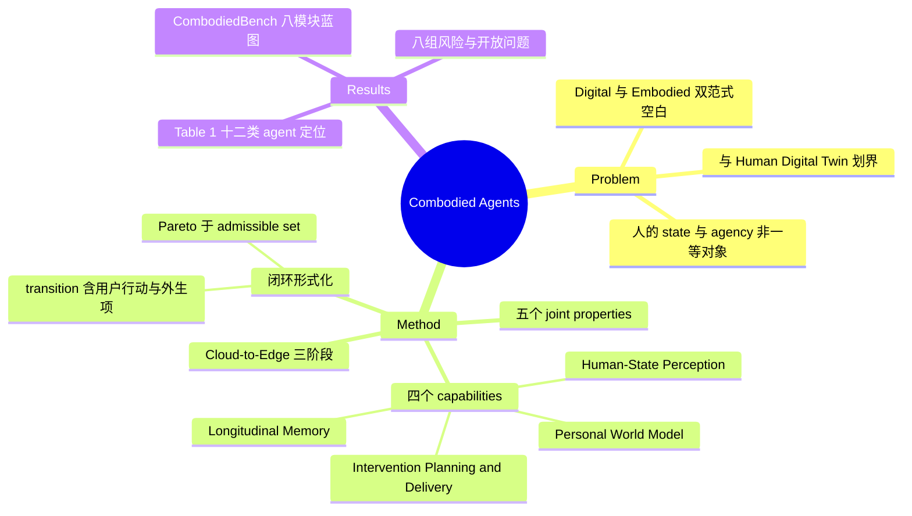

## Summary

22 位作者、16 机构（Mila 与 A*STAR 牵头）的 position paper，提出 Combodied Agents（Companion + Body 合成词）范式：把人的 evolving state 与 agency 作为建模、干预与评估的 primary object，并断言现有 Digital Agent（围绕 software-state transformations）与 Embodied Agent（围绕 physical-state transformations）均未覆盖此目标。框架由 Human-State Perception、Longitudinal Memory、Personal World Model（PWM）、Intervention Planning and Delivery 四个 capability 组成闭环，干预在 consent/safety/reversibility 约束的 admissible set 内做 Pareto 选择。全文为概念蓝图：提出 scenario-centered 的 CombodiedBench 评测框架，但无实现、无数据、无代码。

## Problem & Motivation

作者把现有 agentic AI 归为两条主线：Digital Agents（dialogue、tool-use、computer-use、workflow）围绕软件状态变换组织，Embodied Agents（navigation、manipulation）围绕物理状态变换组织；两者中工具、传感器、机器人是任务目标的载体。由此提出结构性空白："Neither paradigm makes the evolving state and agency of a person the primary object of modeling, intervention, and evaluation"——现有系统的 personalization 停留在浅层画像，memory assistant 存事实不建轨迹，companion agent 有情感连续性但有依赖风险（Table 1 逐类归纳）。因此优化目标应从 isolated task success 扩展为 "immediate benefit plus longitudinal human gain"。动机的另一半是与 Human Digital Twin 划界：作者承认 "a holistic, high-fidelity twin of a complete person remains an aspiration rather than a currently attainable system"，Combodied Agent 只维护 purpose-bounded、uncertainty-aware、user-correctable 的表征，不追求全人复刻。

## Method

**Definition 与范围（Sec 2.1-2.3）**。Definition 1 给出五个 joint properties：human-centric state modeling、longitudinality、intervention、co-agency、agency preservation。"Combodied" 由 Companion 与 Body 合成，但原文明确不指以对话或情感陪伴为主的第三方 companion，而是把人的身体、行为、认知、情绪与上下文作为主要感知与行动域。范式蕴含四个 connected capabilities：

- **Human-State Perception**：从多模态证据估计个人状态；
- **Longitudinal Memory**：Table 2 列 7 类记忆（episodic / semantic person / trajectory / goal / relationship / intervention-response / user-control memory）；
- **Personal World Modeling**：见下；
- **Intervention Planning and Delivery**：在 consent、uncertainty、safety、reversibility 约束下选择适度支持。

**闭环形式化（Sec 2.4）**。latent personal state 为后验 Z_t ~ q_φ(·|D_≤t, M_t, C_t)（D 为事件证据、M 为纵向记忆、C 为上下文）。关键设计是 human-state transition H_{t+1} ~ T_H(·|H_t, a_t^agent, a_t^user, Ξ_t) 显式包含用户自身行动与外生影响——agent 干预对人的状态不是决定性的。干预选择是 admissible set 上的 Pareto 优化 a* ∈ ParetoArgmax_{a∈A^adm} E[U]，效用 U 是保留 benefit、capability、autonomy、relationships 等维度显式 trade-off 的向量（不 scalarize），consent/safety/reversibility/escalation 做成硬约束而非 reward penalty。action space 固定 10 类（Table 3）：Inform、Remind、Recommend、Coach、Nudge、Reflect、Coordinate、Protect、Escalate、Execute。

**Event-based multimodal perception（Sec 3）**。8 类模态（language、speech、vision、physiology、motion、social、environmental、clinical records）各给出 acquisition configuration（Table 4），并单列 data quality/provenance/uncertainty 与 event-based fusion。

**Personal World Model（Sec 4）**。定义性功能契约是 "intervention-conditioned modeling of how this particular person's state–event trajectory may unfold under alternative scenarios"，输出对未来 state–event–outcome trajectories 的 calibrated distributions，以此与 user profile、memory、personalized/generative agents 区分（Table 5）。作者自陈边界：causal identification 依赖 consistency、positivity 等假设；个体级数据稀疏使 from-scratch 训练对多数用户不可行；年或寿命尺度的外推只能作为 exploratory scenarios；高风险系统不得为改进模型做无约束探索。

**Cloud-to-Edge 三阶段（Sec 5.2）**。Stage I cloud-centric：云端基座模型承担推理，设备只是 interface/sensor endpoint/execution surface；Stage II hybrid：edge 升级为 privacy/interpretation/authority mediator，承担隐私敏感感知、memory filtering、safety check 与 routing；Stage III edge-native：user-controlled edge model 成为 primary locus of personal intelligence，无需在云端重建用户。

## Key Results

Position paper，无实验；可交付物是概念对照与评测蓝图：

- **Table 1**：12 类现有 agent（Dialogue、Tool-Use、Computer-Use、Workflow、Embodied、Memory Assistants、Personalized、Companion、Health、Learning、Assistive Care、Edge AI）逐类归纳 limitation 与 Combodied 增量（如 Computer-Use Agents "may automate without human-state awareness"、Memory Assistants 存事实不建轨迹）。
- **CombodiedBench（Sec 6.4）**：提议的 modular suite，8 个模块——Human State Perception、Memory Continuity、Goal Negotiation、Intervention Appropriateness、Agency Preservation、Relationship Boundaries、Escalation、Longitudinal Outcomes。核心原则是 scenario-centered evaluation：scenario set 覆盖 non-intervention、clarification、不同干预 timing/强度、用户接受或拒绝；把用户保有与发展的东西（understanding、competence、agency、identity、calibrated reliance）作为与 task completion 并列的 outcome。**未发布任何数据集或评测代码**。
- **Sec 8** 列 8 组风险与开放问题：agency/alignment 风险（依赖、操纵、社会替代）、privacy 与 consent、弱势与高风险场景、longitudinal/causal learning、agency-aligned intervention、trusted personal infrastructure、多 agent 生态冲突、跨文化与全生命周期适配。

## Evidence Ledger

| Claim ID | Claim | Type | Source locator | Evidence excerpt | Status |
|:--|:--|:--|:--|:--|:--|
| C1 | Digital/Embodied 双范式均未把人的 evolving state 与 agency 作为建模、干预、评估的 primary object | comparison | Abstract; Sec 2.2 | "Neither paradigm makes the evolving state and agency of a person the primary object of modeling, intervention, and evaluation." | source-verified |
| C2 | Table 1 对比恰 12 类现有 agent，逐类给 limitation 与 Combodied 增量 | comparison | Table 1（Sec 1，12 行） | "Dialogue Agents; Tool-Use Agents; …; Assistive Care Agents; Edge AI Agents" | source-verified |
| C3 | 定义含五个 joint properties 与四个 connected capabilities（原文名 Personal World Modeling、Intervention Planning and Delivery） | number | Sec 2.1; Sec 2.3 | "The definition establishes five jointly important properties" / "implies four connected capabilities" | source-verified |
| C4 | 与 HDT 划界：不要求 exhaustive replica，维护 purpose-bounded/uncertainty-aware/user-correctable 表征；全人高保真 twin 被认定不可达 | sota-novelty | Sec 1（Introduction HDT 段）; Abstract | "A holistic, high-fidelity twin of a complete person remains an aspiration rather than a currently attainable system." | source-verified |
| C5 | 闭环形式化：latent state 后验条件于证据/记忆/上下文；transition 显式含用户行动与外生影响；干预为 admissible set 上 Pareto 优化 | causal-mechanism | Sec 2.4 Eqs. 2 & 4; Sec 4.2 | "It also depends on the person's own actions, contextual changes, and exogenous influences" | source-verified |
| C6 | CombodiedBench 为提议的 8 模块蓝图（scenario-centered + agency preservation），未发布数据集或代码 | benchmark-setting | Sec 6.2-6.4; Sec 4.2（scenario 列表） | "We propose CombodiedBench as a modular suite spanning Human State Perception, Memory Continuity, Goal Negotiation, Intervention Appropriateness, Agency Preservation, Relationship Boundaries, Escalation…" | source-verified |
| C7 | Cloud-to-Edge 演化分三阶段：cloud-centric、hybrid（edge 为 privacy/interpretation/authority mediator）、edge-native | number | Sec 5.2.1-5.2.3; Fig. 4 | "Stage III makes a user-controlled edge model the primary locus of personal intelligence" | source-verified |
| C8 | action space 恰 10 类：Inform、Remind、Recommend、Coach、Nudge、Reflect、Coordinate、Protect、Escalate、Execute | number | Table 3（Sec 2.4） | "Inform; Remind; Recommend; Coach; Nudge; Reflect; Coordinate; Protect; Escalate; Execute" | source-verified |
| C9 | "Combodied" 由 Companion 与 Body 合成，且明确不指以对话/情感陪伴为主的第三方 companion | sota-novelty | Sec 2.1, Definition 1 | "The term Combodied combines Companion and Body, but does not imply a third-party companion whose primary role is conversation or emotional companionship." | source-verified |
| C10 | 论文无公开代码库或 project 链接（正文与 abs 页均无；github 出现仅为参考文献） | license-code | 全文扫描; abs 页 Comments | "Comments: 38 pages, 6 figures, 10 tables" | source-verified |

## Strengths & Weaknesses

**亮点**：

- Problem formulation 干净：digital states / physical states / human states 三个 action substrates 的划分（Fig. 1）把 gap 陈述得可检验，比笼统喊 "human-centric AI" 的同类文章清晰。
- 形式化里有几个诚实的设计选择：human-state transition 显式包含 a^user 与外生项（承认 agent 干预非决定性）；效用保持多维向量不 scalarize；consent/safety/reversibility 做成 admissible set 硬约束而非 reward penalty。这比常见 "RLHF for wellbeing" 表述严谨。
- 自我限界做得好：明确承认 HDT 不可达、PWM 的 causal identification 假设难满足、长程外推只能当 exploratory scenario——position paper 里少见的克制。

**局限**：

- 全文是 blueprint：PWM 如何在个体级稀疏、非实验性观察数据上学到 intervention-conditioned dynamics，论文列出了困难但没有给出可行路径；CombodiedBench 无数据无代码，agency-preservation metrics（如 calibrated reliance）没有可操作化定义。范式是否成立取决于有没有人真做出一个 PWM，当前形态接近不可证伪的宏观框架。
- Table 1 的 12 类 taxonomy 与 limitation 归纳是作者自建的先验分类学，有 strawman 成分——如 Computer-Use Agents "may automate without human-state awareness" 是设计范围差异而非缺陷；范式边界主要靠 declarative 区分而非实证。
- （评价，非论文断言）对个人状态的感知与适时干预在 affective computing 与 mobile health 的 just-in-time adaptive intervention 脉络中已有长期积累；本文的增量更多是把这些统一进 agentic AI 的语汇与闭环架构，而非新机制。

**潜在影响**：为 personal agent 方向提供了一套设计词表（admissible intervention、agency preservation、PWM）与评测视角；agency preservation 作为一等 metric 的主张，对 GUI/computer-use agent 的 oversight 与 mixed-initiative 研究也有借鉴价值。

## Mind Map

## Notes

- 与 [[2608-MacaronV1]] 互补定位：Macaron 是 personal agent 的工程与产品侧技术报告（自建 Personal Intelligence benchmark），本文是概念框架与评测蓝图侧，无实现。
- PWM 与 world-model 文献的接口同构：把 world model 的建模对象从环境换成"人"，功能契约（intervention-conditioned trajectory distribution）与 action-conditioned prediction 一致；可与 [[Topics/WorldModel-Survey]] 的 controllability 议题对照。
- 来源：HF Daily 高赞。作者阵容大（22 人 16 机构）但为松散联盟型署名，后续是否有 CombodiedBench 落地值得跟踪。
