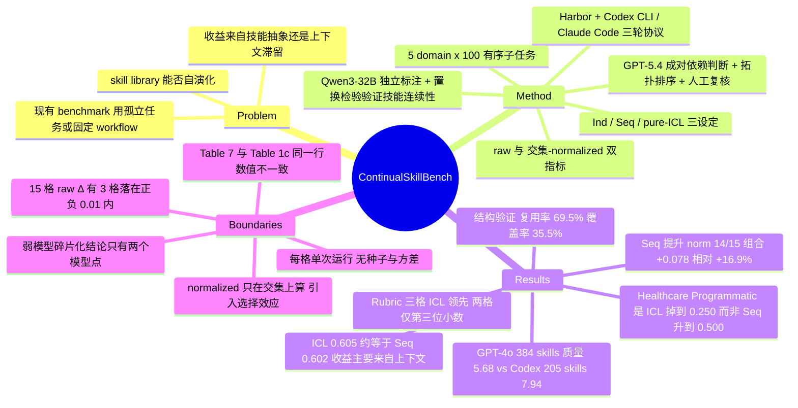

## Summary

ContinualSkillBench 把 agent 的 skill 自演化放进「5 个 domain × 100 个按技能依赖排序的连续子任务」中评测，对比每题从零开始的 Independent baseline。Sequential 执行在 15 个 model–domain 组合中的 14 个提升 normalized reward（宏平均 +0.078，相对 +16.9%），但关键消融显示纯 in-context learning 与显式 skill 维护几乎持平（0.605 vs 0.602），说明大部分收益来自保留上下文与评测反馈，而非可复用的技能抽象。

## Problem & Motivation

Claude Code、Codex 这类主流 agent 平台已把「agent skill」（结构化的 Markdown 过程性文档）做成一等公民，且已有工作显示人工撰写的高质量 skill 能显著提升对应任务表现。但人工构建覆盖完整的 skill library 昂贵且不可扩展，因此真正的问题是：**在只给任务描述与反馈的现实设定下，agent 能不能自己合成并演化 skill？**

作者指出现有评测无法回答这个问题——它们要么在孤立任务上测固定 skill 文档（SkillsBench），要么围绕单一重复任务或固定 workflow 评测 skill 生成（SkillLearnBench、SkillCraft），缺少「长序列、异质任务流、跨任务技能复用」这一组合。更关键的隐含疑问是：即使 sequential 执行确实变好了，收益到底来自**显式的技能抽象**，还是仅仅来自**上下文与反馈的滞留**？后者用不着 skill library 这套机制。ContinualSkillBench 的设计目标就是让这两者可分离。

## Method

**benchmark 构造（三阶段）**

1. **三层难度来源池**：五个 domain（Healthcare / Law / Mathematics / Finance / Office），每个从三个层级取题——基础层用经典数据集（OlympiadBench、LawBench、TAT-QA、LegalBench、FinBen、HealthBench 等），中高层用 agent 数据集（GAIA、ClawBench、MedAgentsBench、MathCoder），最难层用人评复杂 benchmark（OneMillionBench）。Figure 1 标注 Phase 1 收集约 3 万条候选任务（该数字取自图注，**未经独立复核**，见 C30）。
2. **技能链过滤与排序**：先用 LLM 标注每题所需 skill 并给初始难度；再对每个 domain 从 100 条过滤后任务中采样 200 个无序对，双向询问 GPT-5.4「做完 A 是否给 B 提供可用技能」（YES / PARTIAL / NO），每 domain 得 400 条有向判断，只有 YES 进依赖图；然后在难度 curriculum 约束下用贪心 Kahn 拓扑排序（每步选入度为 0 中出度最大者，成环则取剩余出度最大者），跨层反向边先删除；最后人工复核。
3. **结构性验证**：用本地 Qwen3-32B（vLLM，temperature 0，seed 42，关 thinking）**独立于序列位置**标注每题的 core skill，用 all-mpnet-base-v2 编码后以 cosine ≥ 0.85 判定语义同义，统计「任务复用率」与「core-skill 历史覆盖率」，并与 10,000 次随机置换做单侧 permutation test（Holm 校正）。

**评测协议**

- 四类 evaluator：Exact Match / token-level F1、Numeric（容差 ε ≤ 10⁻⁴）、Rubric Judge（LLM 按预设 rubric 加权打分）、Programmatic（可执行测试检查产物文件与环境状态）；GAIA、ClawBench 沿用官方 evaluator。
- 运行框架建在 **Harbor** 上，扩展出两套 sequential harness，分别基于 **Codex CLI** 与 **Claude Code**。每个子任务走**三轮协议**：Turn 1 给任务 + 当前 skill 索引；Turn 2 执行；Turn 3 读取 judge 反馈文件，用 `create-skill` / `modify-skill` 两个 meta-skill 增改 skill 库，更新从下一子任务起生效。非首个子任务会额外注入 `/root/task_memory.md` 的前序上下文与 judge 反馈提示。
- 三种设定：**Independent**（每题前重置历史与 skill 库）、**Sequential**（保留并演化 skill 库）、**pure ICL**（同样保留序列上下文与反馈，但**禁止**增改 skill）。ICL 这一支是全文最关键的对照。
- 两个指标：`R_raw` 为全部 100 题均分；`R̃_norm` **只在 Sequential 与 Independent 两侧都产出有效输出文件的交集子集上计算**；Δ 为二者之差。

## Key Results

**主结果（Table 1，3 model × 5 domain）**

- Sequential 相对 Independent 提升 raw reward 于 13/15 组合、normalized reward 于 14/15；宏平均 Δ_raw = +0.071（相对 +16.2%），Δ_norm = +0.078（相对 +16.9%）。
- 按模型：GPT-5.3-Codex +0.098 > GPT-4o +0.077 > Claude 4.7 Opus +0.058。作者强调这个排序不随 Independent baseline 强弱走——Opus 4.7 的 Independent 最强却增益最小。
- 按 domain：Healthcare +0.149 ≫ Finance +0.076 > Law +0.058 > Office +0.054 > Math +0.052。唯一的 normalized 下降是 Opus 4.7 在 Mathematics 上的 −0.008。
- **两个 raw 下降格分别是 GPT-4o × Law（−0.006）与 Opus 4.7 × Mathematics（−0.008）；全部 15 格 raw Δ 中有 3 格落在 ±0.01 内**（C28）。
- evaluator 类型差异明显：GPT-5.3-Codex 在 Finance 的 Numeric +0.416、Exact Match +0.091，而 Rubric 仅 +0.038；但不普适——Opus 4.7 在 Healthcare 的 Rubric +0.234，在 Mathematics 的 Rubric 却 −0.192。（本行四个子项数值取自 §4.2 正文，**本轮独立复核未覆盖**，见 C29。）

**关键消融：显式 skill 维护 vs 纯 ICL（Table 2，仅 GPT-5.3-Codex，仅 Law/Finance/Healthcare）**

三个 domain 平均 normalized reward：Independent 0.466 → ICL **0.605** → Sequential **0.602**。即 Sequential 相对 Independent 的 +0.136 里，几乎全部由「保留上下文与反馈」解释，显式 skill 库的净贡献在总量上不可分辨。

论文用两条子项差异去论证二者「结构不同」，但复核后这两条都比正文读起来更弱：

- **Rubric：ICL 在三个 domain 全部更高，但两个 domain 的领先在第三位小数上。** Law 0.309 / 0.330 / 0.319（ICL−Seq = **+0.011**），Finance 0.404 / 0.444 / 0.442（**+0.002**），Healthcare 0.396 / 0.596 / 0.521（**+0.075**）（C26）。三格中只有 Healthcare 的差值离开了噪声量级。
- **Programmatic：论文说的「显式 skill 把 Healthcare 从 0.250 提到 0.500」，实际是 ICL 跌破基线而非 Sequential 超出基线。** 该格 Independent = 0.500、ICL = 0.250、Sequential = 0.500（C27）——Sequential 与 Independent 完全相等。Law 同形（Ind 0.800 / ICL 0.900 / Seq 0.800），Finance 是唯一 Seq 超过 Independent 的 domain，且只与 ICL 打平（0.800 / 0.900 / 0.900）。论文未披露这个对比的参照系是 ICL 而非 Independent。

**skill 库形态（Figure 3 + Appendix G Table 8，仅 GPT-4o vs GPT-5.3-Codex）**

GPT-4o 五个 domain 共生成 384 条 skill，GPT-4.1-mini judge 的平均质量分 5.68；GPT-5.3-Codex 只生成 205 条，平均分 7.94，且后续任务中被调用的频率更高。作者据此提出「弱模型倾向于沉淀碎片化、任务专用的 skill，库越涨越大但下游效用不成比例」。

**结构性验证（Appendix C）**

τ = 0.85 下宏平均任务复用率 69.5%、core-skill 历史覆盖率 35.5%，覆盖率区间为 Healthcare 23.2% 至 Office 46.2%（C12）。curated 顺序在全部 15 个 domain–window 组合上覆盖率都高于随机置换，Holm 校正后 10 个显著（C13）。阈值敏感性：exact name 匹配 59.6%/26.7%，cosine ≥0.80 为 79.4%/44.5%，≥0.90 为 63.8%/29.4%（C16）。另有若干细节数字（各 domain 的复用率、Finance 在 w=1/5/10 上的置换差、Mathematics 三窗口均不显著）**本轮独立复核未覆盖**，见 C30。

**RAG 消融（Appendix F，仅 Opus 4.7 × Healthcare）**：检索历史轨迹片段的 RAG 基线 raw 0.574 / norm 0.617，低于 Sequential 的 0.631 / 0.635；RAG 在 Rubric 更高（0.539 vs 0.517）、Exact Match 更低（0.815 vs 0.926）——与 ICL 消融同构。

## Evidence Ledger

> C1–C28 由两名独立 verifier（均非本笔记作者）对 arXiv 全文逐条定位核对，全部 `source-verified`，无 unsupported / contradicted。`source-verified` 仅表示 primary source 确实包含该信息，**不表示结果已被独立复现**。C29–C30 未纳入任一轮 claim package，保持 `not-checkable`，正文已就地标注边界。

| Claim ID | Claim | Type | Source locator | Evidence excerpt | Status |
|:--|:--|:--|:--|:--|:--|
| C1 | 5 个 domain（Healthcare/Law/Mathematics/Finance/Office），每个 100 个按难度递增排序的互联子任务 | benchmark-setting | Abstract；§3.1 Domain Selection | "each containing 100 interconnected subtasks ordered by increasing difficulty" | source-verified（"共 500 题"为 5×100 的算术推得，非原文字面表述） |
| C2 | 评测 GPT-4o、GPT-5.3-Codex、Claude 4.7 Opus；harness 基于 Codex CLI 与 Claude Code，构建在 Harbor 上 | benchmark-setting | §3.5；§4.1.1 | "two sequential agent harnesses based on Codex CLI and Claude Code" | source-verified |
| C3 | Sequential 提升 raw reward 于 13/15、normalized reward 于 14/15 组合 | number | §4.2 | "increases raw reward in 13 of the 15 model–domain combinations and normalized reward in 14 of 15" | source-verified |
| C4 | 宏平均 Δ_raw +0.071（相对 +16.2%）、Δ_norm +0.078（相对 +16.9%） | number | §4.2 | "+0.071 in raw reward and +0.078 in normalized reward… improvements of 16.2% and 16.9%" | source-verified |
| C5 | 模型级 Δ_norm：GPT-5.3-Codex +0.098 > GPT-4o +0.077 > Opus 4.7 +0.058 | number | §4.2 | "GPT-5.3-Codex obtains the largest average normalized improvement (+0.098), followed by GPT-4o (+0.077) and Opus 4.7 (+0.058)" | source-verified |
| C6 | 唯一 normalized 下降为 Opus 4.7 × Mathematics，−0.008 | number | §4.2；Table 1(c) | "The only decrease in normalized reward occurs for Opus 4.7 on Mathematics (−0.008)." | source-verified |
| C7 | domain 级 Δ_norm：Healthcare +0.149 / Finance +0.076 / Law +0.058 / Office +0.054 / Math +0.052 | number | §4.2 | "Healthcare… (+0.149)… Finance, Law, Office, and Mathematics are +0.076, +0.058, +0.054, and +0.052" | source-verified |
| C8 | ICL 消融（GPT-5.3-Codex，Law/Finance/Healthcare）平均 norm：Ind 0.466 / ICL 0.605 / Seq 0.602 | number | §4.3；Table 2 | "the average normalized rewards of Independent, ICL, and skill-maintaining Sequential execution are 0.466, 0.605, and 0.602" | source-verified |
| C9 | ICL 在三个 domain 的 Rubric 分全部更高；显式 skill 使 Healthcare 的 Programmatic 从 0.250 变为 0.500 | comparison | §4.3；Table 2 | "increase Programmatic performance in Healthcare from 0.250 to 0.500, whereas ICL obtains higher Rubric scores in all three domains" | source-verified（原文表述成立，但参照系与幅度的解读边界见 C26/C27） |
| C10 | GPT-4o 384 skills / 平均质量 5.68 vs GPT-5.3-Codex 205 skills / 7.94；质量由 GPT-4.1-mini judge 按 score=format×content 打分 | number | Appendix G；Table 8 | "GPT-4o produces a much larger number of skills across domains (384 in total), but their average quality score is substantially lower (5.68)" | source-verified |
| C11 | normalized reward 只在 Sequential 与 Independent 两侧都产出有效输出文件的交集子集上计算 | benchmark-setting | §4.2 Aggregate Metrics 段 | "computed exclusively on the intersection subset of tasks where both the Sequential and Independent settings successfully generate valid output files" | source-verified |
| C12 | 结构验证 τ=0.85：宏平均任务复用率 69.5%、core-skill 覆盖率 35.5%；Healthcare 最低 23.2%，Office 最高 46.2% | number | §3.3；Appendix C.3；Table 5 | "the task reuse rate is 69.5%, and the mean core-skill coverage is 35.5%"；"ranges from 23.2% in Healthcare to 46.2% in Office" | source-verified |
| C13 | curated 顺序在 15/15 domain–window 组合上优于随机置换，但 Holm 校正后仅 10 个显著 | number | Appendix C.4 | "positive in all 15 domain–window comparisons and remains significant after Holm correction in ten comparisons" | source-verified |
| C14 | 任务排序由 GPT-5.4 的成对技能迁移判断（每 domain 200 对 → 400 有向判断）建图后拓扑排序，再人工复核 | benchmark-setting | §3.2；Appendix B.1/B.2；Table 4 | "we sample 200 unordered pairs… producing 400 directional judgments per domain"；"the LLM (specifically GPT-5.4)" | source-verified |
| C15 | core-skill 标注用本地部署的 Qwen3-32B + all-mpnet-base-v2，且标注时不给出任务的序列位置 | benchmark-setting | Appendix C.1 | "We use a locally served Qwen3-32B model as the skill annotator."；"It does not receive the task's sequence position" | source-verified |
| C16 | 复用率对匹配规则高度敏感：exact 59.6%/26.7%，cosine ≥0.80 为 79.4%/44.5%，≥0.90 为 63.8%/29.4% | number | Appendix C.5；Table 6 | "Exact name 59.6 26.7 / Cosine ≥0.80 79.4 44.5 / Cosine ≥0.85 69.5 35.5 / Cosine ≥0.90 63.8 29.4" | source-verified |
| C17 | RAG 消融仅在 Opus 4.7 × Healthcare 上做：RAG raw 0.574 / norm 0.617 vs Seq 0.631 / 0.635 | number | Appendix F；Table 7 | "Healthcare RAG 0.815 0.500 0.539 0.574 0.617 Seq. 0.926 0.500 0.517 0.631 0.635" | source-verified |
| C18 | Table 7 的 Opus × Healthcare Seq 行与 Table 1(c) 同一行数值不一致（EM 0.926 vs 0.929、Rubric 0.517 vs 0.516、norm 0.635 vs 0.662；Prog 与 raw 一致） | number | Table 1(c) vs Table 7 | Table 1(c) "0.929 … 0.500 0.516 0.631 0.662"；Table 7 "0.926 0.500 0.517 0.631 0.635" | source-verified |
| C19 | 主实验（Table 1/2/7）未报告重复运行、随机种子、方差、置信区间或误差棒 | benchmark-setting | 全文检索；唯二命中在 Appendix C.1/C.4 | "We use temperature 0 and random seed 42"（标注器）；"randomly permute the 100 tasks 10,000 times"（构造分析） | source-verified |
| C20 | Limitations 承认任务源固定、模型与 harness 覆盖有限（未覆盖其他 Claude/GPT/Gemini 变体，未适配 Cursor / Google CLI） | benchmark-setting | Limitations | "We do not exhaustively cover additional Claude, GPT, or Gemini variants, nor… Cursor or Google CLI." | source-verified |
| C21 | 代码地址为 github.com/gtynnn060110-hash/continual-skill-bench-final | license-code | 标题脚注 | "Source code: https://github.com/gtynnn060110-hash/continual-skill-bench-final." | source-verified（仅核对链接存在于原文，**未验证 repo 内容或可访问性**） |
| C22 | 作者机构为 Peking University Institute for AI 与 BIGAI；arXiv 提交日为 2026-08-04 | benchmark-setting | 标题块；arXiv abs 页 | "1Institute for Artificial Intelligence, Peking University 2Beijing Institute for General Artificial Intelligence" | source-verified |
| C23 | 全文未报告各 evaluator 类型在每个 domain 的题目数，故 +0.583 / −0.500 这类子项 Δ 的样本量未知 | benchmark-setting | §3.4、Table 1、Table 3 及全部附录均无该计数 | Table 1(a) Math Seq. "0.583 (+0.583)"；Table 1(b) Office Seq. EM "0.500 (-0.500)" | source-verified |
| C24 | 相关工作定位：区别于 SkillsBench / SkillLearnBench / CL-Bench / SkillCraft，在于长而异质的任务流 | sota-novelty | §2 | "studying skill evolution over long, heterogeneous task streams… rather than a single repeated task or a fixed execution workflow" | source-verified |
| C25 | GPT-4o × Law 一格 raw Δ −0.006 而 normalized Δ +0.070（两指标反号）；该格仅 EM +0.050 与 Rubric −0.051 两列变动 | number | Table 1(a), GPT-4o Law 行 | "Ind. 0.500 - - 0.300 0.111 0.286 0.325 / Law Seq. 0.550 (+0.050) … 0.060 (-0.051) 0.280 (-0.006) 0.395 (+0.070)" | source-verified |
| C26 | Table 2 Rubric（Ind / ICL / Seq）：Law 0.309 / 0.330 / 0.319，Finance 0.404 / 0.444 / 0.442，Healthcare 0.396 / 0.596 / 0.521；ICL−Seq 依次为 +0.011 / +0.002 / +0.075 | number | Table 2, Rubric 列 | "Law Ind. 0.309 ICL 0.330 Seq. 0.319; Finance 0.404 / 0.444 / 0.442; Healthcare 0.396 / 0.596 / 0.521" | source-verified |
| C27 | Table 2 Programmatic：Healthcare Ind 0.500 / ICL 0.250 / Seq 0.500（Seq 与 Ind 相等）；Law 0.800 / 0.900 / 0.800；Finance 0.800 / 0.900 / 0.900 | number | Table 2, Prog. 列 | "Healthcare Ind. … 0.500 … ICL … 0.250 … Seq. … 0.500" | source-verified |
| C28 | 全部 15 格 raw Δ：GPT-4o Law −0.006 / Finance +0.050 / Healthcare +0.127 / Office +0.077 / Math +0.100；Codex +0.044 / +0.060 / +0.235 / +0.005 / +0.075；Opus +0.039 / +0.028 / +0.209 / +0.035 / −0.008。恰两负，三格落在 ±0.01 内 | number | Table 1(a)(b)(c), Raw 列 | Law Seq. "0.280 (-0.006)"（GPT-4o）；Math Seq. "0.652 (-0.008)"（Opus 4.7） | source-verified |
| C29 | evaluator 类型分解的四个子项 Δ：Codex×Finance 的 Numeric +0.416 / EM +0.091 / Rubric +0.038，Opus×Healthcare Rubric +0.234，Opus×Math Rubric −0.192 | number | §4.2 "Improvements also depend on the evaluator type" | — | **not-checkable**（未纳入任一轮 verifier 的 claim package）；Key Results 中已就地标注边界 |
| C30 | 结构验证的细节数字：各 domain 任务复用率（Office 77.8% / Healthcare 63.6%）、Finance 置换差 +5.6/+5.1/+3.9pp、Mathematics 三窗口均不显著、Phase 1 约 3 万条候选任务 | number | Appendix C.3/C.4；Figure 1 图注 | — | **not-checkable**（未纳入任一轮 verifier 的 claim package）；正文已就地标注边界 |

> 追加核实说明：Table 2 的 Ind. 与 Seq. 三行与 Table 1(b) 中 GPT-5.3-Codex 的对应行逐格一致，列均值也复现出 §4.3 的 0.466 / 0.605 / 0.602——即 Table 2 与主表内部自洽，C18 的 Table 7 vs Table 1(c) 不一致是孤例。

## Strengths & Weaknesses

**Strengths**

1. **问对了问题，并且设计使之可分离。** 这篇最有价值的不是那个 +16.9%，而是把「Sequential 变好」拆成「上下文滞留」与「显式技能抽象」两项并给出对照。整个 self-evolving agents 文献里绝大多数工作报告的是 Sequential 对 Independent 的差，那个差**天然把两者混在一起**；这篇给出的 0.605 vs 0.602 直接说明：至少在这套 benchmark 上，skill library 这套机制在总量上没有超出「把上一题的反馈留在上下文里」。这是一个可以被引用的负性结果。
2. **structural validation 做得比同类 benchmark 认真。** 排序本身是 LLM 造的，作者没有把它当既成事实，而是用**另一个不看序列位置的标注器 + 语义匹配 + 10,000 次置换检验**去验证「相邻任务确实共享技能」，并报了阈值敏感性和 Holm 校正后不显著的那 5 个组合。相比多数 benchmark 直接宣称「我们的任务是有依赖的」，这是明显更高的标准。
3. **收益结构这条线索方向对，但论文给出的证据比它自己以为的弱。** 「显式 skill 强在刚性输出、ICL 强在开放输出」这个解读若成立，会把 skill library 的定位从「能力扩展器」改写为「输出格式与流程的约束器」——这比标题里的「Can agents truly evolve」具体得多，也更可操作。Appendix F 的 RAG 消融独立复现了同一模式（RAG 的 Rubric 更高、EM 更低）（C17），是该方向的第二处证据。但主证据经复核后大幅缩水：Rubric 三格里两格的领先只有 +0.011 与 +0.002（C26），Programmatic 那格的 Sequential 其实只是**持平 Independent**（C27）。所以这条应当作为待验假设保留，而不是当作本文已建立的结论引用。

**Weaknesses**

1. **主表每格只有一条轨迹，没有任何方差估计。** 全文未报告重复运行、随机种子、置信区间或误差棒——Appendix C 的 seed 42 与 10,000 次置换属于 benchmark 构造分析，不是主实验（C19）。在这个前提下，论文写进 Findings 的部分结论落在噪声量级内：唯一的 normalized 负结果 Opus 4.7 × Math 是 **−0.008**（C6），15 格 raw Δ 里有 3 格落在 ±0.01 内（C28），这个量级的单次差值不足以支撑「该模型在数学上无法从经验受益」这类读法，而论文正是把它作为一个 finding 报道的。核心论断「ICL ≈ Seq」不受此影响——0.605 vs 0.602 差异极小恰恰说明二者不可分辨（C8）。
2. **normalized reward 的定义引入了选择效应，而它恰好是唯一支撑「14/15」的指标。** `R̃_norm` 只在两种设定都产出有效输出的交集上算（C11），这等于**把两侧任一失败的任务从分母里删掉**。这个选择效应在 GPT-4o × Law 一格上可以直接看到：raw Δ = −0.006 而 normalized Δ = +0.070，符号相反（C25）。更值得注意的是它的成因——该格只有 EM（+0.050）与 Rubric（−0.051）两列发生变动，**符号翻转完全由交集筛选决定了哪些任务计入分母，没有任何子项指标改变方向**。作者选 normalized 报道主结论有合理的偏差控制动机，但全文没有报告交集子集的大小，读者无法判断被剔除的任务是否恰好是 Sequential 失败更多的那批。这是全文我最想看到而没有的一张表。
3. **「弱模型碎片化」这个结论的样本量是 2。** Figure 3 与 Table 8 只覆盖 GPT-4o 与 GPT-5.3-Codex，Claude 4.7 Opus 被完全排除在 skill 库统计之外。也就是说「模型越弱 → skill 越碎 → 长期收益越差」这条因果链，是在**两个点**上拟合出来的，而且这两点还同时在模型代际（2024 vs 2026）与能力上有差；GPT-4o 作为 2026 年论文里的「弱模型」代表本身也偏离当前部署现实。质量分本身也依赖 GPT-4.1-mini 的 rubric 打分，论文没有给出该分数与实际下游效用的相关性证据——而作者自己在 Figure 3 的说明里已经承认这类统计「do not directly establish skill utility」。
4. **Table 2 有一处叙述把参照系换掉了，读起来像增益其实不是。** 论文写「显式 skill 把 Healthcare 的 Programmatic 从 0.250 提到 0.500」（C9），但这个对比的另一端是 ICL 而非 Independent：该格 Independent 就是 0.500，Sequential 也是 0.500，ICL 才是掉到 0.250 的那个（C27）。真实情况是**ICL 把 Programmatic 拉低了一半，而显式 skill 只是没有掉下去**，论文把一次 regression 的避免写成了增益，且没有披露参照系的切换。Law 同形（Seq = Ind = 0.800 < ICL 0.900），Finance 是三个 domain 里唯一 Seq 超过 Independent 的，还只与 ICL 打平。这不推翻「skill 有助于刚性输出」的方向，但把它的证据基础从「三个 domain 一致」削到「一个 domain 部分成立」。
5. **任务依赖结构是模型构造的，验证也是模型做的。** 排序来自 GPT-5.4 的成对判断，core-skill 标注来自 Qwen3-32B，语义等价来自 all-mpnet-base-v2 的 0.85 阈值。作者做了两件对的事（标注器不看序列位置、报阈值敏感性），但 Table 6 显示复用率在 59.6%（exact）到 79.4%（≥0.80）之间大幅摆动——「技能确实在复用」这个前提的强度取决于一个没有外部锚点的超参。
6. **子项 Δ 的分母未知。** 论文没有报告每个 domain 里各 evaluator 类型各占多少题，因此 GPT-4o × Math 的 Programmatic +0.583、GPT-5.3-Codex × Office 的 Exact Match −0.500 这类极端数字无法判断是几道题的翻转（C23）。这些数字被写进了正文的 evaluator-类型分析，但读者无法给它们赋予合适的权重。
7. **污染风险未讨论。** 题目全部来自公开 benchmark（AIME、GAIA、LegalBench、OlympiadBench 等），论文未提及去污染检查。这对 Independent baseline 的绝对值影响大于对 Δ 的影响，但在 Office / Math 这些 Independent 子项已接近 1.000 的格子上，天花板效应会直接压缩可观测的 Δ。
8. **两张表里同一条实验的数字对不上。** Table 1(c) 的 Opus 4.7 × Healthcare Sequential 行是 EM 0.929 / Rubric 0.516 / raw 0.631 / norm 0.662，而 Appendix F Table 7 同一设定同一 domain 的 Seq 行是 EM 0.926 / Rubric 0.517 / raw 0.631 / norm 0.635（C18）。raw 与 Programmatic 一致而 EM、Rubric、normalized 三项不一致，最可能的解释是 Table 7 用了另一次运行或另一个交集子集（normalized 的定义确实依赖对照组，换成 RAG 对照后交集会变），但论文没有任何说明。norm 差 0.027 与论文报道的多数 Δ 同量级——这恰好从侧面量化了第 1 条所说的运行间/口径间波动。作为对照，Table 2 与 Table 1(b) 逐格一致，说明这是孤立的口径问题而非系统性错误。

**对领域的意义**

这篇的位置很清楚：它是 self-evolving agents 这条线上**继「预算不对称」之后的第二类证伪**。[[2606-SkillMemoryBudget]] 说明 online skill/memory 的收益很大程度来自 token 预算不匹配；这篇说明即使预算与反馈都对齐，显式 skill 抽象相对纯上下文滞留仍然没有可分辨的总量增益。两者合起来，把「skill library 有用」这个默认假设的举证责任重新推回给了提出方——今后任何 skill-evolution 工作都应该被要求提供 pure-ICL 对照，正如今天任何 RAG 工作都被要求提供 long-context 对照。

它也给出了一个值得后续验证的替代假设：skill 文件的作用域可能主要在**输出契约与执行纪律**（格式、归一化、逐步校验），而非知识或策略的扩展。若成立，skill library 的正确评测轴就不是 task success rate，而是**在刚性约束任务上的失败率下降与跨任务一致性**——这恰好也是 [[2606-SkillNb]] 用 gated execution 打的那个点。但必须强调：本文提供的直接证据不足以确立这个假设（见 Strengths 3 与 Weaknesses 4），它目前的地位是一个由弱证据 + 一次同向 RAG 消融支撑的方向性猜想。

## Mind Map

## Connections

- [[2606-SkillMemoryBudget]] — 最直接的同类证伪。它控预算，本文控「是否允许写 skill」；两者从不同轴指向同一结论：online skill/memory 模块的表面收益大多不是能力增益。合起来构成 skill-library 有效性的双重反证。
- [[Harness-Component-Attribution]] — 该 topic 的核心结论是 harness 组件不是可加的能力增量而是条件性失败修复。本文的 evaluator-类型分解（刚性输出受益、开放输出反受损）是这一判断在 skill 维度上的新证据，但强度有限，见 Weaknesses 4。
- [[SelfEvolvingAgents-Survey]] — 本文应进入 survey 的负性结果 / 评测方法学部分：它给出了该领域目前最干净的「显式演化 vs 上下文滞留」对照设计。
- [[2508-StuLife]] — 同为连续 stateful 任务序列的 lifelong benchmark，但把瓶颈归因到记忆管理与 proactivity；本文的 ICL 对照恰好对 StuLife 那类「加记忆就好了」的推论提出了反向压力。
- [[2604-SkillClaw]]、[[2607-MetaSkillEvolve]]、[[2602-MemSkill]] — 均属「让 skill / memory 自演化」的方法侧工作，且均以 Sequential-vs-Independent 或 baseline 差报告收益。本文的消融意味着它们的增益中有多少来自显式演化机制本身仍是未决问题。
- [[2606-SkillNb]] — 用 gated execution 把 skill 的价值定位在可靠性而非成功率；与本文「skill 更像输出契约约束器」的解读同向。
- [[2608-SkillJack]] — 同日消化。它给出 skill library 的安全代价（经验→skill 抽取会漂白恶意信号、删源后 80% 存活），本文给出效用侧的空账。两篇合看，「是否值得引入 skill library」的默认答案应当比现状更保守。

## Notes

- **最值得追的口子**：论文只在 GPT-5.3-Codex × 3 domain 上跑了 pure-ICL 对照。如果把这条对照扩到全部 3 model × 5 domain，并且报告交集子集大小，这个 benchmark 的结论强度会有质变。目前 ICL≈Seq 这个核心论断的支撑面是 3/15。
- **一个可做的实验**：论文暗示 skill 的作用是「输出契约约束」。可以直接检验——把 skill 库的内容按 Appendix G 的 8 个 content 指标分类（procedure / verification / anti-pitfall / toolability …），看哪一类指标的存在与该 skill 被调用后的 Δ 相关。如果 verification 与 procedure 类显著而 domain_grounding 类不显著，就把「skill 是执行纪律而非知识扩展」从解读升级成实证。
- **待核实（外部）**：code 链接的 GitHub 账号名（`gtynnn060110-hash`）形态上像临时/匿名账号，长期可用性存疑；引用该 repo 前应重新确认可访问。本轮只核实了该链接确实印在论文标题脚注里，未访问 repo。
- **仍未核实（C29 / C30）**：§4.2 的 evaluator-类型子项 Δ（Numeric +0.416、Rubric −0.192 等）与 Appendix C 的结构验证细节数字未纳入任一轮 claim package。下次触碰本笔记时可补齐，但这两组都不承载主结论。
- **skill 质量分的量纲论文未明说**：Appendix G 定义 score = format × content，其中 format 是 4 个 0/1 指标、content 是 8 个 0/0.5/1 指标，但没写这两项各自如何聚合。5.68 与 7.94 若按「format 取均值 × content 取和」读则是 8 分制，这个反推未经原文确认，跨论文引用该分数时不要当作标准化指标。
- **tag 说明**：本文无 RL 成分，`agentic-RL` 在本 vault 的 taxonomy 中覆盖 self-improvement，为与 SelfEvolvingAgents-Survey 的路由保持一致而沿用。
