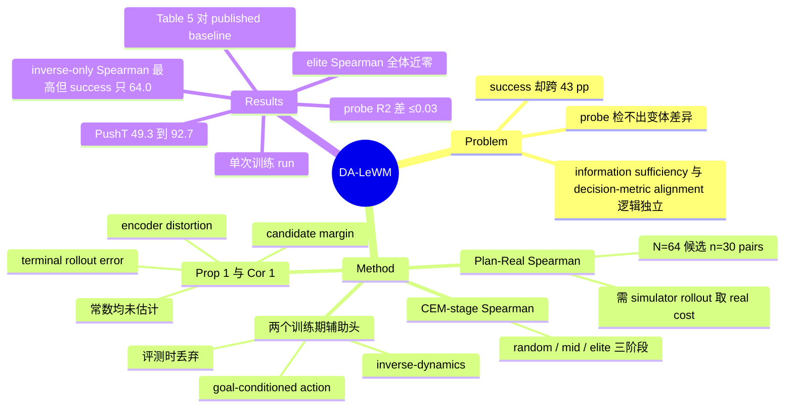

## Summary

论文把 latent world model 的评价从"latent 编码了什么"（information sufficiency）切开为"planner 实际消费的那个 Euclidean goal distance 能不能把候选动作序列按真实任务进展排序"（decision-metric alignment），并给出 Plan-Real Spearman 与 CEM-stage Spearman 两个可测诊断。据此在 LeWM 上加 inverse-dynamics 与 demonstration-conditioned goal-action 两个**只在训练期存在**的辅助头得到 DA-LeWM，PushT 一 epoch matched budget 下 online success 从 49.3±12.2% 升到 92.7±1.2%，而四个非坍缩变体的 linear probe R² 相差不超过 0.03。但两个诊断都解释不了这次提升的主要部分——inverse-only 的 Plan-Real Spearman 反而最高（+0.420）却只有 64.0% success，且 elite 阶段的 Spearman 对所有变体都在零附近。

## Problem & Motivation

JEPA 系 latent world model 做 MPC 的标准配方是：把 goal observation 编码成 $z_g$，用 $\|\hat z_H - z_g\|^2$ 当 planning cost，交给 CEM 选动作序列，从而免掉显式 reward function。作者观察到一个反常现象：训练目标的小改动会让 online planning success 大幅变化，而 state / action / reward / value 的 linear probe 却几乎不动。于是"latent 里编码了什么"这个主流问题对 planning 是不完整的。

缺的那个性质是几何性的而非信息性的。planner 的 cost 是 latent 之间的欧氏距离，所以要让候选排序追踪真实结果，latent 的度量结构必须与环境中动作后果的结构相容。论文把这两件事形式化为一对逻辑独立的性质：information sufficiency（任务量能否从 latent 解码出来）与 decision-metric alignment（latent cost 是否按环境结果排序候选）。后者是**序性质**而非数值性质——不要求 latent cost 数值上等于任何 reward，只要求排序正确。

这个 problem formulation 本身是本文最有价值的部分：它把审计对象从表示换成了 selection rule 实际消费的那个标量。

## Method

**两个诊断。** Plan-Real Spearman：对每个从 held-out 数据采的 (start, goal) 对，采 $N=64$ 条候选动作序列，同时用 world model 算 latent cost、用 simulator rollout 算 real cost $c_{\text{real}}=\|s_H-s_g\|_2$，取二者的 Spearman rank correlation，再对 $n=30$ 对求均值（constant 向量导致未定义的 pair 剔除并记录）。PushT 上 $d_{\text{task}}$ 用全部七维 simulator 坐标（agent 位置、block 位置与角度、agent 速度）的无权 L2，而不是阈值化的 online success。

CEM-stage Spearman：因为 CEM 不作用在随机 plan 上，而是迭代把候选往低 cost 区收缩，所以在 random（iter 0）/ mid（iter 15）/ elite（收敛后 top-30）三个阶段测同一个相关性，分别对应全局粗排、塑造 proposal 更新的排序、近最优候选之间的局部分辨。这个 stage-wise 设计是本文方法论上真正的新东西。

**充分条件分析。** Assumption 1 假设 pointwise terminal rollout error $\|\hat z_H - f_\theta(s_H)\|\le\epsilon_H$；Assumption 2 假设 encoder 在候选诱导的终态/目标对上 bi-Lipschitz（常数 $\mu_f\le L_f$）。Proposition 1 给出两侧界 $\mu_f c_{\text{real}}-\epsilon_H \le c_{\text{lat}} \le L_f c_{\text{real}}+\epsilon_H$，bracket 宽度分解为 encoder distortion 项与 predictor error 项。Corollary 1：若每对候选都满足 $\mu_f c^{(j)}_{\text{real}} > L_f c^{(i)}_{\text{real}} + 2\epsilon_H$，则 Plan-Real Spearman 为 $+1$；条件要求低失真 encoder（$L_f/\mu_f\to1$）与非退化的 candidate margin。作者在 Appendix D 明确声明：$\mu_f$、$L_f$、$\epsilon_H$ 都没有被估计，SIGReg 只是 collapse 的经验诊断而不认证 bi-Lipschitz。

**DA-LeWM。** 训练目标 $\mathcal L = \mathcal L_{\text{WM}} + \alpha\mathcal L_{\text{inv}} + \beta\mathcal L_{\text{goal}}$，其中 $\mathcal L_{\text{inv}}=\|h_{\text{inv}}(z_t,z_{t+1})-a_t\|^2$，$\mathcal L_{\text{goal}}=\|h_{\text{goal}}(z_t,z_g)-a_t\|^2$，$\alpha=\beta=0.1$。两个头都是 2 层 256 宽的 MLP。goal-action 监督用四帧 demonstration clip（raw offset 0/5/10/15），目标是拼接归一化后的五步 raw action block，goal 分别领先 15/10/5 步；作者明确说明目标反映的是 demonstrated progress 而非最优动作，且该头只塑造表示、不作为 policy 使用。**两个头在评测时都被丢弃**，LeWM 与 DA-LeWM 的推理期 MPC 完全相同、planning 计算量相同。

**配置。** ViT-Tiny（patch 14，224×224，latent 192 维）+ 6 层 16 头 Transformer predictor；AdamW，lr 5e-5，weight decay 1e-3，batch 128，bf16；SIGReg 权重 0.09。在线 CEM：300 samples × 30 iterations，elite 30；planning horizon 5 个 action block = 25 raw steps，receding stride 同样 5 block，eval budget 50 raw steps。评测 goal 取自 held-out demonstration 中固定 25 行偏移处的那一帧（终点 +24）。四个环境：PushT、Reacher（dmc/reacher_random）、Cube（ogbench/cube_single_expert）、TwoRoom，均为已有公开数据，不引入新数据集。

## Key Results

**信息与几何的分离（PushT，一 epoch matched budget，3 evaluation seeds × 50 episodes）。** 四个非坍缩变体的 state / action / goal-action probe R² 分别在 0.89–0.90、0.86–0.89、0.77–0.80，差异 ≤0.03；同一批变体的 online success 却跨 43 pp（LeWM 49.3±12.2 → DA-LeWM 92.7±1.2，中间 inverse-only 64.0±7.2、all-heads 71.3±4.2）。Plan-Real Spearman 从 LeWM 的 +0.280（30 对中 24 对为正）升到 action-supervised 变体的 +0.410–+0.420。

**collapse 对照。** 去掉 SIGReg 使 PushT latent cost 的 max/min dynamic range 从 3–30× 塌到 ≈1.005×（planner 对每条 plan 拿到几乎相同的目标值），success 49.3→2.0%，Plan-Real Spearman +0.280→+0.031；TwoRoom 98.0→41.3、Reacher 82.0→10.7 同向。probe 能检出这种彻底的信息丢失（state R² 降到 −6.14），但检不出四个非坍缩变体之间的差别。

**CEM 阶段分解（PushT，n=15）。** random 阶段三个 action-supervised 变体相对 LeWM 的 +0.403 有 +0.112 至 +0.133 的一致提升（paired $p\le0.012$），DA-LeWM 最高 +0.536；mid 阶段 +0.249–+0.261 vs LeWM +0.227；**elite 阶段所有变体都在零附近**（LeWM +0.036、inverse-only −0.089、all-heads −0.010、DA-LeWM −0.011）。Appendix E 的局部几何检查佐证了这点：elite 邻域内 Pearson$(\log d^z,\log d^s)$ 在所有四个变体上都只有 +0.050 到 +0.092。

**跨环境（一 epoch）。** Table 4 只有三列：PushT +43.4 pp、Cube 62.7→73.3（+10.6 pp）、Reacher 82.0→84.0（+2.0 pp，在基线波动带内）。**没有 TwoRoom 列**。Cube 因为随机 plan 常不接触物体、real cost 大量精确并列（某些 64 候选群里有大小 63 的 tie block），作者主动不报 Cube Spearman，只用 online success 比较。

**对已发表基线（Table 5，10-epoch 端点）。** DA-LeWM 98.7 / 87.3 / 80.7 / 96.0（PushT/Reacher/Cube/TwoRoom），对照 LeWM 96/86/74/87、DINO-WM 74/79/86/100、PLDM 78/78/65/97。DA-LeWM 只在 PushT 与 Reacher 排第一；Cube 落后 DINO-WM 5.3 pp，TwoRoom 同时落后 DINO-WM 与 PLDM。作者在正文里把这一节定位为"alongside published baselines"，caption 也只把"3 evaluation seeds 均值"这句限定给 DA-LeWM 行。

**$\beta$ 敏感性。** PushT：0.03→63.3±12.2，0.1→92.7±1.2，0.3→89.3±3.1。Reacher 上 $\beta=0.3$ 回退到 78.0%，低于 LeWM 基线的 82.0%——这是选 0.1 作跨环境默认值的原因，也说明该头并非无条件有益。

**机制签名（Claim 1）。** 在 38,400 条 held-out PushT transition 上，latent 位移幅度与动作幅度的全局 rank correlation 从 LeWM 的 −0.03 升到 inverse-only 的 +0.38 与 DA-LeWM 的 +0.43（无 SIGReg 时 −0.13）。作者明确标注"the claim is mechanistic, not a theorem"，并承认 inverse head 原则上可以用方向而非模长结构恢复动作。

## Evidence Ledger

| Claim ID | Claim | Type | Source locator | Evidence excerpt | Status |
|:--|:--|:--|:--|:--|:--|
| C1 | PushT 一 epoch matched budget：DA-LeWM 92.7±1.2% vs LeWM 49.3±12.2%（+43.4 pp） | number | §5 Table 4 + 正文 | "DA-LeWM improves PushT by 43.4 pp and Cube by 10.6 pp" | source-verified |
| C2 | PushT Plan-Real Spearman：LeWM +0.280 (24/30)、No-SIGReg +0.031 (14/30)、Inverse-only +0.420 (30/30)、All-heads +0.410 (30/30)、DA-LeWM +0.412 (29/30) | number | §5 Table 2 | "LeWM +0.280 24 \| Inverse-only +0.420 30 \| DA-LeWM +0.412 29" | source-verified |
| C3 | elite-stage Spearman 对每个变体都接近零（+0.036 / −0.102 / −0.089 / −0.010 / −0.011） | number | §5 Table 3 | "Elite-stage correlations are near zero for every variant, indicating shared local saturation." | source-verified |
| C4 | random-stage：LeWM +0.403，三个 action-supervised 变体 +0.112~+0.133 增益（paired p≤0.012），DA-LeWM 最高 +0.536 | number | §5 Table 3 + 正文 | "random-stage gains of +0.112 to +0.133 (paired p≤0.012), with DA-LeWM highest at +0.536" | source-verified |
| C5 | 四个非坍缩变体 probe R² 差 ≤0.03，online success 跨 43 pp | number | §5 + Appendix C Table 6 caption | "probe scores change by less than 0.03 in R2 while online success spans 43 percentage points" | source-verified |
| C6 | Inverse-only 的 Plan-Real Spearman 最高（+0.420）却只有 64.0% success；DA-LeWM +0.412 却 92.7%——诊断与 success 的变体排序不一致 | comparison | §5 Table 2 + Table 6 + 正文 | "inverse-only raises Plan-Real Spearman from +0.280 to +0.420 and online success from 49.3% to 64.0%. DA-LeWM retains a similar +0.412" | source-verified |
| C7 | Table 5 的 LeWM/PLDM/DINO-WM 是 published baseline 数字，非作者同预算复跑；caption 只把 3-seed 均值这句给 DA-LeWM 行 | benchmark-setting | §5 "Evaluation sequence" + Table 5 caption | "Table 5 places DA-LeWM alongside published baselines"; "DA-LeWM values are means over 3 evaluation seeds." | source-verified |
| C8 | Table 5 数值：DA-LeWM 98.7/87.3/80.7/96.0；LeWM 96/86/74/87；DINO-WM 74/79/86/100；PLDM 78/78/65/97；DA-LeWM 仅 PushT、Reacher 第一 | number | §5 Table 5 + 正文 | "On Cube, it surpasses PLDM and remains within 5.3 pp of DINO-WM. On TwoRoom, it reaches 96.0%, within 1.0 pp of PLDM" | source-verified |
| C9 | 去 SIGReg 使 PushT latent-cost dynamic range 从 3–30× 塌到 ≈1.005×；success 49.3→2.0、Spearman +0.280→+0.031；TwoRoom 98.0→41.3、Reacher 82.0→10.7 | number | §5 "SIGReg Preserves Cost-Surface Variation" + Table 1 | "Removing SIGReg contracts this ratio from 3-30× to ≈1.005×" | source-verified |
| C10 | Claim 1：inverse-action 训练把 ‖Δz‖–‖a‖ 全局 rank correlation 从 −0.03 提到 +0.38 / +0.43（无 SIGReg 为 −0.13），测于 38,400 条 held-out transition；论文自陈 mechanistic 而非定理 | causal-mechanism | §4 Claim 1 + Appendix B | "The claim is mechanistic, not a theorem." | source-verified |
| C11 | 每个配置只有一次训练 run，±std 只覆盖 evaluation 变异（3 seeds × 50 episodes = 150 episodes） | benchmark-setting | §7 Limitations + Appendix A | "Each configuration has one training run, so uncertainty covers evaluation variation rather than training-initialization variation" | source-verified |
| C12 | Cube 不报 Spearman：no-contact ties 导致 real cost 大量并列，某些 64 候选群含大小 63 的 tie block | benchmark-setting | Appendix G + §5 "Diagnostic scope" | "Some 64-candidate populations contain a tie block of size 63" | source-verified |
| C13 | all-heads 的 R/V proxy target 用了与 stored PushT state layout 不匹配的坐标，未重训修正版，因此只作 exploratory ablation | number | Appendix A "Reward and value proxy targets" | "these coordinates do not match the intended block-pose fields, and no corrected all-heads checkpoint was trained" | source-verified |
| C14 | β sweep：0.03→63.3±12.2、0.1→92.7±1.2、0.3→89.3±3.1；Reacher 上 β=0.3 回退到 78.0%，低于 LeWM 82.0% | number | Appendix C | "On Reacher, β=0.3 regresses to 78.0% (vs. 84.0% at β=0.1 and 82.0% LeWM baseline)" | source-verified |
| C15 | 辅助头只在训练期使用、评测时丢弃；LeWM 与 DA-LeWM 推理期 MPC 与 planning 计算量相同 | benchmark-setting | §5 "Learning Dynamics under a Larger Budget" | "The auxiliary heads are used only during training and are discarded at evaluation." | source-verified |
| C16 | TwoRoom：Table 1 的 LeWM 一 epoch success 98.0±2.0 高于 Table 5 中 DA-LeWM 的 10-epoch 96.0（该表 LeWM 参照值为 87） | comparison | §5 Table 1 vs Table 5（"一 epoch"由 Appendix A "matched-budget ablations train every variant for one epoch" 给出） | Table 1 "TwoRoom 98.0±2.0"；Table 5 "LeWM 87 / DA-LeWM 96.0" | source-verified |
| C17 | ViT-Tiny patch14 / 224² / latent 192；6 层 16 头 predictor；AdamW lr 5e-5、wd 1e-3、bs 128；λ_sig 0.09；α=β=0.1；CEM 300×30、elite 30；H=5 blocks=25 raw steps；eval budget 50 raw steps；Plan-Real N=64 × n=30，CEM-stage n=15 | number | Appendix A 各表 | "ViT-Tiny backbone with patch size 14 and image resolution 224×224… latent embedding of dimension 192" | source-verified |
| C18 | arXiv abs 页与正文均未给出代码库或项目页 URL；只声明实现建在开源 LeWM codebase 之上；license CC BY 4.0 | license-code | Appendix A + arXiv abs 页（无 Comments 字段） | "The implementation is built on top of the open-source LeWM codebase" | source-verified |
| C19 | 作者列表在 arXiv abs 页与 v1 HTML 之间**顺序不一致**（abs 页第 2/3 位为 Ke Rui, Yushen Zuo；HTML 为 Yushen Zuo, Ke Rui）；v1 HTML 不含任何机构名，只有脚注标记 1/2 与通讯邮箱 | metadata | abs 页作者行 vs HTML title block | abs: "Jiawei Wang, Ke Rui, Yushen Zuo, …"；HTML: "Jiawei Wang / Yushen Zuo / Ke Rui / …" | **contradicted** — 已按 abs 页顺序采用并就地标注歧义；`institute` 留空 |
| C20 | 四个环境数据来自 pusht_expert_train、dmc/reacher_random、ogbench/cube_single_expert、tworoom；不引入新数据集 | number | Appendix A "Datasets" | "This work introduces no new dataset" | source-verified（provenance 列 Reacher 为 "Control Suite / LeWM"、Cube 为 "OGBench / LeWM"，非 LeWM release） |
| C21 | Appendix E：elite 邻域 Pearson(log d^z, log d^s) 在四个变体上一律偏低（+0.050~+0.092），无任何辅助头配置改善近最优候选间的局部对应 | causal-mechanism | Appendix E Table 7 + 正文 | "uniformly low (+0.050–+0.092) across all four variants" | source-verified |
| C22 | 一 epoch Table 4：Reacher 82.0±2.0→84.0±3.5、Cube 62.7±4.2→73.3±1.2；Table 4 **无 TwoRoom 列** | number | §5 Table 4 | Table 4 列头为 "PushT \| Reacher \| Cube" | source-verified |
| C23 | learning-dynamics 用 matched 100-epoch schedule 但只分析前十个 checkpoint，以 epoch 10 为预先指定的共同终点，不做 per-method best epoch 选择 | number | Appendix A + Appendix H | "use epoch 10 as a common, pre-specified endpoint" | source-verified |
| C24 | 硬件为单卡 A100-SXM4-80GB / A800-SXM4-80GB；主实验**未报告**总训练 wall-clock 或 GPU-hour（只有 Appendix E 诊断的 ≈9 分钟） | number | Appendix A "Computing Infrastructure" + Appendix E | "Total wall-clock for the four variants … is ≈9 minutes" | source-verified |

## Strengths & Weaknesses

**问题被问对了。** 本文最有价值的不是 DA-LeWM 而是那句 problem formulation：审计对象应该是 selection rule 实际消费的那个标量，而不是表示本身。probe 检不出四个变体的差别却存在 43 pp 的 success 落差，这个证据组合足以说明"表示质量"与"决策可用性"是两件事。把它抽象出来就是一条对整个 agenda 都成立的原则——你测的量必须是 selection 真正据以排序的那个量。

**内部对照做得干净。** 同一 backbone、同一 CEM 预算、matched training randomness、辅助头评测期丢弃（因而推理算力严格相同）、all-heads / inverse-only / DA-LeWM 三档组件级 ablation 齐备、失败的 R/V proxy 主动标注为 bug 而非静默保留、Cube 上因 tie 无法给出 Spearman 时直接放弃该指标而不是硬报。诚实度在同类工作里属于上乘。

**但组件级 ablation 得到的结论恰恰证伪了论文的解释框架。** inverse-only 拿走了几乎全部 ranking lift（Plan-Real +0.420，是所有变体里最高的），却只换来 64.0% success；再加 goal-action head 之后 Plan-Real 反而略降到 +0.412、random-stage 只从 +0.523 到 +0.536，success 却从 64.0 跳到 92.7——**方法里贡献最大的那个组件（+28.7 pp）在两个诊断上几乎不留痕迹**。也就是说 decision-metric alignment 能区分"有没有 action 监督"，但无法区分"哪种 action 监督管用"，而后者才是本文 headline 数字的来源。作者的措辞（"the combined objective is associated with the additional online lift"）已经很小心，但全文没有为 goal-action head 的收益给出任何机制假设。

**stage-wise 诊断的最强结论是自我否定的。** 文章的 pitch 是"CEM 执行的是 elite candidate，所以不能只看随机 plan"。测完的结果是所有变体的 elite Spearman 都在零附近甚至为负，Appendix E 的局部几何 Pearson 只有 +0.05~+0.09。换句话说：在 planner 真正据以下决定的那个局部区域，latent cost 与真实 cost 基本无关，而 success 却能达到 92.7%。这留下一个未回答的核心问题——如果 elite 内排序是噪声，成功从哪来？可能的答案（random 阶段的粗排把 proposal 推进了好区域，之后的精排无所谓）会把整个故事从"排序质量"改写成"proposal 初始化质量"，那是完全不同的机制。论文提出了这个诊断，也承认了这个观测，但没有追下去。

**budget-matched 的三轴里，监督量这一轴没有对齐。** 算力轴（epoch 数、backbone、优化器）与 rollout 轴（CEM 300×30、top-30，全变体一致）对得很齐，这是加分项。但标注轴不齐：LeWM 只用 action-conditioned prediction loss，DA-LeWM 额外把 demonstration 的动作当**回归目标**消费了两次（inverse 与 goal-action）。虽然用的是同一份 expert 数据集，"matched training budget" 匹配的是 epoch 数而不是监督信号量，论文没有讨论这一不对称，也没有做"给 LeWM 同等 action-regression 预算但换个目标"的对照。

**baseline 处在学习曲线陡峭段，43.4 pp 被放大了。** 一 epoch 下 LeWM 在 PushT 只有 49.3%（±12.2 的 seed 抖动本身就很大），而 Table 5 里 published LeWM 是 96——相差 46.7 pp。在一个严重欠训的 baseline 上，任何加速收敛的辅助 loss 都会被换算成巨大的百分点差。作者用 10-epoch 学习曲线部分回应了这一质疑，但到 epoch 10 时 PushT 的差距已经缩到 2.7 pp。更麻烦的是外部比较（Table 5）用的是 published 数字而非同预算复跑，DA-LeWM 在 Cube 落后 DINO-WM 5.3 pp、TwoRoom 同时落后 DINO-WM 与 PLDM；再叠加 C16——Table 1 里 LeWM 一 epoch 的 TwoRoom 就有 98.0，高于 DA-LeWM 十 epoch 的 96.0——摘要里"across all our experiments … higher online success than LeWM"这句只在各自表内的配对比较下成立，跨表读会立刻碰到反例。

**统计功效不足。** 每个配置一次训练 run，误差棒只覆盖 evaluation 变异。全文没有报告主实验的 GPU-hour 或 wall-clock（只有 Appendix E 诊断的 ≈9 分钟），因此读者无法判断多跑几个训练 seed 的代价是否真的不可承受。

**oracle 与 execution externality 明显。** 两个诊断都需要在真实 simulator 里 rollout 每一条候选来拿 $c_{\text{real}}$——PushT 上是 30 pairs × 64 candidates，CEM-stage 更是 15 pairs × 300 candidates × 30 iterations。这是评测期才有的 privileged 信息，且只在可任意 reset 的 simulator 里拿得到；诊断本身既不免费也不可部署。评测 goal 取自 held-out demonstration 中固定 25 行偏移处的一帧，作者明说这"保证 goal latent 落在数据分布内且可达"——这是一个 benign convention，把"goal 是否 in-distribution、是否可达"这一整块难度从方法侧移走了。

**evaluator convention 吸走了难度。** success 是阈值判定（PushT 要求 agent+block 的 xy L2 < 20 且 block 角差 < π/9），eval budget 50 raw steps 而 planning horizon 25 raw steps——整个 episode 只需两次 receding-horizon replan。短 horizon + 宽阈值让百分点跨度更容易被拉开，而论文没有报告阈值敏感性；一个把 49.3→92.7 的差距按 threshold 扫一遍的图会很有说服力，但没有。

**理论部分诚实但不产生约束。** Prop 1 / Cor 1 是充分条件，Appendix D 主动声明 $\mu_f$、$L_f$、$\epsilon_H$ 都未被估计、SIGReg 不蕴含 bi-Lipschitz。这份自律值得肯定，但代价是理论只提供了词汇（encoder distortion / rollout error / candidate margin）而没有对方法设计施加任何约束——DA-LeWM 的两个头并不是从这个界推出来的。

**迁移到 GUI / web 时会破的前提**（本 vault 关心的角度）：其一，$c_{\text{real}}$ 需要 simulator rollout 与可重置状态，真实 GUI/web 两者都没有，Plan-Real 与 CEM-stage 无法在目标域测量。其二，goal 是一张 demonstration 观测帧、cost 是像素编码后的欧氏距离；GUI 状态转移是离散跳变，两个视觉上相近的截图可能处于完全不同的可达性区域（登录前后的同一页面），"latent 距离连续下降 ≈ 任务进展"这一几何前提不成立。其三，动作空间是 ≤5 维连续向量因而 CEM 采 300 条候选可行；GUI 动作是离散+参数化（click(x,y) / type(str)），CEM 这一层直接换掉，而本文所有诊断都是绑定 CEM 采样阶段定义的。其四，25 raw steps、两次 replan 的 horizon 与 GUI 长程任务不在一个量级，compounding error 的表现会完全不同。真正可迁移的只有那个提问方式本身——对 GUI 的 step-level verifier / progress estimator / reward model，同样应该问"你这个分数能不能把候选动作按真实进展排序"，而不是问"它的分类准确率多少"。

## Mind Map

## Notes

**库内关联。**

- [[Topics/WorldModel-Survey]] 的路线 18 已经收敛出"world model 只当训练信号、部署期整体丢弃"这一 WAM 默认工程形态（[[Papers/2608-SimWAM]] / [[Papers/2608-JEPAWAM]] / [[Papers/2608-WorldTokens]] / [[Papers/2607-STWAM]]）。本文是同一拓扑在 **planning 侧**的版本：辅助头塑造共享表示、推理期整体移除、planner 一行代码不改。差别在于它给出了一个可测的中间变量（latent cost 的排序质量）来解释这种拓扑为什么有效——这是前面几篇缺的那块。
- 与 [[Papers/2607-PhiZero]]（生成保真第一但物理判别接近随机）构成同一族证据的第三个实例：**在某个代理指标上做得好，不蕴含在下游使用该表示的那个 selection rule 上做得好**。PhiZero 是生成 vs 判别，本文是 decoding vs ranking。survey 的路线 12 应该把本文并进去。
- [[Papers/2608-WorldSimProbe]] 的 Observable Simulator Contract 与本文是互补的两半：WorldSimProbe 审计"生成的未来是否被 supplied action 物理诱导"（保真度侧），本文审计"这个未来被压成一个标量后还能不能排序"（决策侧）。一个 ACWM 完全可能通过前者而挂在后者上，反之亦然。这一对可以在 survey 里成段写。
- [[Papers/2607-WorldActionPlanner]] 把 policy 降级为工具、规划全程在想象中完成，与本文共享同一个脆弱点：想象空间里的排序质量从未被独立测量。本文的 Plan-Real Spearman 正好是给那类工作准备的审计工具，而它给出的答案（elite 阶段近零）对"纯想象规划"是个坏消息。
- 对 [[Topics/StepCreditAssignment-Survey]] 与 [[Topics/Harness-Component-Attribution]]：本文的 elite-stage 发现有直接类比——GUI agent 的 step-level verifier 通常在**随机采样的候选步**上报 AUC，但 agent 实际要区分的是 rollout 收敛后彼此高度相似的几个候选动作。本文提供了现成的实验形状（在 selection 过程的不同阶段分别测 ranking 一致性），迁到 GUI 上不需要 simulator，只需要一个能重放的 harness trace 与人工 step-level 标注。
- [[Papers/2608-DreamGuard]] 与 [[Papers/2608-AppDeltaWorld]] 在 digital 侧共享的未解缺口是"彩排保真度从未被直接测量、状态等价判定缺失"；本文对 physical 侧同一缺口给出的答案是——即使保真度够（probe R² 0.90），planner 消费的那个度量仍可能在关键区域失效。这条应写进 [[Topics/WorldModel-Survey]] 的路线 19。
- 底层表示血缘：[[Papers/2506-VJEPA2]] → LeWM → 本文；[[Papers/2607-WCM]] 是同一思路在 critic 侧的版本（让 critic 兼预测下一帧 latent），两者都属于"用辅助预测目标改造下游决策模块所消费的表示"。

**最该做而没做的实验（一句话）：把 CEM 的 elite 集合冻住，用 real cost 的 oracle 排序替换 latent cost 排序去选最终动作——如果 online success 不涨，那么 92.7% 就与 elite 内排序无关，整篇文章的 decision-metric alignment 叙事必须改写成"proposal 分布被推到哪里"而不是"候选被排得多准"。**

**待查。** frontmatter 的 `institute` 留空：v1 HTML 只给了脚注标记 1/2 与通讯邮箱（域名暗示 USTC 但论文未写明），无任何机构名。作者顺序在 arXiv abs 页与 v1 HTML 之间不一致（第 2、3 位互换），此处采用 abs 页顺序；若后续版本给出机构或统一顺序需回填。
